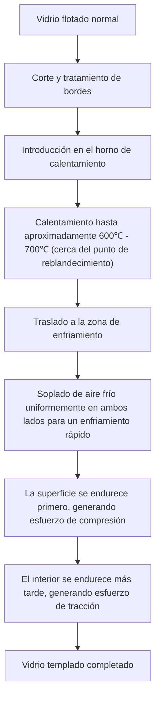
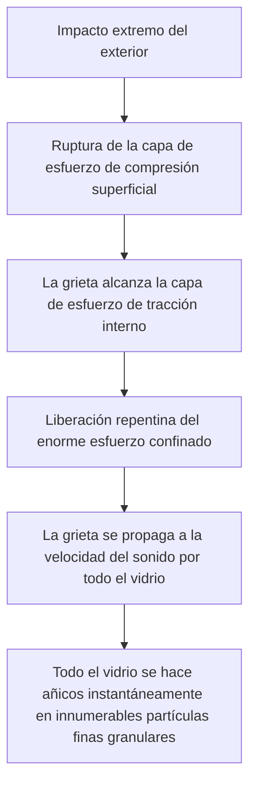

# ¿Qué es el vidrio templado?

Los teléfonos inteligentes que tocamos todos los días, las ventanas laterales de los automóviles y las grandes puertas de vidrio de las oficinas. Lo que todos estos tienen en común es el uso de 'vidrio templado' (Tempered Glass). El vidrio templado cuenta con una resistencia de 3 a 5 veces mayor en comparación con el vidrio normal (vidrio flotado). Sin embargo, su verdadero valor no es simplemente que sea 'difícil de romper'. Radica en su 'diseño de seguridad', de modo que, en el improbable caso de que se rompa, se hace añicos en pequeños fragmentos granulares en lugar de convertirse en fragmentos afilados como cuchillas.

En este artículo, profundizaremos en por qué el vidrio templado es fuerte, el proceso de fabricación por el que pasa y por qué se hace añicos cuando se rompe, desde la perspectiva de su mecanismo físico y la ingeniería de materiales.

## 1. Diferencias con el vidrio flotado normal

Primero, entendamos el vidrio normal (vidrio flotado). El vidrio flotado se fabrica mediante el 'proceso de flotado', donde el vidrio fundido se hace flotar sobre estaño fundido para formar una lámina plana. Este vidrio es muy transparente y liso, pero no es muy resistente a los impactos físicos o los cambios térmicos.

Cuando el vidrio flotado se rompe, las grietas se propagan libremente, lo que resulta en fragmentos muy afilados y peligrosos (fracturas de ángulos agudos). Esto se debe a que la tensión interna es uniforme y la energía de fractura se concentra en las puntas de las grietas, avanzando todo a la vez.

Por otro lado, el vidrio templado es este vidrio flotado procesado mediante un tratamiento térmico (o tratamiento químico) especial. Su apariencia y transmitancia de luz apenas cambian, pero en su interior se encierra una 'tormenta de tensiones' invisible.

## 2. Proceso de fabricación del vidrio templado: calentamiento a alta temperatura y enfriamiento rápido

El secreto de la fuerza del vidrio templado reside en su proceso de fabricación. Veamos el proceso más común, el 'método de templado por enfriamiento con aire'.

### Proceso de calentamiento
El vidrio se calienta a unos 600℃ - 700℃, cerca de su punto de reblandecimiento. A esta temperatura, el vidrio aún no se ha derretido, pero las moléculas internas se vuelven ligeramente móviles y entran en un estado donde la tensión se libera (estado viscoelástico).

### Proceso de enfriamiento rápido (Quenching)
El vidrio calentado se mueve a la zona de enfriamiento, donde se sopla aire frío a alta presión de manera uniforme y potente desde ambos lados. Este 'enfriamiento rápido' es la clave mágica.

1. **Endurecimiento de la superficie**: La superficie del vidrio, en contacto directo con el aire frío, se enfría rápidamente y se solidifica.
2. **Contracción interna**: Incluso después de que la superficie se ha solidificado, el interior del vidrio aún está caliente y permanece en un estado expandido. Sin embargo, con un retraso, el interior también se enfría gradualmente e intenta contraerse.
3. **Fijación del esfuerzo**: Cuando el interior intenta contraerse, la superficie ya sólida tira de él. Como resultado, una 'fuerza que empuja hacia adentro (esfuerzo de compresión)' en la superficie del vidrio, y una 'fuerza que tira hacia afuera (esfuerzo de tracción)' en el interior quedan permanentemente fijadas.

## 3. El exquisito equilibrio entre el esfuerzo de compresión y el esfuerzo de tracción

La resistencia del vidrio templado está compuesta por el equilibrio de este **'esfuerzo de compresión superficial'** y el **'esfuerzo de tracción interno'**.

El vidrio como material es en realidad muy resistente a la 'fuerza de empuje (compresión)', pero tiene la propiedad de ser débil a la 'fuerza de tracción (tensión)'. Cuando un objeto golpea un vidrio normal y se dobla, se genera un 'esfuerzo de tracción' en la superficie opuesta al impacto, y a partir de ahí se forma una grieta y se rompe.

Sin embargo, en el caso del vidrio templado, ya se aplica un fuerte 'esfuerzo de compresión' a la superficie por adelantado. Incluso si el vidrio se dobla debido a un impacto externo y actúa una fuerza para tirar de la superficie, el esfuerzo de compresión original la contrarresta. En otras palabras, a menos que el esfuerzo de tracción debido al impacto supere el esfuerzo de compresión superficial, el vidrio no se agrietará.

Esta es la razón por la que el vidrio templado es de 3 a 5 veces más fuerte que el vidrio normal.

## 4. Mecanismo de seguridad al romperse (fractura granular)

Otra, y la mayor, característica del vidrio templado es 'cómo se rompe'.

En el interior del vidrio templado está confinado un enorme 'esfuerzo de tracción'. Esto es como un resorte fijado en un estado estirado hasta su límite. ¿Qué pasaría si, por alguna razón (como perforar la capa de esfuerzo de compresión de la superficie con algo muy afilado, o un fuerte impacto en el borde), se produce una grieta en el vidrio y este equilibrio de esfuerzo colapsa?

En el instante en que la grieta llega a la capa de esfuerzo de tracción interno, la energía confinada se libera de una vez. Debido a la liberación de esta energía, la grieta se propaga por todo el vidrio a una velocidad de varios miles de metros por segundo, rompiendo el vidrio instantáneamente en pedazos.

Los fragmentos producidos en este momento se convierten en finas partículas en forma de cubo o redondeadas (fractura granular). Esto se debe a que el esfuerzo interno se cruza como una red, y la energía se dispersa finamente y se libera. Estos pequeños fragmentos no tienen bordes afilados como el vidrio normal, por lo que el riesgo de sufrir cortes graves al golpear el cuerpo humano se reduce drásticamente. Esta es la razón por la que el vidrio templado es obligatorio para las ventanas de los automóviles y las puertas de las duchas.

## 5. Debilidades y precauciones del vidrio templado

Incluso el vidrio templado, que parece perfecto, tiene algunas debilidades.

1. **Vulnerable a los impactos en los bordes**: Aunque la superficie es de vidrio templado muy fuerte, los bordes cortados son estructuralmente inestables en el equilibrio de tensiones, y si se aplica un impacto aquí, todo se hará añicos fácilmente.
2. **Imposibilidad de procesamiento**: Después del tratamiento de templado, es absolutamente imposible cortarlo o perforarlo. Si se hace el más mínimo rasguño, el equilibrio de tensiones colapsará y se romperá de forma explosiva, por lo que todos los cortes y perforaciones deben realizarse antes del tratamiento térmico.
3. **Rotura espontánea (explosión espontánea)**: Muy raramente, debido a una impureza llamada sulfuro de níquel (NiS) contenida en la materia prima del vidrio, el vidrio puede romperse repentinamente sin recibir ningún impacto. El NiS tiene la propiedad de expandirse en volumen con el paso del tiempo y los cambios de temperatura, y esto actúa como un desencadenante para alterar el equilibrio de tensiones internas. Para evitar esto, a veces se toman medidas como realizar una prueba de inmersión en calor (prueba de recalentamiento) después de la fabricación para romper previamente los productos defectuosos.

## 6. Conclusión

El vidrio templado no es simplemente un vidrio grueso y resistente. Utilizando la energía térmica, encierra 'fuerza' dentro del propio vidrio, contrarresta los impactos externos con esa fuerza, y en caso de emergencia, protege a las personas rompiéndose en pedazos. Es un cristal de ingeniería de materiales sumamente avanzado.

'No romperse' y 'romperse de forma segura'. El mecanismo del vidrio templado, que logra ambas cosas, continúa protegiendo nuestras vidas de manera silenciosa y poderosa. En las pantallas y materiales de construcción de próxima generación, esta tecnología de control de tensiones evolucionará aún más y se desarrollará en materiales de vidrio más delgados, fuertes y seguros.
