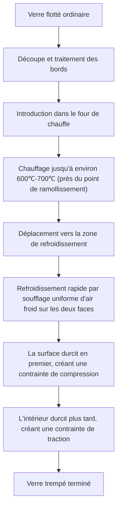
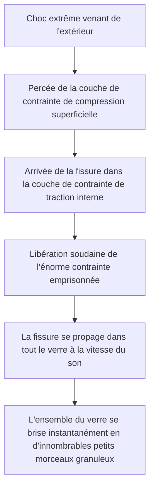

# Qu'est-ce que le verre trempé ?

Les smartphones que nous touchons quotidiennement, les vitres latérales des voitures et les grandes portes en verre des bureaux. Le point commun entre tous ces éléments est l'utilisation du « verre trempé » (Tempered Glass). Le verre trempé est 3 à 5 fois plus résistant qu'un verre ordinaire (verre flotté). Cependant, sa véritable valeur ne réside pas seulement dans le fait qu'il est « difficile à casser ». En cas de bris, au lieu de se transformer en éclats tranchants comme des lames acérées, il se brise en petits morceaux granuleux grâce à sa « conception de sécurité ».

Dans cet article, nous allons explorer en profondeur, du point de vue des mécanismes physiques et de l'ingénierie des matériaux, pourquoi le verre trempé est si résistant, par quel processus de fabrication il passe, et pourquoi il se brise en mille morceaux lorsqu'il se casse.

## 1. Différence avec le verre flotté ordinaire

Tout d'abord, comprenons le verre ordinaire (verre flotté). Le verre flotté est fabriqué selon le « procédé de flottage », qui consiste à faire flotter du verre en fusion sur de l'étain en fusion pour former une plaque lisse. Ce verre est très transparent et lisse, mais il n'est pas très résistant aux chocs physiques ou aux variations thermiques.

Lorsque le verre flotté se brise, les fissures se propagent librement, ce qui donne des éclats très tranchants et dangereux (fracture à angles aigus). Cela s'explique par le fait que les contraintes internes sont uniformes et que l'énergie de rupture se concentre à l'extrémité de la fissure pour progresser d'un seul coup.

D'autre part, le verre trempé est fabriqué en soumettant ce verre flotté à un traitement thermique (ou chimique) spécial. Son apparence et sa transmission lumineuse restent presque inchangées, mais à l'intérieur, une « tempête de contraintes » invisible est emprisonnée.

## 2. Processus de fabrication du verre trempé : chauffage à haute température et refroidissement rapide

Le secret de la résistance du verre trempé réside dans son processus de fabrication. Regardons le processus de la méthode de « trempe thermique » la plus courante.

### Étape de chauffage
Le verre est chauffé jusqu'à environ 600℃ à 700℃, près de son point de ramollissement. À cette température, le verre n'est pas encore fondu, mais les molécules internes deviennent légèrement plus mobiles et les contraintes sont relâchées (état viscoélastique).

### Étape de refroidissement rapide (Trempe)
Le verre chauffé est déplacé vers la zone de refroidissement, où de l'air froid à haute pression est soufflé de manière puissante et uniforme sur ses deux faces. Ce « refroidissement rapide » est la clé magique.

1. **Durcissement de la surface** : La surface du verre directement exposée à l'air froid se refroidit et se solidifie rapidement.
2. **Contraction interne** : Même après que la surface se soit solidifiée, l'intérieur du verre est encore chaud et maintient un état dilaté. Cependant, avec un décalage temporel, l'intérieur tente également de se refroidir et de se contracter progressivement.
3. **Fixation des contraintes** : Lorsque l'intérieur tente de se contracter, la surface déjà solidifiée le tire en retour. Par conséquent, une « force poussant vers l'intérieur (contrainte de compression) » est emprisonnée de manière permanente à la surface du verre, tandis qu'une « force tirant vers l'extérieur (contrainte de traction) » est fixée à l'intérieur.

## 3. L'équilibre parfait entre contrainte de compression et contrainte de traction

La résistance du verre trempé repose sur l'équilibre entre cette **« contrainte de compression superficielle »** et cette **« contrainte de traction interne »**.

Le verre, en tant que matériau, est en fait très résistant à la « force de poussée (compression) », mais il a la propriété d'être faible face à la « force de traction (tension) ». Lorsqu'un objet frappe un verre ordinaire et le fait plier, une « contrainte de traction » est générée sur la surface opposée à l'impact, et une fissure s'y forme et se brise.

Cependant, dans le cas du verre trempé, une puissante « contrainte de compression » est déjà appliquée à la surface à l'avance. Même si le verre est courbé par un choc externe et qu'une force tente de tirer sur la surface, la contrainte de compression d'origine l'annule. En d'autres termes, à moins que la contrainte de traction due à l'impact ne dépasse la contrainte de compression superficielle, le verre ne se fissurera pas.

C'est la raison pour laquelle le verre trempé est 3 à 5 fois plus résistant que le verre ordinaire.

## 4. Mécanisme de sécurité lors du bris (Fracture granulaire)

Une autre caractéristique, et la plus importante, du verre trempé est la « façon dont il se brise ».

Une énorme « contrainte de traction » est enfermée à l'intérieur du verre trempé. C'est comme si un ressort était étiré à sa limite et fixé dans cet état. Que se passerait-il si, pour une raison quelconque (un objet très pointu perçant la couche de contrainte de compression superficielle, ou un fort impact sur le bord), une fissure se formait dans le verre et que cet équilibre des contraintes était rompu ?

Au moment où la fissure atteint la couche de contrainte de traction interne, l'énergie emprisonnée est libérée d'un seul coup. Grâce à la libération de cette énergie, la fissure se propage à travers l'ensemble du verre à une vitesse de plusieurs milliers de mètres par seconde, pulvérisant instantanément le verre en mille morceaux.

Les éclats produits à ce moment-là deviennent de petits morceaux cubiques ou arrondis (fracture granulaire). Cela est dû au fait que les contraintes internes s'entrecroisent comme un maillage, et l'énergie est dispersée finement lors de sa libération. Ces petits éclats n'ont pas de bords tranchants comme le verre ordinaire, de sorte que le risque de coupures graves est considérablement réduit s'ils touchent le corps humain. C'est la raison pour laquelle le verre trempé est obligatoire pour les vitres des voitures et les portes des cabines de douche.

## 5. Faiblesses et précautions du verre trempé

Même le verre trempé, qui semble parfait, a quelques faiblesses.

1. **Vulnérabilité aux chocs sur les bords (arêtes)** : Bien que la surface du verre trempé soit très résistante, les bords coupés ont structurellement un équilibre de contrainte instable, et si un choc y est appliqué, l'ensemble se brisera facilement.
2. **Usinage impossible** : Il est absolument impossible de couper ou de percer des trous après le traitement de trempe. La moindre rayure perturberait l'équilibre des contraintes et provoquerait une rupture explosive, de sorte que toutes les découpes et perçages doivent être effectués avant le traitement thermique.
3. **Casse spontanée (explosion spontanée)** : Bien que cela soit très rare, il arrive que le verre se brise soudainement sans subir aucun choc à cause d'une impureté appelée sulfure de nickel (NiS) contenue dans la matière première du verre. Le NiS a la propriété de se dilater en volume avec le temps et les changements de température, et cela agit comme un déclencheur qui rompt l'équilibre des contraintes internes. Pour éviter cela, on effectue parfois un test Heat Soak (test de réchauffage) après la fabrication pour briser à l'avance les produits défectueux.

## 6. Résumé

Le verre trempé n'est pas seulement un verre épais et robuste. C'est l'aboutissement d'une ingénierie des matériaux très avancée, qui utilise l'énergie thermique pour emprisonner une « force » à l'intérieur du verre lui-même, annule les chocs externes grâce à cette force, et protège les humains en se brisant en mille morceaux en cas d'urgence.

« Ne pas se casser » et « se casser en toute sécurité ». Le mécanisme du verre trempé, qui combine ces deux aspects, continue de protéger nos vies de manière silencieuse et puissante. Pour les écrans et les matériaux de construction de la prochaine génération, cette technologie de contrôle des contraintes évoluera encore davantage, conduisant au développement de matériaux en verre plus fins, plus résistants et plus sûrs.
