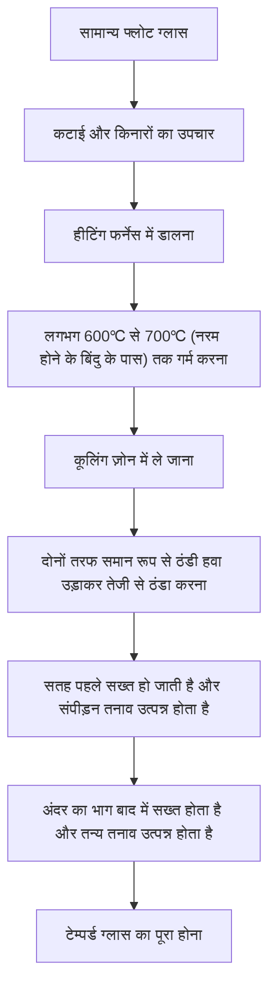
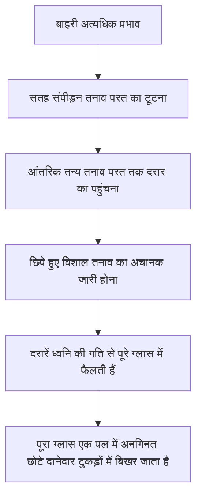

# टेम्पर्ड ग्लास क्या है?

हम अपने दैनिक जीवन में स्मार्टफोन, कारों की साइड विंडो और कार्यालयों के बड़े कांच के दरवाजों के संपर्क में आते हैं। इन सभी में एक बात समान है और वह है 'टेम्पर्ड ग्लास' (Tempered Glass) का उपयोग। टेम्पर्ड ग्लास सामान्य ग्लास (फ्लोट ग्लास) की तुलना में 3 से 5 गुना अधिक मजबूत होता है। हालांकि, इसका असली मूल्य केवल इसके 'कठिन टूटने' में नहीं है। यदि यह टूट जाता है, तो यह तेज धार वाले टुकड़ों में नहीं बदलता है, बल्कि छोटे दानेदार टुकड़ों में बिखर जाता है, जिसे 'सुरक्षित डिज़ाइन' कहा जाता है।

इस लेख में, हम टेम्पर्ड ग्लास के मजबूत होने के कारणों, इसकी निर्माण प्रक्रिया, और टूटने पर यह छोटे टुकड़ों में क्यों बिखर जाता है, इसके भौतिक तंत्र और सामग्री इंजीनियरिंग के दृष्टिकोण से गहराई से चर्चा करेंगे।

## 1. सामान्य फ्लोट ग्लास से अंतर

सबसे पहले, आइए सामान्य ग्लास (फ्लोट ग्लास) के बारे में समझते हैं। फ्लोट ग्लास 'फ्लोट प्रक्रिया' द्वारा बनाया जाता है, जिसमें पिघले हुए ग्लास को पिघले हुए टिन पर तैराकर एक सपाट प्लेट का आकार दिया जाता है। यह ग्लास अत्यधिक पारदर्शी और चिकना होता है, लेकिन भौतिक प्रभाव और थर्मल परिवर्तनों के प्रति बहुत मजबूत नहीं होता है।

जब फ्लोट ग्लास टूटता है, तो दरारें स्वतंत्र रूप से फैलती हैं, जिसके परिणामस्वरूप बहुत तेज और खतरनाक टुकड़े (तीक्ष्ण विखंडन) होते हैं। ऐसा इसलिए है क्योंकि आंतरिक तनाव समान होता है, और विनाशकारी ऊर्जा दरार की नोक पर केंद्रित होती है, जिससे यह एक ही बार में आगे बढ़ती है।

दूसरी ओर, टेम्पर्ड ग्लास इस फ्लोट ग्लास को एक विशेष ताप उपचार (या रासायनिक उपचार) के माध्यम से संसाधित करके बनाया जाता है। इसकी उपस्थिति और प्रकाश संचरण दर लगभग नहीं बदलती है, लेकिन इसके अंदर 'तनाव का तूफान' छिपा होता है जो अदृश्य होता है।

## 2. टेम्पर्ड ग्लास की निर्माण प्रक्रिया: उच्च तापमान तापन और तीव्र शीतलन

टेम्पर्ड ग्लास की मजबूती का रहस्य इसकी निर्माण प्रक्रिया में निहित है। आइए सबसे आम 'वायु-शीतलन टेम्परिंग विधि' की प्रक्रिया को देखें।

### तापन प्रक्रिया
ग्लास को इसके नरम होने के बिंदु के करीब लगभग 600℃ से 700℃ तक गर्म किया जाता है। इस तापमान पर, ग्लास अभी तक पिघला नहीं होता है, लेकिन अंदर के अणु थोड़े अधिक गतिशील हो जाते हैं, जिससे तनाव मुक्त स्थिति (विस्कोइलास्टिक स्थिति) बन जाती है।

### तीव्र शीतलन प्रक्रिया (क्वेंचिंग)
गर्म ग्लास को कूलिंग ज़ोन में ले जाया जाता है और उच्च दबाव वाली ठंडी हवा को समान रूप से और मजबूती से दोनों तरफ उड़ाया जाता है। यह 'तीव्र शीतलन' ही जादू की चाबी है।

1. **सतह का सख्त होना**: ठंडी हवा के सीधे संपर्क में आने वाली ग्लास की सतह तेजी से ठंडी होकर जम जाती है।
2. **आंतरिक संकुचन**: सतह के जमने के बाद भी, ग्लास के अंदर का हिस्सा अभी भी गर्म होता है और फैला हुआ रहता है। हालांकि, समय के अंतर के साथ अंदर का हिस्सा भी धीरे-धीरे ठंडा होकर सिकुड़ने की कोशिश करता है।
3. **तनाव का निर्धारण**: जब अंदर का हिस्सा सिकुड़ने की कोशिश करता है, तो पहले से ही जमी हुई सतह उसे वापस खींचती है। परिणामस्वरूप, ग्लास की सतह पर 'अंदर की ओर धकेलने वाला बल (संपीड़न तनाव)' स्थायी रूप से तय हो जाता है, और अंदर 'बाहर की ओर खींचने वाला बल (तन्य तनाव)' तय हो जाता है।

## 3. संपीड़न तनाव और तन्य तनाव का बेहतरीन संतुलन

टेम्पर्ड ग्लास की मजबूती इस **'सतह के संपीड़न तनाव'** और **'आंतरिक तन्य तनाव'** के संतुलन पर आधारित है।

ग्लास एक ऐसी सामग्री है जो वास्तव में 'धकेलने वाले बल (संपीड़न)' के प्रति बहुत मजबूत होती है, लेकिन इसकी एक विशेषता यह भी है कि यह 'खींचने वाले बल (तनाव)' के प्रति कमजोर होती है। जब सामान्य ग्लास से कोई वस्तु टकराती है और वह मुड़ता है, तो प्रभाव के विपरीत सतह पर 'तन्य तनाव' उत्पन्न होता है, जिससे दरारें पड़ जाती हैं और वह टूट जाता है।

हालांकि, टेम्पर्ड ग्लास के मामले में, सतह पर पहले से ही एक मजबूत 'संपीड़न तनाव' होता है। भले ही ग्लास बाहरी प्रभाव से मुड़ जाए और सतह को खींचने वाला बल कार्य करे, मूल संपीड़न तनाव इसे बेअसर कर देता है। दूसरे शब्दों में, जब तक प्रभाव के कारण होने वाला तन्य तनाव सतह के संपीड़न तनाव से अधिक नहीं हो जाता, तब तक ग्लास में दरार नहीं पड़ेगी।

यही कारण है कि टेम्पर्ड ग्लास सामान्य ग्लास की तुलना में 3 से 5 गुना अधिक मजबूत होता है।

## 4. टूटने पर सुरक्षा तंत्र (दानेदार विखंडन)

टेम्पर्ड ग्लास की एक और, और सबसे बड़ी विशेषता इसके 'टूटने का तरीका' है।

टेम्पर्ड ग्लास के अंदर एक विशाल 'तन्य तनाव' छिपा होता है। यह एक स्प्रिंग को उसकी सीमा तक खींचने और उसे ठीक करने जैसा है। यदि किसी कारण से (बहुत तेज वस्तु सतह के संपीड़न तनाव की परत को तोड़ देती है, या किनारों पर एक मजबूत प्रभाव आदि) ग्लास में दरार पड़ जाती है और इस तनाव का संतुलन बिगड़ जाता है, तो क्या होगा?

जैसे ही दरार आंतरिक तन्य तनाव परत तक पहुंचती है, फंसी हुई ऊर्जा अचानक निकल जाती है। ऊर्जा के इस विमोचन के कारण, दरारें प्रति सेकंड हजारों मीटर की गति से पूरे ग्लास में फैल जाती हैं, और ग्लास को तुरंत छोटे टुकड़ों में तोड़ देती हैं।

इस समय उत्पन्न होने वाले टुकड़े पासा के आकार के या गोल छोटे दाने (दानेदार विखंडन) बन जाते हैं। ऐसा इसलिए है क्योंकि आंतरिक तनाव एक जालीदार पैटर्न में प्रतिच्छेद करते हैं, और ऊर्जा को बारीक रूप से फैलाकर जारी किया जाता है। चूंकि इन छोटे टुकड़ों में सामान्य ग्लास की तरह तेज धार नहीं होती है, इसलिए मानव शरीर से टकराने पर भी बड़े कट लगने का जोखिम काफी कम हो जाता है। यही कारण है कि कार की खिड़कियों और शॉवर रूम के दरवाजों में टेम्पर्ड ग्लास का उपयोग करना अनिवार्य है।

## 5. टेम्पर्ड ग्लास की कमजोरियां और सावधानियां

बिल्कुल सही दिखने वाले टेम्पर्ड ग्लास में भी कुछ कमजोरियां होती हैं।

1. **किनारों (एज) पर प्रभाव के प्रति कमजोर**: हालांकि सतह बहुत मजबूत टेम्पर्ड ग्लास है, कटे हुए किनारे संरचनात्मक रूप से अस्थिर होते हैं, और यदि यहां प्रभाव डाला जाता है, तो पूरा ग्लास आसानी से टूट जाएगा।
2. **संसाधित (मशीनिंग) नहीं किया जा सकता**: टेम्परिंग उपचार के बाद, इसे काटना या छेद करना बिल्कुल असंभव है। यहां तक ​​कि एक छोटी सी खरोंच भी तनाव के संतुलन को बिगाड़ सकती है और इसे विस्फोटक रूप से तोड़ सकती है, इसलिए सभी कटाई और छेद करने का काम ताप उपचार से पहले किया जाना चाहिए।
3. **प्राकृतिक टूटना (सहज विस्फोट)**: बहुत ही दुर्लभ मामलों में, ग्लास के कच्चे माल में निकेल सल्फाइड (NiS) नामक अशुद्धता के कारण, यह बिना किसी प्रभाव के अचानक टूट सकता है। NiS में समय और तापमान में बदलाव के साथ मात्रा में विस्तार करने की विशेषता होती है, और यह आंतरिक तनाव संतुलन को बिगाड़ने का कारण बन सकता है। इसे रोकने के लिए, निर्माण के बाद हीट सोक टेस्ट (रीहीटिंग टेस्ट) किया जा सकता है, और दोषपूर्ण उत्पादों को पहले ही तोड़ दिया जाता है।

## 6. निष्कर्ष

टेम्पर्ड ग्लास सिर्फ मोटा और मजबूत बनाया गया ग्लास नहीं है। यह सामग्री इंजीनियरिंग की एक अत्यधिक उन्नत उत्कृष्ट कृति है जो ऊष्मा ऊर्जा का उपयोग करके ग्लास के अंदर 'बल' को सीमित करती है, बाहरी प्रभावों को ऑफसेट करने के लिए उस बल का उपयोग करती है, और मनुष्यों की रक्षा के लिए आपात स्थिति में खुद को छोटे टुकड़ों में तोड़ देती है।

"न टूटना" और "सुरक्षित रूप से टूटना"। इन दोनों को प्राप्त करने वाले टेम्पर्ड ग्लास का तंत्र हमारे जीवन की चुपचाप और मजबूती से रक्षा करना जारी रखता है। अगली पीढ़ी के डिस्प्ले और निर्माण सामग्री में, यह तनाव नियंत्रण तकनीक और अधिक विकसित होगी, जिससे पतले, मजबूत और सुरक्षित ग्लास सामग्री का विकास होगा。
