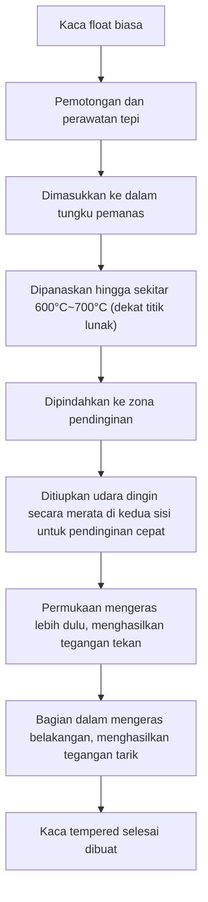
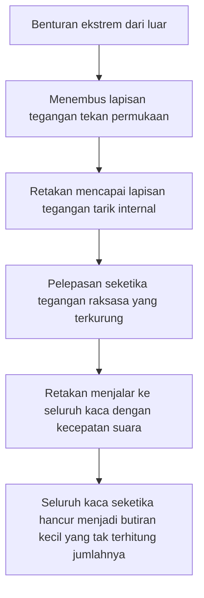

# Apa itu Kaca Tempered?

Ponsel pintar yang kita sentuh setiap hari, jendela samping mobil, dan pintu kaca besar di kantor. Hal yang umum digunakan pada benda-benda tersebut adalah 'Kaca Tempered' (Tempered Glass). Kaca tempered memiliki kekuatan 3 hingga 5 kali lipat dibandingkan dengan kaca biasa (kaca float). Namun, nilai sebenarnya tidak hanya sekadar 'sulit pecah'. Jika kaca ini pecah, ia tidak akan menjadi pecahan tajam seperti pisau, melainkan hancur menjadi butiran-butiran kecil berkat 'desain aman' (safety design).

Dalam artikel ini, kami akan membahas secara mendalam mengapa kaca tempered begitu kuat, proses pembuatan seperti apa yang dilaluinya, dan mengapa kaca ini hancur berkeping-keping saat pecah, dari sudut pandang mekanisme fisik dan rekayasa material.

## 1. Perbedaan dengan Kaca Float Biasa

Pertama-tama, mari kita pahami tentang kaca biasa (kaca float). Kaca float dibuat dengan metode 'float', di mana kaca cair diapungkan di atas timah cair untuk membentuk lembaran datar yang halus. Kaca ini memiliki transparansi yang tinggi dan halus, tetapi tidak begitu kuat terhadap benturan fisik atau perubahan suhu.

Ketika kaca float pecah, retakan menyebar secara bebas, menghasilkan pecahan yang sangat tajam dan berbahaya (pecahan bersudut tajam). Hal ini disebabkan karena tegangan internalnya merata, dan energi destruktif terkonsentrasi di ujung retakan, sehingga menjalar sekaligus.

Di sisi lain, kaca tempered adalah kaca float yang telah diproses melalui perlakuan panas (atau perlakuan kimia) khusus. Meskipun penampilan dan transmisi cahayanya hampir tidak berubah, di dalamnya terkurung 'badai tegangan' yang tak kasat mata.

## 2. Proses Pembuatan Kaca Tempered: Pemanasan Suhu Tinggi dan Pendinginan Cepat

Rahasia kekuatan kaca tempered terletak pada proses pembuatannya. Mari kita lihat proses 'metode pendinginan udara' yang paling umum.

### Proses Pemanasan
Kaca dipanaskan hingga sekitar 600°C hingga 700°C, mendekati titik lunaknya. Pada suhu ini, kaca belum meleleh, tetapi molekul-molekul di dalamnya sedikit lebih bebas bergerak, menjadikannya dalam keadaan bebas tegangan (keadaan viskoelastis).

### Proses Pendinginan Cepat (Quenching)
Kaca yang dipanaskan dipindahkan ke zona pendinginan, di mana udara dingin bertekanan tinggi ditiupkan secara merata dan kuat ke kedua permukaannya. 'Pendinginan cepat' inilah yang menjadi kunci ajaibnya.

1. **Pengerasan Permukaan**: Permukaan kaca yang bersentuhan langsung dengan udara dingin akan mendingin dan memadat dengan cepat.
2. **Penyusutan Internal**: Bahkan setelah permukaan memadat, bagian dalam kaca masih panas dan mempertahankan keadaan memuai. Namun, dengan jeda waktu, bagian dalam juga mulai mendingin dan mencoba menyusut.
3. **Penguncian Tegangan**: Saat bagian dalam mencoba menyusut, permukaan yang sudah memadat akan menariknya kembali. Akibatnya, permukaan kaca selamanya terkunci dengan 'gaya dorong ke dalam (tegangan tekan)', sedangkan bagian dalamnya terkunci dengan 'gaya tarik ke luar (tegangan tarik)'.

## 3. Keseimbangan Sempurna Antara Tegangan Tekan dan Tegangan Tarik

Kekuatan kaca tempered didasarkan pada keseimbangan antara **'tegangan tekan permukaan'** dan **'tegangan tarik internal'** ini.

Sebagai sebuah material, kaca sebenarnya sangat kuat terhadap 'gaya dorongan (kompresi)', tetapi lemah terhadap 'gaya tarikan (tarik)'. Ketika suatu benda membentur kaca biasa dan membuatnya melengkung, 'tegangan tarik' terjadi pada permukaan di sisi yang berlawanan dari benturan, dan dari situlah retakan muncul dan kaca pun pecah.

Namun, pada kaca tempered, 'tegangan tekan' yang kuat sudah diterapkan sebelumnya pada permukaan. Bahkan jika menerima benturan dari luar dan kaca melengkung, gaya yang mencoba menarik permukaan akan dinetralkan oleh tegangan tekan yang sudah ada. Dengan kata lain, selama tegangan tarik akibat benturan tidak melebihi tegangan tekan pada permukaan, kaca tidak akan retak.

Inilah alasan mengapa kaca tempered memiliki kekuatan 3 hingga 5 kali lipat dari kaca biasa.

## 4. Mekanisme Keamanan Saat Pecah (Pecahan Butiran)

Ciri khas lain dari kaca tempered, yang juga merupakan keunggulan terbesarnya, adalah 'cara pecahnya'.

Di dalam kaca tempered, terdapat 'tegangan tarik' yang sangat besar. Ini ibarat pegas yang diregangkan hingga batas maksimalnya lalu dikunci pada posisi tersebut. Apa yang akan terjadi jika, karena suatu alasan (benda yang sangat tajam menembus lapisan tegangan tekan permukaan, atau benturan kuat pada bagian tepi), kaca tersebut retak dan keseimbangan tegangan ini terganggu?

Begitu retakan mencapai lapisan tegangan tarik di dalam, energi yang terkurung akan dilepaskan sekaligus. Akibat pelepasan energi ini, retakan menyebar ke seluruh kaca dengan kecepatan ribuan meter per detik, menghancurkan kaca menjadi berkeping-keping dalam sekejap.

Pecahan yang dihasilkan pada saat ini akan berbentuk kubus atau butiran kecil membulat (pecahan butiran). Hal ini karena tegangan di dalamnya saling bersilangan seperti jaring, sehingga energinya terdispersi dan dilepaskan dalam skala kecil. Pecahan-pecahan kecil ini tidak memiliki tepi setajam kaca biasa, sehingga risiko luka robek yang parah jika mengenai tubuh manusia sangat berkurang secara drastis. Inilah alasan mengapa kaca tempered diwajibkan untuk kaca jendela mobil atau pintu kamar mandi.

## 5. Kelemahan dan Hal yang Perlu Diperhatikan dari Kaca Tempered

Meskipun terlihat sempurna, kaca tempered juga memiliki beberapa kelemahan.

1. **Rentan Terhadap Benturan pada Tepi (Edge)**: Walaupun permukaannya adalah kaca tempered yang sangat kuat, tepi yang dipotong secara struktural memiliki keseimbangan tegangan yang tidak stabil, dan jika benturan diterapkan di sini, keseluruhan kaca akan mudah hancur.
2. **Tidak Bisa Diproses Lebih Lanjut**: Setelah proses tempering dilakukan, kaca sama sekali tidak bisa dipotong atau dilubangi. Bahkan goresan sekecil apa pun akan mengganggu keseimbangan tegangan dan menyebabkannya pecah secara eksplosif, sehingga semua pemotongan atau pelubangan harus dilakukan sebelum perlakuan panas.
3. **Pecah Spontan (Ledakan Alami)**: Meski sangat jarang, terkadang kaca dapat tiba-tiba pecah tanpa adanya benturan, akibat adanya pengotor bernama nikel sulfida (NiS) yang terkandung dalam bahan baku kaca. NiS memiliki sifat di mana volumenya memuai seiring berjalannya waktu dan perubahan suhu, yang memicu terganggunya keseimbangan tegangan internal. Untuk mencegah hal ini, langkah penanggulangan yang biasa dilakukan adalah dengan melakukan heat soak test (uji pemanasan ulang) setelah produksi untuk memecahkan produk cacat terlebih dahulu.

## 6. Kesimpulan

Kaca tempered bukan sekadar kaca yang dibuat tebal dan kokoh. Ia adalah mahakarya rekayasa material tingkat tinggi yang memanfaatkan energi panas untuk mengurung 'kekuatan' di dalam kaca itu sendiri, dan dengan kekuatan tersebut menetralkan benturan eksternal, serta melindungi manusia dengan cara menghancurkan dirinya sendiri berkeping-keping jika terjadi sesuatu.

'Tidak mudah pecah' dan 'pecah dengan aman'. Mekanisme kaca tempered yang menyeimbangkan kedua hal ini terus melindungi kehidupan kita secara diam-diam dan kuat. Pada tampilan (display) dan bahan bangunan generasi mendatang, teknologi pengendalian tegangan ini akan terus berkembang, menuju material kaca yang lebih tipis, lebih kuat, dan lebih aman.
