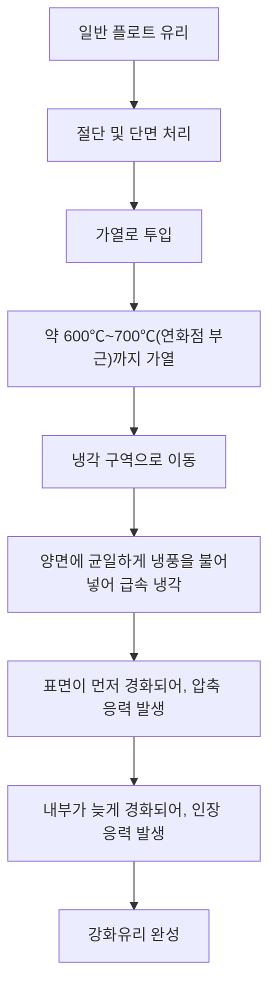
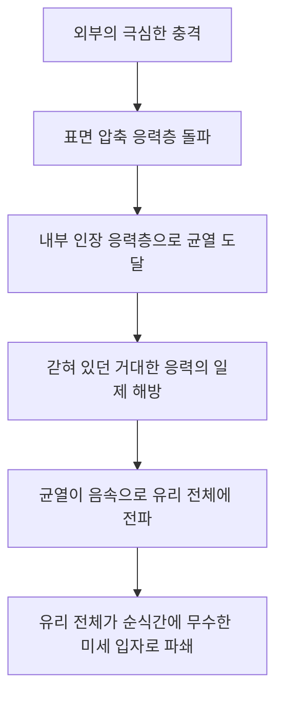

# 강화유리란 무엇인가?

우리가 일상적으로 접하는 스마트폰, 자동차의 측면 유리, 그리고 사무실의 커다란 유리문. 이것들에 공통적으로 사용되는 것이 '강화유리(Tempered Glass)'입니다. 강화유리는 일반 유리(플로트 유리)에 비해 3~5배의 강도를 자랑합니다. 하지만 그 진정한 가치는 단순히 '잘 깨지지 않는다'는 것에만 있지 않습니다. 만에 하나 깨졌을 때, 날카로운 칼날 같은 파편이 되는 것이 아니라, 잘게 부서지는 '안전 설계'에 있습니다.

이 글에서는 강화유리가 왜 강한지, 어떤 제조 과정을 거쳐 만들어지는지, 그리고 왜 깨질 때 산산조각이 나는지, 그 물리적 원리와 재료 공학적 관점에서 깊이 파헤쳐 설명합니다.

## 1. 일반 플로트 유리와의 차이점

먼저, 일반 유리(플로트 유리)에 대해 이해해 봅시다. 플로트 유리는 용융된 유리를 용융 주석 위에 띄워 평평한 판 모양으로 만드는 '플로트 공법'으로 만들어집니다. 이 유리는 투명도가 높고 평활하지만, 물리적인 충격이나 열 변화에는 그리 강하지 않습니다.

플로트 유리가 깨질 때, 균열은 자유롭게 퍼져 나가며, 결과적으로 매우 날카롭고 위험한 파편(예각적인 파쇄)이 됩니다. 이는 내부의 응력이 균일하고, 파괴 에너지가 균열의 끝부분에 집중되어 순식간에 진행되기 때문입니다.

반면, 강화유리는 이 플로트 유리를 특수한 열처리(또는 화학 처리)를 통해 가공한 것입니다. 외관이나 빛 투과율은 거의 변하지 않지만, 그 내부에는 눈에 보이지 않는 '응력의 폭풍'이 갇혀 있습니다.

## 2. 강화유리의 제조 과정: 고온 가열과 급랭

강화유리 강도의 비밀은 그 제조 과정에 있습니다. 가장 일반적인 '풍랭 강화법'의 과정을 살펴봅시다.

### 가열 공정
유리를 그 연화점에 가까운 약 600℃~700℃까지 가열합니다. 이 온도에서는 유리가 아직 녹지는 않았지만, 내부 분자가 약간 움직이기 쉬워져 응력이 해제된 상태(점탄성 상태)가 됩니다.

### 급랭 공정 (Quenching)
가열된 유리는 냉각 구역으로 이동하여, 고압의 냉풍을 양면에서 균일하고 강력하게 맞게 됩니다. 이 '급랭'이 마법의 열쇠입니다.

1. **표면 경화**: 냉풍에 직접 닿는 유리의 표면은 급속히 냉각되어 굳어집니다.
2. **내부 수축**: 표면이 굳은 후에도 유리 내부는 여전히 뜨겁고, 팽창된 상태를 유지하고 있습니다. 하지만 시간차를 두고 내부도 서서히 식어 수축하려고 합니다.
3. **응력 고정**: 내부가 수축하려고 할 때, 이미 굳어 있는 표면이 그것을 다시 잡아당기는 형태가 됩니다. 결과적으로 유리 표면에는 '안쪽을 향해 밀어내는 힘(압축 응력)'이, 내부에는 '바깥쪽을 향해 잡아당기는 힘(인장 응력)'이 영원히 고정되게 됩니다.

## 3. 압축 응력과 인장 응력의 절묘한 균형

강화유리의 강도는 이 **'표면의 압축 응력'**과 **'내부의 인장 응력'**의 균형에 의해 이루어집니다.

유리라는 재료는 사실 '밀어내는 힘(압축)'에는 매우 강하지만, '잡아당기는 힘(인장)'에는 약하다는 성질을 가지고 있습니다. 일반 유리에 물체가 부딪혀 휘어지면, 충격을 받은 반대쪽 표면에 '인장 응력'이 발생하고, 거기서부터 균열이 생겨 깨지고 맙니다.

하지만 강화유리의 경우, 미리 표면에 강력한 '압축 응력'이 가해져 있습니다. 외부에서 충격을 받아 유리가 휘어지고 표면을 잡아당기려는 힘이 작용하더라도, 원래 있던 압축 응력이 이를 상쇄해 버립니다. 즉, 충격으로 인한 인장 응력이 표면의 압축 응력을 넘어서지 않는 한, 유리에는 균열이 생기지 않는 것입니다.

이것이 강화유리가 일반 유리의 3~5배 강도를 가지는 이유입니다.

## 4. 깨질 때의 안전 원리 (입상 파쇄)

강화유리의 또 다른, 그리고 가장 큰 특징이 '깨지는 방식'입니다.

강화유리 내부에는 거대한 '인장 응력'이 갇혀 있습니다. 이는 스프링을 한계까지 늘려 고정해 둔 것과 같습니다. 만약 어떤 이유(매우 날카로운 것으로 표면의 압축 응력층을 뚫거나, 가장자리에 강한 충격이 가해지는 등)로 유리에 균열이 생겨, 이 응력의 균형이 무너지면 어떻게 될까요?

균열이 내부의 인장 응력층에 도달하는 순간, 갇혀 있던 에너지가 한꺼번에 방출됩니다. 이 에너지 방출로 인해 균열은 초속 수천 미터의 속도로 유리 전체로 퍼져나가며, 유리를 순식간에 산산조각 냅니다.

이때 생기는 파편은 주사위 모양이나 둥글스름한 작은 알갱이(입상 파쇄)가 됩니다. 이는 내부 응력이 그물망처럼 교차하고 있어 에너지가 잘게 분산되어 해방되기 때문입니다. 이 미세한 파편은 일반 유리와 같은 예리한 칼날을 가지지 않아, 인체에 닿더라도 큰 상처를 입을 위험이 극적으로 줄어듭니다. 이것이 자동차 창유리나 샤워실 문에 강화유리가 의무화된 이유입니다.

## 5. 강화유리의 약점과 주의점

완벽해 보이는 강화유리에도 몇 가지 약점이 있습니다.

1. **가장자리(에지) 충격에 취약**: 표면은 매우 강한 강화유리지만, 절단된 단면은 구조적으로 응력 균형이 불안정하여 이곳에 충격이 가해지면 쉽게 전체가 산산조각이 나버립니다.
2. **가공 불가**: 강화 처리를 마친 후에는 절단하거나 구멍을 뚫는 작업이 절대 불가능합니다. 조금이라도 상처를 내면 응력 균형이 무너져 폭발적으로 깨져버리기 때문에, 모든 절단이나 구멍 뚫기는 열처리 전에 해야 합니다.
3. **자연 파손(자연 폭발)**: 아주 드물지만, 유리 원료에 포함된 황화니켈(NiS)이라는 불순물로 인해 아무런 충격을 받지 않았는데도 갑자기 깨지는 경우가 있습니다. NiS는 시간이 지남에 따라 또는 온도 변화와 함께 부피가 팽창하는 성질이 있으며, 이것이 내부 응력 균형을 무너뜨리는 촉매가 되기 때문입니다. 이를 방지하기 위해 제조 후 열간유지시험(히트소크 테스트, Heat Soak Test)을 실시하여 불량품을 미리 깨버리는 대책이 취해지기도 합니다.

## 6. 결론

강화유리는 그저 두껍고 튼튼하게 만들어진 유리가 아닙니다. 열이라는 에너지를 이용하여 유리 자신의 내부에 '힘'을 가두고, 그 힘으로 외부의 충격을 상쇄하며, 만에 하나일 경우 스스로를 산산조각 냄으로써 인간을 보호한다는, 극히 고도의 재료 공학의 결정체입니다.

'깨지지 않는 것'과 '안전하게 깨지는 것'. 이 두 가지를 양립시킨 강화유리의 원리는 우리의 생활을 조용하고 강력하게 지켜주고 있습니다. 차세대 디스플레이나 건축 자재에 있어 이 응력 제어 기술은 더욱 진화하여 더 얇고, 더 강하고, 더 안전한 유리 소재로 발전해 나갈 것입니다.
