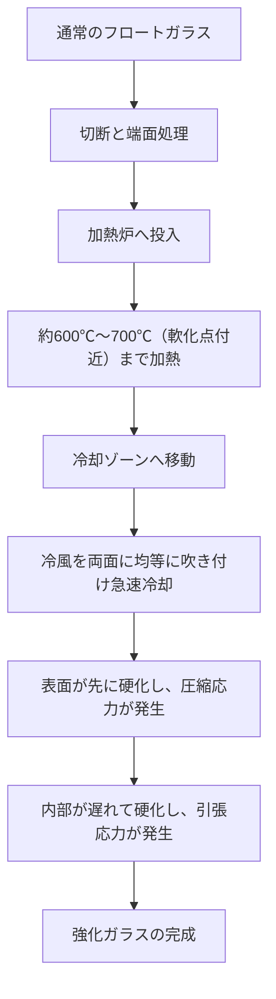
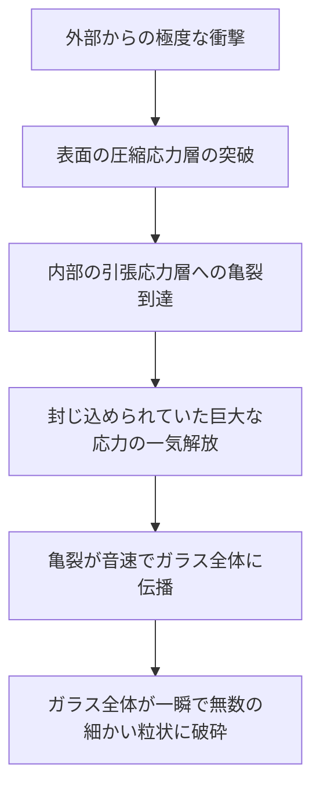

# 強化ガラスとは何か？

私たちが日常的に触れているスマートフォン、自動車のサイドウィンドウ、そしてオフィスの大きなガラス扉。これらに共通して使われているのが「強化ガラス（Tempered Glass）」です。強化ガラスは通常のガラス（フロートガラス）と比較して、3〜5倍の強度を誇ります。しかし、その真の価値は単に「割れにくい」ことだけではありません。万が一割れた際に、鋭利な刃物のような破片になるのではなく、細かい粒状に砕け散るという「安全設計」にあります。

この記事では、強化ガラスがなぜ強いのか、どのような製造プロセスを経て作られるのか、そしてなぜ割れたときに粉々になるのか、その物理的メカニズムと材料工学の視点から深く掘り下げて解説します。

## 1. 通常のフロートガラスとの違い

まず、通常のガラス（フロートガラス）について理解しましょう。フロートガラスは、溶融したガラスを溶融スズの上に浮かべて平滑な板状にする「フロート法」で作られます。このガラスは、透明度が高く平滑ですが、物理的な衝撃や熱変化にはそれほど強くありません。

フロートガラスが割れるとき、亀裂は自由に広がり、結果として非常に鋭利で危険な破片（鋭角的な破砕）となります。これは、内部の応力が均等であり、破壊エネルギーが亀裂の先端に集中して一気に進行するためです。

一方、強化ガラスは、このフロートガラスを特殊な熱処理（または化学処理）によって加工したものです。外見や光の透過率はほとんど変わりませんが、その内部には目に見えない「応力の嵐」が封じ込められています。

## 2. 強化ガラスの製造プロセス：高温加熱と急冷

強化ガラスの強さの秘密は、その製造プロセスにあります。最も一般的な「風冷強化法」のプロセスを見てみましょう。

### 加熱工程
ガラスをその軟化点に近い約600℃〜700℃まで加熱します。この温度では、ガラスはまだ溶けてはいませんが、内部の分子がわずかに動きやすくなり、応力が解放された状態（粘弾性状態）になります。

### 急冷工程（クエンチング）
加熱されたガラスは、冷却ゾーンに移動し、高圧の冷風を両面から均等かつ強力に吹き付けられます。この「急冷」が魔法の鍵です。

1. **表面の硬化**: 冷風に直接触れるガラスの表面は急速に冷やされ、固化します。
2. **内部の収縮**: 表面が固まった後も、ガラスの内部はまだ熱く、膨張した状態を保っています。しかし、時間差で内部も徐々に冷えて収縮しようとします。
3. **応力の固定**: 内部が収縮しようとする際、すでに固まっている表面がそれを引っ張り返す形になります。結果として、ガラスの表面には「内側に向かって押される力（圧縮応力）」が、内部には「外側に向かって引っ張られる力（引張応力）」が永遠に固定されることになります。

## 3. 圧縮応力と引張応力の絶妙なバランス

強化ガラスの強度は、この**「表面の圧縮応力」**と**「内部の引張応力」**のバランスによって成り立っています。

ガラスという材料は、実は「押される力（圧縮）」には非常に強いのですが、「引っ張られる力（引張）」には弱いという性質を持っています。通常のガラスに物がぶつかって曲がると、衝撃を受けた反対側の表面に「引張応力」が発生し、そこから亀裂が入って割れてしまいます。

しかし強化ガラスの場合、あらかじめ表面に強力な「圧縮応力」がかかっています。外部から衝撃を受けてガラスが曲がり、表面を引っ張ろうとする力が働いても、元々ある圧縮応力がそれを相殺してしまいます。つまり、衝撃による引張応力が、表面の圧縮応力を上回らない限り、ガラスには亀裂が入らないのです。

これが、強化ガラスが通常のガラスの3〜5倍の強度を持つ理由です。

## 4. 割れるときの安全メカニズム（粒状破砕）

強化ガラスのもう一つの、そして最大の特長が「割れ方」です。

強化ガラスの内部には、巨大な「引張応力」が封じ込められています。これは、バネを限界まで引き伸ばした状態で固定しているようなものです。もし何らかの理由（非常に鋭利なもので表面の圧縮応力層を突き破る、あるいは端面への強い衝撃など）でガラスに亀裂が入り、この応力のバランスが崩れるとどうなるでしょうか。

亀裂が内部の引張応力層に到達した瞬間、封じ込められていたエネルギーが一気に解放されます。このエネルギーの解放により、亀裂は秒速数千メートルのスピードでガラス全体に広がり、ガラスを瞬時に粉々に粉砕します。

このとき生じる破片は、サイコロ状や丸みを帯びた細かい粒（粒状破砕）になります。これは、内部の応力が網の目状に交差しており、エネルギーが細かく分散して解放されるためです。この細かい破片は、通常のガラスのような鋭利な刃を持たないため、人体に当たっても大きな切り傷を負うリスクが劇的に低減されます。これが、自動車の窓ガラスやシャワールームのドアに強化ガラスが義務付けられている理由です。

## 5. 強化ガラスの弱点と注意点

完璧に見える強化ガラスにも、いくつかの弱点があります。

1. **端面（エッジ）への衝撃に弱い**: 表面は非常に強い強化ガラスですが、カットされた端面は構造的に応力のバランスが不安定であり、ここに衝撃が加わると簡単に全体が粉砕してしまいます。
2. **加工ができない**: 強化処理を行った後で、切断したり穴を開けたりすることは絶対にできません。少しでも傷をつけると応力バランスが崩れて爆発的に割れてしまうため、すべてのカットや穴あけは熱処理の前に行う必要があります。
3. **自然破損（自然爆発）**: ごく稀にですが、ガラスの原料に含まれる硫化ニッケル（NiS）という不純物が原因で、何の衝撃も受けていないのに突然割れることがあります。NiSは時間の経過や温度変化とともに体積が膨張する性質があり、これが内部の応力バランスを崩す引き金になるためです。これを防ぐために、製造後にヒートソークテスト（再加熱テスト）を行い、不良品をあらかじめ割ってしまうという対策が取られることもあります。

## 6. まとめ

強化ガラスは、ただ分厚く頑丈に作られたガラスではありません。熱というエネルギーを利用して、ガラス自身の内部に「力」を封じ込め、その力によって外部の衝撃を相殺し、万が一の際には自らを粉々に砕くことで人間を守るという、極めて高度な材料工学の結晶です。

「割れないこと」と「安全に割れること」。この二つを両立させた強化ガラスのメカニズムは、私たちの生活を静かに、そして強力に守り続けています。次世代のディスプレイや建材において、この応力制御の技術はさらに進化し、より薄く、より強く、より安全なガラス素材へと発展していくことでしょう。
