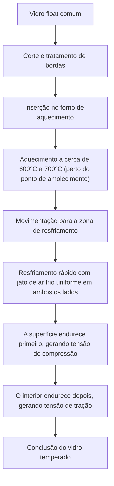
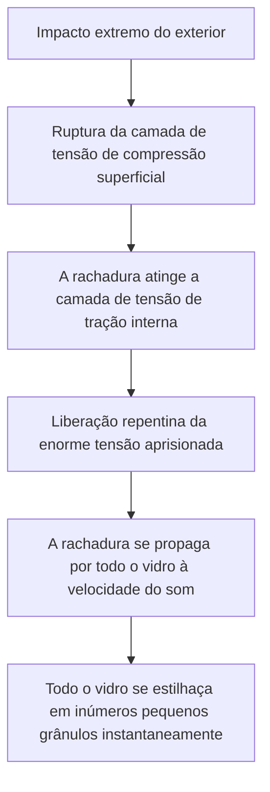

# O que é o vidro temperado?

Smartphones, janelas laterais de automóveis e grandes portas de vidro de escritórios com os quais interagimos diariamente. O que todos esses têm em comum é o uso de 'vidro temperado' (Tempered Glass). O vidro temperado possui uma resistência 3 a 5 vezes maior em comparação com o vidro comum (vidro float). No entanto, o seu verdadeiro valor não está simplesmente em ser 'difícil de quebrar'. Em vez disso, reside em seu 'design de segurança': no caso improvável de quebrar, em vez de se estilhaçar em fragmentos afiados como facas, ele se despedaça em pequenos pedaços granulares.

Neste artigo, exploraremos a fundo por que o vidro temperado é tão forte, através de quais processos de fabricação ele passa e por que se estilhaça quando quebra, tudo sob a perspectiva dos mecanismos físicos e da engenharia de materiais.

## 1. Diferenças em relação ao vidro float comum

Primeiro, vamos entender o vidro comum (vidro float). O vidro float é fabricado pelo 'processo float', onde o vidro derretido flutua sobre estanho derretido para formar uma placa lisa e plana. Esse vidro tem alta transparência e é liso, mas não é particularmente resistente a impactos físicos ou mudanças térmicas.

Quando o vidro float quebra, as rachaduras se espalham livremente, resultando em fragmentos muito afiados e perigosos (fratura em ângulos agudos). Isso ocorre porque a tensão interna é uniforme, e a energia de ruptura se concentra na ponta da rachadura e avança de uma só vez.

Por outro lado, o vidro temperado é processado a partir desse vidro float por meio de um tratamento térmico especial (ou tratamento químico). Embora a aparência e a transmissão de luz permaneçam quase inalteradas, uma invisível 'tempestade de tensões' está aprisionada em seu interior.

## 2. Processo de fabricação do vidro temperado: aquecimento a alta temperatura e resfriamento rápido

O segredo da força do vidro temperado reside em seu processo de fabricação. Vamos dar uma olhada no processo mais comum, a 'têmpera térmica por ar'.

### Processo de aquecimento
O vidro é aquecido a cerca de 600°C a 700°C, perto de seu ponto de amolecimento. Nessa temperatura, o vidro ainda não derreteu, mas as moléculas internas tornam-se um pouco mais móveis, entrando em um estado onde as tensões são aliviadas (estado viscoelástico).

### Processo de resfriamento rápido (Quenching)
O vidro aquecido é movido para a zona de resfriamento, onde jatos de ar frio de alta pressão são soprados de forma poderosa e uniforme em ambos os lados. Esse 'resfriamento rápido' é a chave mágica.

1. **Endurecimento da superfície**: A superfície do vidro que entra em contato direto com o ar frio é resfriada e solidificada rapidamente.
2. **Contração interna**: Mesmo após a superfície endurecer, o interior do vidro ainda está quente e mantém um estado expandido. No entanto, com um certo atraso, o interior também tenta esfriar e se contrair gradualmente.
3. **Fixação da tensão**: Quando o interior tenta se contrair, a superfície já endurecida o puxa de volta. Como resultado, uma 'força empurrando para dentro (tensão de compressão)' é permanentemente fixada na superfície do vidro, enquanto uma 'força puxando para fora (tensão de tração)' é fixada no interior.

## 3. O equilíbrio requintado entre tensão de compressão e tensão de tração

A força do vidro temperado é baseada no equilíbrio entre essa **'tensão de compressão superficial'** e a **'tensão de tração interna'**.

Como material, o vidro é na verdade muito resistente à 'força que empurra (compressão)', mas fraco contra a 'força que puxa (tração)'. Quando um objeto atinge o vidro comum e o dobra, uma 'tensão de tração' é gerada na superfície oposta ao impacto, a partir da qual as rachaduras começam e o vidro quebra.

No entanto, no caso do vidro temperado, uma poderosa 'tensão de compressão' já é aplicada à superfície de antemão. Mesmo que um impacto externo dobre o vidro e crie uma força que tente puxar a superfície, a tensão de compressão pré-existente a anula. Em outras palavras, o vidro não rachará a menos que a tensão de tração do impacto exceda a tensão de compressão da superfície.

É por isso que o vidro temperado tem de 3 a 5 vezes a resistência do vidro comum.

## 4. O mecanismo de segurança ao quebrar (fratura granular)

Outra, e talvez a maior, característica do vidro temperado é 'como ele quebra'.

Uma enorme 'tensão de tração' está aprisionada dentro do vidro temperado. Isso é como fixar uma mola esticada até o seu limite. O que acontece se, por alguma razão (um objeto muito afiado rompendo a camada de tensão de compressão superficial, ou um forte impacto na borda), uma rachadura se formar no vidro e quebrar o equilíbrio dessas tensões?

No momento em que a rachadura atinge a camada interna de tensão de tração, a energia aprisionada é liberada de uma só vez. Devido à liberação dessa energia, a rachadura se espalha por todo o vidro a uma velocidade de milhares de metros por segundo, estilhaçando instantaneamente o vidro em pedaços.

Os fragmentos gerados neste momento tornam-se pequenos pedaços com forma de cubo ou arredondados (fratura granular). Isso ocorre porque as tensões internas se cruzam como uma rede, e a energia é finamente dispersa e liberada. Esses pequenos fragmentos não têm bordas afiadas como o vidro comum, de modo que o risco de causar cortes graves em humanos é drasticamente reduzido. É por isso que o vidro temperado é obrigatório em janelas de carros e portas de boxes de banheiro.

## 5. Fraquezas e pontos de atenção do vidro temperado

Até mesmo o vidro temperado aparentemente perfeito tem algumas fraquezas.

1. **Vulnerável a impactos nas bordas (arestas)**: Embora a superfície do vidro temperado seja muito forte, as bordas cortadas são estruturalmente instáveis em seu equilíbrio de tensão e, se um impacto for aplicado lá, a peça inteira se despedaçará facilmente.
2. **Incapacidade de ser processado**: Depois que o tratamento de têmpera for realizado, é absolutamente impossível cortá-lo ou perfurá-lo. Se houver até mesmo um pequeno arranhão, o equilíbrio de tensão será destruído e ele se quebrará de forma explosiva, portanto, todos os cortes e perfurações devem ser feitos antes do tratamento térmico.
3. **Ruptura espontânea (explosão espontânea)**: Muito raramente, o vidro pode quebrar de repente sem nenhum impacto devido a impurezas chamadas sulfeto de níquel (NiS) contidas nas matérias-primas do vidro. O NiS tem a propriedade de expandir em volume ao longo do tempo e com mudanças de temperatura, e isso atua como um gatilho para perturbar o equilíbrio da tensão interna. Para evitar isso, um teste de imersão térmica (heat soak test) às vezes é realizado após a fabricação para quebrar deliberadamente os produtos defeituosos com antecedência.

## 6. Conclusão

O vidro temperado não é apenas um vidro grosso e robusto. Utilizando a energia térmica, ele aprisiona 'força' dentro do próprio vidro. Essa força cancela os impactos externos e, na pior das hipóteses, quebra a si mesmo em pequenos pedaços para proteger os humanos. É verdadeiramente um cristal da engenharia de materiais altamente avançada.

'Não quebrar' e 'quebrar com segurança'. O mecanismo do vidro temperado, que equilibra essas duas características, continua a proteger nossas vidas de forma silenciosa e poderosa. Em telas e materiais de construção de próxima geração, essa tecnologia de controle de tensão evoluirá ainda mais, transformando-se em materiais de vidro mais finos, mais fortes e mais seguros.
