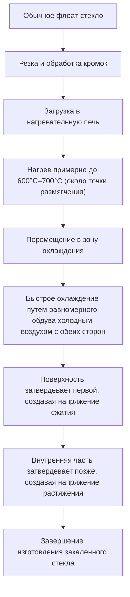
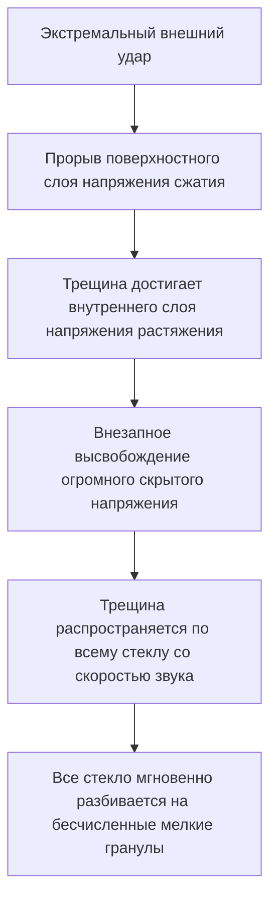

# Что такое закаленное стекло?

Смартфоны, боковые стекла автомобилей и большие стеклянные двери в офисах, с которыми мы сталкиваемся каждый день. Что их объединяет, так это использование «закаленного стекла» (Tempered Glass). Закаленное стекло в 3-5 раз прочнее обычного стекла (флоат-стекла). Однако его истинная ценность заключается не только в том, что его «трудно разбить». «Безопасный дизайн» заключается в том, что в маловероятном случае разбития оно разлетается на мелкие гранулы, а не на острые, как лезвие, осколки.

В этой статье мы глубоко погрузимся в физические механизмы и материаловедение, чтобы объяснить, почему закаленное стекло такое прочное, через какой производственный процесс оно проходит и почему оно разлетается на осколки, когда разбивается.

## 1. Отличия от обычного флоат-стекла

Сначала давайте разберемся в обычном стекле (флоат-стекле). Флоат-стекло производится с помощью «флоат-процесса», при котором расплавленное стекло плавает на расплавленном олове для образования гладкого листа. Это стекло обладает высокой прозрачностью и гладкостью, но оно не очень устойчиво к физическим ударам или перепадам температур.

Когда флоат-стекло разбивается, трещины распространяются свободно, что приводит к появлению очень острых и опасных осколков (остроугольное разрушение). Это происходит из-за того, что внутренние напряжения распределены равномерно, а энергия разрушения концентрируется на кончике трещины и распространяется сразу.

С другой стороны, закаленное стекло изготавливается путем обработки этого флоат-стекла специальной термической (или химической) обработкой. Внешний вид и светопропускание остаются практически неизменными, но внутри скрыта невидимая «буря напряжений».

## 2. Процесс производства закаленного стекла: высокотемпературный нагрев и быстрое охлаждение

Секрет прочности закаленного стекла кроется в процессе его производства. Давайте рассмотрим наиболее распространенный процесс «закалки воздушным охлаждением».

### Процесс нагрева
Стекло нагревают примерно до 600°C–700°C, что близко к его точке размягчения. При этой температуре стекло еще не плавится, но внутренние молекулы становятся слегка подвижными, и оно переходит в состояние снятия напряжения (вязкоупругое состояние).

### Процесс быстрого охлаждения (закалка)
Нагретое стекло перемещается в зону охлаждения, где с обеих сторон на него равномерно и мощно подается холодный воздух под высоким давлением. Это «быстрое охлаждение» и есть волшебный ключ.

1. **Затвердевание поверхности**: Поверхность стекла, непосредственно контактирующая с холодным воздухом, быстро охлаждается и затвердевает.
2. **Внутренняя усадка**: Даже после того, как поверхность затвердевает, внутренняя часть стекла все еще горячая и остается расширенной. Однако со временем внутренняя часть также постепенно охлаждается и пытается сжаться.
3. **Фиксация напряжения**: Поскольку внутренняя часть пытается сжаться, уже затвердевшая поверхность оттягивает ее назад. В результате «сила, давящая внутрь (напряжение сжатия)» на поверхности стекла и «сила, тянущая наружу (напряжение растяжения)» внутри навсегда фиксируются.

## 3. Идеальный баланс между напряжением сжатия и напряжением растяжения

Прочность закаленного стекла достигается за счет баланса между этим **«поверхностным напряжением сжатия»** и **«внутренним напряжением растяжения»**.

Стекло как материал на самом деле очень устойчиво к «толкающей силе (сжатию)», но имеет свойство быть слабым к «тянущей силе (растяжению)». Когда что-то ударяет по обычному стеклу и заставляет его изгибаться, на поверхности, противоположной удару, возникает «напряжение растяжения», оттуда появляется трещина и оно разбивается.

Однако в случае закаленного стекла к поверхности заранее приложено сильное «напряжение сжатия». Даже если стекло изгибается из-за внешнего удара и действует сила, пытающаяся растянуть поверхность, первоначальное напряжение сжатия компенсирует ее. Другими словами, пока напряжение растяжения от удара не превысит напряжение сжатия поверхности, стекло не треснет.

Именно поэтому закаленное стекло в 3-5 раз прочнее обычного.

## 4. Механизм безопасности при разрушении (гранулированное разрушение)

Еще одной и самой большой особенностью закаленного стекла является то, «как оно разбивается».

Внутри закаленного стекла скрыто огромное «напряжение растяжения». Это похоже на фиксацию пружины, растянутой до предела. Что произойдет, если стекло треснет по какой-либо причине (очень острый предмет пробивает слой поверхностного напряжения сжатия, или сильный удар в край) и этот баланс напряжений нарушится?

В тот момент, когда трещина достигает внутреннего слоя напряжения растяжения, скрытая энергия высвобождается одновременно. В результате высвобождения этой энергии трещина распространяется по всему стеклу со скоростью несколько тысяч метров в секунду, мгновенно разбивая стекло вдребезги.

Осколки, образующиеся в это время, становятся кубическими или округлыми мелкими гранулами (гранулированное разрушение). Это происходит потому, что внутренние напряжения пересекаются в виде сетки, и энергия тонко рассеивается и высвобождается. Поскольку эти мелкие осколки не имеют острых краев, как обычное стекло, риск получения серьезных порезов при ударе о тело человека резко снижается. Именно поэтому для окон автомобилей и дверей душевых кабин обязательно использование закаленного стекла.

## 5. Слабые стороны и меры предосторожности при использовании закаленного стекла

Даже идеально выглядящее закаленное стекло имеет некоторые слабые стороны.

1. **Слабая устойчивость к ударам в край (торец)**: Хотя поверхность представляет собой очень прочное закаленное стекло, обрезанный край структурно нестабилен с точки зрения баланса напряжений, и если к нему приложить удар, все стекло легко разобьется.
2. **Невозможность обработки**: Категорически невозможно резать или сверлить отверстия после процесса закалки. Даже малейшая царапина нарушит баланс напряжений и приведет к взрывному разрушению, поэтому всю резку и сверление необходимо производить до термической обработки.
3. **Естественное разрушение (самопроизвольный взрыв)**: В очень редких случаях из-за примесей, называемых сульфидом никеля (NiS), содержащихся в сырье стекла, оно может внезапно разбиться, даже не подвергаясь никаким ударам. Это происходит потому, что NiS имеет свойство расширяться в объеме с течением времени и изменениями температуры, что вызывает нарушение внутреннего баланса напряжений. Чтобы предотвратить это, после изготовления может проводиться тест термической выдержки (heat soak test), чтобы заранее разбить дефектные изделия.

## 6. Заключение

Закаленное стекло — это не просто стекло, которое сделано толстым и прочным. Это кристаллизация чрезвычайно передового материаловедения, которое использует тепловую энергию для удержания «силы» внутри самого стекла, использует эту силу для компенсации внешних ударов и защищает людей, разбиваясь вдребезги в маловероятном случае аварии.

«Не разбивается» и «разбивается безопасно». Механизм закаленного стекла, сочетающий в себе эти два качества, продолжает тихо и мощно защищать нашу жизнь. В дисплеях и строительных материалах следующего поколения эта технология управления напряжением будет развиваться и дальше, приводя к созданию более тонких, прочных и безопасных стеклянных материалов.
