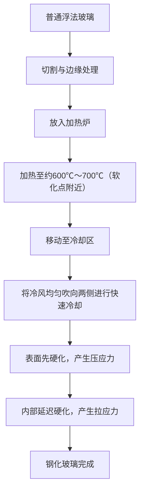
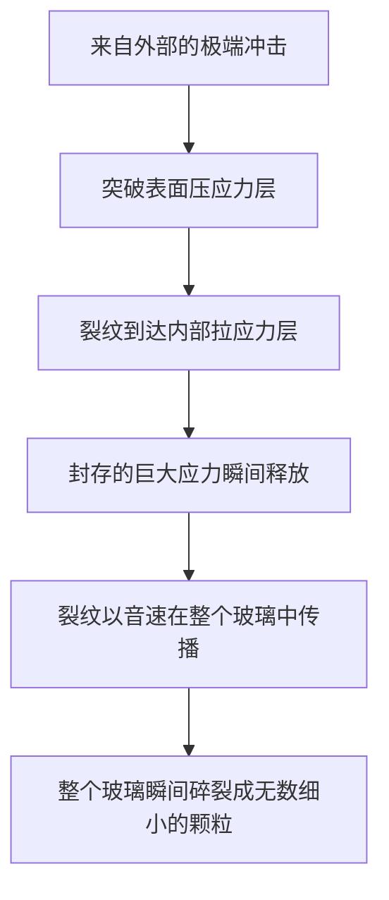

# 钢化玻璃是什么？

我们日常接触到的智能手机、汽车侧窗以及办公室的大型玻璃门。它们共通使用的是“钢化玻璃（Tempered Glass）”。与普通玻璃（浮法玻璃）相比，钢化玻璃拥有3到5倍的强度。然而，它真正的价值并不仅仅在于“不易碎”。万一发生碎裂时，它不会变成锋利如刀刃的碎片，而是碎成细小的颗粒状，这就是它的“安全设计”。

在这篇文章中，我们将从物理机制和材料工程的角度深入探讨钢化玻璃为什么那么坚固、经历了怎样的制造工艺，以及为什么碎裂时会粉碎。

## 1. 与普通浮法玻璃的区别

首先，让我们了解一下普通玻璃（浮法玻璃）。浮法玻璃是通过“浮法工艺”制造的，即把熔融的玻璃漂浮在熔融的锡上，使其形成平滑的板状。这种玻璃透明度高且平滑，但对物理冲击和热变化的抵抗力并不强。

当浮法玻璃碎裂时，裂纹会自由扩展，结果形成非常锋利且危险的碎片（锐角状破碎）。这是因为内部应力均匀，破坏能量集中在裂纹尖端并瞬间推进。

另一方面，钢化玻璃是通过对这种浮法玻璃进行特殊的热处理（或化学处理）加工而成的。它的外观和透光率几乎没有变化，但在其内部却封存着肉眼看不见的“应力风暴”。

## 2. 钢化玻璃的制造工艺：高温加热与急冷

钢化玻璃强度的秘密在于它的制造工艺。让我们来看看最常见的“风冷钢化法”工艺。

### 加热过程
将玻璃加热至接近其软化点的约600℃～700℃。在这个温度下，玻璃尚未熔化，但内部的分子可以稍微自由移动，处于应力释放的状态（粘弹性状态）。

### 急冷过程（淬火）
加热后的玻璃移动到冷却区，从两侧均匀而强力地吹向高压冷风。这种“急冷”正是魔法的关键。

1. **表面硬化**：直接接触冷风的玻璃表面迅速冷却并固化。
2. **内部收缩**：表面固化后，玻璃内部仍然很热，保持膨胀状态。然而，随着时间推移，内部也逐渐冷却并试图收缩。
3. **应力固定**：当内部试图收缩时，已经固化的表面会将其反向拉扯。结果，玻璃表面永远固定了“向内推的力（压应力）”，而内部则永远固定了“向外拉的力（拉应力）”。

## 3. 压应力与拉应力的绝妙平衡

钢化玻璃的强度建立在这种**“表面压应力”**与**“内部拉应力”**的平衡之上。

玻璃这种材料，实际上对“推力（压缩）”非常强，但对“拉力（拉伸）”却很弱。当物体撞击普通玻璃使其弯曲时，受冲击的背面表面会产生“拉应力”，裂纹便从那里产生并导致玻璃碎裂。

然而，在钢化玻璃的情况下，表面已经预先施加了强大的“压应力”。即使受到外部冲击导致玻璃弯曲并产生试图拉扯表面的力，原有的压应力也会将其抵消。换句话说，只要冲击引起的拉应力不超过表面的压应力，玻璃就不会产生裂纹。

这就是钢化玻璃拥有普通玻璃3到5倍强度的原因。

## 4. 碎裂时的安全机制（颗粒状破碎）

钢化玻璃的另一个，也是最大的特点是它的“碎裂方式”。

钢化玻璃内部封存着巨大的“拉应力”。这就像把一根弹簧拉伸到极限并固定住一样。如果由于某种原因（非常锋利的物体刺穿了表面的压应力层，或者边缘受到了强烈的冲击等）导致玻璃产生裂纹，打破了这种应力的平衡，会发生什么呢？

在裂纹到达内部拉应力层的瞬间，被封存的能量一下子释放出来。由于这种能量的释放，裂纹以每秒数千米的速度在整个玻璃中蔓延，瞬间将玻璃粉碎。

此时产生的碎片会变成骰子状或带有圆角的细小颗粒（颗粒状破碎）。这是因为内部应力呈网状交错，能量被细微地分散释放。这种微小的碎片不像普通玻璃那样拥有锋利的刀刃，因此即使打在人体上，造成严重割伤的风险也会急剧降低。这就是汽车车窗和淋浴房门强制规定使用钢化玻璃的原因。

## 5. 钢化玻璃的弱点与注意事项

看似完美的钢化玻璃也有一些弱点。

1. **对边缘的冲击很脆弱**：虽然钢化玻璃的表面非常坚硬，但切割后的边缘在结构上应力平衡不稳定，如果这里受到冲击，整个玻璃很容易就会粉碎。
2. **无法加工**：在进行钢化处理后，绝对不能再进行切割或打孔。因为哪怕只有一点点划痕，都会破坏应力平衡导致爆炸性碎裂，所以所有的切割和打孔都必须在热处理之前完成。
3. **自爆（自然破裂）**：虽然极其罕见，但由于玻璃原料中含有一种叫做硫化镍（NiS）的杂质，有时在没有任何冲击的情况下也会突然碎裂。这是因为硫化镍会随着时间的推移和温度的变化而膨胀，从而成为破坏内部应力平衡的导火索。为了防止这种情况发生，有时会在制造后进行热浸测试（再次加热测试），预先将不良品使其碎裂作为对策。

## 6. 总结

钢化玻璃并不只是做得厚实坚固的玻璃。它是利用热能，将“力量”封存进玻璃内部，利用这种力量抵消外部冲击，并在万一发生碎裂时，通过将自身粉碎来保护人类的一种极度高超的材料工程结晶。

“不碎”与“安全地碎裂”。兼顾了这两点的钢化玻璃机制，正在安静而强大地守护着我们的生活。在下一代的显示器和建筑材料中，这种应力控制技术将进一步进化，发展成为更薄、更强、更安全的玻璃材料。
