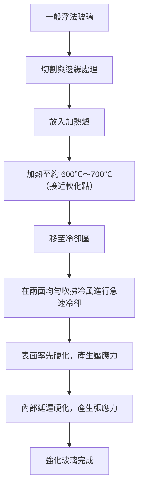
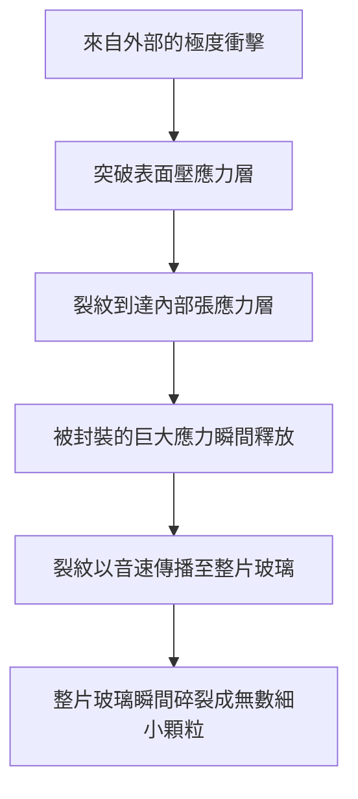

# 強化玻璃是什麼？

我們日常接觸的智慧型手機、汽車側車窗以及辦公室的大型玻璃門，都共同使用了「強化玻璃（Tempered Glass）」。與一般玻璃（浮法玻璃）相比，強化玻璃的強度高出 3 到 5 倍。然而，其真正的價值不僅僅在於「不易破裂」。當萬一破裂時，它不會變成如鋒利刀刃般的碎片，而是碎裂成細小的顆粒狀，這就是它的「安全設計」。

本文將從物理機制與材料工程的角度深入探討強化玻璃為何堅固、經過怎樣的製造過程，以及為何破裂時會粉碎。

## 1. 與一般浮法玻璃的差異

首先，讓我們來了解一般玻璃（浮法玻璃）。浮法玻璃是透過「浮法」製造，將熔融的玻璃漂浮在熔融錫上，使其成為平滑的板狀。這種玻璃透明度高且平滑，但對物理衝擊或熱變化的抵抗力並不強。

當浮法玻璃破裂時，裂紋會自由蔓延，結果形成非常鋒利且危險的碎片（銳角碎裂）。這是因為其內部應力均勻，破壞能量集中在裂紋尖端並瞬間擴展所致。

另一方面，強化玻璃是將這種浮法玻璃經過特殊熱處理（或化學處理）加工而成的。雖然外觀與透光率幾乎沒有改變，但其內部卻封裝著肉眼看不見的「應力風暴」。

## 2. 強化玻璃的製造過程：高溫加熱與急冷

強化玻璃強度的秘密在於其製造過程。讓我們來看看最常見的「風冷強化法」過程。

### 加熱工程
將玻璃加熱至接近其軟化點的約 600℃ 到 700℃。在這個溫度下，玻璃雖然還未熔化，但內部分子變得稍微容易移動，進入應力釋放的狀態（黏彈性狀態）。

### 急冷工程（淬火）
加熱後的玻璃移至冷卻區，高壓冷風從兩面均勻且強力地吹拂。這個「急冷」正是魔法的關鍵。

1. **表面硬化**: 直接接觸冷風的玻璃表面迅速冷卻並固化。
2. **內部收縮**: 表面固化後，玻璃內部依然保持高溫及膨脹狀態。然而，隨著時間推差，內部也會逐漸冷卻並試圖收縮。
3. **應力固定**: 當內部試圖收縮時，已經固化的表面會將其反向拉扯。結果是，玻璃表面永遠固定了「向內擠壓的力量（壓應力）」，而內部則固定了「向外拉扯的力量（張應力）」。

## 3. 壓應力與張應力的絕妙平衡

強化玻璃的強度建立在這種**「表面的壓應力」**與**「內部的張應力」**的平衡之上。

玻璃這種材料，實際上對「推壓的力量（壓縮）」非常耐受，但對「拉扯的力量（拉伸）」卻很脆弱。當一般玻璃受到物體撞擊而彎曲時，受衝擊的另一側表面會產生「張應力」，從而產生裂紋並破裂。

然而在強化玻璃的情況下，表面預先施加了強大的「壓應力」。即使受到外部衝擊使玻璃彎曲，並產生拉扯表面的力量，原有的壓應力也會將其抵消。也就是說，只要衝擊所產生的張應力不超過表面的壓應力，玻璃就不會產生裂紋。

這就是強化玻璃的強度能達到一般玻璃 3 到 5 倍的原因。

## 4. 破裂時的安全機制（顆粒狀碎裂）

強化玻璃的另一個、也是最大的特點在於其「破裂方式」。

強化玻璃內部封裝著巨大的「張應力」。這就像是將彈簧拉伸到極限並固定住一樣。如果因為某種原因（例如被非常銳利的物體刺破表面壓應力層，或是邊緣受到強烈衝擊等）導致玻璃產生裂紋，破壞了這種應力平衡，會發生什麼事呢？

當裂紋到達內部張應力層的瞬間，被封裝的能量會瞬間釋放。由於能量的釋放，裂紋以每秒數千公尺的速度蔓延至整片玻璃，使玻璃瞬間粉碎。

此時產生的碎片會呈現骰子狀或帶有圓角的細小顆粒（顆粒狀碎裂）。這是因為內部應力呈網狀交錯，能量被細緻地分散並釋放。這些細小的碎片不像一般玻璃那樣具有鋒利的刀刃，因此即使打在人體上，造成嚴重割傷的風險也會大幅降低。這就是為什麼汽車車窗和淋浴間的門會強制要求使用強化玻璃的原因。

## 5. 強化玻璃的弱點與注意事項

看似完美的強化玻璃也有一些弱點。

1. **對邊緣（端面）的衝擊抵抗力弱**: 雖然表面是非常堅固的強化玻璃，但切割後的邊緣在結構上應力平衡較不穩定，如果此處受到衝擊，整片玻璃很容易就會粉碎。
2. **無法加工**: 進行強化處理後，絕對無法再進行切割或鑽孔。只要有一點點刮傷，應力平衡就會崩潰並引發爆炸性破裂，因此所有的切割和鑽孔都必須在熱處理前完成。
3. **自發性破裂（自爆）**: 雖然非常罕見，但由於玻璃原料中含有的硫化鎳（NiS）雜質，有時會在沒有受到任何衝擊的情況下突然破裂。這是因為 NiS 具有隨著時間推移和溫度變化而膨脹的特性，這會成為破壞內部應力平衡的導火線。為了防止這種情況，有時會在製造後進行熱浸測試（重新加熱測試），以預先讓不良品破裂。

## 6. 總結

強化玻璃不僅僅是做得很厚實的玻璃。它是極度高度的材料工程結晶，利用熱能將「力量」封裝在玻璃內部，藉由這種力量抵消外部衝擊，並在萬一破裂時將自身粉碎以保護人類。

「不破裂」與「安全地破裂」。兼具這兩點的強化玻璃機制，正靜靜地、強而有力地守護著我們的生活。在次世代的顯示器和建築材料中，這種應力控制技術將進一步進化，發展成更薄、更強、更安全的玻璃材料。
