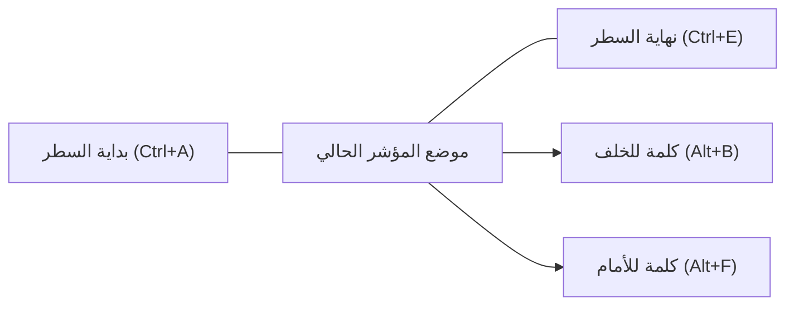
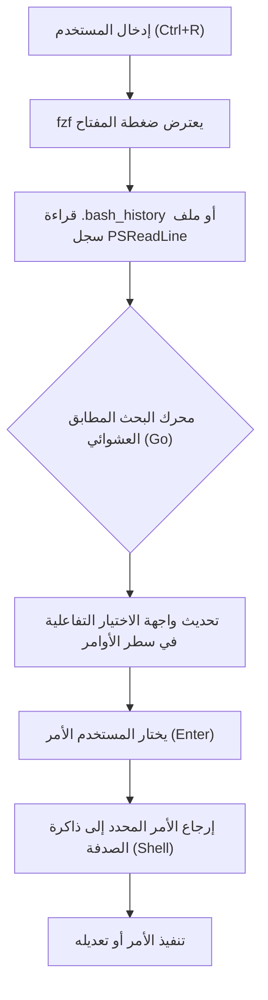

# مقدمة: الزيادة الهائلة في الإنتاجية التي تجلبها كفاءة عمليات سطر الأوامر

في تطوير البرمجيات الحديثة، يعد سطر الأوامر (واجهة سطر الأوامر) الأداة الأهم التي تشكل "أيدي وأرجل" المطور. ليس من المبالغة القول إن المطورين يقضون معظم يومهم في سطر الأوامر، سواء في إدارة البنية التحتية السحابية، بناء الحاويات، إدارة الإصدارات باستخدام Git، أو تشغيل مختلف السكربتات.

ومع ذلك، رغم أن العديد من المطورين يتقنون الأوامر الأساسية لسطر الأوامر (مثل `cd`، `ls`، `git`، `docker` وما إلى ذلك)، إلا أنهم غالباً ما يتجاهلون أهمية **"تحسين إدخال سطر الأوامر نفسه"**. الوصول إلى الفأرة، تحريك المؤشر، الضغط المتكرر على مفاتيح الأسهم لتصحيح الأخطاء المطبعية في الأوامر... تراكم هذه الخسائر الصغيرة يؤدي إلى ضياع هائل في الوقت وعبء إدراكي كبير على المدى الطويل.

في هذه المقالة، وانطلاقاً من فلسفة "لا ترفع يديك عن لوحة المفاتيح"، سنشرح بالتفصيل وبطريقة تقنية كيفية تحسين عمليات سطر الأوامر في بيئات Bash و PowerShell إلى أقصى حد، متضمنة اختصارات لوحة المفاتيح، إعدادات ربط المفاتيح (Keybindings)، تحسين البحث في السجل (History)، واستخدام مضاعفات سطر الأوامر (Terminal Multiplexers).

---

# 1. الخلفية النظرية: نموذج مستوى ضغطات المفاتيح (KLM) وصياغة التكلفة الزمنية

لفهم فوائد الكفاءة بشكل كمي، دعونا نقدم **نموذج مستوى ضغطات المفاتيح (Keystroke-Level Model, KLM)**، وهو أحد أشكال **نموذج GOMS** المستخدم في مجال التفاعل بين الإنسان والحاسوب (HCI).

KLM هو نموذج لتوقع الوقت الذي يستغرقه مستخدم خبير لإكمال مهمة معينة خالية من الأخطاء. تتم صياغة وقت تنفيذ المهمة $T_{execute}$ بالمعادلة الرياضية التالية:

$$ T_{execute} = \sum_{i} \left( K \cdot t_{k} + P \cdot t_{p} + H \cdot t_{h} + M \cdot t_{m} + R \cdot t_{r} \right) $$

هنا، كل متغير له المعنى التالي:
- $K$: ضغط المفاتيح (Keystroking). حركة الضغط على مفتاح في لوحة المفاتيح مرة واحدة.
- $P$: التأشير (Pointing). حركة توجيه جهاز تأشير مثل الفأرة إلى هدف.
- $H$: التمركز (Homing). حركة نقل اليدين من لوحة المفاتيح إلى الفأرة أو العكس.
- $M$: الاستعداد الذهني (Mental preparation). وقت التفكير الإدراكي لتخطيط وإعداد الإجراء المادي التالي.
- $R$: استجابة النظام (System Response). الوقت الذي يضطر المستخدم للانتظار فيه.

يتم تقدير متوسط الوقت اللازم لكل حركة ($t$) عمومًا على النحو التالي:
- $t_{k} \approx 0.2$ ثانية (للكاتب الخبير)
- $t_{p} \approx 1.1$ ثانية
- $t_{h} \approx 0.4$ ثانية
- $t_{m} \approx 1.35$ ثانية

عند محاولة تعديل جزء من أمر باستخدام مفاتيح الأسهم أو الفأرة في عمليات سطر الأوامر، يحدث التمركز ($H$) والتأشير ($P$)، مما يؤدي إلى عقبة زمنية تبلغ حوالي 1.5 إلى 2.0 ثانية لكل تعديل. من ناحية أخرى، إذا تعلمت اختصارات سطر الأوامر المناسبة، يمكنك تقليل $H$ و $P$ إلى **الصفر**، وتحقيق هدفك من خلال ضغطات المفاتيح ($K$) فقط.

لنفترض أنك تقوم بإدخال وتحرير الأوامر 500 مرة في اليوم، وباستخدام الاختصارات تمكنت من تقليل الوقت بمقدار ثانيتين لكل مرة.
$$ 500 \text{ مرة/يوم} \times 2 \text{ ثانية} = 1000 \text{ ثانية/يوم} \approx 16.6 \text{ دقيقة/يوم} $$
إذا حولنا هذا إلى حساب سنوي (240 يوم عمل)، فسيكون ذلك يعادل توفير **حوالي 66 ساعة (حوالي 8 أيام عمل)**. الأهم من ذلك هو تقليل الاستعداد الذهني ($M$)، مما يوفر ميزة لا تقدر بثمن وهي **"عدم انقطاع التفكير (الحفاظ على حالة التدفق أو Flow)"**.

---

# 2. أعماق Bash Readline وربط مفاتيح Emacs

يستخدم Bash، الصدفة الافتراضية في أنظمة Linux و macOS، مكتبة **GNU Readline** داخليًا لمعالجة إدخال سطر الأوامر. الإعداد الافتراضي لـ Readline هو **ربط مفاتيح Emacs**، وإتقان ذلك هو الخطوة الأولى نحو كفاءة سطر الأوامر.

## 2.1. اختصارات التنقل

تحريك المؤشر حرفًا بحرف باستخدام مفاتيح الأسهم هو قمة عدم الكفاءة. دعونا نحفر الاختصارات التالية في "الذاكرة العضلية".

- **`Ctrl + A`**: الانتقال إلى بداية السطر (Start of line). يُستخدم بكثرة.
- **`Ctrl + E`**: الانتقال إلى نهاية السطر (End of line).
- **`Alt + B`** (Meta+B): الرجوع كلمة واحدة للوراء (Backward word). الانتقال السريع باستخدام الشرطة المائلة (/) أو المسافة كفاصل بين الكلمات.
- **`Alt + F`** (Meta+F): التقدم كلمة واحدة للأمام (Forward word).



## 2.2. اختصارات التحرير (القص واللصق أو Kill and Yank)

في مصطلحات Emacs، يُطلق على قص النص (Cut) اسم "Kill"، ولصقه (Paste) اسم "Yank".

- **`Ctrl + U`**: قص (مسح) كل شيء من موضع المؤشر إلى بداية السطر. عند كتابة كلمة مرور بشكل خاطئ، أو عندما تريد إعادة كتابة الأمر من البداية، يمكنك مسحه في لحظة.
- **`Ctrl + K`**: قص من موضع المؤشر إلى نهاية السطر.
- **`Ctrl + W`**: قص الكلمة السابقة لموضع المؤشر. مفيد جداً عند الرغبة في مسح وسيط (Argument) واحد لإعادة كتابته.
- **`Alt + D`** (Meta+D): قص الكلمة التالية لموضع المؤشر.
- **`Ctrl + Y`**: لصق (Yank) آخر ما تم قصه. يمكنك القيام بأشياء متقدمة مثل استخدام `Ctrl+Y` لاستعادة أمر تم مسحه بـ `Ctrl+U` بعد الانتقال إلى دليل (Directory) آخر.
- **`Ctrl + _`** (أو `Ctrl + x, Ctrl + u`): تراجع (Undo). يمكنك الاستعادة إذا مسحت شيئًا عن طريق الخطأ.

## 2.3. اختصارات هامة أخرى

- **`Ctrl + L`**: مسح الشاشة (يعادل أمر `clear`).
- **`Ctrl + C`**: إلغاء إدخال الأمر الحالي، أو إيقاف عملية قيد التشغيل.
- **`Ctrl + D`**: إرسال EOF (End Of File). إذا لم يتم إدخال أي أحرف، فسيقوم بإنهاء الصدفة (Shell) باستخدام (`exit`).

## 2.4. تخصيص Readline عبر ملف ~/.inputrc

يمكن تحسين روابط المفاتيح هذه بشكل أكبر عن طريق تحرير ملف `~/.inputrc` في المجلد الرئيسي (Home directory). على سبيل المثال، بإضافة الإعداد التالي، يمكنك استخدام مفتاحي الأسهم للأعلى وللأسفل للبحث فقط في السجلات (History) التي تتطابق بادئتها مع النص الجاري إدخاله.

```bash
# مثال لإعدادات ~/.inputrc
"\e[A": history-search-backward
"\e[B": history-search-forward
set completion-ignore-case on
set show-all-if-ambiguous on
```
باستخدام هذا، إذا كتبت `docker ` ثم ضغطت على مفتاح السهم لأعلى، يمكنك التنقل بسرعة فقط بين الأوامر السابقة التي تبدأ بـ `docker`.

---

# 3. PowerShell و PSReadLine: عمليات تشبه Bash في بيئة Windows

في الإصدارات الأولى، كان PowerShell، الصدفة الافتراضية في Windows، يتمتع ببيئة إدخال ضعيفة تعادل موجه الأوامر (cmd.exe). ومع ذلك، مع إدخال وحدة **PSReadLine**، اكتسب ميزات متقدمة لتحرير سطر الأوامر تتساوى مع Bash (Readline) أو حتى تتجاوزها.

## 3.1. تفعيل PSReadLine ووضع Emacs

تم دمج PSReadLine بشكل افتراضي في PowerShell 5.1 وما بعده (بالإضافة إلى PowerShell Core). لكي يرفع مستخدمو Windows إنتاجية سطر الأوامر لديهم إلى مستوى Linux، من الضروري تغيير وضع التحرير في PSReadLine من وضع Windows الافتراضي (الذي يشبه cmd) إلى **وضع Emacs**.

دعونا نعدل ملف تعريف PowerShell (`$PROFILE`) ليتم تحميل الإعدادات تلقائيًا.

```powershell
# فتح $PROFILE في VS Code
code $PROFILE
```

أضف الإعدادات التالية إلى `$PROFILE`:

```powershell
# استيراد وحدة PSReadLine (إذا تم ذلك بشكل صريح)
Import-Module PSReadLine

# ضبط وضع التحرير على Emacs، وتفعيل نفس اختصارات Bash
Set-PSReadLineOption -EditMode Emacs

# تجاهل صوت الجرس (صوت الخطأ)
Set-PSReadLineOption -BellStyle None
```

الآن، حتى في PowerShell على Windows، ستعمل مفاتيح ربط نمط Emacs/Bash بالكامل مثل `Ctrl+A` (بداية السطر)، `Ctrl+E` (نهاية السطر)، `Ctrl+U` (مسح حتى بداية السطر)، و `Alt+B` / `Alt+F` (انتقال بين الكلمات).

## 3.2. التنبؤ الذكي (Predictive IntelliSense) والبحث المتقدم في السجل

من أهم ميزات PSReadLine الميزة القوية **التنبؤ الذكي (Predictive IntelliSense)**، والتي تعتمد على سجل الإدخال أو إضافات التنبؤ الخارجية. بمجرد أن تبدأ في الكتابة، يتم اقتراح الأمر الكامل الأكثر احتمالًا من السجل السابق باللون الرمادي الفاتح (مضمن). لقبول الاقتراح، ما عليك سوى الضغط على مفتاح السهم الأيمن (أو `Alt+F` لكلمة بكلمة).

```powershell
# إضافة إلى $PROFILE: تفعيل ميزة التنبؤ (يتطلب PowerShell 7.1+ / PSReadLine 2.1+)
Set-PSReadLineOption -PredictionSource History
Set-PSReadLineOption -PredictionViewStyle InlineView
# لعرضه في شكل قائمة، حدد ListView
# Set-PSReadLineOption -PredictionViewStyle ListView
```

## 3.3. تجاوز سلوك مفاتيح الأعلى والأسفل (بحث بتطابق البادئة مشابه لـ Bash)

سلوك مفاتيح الأسهم لأعلى ولأسفل الافتراضي في PowerShell هو مجرد انتقال تسلسلي عبر السجل. نعيد تعيين هذا إلى وظيفة "البحث في السجل الذي يتطابق في البادئة مع السلسلة التي يتم إدخالها حاليًا"، تمامًا مثل `~/.inputrc` المذكور سابقًا.

```powershell
# إضافة إلى $PROFILE: تسجيل معالج البحث بتطابق البادئة للسجل
Set-PSReadLineKeyHandler -Key UpArrow -Function HistorySearchBackward
Set-PSReadLineKeyHandler -Key DownArrow -Function HistorySearchForward
```

يتيح لك ذلك إنشاء أوامر والبحث عنها وتشغيلها بسهولة في بيئة Windows باستخدام نفس حركات الأصابع المتبعة في بيئة Linux. إن توحيد العبء الإدراكي ($M$) عبر المنصات أمر بالغ الأهمية لمهندسي DevOps.

---

# 4. قمة البحث في السجل: دمج fzf (Fuzzy Finder)

أحد الإجراءات الأكثر شيوعًا في تشغيل سطر الأوامر هو **"العثور على أمر معقد تم تنفيذه في الماضي من السجل وإعادة تنفيذه"**. نظرًا لأن البحث العكسي القياسي `Ctrl+R` هو بحث بتطابق تام، فمن الصعب استرجاع أمر من ذاكرة غامضة مثل "أتذكر أنني استخدمت docker run وقمت بعمل volume mount ...".

أداة البحث العشوائي السريعة جدًا والأغراض العامة **`fzf`** والمكتوبة بلغة Go، تحل هذه المشكلة بأناقة.

## 4.1. مسار البحث العشوائي باستخدام fzf

عند دمج `fzf` في بحث سجل الأوامر، تتم المعالجة في المسار التالي.



إذا أدخل المستخدم كلمات رئيسية متعددة مفصولة بمسافات (مثل: `docker ubuntu bash`)، فسيقوم محرك مطابقة fzf بمسح ملف السجل بالكامل وعرض السجلات التي تحتوي على تلك الكلمات الرئيسية بترتيب عشوائي أو متباعدة بشكل فوري.

## 4.2. دمج fzf في Bash

في بيئات Linux مثل Ubuntu/Debian، يمكنك تثبيته بسهولة باستخدام apt. علاوة على ذلك، من خلال تشغيل البرنامج النصي للتثبيت، سيتم الكتابة فوق روابط مفاتيح Bash تلقائيًا.

```bash
# تثبيت fzf
git clone --depth 1 https://github.com/junegunn/fzf.git ~/.fzf
~/.fzf/install
```
يؤدي هذا إلى ظهور واجهة fzf التفاعلية في وضع ملء الشاشة (أو في جزء tmux) عند الضغط على `Ctrl+R`، مما يتيح لك البحث في السجل بشكل بديهي للغاية. في واجهة البحث، يمكنك تحديد عنصر باستخدام `Ctrl+N` (لأسفل) / `Ctrl+P` (لأعلى).

## 4.3. دمج PSFzf في PowerShell

حتى في بيئة Windows PowerShell، يمكنك الحصول على نفس التجربة بالضبط باستخدام وحدة `PSFzf`. أولاً، قم بتثبيت ثنائيات fzf (أداة Scoop ملائمة لذلك)، ثم أدخل الوحدة.

```powershell
# تثبيت ثنائيات fzf باستخدام Scoop
scoop install fzf

# تثبيت وحدة PSFzf
Install-Module -Name PSFzf -Scope CurrentUser
```

ثم أضف إعدادًا إلى `$PROFILE` واربط المفتاح.

```powershell
# إضافة إلى $PROFILE
Import-Module PSFzf

# تعيين Ctrl+R للبحث في السجل عبر fzf
Set-PsFzfOption -PSReadlineChordReverseHistorySearch 'Ctrl+r'
```
باستخدام هذا، يمكن إجراء بحث عشوائي (Fuzzy search) فوريًا من السجل الضخم لـ PowerShell في Windows بمجرد الضغط على `Ctrl+R`.

---

# 5. تقليل عدد ضغطات المفاتيح عبر الأسماء المستعارة (Aliases) والدوال التغليفية (Wrapper Functions)

بالإضافة إلى الاختصارات والبحث في السجل، فإن الطريقة الأكثر مباشرة لتقليل ضغطات المفاتيح نفسها ($K$) هي تحديد الأسماء المستعارة والدوال التغليفية.

## 5.1. تصغير عمليات Git

نستخدم Git مرات لا تحصى كل يوم. كتابة `git status` أو `git commit` بالكامل في كل مرة يعد إهدارًا كبيرًا في نموذج KLM.

**مثال لـ Bash (في `~/.bashrc`)**:
```bash
alias g='git'
alias gs='git status -sb'
alias ga='git add'
alias gc='git commit -m'
alias gco='git checkout'
alias gp='git push'
alias gl='git log --oneline --graph --decorate --all'
```

**مثال لـ PowerShell (في `$PROFILE`)**:
```powershell
Set-Alias -Name g -Value git
function gs { git status -sb $args }
function ga { git add $args }
function gc { git commit -m $args }
function gco { git checkout $args }
function gl { git log --oneline --graph --decorate --all $args }
```
※ نظرًا لأنه لا يمكن لـ `Set-Alias` في PowerShell تثبيت الوسائط (Arguments)، فمن الأفضل تحديد الأسماء المستعارة التي تحتوي على خيارات كدوال (function) كما هو موضح أعلاه.

## 5.2. تحسين التنقل بين الأدلة (z / zoxide)

الانتقال إلى أدلة متداخلة عميقة باستخدام الأمر `cd` أمر مزعج. في السنوات الأخيرة، أصبحت الأداة **`zoxide`** (المبنية بلغة Rust)، والتي تتعلم من سجل انتقال المستخدم وتكرار استخدامها (Frecency: Frequency + Recency)، وتسمح لك بالقفز إلى الدليل المطلوب بمجرد إدخال جزء من المسار، معياراً.

```bash
# بعد تثبيت zoxide، استخدم z بدلاً من cd
z proj # القفز لحظياً إلى /home/user/workspace/projects/
```
يدعم zoxide كل من Bash و Zsh و PowerShell، مما يوفر تنقلًا سريعًا في الأدلة بشكل مشابه عبر الأنظمة الأساسية.

---

# 6. مضاعف سطر الأوامر (Terminal Multiplexer) وإدارة الأجزاء (Panes)

إذا بدأت عملية (مثل خادم محلي) في نافذة سطر أوامر واحدة، فسيتعين عليك فتح نافذة سطر أوامر جديدة تمامًا للقيام بعمل آخر. تبديل النوافذ (`Alt+Tab`) يتضمن حركة العين ويؤدي إلى تكلفة تبديل السياق (زيادة في الاستعداد الذهني $M$).

الحل هو **مضاعف سطر الأوامر (Terminal Multiplexer)**، والذي يمكنه تقسيم الشاشة إلى أجزاء متعددة (Panes) والحفاظ على جلسات متعددة قيد التشغيل في الخلفية.

## 6.1. بنية tmux وانتقال الحالة (Linux / macOS)

`tmux` هو مضاعف قوي يتمتع ببنية خادم-عميل. لتجنب تعارض اختصارات tmux مع البرامج الأخرى، يجب دائمًا الضغط على **مفتاح البادئة (الافتراضي هو Ctrl+B)** أولاً.

يوضح مخطط انتقال الحالة في Mermaid التالي مسار العمل الأساسي في tmux.

```mermaid
stateDiagram-v2
    [*] --> Normal["الوضع العادي"]
    Normal --> Prefix["وضع البادئة (Ctrl+B)"]
    Prefix --> Command["موجه الأوامر (:)"]
    Prefix --> SplitV["تقسيم الجزء عموديًا (%)"]
    Prefix --> SplitH["تقسيم الجزء أفقيًا (\")"]
    Prefix --> Switch["تبديل النافذة (n/p/0-9)"]
    Prefix --> Detach["فصل الجلسة (d)"]
    
    Command --> Normal["تنفيذ أمر tmux"]
    SplitV --> Normal["العودة للوضع العادي"]
    SplitH --> Normal["العودة للوضع العادي"]
    Switch --> Normal["العودة للوضع العادي"]
    Detach --> [*]
```

من الممارسات الشائعة تحرير ملف `~/.tmux.conf` لتغيير مفتاح البادئة إلى `Ctrl+A` الأسهل في الضغط (بأسلوب GNU Screen)، وربط حركة الأجزاء بمفاتيح `hjkl` بأسلوب Vim.

```text
# مثال ~/.tmux.conf
# تغيير البادئة إلى Ctrl-a
set -g prefix C-a
unbind C-b
bind C-a send-prefix

# تقسيم الأجزاء باستخدام مفاتيح بديهية
bind | split-window -h
bind - split-window -v

# حركة الأجزاء بأسلوب Vim
bind h select-pane -L
bind j select-pane -D
bind k select-pane -U
bind l select-pane -R
```

## 6.2. إدارة الأجزاء في Windows Terminal

في بيئة Windows، يدعم **Windows Terminal** الحديث ميزة تقسيم الأجزاء بشكل افتراضي. لا يحتوي على ميزة استمرار الجلسة مثل tmux، ولكن يمكنك إدارة الأجزاء بسهولة من خلال واجهة المستخدم الرسومية. من خلال فتح الإعدادات (`settings.json`) وتخصيص الإجراءات، يمكنك إكمال العمليات بلوحة المفاتيح فقط.

```json
// جزء من settings.json في Windows Terminal
"actions": [
    { "command": { "action": "splitPane", "split": "auto" }, "keys": "alt+shift+d" },
    { "command": { "action": "moveFocus", "direction": "left" }, "keys": "alt+left" },
    { "command": { "action": "moveFocus", "direction": "right" }, "keys": "alt+right" }
]
```
يسمح لك هذا بتقسيم الشاشة بمجرد الضغط على `Alt+Shift+D` في PowerShell، والتنقل بسلاسة بين الأجزاء باستخدام مفاتيح الأسهم و `Alt`.

---

# 7. مثال لبناء سير عمل عملي

من خلال الجمع بين العناصر المقدمة حتى الآن (روابط مفاتيح Emacs، PSReadLine، fzf، الأسماء المستعارة، ومضاعفات سطر الأوامر)، يتم تسريع المهام اليومية بشكل كبير.

على سبيل المثال، افترض أن لديك مهمة "التحقق من سجلات الخادم أثناء الاستجابة لمشكلة، وفي نفس الوقت فحص سجل التزامات (Commits) الكود المقابل في Git".

1. افتح سطر الأوامر، واكتب `z prod` للقفز فوراً إلى دليل العمل الخاص ببيئة الإنتاج.
2. اضغط `Ctrl+R`، واكتب `ssh auth` في النافذة المنبثقة لـ `fzf` لاستدعاء أمر تسجيل دخول SSH المعقد السابق وتنفيذه.
3. اضغط `Ctrl+B` ثم `|` (تقسيم جزء tmux)، وفي الجزء الأيمن نفذ `gs` (git status) وغيره لفحص الكود.
4. إذا وجدت خطأ في مخرجات السجل في الجزء الأيسر، اضغط `Ctrl+B` ثم `[` للدخول في وضع النسخ، واستخدم لوحة المفاتيح فقط لنسخ (Yank) رسالة الخطأ.
5. الصقها في المحرر لتحديد السبب.

في هذه السلسلة من الحركات، **لن تلمس الفأرة أبداً**. يتم التخلص من $H$ (التمركز) و $P$ (التأشير) تماماً في معادلة KLM، وعمليات سطر الأوامر ستواكب سرعة تفكيرك تماماً.

---

# الخلاصة

في هذا المقال، شرحنا بالتفصيل موضوع "تحسين عمليات سطر الأوامر"، الذي يحدد إنتاجية المطورين، بدءاً من نظرية KLM إلى الروابط الفعلية لمفاتيح Bash/PowerShell، وحتى دمج fzf و tmux.

في البداية، قد تشعر بالتوتر عند محاولة تذكر كتابة `Ctrl+A` أو `Ctrl+E`. ولكن، مع الاستخدام المتعمد لعدة أسابيع، ستصبح هذه الاختصارات جزءاً راسخاً من **الذاكرة العضلية (Muscle Memory)**. بمجرد أن تترسخ، ستتمكن لا إرادياً من التعامل مع سطر الأوامر بحرية كاملة، وستكون ثروة تحسن بشكل كبير تجربة المطور الخاصة بك (Developer Experience, DX) مدى الحياة.

بدءاً من اليوم، افتح `$PROFILE` أو `~/.bashrc` وابدأ في بناء بيئة سطر الأوامر المطلقة التي تناسب يديك بشكل أفضل.
