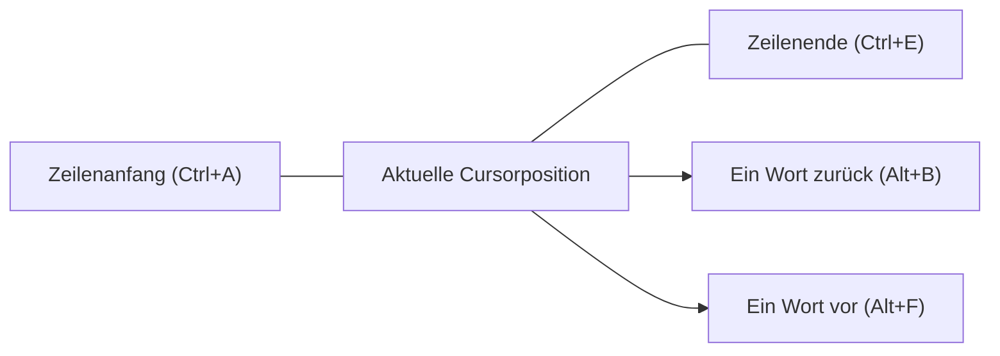
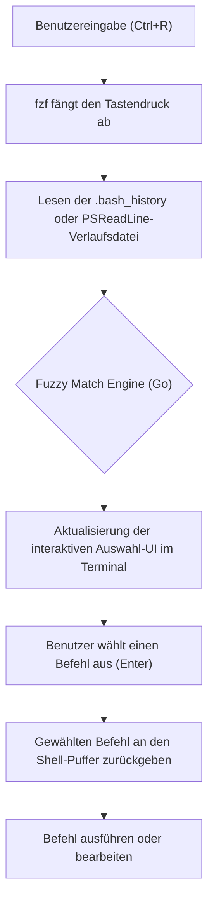

# Einführung: Überwältigende Produktivitätssteigerungen durch effiziente Terminal-Bedienung

In der modernen Softwareentwicklung ist das Terminal (Command Line Interface) das wichtigste Werkzeug, das als die "Hände und Füße" des Entwicklers fungiert. Es ist keine Übertreibung zu sagen, dass Entwickler den Großteil ihres Tages im Terminal verbringen, sei es für die Verwaltung von Cloud-Infrastrukturen, das Erstellen von Containern, die Versionskontrolle mit Git oder die Ausführung verschiedener Skripte.

Obwohl viele Entwickler die grundlegenden Befehle des Terminals (`cd`, `ls`, `git`, `docker` usw.) beherrschen, übersehen sie oft die Perspektive, **"die Eingabe in das Terminal selbst zu optimieren"**. Zur Maus greifen, den Cursor bewegen, wiederholt die Pfeiltasten drücken, um Tippfehler in Befehlen zu korrigieren... Die Anhäufung dieser kleinen Verluste führt über einen langen Zeitraum zu einer enormen Zeitverschwendung und kognitiven Belastung.

In diesem Artikel erklären wir sehr detailliert und technisch die Optimierung der Terminal-Bedienung in Bash- und PowerShell-Umgebungen nach der Philosophie "Lass die Hände nicht von der Tastatur". Wir behandeln Shortcuts, Tastenkombinationen, Optimierung der Verlaufssuche und die Nutzung von Terminal-Multiplexern, um die Effizienz auf das Maximum zu steigern.

---

# 1. Theoretischer Hintergrund: Keystroke-Level-Modell (KLM) und die Formulierung der zeitlichen Kosten

Um die Vorteile der Effizienz quantitativ zu verstehen, betrachten wir das **Keystroke-Level-Modell (KLM)**, eine Art des **GOMS-Modells**, das im Bereich der HCI (Human-Computer Interaction) verwendet wird.

KLM ist ein Modell zur Vorhersage der Zeit, die ein erfahrener Benutzer benötigt, um eine bestimmte, fehlerfreie Aufgabe abzuschließen. Die Ausführungszeit der Aufgabe $T_{execute}$ wird durch die folgende mathematische Gleichung formuliert.

$$ T_{execute} = \sum_{i} \left( K \cdot t_{k} + P \cdot t_{p} + H \cdot t_{h} + M \cdot t_{m} + R \cdot t_{r} \right) $$

Hierbei haben die einzelnen Variablen folgende Bedeutungen:
- $K$: Tastenanschlag (Keystroking). Die Aktion, eine Taste auf der Tastatur einmal zu drücken.
- $P$: Zeigen (Pointing). Die Aktion, mit einem Zeigegerät wie einer Maus auf ein Ziel zu zeigen.
- $H$: Umpositionierung (Homing). Die Aktion, die Hände von der Tastatur zur Maus oder umgekehrt zu bewegen.
- $M$: Mentale Vorbereitung (Mental preparation). Die kognitive Denkzeit, um die nächste physische Aktion zu planen und vorzubereiten.
- $R$: Systemantwort (System Response). Die Zeit, die der Benutzer warten muss.

Die durchschnittliche Zeitdauer ($t$) für jede Aktion wird im Allgemeinen wie folgt geschätzt:
- $t_{k} \approx 0.2$ Sekunden (für einen erfahrenen Schreiber)
- $t_{p} \approx 1.1$ Sekunden
- $t_{h} \approx 0.4$ Sekunden
- $t_{m} \approx 1.35$ Sekunden

Wenn Sie versuchen, einen Teil eines Befehls im Terminal mit den Pfeiltasten oder der Maus zu korrigieren, treten Homing ($H$) und Pointing ($P$) auf, was zu einer Strafe von etwa 1,5 bis 2,0 Sekunden pro Korrektur führt. Andererseits können Sie durch das Erlernen geeigneter Terminal-Shortcuts $H$ und $P$ auf **null** reduzieren und das Ziel nur mit Tastenanschlägen ($K$) erreichen.

Angenommen, Sie geben täglich 500 Befehle ein und bearbeiten diese, und durch die Nutzung von Shortcuts können Sie pro Befehl 2 Sekunden einsparen.
$$ 500 \text{ mal/Tag} \times 2 \text{ Sekunden} = 1000 \text{ Sekunden/Tag} \approx 16.6 \text{ Minuten/Tag} $$
Wenn wir dies auf ein Jahr (240 Arbeitstage) hochrechnen, bedeutet das eine Zeitersparnis von **etwa 66 Stunden (ca. 8 Arbeitstage)**. Noch wichtiger ist, dass durch die Reduzierung der mentalen Vorbereitung ($M$) der unschätzbare Vorteil entsteht, **"dass das Denken nicht unterbrochen wird (der Flow-Zustand aufrechterhalten werden kann)"**.

---

# 2. Die Tiefen von Bash Readline und Emacs Keybindings

Bash, die Standard-Shell von Linux und macOS, verwendet intern die Bibliothek **GNU Readline** zur Verarbeitung der Kommandozeileneingabe. Die Standardeinstellung dieser Readline sind **Emacs-Keybindings**, und diese zu meistern ist der erste Schritt zur Steigerung der Terminal-Effizienz.

## 2.1. Shortcuts zur Navigation

Den Cursor zeichenweise mit den Pfeiltasten zu bewegen, ist der Gipfel der Ineffizienz. Prägen Sie sich die folgenden Shortcuts in Ihr "Muskelgedächtnis" ein.

- **`Ctrl + A`**: Zum Anfang der Zeile (Start of line) springen. Wird sehr oft verwendet.
- **`Ctrl + E`**: Zum Ende der Zeile (End of line) springen.
- **`Alt + B`** (Meta+B): Ein Wort zurückspringen (Backward word). Bewegt sich schnell wortweise anhand von Schrägstrichen oder Leerzeichen.
- **`Alt + F`** (Meta+F): Ein Wort vorwärts springen (Forward word).



## 2.2. Shortcuts zur Bearbeitung (Kill und Yank)

Im Emacs-Jargon wird das Ausschneiden (Cut) von Text als "Kill" und das Einfügen (Paste) als "Yank" bezeichnet.

- **`Ctrl + U`**: Den Bereich von der Cursorposition bis zum Zeilenanfang killen (löschen). Dies ermöglicht es Ihnen, den Befehl im Handumdrehen zu löschen, z. B. bei einer falschen Passworteingabe oder wenn Sie den Befehl von Grund auf neu schreiben möchten.
- **`Ctrl + K`**: Den Bereich von der Cursorposition bis zum Zeilenende killen.
- **`Ctrl + W`**: Das vorhergehende Wort ab der Cursorposition killen. Sehr nützlich, wenn Sie ein Argument löschen und neu schreiben müssen.
- **`Alt + D`** (Meta+D): Das folgende Wort ab der Cursorposition killen.
- **`Ctrl + Y`**: Den zuletzt gekillten Inhalt yanken (einfügen). Es ermöglicht fortgeschrittene Anwendungen wie das Wiederherstellen eines mit `Ctrl+U` gelöschten Befehls mit `Ctrl+Y`, nachdem Sie in ein anderes Verzeichnis gewechselt sind.
- **`Ctrl + _`** (oder `Ctrl + x, Ctrl + u`): Rückgängig machen (Undo). Hiermit können Sie etwas wiederherstellen, wenn Sie es versehentlich gelöscht haben.

## 2.3. Weitere wichtige Shortcuts

- **`Ctrl + L`**: Den Bildschirm leeren (äquivalent zum Befehl `clear`).
- **`Ctrl + C`**: Die aktuelle Befehlseingabe abbrechen oder den laufenden Prozess unterbrechen.
- **`Ctrl + D`**: EOF (End Of File) senden. Wenn keine Zeichen eingegeben wurden, wird die Shell beendet (`exit`).

## 2.4. Anpassung von Readline über ~/.inputrc

Diese Keybindings können durch Bearbeiten der Datei `~/.inputrc` im Home-Verzeichnis weiter optimiert werden. Wenn Sie beispielsweise die folgenden Einstellungen hinzufügen, können Sie mit den Pfeiltasten (hoch/runter) nur nach Verläufen suchen, die eine Präfix-Übereinstimmung mit der aktuell eingegebenen Zeichenfolge haben.

```bash
# Beispielkonfiguration für ~/.inputrc
"\e[A": history-search-backward
"\e[B": history-search-forward
set completion-ignore-case on
set show-all-if-ambiguous on
```
Dadurch können Sie schnell durch den Befehlsverlauf blättern, der nur Befehle enthält, die mit `docker` beginnen, indem Sie `docker ` eingeben und dann die Pfeiltaste nach oben drücken.

---

# 3. PowerShell und PSReadLine: Bash-ähnliche Bedienung in einer Windows-Umgebung

Die PowerShell, die Standard-Shell unter Windows, verfügte in frühen Versionen nur über eine schwache Eingabeumgebung, die der Eingabeaufforderung (cmd.exe) entsprach. Durch die Einführung des Moduls **PSReadLine** hat sie jedoch hochentwickelte Funktionen zur Bearbeitung der Kommandozeile erhalten, die mit Bash (Readline) vergleichbar sind oder diese sogar übertreffen.

## 3.1. Aktivierung von PSReadLine und der Emacs-Modus

PSReadLine ist standardmäßig in PowerShell 5.1 und neuer (sowie PowerShell Core) integriert. Damit Windows-Benutzer die Terminal-Produktivität auf Linux-Niveau heben können, ist es unerlässlich, den Bearbeitungsmodus von PSReadLine vom Standard-Windows-Modus (cmd-ähnlich) in den **Emacs-Modus** zu ändern.

Bearbeiten Sie das PowerShell-Profil (`$PROFILE`), um die Einstellungen automatisch zu laden.

```powershell
# Öffnen Sie $PROFILE in VS Code
code $PROFILE
```

Fügen Sie die folgenden Einstellungen zu `$PROFILE` hinzu:

```powershell
# Importieren des PSReadLine-Moduls (falls explizit gewünscht)
Import-Module PSReadLine

# Setzen des Bearbeitungsmodus auf Emacs und Aktivieren der gleichen Shortcuts wie in Bash
Set-PSReadLineOption -EditMode Emacs

# Den Klingelton (Fehlerton) ignorieren
Set-PSReadLineOption -BellStyle None
```

Nun funktionieren Emacs/Bash-artige Keybindings wie `Ctrl+A` (Zeilenanfang), `Ctrl+E` (Zeilenende), `Ctrl+U` (Löschen bis zum Zeilenanfang) und `Alt+B` / `Alt+F` (wortweise Navigation) auch in der Windows PowerShell perfekt.

## 3.2. Predictive IntelliSense und erweiterte Verlaufssuche

Eine der stärksten Funktionen von PSReadLine ist das **Predictive IntelliSense**, das auf dem Eingabeverlauf oder externen Vorhersage-Plugins basiert. Wenn Sie mit der Eingabe beginnen, wird der wahrscheinlichste vollständige Befehl aus dem bisherigen Verlauf in hellem Grau (Inline) vorgeschlagen. Wenn Sie den Vorschlag akzeptieren möchten, drücken Sie einfach die rechte Pfeiltaste (oder `Alt+F` für wortweise Übernahme).

```powershell
# Zu $PROFILE hinzufügen: Aktivierung der Vorhersagefunktion (erfordert PowerShell 7.1+ / PSReadLine 2.1+)
Set-PSReadLineOption -PredictionSource History
Set-PSReadLineOption -PredictionViewStyle InlineView
# Wenn Sie es im Listenformat anzeigen möchten, geben Sie ListView an
# Set-PSReadLineOption -PredictionViewStyle ListView
```

## 3.3. Überschreiben des Verhaltens der Pfeiltasten nach oben/unten (Bash-ähnliche Präfixsuche)

Die standardmäßigen Aufwärts-/Abwärtspfeiltasten in PowerShell bewegen sich einfach sequenziell durch den Verlauf. Wir weisen diese neu zu, um die Funktion "Verlaufssuche mit Präfix-Übereinstimmung der aktuell eingegebenen Zeichenfolge" abzubilden, ähnlich wie bei der zuvor erwähnten `~/.inputrc`.

```powershell
# Zu $PROFILE hinzufügen: Registrierung von Handlern für die Präfixsuche im Verlauf
Set-PSReadLineKeyHandler -Key UpArrow -Function HistorySearchBackward
Set-PSReadLineKeyHandler -Key DownArrow -Function HistorySearchForward
```

Dadurch können Sie selbst in einer Windows-Umgebung intuitiv Befehle erstellen, suchen und ausführen, und zwar mit genau denselben Fingerbewegungen wie in einer Linux-Umgebung. Die plattformübergreifende Vereinheitlichung der kognitiven Belastung ($M$) ist für DevOps-Ingenieure äußerst wichtig.

---

# 4. Der Höhepunkt der Verlaufssuche: Die Integration von fzf (Fuzzy Finder)

Eine der häufigsten Aktionen bei der Terminal-Bedienung ist das **"Suchen und erneute Ausführen eines komplexen Befehls, der in der Vergangenheit aus dem Verlauf ausgeführt wurde"**. Da das standardmäßige `Ctrl+R` (Reverse Search) eine exakte Suche ist, ist es schwierig, Befehle aus einer vagen Erinnerung wie "Ich glaube, ich habe mit docker run ein Volume gemountet..." abzurufen.

Eine elegante Lösung für dieses Problem ist das in Go geschriebene, ultraschnelle, universelle Fuzzy-Suchwerkzeug **`fzf`**.

## 4.1. Die Pipeline der Fuzzy-Suche mit fzf

Wenn `fzf` in die Suche des Befehlsverlaufs integriert wird, läuft die Verarbeitung in der folgenden Pipeline ab.



Wenn ein Benutzer mehrere durch Leerzeichen getrennte Schlüsselwörter (z. B. `docker ubuntu bash`) eingibt, scannt die Matching-Engine von fzf sofort die gesamte Verlaufsdatei und listet Verläufe auf, die diese Schlüsselwörter in beliebiger Reihenfolge und auch an getrennten Positionen enthalten.

## 4.2. fzf-Integration in Bash

In Linux-Umgebungen wie Ubuntu/Debian kann es einfach über apt installiert werden. Darüber hinaus können durch Ausführen des Installationsskripts die Bash-Keybindings automatisch überschrieben werden.

```bash
# fzf installieren
git clone --depth 1 https://github.com/junegunn/fzf.git ~/.fzf
~/.fzf/install
```
Wenn Sie nun `Ctrl+R` drücken, öffnet sich die interaktive Benutzeroberfläche von fzf im Vollbildmodus (oder innerhalb eines tmux-Panels) und ermöglicht Ihnen eine äußerst intuitive Suche in der Historie. Auf der Such-UI können Sie mit `Ctrl+N` (unten) / `Ctrl+P` (oben) Elemente auswählen.

## 4.3. PSFzf-Integration in PowerShell

Auch in der Windows PowerShell-Umgebung können Sie mit dem Modul `PSFzf` genau die gleiche Erfahrung machen. Installieren Sie zunächst das fzf-Binary (z. B. bequem mit Scoop) und fügen Sie das Modul hinzu.

```powershell
# Installieren des fzf-Binaries mit Scoop
scoop install fzf

# Installation des PSFzf-Moduls
Install-Module -Name PSFzf -Scope CurrentUser
```

Fügen Sie dann die Einstellungen zu `$PROFILE` hinzu, um die Tasten zu binden.

```powershell
# Zu $PROFILE hinzufügen
Import-Module PSFzf

# Ctrl+R der fzf-Verlaufssuche zuweisen
Set-PsFzfOption -PSReadlineChordReverseHistorySearch 'Ctrl+r'
```
Damit ist auch unter Windows mit `Ctrl+R` im Handumdrehen eine Fuzzy-Suche im riesigen PowerShell-Verlauf der Vergangenheit möglich.

---

# 5. Minimierung der Tastenanschläge durch Aliase und Wrapper-Funktionen

Neben Shortcuts und Verlaufssuchen ist die direkteste Methode, die Tastenanschläge ($K$) selbst zu reduzieren, die Definition von Aliasen und Wrapper-Funktionen.

## 5.1. Minimierung von Git-Operationen

Git wird jeden Tag unzählige Male verwendet. Jedes Mal `git status` oder `git commit` voll auszuschreiben, ist nach dem KLM-Modell eine große Verschwendung.

**Beispiel für Bash (`~/.bashrc`)**:
```bash
alias g='git'
alias gs='git status -sb'
alias ga='git add'
alias gc='git commit -m'
alias gco='git checkout'
alias gp='git push'
alias gl='git log --oneline --graph --decorate --all'
```

**Beispiel für PowerShell (`$PROFILE`)**:
```powershell
Set-Alias -Name g -Value git
function gs { git status -sb $args }
function ga { git add $args }
function gc { git commit -m $args }
function gco { git checkout $args }
function gl { git log --oneline --graph --decorate --all $args }
```
*Da `Set-Alias` in PowerShell keine Argumente festlegen kann, ist es Best Practice, Aliase mit Optionen wie oben gezeigt als Funktionen (function) zu definieren.*

## 5.2. Optimierung der Verzeichnisnavigation (z / zoxide)

In tief verschachtelte Verzeichnisse mit dem Befehl `cd` zu wechseln, ist mühsam. In den letzten Jahren hat sich **`zoxide`** (in Rust geschrieben) zum Standard entwickelt. Es lernt den Navigationsverlauf und die Häufigkeit (Frecency: Frequency + Recency) des Benutzers und ermöglicht den Sprung zum Zielverzeichnis durch Eingabe nur eines Teils des Pfades.

```bash
# Nach der Installation von zoxide, z anstelle von cd verwenden
z proj # Springt sofort nach /home/user/workspace/projects/
```
zoxide unterstützt Bash, Zsh und PowerShell und bietet plattformübergreifend dieselbe schnelle Verzeichnisnavigation.

---

# 6. Terminal-Multiplexer und Fensterverwaltung

Wenn Sie einen Prozess (z. B. einen lokalen Server) in einem Terminalfenster starten, müssen Sie ein neues Terminalfenster öffnen, um andere Arbeiten auszuführen. Das Umschalten von Fenstern (`Alt+Tab`) erfordert eine Blickbewegung und führt zu Kosten für Kontextwechsel (Erhöhung der mentalen Vorbereitung $M$).

Um dies zu lösen, verwenden Sie einen **Terminal-Multiplexer**, der den Bildschirm in mehrere Bereiche (Panes) aufteilt und mehrere Sitzungen im Hintergrund aufrechterhalten kann.

## 6.1. tmux-Architektur und Zustandsübergänge (Linux / macOS)

`tmux` ist ein leistungsstarker Multiplexer mit einer Server-Client-Architektur. Um Konflikte mit anderen Programmen zu vermeiden, müssen Sie bei der Bedienung von tmux immer zuerst eine **Präfixtaste (Standard: Ctrl+B)** drücken.

Das folgende Mermaid-Zustandsübergangsdiagramm zeigt den grundlegenden Arbeitsablauf bei der Bedienung von tmux.

```mermaid
stateDiagram-v2
    [*] --> Normal["Normaler Modus"]
    Normal --> Prefix["Präfix-Modus (Ctrl+B)"]
    Prefix --> Command["Kommandozeile (:)"]
    Prefix --> SplitV["Fenster vertikal teilen (%)"]
    Prefix --> SplitH["Fenster horizontal teilen (\")"]
    Prefix --> Switch["Fenster wechseln (n/p/0-9)"]
    Prefix --> Detach["Sitzung trennen (d)"]
    
    Command --> Normal["tmux-Befehl ausführen"]
    SplitV --> Normal["Zum normalen Modus zurückkehren"]
    SplitH --> Normal["Zum normalen Modus zurückkehren"]
    Switch --> Normal["Zum normalen Modus zurückkehren"]
    Detach --> [*]
```

Es ist gängige Praxis, die `~/.tmux.conf` zu bearbeiten, um die Präfixtaste auf ein leichter zu drückendes `Ctrl+A` (wie bei GNU Screen) zu ändern und die Fensterbewegung an ein Vim-artiges `hjkl` zu binden.

```text
# Beispiel für ~/.tmux.conf
# Präfix auf Ctrl-a ändern
set -g prefix C-a
unbind C-b
bind C-a send-prefix

# Intuitive Tasten für die Fensterteilung
bind | split-window -h
bind - split-window -v

# Vim-artige Fensterbewegung
bind h select-pane -L
bind j select-pane -D
bind k select-pane -U
bind l select-pane -R
```

## 6.2. Fensterverwaltung mit dem Windows Terminal

In einer Windows-Umgebung unterstützt das neueste **Windows Terminal** standardmäßig eine Funktion zur Fensteraufteilung. Es gibt zwar keine Funktion zur Sitzungspersistenz wie bei tmux, aber Sie können Bereiche problemlos über die GUI verwalten. Durch Öffnen der Einstellungen (`settings.json`) und Anpassen der Aktionen können Sie Operationen ausführen, die ausschließlich über die Tastatur abgewickelt werden.

```json
// Teil von Windows Terminal settings.json
"actions": [
    { "command": { "action": "splitPane", "split": "auto" }, "keys": "alt+shift+d" },
    { "command": { "action": "moveFocus", "direction": "left" }, "keys": "alt+left" },
    { "command": { "action": "moveFocus", "direction": "right" }, "keys": "alt+right" }
]
```
Dadurch wird der Bildschirm einfach durch Drücken von `Alt+Shift+D` innerhalb von PowerShell geteilt, und Sie können nahtlos zwischen den Fenstern wechseln, indem Sie die Pfeiltasten in Kombination mit `Alt` verwenden.

---

# 7. Beispiel für den Aufbau eines praktischen Workflows

Durch die Kombination der bisher vorgestellten Elemente (Emacs-Keybindings, PSReadLine, fzf, Aliase, Multiplexer) werden alltägliche Aufgaben drastisch beschleunigt.

Nehmen wir beispielsweise die Aufgabe: "Bei der Fehlerbehebung Server-Logs prüfen und gleichzeitig die Commit-Historie des entsprechenden Codes mit Git untersuchen".

1. Öffnen Sie das Terminal und tippen Sie `z prod`, um sofort zum Arbeitsverzeichnis der Produktionsumgebung zu wechseln.
2. Drücken Sie `Ctrl+R`, tippen Sie im Popup von `fzf` `ssh auth` ein, rufen Sie einen komplexen SSH-Login-Befehl aus der Vergangenheit ab und führen Sie ihn aus.
3. Führen Sie `Ctrl+B` `|` (tmux-Fensterteilung) aus und führen Sie im rechten Fenster `gs` (git status) etc. aus, um den Code zu überprüfen.
4. Wenn Sie im linken Fenster in der Log-Ausgabe einen Fehler finden, rufen Sie mit `Ctrl+B` `[` den Kopiermodus auf und yanken die Fehlermeldung nur mit der Tastatur.
5. Fügen Sie sie in Ihren Editor ein und ermitteln Sie die Ursache.

Bei dieser Abfolge von Aktionen **müssen Sie die Maus kein einziges Mal berühren**. $H$ (Homing) und $P$ (Pointing) in der KLM-Gleichung werden vollständig eliminiert, und die Terminal-Bedienung kann der Geschwindigkeit Ihrer Gedanken perfekt folgen.

---

# Zusammenfassung

In diesem Artikel haben wir die "Effizienz der Terminal-Bedienung", die die Produktivität von Entwicklern bestimmt, sehr detailliert erläutert: von der KLM-Theorie über konkrete Bash/PowerShell-Keybindings bis hin zur Integration von fzf und tmux.

Anfangs kann es stressig sein, bewusst `Ctrl+A` oder `Ctrl+E` zu drücken. Wenn Sie diese Shortcuts jedoch einige Wochen lang bewusst verwenden, werden sie sich sicher in Ihrem **Muskelgedächtnis** festsetzen. Sobald sie sich gefestigt haben, werden Sie das Terminal unbewusst und frei bedienen können, was zu einem lebenslangen Gut wird, das Ihre Developer Experience (DX) drastisch verbessert.

Öffnen Sie noch heute `$PROFILE` oder `~/.bashrc` und beginnen Sie mit dem Aufbau der ultimativen Terminal-Umgebung, die am besten in Ihre eigenen Hände passt.
