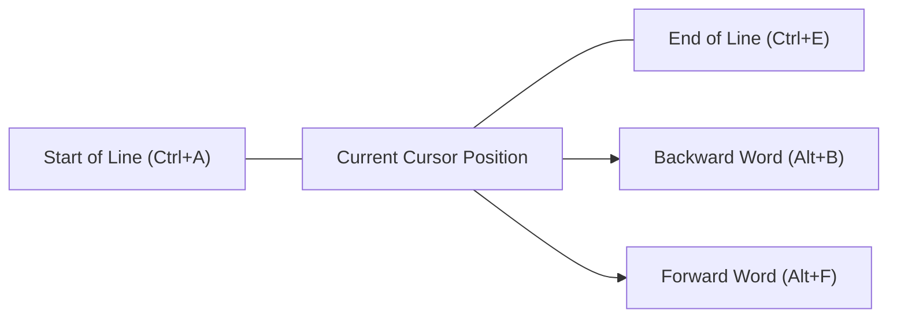
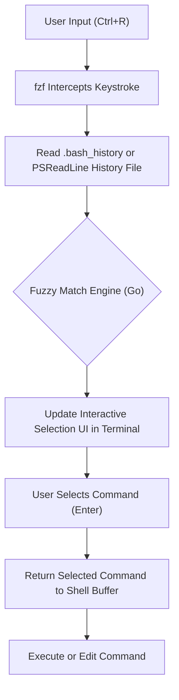

# Introduction: Overwhelming Productivity Improvement Brought by Terminal Efficiency

In modern software development, the terminal (Command Line Interface) is the most critical tool acting as the developer's "hands and feet". Managing cloud infrastructure, building containers, version control with Git, executing various scripts, etc. — it is no exaggeration to say that developers spend most of their day in the terminal.

However, while many developers are proficient in basic terminal commands (`cd`, `ls`, `git`, `docker`, etc.), they often overlook the aspect of **"optimizing the terminal input itself"**. Reaching for the mouse, moving the cursor, and repeatedly hitting the arrow keys to fix command typos... the accumulation of these small losses results in an enormous waste of time and cognitive load over the long term.

In this article, under the philosophy of "never taking your hands off the keyboard", we will explain in great detail and technically about shortcuts, keybinding configurations, optimization of history search, and the utilization of terminal multiplexers to maximize terminal operation efficiency in Bash and PowerShell environments.

---

# 1. Theoretical Background: Keystroke-Level Model (KLM) and Time Cost Formulation

To quantitatively understand the benefits of efficiency, let's introduce the **Keystroke-Level Model (KLM)**, a type of **GOMS model** used in the field of HCI (Human-Computer Interaction).

KLM is a model used to predict the time it takes for a skilled user to complete a specific error-free task. The task execution time $T_{execute}$ is formulated by the following mathematical equation:

$$ T_{execute} = \sum_{i} \left( K \cdot t_{k} + P \cdot t_{p} + H \cdot t_{h} + M \cdot t_{m} + R \cdot t_{r} \right) $$

Here, each variable has the following meaning:
- $K$ : Keystroking. The action of pressing a key on the keyboard once.
- $P$ : Pointing. The action of pointing to a target with a pointing device such as a mouse.
- $H$ : Homing. The action of moving the hand from the keyboard to the mouse, or vice versa.
- $M$ : Mental preparation. The cognitive thinking time to plan and prepare for the next physical action.
- $R$ : System Response. The time the user has to wait.

The average required time ($t$) for each action is generally estimated as follows:
- $t_{k} \approx 0.2$ seconds (for skilled typists)
- $t_{p} \approx 1.1$ seconds
- $t_{h} \approx 0.4$ seconds
- $t_{m} \approx 1.35$ seconds

When trying to modify part of a command using the arrow keys or a mouse during terminal operations, Homing ($H$) and Pointing ($P$) occur, resulting in a penalty of about 1.5 to 2.0 seconds per modification. On the other hand, if you master the appropriate terminal shortcuts, you can reduce $H$ and $P$ to **zero** and achieve your goal with only Keystroking ($K$).

Suppose you input and edit commands 500 times a day, and save 2 seconds per time by utilizing shortcuts.
$$ 500 \text{ times/day} \times 2 \text{ seconds} = 1000 \text{ seconds/day} \approx 16.6 \text{ minutes/day} $$
Converting this annually (240 business days), it equates to saving an enormous amount of time, **about 66 hours (about 8 business days)**. Furthermore, the reduction in Mental preparation ($M$) provides an immeasurable benefit: **"maintaining an uninterrupted flow state"**.

---

# 2. The Depths of Bash Readline and Emacs Keybindings

Bash, the standard shell for Linux and macOS, internally uses a library called **GNU Readline** to process command line inputs. The default configuration of this Readline is set to **Emacs keybindings**, and mastering this is the first step to terminal efficiency.

## 2.1. Movement Shortcuts

Moving the cursor one character at a time with the arrow keys is the height of inefficiency. Let's engrave the following shortcuts into your "muscle memory".

- **`Ctrl + A`** : Move to the Start of line. Used very frequently.
- **`Ctrl + E`** : Move to the End of line.
- **`Alt + B`** (Meta+B) : Move one word backward (Backward word). Moves quickly word by word using slashes or spaces as delimiters.
- **`Alt + F`** (Meta+F) : Move one word forward (Forward word).



## 2.2. Editing Shortcuts (Kill and Yank)

In Emacs terminology, cutting text is called "Kill", and pasting text is called "Yank".

- **`Ctrl + U`** : Kill (delete) from the cursor position to the start of the line. Instantly clears the line when you mistype a password or want to rewrite a command from the beginning.
- **`Ctrl + K`** : Kill from the cursor position to the end of the line.
- **`Ctrl + W`** : Kill one word backward from the cursor position. Very useful when deleting and rewriting a single argument.
- **`Alt + D`** (Meta+D) : Kill one word forward from the cursor position.
- **`Ctrl + Y`** : Yank (paste) the last killed content. Advanced usages are possible, such as moving to another directory after deleting a command with `Ctrl+U`, and then reviving it with `Ctrl+Y`.
- **`Ctrl + _`** (or `Ctrl + x, Ctrl + u`) : Undo. You can restore if you accidentally delete something.

## 2.3. Other Important Shortcuts

- **`Ctrl + L`** : Clear the screen (equivalent to the `clear` command).
- **`Ctrl + C`** : Cancel the current command input, or interrupt a running process.
- **`Ctrl + D`** : Send EOF (End Of File). If no characters are inputted, it exits the shell (`exit`).

## 2.4. Customizing Readline via ~/.inputrc

These keybindings can be further optimized by editing the `~/.inputrc` file in your home directory. For example, adding the following configuration allows you to search only histories that prefix-match the currently typed string using the up/down keys.

```bash
# Example ~/.inputrc configuration
"\e[A": history-search-backward
"\e[B": history-search-forward
set completion-ignore-case on
set show-all-if-ambiguous on
```
With this, if you type `docker ` and press the up arrow key, you can quickly traverse only the past command histories starting with `docker`.

---

# 3. PowerShell and PSReadLine: Bash-like Operations in Windows Environments

PowerShell, the standard shell in Windows, only had a poor input environment equivalent to Command Prompt (cmd.exe) in its early versions. However, with the introduction of the **PSReadLine** module, it gained advanced command line editing features that rival or even exceed Bash (Readline).

## 3.1. Enabling PSReadLine and Emacs Mode

PSReadLine is built into PowerShell 5.1 and later (as well as PowerShell Core) by default. For Windows users to raise their terminal productivity to Linux levels, it is imperative to change the PSReadLine edit mode from the default Windows (cmd-like) mode to **Emacs mode**.

Edit your PowerShell profile (`$PROFILE`) to load the settings automatically.

```powershell
# Open $PROFILE in VS Code
code $PROFILE
```

Add the following settings to `$PROFILE`.

```powershell
# Import the PSReadLine module (if explicitly needed)
Import-Module PSReadLine

# Set edit mode to Emacs and enable the same shortcuts as Bash
Set-PSReadLineOption -EditMode Emacs

# Ignore the bell sound (error sound)
Set-PSReadLineOption -BellStyle None
```

Now, Emacs/Bash style keybindings like `Ctrl+A` (start of line), `Ctrl+E` (end of line), `Ctrl+U` (delete to start of line), and `Alt+B` / `Alt+F` (word movement) will work perfectly on Windows PowerShell as well.

## 3.2. Predictive IntelliSense and Advanced History Search

One of the powerful features of PSReadLine is **Predictive IntelliSense**, based on input history or external predictive plugins. As you type, the most likely entire command from your past history is suggested in a faint gray (inline). To accept the suggestion, simply press the right arrow key (or `Alt+F` for word-by-word).

```powershell
# Add to $PROFILE: Enable predictive features (Requires PowerShell 7.1+ / PSReadLine 2.1+)
Set-PSReadLineOption -PredictionSource History
Set-PSReadLineOption -PredictionViewStyle InlineView
# Specify ListView if you want to display it as a list
# Set-PSReadLineOption -PredictionViewStyle ListView
```

## 3.3. Overriding Up/Down Key Behavior (Bash-like Prefix Search)

The default up/down arrow keys in PowerShell merely navigate sequentially through history. Let's remap this to a "search history that prefix-matches the currently typed string" function, similar to the `~/.inputrc` mentioned earlier.

```powershell
# Add to $PROFILE: Register history prefix search handlers
Set-PSReadLineKeyHandler -Key UpArrow -Function HistorySearchBackward
Set-PSReadLineKeyHandler -Key DownArrow -Function HistorySearchForward
```

Thanks to this, even in a Windows environment, you can intuitively construct, search, and execute commands with the exact same finger movements as in a Linux environment. Standardizing cognitive load ($M$) across platforms is extremely important for DevOps engineers.

---

# 4. The Pinnacle of History Search: fzf (Fuzzy Finder) Integration

One of the most frequent actions in terminal operations is **"finding a complex command executed in the past from history and re-executing it"**. Because the standard `Ctrl+R` (reverse search) is an exact match search, it's difficult to pull out a command from a vague memory like "I'm sure it was a docker run with a volume mount...".

The tool that elegantly solves this problem is **`fzf`**, an ultra-fast general-purpose fuzzy finder written in Go.

## 4.1. Fuzzy Search Pipeline with fzf

When `fzf` is integrated into command history search, processing is done in a pipeline like the following.



When a user inputs multiple space-separated keywords (e.g., `docker ubuntu bash`), fzf's matching engine scans the entire history file and instantly lists the histories containing those keywords in any order or at distant positions.

## 4.2. fzf Integration in Bash

In Linux environments like Ubuntu/Debian, it can be easily installed using apt. Furthermore, executing the install script automatically overwrites Bash's keybindings.

```bash
# Installing fzf
git clone --depth 1 https://github.com/junegunn/fzf.git ~/.fzf
~/.fzf/install
```
With this, pressing `Ctrl+R` makes fzf's interactive UI pop up full screen (or inside a tmux pane), allowing you to search history extremely intuitively. On the search UI, you can select items with `Ctrl+N` (down) / `Ctrl+P` (up).

## 4.3. PSFzf Integration in PowerShell

Even in a Windows PowerShell environment, you can achieve the exact same experience by using the `PSFzf` module. First, install the fzf binary (Scoop is convenient) and introduce the module.

```powershell
# Install fzf binary via Scoop
scoop install fzf

# Install PSFzf module
Install-Module -Name PSFzf -Scope CurrentUser
```

Then, add the configuration to `$PROFILE` to bind the key.

```powershell
# Add to $PROFILE
Import-Module PSFzf

# Map Ctrl+R to fzf history search
Set-PsFzfOption -PSReadlineChordReverseHistorySearch 'Ctrl+r'
```
Now, even on Windows, you can instantly perform fuzzy searches from massive past PowerShell histories using `Ctrl+R`.

---

# 5. Minimizing Keystrokes via Aliases and Wrapper Functions

In addition to shortcuts and history search, the most direct way to reduce Keystroking ($K$) itself is by defining Aliases and Wrapper functions.

## 5.1. Minimizing Git Operations

Git is used countless times every day. Typing the full spellings of `git status` or `git commit` every time is a huge waste in the KLM model.

**Bash Example (`~/.bashrc`)**:
```bash
alias g='git'
alias gs='git status -sb'
alias ga='git add'
alias gc='git commit -m'
alias gco='git checkout'
alias gp='git push'
alias gl='git log --oneline --graph --decorate --all'
```

**PowerShell Example (`$PROFILE`)**:
```powershell
Set-Alias -Name g -Value git
function gs { git status -sb $args }
function ga { git add $args }
function gc { git commit -m $args }
function gco { git checkout $args }
function gl { git log --oneline --graph --decorate --all $args }
```
* Since PowerShell's `Set-Alias` cannot fix arguments, the best practice is to define aliases with options as functions as shown above.

## 5.2. Optimizing Directory Navigation (z / zoxide)

Navigating to deeply nested directories with the `cd` command is cumbersome. In recent years, **`zoxide`** (written in Rust), a tool that learns a user's navigation history and Frecency (Frequency + Recency) and allows jumping to a target directory just by typing part of the path, is becoming the standard.

```bash
# After installing zoxide, use z instead of cd
z proj # Instantly jump to /home/user/workspace/projects/
```
zoxide supports all of Bash, Zsh, and PowerShell, realizing the same high-speed directory navigation cross-platform.

---

# 6. Terminal Multiplexers and Pane Management

If you launch one process (like a local server) in a single terminal window, you have to open a new terminal window to do other work. Switching windows (`Alt+Tab`) involves eye movement and incurs a context switch cost (an increase in Mental preparation $M$).

The solution to this is a **terminal multiplexer**, which can divide the screen into multiple panes and maintain multiple sessions in the background.

## 6.1. tmux Architecture and State Transitions (Linux / macOS)

`tmux` is a powerful multiplexer with a server-client architecture. To prevent shortcut conflicts with other programs, tmux operations always require pressing a **prefix key (default is Ctrl+B)** first.

The following Mermaid state transition diagram shows the basic operation flow of tmux.

```mermaid
stateDiagram-v2
    [*] --> Normal["Normal Mode"]
    Normal --> Prefix["Prefix Mode (Ctrl+B)"]
    Prefix --> Command["Command Prompt (:)"]
    Prefix --> SplitV["Split Pane Vertically (%)"]
    Prefix --> SplitH["Split Pane Horizontally (\")"]
    Prefix --> Switch["Switch Window (n/p/0-9)"]
    Prefix --> Detach["Detach Session (d)"]
    
    Command --> Normal["Execute tmux Command"]
    SplitV --> Normal["Return to Normal Mode"]
    SplitH --> Normal["Return to Normal Mode"]
    Switch --> Normal["Return to Normal Mode"]
    Detach --> [*]
```

By editing `~/.tmux.conf`, it is standard practice to change the prefix key to an easier-to-press `Ctrl+A` (like GNU Screen), or bind pane movements to Vim-like `hjkl`.

```text
# Example ~/.tmux.conf
# Change prefix to Ctrl-a
set -g prefix C-a
unbind C-b
bind C-a send-prefix

# Intuitive keys for pane splitting
bind | split-window -h
bind - split-window -v

# Vim-like pane movement
bind h select-pane -L
bind j select-pane -D
bind k select-pane -U
bind l select-pane -R
```

## 6.2. Pane Management in Windows Terminal

In a Windows environment, the latest **Windows Terminal** natively supports pane splitting features. Although it doesn't have session persistence like tmux, you can easily manage panes via a GUI base. By opening settings (`settings.json`) and customizing actions, you can complete operations with just the keyboard.

```json
// Part of Windows Terminal settings.json
"actions": [
    { "command": { "action": "splitPane", "split": "auto" }, "keys": "alt+shift+d" },
    { "command": { "action": "moveFocus", "direction": "left" }, "keys": "alt+left" },
    { "command": { "action": "moveFocus", "direction": "right" }, "keys": "alt+right" }
]
```
With this, simply pressing `Alt+Shift+D` within PowerShell splits the screen, and you can seamlessly move between panes using combinations of the arrow keys and `Alt`.

---

# 7. Practical Workflow Construction Example

By combining the elements introduced so far (Emacs keybindings, PSReadLine, fzf, aliases, multiplexers), daily tasks are dramatically accelerated.

For example, imagine a task: "During a failure response, check the server logs, and simultaneously investigate the commit history of the relevant code with Git."

1. Open the terminal and type `z prod` to instantly jump to the operations directory for the production environment.
2. Press `Ctrl+R` and type `ssh auth` in the `fzf` pop-up to recall and execute a complex past SSH login command.
3. Perform `Ctrl+B` `|` (tmux pane split) and execute `gs` (git status) etc. in the right pane to investigate the code.
4. If you find an error in the log output in the left pane, enter copy mode with `Ctrl+B` `[` and yank the error message using just the keyboard.
5. Paste it into your editor to identify the cause.

In this entire series of actions, **you never touch the mouse even once**. The Homing ($H$) and Pointing ($P$) in the KLM equation are completely eliminated, and your terminal operations will perfectly follow the speed of your thoughts.

---

# Conclusion

In this article, we explained the "efficiency of terminal operations" that determines a developer's productivity in extreme detail, ranging from KLM theory to concrete Bash/PowerShell keybindings, and the integration of fzf and tmux.

At first, you might feel stressed consciously trying to type `Ctrl+A` or `Ctrl+E`. However, by consciously continuing to use them for a few weeks, these shortcuts will surely settle into your **muscle memory**. Once they settle, you will be able to freely control the terminal unconsciously, making it an asset that will dramatically improve your Developer Experience (DX) for a lifetime.

Starting today, open `$PROFILE` or `~/.bashrc` and begin building the ultimate terminal environment that fits your hands best.
