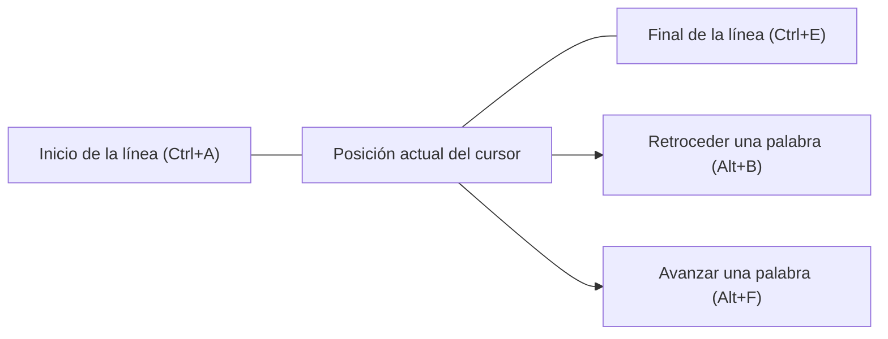
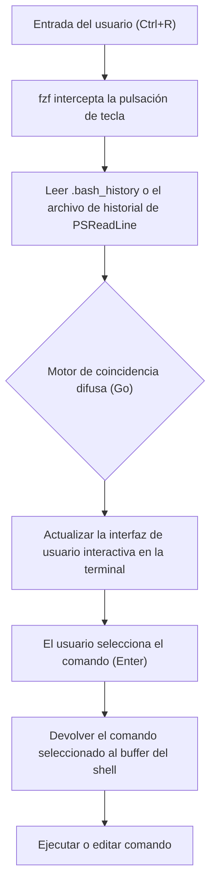

# Introducción: La abrumadora mejora de la productividad que aporta la optimización de la terminal

En el desarrollo de software moderno, la terminal (interfaz de línea de comandos) es la herramienta más importante, convirtiéndose en las "manos y pies" de un desarrollador. Gestionar la infraestructura en la nube, construir contenedores, utilizar el control de versiones con Git, ejecutar varios scripts, etc.: no es exagerado decir que los desarrolladores pasan la mayor parte de su día en la terminal.

Sin embargo, aunque muchos desarrolladores dominan los comandos básicos de la terminal (como `cd`, `ls`, `git`, `docker`), a menudo pasan por alto la perspectiva de **"optimizar la propia entrada en la terminal"**. Alcanzar el ratón, mover el cursor y presionar repetidamente las teclas de flecha para corregir un error tipográfico en un comando... la acumulación de estas pequeñas pérdidas resulta en una enorme pérdida de tiempo y carga cognitiva a largo plazo.

Bajo la filosofía de "nunca quitar las manos del teclado", este artículo explica de manera técnica y muy detallada cómo optimizar las operaciones de la terminal en entornos Bash y PowerShell hasta el límite, utilizando atajos, configuraciones de asignación de teclas, optimización de la búsqueda en el historial y el uso de multiplexores de terminal.

---

# 1. Antecedentes teóricos: El modelo de nivel de pulsación de teclas (KLM) y la formulación del costo de tiempo

Para comprender cuantitativamente los beneficios de la optimización, consideremos el **Modelo de nivel de pulsación de teclas (Keystroke-Level Model, KLM)**, que es un tipo de **modelo GOMS** utilizado en el campo de la Interacción Persona-Ordenador (HCI).

KLM es un modelo para predecir el tiempo que le toma a un usuario experto completar una tarea específica sin errores. El tiempo de ejecución de la tarea $T_{execute}$ se formula mediante la siguiente ecuación matemática:

$$ T_{execute} = \sum_{i} \left( K \cdot t_{k} + P \cdot t_{p} + H \cdot t_{h} + M \cdot t_{m} + R \cdot t_{r} \right) $$

Aquí, cada variable tiene el siguiente significado:
- $K$ : Pulsación de tecla (Keystroking). La acción de presionar una tecla en el teclado una vez.
- $P$ : Apuntar (Pointing). La acción de apuntar a un objetivo con un dispositivo señalador como un ratón.
- $H$ : Reposo (Homing). La acción de mover las manos del teclado al ratón, o viceversa.
- $M$ : Preparación mental (Mental preparation). El tiempo de pensamiento cognitivo para planificar y prepararse para la siguiente acción física.
- $R$ : Respuesta del sistema (System Response). El tiempo que el usuario debe esperar.

El tiempo promedio requerido para cada acción ($t$) generalmente se estima de la siguiente manera:
- $t_{k} \approx 0.2$ segundos (para un mecanógrafo experto)
- $t_{p} \approx 1.1$ segundos
- $t_{h} \approx 0.4$ segundos
- $t_{m} \approx 1.35$ segundos

Si intentas corregir parte de un comando en la terminal usando las teclas de flecha o el ratón, se producen acciones de reposo ($H$) y apuntar ($P$), lo que resulta en una penalización de aproximadamente 1.5 a 2.0 segundos por corrección. Por otro lado, si dominas los atajos de terminal adecuados, puedes reducir $H$ y $P$ a **cero** y lograr tu objetivo solo con pulsaciones de teclas ($K$).

Supongamos que ingresas y editas comandos 500 veces al día, y el uso de atajos te ahorra 2 segundos cada vez.
$$ 500 \text{ veces/día} \times 2 \text{ segundos} = 1000 \text{ segundos/día} \approx 16.6 \text{ minutos/día} $$
Si conviertes esto a un año (240 días laborables), se calcula que puedes ahorrar **aproximadamente 66 horas (unos 8 días laborables)**. Aún más importante, la reducción en la preparación mental ($M$) proporciona el inestimable beneficio de **"pensamiento ininterrumpido (capacidad de mantener el estado de flujo)"**.

---

# 2. Bash Readline y la profundidad de los atajos de teclado de Emacs

Bash, el shell estándar en Linux y macOS, utiliza internamente una biblioteca llamada **GNU Readline** para procesar la entrada de la línea de comandos. La configuración predeterminada de este Readline son los **atajos de teclado de Emacs**, y dominar esto es el primer paso hacia la eficiencia de la terminal.

## 2.1. Atajos de movimiento

Mover el cursor un carácter a la vez con las teclas de flecha es extremadamente ineficiente. Graba los siguientes atajos en tu "memoria muscular".

- **`Ctrl + A`** : Mover al inicio de la línea (Start of line). Se usa con mucha frecuencia.
- **`Ctrl + E`** : Mover al final de la línea (End of line).
- **`Alt + B`** (Meta+B) : Retroceder una palabra (Backward word). Se mueve rápidamente palabra por palabra utilizando barras o espacios como separadores.
- **`Alt + F`** (Meta+F) : Avanzar una palabra (Forward word).



## 2.2. Atajos de edición (Kill y Yank)

En la terminología de Emacs, cortar texto se llama "Kill" (Matar) y pegar se llama "Yank" (Tirar).

- **`Ctrl + U`** : Cortar (kill) desde la posición del cursor hasta el inicio de la línea. Se puede borrar en un instante cuando te equivocas al introducir una contraseña o cuando quieres reescribir un comando desde el principio.
- **`Ctrl + K`** : Cortar desde la posición del cursor hasta el final de la línea.
- **`Ctrl + W`** : Cortar la palabra anterior a la posición del cursor. Resulta útil cuando se borra un argumento para volver a escribirlo.
- **`Alt + D`** (Meta+D) : Cortar la palabra siguiente desde la posición del cursor.
- **`Ctrl + Y`** : Pegar (yank) el último contenido cortado. Es posible usar técnicas avanzadas, como borrar un comando con `Ctrl+U`, moverte a otro directorio y revivirlo con `Ctrl+Y`.
- **`Ctrl + _`** (o `Ctrl + x, Ctrl + u`) : Deshacer. Puede restaurarse si se borra por error.

## 2.3. Otros atajos importantes

- **`Ctrl + L`** : Limpiar la pantalla (equivalente al comando `clear`).
- **`Ctrl + C`** : Cancelar la entrada del comando actual o interrumpir el proceso en ejecución.
- **`Ctrl + D`** : Enviar EOF (Fin de archivo). Si no se han introducido caracteres, sale del shell (`exit`).

## 2.4. Personalización de Readline mediante ~/.inputrc

Estos atajos de teclado pueden optimizarse aún más editando el archivo `~/.inputrc` en tu directorio de inicio. Por ejemplo, al añadir la siguiente configuración, puedes buscar solo en el historial que coincida de forma predeterminada con la cadena que estás introduciendo usando las teclas arriba y abajo.

```bash
# Ejemplo de configuración para ~/.inputrc
"\e[A": history-search-backward
"\e[B": history-search-forward
set completion-ignore-case on
set show-all-if-ambiguous on
```
Con esto, al pulsar la flecha hacia arriba después de escribir `docker `, puedes recorrer rápidamente solo el historial de comandos que empiezan por `docker`.

---

# 3. PowerShell y PSReadLine: Operaciones similares a Bash en el entorno Windows

PowerShell, el shell estándar de Windows, solo contaba con un entorno de entrada básico equivalente al símbolo del sistema (cmd.exe) en sus primeras versiones. Sin embargo, con la introducción del módulo **PSReadLine**, ha adquirido características avanzadas de edición en la línea de comandos que igualan o superan a Bash (Readline).

## 3.1. Activación de PSReadLine y modo Emacs

PSReadLine está integrado de forma predeterminada en PowerShell 5.1 y versiones posteriores (así como en PowerShell Core). Para que los usuarios de Windows eleven la productividad de su terminal al nivel de Linux, es esencial cambiar el modo de edición de PSReadLine desde el modo predeterminado de Windows (similar a cmd) al **modo Emacs**.

Editemos el perfil de PowerShell (`$PROFILE`) para que la configuración se cargue automáticamente.

```powershell
# Abrir $PROFILE en VS Code
code $PROFILE
```

Añade la siguiente configuración a `$PROFILE`.

```powershell
# Importar el módulo PSReadLine (si se hace explícitamente)
Import-Module PSReadLine

# Establecer el modo de edición a Emacs y habilitar los mismos atajos que Bash
Set-PSReadLineOption -EditMode Emacs

# Ignorar el sonido de campana (sonido de error)
Set-PSReadLineOption -BellStyle None
```

Con esto, los atajos de teclado de estilo Emacs/Bash como `Ctrl+A` (inicio de la línea), `Ctrl+E` (final de la línea), `Ctrl+U` (eliminar hasta el inicio de la línea) y `Alt+B` / `Alt+F` (mover por palabras) funcionarán perfectamente en PowerShell de Windows.

## 3.2. Predictive IntelliSense y búsqueda avanzada en el historial

Una de las características poderosas de PSReadLine es **Predictive IntelliSense (IntelliSense predictivo)**, basado en el historial de entrada o en plugins de predicción externos. A medida que comienzas a escribir, se sugiere el comando más probable del historial anterior en un color gris claro (en línea). Si aceptas la sugerencia, simplemente presiona la tecla de flecha derecha (o `Alt+F` para avanzar por palabras).

```powershell
# Añadir a $PROFILE: Habilitar predicción (Requiere PowerShell 7.1+ / PSReadLine 2.1+)
Set-PSReadLineOption -PredictionSource History
Set-PSReadLineOption -PredictionViewStyle InlineView
# Si quieres mostrarlo como una lista, especifica ListView
# Set-PSReadLineOption -PredictionViewStyle ListView
```

## 3.3. Sobrescribir el comportamiento de las teclas arriba/abajo (Búsqueda de coincidencia frontal similar a Bash)

Las teclas de flecha arriba y abajo predeterminadas en PowerShell simplemente se mueven secuencialmente a través del historial. Reasignaremos esto a la función "buscar en el historial para encontrar un prefijo que coincida con la cadena ingresada actualmente", similar a `~/.inputrc` mencionado anteriormente.

```powershell
# Añadir a $PROFILE: Registrar el manejador de búsqueda de coincidencia frontal del historial
Set-PSReadLineKeyHandler -Key UpArrow -Function HistorySearchBackward
Set-PSReadLineKeyHandler -Key DownArrow -Function HistorySearchForward
```

Esto te permite construir, buscar y ejecutar comandos de forma intuitiva, incluso en un entorno Windows, con exactamente los mismos movimientos de los dedos que en un entorno Linux. Estandarizar la carga cognitiva ($M$) entre plataformas es crucial para los ingenieros de DevOps.

---

# 4. El pináculo de la búsqueda de historial: Integración de fzf (Fuzzy Finder)

Una de las acciones más frecuentes en las operaciones de terminal es **"encontrar un comando complejo ejecutado en el pasado en el historial y volver a ejecutarlo"**. El `Ctrl+R` estándar (búsqueda inversa) es una búsqueda de coincidencia exacta, por lo que es difícil extraer un comando de un recuerdo vago como "Recuerdo que monté un volumen con docker run...".

Esta tarea se resuelve elegantemente con **`fzf`**, una herramienta de búsqueda difusa ultrarrápida y de propósito general escrita en el lenguaje Go.

## 4.1. El flujo de búsqueda difusa con fzf

Cuando `fzf` se integra en la búsqueda del historial de comandos, el proceso se lleva a cabo en la siguiente canalización.



Cuando un usuario introduce varias palabras clave separadas por espacios (por ejemplo, `docker ubuntu bash`), el motor de coincidencia de fzf escanea instantáneamente todo el archivo de historial y enumera las entradas del historial que contienen esas palabras clave en cualquier orden, o que estén separadas.

## 4.2. Integración de fzf en Bash

En entornos Linux como Ubuntu/Debian, se puede instalar fácilmente usando apt. Además, al ejecutar el script de instalación, los atajos de teclado de Bash se sobrescriben automáticamente.

```bash
# Instalación de fzf
git clone --depth 1 https://github.com/junegunn/fzf.git ~/.fzf
~/.fzf/install
```
Como resultado, presionar `Ctrl+R` hará que aparezca la interfaz interactiva de fzf a pantalla completa (o dentro del panel de tmux), permitiéndote buscar en el historial de manera muy intuitiva. En la interfaz de búsqueda, puedes seleccionar elementos con `Ctrl+N` (abajo) / `Ctrl+P` (arriba).

## 4.3. Integración de PSFzf en PowerShell

En el entorno de Windows PowerShell, puedes obtener exactamente la misma experiencia utilizando el módulo `PSFzf`. Primero, instala el binario de fzf (Scoop, etc., es útil) e introduce el módulo.

```powershell
# Instalar el binario de fzf con Scoop
scoop install fzf

# Instalar el módulo PSFzf
Install-Module -Name PSFzf -Scope CurrentUser
```

Luego, añade la configuración a `$PROFILE` para vincular las teclas.

```powershell
# Añadir a $PROFILE
Import-Module PSFzf

# Asignar Ctrl+R a la búsqueda del historial de fzf
Set-PsFzfOption -PSReadlineChordReverseHistorySearch 'Ctrl+r'
```
Ahora, incluso en Windows, puedes realizar instantáneamente búsquedas difusas desde el vasto historial de PowerShell con `Ctrl+R`.

---

# 5. Minimizar las pulsaciones de teclas mediante alias y funciones de envoltura

Además de los atajos y la búsqueda del historial, la forma más directa de reducir las propias pulsaciones de teclas ($K$) es definir alias y funciones de envoltura.

## 5.1. Minimizar las operaciones de Git

Git se usa innumerables veces al día. Escribir `git status` o `git commit` completamente cada vez es un gran desperdicio en el modelo KLM.

**Ejemplo en Bash (`~/.bashrc`)**:
```bash
alias g='git'
alias gs='git status -sb'
alias ga='git add'
alias gc='git commit -m'
alias gco='git checkout'
alias gp='git push'
alias gl='git log --oneline --graph --decorate --all'
```

**Ejemplo en PowerShell (`$PROFILE`)**:
```powershell
Set-Alias -Name g -Value git
function gs { git status -sb $args }
function ga { git add $args }
function gc { git commit -m $args }
function gco { git checkout $args }
function gl { git log --oneline --graph --decorate --all $args }
```
* Como `Set-Alias` en PowerShell no puede fijar argumentos, la mejor práctica es definir los alias con opciones como funciones, como se muestra arriba.

## 5.2. Optimización del movimiento entre directorios (z / zoxide)

Moverse a un directorio profundo con el comando `cd` es tedioso. Recientemente, la herramienta estándar emergente es **`zoxide`** (escrita en Rust), que aprende el historial de movimiento y la frecuencia del usuario (Frecency: Frequency + Recency), permitiéndole saltar al directorio deseado con solo escribir una parte de la ruta.

```bash
# Después de instalar zoxide, usa z en lugar de cd
z proj # Te mueve instantáneamente a /home/user/workspace/projects/
```
zoxide es compatible con Bash, Zsh y PowerShell, proporcionando un movimiento rápido de directorios entre plataformas de forma similar.

---

# 6. Multiplexores de terminal y gestión de paneles

Si inicias un proceso (como un servidor local) en una ventana de la terminal, tendrás que abrir otra ventana para hacer otra tarea. Cambiar de ventana (`Alt+Tab`) requiere mover los ojos, lo que introduce un coste por cambio de contexto (aumento de la preparación mental $M$).

Esto se soluciona con un **multiplexor de terminal**, que puede dividir la pantalla en varios paneles y mantener múltiples sesiones en segundo plano.

## 6.1. Arquitectura y transición de estado de tmux (Linux / macOS)

`tmux` es un potente multiplexor con una arquitectura cliente-servidor. Para operar tmux, debes presionar siempre una **tecla de prefijo (predeterminada Ctrl+B)** para evitar que los atajos entren en conflicto con otros programas.

El siguiente diagrama de transición de estado de Mermaid muestra el flujo de operación básico de tmux.

```mermaid
stateDiagram-v2
    [*] --> Normal["Modo normal"]
    Normal --> Prefix["Modo de prefijo (Ctrl+B)"]
    Prefix --> Command["Símbolo del sistema (:)"]
    Prefix --> SplitV["Dividir panel verticalmente (%)"]
    Prefix --> SplitH["Dividir panel horizontalmente (\")"]
    Prefix --> Switch["Cambiar de ventana (n/p/0-9)"]
    Prefix --> Detach["Desconectar sesión (d)"]
    
    Command --> Normal["Ejecutar comando de tmux"]
    SplitV --> Normal["Volver al modo normal"]
    SplitH --> Normal["Volver al modo normal"]
    Switch --> Normal["Volver al modo normal"]
    Detach --> [*]
```

Es una práctica estándar editar `~/.tmux.conf` para cambiar la tecla de prefijo a una más fácil de presionar, como `Ctrl+A` (estilo GNU Screen), y vincular el movimiento del panel a las teclas estilo Vim, como `hjkl`.

```text
# Ejemplo de ~/.tmux.conf
# Cambiar el prefijo a Ctrl-a
set -g prefix C-a
unbind C-b
bind C-a send-prefix

# Dividir paneles con teclas intuitivas
bind | split-window -h
bind - split-window -v

# Movimiento de paneles estilo Vim
bind h select-pane -L
bind j select-pane -D
bind k select-pane -U
bind l select-pane -R
```

## 6.2. Gestión de paneles en Windows Terminal

En el entorno Windows, el moderno **Windows Terminal** admite la funcionalidad de división de paneles de manera predeterminada. Aunque no tiene una función de persistencia de sesión como tmux, puedes gestionar fácilmente los paneles a través de la interfaz gráfica de usuario. Al abrir la configuración (`settings.json`) y personalizar las acciones, puedes realizar operaciones utilizando únicamente el teclado.

```json
// Parte de Windows Terminal settings.json
"actions": [
    { "command": { "action": "splitPane", "split": "auto" }, "keys": "alt+shift+d" },
    { "command": { "action": "moveFocus", "direction": "left" }, "keys": "alt+left" },
    { "command": { "action": "moveFocus", "direction": "right" }, "keys": "alt+right" }
]
```
Esto te permite dividir la pantalla en PowerShell simplemente presionando `Alt+Shift+D`, y moverte sin problemas entre paneles utilizando las teclas de flecha combinadas con `Alt`.

---

# 7. Ejemplo práctico de construcción del flujo de trabajo

Al combinar los elementos presentados hasta ahora (atajos de teclado de Emacs, PSReadLine, fzf, alias, multiplexor), las tareas diarias se acelerarán drásticamente.

Por ejemplo, consideremos la tarea: "Revisar los registros del servidor durante la respuesta a un fallo, y simultáneamente comprobar el historial de commits del código relevante en Git".

1. Abre la terminal, escribe `z prod` y muévete instantáneamente al directorio operativo del entorno de producción.
2. Presiona `Ctrl+R`, y en la ventana emergente de `fzf`, escribe `ssh auth` para recuperar y ejecutar un complejo comando de inicio de sesión SSH del historial.
3. Ejecuta `Ctrl+B` `|` (dividir el panel de tmux), y en el panel derecho, ejecuta algo como `gs` (git status) para investigar el código.
4. Si encuentras un error en la salida de registros del panel izquierdo, entra en el modo de copia con `Ctrl+B` `[` y corta (yank) el mensaje de error usando solo el teclado.
5. Pégalo en el editor y averigua la causa.

En toda esta serie de acciones, **nunca tocas el ratón**. La E (Homing - Reposo) y P (Pointing - Apuntar) en la ecuación KLM se eliminan por completo, permitiendo que las operaciones de la terminal sigan el ritmo de la velocidad de tu pensamiento.

---

# Conclusión

En este artículo, hemos explicado con gran detalle la "optimización de las operaciones de la terminal", que determina la productividad de los desarrolladores, desde la teoría de KLM hasta los atajos de teclado específicos de Bash/PowerShell, y la integración de fzf y tmux.

Al principio, es posible que sientas estrés al presionar conscientemente `Ctrl+A` o `Ctrl+E`. Sin embargo, si los utilizas conscientemente durante algunas semanas, estos atajos se establecerán de manera segura en tu **memoria muscular**. Una vez que se asienten, podrás controlar la terminal libre e inconscientemente, y se convertirá en un activo que mejorará drásticamente tu experiencia como desarrollador (Developer Experience, DX) por el resto de tu vida.

Por favor, empieza a construir tu propio entorno de terminal definitivo hoy mismo, abriendo `$PROFILE` o `~/.bashrc` y adaptándolo perfectamente a tus manos.
