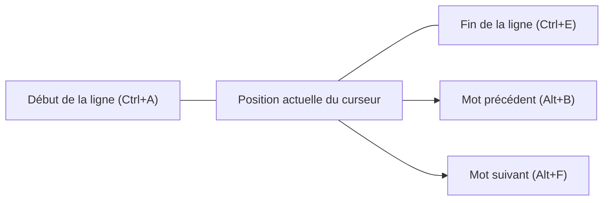
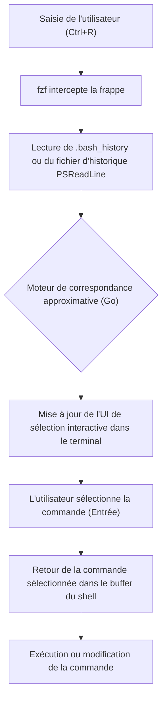

# Introduction : L'amélioration phénoménale de la productivité grâce à l'optimisation des opérations du terminal

Dans le développement logiciel moderne, le terminal (interface en ligne de commande) est l'outil le plus important, agissant comme les « mains et les pieds » du développeur. La gestion de l'infrastructure cloud, la compilation de conteneurs, le contrôle de version avec Git, l'exécution de divers scripts... Il n'est pas exagéré de dire que les développeurs passent la majeure partie de leur journée sur le terminal.

Cependant, bien que de nombreux développeurs maîtrisent les commandes de base du terminal (comme `cd`, `ls`, `git`, `docker`, etc.), ils ont souvent tendance à négliger l'aspect **« optimisation de la saisie elle-même dans le terminal »**. Attraper la souris, déplacer le curseur, appuyer de manière répétée sur les touches fléchées pour corriger une faute de frappe dans une commande... L'accumulation de ces petites pertes entraîne un gaspillage de temps énorme et une charge cognitive importante sur le long terme.

Dans cet article, basé sur la philosophie de « ne jamais quitter le clavier des mains », nous expliquerons de manière très détaillée et technique comment optimiser à l'extrême les opérations du terminal dans les environnements Bash et PowerShell, grâce aux raccourcis, aux configurations de raccourcis clavier (keybindings), à l'optimisation de la recherche dans l'historique et à l'utilisation des multiplexeurs de terminaux.

---

# 1. Contexte théorique : Modèle KLM (Keystroke-Level Model) et formulation du coût temporel

Pour comprendre de manière quantitative les avantages de l'optimisation, introduisons le **Keystroke-Level Model (KLM)**, une variante du **modèle GOMS** utilisé dans le domaine de l'IHM (Interaction Homme-Machine).

KLM est un modèle permettant de prédire le temps nécessaire à un utilisateur expert pour accomplir une tâche spécifique sans erreur. Le temps d'exécution de la tâche $T_{execute}$ est formulé par l'équation mathématique suivante :

$$ T_{execute} = \sum_{i} \left( K \cdot t_{k} + P \cdot t_{p} + H \cdot t_{h} + M \cdot t_{m} + R \cdot t_{r} \right) $$

Ici, chaque variable a la signification suivante :
- $K$ : Frappe au clavier (Keystroking). L'action d'appuyer une fois sur une touche du clavier.
- $P$ : Pointage (Pointing). L'action de pointer vers une cible avec un dispositif de pointage comme une souris.
- $H$ : Repositionnement (Homing). L'action de déplacer les mains du clavier vers la souris, ou vice versa.
- $M$ : Préparation mentale (Mental preparation). Le temps de réflexion cognitive nécessaire pour planifier et préparer l'action physique suivante.
- $R$ : Réponse du système (System Response). Le temps pendant lequel l'utilisateur doit attendre.

Le temps moyen requis pour chaque action ($t$) est généralement estimé comme suit :
- $t_{k} \approx 0.2$ seconde (pour un dactylographe expert)
- $t_{p} \approx 1.1$ secondes
- $t_{h} \approx 0.4$ seconde
- $t_{m} \approx 1.35$ secondes

Lorsque vous essayez de corriger une partie d'une commande à l'aide des touches fléchées ou de la souris dans le terminal, le repositionnement ($H$) et le pointage ($P$) se produisent, entraînant une pénalité d'environ 1,5 à 2,0 secondes par correction. En revanche, si vous maîtrisez les raccourcis de terminal appropriés, vous pouvez réduire $H$ et $P$ à **zéro** et atteindre votre objectif en utilisant uniquement des frappes au clavier ($K$).

Supposons que vous saisissiez et modifiiez des commandes 500 fois par jour et que l'utilisation de raccourcis vous permette de gagner 2 secondes à chaque fois.
$$ 500 \text{ fois/jour} \times 2 \text{ secondes} = 1000 \text{ secondes/jour} \approx 16.6 \text{ minutes/jour} $$
Converti sur une année (240 jours ouvrables), cela représente une économie de temps d'**environ 66 heures (soit environ 8 jours de travail)**. Plus important encore, la réduction de la préparation mentale ($M$) offre l'avantage inestimable de **« ne pas interrompre la pensée (maintenir l'état de flow) »**.

---

# 2. Les profondeurs de Bash Readline et des raccourcis clavier Emacs

Bash, le shell standard sous Linux et macOS, utilise en interne une bibliothèque appelée **GNU Readline** pour gérer la saisie en ligne de commande. La configuration par défaut de ce Readline utilise les **raccourcis clavier Emacs**. Les maîtriser est la première étape vers l'optimisation du terminal.

## 2.1. Raccourcis de déplacement

Déplacer le curseur caractère par caractère avec les touches fléchées est le comble de l'inefficacité. Gravez les raccourcis suivants dans votre « mémoire musculaire ».

- **`Ctrl + A`** : Se déplacer au début de la ligne (Start of line). Très fréquemment utilisé.
- **`Ctrl + E`** : Se déplacer à la fin de la ligne (End of line).
- **`Alt + B`** (Meta+B) : Reculer d'un mot (Backward word). Permet de se déplacer rapidement mot par mot en utilisant les barres obliques (slash) et les espaces comme séparateurs.
- **`Alt + F`** (Meta+F) : Avancer d'un mot (Forward word).



## 2.2. Raccourcis d'édition (Kill et Yank)

Dans le vocabulaire d'Emacs, couper du texte est appelé « Kill » (Tuer), et coller est appelé « Yank » (Tirer).

- **`Ctrl + U`** : Couper (Kill) de la position du curseur jusqu'au début de la ligne. Permet d'effacer instantanément en cas d'erreur de frappe de mot de passe ou si vous souhaitez réécrire la commande depuis le début.
- **`Ctrl + K`** : Couper de la position du curseur jusqu'à la fin de la ligne.
- **`Ctrl + W`** : Couper le mot précédent depuis la position du curseur. Très pratique pour effacer un argument et le réécrire.
- **`Alt + D`** (Meta+D) : Couper le mot suivant depuis la position du curseur.
- **`Ctrl + Y`** : Coller (Yank) le dernier contenu coupé. Il est possible de faire des utilisations avancées, comme effacer une commande avec `Ctrl+U`, se déplacer vers un autre répertoire, puis ressusciter la commande avec `Ctrl+Y`.
- **`Ctrl + _`** (ou `Ctrl + x, Ctrl + u`) : Annuler (Undo). Permet de restaurer ce qui a été effacé par erreur.

## 2.3. Autres raccourcis importants

- **`Ctrl + L`** : Effacer l'écran (équivalent à la commande `clear`).
- **`Ctrl + C`** : Annuler la saisie de la commande en cours, ou interrompre le processus en cours d'exécution.
- **`Ctrl + D`** : Envoyer un EOF (End Of File). S'il n'y a aucun caractère saisi, cela ferme le shell (`exit`).

## 2.4. Personnalisation de Readline via ~/.inputrc

Ces raccourcis clavier peuvent être encore optimisés en éditant le fichier `~/.inputrc` dans votre répertoire personnel. Par exemple, en ajoutant les paramètres suivants, vous pouvez utiliser les touches haut et bas pour rechercher uniquement dans l'historique correspondant au préfixe de la chaîne en cours de saisie.

```bash
# Exemple de configuration de ~/.inputrc
"\e[A": history-search-backward
"\e[B": history-search-forward
set completion-ignore-case on
set show-all-if-ambiguous on
```
Ainsi, si vous tapez `docker ` puis appuyez sur la flèche vers le haut, vous pourrez parcourir très rapidement uniquement les commandes de votre historique commençant par `docker`.

---

# 3. PowerShell et PSReadLine : Des opérations de type Bash sous Windows

Dans ses premières versions, PowerShell, le shell standard sous Windows, ne disposait que d'un environnement de saisie médiocre équivalent à l'invite de commande (cmd.exe). Cependant, avec l'introduction du module **PSReadLine**, il a acquis des fonctionnalités avancées d'édition en ligne de commande comparables, voire supérieures, à Bash (Readline).

## 3.1. Activation de PSReadLine et mode Emacs

PSReadLine est intégré par défaut dans PowerShell 5.1 et versions ultérieures (ainsi que PowerShell Core). Pour que les utilisateurs de Windows puissent élever la productivité de leur terminal au niveau de Linux, il est impératif de changer le mode d'édition de PSReadLine du mode Windows par défaut (type cmd) au **mode Emacs**.

Éditez votre profil PowerShell (`$PROFILE`) pour charger automatiquement ces paramètres.

```powershell
# Ouvrir $PROFILE dans VS Code
code $PROFILE
```

Ajoutez la configuration suivante dans `$PROFILE`.

```powershell
# Importation du module PSReadLine (si fait explicitement)
Import-Module PSReadLine

# Définir le mode d'édition sur Emacs et activer les mêmes raccourcis que Bash
Set-PSReadLineOption -EditMode Emacs

# Ignorer le son de cloche (son d'erreur)
Set-PSReadLineOption -BellStyle None
```

Avec cela, les raccourcis de style Emacs/Bash comme `Ctrl+A` (début de ligne), `Ctrl+E` (fin de ligne), `Ctrl+U` (supprimer jusqu'au début de la ligne), `Alt+B` / `Alt+F` (déplacement par mot) fonctionneront parfaitement dans le PowerShell de Windows.

## 3.2. Predictive IntelliSense et recherche avancée dans l'historique

L'une des fonctionnalités les plus puissantes de PSReadLine est le **Predictive IntelliSense (IntelliSense prédictif)**, basé sur l'historique de saisie ou des plugins de prédiction externes. Dès que vous commencez à taper, la commande complète la plus probable issue de l'historique est suggérée en gris clair (en ligne). Pour accepter la suggestion, il suffit d'appuyer sur la flèche droite (ou `Alt+F` pour avancer mot par mot).

```powershell
# Ajouter à $PROFILE : Activation de la fonctionnalité de prédiction (Nécessite PowerShell 7.1+ / PSReadLine 2.1+)
Set-PSReadLineOption -PredictionSource History
Set-PSReadLineOption -PredictionViewStyle InlineView
# Si vous souhaitez l'afficher sous forme de liste, spécifiez ListView
# Set-PSReadLineOption -PredictionViewStyle ListView
```

## 3.3. Remplacement du comportement des touches haut et bas (recherche par préfixe de type Bash)

Le comportement par défaut des touches fléchées haut et bas de PowerShell est une simple navigation séquentielle dans l'historique. Nous allons réaffecter cela à la fonctionnalité de « recherche dans l'historique correspondant au préfixe de la chaîne actuellement saisie », similaire au `~/.inputrc` mentionné précédemment.

```powershell
# Ajouter à $PROFILE : Enregistrer le gestionnaire pour la recherche par préfixe dans l'historique
Set-PSReadLineKeyHandler -Key UpArrow -Function HistorySearchBackward
Set-PSReadLineKeyHandler -Key DownArrow -Function HistorySearchForward
```

Grâce à cela, même dans un environnement Windows, vous pouvez construire, rechercher et exécuter des commandes de manière intuitive avec exactement les mêmes mouvements de doigts que dans un environnement Linux. Standardiser la charge cognitive ($M$) entre les plateformes est extrêmement important pour les ingénieurs DevOps.

---

# 4. Le summum de la recherche dans l'historique : L'intégration de fzf (Fuzzy Finder)

Dans les opérations du terminal, l'une des actions les plus fréquentes consiste à **« retrouver dans l'historique une commande complexe exécutée par le passé pour la réexécuter »**. La recherche inversée standard avec `Ctrl+R` (reverse-i-search) étant une recherche par correspondance exacte, il est difficile de retrouver une commande à partir d'un souvenir vague tel que « je crois que c'était un montage de volume avec docker run... ».

Ce problème est résolu de manière élégante par **`fzf`**, un outil de recherche approximative (fuzzy finder) générique et ultra-rapide écrit en langage Go.

## 4.1. Pipeline de recherche approximative avec fzf

Lorsque `fzf` est intégré à la recherche dans l'historique des commandes, le processus se déroule selon le pipeline suivant.



Lorsque l'utilisateur saisit plusieurs mots-clés séparés par des espaces (ex : `docker ubuntu bash`), le moteur de correspondance de fzf analyse l'ensemble du fichier d'historique et liste instantanément les entrées d'historique contenant ces mots-clés, même s'ils sont dans le désordre ou éloignés les uns des autres.

## 4.2. Intégration de fzf dans Bash

Dans les environnements Linux tels que Ubuntu/Debian, l'installation est facile via apt. De plus, l'exécution du script d'installation écrasera automatiquement les raccourcis clavier de Bash.

```bash
# Installation de fzf
git clone --depth 1 https://github.com/junegunn/fzf.git ~/.fzf
~/.fzf/install
```
Ainsi, lorsque vous appuyez sur `Ctrl+R`, l'interface interactive de fzf apparaîtra en plein écran (ou dans un panneau tmux), vous permettant de rechercher dans l'historique de manière extrêmement intuitive. Dans l'interface de recherche, vous pouvez sélectionner un élément avec `Ctrl+N` (bas) / `Ctrl+P` (haut).

## 4.3. Intégration de PSFzf dans PowerShell

Même dans un environnement Windows PowerShell, vous pouvez obtenir exactement la même expérience en utilisant le module `PSFzf`. Tout d'abord, installez le binaire fzf (Scoop est pratique pour cela), puis installez le module.

```powershell
# Installer le binaire fzf avec Scoop
scoop install fzf

# Installation du module PSFzf
Install-Module -Name PSFzf -Scope CurrentUser
```

Ensuite, ajoutez les paramètres à `$PROFILE` pour lier les touches.

```powershell
# Ajouter à $PROFILE
Import-Module PSFzf

# Mapper Ctrl+R à la recherche dans l'historique de fzf
Set-PsFzfOption -PSReadlineChordReverseHistorySearch 'Ctrl+r'
```
Désormais, sous Windows également, `Ctrl+R` permet d'effectuer en un instant une recherche approximative dans le vaste historique de PowerShell.

---

# 5. Minimiser les frappes de touches avec les alias et les fonctions wrapper

En plus des raccourcis et de la recherche dans l'historique, la méthode la plus directe pour réduire les frappes au clavier ($K$) elles-mêmes est de définir des alias (Alias) et des fonctions wrapper.

## 5.1. Minimisation des opérations Git

Git est utilisé un nombre incalculable de fois chaque jour. Taper systématiquement `git status` ou `git commit` en entier représente un énorme gaspillage dans le modèle KLM.

**Exemple pour Bash (`~/.bashrc`)** :
```bash
alias g='git'
alias gs='git status -sb'
alias ga='git add'
alias gc='git commit -m'
alias gco='git checkout'
alias gp='git push'
alias gl='git log --oneline --graph --decorate --all'
```

**Exemple pour PowerShell (`$PROFILE`)** :
```powershell
Set-Alias -Name g -Value git
function gs { git status -sb $args }
function ga { git add $args }
function gc { git commit -m $args }
function gco { git checkout $args }
function gl { git log --oneline --graph --decorate --all $args }
```
* Remarque : Étant donné que `Set-Alias` dans PowerShell ne permet pas de fixer des arguments, la meilleure pratique pour les alias avec options est de les définir en tant que fonctions (function) comme illustré ci-dessus.

## 5.2. Optimisation du déplacement entre répertoires (z / zoxide)

Se déplacer dans un répertoire profond avec la commande `cd` est fastidieux. Récemment, l'outil **`zoxide`** (développé en Rust) devient la norme. Il apprend l'historique et la fréquence de navigation de l'utilisateur (Frecency : Frequency + Recency) et permet de sauter au répertoire souhaité en tapant simplement une partie du chemin.

```bash
# Après l'installation de zoxide, utilisez z au lieu de cd
z proj # Déplacement instantané vers /home/user/workspace/projects/
```
zoxide est compatible avec Bash, Zsh et PowerShell, et offre le même déplacement rapide entre répertoires sur toutes les plateformes.

---

# 6. Multiplexeurs de terminaux et gestion des panneaux

Si vous lancez un processus (par exemple, un serveur local) dans une fenêtre de terminal, vous devrez ouvrir une nouvelle fenêtre de terminal pour effectuer une autre tâche. Changer de fenêtre (`Alt+Tab`) implique de déplacer le regard et entraîne un coût de changement de contexte (augmentation de la préparation mentale $M$).

La solution à cela est le **multiplexeur de terminal**, qui permet de diviser l'écran en plusieurs panneaux et de maintenir plusieurs sessions en arrière-plan.

## 6.1. Architecture et transition d'états de tmux (Linux / macOS)

`tmux` est un puissant multiplexeur doté d'une architecture client-serveur. Les opérations de tmux nécessitent toujours d'appuyer au préalable sur une **touche de préfixe (Ctrl+B par défaut)** pour éviter que ses raccourcis n'entrent en conflit avec d'autres programmes.

Le diagramme de transition d'états Mermaid ci-dessous montre le flux opérationnel de base de tmux.

```mermaid
stateDiagram-v2
    [*] --> Normal["Mode normal"]
    Normal --> Prefix["Mode préfixe (Ctrl+B)"]
    Prefix --> Command["Invite de commande (:)"]
    Prefix --> SplitV["Diviser le panneau verticalement (%)"]
    Prefix --> SplitH["Diviser le panneau horizontalement (\")"]
    Prefix --> Switch["Changer de fenêtre (n/p/0-9)"]
    Prefix --> Detach["Détacher la session (d)"]
    
    Command --> Normal["Exécuter la commande tmux"]
    SplitV --> Normal["Retour au mode normal"]
    SplitH --> Normal["Retour au mode normal"]
    Switch --> Normal["Retour au mode normal"]
    Detach --> [*]
```

Une pratique courante consiste à éditer `~/.tmux.conf` pour changer la touche de préfixe en `Ctrl+A` (style GNU Screen), qui est plus facile à appuyer, et à lier le déplacement entre les panneaux aux touches `hjkl` (style Vim).

```text
# Exemple de ~/.tmux.conf
# Changer le préfixe en Ctrl-a
set -g prefix C-a
unbind C-b
bind C-a send-prefix

# Touches intuitives pour diviser les panneaux
bind | split-window -h
bind - split-window -v

# Déplacement entre les panneaux comme dans Vim
bind h select-pane -L
bind j select-pane -D
bind k select-pane -U
bind l select-pane -R
```

## 6.2. Gestion des panneaux dans Windows Terminal

Dans les environnements Windows, le dernier **Windows Terminal** prend en charge nativement la fonctionnalité de division des panneaux. Bien qu'il n'ait pas de fonctionnalité de persistance de session comme tmux, vous pouvez facilement gérer les panneaux via l'interface graphique. En ouvrant les paramètres (`settings.json`) et en personnalisant les actions, il est possible de réaliser des opérations entièrement au clavier.

```json
// Extrait de settings.json pour Windows Terminal
"actions": [
    { "command": { "action": "splitPane", "split": "auto" }, "keys": "alt+shift+d" },
    { "command": { "action": "moveFocus", "direction": "left" }, "keys": "alt+left" },
    { "command": { "action": "moveFocus", "direction": "right" }, "keys": "alt+right" }
]
```
Ainsi, dans PowerShell, il suffit d'appuyer sur `Alt+Shift+D` pour diviser l'écran, et d'utiliser les touches fléchées combinées avec `Alt` pour naviguer de manière fluide entre les panneaux.

---

# 7. Exemple de construction d'un flux de travail pratique

En combinant les éléments présentés jusqu'ici (raccourcis clavier Emacs, PSReadLine, fzf, alias et multiplexeurs), vos tâches quotidiennes seront considérablement accélérées.

Par exemple, imaginons la tâche suivante : « Vérifier les journaux du serveur lors d'une réponse à un incident, et vérifier simultanément l'historique des commits du code correspondant avec Git ».

1. Ouvrez le terminal et tapez `z prod` pour vous déplacer instantanément vers le répertoire de travail de l'environnement de production.
2. Appuyez sur `Ctrl+R`, tapez `ssh auth` dans la fenêtre contextuelle de `fzf` pour rappeler et exécuter une commande de connexion SSH complexe passée.
3. Appuyez sur `Ctrl+B` `|` (division du panneau tmux), puis exécutez `gs` (git status) etc. dans le panneau de droite pour examiner le code.
4. Si vous trouvez une erreur dans la sortie des journaux du panneau de gauche, entrez en mode copie avec `Ctrl+B` `[` et copiez (yank) le message d'erreur uniquement avec le clavier.
5. Collez-le dans votre éditeur pour en identifier la cause.

Dans cette série d'actions, **vous ne touchez pas une seule fois à la souris**. Les éléments $H$ (Homing) et $P$ (Pointing) de l'équation KLM sont complètement éliminés, et l'utilisation du terminal suit parfaitement la vitesse de votre pensée.

---

# Conclusion

Dans cet article, nous avons expliqué de manière très détaillée « l'optimisation des opérations du terminal », qui est décisive pour la productivité des développeurs, de la théorie KLM jusqu'à l'intégration de fzf et tmux, en passant par les raccourcis clavier spécifiques de Bash/PowerShell.

Au début, vous ressentirez peut-être du stress à devoir penser à taper `Ctrl+A` ou `Ctrl+E`. Cependant, en continuant à les utiliser consciemment pendant quelques semaines, ces raccourcis s'ancreront définitivement dans votre **mémoire musculaire**. Une fois ancrés, vous serez capable de manipuler le terminal librement et de manière inconsciente, ce qui constituera un atout qui améliorera de façon exponentielle votre expérience de développement (Developer Experience, DX) tout au long de votre vie.

Dès aujourd'hui, ouvrez votre `$PROFILE` ou `~/.bashrc` et commencez à construire l'environnement de terminal ultime, celui qui convient le mieux à vos mains.
