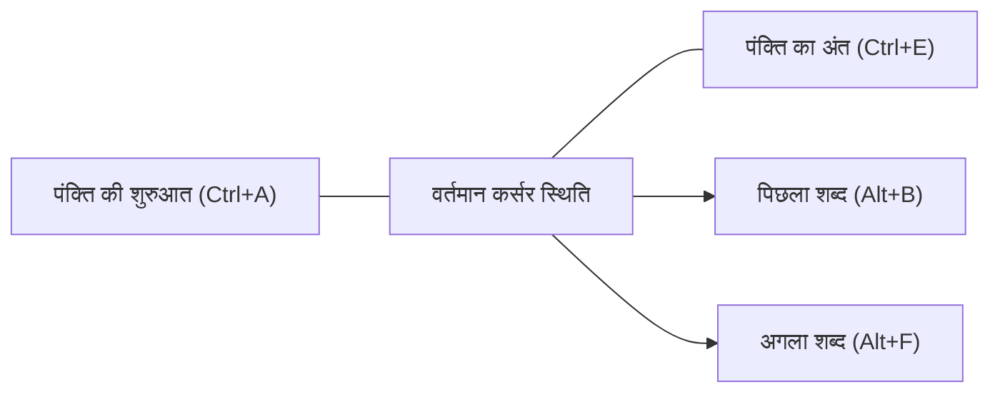
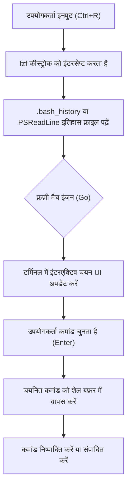

# परिचय: टर्मिनल संचालन को सुव्यवस्थित करने से उत्पादकता में भारी वृद्धि

आधुनिक सॉफ्टवेयर विकास में, टर्मिनल (कमांड-लाइन इंटरफ़ेस) डेवलपर्स के लिए सबसे महत्वपूर्ण उपकरण है, जो उनके "हाथ-पैर" के रूप में कार्य करता है। क्लाउड इंफ्रास्ट्रक्चर का प्रबंधन करना हो, कंटेनर बिल्ड करना हो, Git के साथ संस्करण नियंत्रण (version control) हो, या विभिन्न स्क्रिप्ट चलाना हो, यह कहना अतिशयोक्ति नहीं होगी कि डेवलपर्स अपना अधिकांश दिन टर्मिनल में बिताते हैं।

हालाँकि, जबकि कई डेवलपर्स बुनियादी टर्मिनल कमांड (`cd`, `ls`, `git`, `docker`, आदि) में कुशल हैं, वे अक्सर **"टर्मिनल इनपुट को अनुकूलित (optimize) करने"** के दृष्टिकोण को नजरअंदाज कर देते हैं। माउस तक पहुँचना, कर्सर को हिलाना, और कमांड में टाइपो को ठीक करने के लिए तीर कुंजियों (arrow keys) को बार-बार दबाना... छोटे-छोटे समय की बर्बादी का यह संचय लंबी अवधि में भारी समय की बर्बादी और संज्ञानात्मक भार (cognitive load) की ओर ले जाता है।

यह लेख "कीबोर्ड से अपने हाथ कभी न हटाएं" दर्शन के आधार पर Bash और PowerShell वातावरण में टर्मिनल संचालन को अत्यधिक कुशल बनाने के लिए शॉर्टकट, कीबाइंडिंग सेटिंग्स, इतिहास खोज अनुकूलन, और टर्मिनल मल्टीप्लेक्सर उपयोग के बारे में बहुत विस्तृत और तकनीकी स्पष्टीकरण प्रदान करता है।

---

# 1. सैद्धांतिक पृष्ठभूमि: कीस्ट्रोक लेवल मॉडल (KLM) और समय लागत का निर्माण

दक्षता के लाभों को मात्रात्मक रूप से समझने के लिए, आइए **कीस्ट्रोक-लेवल मॉडल (KLM)** का परिचय दें, जो HCI (ह्यूमन-कंप्यूटर इंटरेक्शन) के क्षेत्र में उपयोग किए जाने वाले **GOMS मॉडल** का एक प्रकार है।

KLM एक ऐसा मॉडल है जिसका उपयोग यह अनुमान लगाने के लिए किया जाता है कि एक कुशल उपयोगकर्ता को किसी विशिष्ट त्रुटि-मुक्त कार्य को पूरा करने में कितना समय लगेगा। किसी कार्य का निष्पादन समय (execution time) $T_{execute}$ निम्नलिखित गणितीय समीकरण द्वारा तैयार किया गया है:

$$ T_{execute} = \sum_{i} \left( K \cdot t_{k} + P \cdot t_{p} + H \cdot t_{h} + M \cdot t_{m} + R \cdot t_{r} \right) $$

यहाँ, प्रत्येक चर (variable) का अर्थ निम्नलिखित है:
- $K$ : कीस्ट्रोकिंग (Keystroking)। कीबोर्ड पर एक कुंजी को एक बार दबाने की क्रिया।
- $P$ : पॉइंटिंग (Pointing)। माउस जैसे पॉइंटिंग डिवाइस से लक्ष्य की ओर इशारा करने की क्रिया।
- $H$ : होमिंग (Homing)। हाथों को कीबोर्ड से माउस तक ले जाना या इसके विपरीत।
- $M$ : मानसिक तैयारी (Mental preparation)। अगली शारीरिक क्रिया की योजना बनाने और तैयारी करने के लिए संज्ञानात्मक सोच का समय।
- $R$ : सिस्टम प्रतिक्रिया (System Response)। उपयोगकर्ता को इंतजार करने का समय।

प्रत्येक क्रिया के लिए औसत आवश्यक समय ($t$) आम तौर पर निम्नानुसार अनुमानित किया जाता है:
- $t_{k} \approx 0.2$ सेकंड (एक कुशल टाइपिस्ट के लिए)
- $t_{p} \approx 1.1$ सेकंड
- $t_{h} \approx 0.4$ सेकंड
- $t_{m} \approx 1.35$ सेकंड

टर्मिनल संचालन में, यदि आप तीर कुंजियों या माउस का उपयोग करके किसी कमांड के एक हिस्से को संशोधित करने का प्रयास करते हैं, तो होमिंग ($H$) और पॉइंटिंग ($P$) होता है, जिसके परिणामस्वरूप प्रति संशोधन लगभग 1.5 से 2.0 सेकंड का दंड (penalty) होता है। दूसरी ओर, यदि आप उचित टर्मिनल शॉर्टकट सीखते हैं, तो आप $H$ और $P$ को **शून्य** पर रख सकते हैं और केवल कीस्ट्रोक्स ($K$) के साथ अपने लक्ष्य को प्राप्त कर सकते हैं।

मान लीजिए कि आप दिन में 500 बार कमांड दर्ज करते हैं और संपादित करते हैं, और शॉर्टकट के उपयोग से आप प्रत्येक बार 2 सेकंड बचा सकते हैं।
$$ 500 \text{ बार/दिन} \times 2 \text{ सेकंड} = 1000 \text{ सेकंड/दिन} \approx 16.6 \text{ मिनट/दिन} $$
यदि इसे वर्ष (240 कार्य दिवस) में परिवर्तित किया जाता है, तो आप **लगभग 66 घंटे (लगभग 8 कार्य दिवस)** का समय बचा सकते हैं। इससे भी महत्वपूर्ण बात यह है कि मानसिक तैयारी ($M$) में कमी आने से, आपको **"सोच में रुकावट न आने (प्रवाह की स्थिति या flow state बनाए रखने)"** का अथाह लाभ मिलता है।

---

# 2. Bash Readline और Emacs कीबाइंडिंग की गहराई

Linux और macOS के लिए मानक शेल, Bash, कमांड लाइन इनपुट को प्रोसेस करने के लिए आंतरिक रूप से **GNU Readline** नामक लाइब्रेरी का उपयोग करता है। Readline के लिए डिफ़ॉल्ट सेटिंग **Emacs कीबाइंडिंग** है, और इसे मास्टर करना टर्मिनल दक्षता की ओर पहला कदम है।

## 2.1. नेविगेशन शॉर्टकट

तीर कुंजियों के साथ कर्सर को एक बार में एक वर्ण (character) ले जाना अत्यंत अक्षम है। निम्नलिखित शॉर्टकट को अपनी "मांसपेशियों की स्मृति (muscle memory)" में उकेर लें।

- **`Ctrl + A`** : पंक्ति की शुरुआत (Start of line) पर जाएँ। इसका बहुत बार उपयोग किया जाता है।
- **`Ctrl + E`** : पंक्ति के अंत (End of line) पर जाएँ।
- **`Alt + B`** (Meta+B) : एक शब्द पीछे जाएँ (Backward word)। स्लैश या स्पेस का विभाजक (separator) के रूप में उपयोग करके शब्द दर शब्द तेज़ी से आगे बढ़ता है।
- **`Alt + F`** (Meta+F) : एक शब्द आगे बढ़ें (Forward word)।



## 2.2. संपादन शॉर्टकट (Kill और Yank)

Emacs शब्दावली में, टेक्स्ट को काटना (cut) "Kill" कहलाता है, और चिपकाना (paste) "Yank" कहलाता है।

- **`Ctrl + U`** : कर्सर की स्थिति से पंक्ति की शुरुआत तक (हटाएं) Kill करें। यदि आप पासवर्ड टाइप करने में गलती करते हैं या कमांड को शुरू से ही फिर से लिखना चाहते हैं, तो आप इसे तुरंत साफ़ कर सकते हैं।
- **`Ctrl + K`** : कर्सर की स्थिति से पंक्ति के अंत तक Kill करें।
- **`Ctrl + W`** : कर्सर की स्थिति से पहले एक शब्द को Kill करें। एक तर्क (argument) को हटाने और उसे फिर से लिखने के लिए उपयोगी।
- **`Alt + D`** (Meta+D) : कर्सर की स्थिति के बाद वाले एक शब्द को Kill करें।
- **`Ctrl + Y`** : सबसे हाल ही में Kill की गई सामग्री को Yank (पेस्ट) करें। उन्नत उपयोग संभव है, जैसे कि `Ctrl+U` के साथ हटाए गए कमांड को किसी अन्य निर्देशिका में जाने के बाद `Ctrl+Y` के साथ वापस लाना।
- **`Ctrl + _`** (या `Ctrl + x, Ctrl + u`) : पूर्ववत करें (Undo)। यदि आप गलती से इसे हटा देते हैं तो आप इसे पुनर्स्थापित कर सकते हैं।

## 2.3. अन्य महत्वपूर्ण शॉर्टकट

- **`Ctrl + L`** : स्क्रीन साफ़ करें (`clear` कमांड के समतुल्य)।
- **`Ctrl + C`** : वर्तमान कमांड इनपुट को रद्द करें, या चल रही प्रक्रिया को रोकें।
- **`Ctrl + D`** : EOF (End Of File) भेजें। जब कोई वर्ण दर्ज नहीं किया जाता है, तो यह शेल (`exit`) से बाहर निकल जाता है।

## 2.4. ~/.inputrc के साथ Readline को कस्टमाइज़ करना

इन कीबाइंडिंग को आपकी होम निर्देशिका में `~/.inputrc` फ़ाइल को संपादित करके और अधिक अनुकूलित किया जा सकता है। उदाहरण के लिए, यदि आप निम्नलिखित सेटिंग्स जोड़ते हैं, तो आप ऊपर और नीचे तीर कुंजियों का उपयोग करके केवल उन इतिहासों को खोजने में सक्षम होंगे जो दर्ज की जा रही स्ट्रिंग से मेल खाते हैं।

```bash
# ~/.inputrc के लिए उदाहरण सेटिंग
"\e[A": history-search-backward
"\e[B": history-search-forward
set completion-ignore-case on
set show-all-if-ambiguous on
```
इससे, यदि आप `docker ` टाइप करते हैं और फिर अप एरो कुंजी (up arrow key) दबाते हैं, तो आप `docker` से शुरू होने वाले पिछले कमांड इतिहास को तेज़ी से ट्रैक कर सकते हैं।

---

# 3. PowerShell और PSReadLine: Windows वातावरण में Bash जैसा संचालन

विंडोज़ में मानक शेल, PowerShell, के शुरुआती संस्करणों में केवल कमांड प्रॉम्प्ट (cmd.exe) के बराबर ही ख़राब इनपुट वातावरण था। हालाँकि, **PSReadLine** मॉड्यूल की शुरूआत के साथ, इसने उन्नत कमांड लाइन संपादन क्षमताएँ हासिल कर लीं जो Bash (Readline) को टक्कर देती हैं या उससे भी आगे निकल जाती हैं।

## 3.1. PSReadLine और Emacs मोड को सक्षम करना

PSReadLine, PowerShell 5.1 और बाद के संस्करणों (तथा PowerShell Core) में मानक के रूप में शामिल है। विंडोज़ उपयोगकर्ताओं के लिए टर्मिनल उत्पादकता को लिनक्स के स्तर तक बढ़ाने के लिए, PSReadLine संपादन मोड को डिफ़ॉल्ट Windows (cmd-जैसे) मोड से **Emacs मोड** में बदलना आवश्यक है।

PowerShell प्रोफ़ाइल (`$PROFILE`) को संपादित करें ताकि सेटिंग्स स्वचालित रूप से लोड हो जाएँ।

```powershell
# VS Code में $PROFILE खोलें
code $PROFILE
```

`$PROFILE` में निम्नलिखित सेटिंग्स जोड़ें।

```powershell
# PSReadLine मॉड्यूल आयात करना (यदि स्पष्ट रूप से किया जाए)
Import-Module PSReadLine

# संपादन मोड को Emacs पर सेट करें और Bash के समान शॉर्टकट सक्षम करें
Set-PSReadLineOption -EditMode Emacs

# बेल ध्वनि (त्रुटि ध्वनि) को अनदेखा करें
Set-PSReadLineOption -BellStyle None
```

अब, Emacs/Bash-शैली की कीबाइंडिंग जैसे `Ctrl+A` (पंक्ति की शुरुआत), `Ctrl+E` (पंक्ति का अंत), `Ctrl+U` (पंक्ति की शुरुआत तक हटाएं), और `Alt+B` / `Alt+F` (शब्द द्वारा ले जाएँ) Windows PowerShell पर भी पूरी तरह से काम करेंगे।

## 3.2. Predictive IntelliSense और उन्नत इतिहास खोज

PSReadLine की सबसे शक्तिशाली विशेषताओं में से एक **Predictive IntelliSense** है, जो इनपुट इतिहास और बाहरी भविष्यवाणी प्लगइन्स पर आधारित है। जैसे ही आप टाइप करना शुरू करते हैं, पिछले इतिहास से सबसे संभावित संपूर्ण कमांड हल्के भूरे रंग (इनलाइन) में प्रस्तावित हो जाता है। यदि आप प्रस्ताव स्वीकार करना चाहते हैं, तो बस राइट एरो कुंजी (या शब्द दर शब्द के लिए `Alt+F`) दबाएँ।

```powershell
# $PROFILE में जोड़ें: भविष्यवाणी सुविधा को सक्षम करना (PowerShell 7.1+ / PSReadLine 2.1+ की आवश्यकता है)
Set-PSReadLineOption -PredictionSource History
Set-PSReadLineOption -PredictionViewStyle InlineView
# यदि आप सूची प्रारूप में प्रदर्शित करना चाहते हैं, तो ListView निर्दिष्ट करें
# Set-PSReadLineOption -PredictionViewStyle ListView
```

## 3.3. ऊपर/नीचे कुंजियों के व्यवहार को ओवरराइड करना (Bash-जैसी फॉरवर्ड मैच खोज)

PowerShell की डिफ़ॉल्ट अप और डाउन एरो कुंजियाँ केवल अनुक्रमिक इतिहास नेविगेशन (sequential history navigation) हैं। पहले बताए गए `~/.inputrc` के समान ही, हम इसे "वर्तमान में दर्ज की गई स्ट्रिंग से मेल खाने वाले इतिहास की खोज" के फ़ंक्शन में रीमैप करेंगे।

```powershell
# $PROFILE में जोड़ें: इतिहास की फॉरवर्ड मैच खोज हैंडलर पंजीकृत करें
Set-PSReadLineKeyHandler -Key UpArrow -Function HistorySearchBackward
Set-PSReadLineKeyHandler -Key DownArrow -Function HistorySearchForward
```

नतीजतन, यहां तक कि विंडोज़ वातावरण में भी, आप लिनक्स वातावरण के समान उंगलियों की गति के साथ सहज रूप से कमांड बना, खोज और निष्पादित कर सकते हैं। DevOps इंजीनियरों के लिए प्लेटफ़ॉर्म के पार संज्ञानात्मक भार ($M$) को मानकीकृत करना अत्यंत महत्वपूर्ण है।

---

# 4. इतिहास खोज का चरम: fzf (Fuzzy Finder) का एकीकरण

टर्मिनल संचालन में आप जो सबसे लगातार कार्य करते हैं उनमें से एक है **"अतीत में आपके द्वारा निष्पादित जटिल आदेशों (commands) को ढूंढना और उन्हें फिर से निष्पादित करना"**। मानक `Ctrl+R` (रिवर्स सर्च) एक सटीक मिलान खोज (exact match search) है, इसलिए कमांड को अस्पष्ट यादों से वापस लाना मुश्किल है जैसे "मुझे लगता है कि मैंने docker run के साथ वॉल्यूम माउंट किया था..."।

गो (Go) भाषा में लिखा गया एक अति-तीव्र सामान्य-उद्देश्य वाला फ़ज़ी सर्च टूल, **`fzf`**, इस समस्या को बहुत ही शानदार ढंग से हल करता है।

## 4.1. fzf का उपयोग करके फ़ज़ी खोज की पाइपलाइन

जब आप कमांड इतिहास की खोज में `fzf` को एकीकृत करते हैं, तो पाइपलाइन को निम्नानुसार संसाधित किया जाता है:



जब उपयोगकर्ता स्पेस-सेपरेटेड एकाधिक कीवर्ड (उदा: `docker ubuntu bash`) दर्ज करता है, तो fzf का मिलान इंजन (matching engine) पूरी इतिहास फ़ाइल को स्कैन करता है और उन इतिहासों को तुरंत सूचीबद्ध करता है जिनमें वे कीवर्ड बिना किसी क्रम के या एक-दूसरे से दूर स्थित होते हैं।

## 4.2. Bash में fzf एकीकरण

Ubuntu/Debian जैसे Linux वातावरण में, आप इसे apt का उपयोग करके आसानी से इंस्टॉल कर सकते हैं। इसके अतिरिक्त, इंस्टॉलेशन स्क्रिप्ट चलाकर, Bash की कीबाइंडिंग स्वतः ही ओवरराइट हो जाती है।

```bash
# fzf इंस्टॉल करना
git clone --depth 1 https://github.com/junegunn/fzf.git ~/.fzf
~/.fzf/install
```
इसके साथ ही, जब आप `Ctrl+R` दबाते हैं, तो fzf का इंटरएक्टिव UI पूर्ण स्क्रीन पर (या tmux पेन में) पॉप अप हो जाएगा, जिससे आप अत्यधिक सहजता से इतिहास खोज सकेंगे। खोज UI पर, आप `Ctrl+N` (नीचे) / `Ctrl+P` (ऊपर) के साथ आइटम का चयन कर सकते हैं।

## 4.3. PowerShell में PSFzf एकीकरण

आप विंडोज़ PowerShell वातावरण में `PSFzf` मॉड्यूल का उपयोग करके बिल्कुल वही अनुभव प्राप्त कर सकते हैं। सबसे पहले, fzf बाइनरी स्थापित करें (Scoop आदि सुविधाजनक हैं) और फिर मॉड्यूल आयात करें।

```powershell
# Scoop के साथ fzf बाइनरी स्थापित करें
scoop install fzf

# PSFzf मॉड्यूल स्थापित करना
Install-Module -Name PSFzf -Scope CurrentUser
```

फिर, चाबियों (keys) को बांधने (bind) के लिए `$PROFILE` में सेटिंग्स जोड़ें।

```powershell
# $PROFILE में जोड़ें
Import-Module PSFzf

# Ctrl+R को fzf इतिहास खोज में मैप करें
Set-PsFzfOption -PSReadlineChordReverseHistorySearch 'Ctrl+r'
```
अब, विंडोज़ में भी, आप `Ctrl+R` के साथ तुरंत विशाल PowerShell इतिहास के माध्यम से फ़ज़ी खोज कर सकते हैं।

---

# 5. एलियास और रैपर फ़ंक्शंस का उपयोग करके कीस्ट्रोक्स को कम करना

शॉर्टकट और इतिहास खोज के अलावा, कीस्ट्रोक्स ($K$) को कम करने का सबसे सीधा तरीका एलियास (Alias) और रैपर फ़ंक्शंस को परिभाषित करना है।

## 5.1. Git संचालन को न्यूनतम करना

Git का उपयोग हर दिन अनगिनत बार किया जाता है। KLM मॉडल में हर बार `git status` या `git commit` को पूर्ण रूप से टाइप करना एक बड़ी बर्बादी है।

**Bash का उदाहरण (`~/.bashrc`)**:
```bash
alias g='git'
alias gs='git status -sb'
alias ga='git add'
alias gc='git commit -m'
alias gco='git checkout'
alias gp='git push'
alias gl='git log --oneline --graph --decorate --all'
```

**PowerShell का उदाहरण (`$PROFILE`)**:
```powershell
Set-Alias -Name g -Value git
function gs { git status -sb $args }
function ga { git add $args }
function gc { git commit -m $args }
function gco { git checkout $args }
function gl { git log --oneline --graph --decorate --all $args }
```
※ चूंकि PowerShell का `Set-Alias` तर्कों (arguments) को ठीक नहीं कर सकता है, इसलिए विकल्पों के साथ एलियास को ऊपर दिखाए गए अनुसार फ़ंक्शंस के रूप में परिभाषित करना सबसे अच्छा अभ्यास है।

## 5.2. निर्देशिका नेविगेशन का अनुकूलन (z / zoxide)

`cd` कमांड के साथ गहरी निर्देशिकाओं (deep directories) में नेविगेट करना थकाऊ है। हाल के वर्षों में, **`zoxide`** (Rust में लिखा गया) एक मानक बनता जा रहा है, जो उपयोगकर्ता के नेविगेशन इतिहास और आवृत्ति (Frecency: Frequency + Recency) को सीखता है, और आपको केवल पथ का एक हिस्सा टाइप करके गंतव्य निर्देशिका (destination directory) पर जाने की अनुमति देता है।

```bash
# zoxide स्थापित करने के बाद, cd के बजाय z का उपयोग करें
z proj # पलक झपकते ही /home/user/workspace/projects/ पर पहुँचें
```
zoxide सभी Bash, Zsh और PowerShell का समर्थन करता है, और क्रॉस-प्लेटफ़ॉर्म पर एक समान उच्च गति निर्देशिका नेविगेशन (high-speed directory navigation) प्रदान करता है।

---

# 6. टर्मिनल मल्टीप्लेक्सर और पेन प्रबंधन (Pane Management)

यदि आप एक टर्मिनल विंडो में एक प्रक्रिया (उदाहरण के लिए, एक स्थानीय सर्वर) शुरू करते हैं, तो आपको अन्य कार्य करने के लिए एक नई टर्मिनल विंडो खोलनी होगी। विंडोज़ के बीच स्विच करने (`Alt+Tab`) में दृश्य की गति शामिल होती है, और इससे संदर्भ स्विच (context switch) की लागत आती है (मानसिक तैयारी $M$ में वृद्धि)।

इसका समाधान एक **टर्मिनल मल्टीप्लेक्सर** है जो स्क्रीन को कई पेनों (panes) में विभाजित कर सकता है और पृष्ठभूमि में एकाधिक सत्रों (sessions) को बनाए रख सकता है।

## 6.1. tmux आर्किटेक्चर और स्थिति संक्रमण (Linux / macOS)

`tmux` एक शक्तिशाली मल्टीप्लेक्सर है जिसका क्लाइंट-सर्वर आर्किटेक्चर है। tmux संचालन हमेशा **प्रिफिक्स कुंजी (डिफ़ॉल्ट Ctrl+B है)** को पहले दबाकर किया जाता है ताकि शॉर्टकट अन्य कार्यक्रमों के साथ न टकराएं।

नीचे दिया गया Mermaid स्टेट ट्रांजिशन डायग्राम tmux के मूल ऑपरेटिंग फ्लो को दर्शाता है।

```mermaid
stateDiagram-v2
    [*] --> Normal["सामान्य मोड"]
    Normal --> Prefix["प्रिफिक्स मोड (Ctrl+B)"]
    Prefix --> Command["कमांड प्रॉम्प्ट (:)"]
    Prefix --> SplitV["पेन को लंबवत विभाजित करें (%)"]
    Prefix --> SplitH["पेन को क्षैतिज रूप से विभाजित करें (\")"]
    Prefix --> Switch["विंडो स्विच करें (n/p/0-9)"]
    Prefix --> Detach["सत्र को डिटैच करें (d)"]
    
    Command --> Normal["tmux कमांड निष्पादित करें"]
    SplitV --> Normal["सामान्य मोड पर लौटें"]
    SplitH --> Normal["सामान्य मोड पर लौटें"]
    Switch --> Normal["सामान्य मोड पर लौटें"]
    Detach --> [*]
```

यह `~/.tmux.conf` को संपादित करने का मानक अभ्यास है ताकि प्रिफिक्स कुंजी को दबाने में आसान `Ctrl+A` (GNU Screen स्टाइल) में बदला जा सके, या पेन नेविगेशन को Vim-जैसी `hjkl` कुंजियों से जोड़ा जा सके।

```text
# ~/.tmux.conf का उदाहरण
# प्रिफिक्स को Ctrl-a में बदलें
set -g prefix C-a
unbind C-b
bind C-a send-prefix

# पेन को सहज कुंजियों से विभाजित करें
bind | split-window -h
bind - split-window -v

# Vim जैसा पेन नेविगेशन
bind h select-pane -L
bind j select-pane -D
bind k select-pane -U
bind l select-pane -R
```

## 6.2. Windows Terminal में पेन प्रबंधन

विंडोज़ वातावरण में, नवीनतम **Windows Terminal** मानक के रूप में पेन स्प्लिटिंग कार्यक्षमता का समर्थन करता है। हालांकि इसमें tmux की तरह सेशन परसिस्टेंस फीचर नहीं है, आप GUI-आधारित तरीके से पेन को आसानी से प्रबंधित कर सकते हैं। सेटिंग्स (`settings.json`) खोलकर और क्रियाओं को अनुकूलित करके, आप कीबोर्ड से ही पूरा संचालन कर सकते हैं।

```json
// Windows Terminal settings.json का हिस्सा
"actions": [
    { "command": { "action": "splitPane", "split": "auto" }, "keys": "alt+shift+d" },
    { "command": { "action": "moveFocus", "direction": "left" }, "keys": "alt+left" },
    { "command": { "action": "moveFocus", "direction": "right" }, "keys": "alt+right" }
]
```
इससे, PowerShell के अंदर केवल `Alt+Shift+D` दबाकर स्क्रीन विभाजित हो जाती है, और आप तीर कुंजियों और `Alt` के संयोजन का उपयोग करके पेन के बीच निर्बाध रूप से घूम सकते हैं।

---

# 7. व्यावहारिक वर्कफ़्लो निर्माण उदाहरण

ऊपर प्रस्तुत तत्वों (Emacs कीबाइंडिंग, PSReadLine, fzf, एलियास, मल्टीप्लेक्सर) को मिलाकर, दैनिक कार्यों को नाटकीय रूप से गति दी जा सकती है।

उदाहरण के लिए, मान लें कि आप "किसी विफलता का जवाब देते समय सर्वर लॉग की जांच कर रहे हैं, और साथ ही Git का उपयोग करके संबंधित कोड के कमिट इतिहास की जांच कर रहे हैं।"

1. एक टर्मिनल खोलें और उत्पादन (production) वातावरण की ऑपरेटिंग निर्देशिका में तुरंत जाने के लिए `z prod` टाइप करें।
2. `Ctrl+R` दबाएँ, `fzf` पॉप-अप में `ssh auth` टाइप करें, और पिछले जटिल SSH लॉगिन कमांड को याद करें और निष्पादित करें।
3. `Ctrl+B` `|` (tmux पेन स्प्लिट) करें और कोड की जांच करने के लिए सही पेन में `gs` (git status) आदि निष्पादित करें।
4. यदि आपको बाएँ पेन के लॉग आउटपुट में कोई त्रुटि मिलती है, तो कॉपी मोड में प्रवेश करने के लिए `Ctrl+B` `[` दबाएँ, और केवल कीबोर्ड का उपयोग करके त्रुटि संदेश को yank (कॉपी) करें।
5. इसे अपने संपादक (editor) में चिपकाएँ और कारण की पहचान करें।

इस संपूर्ण श्रृंखला में, **आप कभी भी माउस को नहीं छूते हैं**। KLM समीकरण में $H$ (Homing) और $P$ (Pointing) पूरी तरह से समाप्त हो जाते हैं, और टर्मिनल संचालन आपके विचारों की गति का पूरी तरह से अनुसरण करने लगता है।

---

# निष्कर्ष

इस लेख में, हमने डेवलपर्स की उत्पादकता को निर्धारित करने वाले "टर्मिनल संचालन को सुव्यवस्थित करने" के बारे में विस्तार से बताया है, KLM सिद्धांत से लेकर विशिष्ट Bash/PowerShell कीबाइंडिंग तक, और fzf और tmux के एकीकरण तक।

प्रारंभ में, आपको `Ctrl+A` या `Ctrl+E` को सचेत रूप से टाइप करना तनावपूर्ण लग सकता है। हालांकि, कुछ हफ्तों के लिए इनका सचेत रूप से उपयोग करने के बाद, ये शॉर्टकट निश्चित रूप से आपकी **मांसपेशियों की स्मृति (muscle memory)** में समा जाएंगे। एक बार जब वे स्थापित हो जाते हैं, तो आप अनजाने में ही टर्मिनल को अपनी इच्छानुसार नेविगेट करने में सक्षम होंगे, जो एक ऐसी संपत्ति बन जाएगी जो आपके पूरे जीवनकाल में आपके डेवलपर अनुभव (Developer Experience, DX) को नाटकीय रूप से बढ़ाएगी।

आज ही `$PROFILE` या `~/.bashrc` खोलें और अपने लिए वह अंतिम टर्मिनल वातावरण बनाना शुरू करें जो आपके हाथों के लिए सबसे उपयुक्त हो।
