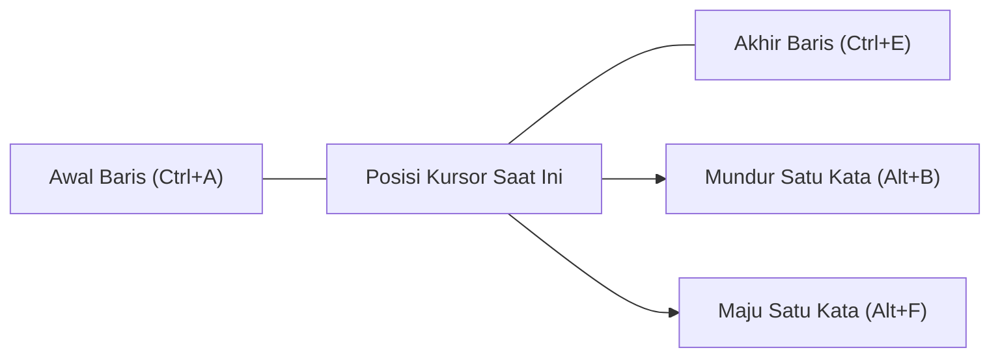
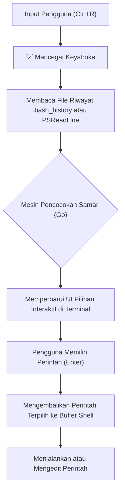

# Pendahuluan: Peningkatan Produktivitas yang Luar Biasa Melalui Efisiensi Operasi Terminal

Dalam pengembangan perangkat lunak modern, terminal (Command Line Interface) adalah alat paling penting yang menjadi "kaki dan tangan" pengembang. Mulai dari manajemen infrastruktur cloud, membangun container, kontrol versi dengan Git, hingga menjalankan berbagai skrip, tidak berlebihan untuk mengatakan bahwa pengembang menghabiskan sebagian besar harinya di terminal.

Namun, meskipun banyak pengembang yang ahli dengan perintah dasar terminal (seperti `cd`, `ls`, `git`, `docker`, dll.), mereka sering kali mengabaikan aspek **"mengoptimalkan input ke terminal itu sendiri"**. Menggerakkan tangan ke mouse, memindahkan kursor, dan menekan tombol panah berkali-kali untuk memperbaiki kesalahan ketik pada perintah... Akumulasi dari kerugian kecil ini seiring waktu menyebabkan pemborosan waktu yang sangat besar dan beban kognitif.

Dalam artikel ini, berdasarkan filosofi "jangan lepaskan tangan dari keyboard", kami akan menjelaskan secara sangat mendetail dan teknis tentang cara memaksimalkan efisiensi operasi terminal di lingkungan Bash dan PowerShell. Kami akan membahas tentang pintasan (shortcut), pengaturan keybind, optimalisasi pencarian riwayat, serta cara memanfaatkan terminal multiplexer.

---

# 1. Latar Belakang Teoritis: Keystroke-Level Model (KLM) dan Formulasi Biaya Waktu

Untuk memahami manfaat efisiensi secara kuantitatif, mari kita perkenalkan dan pertimbangkan **Keystroke-Level Model (KLM)**, yang merupakan jenis dari **model GOMS** yang digunakan dalam bidang HCI (Human-Computer Interaction).

KLM adalah model untuk memprediksi waktu yang dibutuhkan oleh pengguna ahli untuk menyelesaikan tugas tertentu tanpa kesalahan. Waktu pelaksanaan tugas $T_{execute}$ dirumuskan dengan persamaan matematika berikut.

$$ T_{execute} = \sum_{i} \left( K \cdot t_{k} + P \cdot t_{p} + H \cdot t_{h} + M \cdot t_{m} + R \cdot t_{r} \right) $$

Di sini, setiap variabel memiliki arti sebagai berikut:
- $K$ : Keystroking. Tindakan menekan tombol pada keyboard satu kali.
- $P$ : Pointing. Tindakan menunjuk target dengan perangkat penunjuk seperti mouse.
- $H$ : Homing. Tindakan memindahkan tangan dari keyboard ke mouse, atau sebaliknya.
- $M$ : Persiapan mental (Mental preparation). Waktu berpikir kognitif untuk merencanakan dan menyiapkan tindakan fisik berikutnya.
- $R$ : Respons sistem (System Response). Waktu pengguna menunggu sistem.

Rata-rata waktu yang dibutuhkan untuk setiap tindakan ($t$) secara umum diperkirakan sebagai berikut:
- $t_{k} \approx 0.2$ detik (untuk pengetik ahli)
- $t_{p} \approx 1.1$ detik
- $t_{h} \approx 0.4$ detik
- $t_{m} \approx 1.35$ detik

Saat menggunakan tombol panah atau mouse untuk memperbaiki bagian dari perintah dalam operasi terminal, tindakan Homing ($H$) dan Pointing ($P$) akan terjadi, menghasilkan penalti sekitar 1.5 detik hingga 2.0 detik untuk setiap perbaikan. Di sisi lain, jika Anda menguasai pintasan terminal yang tepat, Anda dapat menekan $H$ dan $P$ menjadi **nol** dan mencapai tujuan hanya dengan Keystroke ($K$).

Misalkan Anda memasukkan dan mengedit perintah 500 kali sehari, dan dengan memanfaatkan pintasan, Anda dapat menghemat 2 detik setiap kalinya.
$$ 500 \text{ kali/hari} \times 2 \text{ detik} = 1000 \text{ detik/hari} \approx 16.6 \text{ menit/hari} $$
Jika ini dikonversi ke dalam satu tahun (240 hari kerja), perhitungannya dapat menghemat sekitar **66 jam (sekitar 8 hari kerja)** waktu Anda. Lebih penting lagi, dengan mengurangi persiapan mental ($M$), Anda mendapatkan keuntungan yang tak ternilai berupa **"pemikiran yang tidak terputus (mempertahankan kondisi flow)"**.

---

# 2. Kedalaman Bash Readline dan Keybind Emacs

Bash, shell standar untuk Linux dan macOS, secara internal menggunakan pustaka bernama **GNU Readline** untuk memproses baris perintah. Pengaturan default untuk Readline ini adalah **keybind Emacs**, dan menguasai hal ini adalah langkah pertama menuju efisiensi terminal.

## 2.1. Pintasan Navigasi

Menggerakkan kursor satu karakter pada satu waktu menggunakan tombol panah adalah inefisiensi yang ekstrem. Tanamkan pintasan berikut ini ke dalam "memori otot (muscle memory)" Anda.

- **`Ctrl + A`** : Pindah ke awal baris (Start of line). Sangat sering digunakan.
- **`Ctrl + E`** : Pindah ke akhir baris (End of line).
- **`Alt + B`** (Meta+B) : Mundur 1 kata (Backward word). Bergerak cepat per kata menggunakan garis miring atau spasi sebagai pemisah.
- **`Alt + F`** (Meta+F) : Maju 1 kata (Forward word).



## 2.2. Pintasan Pengeditan (Kill dan Yank)

Dalam terminologi Emacs, memotong (cut) teks disebut "Kill", dan menempelkan (paste) teks disebut "Yank".

- **`Ctrl + U`** : Kill (hapus) dari posisi kursor ke awal baris. Berguna untuk menghapus instan saat salah memasukkan kata sandi atau saat Anda ingin menulis ulang perintah dari awal.
- **`Ctrl + K`** : Kill dari posisi kursor ke akhir baris.
- **`Ctrl + W`** : Kill 1 kata sebelumnya dari posisi kursor. Sangat berguna saat Anda ingin menghapus satu argumen dan menulis ulang.
- **`Alt + D`** (Meta+D) : Kill 1 kata berikutnya dari posisi kursor.
- **`Ctrl + Y`** : Yank (tempel) konten yang terakhir di-kill. Anda bisa melakukan trik tingkat lanjut seperti menghidupkan kembali perintah yang dihapus dengan `Ctrl+U` setelah pindah ke direktori lain menggunakan `Ctrl+Y`.
- **`Ctrl + _`** (atau `Ctrl + x, Ctrl + u`) : Undo (kembalikan). Dapat dipulihkan jika Anda tidak sengaja menghapusnya.

## 2.3. Pintasan Penting Lainnya

- **`Ctrl + L`** : Membersihkan layar (setara dengan perintah `clear`).
- **`Ctrl + C`** : Membatalkan input perintah saat ini, atau menghentikan proses yang sedang berjalan.
- **`Ctrl + D`** : Mengirim EOF (End Of File). Jika tidak ada karakter yang dimasukkan, ini akan keluar dari shell (`exit`).

## 2.4. Menyesuaikan Readline dengan ~/.inputrc

Keybind ini dapat dioptimalkan lebih lanjut dengan mengedit file `~/.inputrc` di direktori home Anda. Misalnya, dengan menambahkan pengaturan berikut, Anda dapat menggunakan tombol atas dan bawah hanya untuk mencari riwayat yang memiliki awalan yang sama (forward match) dengan string yang sedang diketik.

```bash
# Contoh konfigurasi ~/.inputrc
"\e[A": history-search-backward
"\e[B": history-search-forward
set completion-ignore-case on
set show-all-if-ambiguous on
```
Dengan cara ini, setelah mengetik `docker ` lalu menekan tombol panah atas, Anda dapat dengan cepat mencari riwayat perintah sebelumnya yang hanya diawali dengan `docker`.

---

# 3. PowerShell dan PSReadLine: Operasi ala Bash di Lingkungan Windows

PowerShell, shell standar di Windows, pada versi awalnya hanya memiliki lingkungan input yang buruk yang setara dengan command prompt (cmd.exe). Namun, dengan diperkenalkannya modul **PSReadLine**, ini memberikan fitur pengeditan baris perintah canggih yang setara atau bahkan melebihi Bash (Readline).

## 3.1. Mengaktifkan PSReadLine dan Mode Emacs

PSReadLine sudah terintegrasi secara standar di PowerShell 5.1 dan yang lebih baru (serta PowerShell Core). Agar pengguna Windows dapat meningkatkan produktivitas terminalnya ke level Linux, sangat penting untuk mengubah mode pengeditan PSReadLine dari mode default Windows (ala cmd) ke **Mode Emacs**.

Mari kita edit profil PowerShell (`$PROFILE`) agar pengaturan dimuat secara otomatis.

```powershell
# Buka $PROFILE di VS Code
code $PROFILE
```

Tambahkan pengaturan berikut ke dalam `$PROFILE`.

```powershell
# Impor modul PSReadLine (jika dilakukan secara eksplisit)
Import-Module PSReadLine

# Setel mode pengeditan ke Emacs dan aktifkan pintasan yang sama dengan Bash
Set-PSReadLineOption -EditMode Emacs

# Abaikan suara bel (suara peringatan kesalahan)
Set-PSReadLineOption -BellStyle None
```

Dengan ini, keybind gaya Emacs/Bash seperti `Ctrl+A` (awal baris), `Ctrl+E` (akhir baris), `Ctrl+U` (hapus hingga awal baris), dan `Alt+B` / `Alt+F` (pindah kata) akan berfungsi sepenuhnya di PowerShell Windows.

## 3.2. Predictive IntelliSense dan Pencarian Riwayat Tingkat Lanjut

Salah satu fitur canggih PSReadLine adalah **Predictive IntelliSense**, yang didasarkan pada riwayat input atau plugin prediksi eksternal. Saat Anda mulai mengetik, seluruh perintah yang paling memungkinkan dari riwayat masa lalu disarankan dalam warna abu-abu muda (inline). Jika Anda ingin menerima saran tersebut, cukup tekan tombol panah kanan (atau `Alt+F` untuk melengkapi per kata).

```powershell
# Tambahkan ke $PROFILE: Aktifkan fitur prediksi (memerlukan PowerShell 7.1+ / PSReadLine 2.1+)
Set-PSReadLineOption -PredictionSource History
Set-PSReadLineOption -PredictionViewStyle InlineView
# Tentukan ListView jika Anda ingin menampilkannya dalam format daftar
# Set-PSReadLineOption -PredictionViewStyle ListView
```

## 3.3. Mengesampingkan Perilaku Tombol Atas/Bawah (Pencarian Awalan ala Bash)

Perilaku default tombol panah atas/bawah di PowerShell hanyalah navigasi riwayat secara berurutan. Mirip dengan `~/.inputrc` sebelumnya, kita akan memetakan ulang ini ke fungsi "mencari riwayat yang memiliki awalan yang sama dengan string yang sedang dimasukkan saat ini".

```powershell
# Tambahkan ke $PROFILE: Daftarkan penangan pencarian kecocokan awalan riwayat
Set-PSReadLineKeyHandler -Key UpArrow -Function HistorySearchBackward
Set-PSReadLineKeyHandler -Key DownArrow -Function HistorySearchForward
```

Dengan cara ini, bahkan di lingkungan Windows, Anda dapat merakit, mencari, dan menjalankan perintah secara intuitif dengan gerakan jari yang sama persis seperti di lingkungan Linux. Menstandarkan beban kognitif ($M$) di berbagai platform sangat penting bagi seorang insinyur DevOps.

---

# 4. Puncak Pencarian Riwayat: Integrasi fzf (Fuzzy Finder)

Dalam operasi terminal, salah satu tindakan yang paling sering dilakukan adalah **"mencari perintah kompleks yang dijalankan di masa lalu dari riwayat dan menjalankannya kembali"**. Menggunakan `Ctrl+R` (pencarian balik) standar adalah pencarian kecocokan persis, sehingga sulit untuk memanggil kembali perintah dari memori samar seperti "sepertinya saya memasang volume dengan docker run dan...".

Alat yang dapat menyelesaikan masalah ini secara elegan adalah alat pencarian samar (fuzzy) serbaguna yang sangat cepat yang ditulis dalam Go, yaitu **`fzf`**.

## 4.1. Pipeline Pencarian Samar dengan fzf

Saat Anda mengintegrasikan `fzf` ke dalam pencarian riwayat perintah, proses akan dilakukan melalui pipeline berikut.



Jika pengguna memasukkan beberapa kata kunci yang dipisahkan oleh spasi (contoh: `docker ubuntu bash`), mesin pencocokan fzf akan memindai seluruh file riwayat dan langsung membuat daftar riwayat yang mengandung kata-kata kunci tersebut dalam urutan apa pun dan di posisi mana pun yang terpisah.

## 4.2. Integrasi fzf di Bash

Di lingkungan Linux seperti Ubuntu/Debian, ini dapat dengan mudah diinstal menggunakan apt. Selain itu, dengan menjalankan skrip instalasi, keybind Bash akan ditimpa secara otomatis.

```bash
# Instalasi fzf
git clone --depth 1 https://github.com/junegunn/fzf.git ~/.fzf
~/.fzf/install
```
Akibatnya, saat Anda menekan `Ctrl+R`, UI interaktif fzf akan muncul di layar penuh (atau di dalam panel tmux), memungkinkan Anda mencari riwayat dengan sangat intuitif. Di UI pencarian, Anda dapat memilih item dengan `Ctrl+N` (bawah) / `Ctrl+P` (atas).

## 4.3. Integrasi PSFzf di PowerShell

Di lingkungan Windows PowerShell, Anda bisa mendapatkan pengalaman yang persis sama dengan menggunakan modul `PSFzf`. Pertama, instal biner fzf (menggunakan Scoop atau sejenisnya lebih mudah) dan kemudian perkenalkan modulnya.

```powershell
# Instal biner fzf menggunakan Scoop
scoop install fzf

# Instal modul PSFzf
Install-Module -Name PSFzf -Scope CurrentUser
```

Lalu, tambahkan pengaturan ke `$PROFILE` dan tetapkan (bind) tombolnya.

```powershell
# Tambahkan ke $PROFILE
Import-Module PSFzf

# Petakan Ctrl+R ke pencarian riwayat fzf
Set-PsFzfOption -PSReadlineChordReverseHistorySearch 'Ctrl+r'
```
Sekarang, bahkan di Windows, menekan `Ctrl+R` memungkinkan Anda melakukan pencarian samar (fuzzy) langsung dari sejumlah besar riwayat PowerShell di masa lalu.

---

# 5. Meminimalkan Keystroke dengan Alias dan Fungsi Wrapper

Selain pintasan dan pencarian riwayat, cara paling langsung untuk mengurangi keystroke ($K$) itu sendiri adalah dengan menentukan Alias dan fungsi wrapper.

## 5.1. Meminimalkan Operasi Git

Kita menggunakan Git berkali-kali setiap hari. Mengetikkan ejaan lengkap untuk `git status` dan `git commit` setiap saat adalah pemborosan besar dalam model KLM.

**Contoh Bash (`~/.bashrc`)**:
```bash
alias g='git'
alias gs='git status -sb'
alias ga='git add'
alias gc='git commit -m'
alias gco='git checkout'
alias gp='git push'
alias gl='git log --oneline --graph --decorate --all'
```

**Contoh PowerShell (`$PROFILE`)**:
```powershell
Set-Alias -Name g -Value git
function gs { git status -sb $args }
function ga { git add $args }
function gc { git commit -m $args }
function gco { git checkout $args }
function gl { git log --oneline --graph --decorate --all $args }
```
※ Karena `Set-Alias` PowerShell tidak bisa mematok (fix) argumen, praktik terbaiknya adalah mendefinisikan alias yang disertai dengan opsi (option) sebagai fungsi (function) seperti di atas.

## 5.2. Mengoptimalkan Navigasi Direktori (z / zoxide)

Berpindah ke direktori dengan hierarki yang dalam menggunakan perintah `cd` sangat merepotkan. Baru-baru ini, sebuah alat bernama **`zoxide`** (dibuat menggunakan Rust), yang mempelajari riwayat navigasi dan frekuensi pengguna (Frecency: Frequency + Recency), telah menjadi standar di mana Anda dapat melompat ke direktori tujuan hanya dengan mengetikkan sebagian dari path-nya.

```bash
# Setelah menginstal zoxide, gunakan z sebagai pengganti cd
z proj # Langsung berpindah ke /home/user/workspace/projects/ dalam sekejap
```
zoxide kompatibel dengan semua Bash, Zsh, dan PowerShell, memberikan perpindahan direktori yang cepat di lintas platform.

---

# 6. Terminal Multiplexer dan Manajemen Panel (Pane)

Jika Anda meluncurkan satu proses (misalnya, server lokal) di dalam satu jendela terminal, Anda harus membuka jendela terminal baru untuk mengerjakan pekerjaan lain. Berpindah antar jendela (`Alt+Tab`) melibatkan pergerakan pandangan mata dan menimbulkan biaya peralihan konteks (peningkatan persiapan mental $M$).

Solusi untuk masalah ini adalah **Terminal Multiplexer**, yang membagi layar menjadi beberapa panel dan dapat mempertahankan beberapa sesi di latar belakang.

## 6.1. Arsitektur dan Transisi Status tmux (Linux / macOS)

`tmux` adalah multiplexer tangguh dengan arsitektur tipe server-klien. Pengoperasian tmux dirancang sedemikian rupa sehingga Anda harus menekan **tombol awalan (prefix key, default-nya adalah Ctrl+B)** terlebih dahulu agar pintasannya tidak bertabrakan dengan program lain.

Diagram transisi status Mermaid berikut menunjukkan alur pengoperasian dasar dari tmux.

```mermaid
stateDiagram-v2
    [*] --> Normal["Mode Normal"]
    Normal --> Prefix["Mode Awalan (Ctrl+B)"]
    Prefix --> Command["Prompt Perintah (:)"]
    Prefix --> SplitV["Pisahkan Panel Vertikal (%)"]
    Prefix --> SplitH["Pisahkan Panel Horizontal (\")"]
    Prefix --> Switch["Ganti Jendela (n/p/0-9)"]
    Prefix --> Detach["Lepaskan Sesi (d)"]
    
    Command --> Normal["Jalankan Perintah tmux"]
    SplitV --> Normal["Kembali ke Mode Normal"]
    SplitH --> Normal["Kembali ke Mode Normal"]
    Switch --> Normal["Kembali ke Mode Normal"]
    Detach --> [*]
```

Mengedit `~/.tmux.conf` adalah langkah umum untuk mengubah tombol awalan ke `Ctrl+A` (gaya GNU Screen) yang lebih mudah ditekan, atau memetakan perpindahan panel ke `hjkl` seperti Vim.

```text
# Contoh ~/.tmux.conf
# Ubah tombol awalan ke Ctrl-a
set -g prefix C-a
unbind C-b
bind C-a send-prefix

# Pembagian panel ke tombol yang lebih intuitif
bind | split-window -h
bind - split-window -v

# Navigasi panel bergaya Vim
bind h select-pane -L
bind j select-pane -D
bind k select-pane -U
bind l select-pane -R
```

## 6.2. Manajemen Panel di Windows Terminal

Di lingkungan Windows, **Windows Terminal** terbaru sudah memiliki dukungan standar untuk fitur pembagian panel. Walaupun tidak memiliki fitur persistensi sesi seperti tmux, Anda dapat dengan mudah mengelola panel berbasis GUI. Dengan membuka pengaturan (`settings.json`) dan menyesuaikan tindakannya, Anda dapat melakukan operasi yang sepenuhnya diselesaikan hanya dengan menggunakan keyboard.

```json
// Sebagian dari settings.json Windows Terminal
"actions": [
    { "command": { "action": "splitPane", "split": "auto" }, "keys": "alt+shift+d" },
    { "command": { "action": "moveFocus", "direction": "left" }, "keys": "alt+left" },
    { "command": { "action": "moveFocus", "direction": "right" }, "keys": "alt+right" }
]
```
Ini memungkinkan Anda membagi layar di PowerShell hanya dengan menekan `Alt+Shift+D`, dan Anda dapat berpindah antar panel secara mulus dengan kombinasi tombol panah dan `Alt`.

---

# 7. Contoh Alur Kerja Praktis

Dengan menggabungkan elemen-elemen yang diperkenalkan sejauh ini (Keybind Emacs, PSReadLine, fzf, Alias, dan Multiplexer), tugas-tugas harian akan dipercepat secara dramatis.

Sebagai contoh, mari asumsikan tugas "memeriksa log server saat merespons insiden, sambil memeriksa riwayat commit kode yang relevan di Git pada waktu yang sama."

1. Buka terminal, ketik `z prod`, dan langsung berpindah ke direktori operasional lingkungan produksi dalam sekejap.
2. Tekan `Ctrl+R`, ketik `ssh auth` pada popup `fzf` untuk memanggil lalu mengeksekusi perintah login SSH kompleks di masa lalu.
3. Lakukan `Ctrl+B` `|` (pembagian panel tmux), jalankan perintah seperti `gs` (git status) di panel kanan untuk menyelidiki kode.
4. Jika Anda menemukan error pada output log di panel kiri, tekan `Ctrl+B` `[` untuk masuk ke mode salin, lalu yank (salin) pesan error tersebut hanya dengan menggunakan keyboard.
5. Tempel ke editor dan identifikasi penyebabnya.

Dalam serangkaian tindakan ini, **Anda tidak perlu menyentuh mouse sama sekali**. $H$ (Homing) dan $P$ (Pointing) pada persamaan KLM dihilangkan sepenuhnya, dan pengoperasian terminal sepenuhnya mengikuti kecepatan pemikiran Anda.

---

# Kesimpulan

Dalam artikel ini, kami telah menjelaskan secara mendetail tentang "efisiensi operasi terminal", yang sangat menentukan produktivitas pengembang. Kami memulainya dari teori KLM, turun ke pengaturan keybind Bash/PowerShell yang konkret, hingga integrasi fzf dan tmux.

Pada awalnya, Anda mungkin akan merasa stres karena harus secara sadar menekan tombol seperti `Ctrl+A` atau `Ctrl+E`. Namun, dengan menggunakannya secara sadar selama beberapa minggu, pintasan ini pasti akan menetap di **memori otot (muscle memory)** Anda. Sekali ia menetap, Anda akan mampu mengoperasikan terminal dengan bebas dan tanpa sadar, dan ini akan menjadi sebuah aset berharga yang secara dramatis meningkatkan Pengalaman Pengembang (Developer Experience / DX) Anda seumur hidup.

Mulai hari ini, silakan buka `$PROFILE` atau `~/.bashrc` Anda dan mulailah membangun lingkungan terminal terbaik yang paling pas di tangan Anda.
