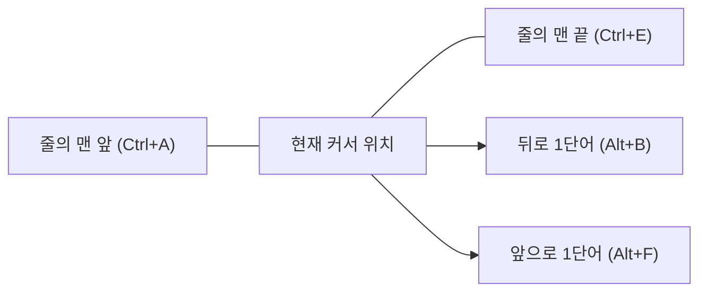
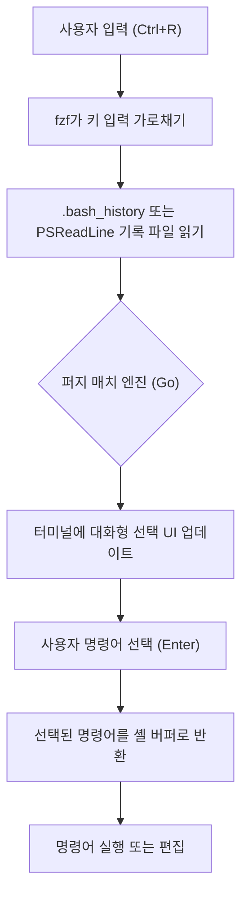

# 시작하며: 터미널 조작 효율화가 가져오는 압도적인 생산성 향상

현대 소프트웨어 개발에서 터미널(명령줄 인터페이스)은 개발자의 '손발'이 되는 가장 중요한 도구입니다. 클라우드 인프라 관리, 컨테이너 빌드, Git을 통한 버전 관리, 각종 스크립트 실행 등 개발자의 하루 대부분은 터미널에서 보낸다고 해도 과언이 아닙니다.

하지만 많은 개발자가 터미널의 기본적인 명령어(`cd`, `ls`, `git`, `docker` 등)에는 능숙하지만, **'터미널 입력 자체를 최적화한다'**는 관점은 간과하기 쉽습니다. 마우스로 손을 뻗어 커서를 이동시키고, 화살표 키를 연타하여 명령어의 오타를 수정하는…… 이러한 작은 손실의 누적은 장기간에 걸쳐 막대한 시간 낭비와 인지 부하를 초래합니다.

본 문서에서는 '키보드에서 손을 떼지 않는다'는 철학을 바탕으로, Bash 및 PowerShell 환경에서 터미널 조작을 극한까지 효율화하기 위한 단축키, 키 바인딩 설정, 기록 검색 최적화, 그리고 터미널 멀티플렉서 활용 방법에 대해 매우 상세하고 기술적으로 해설합니다.

---

# 1. 이론적 배경: 키스트로크 레벨 모델(KLM)과 시간적 비용의 공식화

효율화의 이점을 정량적으로 이해하기 위해, HCI(Human-Computer Interaction) 분야에서 사용되는 **GOMS 모델**의 일종인 **키스트로크 레벨 모델(Keystroke-Level Model, KLM)**을 도입해 생각해 봅시다.

KLM은 숙련된 사용자가 특정 오류 없는 작업을 완료하는 데 걸리는 시간을 예측하기 위한 모델입니다. 작업의 실행 시간 $T_{execute}$는 다음의 수학적 방정식으로 공식화됩니다.

$$ T_{execute} = \sum_{i} \left( K \cdot t_{k} + P \cdot t_{p} + H \cdot t_{h} + M \cdot t_{m} + R \cdot t_{r} \right) $$

여기서 각 변수는 다음의 의미를 갖습니다:
- $K$ : 키스트로킹(Keystroking). 키보드의 키를 한 번 누르는 동작.
- $P$ : 포인팅(Pointing). 마우스 등 포인팅 장치로 대상을 가리키는 동작.
- $H$ : 호밍(Homing). 키보드에서 마우스로, 또는 그 반대로 손을 이동시키는 동작.
- $M$ : 정신적 준비(Mental preparation). 다음의 물리적인 행동을 계획·준비하기 위한 인지적인 사고 시간.
- $R$ : 시스템 응답(System Response). 사용자가 기다리는 시간.

각 동작의 평균적인 소요 시간($t$)은 일반적으로 다음과 같이 추정됩니다:
- $t_{k} \approx 0.2$ 초 (숙련된 타이피스트의 경우)
- $t_{p} \approx 1.1$ 초
- $t_{h} \approx 0.4$ 초
- $t_{m} \approx 1.35$ 초

터미널 조작에서 화살표 키나 마우스를 사용하여 명령어의 일부를 수정하려고 하면, 호밍($H$)이나 포인팅($P$)이 발생하여 1회 수정당 약 1.5초~2.0초의 페널티가 발생합니다. 반면, 적절한 터미널 단축키를 습득하면, $H$와 $P$를 **제로(0)**로 억제하고 키스트로크($K$)만으로 목적을 달성할 수 있습니다.

만약 하루에 500번의 명령어 입력 및 편집을 수행하고, 단축키 활용을 통해 1회당 2초를 단축했다고 가정해 봅시다.
$$ 500 \text{회/일} \times 2 \text{초} = 1000 \text{초/일} \approx 16.6 \text{분/일} $$
이를 연간(240 영업일)으로 환산하면, **약 66시간(약 8 영업일 분량)**이나 되는 시간을 절약할 수 있다는 계산이 나옵니다. 더 중요한 것은 정신적 준비($M$)가 감소함으로써 **'사고가 중단되지 않는다(몰입 상태를 유지할 수 있다)'**는 헤아릴 수 없는 이점을 얻을 수 있다는 점입니다.

---

# 2. Bash Readline과 Emacs 키 바인딩의 심연

Linux나 macOS의 표준 셸인 Bash는 내부적으로 **GNU Readline**이라는 라이브러리를 사용하여 명령줄의 입력 처리를 수행합니다. 이 Readline의 기본 설정은 **Emacs 키 바인딩**으로 되어 있으며, 이를 마스터하는 것이 터미널 효율화의 첫걸음이 됩니다.

## 2.1. 이동계 단축키

커서를 한 글자씩 화살표 키로 이동시키는 것은 비효율의 극치입니다. 다음 단축키를 '머슬 메모리(근육의 기억)'에 새겨넣읍시다.

- **`Ctrl + A`** : 줄의 맨 앞(Start of line)으로 이동합니다. 매우 자주 사용합니다.
- **`Ctrl + E`** : 줄의 맨 끝(End of line)으로 이동합니다.
- **`Alt + B`** (Meta+B) : 1단어 뒤로 이동(Backward word). 슬래시나 공백을 구분자로 하여 단어 단위로 고속 이동합니다.
- **`Alt + F`** (Meta+F) : 1단어 앞으로 이동(Forward word).



## 2.2. 편집계 단축키(킬과 양크)

Emacs 용어에서는 텍스트를 잘라내는(컷) 것을 '킬(Kill)', 붙여넣는(페이스트) 것을 '양크(Yank)'라고 부릅니다.

- **`Ctrl + U`** : 커서 위치부터 줄의 맨 앞까지를 킬(삭제)합니다. 비밀번호 입력 실수 시나 명령어를 처음부터 다시 쓰고 싶을 때 순식간에 지울 수 있습니다.
- **`Ctrl + K`** : 커서 위치부터 줄의 맨 끝까지를 킬합니다.
- **`Ctrl + W`** : 커서 위치부터 앞의 1단어를 킬합니다. 인수를 하나 지우고 다시 쓸 때 유용합니다.
- **`Alt + D`** (Meta+D) : 커서 위치부터 뒤의 1단어를 킬합니다.
- **`Ctrl + Y`** : 마지막으로 킬한 내용을 양크(붙여넣기)합니다. `Ctrl+U`로 지운 명령어를 다른 디렉터리로 이동한 후에 `Ctrl+Y`로 부활시키는 등의 고급 사용법이 가능합니다.
- **`Ctrl + _`** (또는 `Ctrl + x, Ctrl + u`) : 실행 취소(Undo). 실수로 지운 경우에 복원할 수 있습니다.

## 2.3. 기타 중요 단축키

- **`Ctrl + L`** : 화면을 지웁니다(`clear` 명령어와 동일).
- **`Ctrl + C`** : 현재 명령어 입력을 취소하거나, 실행 중인 프로세스를 중단합니다.
- **`Ctrl + D`** : EOF(End Of File)를 전송합니다. 문자가 입력되지 않은 상태에서는 셸을 종료(`exit`)합니다.

## 2.4. ~/.inputrc를 통한 Readline 사용자 정의

이러한 키 바인딩은 홈 디렉터리의 `~/.inputrc` 파일을 편집하여 더욱 최적화할 수 있습니다. 예를 들어, 아래와 같은 설정을 추가하면 입력 중인 문자열과 전방 일치하는 기록만을 위아래 키로 검색할 수 있게 됩니다.

```bash
# ~/.inputrc의 설정 예시
"\e[A": history-search-backward
"\e[B": history-search-forward
set completion-ignore-case on
set show-all-if-ambiguous on
```
이를 통해 `docker `를 입력한 후 위쪽 화살표 키를 누르면, 과거의 `docker`로 시작하는 명령어 기록만을 고속으로 추적할 수 있습니다.

---

# 3. PowerShell과 PSReadLine: Windows 환경에서의 Bash 유사 조작

Windows의 표준 셸인 PowerShell은 초기 버전에서는 명령 프롬프트(cmd.exe)와 동등한 빈약한 입력 환경밖에 없었습니다. 하지만 **PSReadLine** 모듈의 도입으로 Bash(Readline)에 필적하거나 이를 뛰어넘는 고도의 명령줄 편집 기능을 얻게 되었습니다.

## 3.1. PSReadLine 활성화 및 Emacs 모드

PowerShell 5.1 이상(및 PowerShell Core)에는 PSReadLine이 기본으로 내장되어 있습니다. Windows 사용자가 터미널의 생산성을 Linux 수준으로 끌어올리기 위해서는 PSReadLine의 편집 모드를 기본 Windows(cmd 유사) 모드에서 **Emacs 모드**로 변경하는 것이 필수입니다.

PowerShell의 프로필(`$PROFILE`)을 편집하여 설정을 자동으로 불러오도록 합시다.

```powershell
# $PROFILE을 VS Code에서 열기
code $PROFILE
```

`$PROFILE`에 아래 설정을 추가합니다.

```powershell
# PSReadLine 모듈 임포트(명시적으로 수행할 경우)
Import-Module PSReadLine

# 편집 모드를 Emacs로 설정하고, Bash와 동일한 단축키 활성화
Set-PSReadLineOption -EditMode Emacs

# 벨 소리(오류음) 무시하기
Set-PSReadLineOption -BellStyle None
```

이제 Windows의 PowerShell 상에서도 `Ctrl+A`(줄 맨 앞), `Ctrl+E`(줄 맨 끝), `Ctrl+U`(줄 맨 앞까지 삭제), `Alt+B` / `Alt+F`(단어 이동) 등 Emacs/Bash 스타일의 키 바인딩이 완벽하게 작동하게 됩니다.

## 3.2. Predictive IntelliSense와 고도화된 기록 검색

PSReadLine의 강력한 기능 중 하나가 입력 기록이나 외부 예측 플러그인에 기반한 **Predictive IntelliSense(예측 인텔리센스)**입니다. 입력을 시작하면 과거의 기록에서 가장 가능성 높은 전체 명령어가 옅은 회색(인라인)으로 제안됩니다. 제안을 수락할 경우에는 오른쪽 화살표 키(또는 `Alt+F`로 단어 단위)를 누르기만 하면 됩니다.

```powershell
# $PROFILE에 추가: 예측 기능 활성화(PowerShell 7.1+ / PSReadLine 2.1+ 필요)
Set-PSReadLineOption -PredictionSource History
Set-PSReadLineOption -PredictionViewStyle InlineView
# 목록 형식으로 표시하고 싶은 경우에는 ListView 지정
# Set-PSReadLineOption -PredictionViewStyle ListView
```

## 3.3. 위아래 키의 동작 덮어쓰기(Bash 유사 전방 일치 검색)

PowerShell의 기본 위아래 화살표 키는 단순한 기록의 순차 이동입니다. 이를 앞서 언급한 `~/.inputrc`와 마찬가지로 '현재 입력되어 있는 문자열과 전방 일치하는 기록을 검색하는' 기능으로 매핑을 다시 합니다.

```powershell
# $PROFILE에 추가: 기록 전방 일치 검색 핸들러 등록
Set-PSReadLineKeyHandler -Key UpArrow -Function HistorySearchBackward
Set-PSReadLineKeyHandler -Key DownArrow -Function HistorySearchForward
```

이를 통해 Windows 환경이더라도 Linux 환경과 완전히 동일한 손가락 움직임으로 직관적으로 명령어를 구성·검색·실행할 수 있게 됩니다. 인지 부하($M$)를 플랫폼 간에 공통화하는 것은 DevOps 엔지니어에게 매우 중요합니다.

---

# 4. 기록 검색의 극치: fzf(Fuzzy Finder) 통합

터미널 조작에서 가장 빈번하게 수행하는 작업 중 하나가 **'과거에 실행했던 복잡한 명령어를 기록에서 찾아내어 재실행하는'** 것입니다. 기본 제공되는 `Ctrl+R`(리버스 서치)은 완전 일치 검색이기 때문에 '확실히 docker run으로 볼륨 마운트해서…' 같은 모호한 기억에서 명령어를 끌어내는 것은 어렵습니다.

이 과제를 우아하게 해결하는 것이, Go 언어로 작성된 초고속 범용 퍼지 검색 도구인 **`fzf`**입니다.

## 4.1. fzf를 통한 퍼지 검색 파이프라인

`fzf`를 명령어 기록 검색에 통합하면 다음과 같은 파이프라인으로 처리가 진행됩니다.



사용자가 공백으로 구분하여 여러 키워드(예: `docker ubuntu bash`)를 입력하면, fzf의 매칭 엔진이 기록 파일 전체를 스캔하여 해당 키워드들이 순서에 상관없이 떨어져 있는 위치에 포함된 기록을 순식간에 목록화합니다.

## 4.2. Bash에서의 fzf 통합

Ubuntu/Debian 등 Linux 환경에서는 apt를 사용하여 간단히 설치할 수 있습니다. 게다가 설치 스크립트를 실행함으로써 Bash의 키 바인딩이 자동으로 덮어씌워집니다.

```bash
# fzf 설치
git clone --depth 1 https://github.com/junegunn/fzf.git ~/.fzf
~/.fzf/install
```
이를 통해 `Ctrl+R`을 누르면 fzf의 대화형 UI가 전체 화면(또는 tmux의 페인 내)에 팝업되어, 매우 직관적으로 기록을 검색할 수 있게 됩니다. 검색 UI 상에서는 `Ctrl+N`(아래) / `Ctrl+P`(위)로 항목을 선택할 수 있습니다.

## 4.3. PowerShell에서의 PSFzf 통합

Windows PowerShell 환경에서도 `PSFzf` 모듈을 사용하여 완전히 동일한 경험을 얻을 수 있습니다. 먼저 fzf 바이너리를 설치(Scoop 등이 편리합니다)하고, 모듈을 도입합니다.

```powershell
# Scoop으로 fzf 바이너리 설치
scoop install fzf

# PSFzf 모듈 설치
Install-Module -Name PSFzf -Scope CurrentUser
```

그리고 `$PROFILE`에 설정을 추가하여 키를 바인딩합니다.

```powershell
# $PROFILE에 추가
Import-Module PSFzf

# Ctrl+R을 fzf 기록 검색으로 매핑
Set-PsFzfOption -PSReadlineChordReverseHistorySearch 'Ctrl+r'
```
이제 Windows에서도 `Ctrl+R`로 순식간에 방대한 과거의 PowerShell 기록에서 퍼지 검색이 가능해집니다.

---

# 5. 별칭(Alias)과 래퍼 함수를 통한 타건 수 최소화

단축키와 기록 검색에 더해, 키스트로크($K$) 자체를 줄이는 가장 직접적인 방법이 별칭(Alias)과 래퍼 함수 정의입니다.

## 5.1. Git 조작 극소화

Git은 매일 셀 수 없을 정도로 사용합니다. `git status`나 `git commit`을 매번 전체 철자로 치는 것은 KLM 모델에서 큰 낭비입니다.

**Bash의 예 (`~/.bashrc`)**:
```bash
alias g='git'
alias gs='git status -sb'
alias ga='git add'
alias gc='git commit -m'
alias gco='git checkout'
alias gp='git push'
alias gl='git log --oneline --graph --decorate --all'
```

**PowerShell의 예 (`$PROFILE`)**:
```powershell
Set-Alias -Name g -Value git
function gs { git status -sb $args }
function ga { git add $args }
function gc { git commit -m $args }
function gco { git checkout $args }
function gl { git log --oneline --graph --decorate --all $args }
```
※ PowerShell의 `Set-Alias`는 인수를 고정할 수 없기 때문에 옵션을 동반하는 별칭은 위와 같이 함수(function)로 정의하는 것이 모범 사례입니다.

## 5.2. 디렉터리 이동 최적화(z / zoxide)

`cd` 명령어로 깊은 계층의 디렉터리로 이동하는 것은 번거롭습니다. 최근에는 사용자의 이동 기록과 빈도(Frecency: Frequency + Recency)를 학습하여, 경로의 일부만 입력하면 목적지 디렉터리로 점프할 수 있는 도구 **`zoxide`**(Rust 기반)가 표준으로 자리 잡아가고 있습니다.

```bash
# zoxide 설치 후 cd 대신 z를 사용
z proj # /home/user/workspace/projects/ 로 순식간에 이동
```
zoxide는 Bash, Zsh, PowerShell 모두를 지원하며, 크로스 플랫폼에서 동일하게 고속 디렉터리 이동을 구현합니다.

---

# 6. 터미널 멀티플렉서와 페인 관리

하나의 터미널 창에서 하나의 프로세스(예를 들어 로컬 서버)를 실행해 버리면, 다른 작업을 하기 위해 새로운 터미널 창을 다시 열어야 합니다. 창 전환(`Alt+Tab`)은 시선 이동을 수반하며, 컨텍스트 스위치 비용(정신적 준비 $M$ 증가)을 초래합니다.

이를 해결하는 것이 화면을 여러 페인으로 분할하고, 다중 세션을 백그라운드에 유지할 수 있는 **터미널 멀티플렉서**입니다.

## 6.1. tmux 아키텍처와 상태 전이(Linux / macOS)

`tmux`는 서버-클라이언트형 아키텍처를 가진 강력한 멀티플렉서입니다. tmux의 조작은 단축키가 다른 프로그램과 충돌하지 않도록 반드시 **접두사 키(기본값은 Ctrl+B)**를 먼저 누르는 구조로 되어 있습니다.

아래 Mermaid 상태 전이도는 tmux의 기본적인 조작 흐름을 나타냅니다.

```mermaid
stateDiagram-v2
    [*] --> Normal["일반 모드"]
    Normal --> Prefix["접두사 모드 (Ctrl+B)"]
    Prefix --> Command["명령 프롬프트 (:)"]
    Prefix --> SplitV["수직 분할 (%)"]
    Prefix --> SplitH["수평 분할 (\")"]
    Prefix --> Switch["창 전환 (n/p/0-9)"]
    Prefix --> Detach["세션 분리 (d)"]
    
    Command --> Normal["tmux 명령어 실행"]
    SplitV --> Normal["일반 모드로 복귀"]
    SplitH --> Normal["일반 모드로 복귀"]
    Switch --> Normal["일반 모드로 복귀"]
    Detach --> [*]
```

`~/.tmux.conf`를 편집하여, 접두사 키를 누르기 쉬운 `Ctrl+A`(GNU Screen풍)로 변경하거나, 페인 이동을 Vim풍의 `hjkl`에 바인딩하는 것이 정석입니다.

```text
# ~/.tmux.conf의 예시
# 접두사를 Ctrl-a로 변경
set -g prefix C-a
unbind C-b
bind C-a send-prefix

# 페인 분할을 직관적인 키로
bind | split-window -h
bind - split-window -v

# Vim 유사 페인 이동
bind h select-pane -L
bind j select-pane -D
bind k select-pane -U
bind l select-pane -R
```

## 6.2. Windows Terminal 페인 관리

Windows 환경에서는 최신 **Windows Terminal**이 기본으로 페인 분할 기능을 지원합니다. tmux와 같은 세션 영구 보존 기능은 없지만, GUI 기반으로 쉽게 페인을 관리할 수 있습니다. 설정(`settings.json`)을 열고 액션을 사용자 정의함으로써 키보드만으로 끝나는 조작이 가능합니다.

```json
// Windows Terminal settings.json의 일부
"actions": [
    { "command": { "action": "splitPane", "split": "auto" }, "keys": "alt+shift+d" },
    { "command": { "action": "moveFocus", "direction": "left" }, "keys": "alt+left" },
    { "command": { "action": "moveFocus", "direction": "right" }, "keys": "alt+right" }
]
```
이를 통해 PowerShell 내에서 `Alt+Shift+D`를 누르는 것만으로 화면이 분할되고, 화살표 키와 `Alt` 조합으로 페인 간을 매끄럽게 이동할 수 있게 됩니다.

---

# 7. 실용적인 워크플로우 구축 예시

지금까지 소개한 요소(Emacs 키 바인딩, PSReadLine, fzf, 별칭, 멀티플렉서)를 조합함으로써 일상적인 작업은 극적으로 빨라집니다.

예를 들어, '장애 대응 시 서버의 로그를 확인하고 동시에 Git으로 해당 코드의 커밋 기록을 조사한다'는 작업을 가정해 봅시다.

1. 터미널을 열고 `z prod`를 입력하여 순식간에 프로덕션 환경의 조작용 디렉터리로 이동.
2. `Ctrl+R`을 누르고 `fzf` 팝업에서 `ssh auth`를 입력하여 과거의 복잡한 SSH 로그인 명령어를 불러와 실행.
3. `Ctrl+B` `|` (tmux의 페인 수직 분할)를 수행하고, 우측 페인에서 `gs` (git status) 등을 실행하여 코드를 조사.
4. 좌측 페인의 로그 출력에서 오류를 발견하면, `Ctrl+B` `[`로 복사 모드에 진입하여 키보드만으로 오류 메시지를 양크.
5. 에디터에 붙여넣어 원인을 특정.

이 일련의 동작에 있어 **단 한 번도 마우스에 손을 대지 않습니다**. KLM 방정식의 $H$(Homing)와 $P$(Pointing)가 완전히 배제되어, 사고의 속도에 터미널 조작이 완벽하게 따라붙게 됩니다.

---

# 요약

본 문서에서는 개발자의 생산성을 결정짓는 '터미널 조작 효율화'에 대해, KLM 이론에서부터 구체적인 Bash/PowerShell의 키 바인딩, 그리고 fzf와 tmux 통합에 이르기까지 매우 상세하게 해설했습니다.

처음에는 `Ctrl+A`나 `Ctrl+E`를 의식해서 누르는 것에 스트레스를 느낄지도 모릅니다. 하지만 몇 주 동안 의식적으로 계속 사용하다 보면, 이 단축키들은 확실하게 **머슬 메모리(근육의 기억)**로 정착될 것입니다. 한 번 정착되고 나면 무의식중에 터미널을 자유자재로 다룰 수 있게 되어, 평생에 걸쳐 당신의 개발 경험(Developer Experience, DX)을 비약적으로 향상시켜 줄 자산이 될 것입니다.

오늘부터 바로 `$PROFILE`이나 `~/.bashrc`를 열어, 자신의 손에 가장 잘 맞는 궁극의 터미널 환경을 구축해 보시기 바랍니다.
