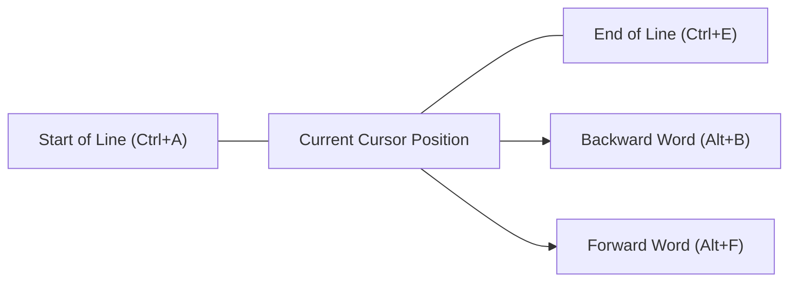
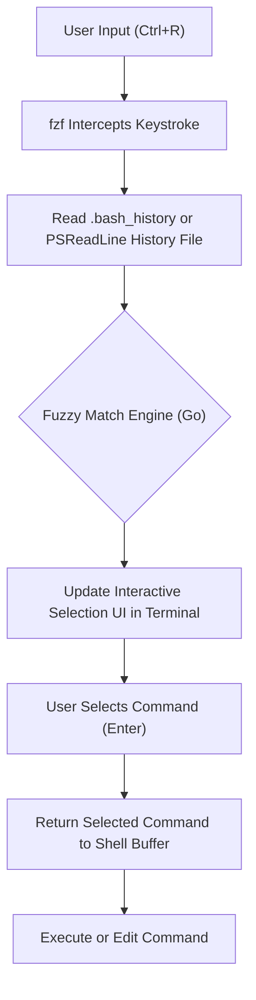

# はじめに：ターミナル操作の効率化がもたらす圧倒的な生産性向上

現代のソフトウェア開発において、ターミナル（コマンドラインインターフェース）は開発者の「手足」となる最重要ツールです。クラウドインフラの管理、コンテナのビルド、Gitによるバージョン管理、各種スクリプトの実行など、開発者の1日の大半はターミナル上で過ごすと言っても過言ではありません。

しかし、多くの開発者はターミナルの基本的なコマンド（`cd`, `ls`, `git`, `docker`など）は習熟しているものの、**「ターミナルへの入力そのものを最適化する」**という観点を見落としがちです。マウスに手を伸ばし、カーソルを移動させ、矢印キーを連打してコマンドのタイポを修正する……これらの小さなロスの積み重ねは、長期間にわたって莫大な時間の浪費と認知負荷をもたらします。

本記事では、「キーボードから手を離さない」という哲学のもと、BashおよびPowerShell環境におけるターミナル操作を極限まで効率化するためのショートカット、キーバインド設定、履歴検索の最適化、そしてターミナルマルチプレクサの活用方法について、非常に詳細かつ技術的に解説します。

---

# 1. 理論的背景：キーストロークレベルモデル（KLM）と時間的コストの定式化

効率化のメリットを定量的に理解するために、HCI（Human-Computer Interaction）の分野で用いられる**GOMSモデル**の一種である**キーストロークレベルモデル（Keystroke-Level Model, KLM）**を導入して考えてみましょう。

KLMは、熟練したユーザーが特定のエラーのないタスクを完了するのにかかる時間を予測するためのモデルです。タスクの実行時間 $T_{execute}$ は、以下の数学的方程式で定式化されます。

$$ T_{execute} = \sum_{i} \left( K \cdot t_{k} + P \cdot t_{p} + H \cdot t_{h} + M \cdot t_{m} + R \cdot t_{r} \right) $$

ここで、各変数は以下の意味を持ちます：
- $K$ : キーストローク（Keystroking）。キーボードのキーを1回押す動作。
- $P$ : ポインティング（Pointing）。マウスなどのポインティングデバイスでターゲットを指す動作。
- $H$ : ホーミング（Homing）。キーボードからマウスへ、またはその逆へ手を移動させる動作。
- $M$ : メンタル準備（Mental preparation）。次の物理的なアクションを計画・準備するための認知的な思考時間。
- $R$ : システム応答（System Response）。ユーザーが待たされる時間。

各動作の平均的な所要時間（$t$）は、一般的に以下のように見積もられます：
- $t_{k} \approx 0.2$ 秒 （熟練タイパーの場合）
- $t_{p} \approx 1.1$ 秒
- $t_{h} \approx 0.4$ 秒
- $t_{m} \approx 1.35$ 秒

ターミナル操作において矢印キーやマウスを使ってコマンドの一部を修正しようとすると、ホーミング（$H$）やポインティング（$P$）が発生し、1回の修正につき約1.5秒〜2.0秒のペナルティが生じます。一方、適切なターミナルショートカットを習得すれば、$H$ と $P$ を **ゼロ** に抑え、キーストローク（$K$）のみで目的を達成できます。

仮に1日に500回のコマンド入力・編集を行い、ショートカットの活用により1回あたり2秒短縮できたとします。
$$ 500 \text{回/日} \times 2 \text{秒} = 1000 \text{秒/日} \approx 16.6 \text{分/日} $$
これを年間（240営業日）で換算すると、**約66時間（約8営業日分）**もの時間を節約できる計算になります。さらに重要なのは、メンタル準備（$M$）が削減されることで、**「思考が中断されない（フロー状態を維持できる）」**という計り知れないメリットが得られる点です。

---

# 2. Bash Readline と Emacs キーバインドの深淵

LinuxやmacOSの標準シェルであるBashは、内部的に **GNU Readline** というライブラリを使用してコマンドラインの入力処理を行っています。このReadlineのデフォルト設定は **Emacsキーバインド** になっており、これをマスターすることがターミナル効率化の第一歩となります。

## 2.1. 移動系ショートカット

カーソルを1文字ずつ矢印キーで移動させるのは非効率の極みです。以下のショートカットを「マッスルメモリ（筋肉の記憶）」に刻み込みましょう。

- **`Ctrl + A`** : 行の先頭（Start of line）へ移動する。非常に多用します。
- **`Ctrl + E`** : 行の末尾（End of line）へ移動する。
- **`Alt + B`** (Meta+B) : 1単語戻る（Backward word）。スラッシュやスペースを区切りとして単語単位で高速に移動します。
- **`Alt + F`** (Meta+F) : 1単語進む（Forward word）。



## 2.2. 編集系ショートカット（キルとヤンク）

Emacs用語では、テキストを切り取る（カット）ことを「キル（Kill）」、貼り付ける（ペースト）ことを「ヤンク（Yank）」と呼びます。

- **`Ctrl + U`** : カーソル位置から行の先頭までをキル（削除）する。パスワード入力ミス時や、コマンドを最初から書き直したい場合に一瞬でクリアできます。
- **`Ctrl + K`** : カーソル位置から行の末尾までをキルする。
- **`Ctrl + W`** : カーソル位置から前の1単語をキルする。引数を一つ消して書き直す際に重宝します。
- **`Alt + D`** (Meta+D) : カーソル位置から後ろの1単語をキルする。
- **`Ctrl + Y`** : 最後にキルした内容をヤンク（貼り付け）する。`Ctrl+U` で消したコマンドを別のディレクトリに移動した後に `Ctrl+Y` で復活させる、といった高度な使い方が可能です。
- **`Ctrl + _`** (または `Ctrl + x, Ctrl + u`) : アンドゥ（元に戻す）。誤って消してしまった場合に復元できます。

## 2.3. その他の重要ショートカット

- **`Ctrl + L`** : 画面をクリアする（`clear` コマンドと同等）。
- **`Ctrl + C`** : 現在のコマンド入力をキャンセルする、または実行中のプロセスを中断する。
- **`Ctrl + D`** : EOF（End Of File）を送信する。文字が入力されていない状態ではシェルを終了（`exit`）します。

## 2.4. ~/.inputrc による Readline のカスタマイズ

これらのキーバインドは、ホームディレクトリの `~/.inputrc` ファイルを編集することでさらに最適化できます。例えば、以下のような設定を追加すると、入力中の文字列に前方一致する履歴だけを上下キーで検索できるようになります。

```bash
# ~/.inputrc の設定例
"\e[A": history-search-backward
"\e[B": history-search-forward
set completion-ignore-case on
set show-all-if-ambiguous on
```
これにより、`docker ` と入力した後に上矢印キーを押すと、過去の `docker` から始まるコマンド履歴だけを高速に辿ることができます。

---

# 3. PowerShell と PSReadLine：Windows環境でのBashライクな操作

Windowsにおける標準シェルである PowerShell は、初期のバージョンではコマンドプロンプト（cmd.exe）と同等の貧弱な入力環境しか持っていませんでした。しかし、**PSReadLine** モジュールの導入により、Bash（Readline）に匹敵する、あるいはそれを超える高度なコマンドライン編集機能を手に入れました。

## 3.1. PSReadLine の有効化と Emacs モード

PowerShell 5.1 以降（および PowerShell Core）には PSReadLine が標準で組み込まれています。Windows ユーザーがターミナルの生産性を Linux レベルに引き上げるためには、PSReadLine の編集モードをデフォルトの Windows（cmdライク）モードから **Emacsモード** に変更することが必須です。

PowerShell のプロファイル（`$PROFILE`）を編集して、設定を自動的に読み込ませましょう。

```powershell
# $PROFILE をVS Codeで開く
code $PROFILE
```

`$PROFILE` に以下の設定を追記します。

```powershell
# PSReadLineモジュールのインポート（明示的に行う場合）
Import-Module PSReadLine

# 編集モードをEmacsに設定し、Bashと同じショートカットを有効化
Set-PSReadLineOption -EditMode Emacs

# ベル音（エラー音）を無視する
Set-PSReadLineOption -BellStyle None
```

これで、WindowsのPowerShell上でも `Ctrl+A`（行頭）、`Ctrl+E`（行末）、`Ctrl+U`（行頭まで削除）、`Alt+B` / `Alt+F`（単語移動）といった Emacs/Bash スタイルのキーバインドが完全に動作するようになります。

## 3.2. Predictive IntelliSense と高度な履歴検索

PSReadLine の強力な機能の一つが、入力履歴や外部の予測プラグインに基づいた **Predictive IntelliSense（予測インテリセンス）** です。入力を始めると、過去の履歴から最も可能性の高いコマンド全体が薄いグレー（インライン）で提案されます。提案を受け入れる場合は右矢印キー（または `Alt+F` で単語単位）を押すだけです。

```powershell
# $PROFILE に追記：予測機能の有効化（PowerShell 7.1+ / PSReadLine 2.1+ が必要）
Set-PSReadLineOption -PredictionSource History
Set-PSReadLineOption -PredictionViewStyle InlineView
# リスト形式で表示したい場合は ListView を指定
# Set-PSReadLineOption -PredictionViewStyle ListView
```

## 3.3. 上下キーの振る舞いの上書き（Bashライクな前方一致検索）

PowerShell のデフォルトの上下矢印キーは、単なる履歴の順次移動です。これを、前述の `~/.inputrc` と同様に「現在入力されている文字列に前方一致する履歴を検索する」機能にマッピングし直します。

```powershell
# $PROFILE に追記：履歴の前方一致検索ハンドラを登録
Set-PSReadLineKeyHandler -Key UpArrow -Function HistorySearchBackward
Set-PSReadLineKeyHandler -Key DownArrow -Function HistorySearchForward
```

これにより、Windows環境であっても、Linux環境と全く同じ指の動きで直感的にコマンドを構築・検索・実行できるようになります。認知負荷（$M$）をプラットフォーム間で共通化することは、DevOpsエンジニアにとって極めて重要です。

---

# 4. 履歴検索の極致：fzf (Fuzzy Finder) の統合

ターミナルの操作において、最も頻繁に行うアクションの一つが**「過去に実行した複雑なコマンドを履歴から探し出して再実行する」**ことです。標準の `Ctrl+R`（リバースサーチ）は完全一致検索であるため、「たしか docker run でボリュームマウントして…」といった曖昧な記憶からコマンドを引き出すのは困難です。

この課題をエレガントに解決するのが、Go言語で書かれた超高速な汎用あいまい検索ツール **`fzf`** です。

## 4.1. fzf によるあいまい検索のパイプライン

`fzf` をコマンド履歴の検索に統合すると、以下のようなパイプラインで処理が行われます。



ユーザーが空白区切りで複数のキーワード（例: `docker ubuntu bash`）を入力すると、fzf のマッチングエンジンが履歴ファイル全体をスキャンし、それらのキーワードが順不同・離れた位置に含まれている履歴を瞬時にリストアップします。

## 4.2. Bash での fzf 統合

Ubuntu/Debian などの Linux 環境では、apt を使って簡単にインストールできます。さらに、インストールスクリプトを実行することで、Bash のキーバインドが自動的に上書きされます。

```bash
# fzf のインストール
git clone --depth 1 https://github.com/junegunn/fzf.git ~/.fzf
~/.fzf/install
```
これにより、`Ctrl+R` を押すと fzf のインタラクティブなUIが全画面（または tmux のペイン内）にポップアップし、極めて直感的に履歴を検索できるようになります。検索 UI 上では、`Ctrl+N` (下) / `Ctrl+P` (上) で項目を選択できます。

## 4.3. PowerShell での PSFzf 統合

Windows PowerShell 環境でも、`PSFzf` モジュールを使用することで全く同じ体験を得ることができます。まずは fzf のバイナリをインストール（Scoop 等が便利です）し、モジュールを導入します。

```powershell
# Scoop で fzf バイナリをインストール
scoop install fzf

# PSFzf モジュールのインストール
Install-Module -Name PSFzf -Scope CurrentUser
```

そして、`$PROFILE` に設定を追加してキーをバインドします。

```powershell
# $PROFILE に追記
Import-Module PSFzf

# Ctrl+R を fzf の履歴検索にマッピングする
Set-PsFzfOption -PSReadlineChordReverseHistorySearch 'Ctrl+r'
```
これで、Windows でも `Ctrl+R` で一瞬にして過去の膨大な PowerShell 履歴からファジー検索が可能になります。

---

# 5. エイリアスとラッパー関数による打鍵数の最小化

ショートカットと履歴検索に加えて、キーストローク（$K$）自体を削減する最も直接的な方法がエイリアス（Alias）とラッパー関数の定義です。

## 5.1. Git 操作の極小化

Git は毎日数え切れないほど使用します。`git status` や `git commit` を毎回フルスペルで打つのは KLM モデルにおいて大きな無駄です。

**Bash の例 (`~/.bashrc`)**:
```bash
alias g='git'
alias gs='git status -sb'
alias ga='git add'
alias gc='git commit -m'
alias gco='git checkout'
alias gp='git push'
alias gl='git log --oneline --graph --decorate --all'
```

**PowerShell の例 (`$PROFILE`)**:
```powershell
Set-Alias -Name g -Value git
function gs { git status -sb $args }
function ga { git add $args }
function gc { git commit -m $args }
function gco { git checkout $args }
function gl { git log --oneline --graph --decorate --all $args }
```
※ PowerShellの `Set-Alias` は引数を固定できないため、オプションを伴うエイリアスは上記のように関数（function）として定義するのがベストプラクティスです。

## 5.2. ディレクトリ移動の最適化（z / zoxide）

`cd` コマンドで深い階層のディレクトリに移動するのは面倒です。近年では、ユーザーの移動履歴と頻度（Frecency: Frequency + Recency）を学習し、パスの一部を入力するだけで目的のディレクトリにジャンプできるツール **`zoxide`** (Rust製) が標準になりつつあります。

```bash
# zoxide のインストール後、cd の代わりに z を使用
z proj # /home/user/workspace/projects/ に一瞬で移動
```
zoxide は Bash, Zsh, PowerShell のすべてに対応しており、クロスプラットフォームで同様の高速なディレクトリ移動を実現します。

---

# 6. ターミナルマルチプレクサとペイン管理

1つのターミナルウィンドウで1つのプロセス（例えばローカルサーバー）を起動してしまうと、別の作業をするために新しいターミナルウィンドウを開き直さなければなりません。ウィンドウの切り替え（`Alt+Tab`）は視線の移動を伴い、コンテキストスイッチのコスト（メンタル準備 $M$ の増加）を招きます。

これを解決するのが、画面を複数のペインに分割し、複数のセッションをバックグラウンドで維持できる**ターミナルマルチプレクサ**です。

## 6.1. tmux のアーキテクチャと状態遷移 (Linux / macOS)

`tmux` は、サーバー・クライアント型のアーキテクチャを持つ強力なマルチプレクサです。tmux の操作は、ショートカットが他のプログラムと衝突しないように、必ず **プレフィックスキー（デフォルトは Ctrl+B）** を先押しする仕組みになっています。

以下の Mermaid 状態遷移図は、tmux の基本的な操作フローを表しています。

```mermaid
stateDiagram-v2
    [*] --> Normal["Normal Mode"]
    Normal --> Prefix["Prefix Mode (Ctrl+B)"]
    Prefix --> Command["Command Prompt (:)"]
    Prefix --> SplitV["Split Pane Vertically (%)"]
    Prefix --> SplitH["Split Pane Horizontally (\")"]
    Prefix --> Switch["Switch Window (n/p/0-9)"]
    Prefix --> Detach["Detach Session (d)"]
    
    Command --> Normal["Execute tmux Command"]
    SplitV --> Normal["Return to Normal Mode"]
    SplitH --> Normal["Return to Normal Mode"]
    Switch --> Normal["Return to Normal Mode"]
    Detach --> [*]
```

`~/.tmux.conf` を編集することで、プレフィックスキーを押しやすい `Ctrl+A`（GNU Screen風）に変更したり、ペイン移動を Vim 風の `hjkl` にバインドすることが定石です。

```text
# ~/.tmux.conf の例
# プレフィックスを Ctrl-a に変更
set -g prefix C-a
unbind C-b
bind C-a send-prefix

# ペイン分割を直感的なキーに
bind | split-window -h
bind - split-window -v

# Vimライクなペイン移動
bind h select-pane -L
bind j select-pane -D
bind k select-pane -U
bind l select-pane -R
```

## 6.2. Windows Terminal のペイン管理

Windows 環境では、最新の **Windows Terminal** が標準でペイン分割機能をサポートしています。tmux のようなセッション永続化機能はありませんが、GUIベースで簡単にペインを管理できます。設定（`settings.json`）を開き、アクションをカスタマイズすることでキーボードだけで完結する操作が可能です。

```json
// Windows Terminal settings.json の一部
"actions": [
    { "command": { "action": "splitPane", "split": "auto" }, "keys": "alt+shift+d" },
    { "command": { "action": "moveFocus", "direction": "left" }, "keys": "alt+left" },
    { "command": { "action": "moveFocus", "direction": "right" }, "keys": "alt+right" }
]
```
これにより、PowerShell 内で `Alt+Shift+D` を押すだけで画面が分割され、矢印キーと `Alt` の組み合わせでペイン間をシームレスに移動できるようになります。

---

# 7. 実践的なワークフローの構築例

ここまで紹介した要素（Emacsキーバインド、PSReadLine、fzf、エイリアス、マルチプレクサ）を組み合わせることで、日常のタスクは劇的に高速化されます。

例えば、「障害対応時にサーバーのログを確認し、同時にGitで該当コードのコミット履歴を調べる」というタスクを想定しましょう。

1. ターミナルを開き、`z prod` と打って瞬時にプロダクション環境の操作用ディレクトリへ移動。
2. `Ctrl+R` を押し、`fzf` のポップアップで `ssh auth` と打って過去の複雑な SSH ログインコマンドを呼び出し実行。
3. `Ctrl+B` `|` (tmux のペイン分割) を行い、右側のペインで `gs` (git status) などを実行してコードを調査。
4. 左ペインのログ出力でエラーを見つけたら、`Ctrl+B` `[` でコピーモードに入り、キーボードだけでエラーメッセージをヤンク。
5. エディタに貼り付けて原因を特定。

この一連の動作において、**一度もマウスに触れることはありません**。KLMの方程式における $H$ (Homing) と $P$ (Pointing) が完全に排除され、思考のスピードにターミナルの操作が完全に追従するようになります。

---

# まとめ

本記事では、開発者の生産性を決定づける「ターミナル操作の効率化」について、KLM理論から具体的な Bash/PowerShell のキーバインド、そして fzf や tmux の統合に至るまで、極めて詳細に解説しました。

最初は `Ctrl+A` や `Ctrl+E` を意識して打つことにストレスを感じるかもしれません。しかし、数週間意識的に使い続けることで、これらのショートカットは確実に**マッスルメモリ（筋肉の記憶）**へと定着します。一度定着してしまえば、無意識のうちにターミナルを自由自在に操ることができるようになり、生涯にわたってあなたの開発体験（Developer Experience, DX）を飛躍的に向上させる財産となるでしょう。

今日からぜひ、`$PROFILE` や `~/.bashrc` を開き、自身の手に最も馴染む究極のターミナル環境を構築し始めてみてください。
