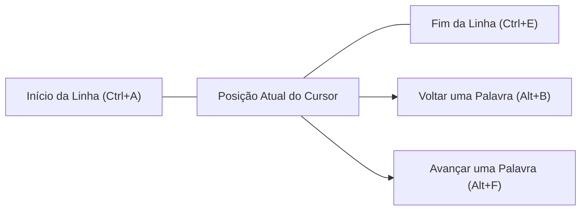
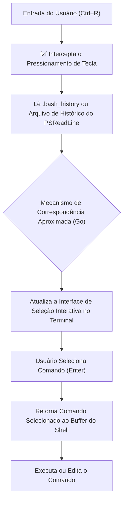

# Introdução: O ganho extraordinário de produtividade através da eficiência no terminal

No desenvolvimento de software moderno, o terminal (interface de linha de comando) é a ferramenta mais importante, atuando como as "mãos e pés" do desenvolvedor. Gerenciamento de infraestrutura em nuvem, construção de contêineres, controle de versão com Git, execução de vários scripts e muito mais – não é exagero dizer que os desenvolvedores passam a maior parte do dia no terminal.

No entanto, embora muitos desenvolvedores sejam proficientes nos comandos básicos do terminal (`cd`, `ls`, `git`, `docker`, etc.), eles frequentemente ignoram a perspectiva de **"otimizar a própria entrada de dados no terminal"**. Alcançar o mouse, mover o cursor e apertar repetidamente as teclas de seta para corrigir um erro de digitação no comando... O acúmulo dessas pequenas perdas resulta em um enorme desperdício de tempo e carga cognitiva ao longo do tempo.

Neste artigo, sob a filosofia de "nunca tirar as mãos do teclado", explicarei de forma detalhada e técnica os atalhos, configurações de mapeamento de teclas (keybindings), otimização da pesquisa de histórico e o uso de multiplexadores de terminal para maximizar a eficiência das operações de terminal em ambientes Bash e PowerShell.

---

# 1. Fundamentos Teóricos: Keystroke-Level Model (KLM) e Formulação do Custo de Tempo

Para entender quantitativamente os benefícios da eficiência, vamos introduzir e considerar o **Keystroke-Level Model (KLM)**, que é um tipo de **modelo GOMS** usado na área de Interação Humano-Computador (HCI - Human-Computer Interaction).

O KLM é um modelo para prever o tempo necessário para um usuário experiente concluir uma tarefa específica sem erros. O tempo de execução da tarefa $T_{execute}$ é formulado pela seguinte equação matemática:

$$ T_{execute} = \sum_{i} \left( K \cdot t_{k} + P \cdot t_{p} + H \cdot t_{h} + M \cdot t_{m} + R \cdot t_{r} \right) $$

Aqui, cada variável tem o seguinte significado:
- $K$ : Keystroking (Teclar). O ato de pressionar uma tecla no teclado uma vez.
- $P$ : Pointing (Apontar). O ato de apontar para um alvo com um dispositivo apontador como um mouse.
- $H$ : Homing (Posicionar as mãos). O ato de mover as mãos do teclado para o mouse, ou vice-versa.
- $M$ : Mental preparation (Preparação mental). O tempo de pensamento cognitivo para planejar e preparar a próxima ação física.
- $R$ : System Response (Resposta do sistema). O tempo que o sistema faz o usuário esperar.

O tempo médio necessário para cada ação ($t$) é geralmente estimado da seguinte forma:
- $t_{k} \approx 0.2$ segundos (Para um digitador experiente)
- $t_{p} \approx 1.1$ segundos
- $t_{h} \approx 0.4$ segundos
- $t_{m} \approx 1.35$ segundos

Em operações de terminal, tentar corrigir parte de um comando usando teclas de seta ou o mouse introduz um reposicionamento ($H$) e apontamento ($P$), resultando em uma penalidade de aproximadamente 1,5 a 2,0 segundos por correção. Por outro lado, se você dominar os atalhos de terminal apropriados, você pode manter $H$ e $P$ em **zero** e alcançar seu objetivo usando apenas toques no teclado ($K$).

Suponha que você insira e edite comandos 500 vezes por dia, e o uso de atalhos possa economizar 2 segundos por vez.
$$ 500 \text{ vezes/dia} \times 2 \text{ segundos} = 1000 \text{ segundos/dia} \approx 16.6 \text{ minutos/dia} $$
Convertendo isso para uma base anual (240 dias úteis), isso significa que você pode economizar **cerca de 66 horas (aproximadamente 8 dias úteis)** de tempo. Mais importante ainda, a redução da preparação mental ($M$) traz um benefício incomensurável: **"o pensamento não é interrompido (você pode manter um estado de fluxo)"**.

---

# 2. As Profundezas do Bash Readline e Atalhos do Emacs

O Bash, que é o shell padrão para Linux e macOS, usa internamente uma biblioteca chamada **GNU Readline** para lidar com a entrada na linha de comando. A configuração padrão do Readline usa as **combinações de teclas do Emacs** (keybindings), e dominá-las é o primeiro passo para a eficiência no terminal.

## 2.1. Atalhos de Navegação

Mover o cursor um caractere de cada vez usando as teclas de seta é o ápice da ineficiência. Grave os atalhos abaixo na sua "memória muscular".

- **`Ctrl + A`** : Move para o início da linha (Start of line). Usado com muita frequência.
- **`Ctrl + E`** : Move para o fim da linha (End of line).
- **`Alt + B`** (Meta+B) : Volta uma palavra (Backward word). Move-se rapidamente por palavras usando barras ou espaços como delimitadores.
- **`Alt + F`** (Meta+F) : Avança uma palavra (Forward word).



## 2.2. Atalhos de Edição (Kill e Yank)

Na terminologia do Emacs, cortar texto é chamado de "Kill" (Matar) e colar é chamado de "Yank" (Puxar).

- **`Ctrl + U`** : "Kill" (exclui) da posição do cursor até o início da linha. Muito útil quando você erra a senha ou quer limpar a linha para reescrever o comando desde o início em um instante.
- **`Ctrl + K`** : "Kill" da posição do cursor até o fim da linha.
- **`Ctrl + W`** : "Kill" da posição do cursor até a palavra anterior. Útil ao excluir um argumento para reescrevê-lo.
- **`Alt + D`** (Meta+D) : "Kill" da posição do cursor para a palavra seguinte.
- **`Ctrl + Y`** : "Yank" (cola) o conteúdo recém-excluído pelo último "Kill". Você pode usar isso de maneiras avançadas, como excluir um comando com `Ctrl+U`, mover para outro diretório e, em seguida, restaurá-lo com `Ctrl+Y`.
- **`Ctrl + _`** (ou `Ctrl + x, Ctrl + u`) : Desfazer (Undo). Se você apagou algo acidentalmente, pode restaurá-lo.

## 2.3. Outros Atalhos Importantes

- **`Ctrl + L`** : Limpa a tela (equivalente ao comando `clear`).
- **`Ctrl + C`** : Cancela a entrada do comando atual ou interrompe o processo em execução.
- **`Ctrl + D`** : Envia um EOF (End Of File). Se nenhum caractere estiver na linha, encerra o shell (`exit`).

## 2.4. Personalizando o Readline via ~/.inputrc

Esses mapeamentos de teclas podem ser otimizados ainda mais editando o arquivo `~/.inputrc` em seu diretório home. Por exemplo, ao adicionar as configurações a seguir, você poderá pesquisar pelo histórico anterior correspondente à string atual, usando apenas as setas para cima e para baixo.

```bash
# Exemplo de configuração do ~/.inputrc
"\e[A": history-search-backward
"\e[B": history-search-forward
set completion-ignore-case on
set show-all-if-ambiguous on
```
Dessa forma, depois de digitar `docker ` e pressionar a seta para cima, você pode percorrer rapidamente apenas o histórico de comandos que começam com `docker`.

---

# 3. PowerShell e PSReadLine: Operações ao estilo Bash no Windows

Nas versões iniciais, o PowerShell, shell padrão do Windows, possuía um ambiente de entrada tão limitado quanto o prompt de comando (cmd.exe). Contudo, com a introdução do módulo **PSReadLine**, ele ganhou recursos avançados de edição de linha de comando que rivalizam ou até superam o Bash (Readline).

## 3.1. Habilitando PSReadLine e o Modo Emacs

O PowerShell 5.1 e versões posteriores (bem como o PowerShell Core) trazem o PSReadLine por padrão. Para que usuários de Windows alcancem a produtividade de terminal no nível do Linux, é essencial alterar o modo de edição do PSReadLine do padrão do Windows (estilo cmd) para o **Modo Emacs**.

Edite o perfil do PowerShell (`$PROFILE`) para carregar essas configurações automaticamente.

```powershell
# Abra o $PROFILE no VS Code
code $PROFILE
```

Adicione as seguintes linhas ao `$PROFILE`.

```powershell
# Importa o módulo PSReadLine (se feito explicitamente)
Import-Module PSReadLine

# Define o modo de edição como Emacs e ativa os atalhos do Bash
Set-PSReadLineOption -EditMode Emacs

# Ignora o som de campainha (som de erro)
Set-PSReadLineOption -BellStyle None
```

Assim, combinações de teclas ao estilo Emacs/Bash como `Ctrl+A` (início da linha), `Ctrl+E` (fim da linha), `Ctrl+U` (apagar até o início da linha) e `Alt+B` / `Alt+F` (navegação por palavras) funcionarão perfeitamente no PowerShell do Windows.

## 3.2. Predictive IntelliSense e Pesquisa Avançada de Histórico

Uma das funcionalidades mais fortes do PSReadLine é o **Predictive IntelliSense (IntelliSense Preditivo)**, baseado no histórico de digitação e plugins de previsão externos. Conforme você digita, o comando mais provável a partir do seu histórico é sugerido em cinza claro (inline). Para aceitar a sugestão, basta pressionar a seta para a direita (ou `Alt+F` para aceitar palavra por palavra).

```powershell
# Adicionar ao $PROFILE: Habilitar o recurso de previsão (requer PowerShell 7.1+ / PSReadLine 2.1+)
Set-PSReadLineOption -PredictionSource History
Set-PSReadLineOption -PredictionViewStyle InlineView
# Especifique ListView se preferir visualizar no formato de lista
# Set-PSReadLineOption -PredictionViewStyle ListView
```

## 3.3. Sobrescrevendo o Comportamento das Teclas para Cima/para Baixo (Pesquisa com Correspondência de Prefixo ao estilo Bash)

Por padrão, as setas para cima/baixo do PowerShell simplesmente navegam em ordem pelo histórico. Mapearemos isso, similar ao `~/.inputrc` citado antes, para "pesquisar os históricos que correspondam ao prefixo que está sendo digitado".

```powershell
# Adicionar ao $PROFILE: Registrar tratador de pesquisa de histórico por prefixo
Set-PSReadLineKeyHandler -Key UpArrow -Function HistorySearchBackward
Set-PSReadLineKeyHandler -Key DownArrow -Function HistorySearchForward
```

Assim, mesmo no ambiente Windows, você pode construir, procurar e executar comandos da mesma maneira intuitiva de um ambiente Linux. A uniformização dessa carga cognitiva ($M$) entre plataformas é crucial para engenheiros de DevOps.

---

# 4. O Ápice da Pesquisa de Histórico: Integração com fzf (Fuzzy Finder)

Uma das ações mais repetitivas no terminal é **"pesquisar no histórico por um comando complexo já executado e executá-lo novamente"**. O `Ctrl+R` padrão (pesquisa reversa) usa correspondência exata, dificultando a busca quando só lembramos vagamente de trechos como "Acho que tinha um docker run para montar um volume...".

Isso é resolvido brilhantemente pela ferramenta ultrarrápida de busca aproximada (fuzzy search), **`fzf`**, desenvolvida em Go.

## 4.1. O Pipeline de Busca Aproximada com fzf

Ao integrar o `fzf` na pesquisa do histórico de comandos, o seguinte fluxo ocorre:



Se o usuário digitar várias palavras isoladas (ex: `docker ubuntu bash`), o `fzf` escaneia o histórico completo num instante, listando os comandos que contêm as palavras, independentemente de sua ordem ou da distância entre elas.

## 4.2. Integração do fzf no Bash

Em distribuições Linux como Ubuntu/Debian, é possível instalar com facilidade usando apt. Depois, rodando seu script de instalação, os atalhos de teclado do Bash são reescritos automaticamente.

```bash
# Instalação do fzf
git clone --depth 1 https://github.com/junegunn/fzf.git ~/.fzf
~/.fzf/install
```
Ao pressionar `Ctrl+R`, a interface de busca do fzf se abre (na tela toda ou num painel do tmux), oferecendo uma pesquisa altamente interativa do seu histórico. Use `Ctrl+N` (baixo) e `Ctrl+P` (cima) para selecionar.

## 4.3. Integração do PSFzf no PowerShell

No Windows PowerShell, usando o módulo `PSFzf`, temos a mesma experiência. Instale o binário do fzf (com o Scoop, por exemplo) e depois o módulo correspondente.

```powershell
# Instale o fzf binário com o Scoop
scoop install fzf

# Instale o módulo PSFzf
Install-Module -Name PSFzf -Scope CurrentUser
```

Por fim, edite o `$PROFILE` para aplicar o atalho de teclado:

```powershell
# Adicionar ao $PROFILE
Import-Module PSFzf

# Mapeia Ctrl+R para a pesquisa de histórico do fzf
Set-PsFzfOption -PSReadlineChordReverseHistorySearch 'Ctrl+r'
```
Dessa forma, os usuários do Windows também podem fazer buscas aproximadas quase instantaneamente num extenso histórico do PowerShell ao teclar `Ctrl+R`.

---

# 5. Minimizando Pressionamentos de Teclas com Aliases e Funções Wrapper

Além de atalhos e busca de histórico, reduzir a própria quantidade de toques no teclado ($K$) pode ser alcançado declarando Aliases e funções wrapper.

## 5.1. Minimizando as Operações do Git

Utilizamos o Git a todo momento. Digitar `git status` ou `git commit` várias vezes ao longo do dia custa bastante caro na equação do KLM.

**Exemplo no Bash (`~/.bashrc`)**:
```bash
alias g='git'
alias gs='git status -sb'
alias ga='git add'
alias gc='git commit -m'
alias gco='git checkout'
alias gp='git push'
alias gl='git log --oneline --graph --decorate --all'
```

**Exemplo no PowerShell (`$PROFILE`)**:
```powershell
Set-Alias -Name g -Value git
function gs { git status -sb $args }
function ga { git add $args }
function gc { git commit -m $args }
function gco { git checkout $args }
function gl { git log --oneline --graph --decorate --all $args }
```
※ Como o `Set-Alias` do PowerShell não suporta passar opções no alias, a melhor forma é encapsular os comandos dentro de funções (functions), como mostrado acima.

## 5.2. Otimizando a Navegação de Diretórios (z / zoxide)

Navegar em pastas muito profundas com `cd` toma muito tempo. Uma ferramenta essencial hoje é o **`zoxide`** (escrito em Rust). Ele rastreia a sua frequência e recência (Frecency) de uso e possibilita saltos instantâneos para um diretório digitando apenas parte do seu nome.

```bash
# Depois de instalar o zoxide, use z no lugar de cd
z proj # Salto instantâneo para /home/user/workspace/projects/
```
O zoxide é compatível com Bash, Zsh e PowerShell, propiciando navegação ultrarrápida universal entre sistemas operacionais.

---

# 6. Multiplexadores de Terminal e Gerenciamento de Painéis

Quando iniciamos um processo prolongado (como um servidor web) no terminal, para trabalharmos em algo paralelo, geralmente precisamos de outra janela. Fazer isso e alternar as janelas (`Alt+Tab`) exige movimentos visuais bruscos e incorre no aumento de custos para as mudanças de contexto (tempo extra em preparação mental, $M$).

Resolvemos esse dilema fragmentando a visualização em diversos painéis e segurando várias sessões ocultas por meio de um **multiplexador de terminal**.

## 6.1. Arquitetura do tmux e Transições de Estado (Linux / macOS)

`tmux` é o melhor e mais poderoso multiplexador devido à sua arquitetura cliente-servidor. Suas operações obrigam o aperto da **tecla de prefixo (padrão Ctrl+B)** antes das ações, de forma a impedir que elas conflitem com os de outros softwares.

O diagrama de estado (Mermaid) abaixo clarifica as operações mais usuais do tmux.

```mermaid
stateDiagram-v2
    [*] --> Normal["Modo Normal"]
    Normal --> Prefix["Modo Prefixo (Ctrl+B)"]
    Prefix --> Command["Prompt de Comando (:)"]
    Prefix --> SplitV["Dividir Painel Verticalmente (%)"]
    Prefix --> SplitH["Dividir Painel Horizontalmente (\")"]
    Prefix --> Switch["Trocar de Janela (n/p/0-9)"]
    Prefix --> Detach["Desanexar Sessão (d)"]
    
    Command --> Normal["Executar Comando tmux"]
    SplitV --> Normal["Retornar ao Modo Normal"]
    SplitH --> Normal["Retornar ao Modo Normal"]
    Switch --> Normal["Retornar ao Modo Normal"]
    Detach --> [*]
```

Um de seus usos mais clássicos requer adicionar atalhos melhores no `~/.tmux.conf` para mudar a tecla de prefixo para um alcançável `Ctrl+A` (lembrando o GNU Screen) ou parear a navegação de painéis com `hjkl` como no Vim.

```text
# Exemplo de ~/.tmux.conf
# Alterar o prefixo para Ctrl-a
set -g prefix C-a
unbind C-b
bind C-a send-prefix

# Divisão dos painéis intuitiva
bind | split-window -h
bind - split-window -v

# Movimento pelo painel ao estilo Vim
bind h select-pane -L
bind j select-pane -D
bind k select-pane -U
bind l select-pane -R
```

## 6.2. Gerenciamento de Painéis no Windows Terminal

Usuários do ecossistema Windows que se baseiam no recente **Windows Terminal** também aproveitam da quebra por painéis já pré-definida. Sem a característica persistente do tmux, é apenas uma opção por uma excelente GUI flexível. Editando em `settings.json`, toda essa movimentação pelo uso de atalhos não precisará de cliques de mouse.

```json
// Parte das configurações do Windows Terminal (settings.json)
"actions": [
    { "command": { "action": "splitPane", "split": "auto" }, "keys": "alt+shift+d" },
    { "command": { "action": "moveFocus", "direction": "left" }, "keys": "alt+left" },
    { "command": { "action": "moveFocus", "direction": "right" }, "keys": "alt+right" }
]
```
Pressione `Alt+Shift+D` para subdividir as sessões do PowerShell ativas, bem como setas combinadas com o `Alt` a fim de focar sobre diferentes pontos no ambiente de modo transparente.

---

# 7. Exemplo Prático de Fluxo de Trabalho

Juntando as pontas dos elementos aqui propostos (Emacs, PSReadLine, fzf, Aliases e tmux), ganhamos propulsão estratosférica na resolução das interações simples da nossa rotina.

Suponhamos investigar uma falha a partir do output dos logs nos servidores de produção e em paralelo olhar as contribuições feitas sobre aquela seção do código através de um checkout pelo Git.

1. Do terminal recém aberto, emita `z prod` – pule de onde você estiver para a pasta pertinente nos sistemas de produção.
2. Acione `Ctrl+R`, visualizando o layout do `fzf` para bater nas suas teclas a abreviação `ssh auth`, conseguindo carregar sua grande cadeia do seu logon passado no SSH.
3. Insira `Ctrl+B` seguido por `|` para quebrar as sessões horizontalmente no tmux, batendo `gs` (git status) com vista à análise de código na visão à direita.
4. Identificada sua falha exibida no layout visual ao lado, adentre sobre `Ctrl+B` e de imediato o botão `[`, ativando o modelo para replicação ao transferir (yank) o conteúdo restritivo de seu erro pela marcação de chaves.
5. Jogue isso de volta num IDE de edição para caçar o ponto da instabilidade.

Uma vez internalizado esse encadeamento de atalhos, em momento algum usamos as nossas mãos sobre o **mouse de interações**. Toda a formulação e atrasos relacionados aos vetores posicionais para focar sobre a interface de um clique como em H (Homing) e P (Pointing) da teoria do KLM sumiram da equação; com isso os retornos se sincronizam perfeitamente com a mesma velocidade em que concebemos em nossos pensamentos os resultados esperados.

---

# Conclusão

Neste artigo mergulhamos nas "eficiências de terminal" – aquelas que podem influenciar fortemente todo o andamento das dinâmicas do desenvolvimento, demonstrado de acordo com a premissa quantitativa de interações fundamentada nas métricas teóricas contidas em KLM, bem como engajando suas ligações nos Bash e PowerShell pelos vínculos unificados por teclas associados com uma adoção estruturada como no fzf e tmux.

Não se surpreenda ao se sentir atrasado quando pensar onde bater para um `Ctrl+A` ou o final da linha em `Ctrl+E`. Mesmo assim, ao se deparar depois de certas semanas tentando reproduzir os usos e aplicá-los com consciência aos seus fluxos de ação rotineiros, eles entrarão com toda a certeza na absorção cognitiva de sua **memória muscular**. Ao gravá-los instintivamente, o ganho de controle será invisível mas perene – elevando o ápice da sua experiência vivenciada de engenharia criativa baseada no seu percurso profissional (Developer Experience - DX).

Por isso, faça com que seu percurso abra a rotina iniciando nas linhas descritas em `$PROFILE` ou em `~/.bashrc`. Modele essas experiências baseadas na fluência operacional natural voltadas perfeitamente em concordância do toque com os movimentos precisos em suas mãos para otimização suprema nas sessões contínuas ao seu modelo mais focado no dia de trabalho.
