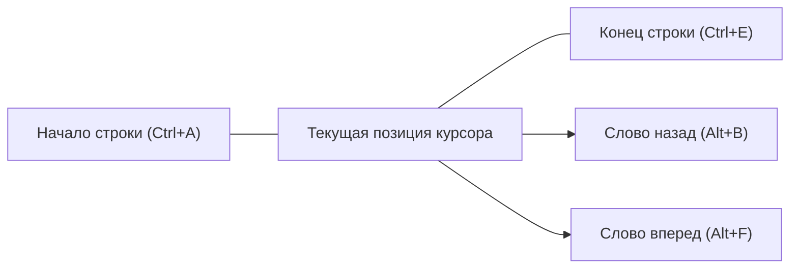
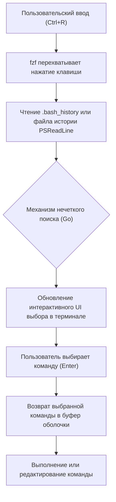

# Введение: Повышение производительности за счет оптимизации работы в терминале

В современной разработке программного обеспечения терминал (интерфейс командной строки) является важнейшим инструментом, служащим «руками и ногами» разработчика. Управление облачной инфраструктурой, сборка контейнеров, управление версиями с помощью Git, выполнение различных скриптов — не будет преувеличением сказать, что разработчики проводят большую часть своего дня в терминале.

Однако многие разработчики, хотя и хорошо знакомы с базовыми командами терминала (`cd`, `ls`, `git`, `docker` и т. д.), часто упускают из виду важность **«оптимизации самого процесса ввода в терминале»**. Тянуться к мыши, перемещать курсор, многократно нажимать клавиши со стрелками, чтобы исправить опечатку в команде... Накопление этих небольших потерь с течением времени приводит к огромной трате времени и когнитивной нагрузке.

В этой статье, руководствуясь философией «никогда не убирайте руки с клавиатуры», мы подробно и с технической точки зрения рассмотрим шорткаты, настройки привязки клавиш (keybindings), оптимизацию поиска по истории и использование терминальных мультиплексоров для максимального повышения эффективности работы в средах Bash и PowerShell.

---

# 1. Теоретические основы: Модель уровня нажатия клавиш (KLM) и формула временных затрат

Чтобы количественно оценить преимущества оптимизации, давайте применим **Модель уровня нажатия клавиш (Keystroke-Level Model, KLM)**, разновидность **модели GOMS**, используемую в области HCI (Human-Computer Interaction - Взаимодействие человека и компьютера).

KLM — это модель для прогнозирования времени, которое потребуется опытному пользователю для выполнения определенной задачи без ошибок. Время выполнения задачи $T_{execute}$ формулируется следующим математическим уравнением:

$$ T_{execute} = \sum_{i} \left( K \cdot t_{k} + P \cdot t_{p} + H \cdot t_{h} + M \cdot t_{m} + R \cdot t_{r} \right) $$

Здесь каждая переменная имеет следующее значение:
- $K$ : Нажатие клавиши (Keystroking). Действие однократного нажатия клавиши на клавиатуре.
- $P$ : Указание (Pointing). Действие указания на цель с помощью мыши или другого указывающего устройства.
- $H$ : Возврат (Homing). Действие перемещения руки с клавиатуры на мышь или наоборот.
- $M$ : Ментальная подготовка (Mental preparation). Когнитивное время на размышление, планирование и подготовку к следующему физическому действию.
- $R$ : Ответ системы (System Response). Время ожидания пользователем ответа системы.

Среднее требуемое время ($t$) для каждого действия обычно оценивается следующим образом:
- $t_{k} \approx 0.2$ секунды (для опытной машинистки)
- $t_{p} \approx 1.1$ секунды
- $t_{h} \approx 0.4$ секунды
- $t_{m} \approx 1.35$ секунды

Когда вы пытаетесь исправить часть команды в терминале с помощью клавиш со стрелками или мыши, происходит возврат ($H$) и указание ($P$), что приводит к штрафу примерно в 1.5–2.0 секунды за каждое исправление. С другой стороны, если вы освоите соответствующие шорткаты терминала, вы сможете свести $H$ и $P$ к **нулю** и достичь своей цели только с помощью нажатий клавиш ($K$).

Предположим, вы вводите и редактируете команды 500 раз в день, и благодаря шорткатам вы экономите 2 секунды на каждом действии.
$$ 500 \text{ раз/день} \times 2 \text{ секунды} = 1000 \text{ секунд/день} \approx 16.6 \text{ минут/день} $$
Если пересчитать это на год (240 рабочих дней), получится **около 66 часов (примерно 8 рабочих дней)** сэкономленного времени. Еще важнее то, что за счет сокращения ментальной подготовки ($M$) вы получаете неизмеримое преимущество в виде **«непрерывного потока мыслей (сохранения состояния потока)»**.

---

# 2. Глубины Bash Readline и привязки клавиш Emacs

Bash, стандартная оболочка для Linux и macOS, использует внутреннюю библиотеку **GNU Readline** для обработки ввода в командной строке. Настройкой по умолчанию для Readline является **Emacs keybindings (привязки клавиш Emacs)**, и овладение ими — это первый шаг к повышению эффективности работы в терминале.

## 2.1. Шорткаты навигации

Перемещение курсора на один символ за раз с помощью клавиш со стрелками крайне неэффективно. Вбейте следующие шорткаты в свою «мышечную память».

- **`Ctrl + A`** : Перемещение в начало строки (Start of line). Используется очень часто.
- **`Ctrl + E`** : Перемещение в конец строки (End of line).
- **`Alt + B`** (Meta+B) : Возврат на одно слово назад (Backward word). Быстрое перемещение по словам, используя слеши и пробелы в качестве разделителей.
- **`Alt + F`** (Meta+F) : Перемещение на одно слово вперед (Forward word).



## 2.2. Шорткаты редактирования (Kill и Yank)

В терминологии Emacs вырезание (cut) текста называется "Kill", а вставка (paste) - "Yank".

- **`Ctrl + U`** : Kill (удаление) от позиции курсора до начала строки. Позволяет мгновенно очистить строку при ошибке ввода пароля или если вы хотите переписать команду с самого начала.
- **`Ctrl + K`** : Kill от позиции курсора до конца строки.
- **`Ctrl + W`** : Kill одного слова перед курсором. Очень удобно, когда нужно удалить один аргумент и переписать его.
- **`Alt + D`** (Meta+D) : Kill одного слова после курсора.
- **`Ctrl + Y`** : Yank (вставка) последнего удаленного (kill) содержимого. Позволяет делать сложные вещи, например, удалить команду с помощью `Ctrl+U`, перейти в другую директорию и восстановить ее с помощью `Ctrl+Y`.
- **`Ctrl + _`** (или `Ctrl + x, Ctrl + u`) : Отмена (Undo). Позволяет восстановить случайно удаленный текст.

## 2.3. Другие важные шорткаты

- **`Ctrl + L`** : Очистка экрана (эквивалентно команде `clear`).
- **`Ctrl + C`** : Отмена текущего ввода команды или прерывание запущенного процесса.
- **`Ctrl + D`** : Отправка EOF (End Of File). Закрывает оболочку (`exit`), если не введено никаких символов.

## 2.4. Настройка Readline через ~/.inputrc

Эти привязки клавиш можно дополнительно оптимизировать, отредактировав файл `~/.inputrc` в вашем домашнем каталоге. Например, добавив следующие настройки, вы сможете использовать клавиши вверх и вниз для поиска по истории только тех команд, которые совпадают с уже введенной строкой.

```bash
# Пример настройки ~/.inputrc
"\e[A": history-search-backward
"\e[B": history-search-forward
set completion-ignore-case on
set show-all-if-ambiguous on
```
Благодаря этому, если вы введете `docker ` и нажмете стрелку вверх, вы сможете быстро перемещаться только по истории команд, начинающихся с `docker`.

---

# 3. PowerShell и PSReadLine: Работа в стиле Bash в среде Windows

PowerShell, стандартная оболочка в Windows, в своих ранних версиях имела такую же бедную среду ввода, как и командная строка (cmd.exe). Однако с появлением модуля **PSReadLine**, он приобрел расширенные возможности редактирования командной строки, сравнимые или даже превосходящие Bash (Readline).

## 3.1. Включение PSReadLine и режим Emacs

PSReadLine встроен в PowerShell 5.1 и более поздние версии (и PowerShell Core). Чтобы пользователи Windows могли повысить производительность терминала до уровня Linux, обязательно нужно изменить режим редактирования PSReadLine с режима Windows по умолчанию (похожего на cmd) на **режим Emacs**.

Отредактируйте профиль PowerShell (`$PROFILE`), чтобы настройки загружались автоматически.

```powershell
# Откройте $PROFILE в VS Code
code $PROFILE
```

Добавьте следующие настройки в `$PROFILE`.

```powershell
# Импорт модуля PSReadLine (если требуется явный импорт)
Import-Module PSReadLine

# Установка режима редактирования на Emacs и включение шорткатов в стиле Bash
Set-PSReadLineOption -EditMode Emacs

# Отключение звукового сигнала (звука ошибки)
Set-PSReadLineOption -BellStyle None
```

Теперь привязки клавиш в стиле Emacs/Bash, такие как `Ctrl+A` (начало строки), `Ctrl+E` (конец строки), `Ctrl+U` (удаление до начала) и `Alt+B` / `Alt+F` (перемещение по словам), будут отлично работать в PowerShell на Windows.

## 3.2. Predictive IntelliSense и расширенный поиск по истории

Одной из мощных функций PSReadLine является **Predictive IntelliSense (Предиктивный IntelliSense)**, основанный на истории ввода или внешних плагинах прогнозирования. По мере ввода текста предлагается наиболее вероятная полная команда из истории тускло-серым цветом (внутри строки). Чтобы принять предложение, просто нажмите клавишу со стрелкой вправо (или `Alt+F` для перемещения по словам).

```powershell
# Добавьте в $PROFILE: Включение предиктивной функции (требуется PowerShell 7.1+ / PSReadLine 2.1+)
Set-PSReadLineOption -PredictionSource History
Set-PSReadLineOption -PredictionViewStyle InlineView
# Если вы хотите отображать в виде списка, укажите ListView
# Set-PSReadLineOption -PredictionViewStyle ListView
```

## 3.3. Переопределение поведения клавиш вверх/вниз (поиск по префиксу в стиле Bash)

По умолчанию клавиши вверх и вниз в PowerShell просто последовательно перемещают вас по истории. Мы переназначим их на функцию «поиска в истории, совпадающей с текущей введенной строкой», аналогично `~/.inputrc`, описанному ранее.

```powershell
# Добавьте в $PROFILE: Регистрация обработчиков поиска по истории с совпадением префикса
Set-PSReadLineKeyHandler -Key UpArrow -Function HistorySearchBackward
Set-PSReadLineKeyHandler -Key DownArrow -Function HistorySearchForward
```

Это позволяет вам интуитивно составлять, искать и выполнять команды даже в среде Windows с точно такими же движениями пальцев, как в Linux. Унификация когнитивной нагрузки ($M$) на разных платформах крайне важна для инженеров DevOps.

---

# 4. Вершина поиска по истории: Интеграция fzf (Fuzzy Finder)

Одно из наиболее частых действий при работе в терминале — это **«поиск сложной команды, выполненной в прошлом, в истории и ее повторное выполнение»**. Стандартный `Ctrl+R` (обратный поиск) требует точного совпадения, поэтому бывает трудно вспомнить команду по смутным воспоминаниям вроде «кажется, я использовал docker run и монтировал том...».

Эта проблема элегантно решается с помощью сверхбыстрого универсального инструмента нечеткого поиска **`fzf`**, написанного на языке Go.

## 4.1. Конвейер нечеткого поиска с помощью fzf

При интеграции `fzf` для поиска по истории команд обработка выполняется по следующему конвейеру.



Когда пользователь вводит несколько ключевых слов, разделенных пробелами (например, `docker ubuntu bash`), механизм сопоставления fzf сканирует весь файл истории и мгновенно выводит список тех команд, которые содержат эти ключевые слова в любом порядке и на любом расстоянии друг от друга.

## 4.2. Интеграция fzf в Bash

В средах Linux, таких как Ubuntu/Debian, его легко установить с помощью apt. Кроме того, запустив скрипт установки, вы автоматически перезапишете привязки клавиш Bash.

```bash
# Установка fzf
git clone --depth 1 https://github.com/junegunn/fzf.git ~/.fzf
~/.fzf/install
```
Благодаря этому при нажатии `Ctrl+R` на весь экран (или на панель tmux) появится интерактивный пользовательский интерфейс fzf, позволяющий вам интуитивно искать по истории. В интерфейсе поиска вы можете выбирать элементы с помощью `Ctrl+N` (вниз) / `Ctrl+P` (вверх).

## 4.3. Интеграция PSFzf в PowerShell

В среде Windows PowerShell вы можете получить точно такой же опыт, используя модуль `PSFzf`. Сначала установите бинарный файл fzf (удобно использовать Scoop и т.п.), а затем установите модуль.

```powershell
# Установка бинарного файла fzf с помощью Scoop
scoop install fzf

# Установка модуля PSFzf
Install-Module -Name PSFzf -Scope CurrentUser
```

Затем добавьте настройки в `$PROFILE`, чтобы привязать клавиши.

```powershell
# Добавьте в $PROFILE
Import-Module PSFzf

# Привязка Ctrl+R к поиску по истории fzf
Set-PsFzfOption -PSReadlineChordReverseHistorySearch 'Ctrl+r'
```
Теперь и в Windows можно мгновенно осуществлять нечеткий поиск по огромной истории PowerShell с помощью `Ctrl+R`.

---

# 5. Минимизация количества нажатий с помощью алиасов и функций-оберток

В дополнение к шорткатам и поиску по истории, наиболее прямой способ сократить количество нажатий клавиш ($K$) — это использование алиасов (псевдонимов) и функций-оберток.

## 5.1. Минимизация операций Git

Git используется бесчисленное количество раз каждый день. Каждый раз вводить `git status` или `git commit` полностью — это огромная трата времени с точки зрения модели KLM.

**Пример для Bash (`~/.bashrc`)**:
```bash
alias g='git'
alias gs='git status -sb'
alias ga='git add'
alias gc='git commit -m'
alias gco='git checkout'
alias gp='git push'
alias gl='git log --oneline --graph --decorate --all'
```

**Пример для PowerShell (`$PROFILE`)**:
```powershell
Set-Alias -Name g -Value git
function gs { git status -sb $args }
function ga { git add $args }
function gc { git commit -m $args }
function gco { git checkout $args }
function gl { git log --oneline --graph --decorate --all $args }
```
※ В PowerShell `Set-Alias` не может фиксировать аргументы, поэтому лучше всего определять алиасы с опциями в виде функций (function), как показано выше.

## 5.2. Оптимизация навигации по директориям (z / zoxide)

Переходить в глубоко вложенные директории с помощью команды `cd` утомительно. В последние годы стандартом стал инструмент **`zoxide`** (написанный на Rust), который изучает историю и частоту переходов пользователя (Frecency: Frequency + Recency - Частота + Недавность) и позволяет мгновенно переходить в нужную директорию, введя лишь часть пути.

```bash
# После установки zoxide используйте z вместо cd
z proj # Мгновенный переход в /home/user/workspace/projects/
```
zoxide совместим с Bash, Zsh и PowerShell, обеспечивая одинаково быструю навигацию по директориям на разных платформах.

---

# 6. Терминальные мультиплексоры и управление панелями

Если вы запустите один процесс (например, локальный сервер) в одном окне терминала, вам придется открыть новое окно терминала для выполнения другой работы. Переключение окон (`Alt+Tab`) требует перемещения взгляда и приводит к затратам на переключение контекста (увеличение ментальной подготовки $M$).

Эту проблему решают **терминальные мультиплексоры**, которые могут разделить экран на несколько панелей (panes) и поддерживать работу нескольких сессий в фоновом режиме.

## 6.1. Архитектура tmux и переходы состояний (Linux / macOS)

`tmux` — это мощный мультиплексор с клиент-серверной архитектурой. Чтобы шорткаты `tmux` не конфликтовали с другими программами, его работа устроена так, что вы всегда должны сначала нажимать **префиксную клавишу (по умолчанию Ctrl+B)**.

Следующая диаграмма состояний Mermaid иллюстрирует базовый рабочий процесс tmux.

```mermaid
stateDiagram-v2
    [*] --> Normal["Нормальный режим"]
    Normal --> Prefix["Режим префикса (Ctrl+B)"]
    Prefix --> Command["Командная строка (:)"]
    Prefix --> SplitV["Вертикальное разделение панели (%)"]
    Prefix --> SplitH["Горизонтальное разделение панели (\")"]
    Prefix --> Switch["Переключение окон (n/p/0-9)"]
    Prefix --> Detach["Отсоединение сессии (d)"]
    
    Command --> Normal["Выполнение команды tmux"]
    SplitV --> Normal["Возврат в нормальный режим"]
    SplitH --> Normal["Возврат в нормальный режим"]
    Switch --> Normal["Возврат в нормальный режим"]
    Detach --> [*]
```

Обычной практикой является редактирование `~/.tmux.conf`, чтобы изменить префиксную клавишу на более удобную `Ctrl+A` (в стиле GNU Screen), и привязать перемещение по панелям к клавишам `hjkl` в стиле Vim.

```text
# Пример ~/.tmux.conf
# Изменение префикса на Ctrl-a
set -g prefix C-a
unbind C-b
bind C-a send-prefix

# Интуитивно понятные клавиши для разделения панелей
bind | split-window -h
bind - split-window -v

# Перемещение по панелям в стиле Vim
bind h select-pane -L
bind j select-pane -D
bind k select-pane -U
bind l select-pane -R
```

## 6.2. Управление панелями в Windows Terminal

В среде Windows новейший **Windows Terminal** стандартно поддерживает функцию разделения на панели. У него нет функций сохранения сессий, как в tmux, но он позволяет легко управлять панелями через графический интерфейс. Открыв настройки (`settings.json`) и настроив действия, вы можете управлять терминалом только с помощью клавиатуры.

```json
// Часть settings.json в Windows Terminal
"actions": [
    { "command": { "action": "splitPane", "split": "auto" }, "keys": "alt+shift+d" },
    { "command": { "action": "moveFocus", "direction": "left" }, "keys": "alt+left" },
    { "command": { "action": "moveFocus", "direction": "right" }, "keys": "alt+right" }
]
```
В результате, просто нажав `Alt+Shift+D` в PowerShell, вы разделите экран, а использование клавиш со стрелками в сочетании с `Alt` позволит вам плавно перемещаться между панелями.

---

# 7. Пример построения практического рабочего процесса

Объединив представленные до сих пор элементы (привязки клавиш Emacs, PSReadLine, fzf, алиасы, мультиплексоры), вы сможете кардинально ускорить выполнение повседневных задач.

Например, представим себе такую задачу: «при реагировании на сбой проверить логи сервера и одновременно изучить историю коммитов соответствующего кода в Git».

1. Откройте терминал, введите `z prod` и мгновенно переместитесь в рабочую директорию production-окружения.
2. Нажмите `Ctrl+R` и во всплывающем окне `fzf` введите `ssh auth`, чтобы найти и выполнить сложную команду входа по SSH из истории.
3. Нажмите `Ctrl+B` `|` (разделение панели tmux), и в правой панели выполните `gs` (git status) или другие команды для исследования кода.
4. Если вы обнаружите ошибку в выводе логов в левой панели, нажмите `Ctrl+B` `[`, чтобы войти в режим копирования, и скопируйте (yank) сообщение об ошибке, используя только клавиатуру.
5. Вставьте его в редактор, чтобы определить причину.

В этой серии действий **вы ни разу не коснетесь мыши**. В уравнении KLM полностью исключаются $H$ (Возврат) и $P$ (Указание), и скорость работы с терминалом будет полностью соответствовать скорости вашей мысли.

---

# Заключение

В этой статье мы очень подробно разобрали «повышение эффективности работы в терминале», которое определяет производительность разработчика, начиная от теории KLM до конкретных привязок клавиш в Bash/PowerShell и интеграции fzf и tmux.

Поначалу вы можете испытывать стресс, пытаясь осознанно использовать `Ctrl+A` и `Ctrl+E`. Однако после нескольких недель осознанного использования эти шорткаты гарантированно укоренятся в вашей **мышечной памяти**. Как только они закрепятся, вы сможете свободно управлять терминалом подсознательно, и это станет активом, который значительно улучшит ваш опыт разработчика (Developer Experience, DX) на всю жизнь.

Пожалуйста, откройте свой `$PROFILE` или `~/.bashrc` прямо сегодня и начните создавать идеальную среду терминала, которая наилучшим образом подходит именно вам.
