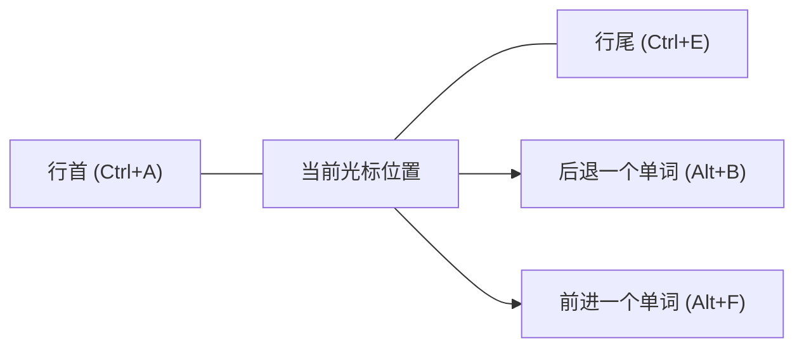
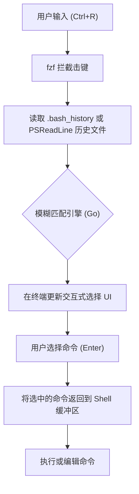

# 引言：终端操作的效率提升带来压倒性的生产力增长

在现代软件开发中，终端（命令行界面）是开发者“手脚”般最重要的工具。无论是管理云基础设施、构建容器、使用 Git 进行版本控制，还是执行各种脚本，毫不夸张地说，开发者一天中的大部分时间都是在终端上度过的。

然而，许多开发者虽然熟练掌握了终端的基本命令（如 `cd`, `ls`, `git`, `docker` 等），却往往忽视了**“优化终端输入本身”**这一观点。伸手去拿鼠标、移动光标、连按方向键来修改命令的拼写错误……这些微小损耗的积累，在长期的过程中会带来巨大的时间浪费和认知负荷。

本文将基于“双手不离键盘”的哲学，非常详细且具备技术深度地探讨如何将 Bash 和 PowerShell 环境下的终端操作效率提升至极限，包括快捷键、键绑定设置、历史搜索的优化以及终端复用器的使用方法。

---

# 1. 理论背景：击键级模型（KLM）与时间成本公式化

为了定量理解提高效率所带来的好处，让我们引入 HCI（人机交互）领域中使用的 **GOMS 模型** 的一种——**击键级模型（Keystroke-Level Model, KLM）**来进行思考。

KLM 是一种用于预测熟练用户完成特定无错误任务所需时间的模型。任务的执行时间 $T_{execute}$ 由以下数学公式定义：

$$ T_{execute} = \sum_{i} \left( K \cdot t_{k} + P \cdot t_{p} + H \cdot t_{h} + M \cdot t_{m} + R \cdot t_{r} \right) $$

这里，各个变量的含义如下：
- $K$ : 击键（Keystroking）。按下键盘按键一次的动作。
- $P$ : 指向（Pointing）。使用鼠标等定点设备指向目标的动作。
- $H$ : 归位（Homing）。手从键盘移动到鼠标，或者反过来移动的动作。
- $M$ : 心理准备（Mental preparation）。为计划和准备下一个物理动作而消耗的认知思考时间。
- $R$ : 系统响应（System Response）。用户等待的时间。

各个动作的平均所需时间（$t$）通常估计如下：
- $t_{k} \approx 0.2$ 秒 （对于熟练打字者）
- $t_{p} \approx 1.1$ 秒
- $t_{h} \approx 0.4$ 秒
- $t_{m} \approx 1.35$ 秒

在终端操作中，如果试图使用方向键或鼠标来修改命令的一部分，就会产生归位（$H$）和指向（$P$），每次修改大约会带来 1.5 秒到 2.0 秒的惩罚。另一方面，如果掌握了合适的终端快捷键，就能将 $H$ 和 $P$ 降为 **零**，仅靠击键（$K$）即可达到目的。

假设每天进行 500 次命令输入和编辑，通过活用快捷键每次能缩短 2 秒：
$$ 500 \text{次/天} \times 2 \text{秒} = 1000 \text{秒/天} \approx 16.6 \text{分钟/天} $$
如果将其换算为一年（240 个工作日），则计算出可以节省**约 66 小时（约 8 个工作日）**的时间。更重要的是，通过减少心理准备（$M$），可以获得**“思考不被中断（能够维持心流状态）”**这一不可估量的巨大优势。

---

# 2. Bash Readline 与 Emacs 键绑定的深渊

作为 Linux 和 macOS 标准 Shell 的 Bash，其内部使用名为 **GNU Readline** 的库来处理命令行的输入。Readline 的默认设置是 **Emacs 键绑定**，掌握它便是提升终端效率的第一步。

## 2.1. 移动类快捷键

用方向键逐个字符移动光标是效率极低的表现。请将以下快捷键刻入你的“肌肉记忆”中。

- **`Ctrl + A`** : 移动到行首（Start of line）。使用频率极高。
- **`Ctrl + E`** : 移动到行尾（End of line）。
- **`Alt + B`** (Meta+B) : 后退一个单词（Backward word）。以斜杠或空格为分隔符，按单词为单位进行高速移动。
- **`Alt + F`** (Meta+F) : 前进一个单词（Forward word）。



## 2.2. 编辑类快捷键（Kill 与 Yank）

在 Emacs 术语中，剪切文本被称为“Kill”，粘贴文本被称为“Yank”。

- **`Ctrl + U`** : 从光标位置 Kill（删除）到行首。在密码输入错误或想要从头重写命令时，可以瞬间清空。
- **`Ctrl + K`** : 从光标位置 Kill 到行尾。
- **`Ctrl + W`** : 从光标位置 Kill 前面的一个单词。在删除一个参数并重写时非常有用。
- **`Alt + D`** (Meta+D) : 从光标位置 Kill 后面的一个单词。
- **`Ctrl + Y`** : Yank（粘贴）最后一次 Kill 的内容。这允许进行高级操作，例如在用 `Ctrl+U` 删除命令后移动到另一个目录，然后用 `Ctrl+Y` 将其恢复。
- **`Ctrl + _`** (或 `Ctrl + x, Ctrl + u`) : 撤销（Undo）。如果不小心删除了内容，可以将其恢复。

## 2.3. 其他重要快捷键

- **`Ctrl + L`** : 清屏（等同于 `clear` 命令）。
- **`Ctrl + C`** : 取消当前的命令输入，或中断正在运行的进程。
- **`Ctrl + D`** : 发送 EOF（End Of File）。在未输入任何字符的状态下，会退出 Shell（`exit`）。

## 2.4. 通过 ~/.inputrc 定制 Readline

通过编辑主目录下的 `~/.inputrc` 文件，可以进一步优化这些键绑定。例如，添加以下设置后，便可以使用上下方向键专门搜索与当前输入字符串前缀匹配的历史记录。

```bash
# ~/.inputrc 配置示例
"\e[A": history-search-backward
"\e[B": history-search-forward
set completion-ignore-case on
set show-all-if-ambiguous on
```
这样一来，在输入 `docker ` 之后按下向上方向键，就可以高速追溯过去以 `docker` 开头的命令历史。

---

# 3. PowerShell 与 PSReadLine：在 Windows 环境中获得类似 Bash 的操作体验

作为 Windows 的标准 Shell，早期版本的 PowerShell 只有等同于命令提示符（cmd.exe）的贫弱输入环境。然而，通过引入 **PSReadLine** 模块，它获得了匹敌甚至超越 Bash（Readline）的高级命令行编辑功能。

## 3.1. 启用 PSReadLine 与 Emacs 模式

PowerShell 5.1 及更高版本（包括 PowerShell Core）标准内置了 PSReadLine。为了让 Windows 用户将终端的生产力提升到 Linux 的水平，必须将 PSReadLine 的编辑模式从默认的 Windows（类似 cmd）模式更改为 **Emacs 模式**。

编辑 PowerShell 配置文件（`$PROFILE`），让它自动加载设置。

```powershell
# 用 VS Code 打开 $PROFILE
code $PROFILE
```

在 `$PROFILE` 中追加以下配置。

```powershell
# 导入 PSReadLine 模块（如需显式导入）
Import-Module PSReadLine

# 将编辑模式设为 Emacs，并启用与 Bash 相同的快捷键
Set-PSReadLineOption -EditMode Emacs

# 忽略提示音（错误提示音）
Set-PSReadLineOption -BellStyle None
```

这样一来，即使在 Windows 的 PowerShell 上，诸如 `Ctrl+A`（行首）、`Ctrl+E`（行尾）、`Ctrl+U`（删除至行首）、`Alt+B` / `Alt+F`（按单词移动）等 Emacs/Bash 风格的键绑定也能完全生效了。

## 3.2. 预测型 IntelliSense 与高级历史搜索

PSReadLine 的强大功能之一是基于输入历史和外部预测插件的 **Predictive IntelliSense（预测型智能提示）**。当你开始输入时，它会从过去的历史记录中以浅灰色（内联）提示可能性最高的一条完整命令。如果你想接受该建议，只需按右方向键（或用 `Alt+F` 逐词接受）即可。

```powershell
# 在 $PROFILE 中追加：启用预测功能（需要 PowerShell 7.1+ / PSReadLine 2.1+）
Set-PSReadLineOption -PredictionSource History
Set-PSReadLineOption -PredictionViewStyle InlineView
# 若希望以列表形式显示，请指定 ListView
# Set-PSReadLineOption -PredictionViewStyle ListView
```

## 3.3. 覆盖上下方向键的行为（类似 Bash 的前缀匹配搜索）

PowerShell 默认的上下方向键只是简单地按顺序浏览历史记录。我们要像前面提到的 `~/.inputrc` 那样，将其重新映射为“搜索与当前输入字符串前缀匹配的历史记录”的功能。

```powershell
# 在 $PROFILE 中追加：注册历史前缀匹配搜索处理程序
Set-PSReadLineKeyHandler -Key UpArrow -Function HistorySearchBackward
Set-PSReadLineKeyHandler -Key DownArrow -Function HistorySearchForward
```

这样一来，即使在 Windows 环境下，你也能用与 Linux 环境完全相同的手指动作，直观地构建、搜索和执行命令。跨平台统一认知负荷（$M$）对于 DevOps 工程师来说极其重要。

---

# 4. 历史搜索的极致：集成 fzf (Fuzzy Finder)

在终端操作中，最频繁执行的动作之一就是**“从历史记录中找出过去执行过的复杂命令并重新执行”**。由于标准的 `Ctrl+R`（反向搜索）是完全一致匹配，很难从“记得好像是用 docker run 挂载了卷……”这样模糊的记忆中调出命令。

能优雅解决这个问题的，是使用 Go 语言编写的超高速通用模糊搜索工具 **`fzf`**。

## 4.1. 使用 fzf 进行模糊搜索的流水线

将 `fzf` 集成到命令历史搜索中后，会通过如下流水线进行处理。



当用户输入以空格分隔的多个关键字（例如：`docker ubuntu bash`）时，fzf 的匹配引擎会扫描整个历史文件，并瞬间列出那些无序且分散地包含这些关键字的历史记录。

## 4.2. 在 Bash 中集成 fzf

在 Ubuntu/Debian 等 Linux 环境中，可以使用 apt 轻松安装。此外，通过执行安装脚本，会自动覆盖 Bash 的键绑定。

```bash
# 安装 fzf
git clone --depth 1 https://github.com/junegunn/fzf.git ~/.fzf
~/.fzf/install
```
这样一来，按下 `Ctrl+R` 就会在全屏（或 tmux 的窗格内）弹出 fzf 的交互式 UI，让你可以极其直观地搜索历史记录。在搜索 UI 上，可以通过 `Ctrl+N` (下) / `Ctrl+P` (上) 来选择项目。

## 4.3. 在 PowerShell 中集成 PSFzf

在 Windows PowerShell 环境中，也可以使用 `PSFzf` 模块获得完全相同的体验。首先安装 fzf 二进制文件（使用 Scoop 等工具很方便），然后引入模块。

```powershell
# 使用 Scoop 安装 fzf 二进制文件
scoop install fzf

# 安装 PSFzf 模块
Install-Module -Name PSFzf -Scope CurrentUser
```

然后，在 `$PROFILE` 中添加设置以绑定快捷键。

```powershell
# 在 $PROFILE 中追加
Import-Module PSFzf

# 将 Ctrl+R 映射到 fzf 的历史搜索
Set-PsFzfOption -PSReadlineChordReverseHistorySearch 'Ctrl+r'
```
这样一来，即使在 Windows 中，也能通过 `Ctrl+R` 瞬间在庞大的 PowerShell 历史记录中进行模糊搜索了。

---

# 5. 通过别名和包装函数将击键数最小化

除了快捷键和历史搜索之外，最直接减少击键（$K$）本身的方法就是定义别名（Alias）和包装函数。

## 5.1. 极简的 Git 操作

我们每天会使用无数次 Git。每次都完整拼写出 `git status` 或 `git commit` 在 KLM 模型中是巨大的浪费。

**Bash 的示例 (`~/.bashrc`)**:
```bash
alias g='git'
alias gs='git status -sb'
alias ga='git add'
alias gc='git commit -m'
alias gco='git checkout'
alias gp='git push'
alias gl='git log --oneline --graph --decorate --all'
```

**PowerShell 的示例 (`$PROFILE`)**:
```powershell
Set-Alias -Name g -Value git
function gs { git status -sb $args }
function ga { git add $args }
function gc { git commit -m $args }
function gco { git checkout $args }
function gl { git log --oneline --graph --decorate --all $args }
```
※ 由于 PowerShell 的 `Set-Alias` 无法固定参数，因此最佳实践是像上面这样将带有选项的别名定义为函数（function）。

## 5.2. 目录跳转的优化（z / zoxide）

使用 `cd` 命令进入层级很深的目录非常麻烦。近年来，能够学习用户移动历史和频率（Frecency：Frequency + Recency），只需输入路径的一部分就能跳转到目标目录的工具 **`zoxide`** (Rust 编写) 正逐渐成为标准。

```bash
# 安装 zoxide 后，使用 z 替代 cd
z proj # 瞬间跳转到 /home/user/workspace/projects/
```
zoxide 支持 Bash、Zsh 和 PowerShell，可以在跨平台环境下实现同样的高速目录跳转。

---

# 6. 终端复用器与窗格管理

如果在同一个终端窗口中启动了一个进程（例如本地服务器），为了进行其他工作，就必须重新打开一个新的终端窗口。切换窗口（`Alt+Tab`）伴随着视线的移动，会导致上下文切换的成本（心理准备 $M$ 增加）。

解决这个问题的方案是**终端复用器**，它可以将屏幕分割成多个窗格，并在后台维持多个会话。

## 6.1. tmux 的架构与状态转换 (Linux / macOS)

`tmux` 是一个拥有服务器-客户端架构的强大复用器。为了防止快捷键与其他程序发生冲突，tmux 的操作机制要求必须先按下**前缀键（默认是 Ctrl+B）**。

以下的 Mermaid 状态转换图展示了 tmux 的基本操作流程。

```mermaid
stateDiagram-v2
    [*] --> Normal["普通模式"]
    Normal --> Prefix["前缀模式 (Ctrl+B)"]
    Prefix --> Command["命令提示符 (:)"]
    Prefix --> SplitV["垂直分割窗格 (%)"]
    Prefix --> SplitH["水平分割窗格 (\")"]
    Prefix --> Switch["切换窗口 (n/p/0-9)"]
    Prefix --> Detach["分离会话 (d)"]
    
    Command --> Normal["执行 tmux 命令"]
    SplitV --> Normal["返回普通模式"]
    SplitH --> Normal["返回普通模式"]
    Switch --> Normal["返回普通模式"]
    Detach --> [*]
```

通常的做法是修改 `~/.tmux.conf`，将前缀键改为容易按下的 `Ctrl+A`（类似 GNU Screen 的风格），并将窗格移动绑定为类似 Vim 的 `hjkl` 风格。

```text
# ~/.tmux.conf 的示例
# 将前缀键修改为 Ctrl-a
set -g prefix C-a
unbind C-b
bind C-a send-prefix

# 将窗格分割绑定到直观的按键上
bind | split-window -h
bind - split-window -v

# 类似 Vim 的窗格移动
bind h select-pane -L
bind j select-pane -D
bind k select-pane -U
bind l select-pane -R
```

## 6.2. Windows Terminal 的窗格管理

在 Windows 环境中，最新的 **Windows Terminal** 原生支持窗格分割功能。虽然没有像 tmux 那样的会话持久化功能，但可以通过基于 GUI 的方式轻松管理窗格。打开设置（`settings.json`），通过自定义操作，可以实现完全仅靠键盘完成的控制。

```json
// Windows Terminal settings.json 的部分内容
"actions": [
    { "command": { "action": "splitPane", "split": "auto" }, "keys": "alt+shift+d" },
    { "command": { "action": "moveFocus", "direction": "left" }, "keys": "alt+left" },
    { "command": { "action": "moveFocus", "direction": "right" }, "keys": "alt+right" }
]
```
这样一来，在 PowerShell 内只需按下 `Alt+Shift+D` 就可以分割屏幕，通过组合使用方向键和 `Alt` 就能在窗格之间无缝移动。

---

# 7. 实用工作流构建示例

将目前为止介绍的元素（Emacs 键绑定、PSReadLine、fzf、别名、复用器）组合起来，日常任务的速度将得到戏剧性的提升。

例如，假设有一个任务是：“在排查故障时检查服务器日志，同时使用 Git 查找相关代码的提交历史”。

1. 打开终端，输入 `z prod` 瞬间移动到生产环境的操作目录。
2. 按下 `Ctrl+R`，在弹出的 `fzf` 中输入 `ssh auth` 调出过去复杂的 SSH 登录命令并执行。
3. 按下 `Ctrl+B` `|` (tmux 的窗格分割)，在右侧窗格执行 `gs` (git status) 等命令来调查代码。
4. 在左侧窗格的日志输出中发现错误后，按下 `Ctrl+B` `[` 进入复制模式，仅用键盘 Yank（复制）错误信息。
5. 粘贴到编辑器中定位问题原因。

在一连串的动作中，**不需要触碰鼠标一次**。KLM 方程式中的 $H$ (Homing) 和 $P$ (Pointing) 被完全排除，终端的操作速度将完全跟上你的思考速度。

---

# 总结

本文从 KLM 理论出发，到具体的 Bash/PowerShell 键绑定，再到集成 fzf 和 tmux，极其详细地阐述了决定开发者生产力的“终端操作效率提升”方法。

刚开始有意识地去按 `Ctrl+A` 或 `Ctrl+E` 时，可能会感到一些压力。然而，只要有意识地持续使用几周，这些快捷键必定会扎根在你的**肌肉记忆**中。一旦形成肌肉记忆，你就能在无意识中自由自在地驾驭终端，这也将成为大幅提升你一生开发者体验（Developer Experience, DX）的宝贵财富。

请从今天开始打开 `$PROFILE` 或 `~/.bashrc`，着手构建最适合你双手的终极终端环境吧。
