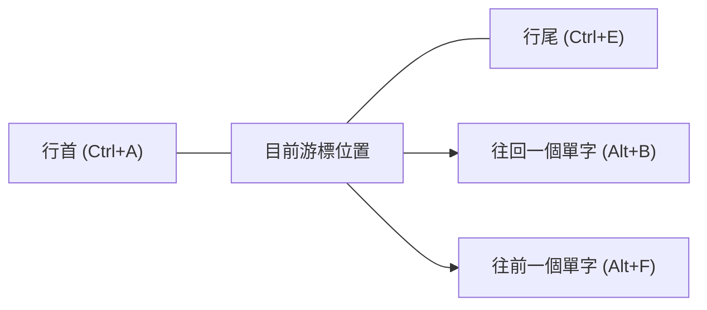
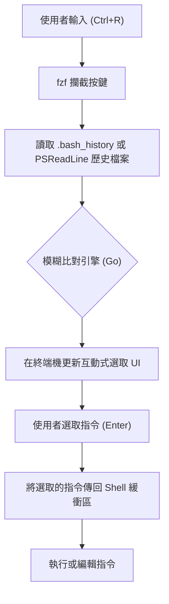

# 前言：終端機操作效率化帶來的壓倒性生產力提升

在現代軟體開發中，終端機（命令列介面）是開發者的「手足」，也是最重要的工具。無論是雲端基礎設施的管理、容器的建置、使用 Git 進行版本控制，還是執行各種腳本，可以毫不誇張地說，開發者一天中的大部分時間都在終端機上度過。

然而，許多開發者雖然熟練掌握了終端機的基本指令（如 `cd`, `ls`, `git`, `docker` 等），卻往往忽略了**「將終端機的輸入本身最佳化」**這個觀點。伸手去拿滑鼠、移動游標、連按方向鍵來修正指令的錯字……這些微小損失的累積，長久下來將導致龐大的時間浪費與認知負荷。

本文將基於「雙手不離開鍵盤」的哲學，針對在 Bash 及 PowerShell 環境下如何將終端機操作效率達到極致，非常詳細且技術性地解說快捷鍵、按鍵綁定設定、歷史紀錄搜尋的最佳化，以及終端機多工器（Terminal Multiplexer）的活用方法。

---

# 1. 理論背景：按鍵層次模型（KLM）與時間成本的公式化

為了定量理解效率化帶來的好處，讓我們引入在 HCI（人機互動）領域中使用的 **GOMS 模型**的一種，即**按鍵層次模型（Keystroke-Level Model, KLM）**來思考。

KLM 是一種用於預測熟練使用者完成特定無錯誤任務所需時間的模型。任務的執行時間 $T_{execute}$ 可用以下數學方程式來定義：

$$ T_{execute} = \sum_{i} \left( K \cdot t_{k} + P \cdot t_{p} + H \cdot t_{h} + M \cdot t_{m} + R \cdot t_{r} \right) $$

這裡，各個變數代表以下含義：
- $K$ : 按鍵（Keystroking）。按下鍵盤按鍵一次的動作。
- $P$ : 指向（Pointing）。使用滑鼠等指標裝置指向目標的動作。
- $H$ : 歸位（Homing）。手從鍵盤移動到滑鼠，或從滑鼠移回鍵盤的動作。
- $M$ : 心智準備（Mental preparation）。為了計畫與準備下一個實體動作的認知思考時間。
- $R$ : 系統回應（System Response）。使用者等待的時間。

各動作的平均所需時間（$t$），一般估算如下：
- $t_{k} \approx 0.2$ 秒 （針對熟練的打字者）
- $t_{p} \approx 1.1$ 秒
- $t_{h} \approx 0.4$ 秒
- $t_{m} \approx 1.35$ 秒

在終端機操作中，若試圖使用方向鍵或滑鼠來修正部分指令，就會產生歸位（$H$）與指向（$P$），每次修正大約會產生 1.5 秒到 2.0 秒的延遲懲罰。另一方面，如果掌握了適當的終端機快捷鍵，就能將 $H$ 和 $P$ 壓低至 **零**，僅靠按鍵（$K$）即可達成目的。

假設一天進行 500 次指令輸入與編輯，並透過活用快捷鍵讓每次縮短 2 秒：
$$ 500 \text{次/日} \times 2 \text{秒} = 1000 \text{秒/日} \approx 16.6 \text{分鐘/日} $$
將這換算成一年（240 個工作日），就等於節省了**約 66 小時（約 8 個工作日）**的時間。更重要的是，藉由減少心智準備（$M$），還能獲得**「思考不中斷（維持心流狀態）」**這個無可估量的巨大好處。

---

# 2. Bash Readline 與 Emacs 按鍵綁定的深淵

做為 Linux 與 macOS 預設 shell 的 Bash，內部使用的是名為 **GNU Readline** 的函式庫來處理命令列的輸入。這個 Readline 的預設設定為 **Emacs 按鍵綁定**，而掌握它正是終端機效率化的第一步。

## 2.1. 移動類快捷鍵

使用方向鍵將游標逐字元移動，是效率低下的極致。請將以下快捷鍵刻入「肌肉記憶（Muscle Memory）」中。

- **`Ctrl + A`** : 移動到行首（Start of line）。非常常用。
- **`Ctrl + E`** : 移動到行尾（End of line）。
- **`Alt + B`** (Meta+B) : 往回移動一個單字（Backward word）。以斜線或空白為分隔符，以單字為單位進行高速移動。
- **`Alt + F`** (Meta+F) : 往前移動一個單字（Forward word）。



## 2.2. 編輯類快捷鍵（剪下與貼上 / Kill and Yank）

在 Emacs 術語中，剪下文字被稱為「Kill」，而貼上被稱為「Yank」。

- **`Ctrl + U`** : 從游標位置 Kill（刪除）到行首。在密碼輸入錯誤，或是想重新輸入指令時，能一瞬間清空。
- **`Ctrl + K`** : 從游標位置 Kill 到行尾。
- **`Ctrl + W`** : 刪除游標位置前的一個單字。在刪除一個參數並重寫時非常方便。
- **`Alt + D`** (Meta+D) : 刪除游標位置後的一個單字。
- **`Ctrl + Y`** : Yank（貼上）最後一次 Kill 的內容。可以實現進階用法，例如：移動到另一個目錄後，用 `Ctrl+Y` 恢復剛才用 `Ctrl+U` 刪除的指令。
- **`Ctrl + _`** (或 `Ctrl + x, Ctrl + u`) : 復原（Undo）。不小心刪除時可以還原。

## 2.3. 其他重要快捷鍵

- **`Ctrl + L`** : 清除畫面（等同於 `clear` 指令）。
- **`Ctrl + C`** : 取消目前的指令輸入，或中斷執行中的處理程序。
- **`Ctrl + D`** : 傳送 EOF (End Of File)。在沒有輸入文字的狀態下，會結束 shell (`exit`)。

## 2.4. 透過 ~/.inputrc 來自訂 Readline

編輯家目錄下的 `~/.inputrc` 檔案，可以將這些按鍵綁定做進一步的最佳化。例如，加入以下設定後，就能使用上下鍵來搜尋符合目前輸入字串開頭的歷史紀錄。

```bash
# ~/.inputrc 的設定範例
"\e[A": history-search-backward
"\e[B": history-search-forward
set completion-ignore-case on
set show-all-if-ambiguous on
```
這樣一來，輸入 `docker ` 後按下上方向鍵，就可以高速尋找過去以 `docker` 開頭的指令歷史紀錄。

---

# 3. PowerShell 與 PSReadLine：在 Windows 環境下實現類似 Bash 的操作

Windows 的標準 shell「PowerShell」，在早期版本中只有與命令提示字元（cmd.exe）同等貧乏的輸入環境。然而，隨著導入 **PSReadLine** 模組，它獲得了媲美甚至超越 Bash (Readline) 的進階命令列編輯功能。

## 3.1. 啟用 PSReadLine 與 Emacs 模式

PowerShell 5.1 以上版本（以及 PowerShell Core）已預設內建 PSReadLine。為了讓 Windows 使用者能將終端機的生產力提升到 Linux 的水準，必須將 PSReadLine 的編輯模式從預設的 Windows（類似 cmd）模式更改為 **Emacs 模式**。

編輯 PowerShell 的設定檔（`$PROFILE`），讓設定能自動載入。

```powershell
# 在 VS Code 中開啟 $PROFILE
code $PROFILE
```

在 `$PROFILE` 加上以下設定：

```powershell
# 匯入 PSReadLine 模組（如果要明確匯入的話）
Import-Module PSReadLine

# 將編輯模式設為 Emacs，並啟用與 Bash 相同的快捷鍵
Set-PSReadLineOption -EditMode Emacs

# 忽略提示音（錯誤音）
Set-PSReadLineOption -BellStyle None
```

這樣一來，在 Windows 的 PowerShell 上也能完美使用類似 Emacs/Bash 的按鍵綁定，例如 `Ctrl+A`（行首）、`Ctrl+E`（行尾）、`Ctrl+U`（刪除至行首）、`Alt+B` / `Alt+F`（單字移動）等。

## 3.2. 預測智慧輸入 (Predictive IntelliSense) 與進階歷史紀錄搜尋

PSReadLine 的強大功能之一是基於輸入歷史紀錄或外部預測外掛的 **Predictive IntelliSense（預測智慧輸入）**。當開始輸入時，它會以淺灰色（內聯）顯示來自歷史紀錄中最有可能的完整指令建議。如果接受建議，只需按下右方向鍵（或使用 `Alt+F` 逐字元接受）即可。

```powershell
# 加到 $PROFILE：啟用預測功能（需要 PowerShell 7.1+ / PSReadLine 2.1+）
Set-PSReadLineOption -PredictionSource History
Set-PSReadLineOption -PredictionViewStyle InlineView
# 若想以清單格式顯示，請指定 ListView
# Set-PSReadLineOption -PredictionViewStyle ListView
```

## 3.3. 覆寫上下鍵的行為（類似 Bash 的前綴相符搜尋）

PowerShell 預設的上下方向鍵只是單純的依序移動歷史紀錄。我們將其重新對應為「搜尋與目前輸入字串開頭相符的歷史紀錄」，就如同前面提到的 `~/.inputrc` 一樣。

```powershell
# 加到 $PROFILE：註冊歷史紀錄前綴相符搜尋處理程序
Set-PSReadLineKeyHandler -Key UpArrow -Function HistorySearchBackward
Set-PSReadLineKeyHandler -Key DownArrow -Function HistorySearchForward
```

這樣一來，即使在 Windows 環境下，也能用與 Linux 完全相同的手指動作，直覺地建構、搜尋與執行指令。在跨平台間統一認知負荷（$M$），對 DevOps 工程師來說極為重要。

---

# 4. 歷史紀錄搜尋的極致：整合 fzf (Fuzzy Finder)

在終端機操作中，最頻繁執行的動作之一就是**「從歷史紀錄中找出過去執行過的複雜指令並重新執行」**。標準的 `Ctrl+R`（反向搜尋）是完全比對，因此很難從「好像是 docker run 並且掛載了 volume...」這種模糊的記憶中把指令找出來。

用 Go 語言編寫的超高速通用模糊搜尋工具 **`fzf`**，優雅地解決了這個問題。

## 4.1. 透過 fzf 進行模糊搜尋的管線

將 `fzf` 整合到指令歷史紀錄搜尋中時，將會透過以下管線進行處理。



當使用者輸入以空白分隔的多個關鍵字（例如：`docker ubuntu bash`）時，fzf 的比對引擎會掃描整個歷史紀錄檔，瞬間列出包含這些關鍵字（不拘順序、距離可遠可近）的歷史紀錄。

## 4.2. 在 Bash 中整合 fzf

在 Ubuntu/Debian 等 Linux 環境下，可以輕鬆地使用 apt 進行安裝。此外，執行安裝腳本後，Bash 的按鍵綁定會自動被覆寫。

```bash
# 安裝 fzf
git clone --depth 1 https://github.com/junegunn/fzf.git ~/.fzf
~/.fzf/install
```
這樣一來，按下 `Ctrl+R` 後，fzf 的互動式 UI 就會在全螢幕（或 tmux 的窗格內）彈出，讓你能夠極為直覺地搜尋歷史紀錄。在搜尋 UI 上，可以透過 `Ctrl+N`（下）/ `Ctrl+P`（上）來選取項目。

## 4.3. 在 PowerShell 中整合 PSFzf

在 Windows PowerShell 環境下，使用 `PSFzf` 模組也能獲得完全相同的體驗。首先安裝 fzf 的執行檔（使用 Scoop 等工具很方便），接著導入模組。

```powershell
# 透過 Scoop 安裝 fzf 執行檔
scoop install fzf

# 安裝 PSFzf 模組
Install-Module -Name PSFzf -Scope CurrentUser
```

然後，在 `$PROFILE` 中新增設定並綁定按鍵。

```powershell
# 加到 $PROFILE 中
Import-Module PSFzf

# 將 Ctrl+R 對應到 fzf 的歷史紀錄搜尋
Set-PsFzfOption -PSReadlineChordReverseHistorySearch 'Ctrl+r'
```
這下子，在 Windows 也能使用 `Ctrl+R`，一瞬間對過去龐大的 PowerShell 歷史紀錄進行模糊搜尋了。

---

# 5. 透過別名（Alias）與包裝函式（Wrapper Function）將按鍵次數最小化

除了快捷鍵和歷史紀錄搜尋外，最直接減少按鍵（$K$）本身的方法，就是定義別名（Alias）與包裝函式。

## 5.1. Git 操作的極小化

我們每天會使用無數次的 Git。每次都要完整拼出 `git status` 或 `git commit`，在 KLM 模型中是極大的浪費。

**Bash 的範例 (`~/.bashrc`)**:
```bash
alias g='git'
alias gs='git status -sb'
alias ga='git add'
alias gc='git commit -m'
alias gco='git checkout'
alias gp='git push'
alias gl='git log --oneline --graph --decorate --all'
```

**PowerShell 的範例 (`$PROFILE`)**:
```powershell
Set-Alias -Name g -Value git
function gs { git status -sb $args }
function ga { git add $args }
function gc { git commit -m $args }
function gco { git checkout $args }
function gl { git log --oneline --graph --decorate --all $args }
```
※ PowerShell 的 `Set-Alias` 無法固定引數，因此對於伴隨選項的別名，最佳做法是像上面這樣將其定義為函式（function）。

## 5.2. 目錄移動的最佳化（z / zoxide）

使用 `cd` 指令移動到深層目錄非常麻煩。近年來，能學習使用者移動的歷史紀錄與頻率（Frecency: Frequency + Recency），只要輸入部分路徑就能跳到目標目錄的工具 **`zoxide`**（使用 Rust 編寫）正逐漸成為標準。

```bash
# 安裝 zoxide 後，使用 z 來代替 cd
z proj # 一瞬間移動到 /home/user/workspace/projects/
```
zoxide 支援 Bash、Zsh 及 PowerShell 等所有 shell，能夠在跨平台間實現同樣高速的目錄移動。

---

# 6. 終端機多工器與窗格管理

如果在一個終端機視窗中啟動了一個處理程序（例如本地伺服器），為了進行其他工作，就必須重新開啟一個新的終端機視窗。切換視窗（`Alt+Tab`）會伴隨著視線的移動，並帶來情境切換的成本（增加心智準備 $M$）。

為了解決這個問題，可以使用**終端機多工器**，它能將畫面分割為多個窗格，並在背景維持多個工作階段（Session）。

## 6.1. tmux 的架構與狀態轉換 (Linux / macOS)

`tmux` 是一個擁有伺服器－客戶端架構的強大多工器。為了避免與其他程式的快捷鍵衝突，tmux 的操作機制規定必須先按下 **前綴鍵（Prefix Key，預設為 Ctrl+B）**。

以下的 Mermaid 狀態轉換圖，表現了 tmux 的基本操作流程。

```mermaid
stateDiagram-v2
    [*] --> Normal["一般模式 (Normal Mode)"]
    Normal --> Prefix["前綴模式 (Prefix Mode, Ctrl+B)"]
    Prefix --> Command["命令提示字元 (:)"]
    Prefix --> SplitV["垂直分割窗格 (%)"]
    Prefix --> SplitH["水平分割窗格 (\")"]
    Prefix --> Switch["切換視窗 (n/p/0-9)"]
    Prefix --> Detach["卸載工作階段 (d)"]
    
    Command --> Normal["執行 tmux 指令"]
    SplitV --> Normal["返回一般模式"]
    SplitH --> Normal["返回一般模式"]
    Switch --> Normal["返回一般模式"]
    Detach --> [*]
```

常見的做法是編輯 `~/.tmux.conf`，將前綴鍵變更為比較好按的 `Ctrl+A`（類似 GNU Screen 的風格），並將窗格移動綁定為類似 Vim 的 `hjkl`。

```text
# ~/.tmux.conf 範例
# 變更前綴鍵為 Ctrl-a
set -g prefix C-a
unbind C-b
bind C-a send-prefix

# 將窗格分割改為直覺的按鍵
bind | split-window -h
bind - split-window -v

# 類似 Vim 的窗格移動
bind h select-pane -L
bind j select-pane -D
bind k select-pane -U
bind l select-pane -R
```

## 6.2. Windows Terminal 的窗格管理

在 Windows 環境下，最新的 **Windows Terminal** 原生支援了窗格分割功能。雖然沒有像 tmux 那樣的工作階段持久化功能，但可以透過 GUI 基礎輕鬆管理窗格。開啟設定檔（`settings.json`）並自訂動作（actions），就能實現完全靠鍵盤完成的操作。

```json
// Windows Terminal settings.json 的一部分
"actions": [
    { "command": { "action": "splitPane", "split": "auto" }, "keys": "alt+shift+d" },
    { "command": { "action": "moveFocus", "direction": "left" }, "keys": "alt+left" },
    { "command": { "action": "moveFocus", "direction": "right" }, "keys": "alt+right" }
]
```
如此一來，在 PowerShell 內只需按下 `Alt+Shift+D` 就能分割畫面，並透過方向鍵與 `Alt` 的組合在窗格之間無縫移動。

---

# 7. 實用工作流程建構範例

將目前為止介紹的元素（Emacs 按鍵綁定、PSReadLine、fzf、別名、多工器）結合起來，可以戲劇性地加速日常任務。

舉例來說，假設任務是：「處理故障時，檢查伺服器日誌，並同時使用 Git 調查相關程式碼的 commit 歷史紀錄」。

1. 開啟終端機，輸入 `z prod` 瞬間移動到正式環境的操作目錄。
2. 按下 `Ctrl+R`，在 `fzf` 的彈出視窗輸入 `ssh auth`，叫出並執行過去複雜的 SSH 登入指令。
3. 執行 `Ctrl+B` `|` (tmux 的窗格分割)，在右側窗格執行 `gs` (git status) 等指令調查程式碼。
4. 若在左側窗格的日誌輸出中發現錯誤，按下 `Ctrl+B` `[` 進入複製模式，只靠鍵盤就把錯誤訊息 Yank（複製）下來。
5. 貼到編輯器以找出原因。

在這一連串的動作中，**完全不需要觸碰滑鼠**。KLM 方程式中的 $H$ (Homing) 與 $P$ (Pointing) 完全被排除，終端機的操作將完美跟上你思考的速度。

---

# 總結

本文針對決定開發者生產力的「終端機操作效率化」，從 KLM 理論到具體的 Bash/PowerShell 按鍵綁定，乃至整合 fzf 和 tmux 等，進行了極為詳細的解說。

剛開始，刻意去按 `Ctrl+A` 或 `Ctrl+E` 可能會感到壓力。然而，只要有意識地持續使用幾週，這些快捷鍵肯定會成為你的**肌肉記憶（Muscle Memory）**。一旦形成習慣，你就能在無意識中自由自在地操控終端機，這將成為你終身受用、飛躍性提升開發體驗（Developer Experience, DX）的重要財富。

請務必從今天開始，打開 `$PROFILE` 或 `~/.bashrc`，著手打造最適合自己雙手的終極終端機環境。
