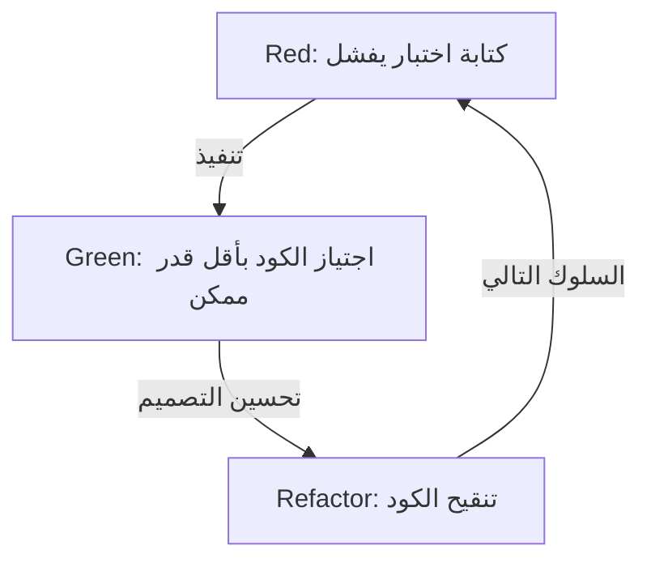
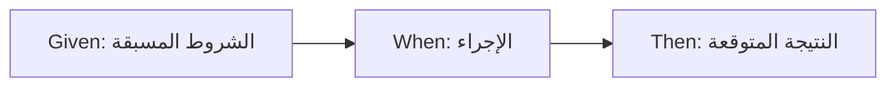

# لا نكتب الاختبارات للعثور على الأخطاء، بل من أجل التصميم

في عالم تطوير البرمجيات، غالبًا ما تكون كلمة "اختبار" مضللة. يعتقد الكثير من المطورين، وخاصة المبرمجين المبتدئين وأصحاب المصلحة غير التقنيين، أن الاختبار هو "مهمة للتأكد من أن الكود المكتمل يعمل بشكل صحيح"، أي جزء من عملية ضمان الجودة (QA) للعثور على الأخطاء. ومع ذلك، في فلسفة التطوير الموجه بالاختبار (TDD) والتطوير الموجه بالسلوك (BDD)، يكمن جوهر الاختبار في مكان مختلف تمامًا.

الاختبار هو عملية تصميم تحدد "كيف يجب أن يكون هذا الكود" قبل كتابته.

في هذه المقالة، سنتعمق في فلسفة التصميم من خلال الاختبار، بدءًا من الأفكار الأساسية لـ TDD التي اقترحها Kent Beck، إلى ولادة BDD بواسطة Dan North، وصولاً إلى الصراع بين مدرسة الـ Mock (London School) ومدرسة الحالة (Chicago School). لن نقتصر على الشرح التقني فحسب، بل سنسلط الضوء على الجوانب النفسية والتصميمية الكامنة وراء سبب كتابتنا للاختبارات.

## Kent Beck وولادة TDD: الهدف الحقيقي وراء Red-Green-Refactor

يعتبر Kent Beck، الذي أعاد اكتشاف TDD ورسخه كأساس لتطوير البرمجيات الرشيقة، أن الهدف من TDD هو الحصول على "كود نظيف يعمل" (Clean code that works). عملية TDD، كما هو معروف، هي تكرار للخطوات الثلاث التالية:

1. **Red (أحمر)**: كتابة اختبار صغير يفشل.
2. **Green (أخضر)**: كتابة الحد الأدنى من الكود لاجتياز هذا الاختبار.
3. **Refactor (إعادة هيكلة)**: إزالة التكرار في الكود وتحسين التصميم مع الحفاظ على اجتياز الاختبارات.



ليس من الصعب تكرار هذه الدورة ميكانيكيًا. ومع ذلك، فإن الفخ الذي يقع فيه العديد من المطورين هو إغفال "الهدف الحقيقي" من هذه الدورة.

### التغلب على الخوف (Overcoming Fear)

في كتابه "التطوير الموجه بالاختبار"، أشار كينت بيك مرارًا إلى "الخوف" المرتبط بالبرمجة. عند معالجة مشكلة غير معروفة أو إجراء تغييرات على كود حالي معقد، يواجه المطورون دائمًا الخوف من "كسر شيء ما". هذا الخوف يجعل المطورين دفاعيين، مما يجعلهم يترددون في تحسين الكود (إعادة الهيكلة)، مما يؤدي في النهاية إلى تراكم الديون التقنية.

دورة Red-Green-Refactor في TDD هي أداة نفسية للسيطرة على هذا الخوف. يوفر الاختبار الفاشل (Red) هدفًا واضحًا يجب تحقيقه بعد ذلك. باجتياز هذا الاختبار (Green)، يحصل المطور على ملاحظات مؤكدة بأنه "تقدم خطوة إلى الأمام". وبسبب شبكة الأمان القوية للاختبارات، تصبح إعادة الهيكلة الجريئة (Refactor) ممكنة. TDD هي ممارسة لتحويل الخوف إلى يقين وجلب راحة البال للمبرمج.

### تحسين التصميم: تصميم واجهة برمجة التطبيقات من الخارج

جانب آخر مهم لـ TDD هو أن فعل "كتابة الاختبارات" يعني "الوقوف في وجهة نظر مستخدم API". تعني كتابة الاختبارات قبل تنفيذ الكود هندسة الواجهة، مثل أسماء الفئات، وأسماء الطرق، وهيكل المعلمات، وأنواع القيم المرجعة، بشكل عكسي انطلاقًا من الشكل الأسهل للاستخدام.

عندما تتم كتابة الاختبارات لاحقًا (Test-Last)، يميل المطورون إلى الانسياق وراء البنية الداخلية التي تم تنفيذها بالفعل. تُكتب الاختبارات لتناسب راحة التنفيذ، ويتم تثبيت واجهة صعبة الاستخدام. يعكس TDD هذا الترتيب للتركيز ليس على "كيف يتم تنفيذه" ولكن "كيف يجب استخدامه". بعبارة أخرى، TDD ليس فقط Test-Driven Development (التطوير الموجه بالاختبار) ولكنه أيضًا Test-Driven Design (التصميم الموجه بالاختبار).

## الاختلاف الحاسم عن الاختبار البعدي (Test-Last)

السؤال "حتى لو لم يكن TDD، أليس الأمر نفسه إذا كتبت اختبارات الوحدة لاحقًا؟" يُطرح دائمًا تقريبًا عند تقديم TDD. بالتأكيد، إذا نظرت فقط إلى النتيجة النهائية وهي زوج من "كود الاختبار" و"كود المنتج"، فقد يبدو أنه لا يوجد فرق بينهما. ومع ذلك، هناك فرق حاسم في تأثير العملية على التصميم.

### ضمان قابلية الاختبار (Testability)

إذا حاولت كتابة الاختبارات لاحقًا، فغالبًا ما تصطدم بجدار "هذا الكود يصعب اختباره". يرجع هذا إلى الاعتماديات المرتبطة بإحكام، والاعتماد على الحالة العامة، والوصول المباشر إلى الأنظمة الخارجية، وما إلى ذلك. في الاختبار اللاحق، ينتهي بك الأمر بإعادة هيكلة الكود الحالي بالقوة لكتابة الاختبارات، أو استخدام أدوات المحاكاة لكتابة اختبارات معقدة وهشة.

من ناحية أخرى، في TDD، لا يمكن من حيث المبدأ أن يوجد "كود لا يمكن اختباره". لأن كتابة الاختبارات هي شرط أساسي للتنفيذ. من أجل تسهيل كتابة الاختبارات، يتم اعتماد حقن التبعية (DI) بشكل طبيعي، ويتم تقسيم الفئات ليكون لها مسؤولية واحدة. يعمل TDD كبوصلة توجه المطورين نحو تصميم ممتاز موجه للكائنات بتماسك عالٍ واقتران منخفض.

### وهم تغطية الكود

في نهج الاختبار اللاحق، غالبًا ما تكون "تغطية الكود" هي الهدف. لتحقيق هدف رقمي مثل 80٪ أو 100٪، قد يبدأ المطورون في كتابة اختبارات لا معنى لها (مثل الاختبارات بدون تأكيدات) فقط لتمرير أسطر الكود الحالية. هذا يضع العربة أمام الحصان.

في TDD، ليست تغطية الكود العالية "هدفًا"، بل هي مجرد "منتج ثانوي" ناتج عن التطوير الموجه بالاختبار. لا توجد الاختبارات المكتوبة باستخدام TDD لتغطية أسطر التنفيذ، ولكن لتغطية "سلوك" النظام.

## مدرستان: مدرسة شيكاغو مقابل مدرسة لندن

مع انتشار TDD، ظهرت مدرستان رئيسيتان للفكر فيما يتعلق بكيفية كتابة الاختبارات ونهج التصميم. وهما مدرسة شيكاغو (أو Classicist/Statist) ومدرسة لندن (أو Mockist/Outside-In). من المهم جدًا فهم الاختلافات بين هاتين المدرستين لتقدير عمق TDD.

### مدرسة شيكاغو (الحالة، الكلاسيكية)

مدرسة شيكاغو، التي دعا إليها كينت بيك و Uncle Bob (روبرت س. مارتن) وغيرهما، هي نهج يمكن اعتباره أصل TDD. يطلق عليها أحيانًا مدرسة ديترويت.

الخصائص الرئيسية لهذه المدرسة هي كما يلي:

1. **الاختبار القائم على الحالة (State Verification)**: بعد استدعاء طريقة كائن، يتم التحقق من "الحالة النهائية" لذلك الكائن أو الكائنات المتعاونة.
2. **الحد الأدنى من المحاكاة**: يتم تجنب الاستخدام المفرط للكائنات الوهمية (Mocks)، ويتم استخدام الكائنات "الحقيقية" (Real) قدر الإمكان في الاختبار. تقتصر المحاكاة على الاتصال بالحدود الخارجية، مثل قواعد البيانات أو الشبكات، التي قد تجعل الاختبارات بطيئة أو غير مستقرة.
3. **تصميم من أسفل إلى أعلى (Bottom-up)**: يبدأ التصميم من نماذج المجال الصغيرة التي تشكل جوهر النظام، وتُدمج تدريجياً لإنشاء ميزات أكبر (Inside-Out).

ميزة مدرسة شيكاغو هي أن الاختبارات قوية جدًا ضد إعادة الهيكلة. نظرًا لأنها تتحقق فقط من النتيجة النهائية دون الاعتماد على تفاصيل التنفيذ الداخلية، فلا تنكسر الاختبارات بسهولة حتى لو تم تغيير الهيكل الداخلي بشكل كبير.

### مدرسة لندن (مدرسة المحاكاة، من الخارج إلى الداخل)

من ناحية أخرى، فإن مدرسة لندن هي نهج أسسه ستيف فريمان ونات برايس في مجتمع التطوير حول لندن.

1. **الاختبار القائم على السلوك (Behavior Verification)**: استخدام الكائنات الوهمية (Mocks) بنشاط، والتحقق من التفاعل، أي ما هي الطرق التي استدعاها الكائن قيد الاختبار على الكائنات التابعة، وبأي معلمات.
2. **تصميم من الخارج إلى الداخل (Outside-In)**: يبدأ التصميم من الطبقات الخارجية للنظام، مثل واجهة المستخدم أو وحدات التحكم، ويتقدم تدريجياً إلى منطق المجال الداخلي مع تعريف واجهات الكائنات التابعة الضرورية كأشياء وهمية.
3. **عزل صارم**: من خلال محاكاة كل شيء باستثناء الفئة قيد الاختبار، يمكن تحديد موقع الخطأ بدقة شديدة عند فشل الاختبار.

ميزة مدرسة لندن هي أنها تعزز اكتشاف الواجهات أثناء عملية التصميم. يتم التفكير في الأدوار الضرورية من أعلى إلى أسفل، ويتم تصميم بروتوكول الاتصال بين الكائنات من خلال الكائنات الوهمية. ومع ذلك، هناك انتقادات بأن الاختبارات تميل إلى الانكسار بسهولة (Fragile Tests) أثناء إعادة الهيكلة لأن الاختبارات ترتبط ارتباطًا وثيقًا بتفاصيل التنفيذ.

ليس الأمر مجرد أيهما أفضل. المهم هو القدرة على اختيار النهج المناسب وفقًا لخصائص النظام ومرحلة التصميم.

## دان نورث وولادة BDD: الكلمات تشكل التفكير

في حين أن TDD هي أداة قوية، كان هناك حاجز رئيسي واحد أمام انتشارها وتعليمها. كان هذا هو الفروق الدقيقة لضمان الجودة التي تحملها كلمة "اختبار" نفسها.

في منتصف العقد الأول من القرن الحادي والعشرين، أثناء تعليم TDD للمطورين، واجه دان نورث باستمرار أسئلة مثل "ما الذي يجب اختباره؟"، "كيف يجب تسمية الاختبارات؟"، و "لماذا فشل الاختبار؟". تم سحب المطورين بكلمة "اختبار" وأصبحوا مهووسين بتفاصيل التنفيذ منخفضة المستوى، مثل الأعمال الداخلية للطرق أو التحقق من وجود سجلات في قاعدة البيانات.

لذلك، اقترح دان نورث تحولًا جذريًا في النموذج. وهو التخلص من كلمة "اختبار" واستبدالها بكلمة "سلوك" (Behavior). كان هذا هو ميلاد التطوير الموجه بالسلوك (BDD: Behavior-Driven Development).

### من "Test" إلى "Should"

كانت الخطوة الأولى نحو BDD هي تغيير أسماء طرق الاختبار لتبدأ بـ `should~` بدلاً من `test~`.
على سبيل المثال، بدلاً من `testCalculateDiscount`، يتم تسميتها `shouldApplyTenPercentDiscountForVipCustomers`.

أحدث هذا التغيير البسيط في الكلمات تغييرًا جذريًا في تفكير المطورين. تحول التركيز من "كيف نختبر هذه الطريقة" إلى متطلبات العمل وهي "كيف يجب أن يتصرف هذا النظام (should do)".

### JBehave واكتشاف Given-When-Then

شعر دان نورث بالحاجة إلى لغة خاصة بالمجال (DSL) لوصف السلوك، وطور إطار عمل يسمى JBehave. ما تم اعتماده هناك كان قالب **Given-When-Then**، والذي أصبح الآن مرادفًا لـ BDD.

* **Given (المعطيات)**: عند توفر سياق معين أو حالة أولية
* **When (الإجراء)**: عندما يحدث إجراء أو حدث ما
* **Then (النتيجة)**: كنتيجة لذلك، ما هي الحالة التي يجب أن تكون عليها، أو ما هو السلوك الذي يجب أن يحدث



هذا التنسيق ليس مجرد بناء جملة برمجي. لقد أصبح الأساس للغة منتشرة (Ubiquitous Language) لمحللي الأعمال، وخبراء المجال، والمختبرين، والمطورين للتواصل حول متطلبات النظام باستخدام نفس اللغة.

## سد الفجوة بين متطلبات العمل والكود

في تطوير البرمجيات التقليدي، كانت هناك فجوة عميقة ومظلمة بين وثائق متطلبات العمل المكتوبة بلغة طبيعية، والكود الذي يكتبه المبرمجون. سرعان ما تصبح مستندات المتطلبات قديمة، وللتعرف على كيفية عمل النظام الفعلي، لم يكن أمام المبرمجين خيار سوى فك تشفير الكود.

يسد BDD هذه الفجوة من خلال مفهوم المواصفات القابلة للتنفيذ (Executable Specification). باستخدام أدوات BDD مثل Cucumber، يمكنك تنفيذ المتطلبات ذات النص العادي المكتوبة بصيغة Given-When-Then مباشرة ككود اختبار.

```gherkin
Feature: وظيفة الخصم في عربة التسوق
  يجب تطبيق خصم مناسب عندما يشتري عميل VIP كمية كبيرة من المنتجات.

  Scenario: تطبيق خصم 10% لعملاء VIP
    Given المستخدم "Kenji" هو عميل "VIP"
    And يوجد بالفعل في عربة "Kenji" منتجات بقيمة 5000 ين
    When يضيف "Kenji" "لوحة مفاتيح فاخرة" بقيمة 6000 ين إلى العربة
    Then إجمالي مبلغ العربة يجب أن يصبح 9900 ين بدلاً من 11000 ين
```

يمكن حتى لغير التقنيين قراءة ملف الميزة هذا، وهو يعبر بدقة عن نية العمل. في الوقت نفسه، يتم تنفيذه كاختبار آلي في خط أنابيب CI/CD، مما يثبت دائمًا أن النظام يعمل وفقًا لهذه المواصفات. من خلال دمج وثيقة المتطلبات مع كود الاختبار، يتم تحقيق "التوثيق الحي" (Living Documentation).

## الخلاصة: تحويل الخوف إلى يقين، وعدم اليقين إلى تصميم

التطوير الموجه بالاختبار (TDD) والتطوير الموجه بالسلوك (BDD) ليسا مجرد تقنيات لأتمتة الاختبارات. إنهما فلسفات عميقة ومتطورة للتعامل مع الصعوبات الأساسية في تطوير البرمجيات: الخوف من التغيير، وفجوة الاتصال بين المتطلبات والتنفيذ.

يحرر TDD المطورين من الخوف من خلال دورة Red-Green-Refactor ويصمم الكود بشكل جميل من الداخل. يعلمنا الصراع والاندماج بين مدرسة شيكاغو ومدرسة لندن المقاربات المتنوعة للتصميم الموجه للكائنات.
وبتقديم لغة مشتركة تتمثل في Given-When-Then، يذيب BDD الحدود بين الأعمال والتطوير، مما يسمح للنظام بأكمله بالتحرك في خط مستقيم نحو هدفه الأصلي (السلوك).

نحن لا نكتب الاختبارات للعثور على الأخطاء.
لتمكيننا من تغيير الكود بثقة غدًا ولخلق تصميمات جميلة تلبي حقًا متطلبات العمل، سنستمر في رسم "مخطط التصميم" الذي نطلق عليه اسم الاختبار.
