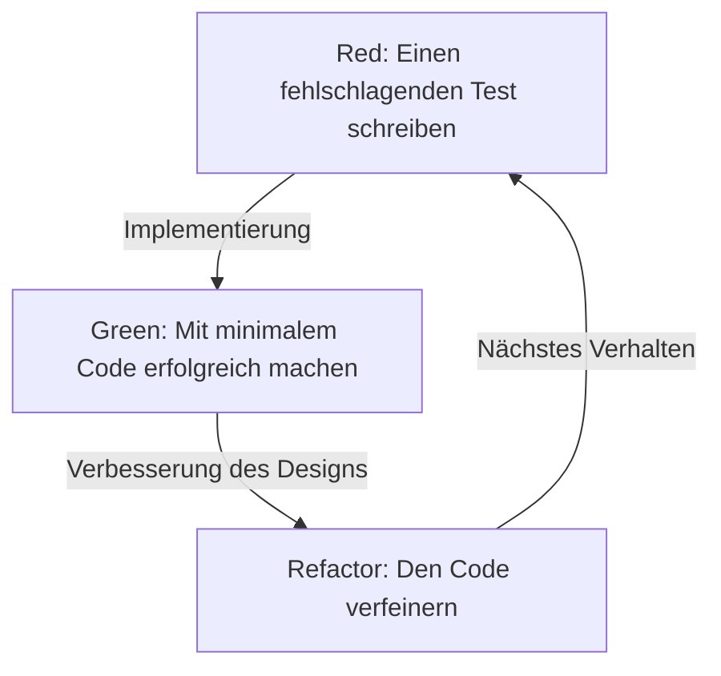
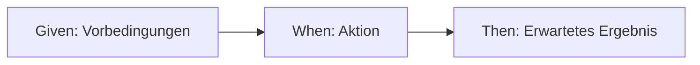

# Tests werden nicht geschrieben, um Bugs zu finden, sondern um zu designen

In der Welt der Softwareentwicklung führt das Wort "Test" oft zu Missverständnissen. Viele Entwickler, insbesondere unerfahrene Programmierer und nicht-technische Stakeholder, betrachten Tests als "eine Aufgabe, um zu überprüfen, ob der fertige Code richtig funktioniert", d. h. als Teil eines Qualitätssicherungsprozesses (QA) zum Auffinden von Bugs. In der Philosophie von Test-Driven Development (TDD) und Behavior-Driven Development (BDD) liegt das Wesen von Tests jedoch an einem völlig anderen Ort.

Ein Test ist ein Designakt, der definiert, "wie der Code sein sollte", bevor der Code geschrieben wird.

In diesem Artikel werden wir die Philosophie des Designs durch Tests tiefgreifend untersuchen, angefangen bei der grundlegenden Idee von TDD, die von Kent Beck propagiert wurde, über die Entstehung von BDD durch Dan North bis hin zum Konflikt zwischen Mockismus (London School) und Statismus (Chicago School). Wir gehen über einfache technische Erklärungen hinaus und beleuchten die psychologischen und gestalterischen Aspekte, die dem Grund zugrunde liegen, warum wir Tests schreiben.

## Kent Beck und die Entstehung von TDD: Der wahre Zweck von Red-Green-Refactor

Kent Beck, der Test-Driven Development (TDD) wiederentdeckte und als Grundlage der agilen Softwareentwicklung etablierte, erklärte, dass der Zweck von TDD darin bestehe, "funktionierenden, sauberen Code (Clean code that works)" zu erhalten. Der TDD-Prozess ist, wie weithin bekannt, eine Wiederholung der folgenden drei Schritte.

1. **Red (Rot)**: Einen kleinen Test schreiben, der fehlschlägt.
2. **Green (Grün)**: Den minimalen Code schreiben, der diesen Test besteht.
3. **Refactor (Refactoring)**: Den Zustand beibehalten, in dem die Tests bestanden werden, während Code-Duplikate beseitigt und das Design verfeinert wird.



Es ist nicht schwierig, diesen Zyklus mechanisch zu wiederholen. Die Falle, in die viele Entwickler tappen, besteht jedoch darin, den "wahren Zweck" dieses Zyklus aus den Augen zu verlieren.

### Überwindung von Angst (Overcoming Fear)

In seinem Buch "Test-Driven Development" erwähnt Kent Beck wiederholt die "Angst", die mit der Programmierung einhergeht. Wenn man ein unbekanntes Problem angeht oder Änderungen an komplexem, bestehendem Code vornimmt, stehen Entwickler immer vor der Angst: "Was, wenn ich etwas kaputt mache?". Diese Angst macht Entwickler defensiv, lässt sie beim Verbessern des Codes (Refactoring) zögern und führt letztendlich zur Anhäufung technischer Schulden.

Der Red-Green-Refactor-Zyklus in TDD ist ein psychologisches Werkzeug, um diese Angst zu kontrollieren. Ein fehlschlagender Test (Red) stellt ein klares, als Nächstes zu erreichendes Ziel dar. Indem dieser Test bestanden wird (Green), erhält der Entwickler das sichere Feedback, "einen Schritt vorangekommen zu sein". Und gerade weil es ein robustes Sicherheitsnetz von Tests gibt, wird ein mutiges Refactoring (Refactor) möglich. TDD ist eine Praxis, um Angst in Sicherheit zu verwandeln und dem Programmierer geistige Ruhe zu bringen.

### Verfeinerung des Designs: Die API von außen designen

Ein weiterer wichtiger Aspekt von TDD ist, dass das "Schreiben eines Tests" bedeutet, "die Perspektive des API-Benutzers einzunehmen". Einen Test zu schreiben, bevor man den Code implementiert, bedeutet, die Schnittstelle – wie Klassennamen, Methodennamen, Parameterstruktur und Rückgabetypen – rückwärts von der benutzerfreundlichsten Form aus zu entwerfen.

Wenn Tests nachträglich geschrieben werden (Test-Last), neigen Entwickler dazu, sich von der bereits implementierten internen Struktur mitreißen zu lassen. Tests werden aus Bequemlichkeit für die Implementierung geschrieben, und schwer zu bedienende Schnittstellen werden zementiert. TDD kehrt diese Reihenfolge um und konzentriert sich nicht darauf, "wie es implementiert ist", sondern "wie es verwendet werden sollte". Mit anderen Worten: TDD ist nicht nur Test-Driven Development, sondern auch Test-Driven Design.

## Der entscheidende Unterschied zu nachträglichen Tests (Test-Last)

Die Frage "Selbst wenn es kein TDD ist, ist es nicht dasselbe, wenn man danach Unit-Tests schreibt?" wird bei der Einführung von TDD fast zwangsläufig gestellt. Wenn man nur auf das letztendliche Ergebnis, das Paar aus "Testcode" und "Produktcode", schaut, mag es so aussehen, als gäbe es keinen Unterschied zwischen den beiden. Es gibt jedoch einen entscheidenden Unterschied in den Auswirkungen, die der Prozess auf das Design hat.

### Sicherstellung der Testbarkeit (Testability)

Wenn man versucht, Tests nachträglich zu schreiben, stößt man oft auf die Hürde: "Dieser Code ist schwer zu testen." Ursachen dafür sind eng gekoppelte Abhängigkeiten, Abhängigkeit von globalem Zustand oder direkter Zugriff auf externe Systeme. Bei nachträglichen Tests muss man oft den bestehenden Code gewaltsam umstrukturieren, um Tests zu schreiben, oder komplexe und fragile Tests unter starkem Einsatz von Mocking-Tools schreiben.

Auf der anderen Seite kann bei TDD "untestbarer Code" prinzipiell nicht existieren. Denn das Schreiben von Tests ist eine Voraussetzung für die Implementierung. Um das Schreiben von Tests zu erleichtern, wird auf natürliche Weise Dependency Injection (DI) angewendet, und Klassen werden so aufgeteilt, dass sie eine einzige Verantwortung (Single Responsibility) haben. TDD fungiert als Kompass, der Entwickler zu einem exzellenten objektorientierten Design mit hoher Kohäsion und geringer Kopplung führt.

### Die Illusion der Code Coverage

Beim Test-Last-Ansatz wird oft "Code Coverage" als Ziel gesetzt. Um numerische Ziele wie 80 % oder 100 % zu erreichen, beginnen Entwickler manchmal, bedeutungslose Tests (z. B. Tests ohne Assertions) zu schreiben, die nur dazu dienen, die Zeilen des bestehenden Codes zu durchlaufen. Das stellt den Sinn auf den Kopf.

In TDD ist eine hohe Code Coverage kein "Ziel", sondern lediglich ein "Nebenprodukt" der testgetriebenen Entwicklung. Mit TDD geschriebene Tests existieren nicht, um Implementierungszeilen abzudecken, sondern um das "Verhalten" des Systems abzudecken.

## Zwei Schulen: Chicago School vs. London School

Als sich TDD verbreitete, entstanden im Wesentlichen zwei Schulen bezüglich der Art und Weise, wie Tests geschrieben werden, und des Ansatzes zum Design. Diese sind die Chicago School (oder Classicist/Statist) und die London School (oder Mockist/Outside-In). Das Verständnis der Unterschiede zwischen diesen Schulen ist sehr wichtig, um die Tiefe von TDD zu begreifen.

### Chicago School (Statismus / Classicist)

Die Chicago School ist der Ansatz, der von Kent Beck, Uncle Bob (Robert C. Martin) und anderen propagiert wurde und als der Ursprung von TDD bezeichnet werden kann. Sie wird manchmal auch Detroit School genannt.

Die Hauptmerkmale dieser Schule sind wie folgt:

1. **Zustandsbasiertes Testen (State Verification)**: Nach dem Aufruf einer Methode eines Objekts wird der "endgültige Zustand" dieses Objekts oder kooperierender Objekte verifiziert.
2. **Minimierung von Mocks**: Der übermäßige Einsatz von Mocks (Mock-Objekten) wird vermieden, und Tests werden so weit wie möglich mit tatsächlichen echten (Real) Objekten durchgeführt. Mocks sind auf die Kommunikation mit externen Grenzen (Boundaries) beschränkt, wie z. B. Datenbanken oder Netzwerke, die Tests verlangsamen oder instabil machen.
3. **Bottom-up-Design**: Man beginnt mit kleinen Domänenmodellen, die den Kern des Systems bilden, und kombiniert diese nach und nach, um größere Funktionen aufzubauen (Inside-Out).

Der Vorteil der Chicago School ist, dass die Tests extrem robust gegenüber Refactoring sind. Da sie nicht von internen Implementierungsdetails abhängen (welche Methoden in welcher Reihenfolge aufgerufen werden), sondern nur das Endergebnis verifizieren, gehen die Tests auch bei größeren Änderungen der internen Struktur nicht so leicht kaputt.

### London School (Mockismus / Outside-In)

Andererseits ist die London School ein Ansatz, der von Steve Freeman, Nat Pryce (Autoren von "Growing Object-Oriented Software, Guided by Tests") und anderen in der Entwickler-Community rund um London etabliert wurde.

1. **Verhaltensbasiertes Testen (Behavior Verification)**: Mock-Objekte (Mocks) werden aktiv genutzt, und der Test verifiziert die Interaktion (Interaction) – "welche Methoden mit welchen Argumenten aufgerufen wurden" – des zu testenden Objekts mit seinen abhängigen Objekten.
2. **Outside-In-Design**: Das Design beginnt bei den äußeren Schichten des Systems, wie Benutzeroberflächen oder Controllern, und bewegt sich allmählich zur inneren Domänenlogik, wobei die Schnittstellen der benötigten abhängigen Objekte als Mocks definiert werden.
3. **Strikte Isolierung**: Indem alles außer der zu testenden Klasse gemockt wird, kann die Ursache (Defect Localization) beim Fehlschlagen eines Tests extrem genau lokalisiert werden.

Der Vorteil der London School besteht darin, dass die Entdeckung von Schnittstellen im Designprozess gefördert wird. Die erforderlichen Rollen werden Top-Down durchdacht, und das Protokoll (die Kommunikationsregeln) zwischen den Objekten wird über Mocks entworfen. Es gibt jedoch auch die Kritik, dass die Tests stark an die Implementierungsdetails gekoppelt sein können und daher bei Refactorings anfällig für Brüche sind (Fragile Tests).

Es geht nicht einfach darum, welche Schule besser ist. Wichtig ist die Fähigkeit, je nach den Merkmalen des Systems und der Designphase den geeigneten Ansatz auszuwählen.

## Dan North und die Entstehung von BDD: Worte formen das Denken

Obwohl TDD eine mächtige Methode ist, gab es eine große Hürde bei ihrer Verbreitung und Schulung. Es ist die QA-ähnliche Nuance, die das Wort "Test" selbst mit sich bringt.

Mitte der 2000er Jahre sah sich Dan North beim Unterrichten von TDD für Entwickler ständig mit Fragen konfrontiert wie: "Was sollte getestet werden?", "Wie sollte der Test benannt werden?" und "Warum ist der Test fehlgeschlagen?". Entwickler ließen sich vom Wort "Test" ablenken und fixierten sich auf Low-Level-Implementierungsdetails wie das interne Verhalten von Methoden oder die Bestätigung der Existenz von Datenbankeinträgen.

Daher schlug Dan North einen revolutionären Paradigmenwechsel vor. Das Wort "Test" verwerfen und es durch das Wort "Behavior" (Verhalten) ersetzen. Dies ist die Geburtsstunde des Behavior-Driven Development (BDD).

### Von "Test" zu "Should"

Der erste Schritt zu BDD bestand darin, die Namen von Testmethoden so zu ändern, dass sie mit `should~` statt mit `test~` beginnen.
Beispielsweise nennt man sie `shouldApplyTenPercentDiscountForVipCustomers` anstatt `testCalculateDiscount`.

Diese kleine sprachliche Änderung bewirkte eine dramatische Veränderung im Denken der Entwickler. Der Fokus verlagerte sich von "Wie teste ich diese Methode?" auf die geschäftlichen Anforderungen: "Wie sollte sich dieses System verhalten (should do)?".

### JBehave und die Entdeckung von Given-When-Then

Dan North spürte zudem die Notwendigkeit einer domänenspezifischen Sprache (DSL) zur Beschreibung des Verhaltens und entwickelte das Framework JBehave. Das dort eingeführte Vorlagenformat ist das **Given-When-Then**, das heute als Synonym für BDD gilt.

* **Given (Gegeben)**: Wenn ein bestimmter Kontext oder Anfangszustand gegeben ist
* **When (Wenn)**: Eine Aktion oder ein Ereignis eintritt
* **Then (Dann)**: Welcher Zustand oder welches Verhalten als Ergebnis auftreten sollte



Dieses Format ist nicht nur eine Programmiersyntax. Es wurde die Grundlage für eine allgegenwärtige Sprache (Ubiquitous Language), mit der Business-Analysten (BA), Domänenexperten, Tester und Entwickler in denselben Begriffen über Systemanforderungen kommunizieren können.

## Überbrückung der Kluft zwischen Geschäftsanforderungen und Code

In der traditionellen Softwareentwicklung gab es eine tiefe, dunkle Kluft zwischen dem Dokument für Geschäftsanforderungen (in natürlicher Sprache in Word oder Excel geschrieben) und dem Code, der vom Programmierer geschrieben wurde. Anforderungsdokumente veralteten schnell, und um zu wissen, wie das System tatsächlich funktioniert, blieb den Programmierern nichts anderes übrig, als den Code zu entschlüsseln.

BDD überbrückt diese Kluft durch das Konzept der ausführbaren Spezifikation (Executable Specification). Mit BDD-Tools wie Cucumber können Klartext-Anforderungen (Feature-Dateien), die in Given-When-Then geschrieben sind, direkt als Testcode ausgeführt werden.

```gherkin
Feature: Rabattfunktion des Warenkorbs
  Wenn VIP-Kunden Artikel in großen Mengen kaufen, sollte ein angemessener Rabatt angewendet werden.

  Scenario: Anwendung eines 10%-Rabatts für VIP-Kunden
    Given Der Benutzer "Kenji" ist ein "VIP"-Kunde
    And Im Warenkorb von "Kenji" befinden sich bereits Artikel im Wert von 5000 Yen
    When "Kenji" eine "hochwertige Tastatur" für 6000 Yen zum Warenkorb hinzufügt
    Then Der Gesamtbetrag im Warenkorb sollte 9900 Yen anstatt 11000 Yen betragen
```

Diese Feature-Datei kann auch von Nicht-Technikern gelesen werden und drückt die geschäftliche Absicht genau aus. Gleichzeitig wird sie als automatisierter Test in der CI/CD-Pipeline ausgeführt, wodurch ständig bewiesen wird, dass das System gemäß dieser Spezifikation funktioniert. Durch die Integration von Anforderungsdokumenten und Testcode wird eine "lebende Dokumentation" (Living Documentation) realisiert.

## Fazit: Angst in Gewissheit verwandeln und Unsicherheit in Design umwandeln

Test-Driven Development (TDD) und Behavior-Driven Development (BDD) sind nicht nur Techniken zur Testautomatisierung. Sie sind tiefgreifende, raffinierte Philosophien zur Bewältigung der grundlegenden Schwierigkeiten der Softwareentwicklung – nämlich der Angst vor Veränderungen und der Kommunikationslücke zwischen Anforderungen und Implementierung.

TDD befreit Entwickler durch den Red-Green-Refactor-Zyklus von Ängsten und entwirft Code von innen heraus wunderbar. Der Konflikt und die Verschmelzung der Chicago School und der London School lehren uns die vielfältigen Ansätze des objektorientierten Designs.
Und indem BDD die gemeinsame Sprache Given-When-Then bereitstellt, löst es die Grenzen zwischen Business und Entwicklung auf und ermöglicht es dem gesamten System, geradlinig auf sein eigentliches Ziel (Behavior) zuzusteuern.

Wir schreiben Tests nicht, um Bugs zu finden.
Wir zeichnen weiterhin eine "Design-Blaupause" in Form von Tests, um den Code auch morgen noch mit Zuversicht ändern zu können und ein schönes Design zu schaffen, das den wahren Geschäftsanforderungen entspricht.
