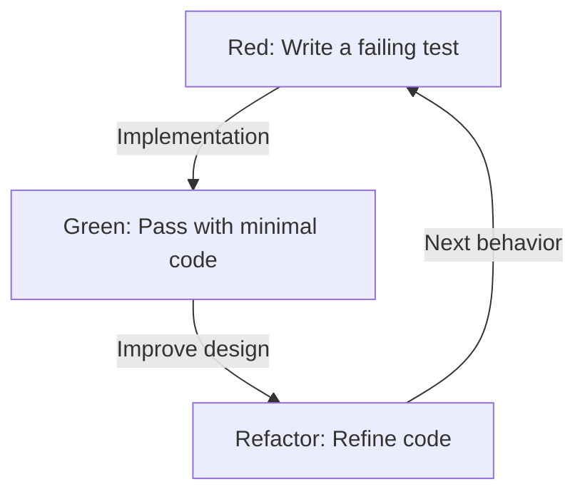
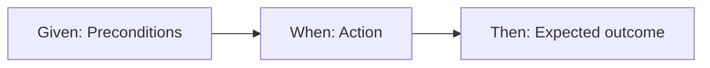

# Tests are written not to find bugs, but to design

In the world of software development, the word "test" is often misleading. Many developers, especially inexperienced programmers and non-technical stakeholders, consider testing to be "the process of checking whether the completed code works correctly," that is, a part of the quality assurance (QA) process to find bugs. However, in the philosophy of Test-Driven Development (TDD) and Behavior-Driven Development (BDD), the essence of testing lies somewhere else entirely.

A test is a design activity that defines "how the code should be" before writing the code.

In this article, we will delve deeply into the philosophy of design through testing, from the foundational ideas of TDD proposed by Kent Beck, to the birth of BDD by Dan North, and the conflict between the Mockist (London School) and Statist (Chicago School) approaches. Going beyond mere technical explanation, we will shed light on the psychological and design aspects underlying why we write tests.

## Kent Beck and the Birth of TDD: The True Purpose of Red-Green-Refactor

Kent Beck, who rediscovered TDD and established it as the foundation of agile software development, states that the purpose of TDD is to obtain "Clean code that works." As is widely known, the TDD process is an iteration of the following three steps:

1. **Red**: Write a small test that fails.
2. **Green**: Write the minimum amount of code required to pass that test.
3. **Refactor**: Eliminate code duplication and refine the design while maintaining a passing test state.



Mechanically repeating this cycle is not difficult in itself. However, a trap many developers fall into is losing sight of the "true purpose" of this cycle.

### Overcoming Fear

In his book *Test-Driven Development*, Kent Beck repeatedly mentions the "fear" associated with programming. When tackling unknown problems or making changes to complex existing code, developers constantly face the fear of "breaking something." This fear makes developers defensive, hesitant to improve code (refactor), and consequently leads to the accumulation of technical debt.

The Red-Green-Refactor cycle in TDD is a psychological tool for controlling this fear. A failing test (Red) presents a clear goal to achieve next. By passing that test (Green), developers get concrete feedback that they have "taken a step forward." And it is because of the solid safety net of tests that bold refactoring (Refactor) becomes possible. TDD is a practice intended to turn fear into confidence and bring mental peace to programmers.

### Refining Design: Designing APIs from the Outside In

Another crucial aspect of TDD is that the act of "writing a test" equates to "taking the perspective of the API user." Writing tests before implementing the code means designing the interface—such as class names, method names, argument structures, and return types—by working backward from its most usable form.

When tests are written later (Test-Last), developers tend to be dragged down by the internal structure that has already been implemented. Tests are written to accommodate the implementation details, solidifying a poorly usable interface. By reversing this order, TDD focuses not on "how it is implemented," but on "how it should be used." In other words, TDD is not only Test-Driven Development but also Test-Driven Design.

## The Decisive Difference from Test-Last

The question, "Isn't it the same if we write unit tests afterward even if it's not TDD?" is almost inevitably raised when introducing TDD. Indeed, looking purely at the end result—a pair of "test code" and "production code"—it might seem like there is no difference between the two. However, there is a decisive difference in the impact the process has on the design.

### Ensuring Testability

When attempting to write tests afterward, developers often hit the wall of "this code is hard to test." This is caused by tight coupling, reliance on global state, direct access to external systems, and so on. With Test-Last, you end up either forcibly refactoring existing code to write tests or utilizing mock tools to write complex and fragile tests.

On the other hand, in TDD, "untestable code" cannot exist in principle. This is because writing the test is a prerequisite for implementation. To make tests easier to write, Dependency Injection (DI) is naturally adopted, and classes are split to have single responsibilities. TDD functions as a compass guiding developers toward excellent object-oriented design with high cohesion and loose coupling.

### The Illusion of Code Coverage

In the Test-Last approach, "code coverage" is often set as a goal. To achieve numerical targets like 80% or 100%, developers may start writing meaningless tests (e.g., tests without assertions) just to pass through lines of existing code. This puts the cart before the horse.

In TDD, high code coverage is not a "goal" but merely a "byproduct" obtained as a result of test-driven development. Tests written in TDD exist not to cover lines of implementation, but to cover the "behavior" of the system.

## Two Schools of Thought: Chicago School vs. London School

As TDD became widespread, two major schools of thought emerged regarding how to write tests and approach design: the Chicago School (or Classicist/Statist) and the London School (or Mockist/Outside-In). Understanding the differences between these schools is extremely important for knowing the depth of TDD.

### Chicago School (Statist/Classicist)

The Chicago School is the approach advocated by Kent Beck, Uncle Bob (Robert C. Martin), and others, which can be considered the origin of TDD. It is also sometimes called the Detroit School.

The main characteristics of this school are as follows:

1. **State Verification**: After calling an object's method, the "final state" of that object or its collaborating objects is verified.
2. **Minimizing Mocks**: It avoids excessive use of mocks and conducts tests using actual (Real) objects whenever possible. Mocks are limited only to communication with external boundaries (like databases or networks) that slow down or destabilize tests.
3. **Bottom-up Design**: It starts building from small, core domain models of the system and gradually combines them to create larger features (Inside-Out).

The advantage of the Chicago School is that tests are highly robust against refactoring. Because they do not depend on internal implementation details (which methods are called in what order) and only verify the final outcome, tests rarely break even if the internal structure is significantly changed.

### London School (Mockist/Outside-In)

On the other hand, the London School is an approach established in the development community around London by Steve Freeman, Nat Pryce (authors of *Growing Object-Oriented Software, Guided by Tests*), and others.

1. **Behavior Verification**: It actively uses mock objects and verifies the interactions—specifically, "which methods were called with what arguments"—by the object under test on its dependencies.
2. **Outside-In Design**: It starts designing from the outer layers of the system, such as user interfaces or controllers, and gradually moves toward inner domain logic while defining the interfaces of necessary dependent objects as mocks.
3. **Strict Isolation**: By mocking everything except the class under test, it can pinpoint the exact cause (Defect Localization) when a test fails.

The advantage of the London School is that it promotes the discovery of interfaces during the design process. It considers the necessary roles top-down and designs the protocols (communication conventions) between objects through mocks. However, there is also criticism that because tests tend to be tightly coupled to implementation details, they are prone to breaking during refactoring (Fragile Tests).

It is not simply a matter of which school is superior. What is important is being able to select the appropriate approach depending on the characteristics of the system and the design phase.

## Dan North and the Birth of BDD: Words Shape Thoughts

While TDD is a powerful method, there was a major hurdle in its widespread adoption and education. That was the QA-like nuance carried by the word "Test" itself.

In the mid-2000s, while teaching TDD to developers, Dan North constantly faced questions like "What should I test?", "What should I name the test?", and "Why did the test fail?". Dragged down by the word "test," developers were fixating on low-level implementation details, such as the internal workings of methods or checking for the existence of database records.

Therefore, Dan North proposed a groundbreaking paradigm shift: discard the word "Test" and replace it with the word "Behavior". This was the birth of Behavior-Driven Development (BDD).

### From "Test" to "Should"

The first step toward BDD was changing test method names to start with `should~` instead of `test~`.
For example, naming it `shouldApplyTenPercentDiscountForVipCustomers` instead of `testCalculateDiscount`.

This minor change in wording brought about a dramatic shift in developers' thinking. Focus shifted from "how to test this method" to the business requirement of "how this system should behave (should do)."

### JBehave and the Discovery of Given-When-Then

Sensing the need for a Domain-Specific Language (DSL) to describe behavior, Dan North further developed a framework called JBehave. Adopted there was the **Given-When-Then** template, which can now be called synonymous with BDD.

* **Given**: When a certain context or initial state is provided
* **When**: Some action or event occurs
* **Then**: Consequently, what state should result, or what behavior should occur



This format is not merely a programming syntax. It became the foundation of a Ubiquitous Language that allowed business analysts (BAs), domain experts, testers, and developers to converse about system requirements using the same vocabulary.

## Bridging the Gap Between Business Requirements and Code

In traditional software development, a deep, dark chasm existed between business requirement documents (written in natural language using Word or Excel) and the code written by programmers. Requirement documents quickly became obsolete, and to know how the system actually behaved, the only way was for programmers to decipher the code.

BDD bridges this gap through the concept of Executable Specifications. By using BDD tools like Cucumber, requirements written in plain text using Given-When-Then (feature files) can be directly executed as test code.

```gherkin
Feature: Shopping cart discount functionality
  Appropriate discounts should be applied when a VIP customer purchases a large number of items.

  Scenario: Applying a 10% discount for a VIP customer
    Given the user "Kenji" is a "VIP" customer
    And "Kenji" already has 5000 yen worth of items in the cart
    When "Kenji" adds a "premium keyboard" worth 6000 yen to the cart
    Then the total cart amount should be 9900 yen, not 11000 yen
```

This feature file can be read by non-technical people and accurately expresses business intent. At the same time, it is executed as an automated test in the CI/CD pipeline, continuously proving that the system operates according to this specification. By unifying requirement documents and test code, "Living Documentation" is realized.

## Conclusion: Turning Fear into Confidence and Uncertainty into Design

Test-Driven Development (TDD) and Behavior-Driven Development (BDD) are not merely test automation techniques. They are deeply refined philosophies for addressing the fundamental difficulties in software development—namely, the fear of change and the communication gap between requirements and implementation.

Through the Red-Green-Refactor cycle, TDD liberates developers from fear and beautifully designs code from the inside out. The conflict and fusion of the Chicago School and the London School teach us diverse approaches to object-oriented design.
And by providing the common language of Given-When-Then, BDD melts the boundary between business and development, enabling the entire system to advance straight toward its true purpose (Behavior).

We write tests not to find bugs.
To confidently change code tomorrow and to create beautiful designs that meet true business demands, we continue to draw the "blueprints of design" called tests.
