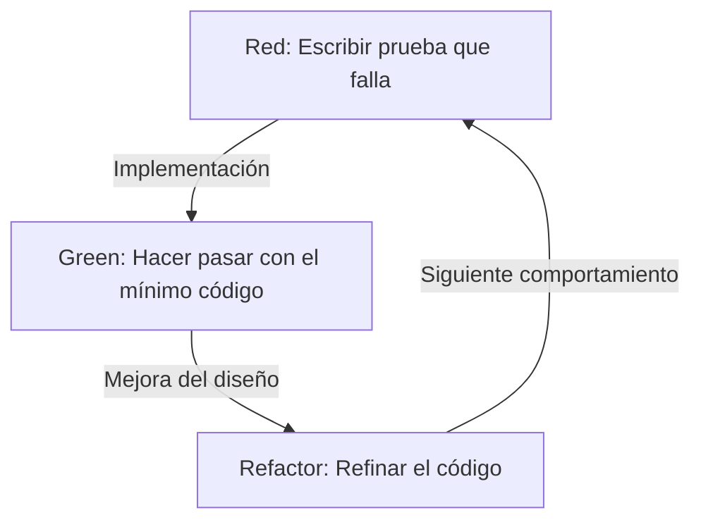
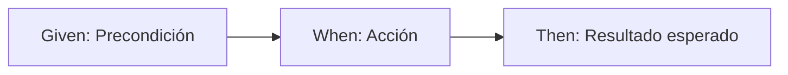

# Las pruebas no se escriben para encontrar errores, sino para diseñar

En el mundo del desarrollo de software, la palabra 'prueba' a menudo lleva a malentendidos. Muchos desarrolladores, especialmente los programadores con poca experiencia o las partes interesadas no técnicas, consideran que las pruebas son 'un trabajo para confirmar que el código terminado funciona correctamente', es decir, parte de un proceso de aseguramiento de calidad (QA) para encontrar errores. Sin embargo, en la filosofía del Desarrollo Guiado por Pruebas (TDD) y el Desarrollo Guiado por Comportamiento (BDD), la esencia de las pruebas radica en un lugar completamente diferente.

Las pruebas son un acto de diseño para definir 'cómo debe ser el código' antes de escribirlo.

En este artículo, profundizaremos en la filosofía del diseño a través de las pruebas, desde la idea fundamental del TDD propuesta por Kent Beck, pasando por el nacimiento del BDD de la mano de Dan North, hasta el conflicto entre la escuela de los mocks (London School) y la del estado (Chicago School). No nos limitaremos a una simple explicación técnica, sino que arrojaremos luz sobre los aspectos psicológicos y de diseño subyacentes que explican por qué escribimos pruebas.

## Kent Beck y el nacimiento del TDD: El verdadero propósito de Red-Green-Refactor

Kent Beck, quien redescubrió el Desarrollo Guiado por Pruebas (TDD) y lo estableció como la base del desarrollo ágil de software, sostiene que el objetivo del TDD es obtener 'código limpio que funciona' (Clean code that works). El proceso de TDD, como es bien sabido, es una iteración de los siguientes tres pasos:

1. **Red (Rojo)**: Escribir una pequeña prueba que falle.
2. **Green (Verde)**: Escribir el código mínimo para que esa prueba pase.
3. **Refactor (Refactorización)**: Eliminar la duplicación de código y refinar el diseño, manteniendo el estado de éxito de la prueba.



Repetir mecánicamente este ciclo no es difícil por sí mismo. Sin embargo, la trampa en la que caen muchos desarrolladores es perder de vista el 'verdadero propósito' de este ciclo.

### Superar el miedo (Overcoming Fear)

En su libro 'Test-Driven Development', Kent Beck menciona repetidamente la 'ansiedad' asociada a la programación. Al abordar un problema desconocido o al realizar cambios en un código existente complejo, los desarrolladores se enfrentan constantemente al miedo de 'romper algo'. Esta ansiedad pone a los desarrolladores a la defensiva, los hace dudar a la hora de mejorar el código (refactorizar) y, como resultado, acumula deuda técnica.

El ciclo Red-Green-Refactor en TDD es una herramienta psicológica para controlar esta ansiedad. Una prueba fallida (Red) presenta un objetivo claro a lograr a continuación. Al hacer que esa prueba pase (Green), el desarrollador obtiene la confirmación certera de 'haber dado un paso adelante'. Y es precisamente porque existe una sólida red de seguridad de pruebas que resulta posible realizar refactorizaciones audaces (Refactor). El TDD es una práctica para transformar la ansiedad en certeza y brindar tranquilidad mental al programador.

### Refinamiento del diseño: Diseñando la API desde afuera

Otro aspecto crucial del TDD es que el acto de 'escribir pruebas' significa, en sí mismo, 'ponerse en la perspectiva del usuario de la API'. Escribir pruebas antes de implementar el código significa diseñar la interfaz —como el nombre de la clase, los nombres de los métodos, la estructura de los argumentos y el tipo de valor de retorno— trabajando hacia atrás desde su forma más fácil de usar.

Cuando se escriben las pruebas después (Test-Last), los desarrolladores tienden a verse arrastrados por la estructura interna ya implementada. Las pruebas se escriben por conveniencia de la implementación, fijando así una interfaz difícil de usar. El TDD invierte este orden para centrarse en 'cómo debe usarse' en lugar de 'cómo está implementado'. Es decir, el TDD es Test-Driven Development (Desarrollo Guiado por Pruebas) al mismo tiempo que es Test-Driven Design (Diseño Guiado por Pruebas).

## La diferencia decisiva con escribir las pruebas después (Test-Last)

La pregunta '¿No es lo mismo escribir pruebas unitarias después, aunque no sea TDD?' surge casi infaliblemente al introducir TDD. Ciertamente, si solo se observa el resultado final (el par de 'código de prueba' y 'código de producción'), podría parecer que no hay diferencia. Sin embargo, existe una diferencia decisiva en el impacto que el proceso tiene sobre el diseño.

### Garantizar la facilidad de prueba (Testability)

Cuando se intenta escribir pruebas después, a menudo uno se topa con el obstáculo de 'este código es difícil de probar'. Las causas incluyen dependencias fuertemente acopladas, dependencia de estados globales o acceso directo a sistemas externos. Con pruebas a posteriori, se termina forzando una refactorización del código existente para poder probarlo, o bien utilizando herramientas de mock en exceso para escribir pruebas complejas y frágiles.

Por otro lado, en TDD, el 'código que no se puede probar' no puede existir por principio, ya que escribir la prueba es un prerrequisito para la implementación. Para facilitar la escritura de pruebas, se adopta naturalmente la inyección de dependencias (DI) y las clases se dividen para tener una única responsabilidad. El TDD actúa como una brújula que guía al desarrollador hacia un excelente diseño orientado a objetos con alta cohesión y bajo acoplamiento.

### La ilusión de la cobertura de código

En el enfoque de pruebas a posteriori, la 'cobertura de código' a menudo se convierte en el objetivo. Para alcanzar metas numéricas como el 80% o el 100%, los desarrolladores pueden empezar a escribir pruebas sin sentido (por ejemplo, sin aserciones) solo para pasar por las líneas de código existente. Esto es confundir los medios con los fines.

En TDD, una alta cobertura de código no es el 'objetivo', sino un 'subproducto' resultante del desarrollo guiado por pruebas. Las pruebas escritas en TDD no existen para cubrir líneas de implementación, sino para cubrir el 'comportamiento' del sistema.

## Dos escuelas: Chicago School vs London School

A medida que el TDD se popularizó, surgieron dos grandes corrientes sobre cómo escribir pruebas y abordar el diseño: la Chicago School (o Clásica/Estadista) y la London School (o Mockista/De Afuera Hacia Adentro). Comprender las diferencias entre estas corrientes es sumamente importante para captar la profundidad del TDD.

### Chicago School (Estadistas / Clásicos)

La Chicago School es el enfoque que podría considerarse el origen del TDD, promovido por Kent Beck y Uncle Bob (Robert C. Martin). También se le conoce como la Detroit School.

Las principales características de esta escuela son:

1. **Pruebas basadas en estado (State Verification)**: Tras llamar a un método de un objeto, se verifica el 'estado final' de ese objeto o de sus colaboradores.
2. **Minimización de mocks**: Se evita el uso excesivo de mocks y las pruebas se realizan utilizando objetos reales en la medida de lo posible. Los mocks se limitan a las comunicaciones con fronteras externas (Boundary) que ralentizan o desestabilizan las pruebas, como bases de datos o redes.
3. **Diseño de abajo hacia arriba (Bottom-up)**: Se comienza construyendo pequeños modelos de dominio en el núcleo del sistema, para luego combinarlos gradualmente y formar funciones más grandes (Inside-Out).

La ventaja de la Chicago School es que las pruebas son muy robustas ante refactorizaciones. Al no depender de los detalles internos de implementación (qué métodos se llaman y en qué orden), sino que solo verifican el resultado final, las pruebas no se rompen fácilmente incluso si la estructura interna cambia drásticamente.

### London School (Mockistas / Outside-In)

Por otro lado, la London School es el enfoque establecido por la comunidad de desarrollo en torno a Londres, con figuras como Steve Freeman y Nat Pryce (autores de 'Growing Object-Oriented Software, Guided by Tests').

1. **Pruebas basadas en comportamiento (Behavior Verification)**: Se hace un uso proactivo de objetos mock para verificar la interacción, es decir, 'qué métodos y con qué argumentos' llamó el objeto bajo prueba en sus objetos dependientes.
2. **Diseño de afuera hacia adentro (Outside-In)**: El diseño comienza desde las capas externas del sistema, como interfaces de usuario o controladores, definiendo las interfaces de las dependencias necesarias como mocks y avanzando gradualmente hacia la lógica de dominio interna.
3. **Aislamiento estricto**: Al simular con mocks todo excepto la clase bajo prueba, se puede localizar el origen del fallo (Defect Localization) de manera extremadamente precisa cuando una prueba falla.

La ventaja de la London School es que promueve el descubrimiento de interfaces en el proceso de diseño. Se piensa de arriba hacia abajo en los roles necesarios y, mediante los mocks, se diseñan los protocolos (reglas de comunicación) entre objetos. Sin embargo, existe la crítica de que las pruebas se acoplan fuertemente a los detalles de implementación, volviéndolas frágiles (Fragile Tests) frente a la refactorización.

No se trata simplemente de que una escuela sea superior a la otra. Lo importante es saber elegir el enfoque adecuado según las características del sistema y la fase de diseño.

## Dan North y el nacimiento de BDD: Las palabras moldean el pensamiento

Aunque el TDD es una técnica poderosa, se topó con una gran barrera en su difusión y enseñanza: los matices propios de aseguramiento de calidad (QA) que acarrea la palabra 'Test' (Prueba).

A mediados de los años 2000, mientras enseñaba TDD, Dan North se enfrentaba constantemente a preguntas como '¿qué debemos probar?', '¿cómo deberíamos nombrar a la prueba?' y '¿por qué falló la prueba?'. Arrastrados por la palabra 'prueba', los desarrolladores se estancaban en detalles de implementación de bajo nivel, como el funcionamiento interno de los métodos o la comprobación de la existencia de registros en la base de datos.

Fue entonces cuando Dan North propuso un cambio de paradigma revolucionario: descartar la palabra 'Test' y reemplazarla por 'Behavior' (Comportamiento). Así nació el Desarrollo Guiado por Comportamiento (BDD: Behavior-Driven Development).

### De 'Test' a 'Should'

El primer paso hacia BDD fue cambiar el nombre de los métodos de prueba de `test~` a que comenzaran con `should~`.
Por ejemplo, en lugar de nombrar `testCalculateDiscount`, se denominaría `shouldApplyTenPercentDiscountForVipCustomers`.

Este pequeño cambio léxico provocó un cambio drástico en la mentalidad de los desarrolladores. En lugar de centrarse en 'cómo probar este método', el foco pasó a estar en el requisito de negocio: 'cómo debería comportarse este sistema (should do)'.

### JBehave y el descubrimiento de Given-When-Then

Sintiendo además la necesidad de un lenguaje de dominio específico (DSL) para describir el comportamiento, Dan North desarrolló un framework llamado JBehave. Allí se adoptó la plantilla **Given-When-Then**, que hoy en día es sinónimo de BDD.

* **Given (Dado)**: Dado un contexto o estado inicial
* **When (Cuando)**: Cuando ocurre una acción o evento
* **Then (Entonces)**: Entonces, qué estado o comportamiento debería resultar



Este formato no es una simple sintaxis de programación. Se ha convertido en la base del Lenguaje Ubicuo (Ubiquitous Language) para que analistas de negocio (BA), expertos de dominio, probadores y desarrolladores dialoguen sobre los requisitos del sistema utilizando el mismo vocabulario.

## Cerrando la brecha entre los requisitos de negocio y el código

En el desarrollo de software tradicional, existía una brecha profunda y oscura entre los documentos de definición de requisitos (escritos en lenguaje natural en Word o Excel) y el código escrito por los programadores. Esos documentos se quedaban obsoletos rápidamente, y para saber cómo funcionaba realmente el sistema, la única forma era que el programador descifrara el código.

BDD cierra esta brecha a través del concepto de Especificaciones Ejecutables (Executable Specification). Al utilizar herramientas de BDD como Cucumber, los requisitos en texto plano (archivos de características o feature files) escritos en formato Given-When-Then pueden ejecutarse directamente como código de prueba.

```gherkin
Feature: Función de descuento del carrito de compras
  Se debe aplicar el descuento adecuado cuando un cliente VIP compra una gran cantidad de artículos.

  Scenario: Aplicar descuento del 10% a un cliente VIP
    Given el usuario "Kenji" es un cliente "VIP"
    And en el carrito de "Kenji" ya hay artículos por valor de 5000 yenes
    When "Kenji" añade un "teclado de alta gama" de 6000 yenes al carrito
    Then el monto total del carrito debe ser 9900 yenes en lugar de 11000 yenes
```

Este archivo de características puede ser leído por personas sin conocimientos técnicos y expresa con precisión la intención de negocio. Al mismo tiempo, se ejecuta como una prueba automatizada en el pipeline de CI/CD, demostrando continuamente que el sistema funciona según dicha especificación. Al unificar los documentos de requisitos y el código de prueba, se materializa la 'Documentación Viva' (Living Documentation).

## Conclusión: Transformando la ansiedad en certeza y la incertidumbre en diseño

El Desarrollo Guiado por Pruebas (TDD) y el Desarrollo Guiado por Comportamiento (BDD) no son meras técnicas de automatización de pruebas. Son filosofías profundas y refinadas para lidiar con las dificultades fundamentales del desarrollo de software: la ansiedad ante el cambio y la brecha de comunicación entre requisitos e implementación.

El TDD, a través del ciclo Red-Green-Refactor, libera a los desarrolladores de la ansiedad y diseña el código de manera elegante desde el interior. El contraste y la fusión de la Chicago School y la London School nos enseñan diversos enfoques para el diseño orientado a objetos.
Por su parte, el BDD, al proporcionar un lenguaje común (Given-When-Then), diluye las fronteras entre negocio y desarrollo, permitiendo que todo el sistema avance en línea recta hacia su verdadero propósito (Behavior).

No escribimos pruebas para encontrar errores.
Para poder cambiar el código con confianza mañana y crear diseños elegantes que satisfagan las verdaderas necesidades del negocio, continuamos dibujando nuestro 'plano de diseño' en forma de pruebas.
