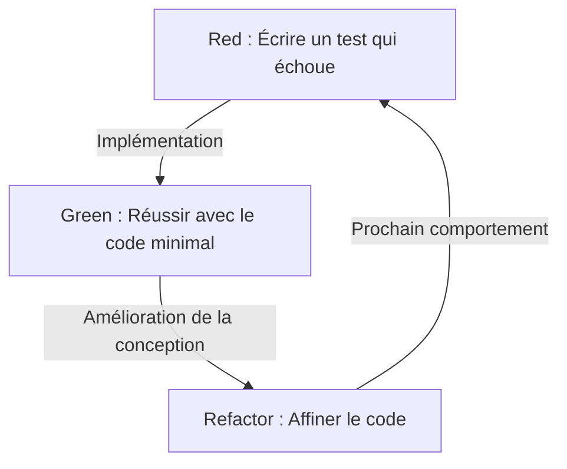
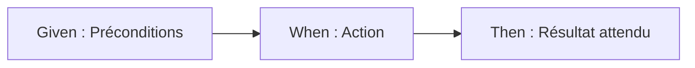

# Les tests ne sont pas écrits pour trouver des bugs, mais pour concevoir

Dans le monde du développement logiciel, le mot "test" est souvent source de malentendus. De nombreux développeurs, en particulier les programmeurs novices ou les parties prenantes non techniques, considèrent les tests comme "une tâche pour s'assurer que le code terminé fonctionne correctement", c'est-à-dire une partie du processus d'assurance qualité (QA) pour trouver des bugs. Cependant, dans la philosophie du Test-Driven Development (TDD) et du Behavior-Driven Development (BDD), l'essence même des tests se situe à un tout autre endroit.

Les tests sont un acte de conception qui définit "ce que le code devrait être" avant même de l'écrire.

Cet article explore en profondeur la philosophie de la conception par les tests, de la pensée fondamentale du TDD prônée par Kent Beck, à la naissance du BDD par Dan North, en passant par le conflit entre l'école de pensée "Mockist" (London School) et "Statist" (Chicago School). Au-delà d'une simple explication technique, il met en lumière les aspects psychologiques et de conception sous-jacents qui expliquent pourquoi nous écrivons des tests.

## Kent Beck et la naissance du TDD : Le véritable objectif du Red-Green-Refactor

Kent Beck, qui a redécouvert le Test-Driven Development (TDD) et l'a établi comme fondement du développement logiciel agile, affirme que l'objectif du TDD est d'obtenir "un code propre qui fonctionne" (Clean code that works). Le processus du TDD, comme il est largement connu, est la répétition des trois étapes suivantes :

1. **Red (Rouge)** : Écrire un petit test qui échoue.
2. **Green (Vert)** : Écrire le code minimal pour faire passer ce test.
3. **Refactor (Remaniement)** : Éliminer la duplication de code et affiner la conception tout en maintenant les tests au vert.



Répéter mécaniquement ce cycle en soi n'est pas difficile. Cependant, le piège dans lequel tombent de nombreux développeurs est de perdre de vue le "véritable objectif" de ce cycle.

### Surmonter la peur (Overcoming Fear)

Dans son livre *Test-Driven Development*, Kent Beck évoque de manière répétée la "peur" qui accompagne la programmation. Face à un problème inconnu, ou lorsqu'il apporte des modifications à un code existant complexe, le développeur est constamment confronté à la crainte de "casser quelque chose". Cette peur rend le développeur défensif, le fait hésiter à améliorer le code (refactoring), et entraîne en fin de compte une accumulation de dette technique.

Le cycle Red-Green-Refactor dans le TDD est un outil psychologique pour contrôler cette peur. Le test qui échoue (Red) présente un objectif clair à atteindre ensuite. En faisant passer ce test (Green), le développeur obtient un retour tangible indiquant qu'il a "fait un pas en avant". Et c'est précisément parce qu'il existe un solide filet de sécurité constitué de tests qu'un refactoring audacieux est possible. Le TDD est une pratique conçue pour transformer la peur en certitude et apporter la paix de l'esprit aux programmeurs.

### Affiner la conception : Concevoir l'API de l'extérieur

Un autre aspect crucial du TDD est que l'acte d'"écrire un test" revient à "adopter le point de vue de l'utilisateur de l'API". Écrire un test avant d'implémenter le code signifie concevoir l'interface (noms de classes, noms de méthodes, structure des arguments, types de retour) en partant du format le plus simple à utiliser.

Lorsque les tests sont écrits après coup (Test-Last), les développeurs ont tendance à être influencés par la structure interne déjà implémentée. Les tests sont écrits pour s'adapter à l'implémentation, figeant ainsi une interface peu pratique. Le TDD inverse cet ordre, se concentrant sur "comment il doit être utilisé" plutôt que sur "comment il est implémenté". En d'autres termes, le TDD signifie à la fois Test-Driven Development (Développement piloté par les tests) et Test-Driven Design (Conception pilotée par les tests).

## La différence cruciale avec l'approche Test-Last

La question "Ne revient-il pas au même d'écrire les tests unitaires plus tard, même sans utiliser le TDD ?" est presque inévitablement posée lors de l'introduction du TDD. Certes, si l'on ne regarde que le résultat final (la paire "code de test" et "code de production"), il peut sembler n'y avoir aucune différence entre les deux. Cependant, l'impact de ce processus sur la conception présente des différences fondamentales.

### Assurer la testabilité (Testability)

Lorsqu'on tente d'écrire des tests après coup, on se heurte souvent au mur du "ce code est difficile à tester". Cela est dû à des dépendances fortement couplées, à une dépendance à un état global, à un accès direct à des systèmes externes, etc. Avec des tests *a posteriori*, on finit par devoir refactorer le code existant de force pour pouvoir écrire les tests, ou par utiliser à outrance des outils de mock pour écrire des tests complexes et fragiles.

En revanche, avec le TDD, un "code non testable" ne peut théoriquement pas exister. En effet, l'écriture du test est une condition préalable à l'implémentation. Pour faciliter l'écriture des tests, l'injection de dépendances (DI) est naturellement adoptée, et les classes sont divisées pour n'avoir qu'une seule responsabilité. Le TDD agit comme une boussole qui guide les développeurs vers une excellente conception orientée objet, avec une forte cohésion et un faible couplage.

### L'illusion de la couverture de code

Dans l'approche de tests *a posteriori*, "la couverture de code" (Code Coverage) est souvent fixée comme objectif. Pour atteindre un objectif chiffré comme 80% ou 100%, les développeurs peuvent commencer à écrire des tests dénués de sens (tels que des tests sans assertions) qui ne font que passer par les lignes de code existantes. C'est mettre la charrue avant les bœufs.

Dans le TDD, une couverture de code élevée n'est pas un "objectif", mais simplement un "sous-produit" résultant d'un développement piloté par les tests. Les tests écrits avec le TDD n'existent pas pour couvrir les lignes d'implémentation, mais pour couvrir le "comportement" du système.

## Deux écoles : Chicago School vs London School

Au fur et à mesure de la popularisation du TDD, deux écoles de pensée principales ont émergé concernant la manière d'écrire les tests et d'aborder la conception : la Chicago School (ou Classicist/Statist) et la London School (ou Mockist/Outside-In). Comprendre les différences entre ces écoles est très important pour saisir la profondeur du TDD.

### Chicago School (Statist / Classicist)

La Chicago School, parfois appelée Detroit School, est l'approche préconisée par Kent Beck, Uncle Bob (Robert C. Martin) et d'autres, et peut être considérée comme l'origine du TDD.

Les principales caractéristiques de cette école sont les suivantes :

1. **Test basé sur l'état (State Verification)** : Après avoir appelé une méthode sur un objet, on vérifie "l'état final" de cet objet ou de ses collaborateurs.
2. **Minimisation des Mocks** : L'utilisation excessive d'objets simulés (Mocks) est évitée ; les tests utilisent autant que possible de "vrais" (Real) objets. Les Mocks sont limités aux communications avec les frontières (Boundary) externes, comme les bases de données ou le réseau, qui ralentiraient ou rendraient les tests instables.
3. **Conception Bottom-up (De bas en haut)** : Le système est construit en commençant par les petits modèles de domaine au cœur du système, en les combinant progressivement pour créer de plus grandes fonctionnalités (Inside-Out).

L'avantage de la Chicago School est que les tests sont extrêmement robustes face au refactoring. Comme ils ne dépendent pas des détails d'implémentation interne (quelles méthodes sont appelées et dans quel ordre) mais vérifient uniquement le résultat final, les tests ont moins de chances de se casser, même en cas de modification majeure de la structure interne.

### London School (Mockist / Outside-In)

D'autre part, la London School est une approche établie par Steve Freeman, Nat Pryce (auteurs de *Growing Object-Oriented Software, Guided by Tests*) et d'autres au sein de la communauté de développement londonienne.

1. **Test basé sur le comportement (Behavior Verification)** : Les objets simulés (Mocks) sont activement utilisés, et le test vérifie les interactions, c'est-à-dire "quelles méthodes de l'objet testé ont été appelées sur les objets dépendants, et avec quels arguments".
2. **Conception Outside-In (De l'extérieur vers l'intérieur)** : La conception commence par les couches externes du système, telles que l'interface utilisateur ou le contrôleur, en définissant les interfaces des objets dépendants nécessaires sous forme de mocks, et progresse progressivement vers la logique de domaine interne.
3. **Séparation stricte** : En simulant tout sauf la classe testée, il est possible d'isoler la cause (Defect Localization) de manière extrêmement précise lorsqu'un test échoue.

L'avantage de la London School est qu'elle favorise la découverte d'interfaces au cours du processus de conception. Les rôles nécessaires sont pensés de haut en bas (top-down), et le protocole (règles de communication) entre les objets est conçu par le biais de mocks. Cependant, il existe également des critiques selon lesquelles les tests ont tendance à être fortement couplés aux détails d'implémentation, les rendant fragiles lors du refactoring (Fragile Tests).

Il ne s'agit pas simplement de dire qu'une école est meilleure que l'autre. L'important est de pouvoir choisir l'approche appropriée en fonction des caractéristiques du système et de la phase de conception.

## Dan North et la naissance du BDD : Les mots façonnent la pensée

Bien que le TDD soit une méthode puissante, il s'est heurté à un obstacle majeur lors de sa diffusion et de son enseignement : la nuance "QA" inhérente au mot "Test" lui-même.

Au milieu des années 2000, en enseignant le TDD aux développeurs, Dan North était constamment confronté à des questions telles que : "Que doit-on tester ?", "Comment nommer les tests ?" ou "Pourquoi ce test a-t-il échoué ?". Les développeurs, influencés par le mot "test", avaient tendance à se focaliser sur des détails d'implémentation de bas niveau, comme le fonctionnement interne des méthodes ou la vérification de l'existence d'un enregistrement dans la base de données.

C'est alors que Dan North a proposé un changement de paradigme révolutionnaire. Il a suggéré d'abandonner le mot "Test" et de le remplacer par le mot "Behavior" (Comportement). C'est la naissance du Behavior-Driven Development (BDD).

### De "Test" à "Should"

La première étape vers le BDD a consisté à modifier les noms des méthodes de test pour qu'ils commencent par `should~` au lieu de `test~`.
Par exemple, au lieu de `testCalculateDiscount`, le nom deviendrait `shouldApplyTenPercentDiscountForVipCustomers`.

Ce petit changement sémantique a provoqué un changement radical dans la façon de penser des développeurs. L'attention est passée de "comment tester cette méthode" à "comment ce système devrait-il se comporter (should do)", se concentrant ainsi sur les exigences métiers.

### La découverte de JBehave et de Given-When-Then

Dan North a ressenti le besoin d'un Domain-Specific Language (DSL) pour décrire les comportements, et a développé un framework appelé JBehave. C'est là qu'il a adopté le modèle **Given-When-Then**, qui est aujourd'hui devenu synonyme de BDD.

* **Given (Étant donné)** : Lorsqu'un certain contexte ou état initial est donné
* **When (Quand)** : Une action ou un événement se produit
* **Then (Alors)** : En conséquence, quel devrait être l'état résultant ou quel comportement devrait se produire



Ce format n'est pas seulement une syntaxe de programmation. Il est devenu la base d'un "Langage Ubiquitaire" (Ubiquitous Language) permettant aux analystes d'affaires (BA), aux experts du domaine, aux testeurs et aux développeurs de dialoguer sur les exigences du système en utilisant les mêmes mots.

## Combler le fossé entre les exigences métiers et le code

Dans le développement logiciel traditionnel, un fossé profond et sombre existait entre les documents de spécification des exigences métiers (écrits en langage naturel dans Word ou Excel) et le code écrit par les programmeurs. Les documents de spécification devenaient rapidement obsolètes, et la seule façon de savoir comment le système fonctionnait réellement était pour les programmeurs de déchiffrer le code.

Le BDD comble ce fossé grâce au concept de Spécification Exécutable (Executable Specification). En utilisant des outils BDD tels que Cucumber, les exigences rédigées en texte brut sous le format Given-When-Then (fichiers de fonctionnalités ou "feature files") peuvent être exécutées directement en tant que code de test.

```gherkin
Feature: Fonctionnalité de réduction du panier d'achat
  Lorsqu'un client VIP achète des articles en grande quantité, une réduction appropriée doit être appliquée.

  Scenario: Application d'une réduction de 10% pour les clients VIP
    Given l'utilisateur "Kenji" est un client "VIP"
    And le panier de "Kenji" contient déjà pour 5000 yens d'articles
    When "Kenji" ajoute un "clavier haut de gamme" de 6000 yens à son panier
    Then le montant total du panier doit être de 9900 yens et non de 11000 yens
```

Ce fichier de fonctionnalité (feature file) peut être lu par des personnes non techniques et exprime fidèlement l'intention métier. Dans le même temps, il est exécuté comme un test automatisé dans le pipeline CI/CD, prouvant en permanence que le système fonctionne conformément à ces spécifications. L'intégration des documents de spécification et du code de test permet d'obtenir une "Documentation Vivante" (Living Documentation).

## Conclusion : Transformer l'anxiété en certitude, et l'incertitude en conception

Le Test-Driven Development (TDD) et le Behavior-Driven Development (BDD) ne sont pas de simples techniques d'automatisation des tests. Ce sont des philosophies profondément raffinées pour faire face aux difficultés fondamentales du développement logiciel : l'anxiété face au changement et les problèmes de communication entre les exigences et l'implémentation.

Le TDD libère le développeur de l'anxiété grâce au cycle Red-Green-Refactor, et permet de concevoir le code de l'intérieur de manière élégante. Le conflit et la fusion entre la Chicago School et la London School nous enseignent diverses approches de la conception orientée objet.
Et le BDD, en fournissant un langage commun appelé Given-When-Then, efface les frontières entre les affaires et le développement, permettant au système dans son ensemble d'avancer directement vers son but initial (Behavior).

Nous n'écrivons pas des tests pour trouver des bugs.
Pour pouvoir modifier le code avec confiance demain et créer un design élégant qui répond véritablement aux exigences métiers, nous continuons à dessiner le "plan de conception" appelé tests.
