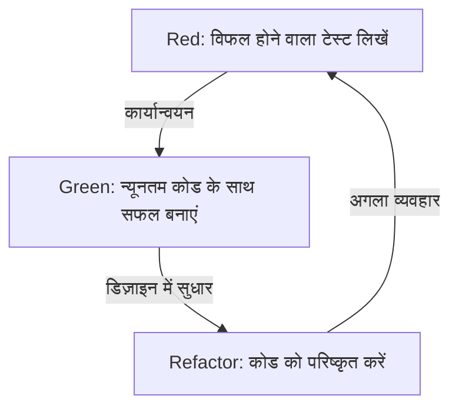
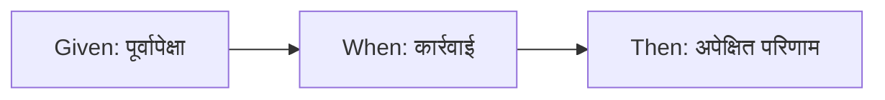

# टेस्ट बग खोजने के लिए नहीं, बल्कि डिज़ाइन करने के लिए लिखे जाते हैं

सॉफ्टवेयर डेवलपमेंट की दुनिया में, 'टेस्ट' शब्द अक्सर गलतफहमी पैदा करता है। कई डेवलपर्स, विशेष रूप से कम अनुभवी प्रोग्रामर और गैर-तकनीकी हितधारक, मानते हैं कि टेस्ट 'यह जांचने का एक काम है कि पूर्ण कोड सही ढंग से काम कर रहा है या नहीं', अर्थात, बग खोजने के लिए क्वालिटी एश्योरेंस (QA) प्रक्रिया का एक हिस्सा है। हालांकि, टेस्ट-ड्रिवेन डेवलपमेंट (TDD) और बिहेवियर-ड्रिवेन डेवलपमेंट (BDD) के दर्शन में, टेस्ट का सार पूरी तरह से एक अलग जगह पर है।

टेस्ट एक डिज़ाइन कार्य है जो कोड लिखने से पहले 'उस कोड को कैसा होना चाहिए' को परिभाषित करता है।

इस लेख में, हम केंट बेक (Kent Beck) द्वारा प्रस्तावित TDD के मूल विचारों से लेकर, डैन नॉर्थ (Dan North) द्वारा BDD के जन्म, और मॉक-आधारित (London School) व स्टेट-आधारित (Chicago School) दृष्टिकोणों के बीच के संघर्ष तक, टेस्ट के माध्यम से डिज़ाइन के दर्शन में गहराई से उतरेंगे। यह केवल एक तकनीकी व्याख्या नहीं है, बल्कि इस बात पर प्रकाश डालता है कि हम टेस्ट क्यों लिखते हैं और इसके पीछे मनोवैज्ञानिक व डिज़ाइन संबंधी पहलू क्या हैं।

## Kent Beck और TDD का जन्म: Red-Green-Refactor का असली उद्देश्य

टेस्ट-ड्रिवेन डेवलपमेंट (TDD) को फिर से खोजने और इसे एजाइल सॉफ्टवेयर डेवलपमेंट की नींव के रूप में स्थापित करने वाले Kent Beck कहते हैं कि TDD का उद्देश्य 'काम करने वाला साफ कोड (Clean code that works)' प्राप्त करना है। TDD की प्रक्रिया, जैसा कि व्यापक रूप से जाना जाता है, निम्नलिखित तीन चरणों की पुनरावृत्ति है:

1. **Red (लाल)**: एक छोटा टेस्ट लिखें जो विफल हो जाए।
2. **Green (हरा)**: उस टेस्ट को पास करने के लिए न्यूनतम कोड लिखें।
3. **Refactor (रिफैक्टर)**: टेस्ट के पास होने की स्थिति को बनाए रखते हुए, कोड के दोहराव को खत्म करें और डिज़ाइन को बेहतर बनाएं।



इस चक्र को यंत्रवत् दोहराना अपने आप में मुश्किल नहीं है। हालाँकि, कई डेवलपर्स जिस जाल में फँसते हैं, वह इस चक्र के 'असली उद्देश्य' को भूल जाना है।

### डर पर काबू पाना (Overcoming Fear)

Kent Beck ने अपनी पुस्तक 'टेस्ट-ड्रिवेन डेवलपमेंट' में प्रोग्रामिंग से जुड़े 'डर' का बार-बार उल्लेख किया है। जब डेवलपर्स किसी अज्ञात समस्या से निपटते हैं या मौजूदा जटिल कोड में बदलाव करते हैं, तो वे अक्सर इस डर का सामना करते हैं कि 'कहीं वे कुछ तोड़ न दें'। यह डर डेवलपर्स को रक्षात्मक बनाता है, उन्हें कोड में सुधार (रिफैक्टरिंग) करने में संकोच कराता है, और परिणामस्वरूप तकनीकी ऋण (technical debt) जमा होता है।

TDD में Red-Green-Refactor चक्र इस डर को नियंत्रित करने के लिए एक मनोवैज्ञानिक उपकरण है। एक विफल होने वाला टेस्ट (Red) अगला स्पष्ट लक्ष्य प्रस्तुत करता है जिसे प्राप्त किया जाना है। उस टेस्ट को पास कराने (Green) से, डेवलपर को एक ठोस प्रतिक्रिया मिलती है कि उन्होंने 'एक कदम आगे बढ़ाया है'। और चूँकि टेस्ट का एक मजबूत सुरक्षा जाल होता है, इसलिए साहसिक रिफैक्टरिंग (Refactor) संभव हो जाती है। TDD डर को आत्मविश्वास में बदलने और प्रोग्रामर को मानसिक शांति प्रदान करने का एक अभ्यास है।

### डिज़ाइन का परिष्करण: API को बाहर से डिज़ाइन करना

TDD का एक और महत्वपूर्ण पहलू यह है कि 'टेस्ट लिखना' अनिवार्य रूप से 'API के उपयोगकर्ता के दृष्टिकोण से चीजों को देखना' है। कोड को लागू करने से पहले टेस्ट लिखने का अर्थ है क्लास के नाम, विधि (method) के नाम, तर्कों (arguments) की संरचना और रिटर्न प्रकार जैसे इंटरफेस को इस तरह से रिवर्स-इंजीनियर करना कि उनका उपयोग करना सबसे आसान हो।

जब टेस्ट बाद में लिखे जाते हैं (Test-Last), तो डेवलपर्स अक्सर पहले से लागू की गई आंतरिक संरचना से प्रभावित हो जाते हैं। टेस्ट कार्यान्वयन की सुविधा के लिए लिखे जाते हैं, जिससे इंटरफ़ेस को उपयोग में कठिन बना दिया जाता है। TDD इस क्रम को उलट देता है और 'इसे कैसे लागू किया गया है' के बजाय 'इसे कैसे उपयोग किया जाना चाहिए' पर ध्यान केंद्रित करता है। दूसरे शब्दों में, TDD न केवल टेस्ट-ड्रिवेन डेवलपमेंट है, बल्कि टेस्ट-ड्रिवेन डिज़ाइन भी है।

## टेस्ट-लास्ट (Test-Last) के साथ निर्णायक अंतर

TDD को अपनाते समय अक्सर यह सवाल पूछा जाता है: 'क्या यह वैसा ही नहीं होगा यदि हम TDD का उपयोग न करें और बाद में यूनिट टेस्ट लिखें?' निश्चित रूप से, यदि हम केवल 'टेस्ट कोड' और 'प्रोडक्ट कोड' की जोड़ी के अंतिम परिणाम को देखें, तो दोनों में कोई अंतर नहीं लग सकता है। हालाँकि, जिस प्रक्रिया से वे डिज़ाइन को प्रभावित करते हैं, उसमें एक निर्णायक अंतर है।

### टेस्ट करने योग्यता (Testability) सुनिश्चित करना

जब आप बाद में टेस्ट लिखने का प्रयास करते हैं, तो आप अक्सर इस बाधा का सामना करते हैं कि 'इस कोड का टेस्ट करना मुश्किल है'। इसके कारणों में टाइट कपलिंग (tight coupling), वैश्विक स्थिति (global state) पर निर्भरता और बाहरी प्रणालियों तक सीधी पहुंच शामिल हैं। बाद में टेस्ट (Test-Last) दृष्टिकोण में, आप अक्सर टेस्ट लिखने के लिए मौजूदा कोड को जबरदस्ती रिफैक्टर करने पर मजबूर हो जाते हैं या जटिल और नाजुक टेस्ट लिखने के लिए मॉकिंग टूल्स का अत्यधिक उपयोग करते हैं।

दूसरी ओर, TDD में सिद्धांत रूप में 'अनटेस्टेबल कोड' जैसी कोई चीज़ नहीं हो सकती। क्योंकि कोड लागू करने से पहले टेस्ट लिखना एक शर्त है। टेस्ट लिखना आसान बनाने के लिए, स्वाभाविक रूप से डिपेंडेंसी इंजेक्शन (DI) अपनाया जाता है, और क्लास को एकल जिम्मेदारी (single responsibility) रखने के लिए विभाजित किया जाता है। TDD एक कंपास के रूप में कार्य करता है जो डेवलपर्स को उच्च कोहेज़न (high cohesion) और कम कपलिंग (low coupling) के साथ एक उत्कृष्ट ऑब्जेक्ट-ओरिएंटेड डिज़ाइन की ओर ले जाता है।

### कोड कवरेज का भ्रम

बाद में टेस्ट लिखने के दृष्टिकोण में, अक्सर 'कोड कवरेज' को लक्ष्य के रूप में देखा जाता है। 80% या 100% जैसे संख्यात्मक लक्ष्यों को प्राप्त करने के लिए, डेवलपर्स ऐसे अर्थहीन टेस्ट लिखना शुरू कर सकते हैं जो केवल मौजूदा कोड की पंक्तियों से गुजरते हैं (जैसे बिना किसी एस्सर्शन वाले टेस्ट)। यह उद्देश्य को ही विफल कर देता है।

TDD में, उच्च कोड कवरेज कोई 'लक्ष्य' नहीं है, बल्कि टेस्ट-ड्रिवेन डेवलपमेंट के परिणामस्वरूप प्राप्त होने वाला एक 'बाय-प्रोडक्ट' है। TDD के साथ लिखे गए टेस्ट कार्यान्वयन की पंक्तियों को कवर करने के लिए नहीं, बल्कि सिस्टम के 'व्यवहार' को कवर करने के लिए मौजूद होते हैं।

## दो विचारधाराएँ: Chicago School बनाम London School

जैसे-जैसे TDD लोकप्रिय हुआ, टेस्ट कैसे लिखें और डिज़ाइन के प्रति दृष्टिकोण को लेकर दो मुख्य विचारधाराएँ (Schools) उभरीं। वे हैं Chicago School (या Classicist/Statist) और London School (या Mockist/Outside-In)। TDD की गहराई को समझने के लिए इन विचारधाराओं के बीच के अंतर को समझना बहुत महत्वपूर्ण है।

### Chicago School (स्टेटिस्ट / क्लासिसिस्ट)

Chicago School एक दृष्टिकोण है जिसकी वकालत Kent Beck और Uncle Bob (Robert C. Martin) आदि ने की थी, जिसे TDD का मूल कहा जा सकता है। इसे कभी-कभी Detroit School भी कहा जाता है।

इस विचारधारा की मुख्य विशेषताएं निम्नलिखित हैं:

1. **स्थिति-आधारित परीक्षण (State Verification)**: ऑब्जेक्ट के मेथड को कॉल करने के बाद, उस ऑब्जेक्ट या सहयोगी ऑब्जेक्ट की 'अंतिम स्थिति' को सत्यापित किया जाता है।
2. **मॉक को कम से कम करना**: मॉक (Mock) के अत्यधिक उपयोग से बचा जाता है, और टेस्ट यथासंभव वास्तविक (Real) ऑब्जेक्ट्स का उपयोग करके किए जाते हैं। मॉक केवल बाहरी सीमाओं (Boundary) जैसे डेटाबेस या नेटवर्क के साथ संचार तक सीमित होते हैं, जो टेस्ट को धीमा या अस्थिर करते हैं।
3. **बॉटम-अप डिज़ाइन**: सिस्टम के मूल में छोटे डोमेन मॉडल से निर्माण शुरू करते हुए, धीरे-धीरे उन्हें एक बड़ा फीचर बनाने के लिए संयोजित किया जाता है (Inside-Out)।

Chicago School का लाभ यह है कि टेस्ट रिफैक्टरिंग के प्रति बहुत मजबूत होते हैं। चूंकि यह आंतरिक कार्यान्वयन विवरणों पर निर्भर नहीं करता है (कौन सा मेथड किस क्रम में कॉल किया जाता है) और केवल अंतिम परिणाम को सत्यापित करता है, इसलिए आंतरिक संरचना में बड़े बदलाव होने पर भी टेस्ट आसानी से नहीं टूटते हैं।

### London School (मॉक-आधारित / आउटसाइड-इन)

दूसरी ओर, London School एक ऐसा दृष्टिकोण है जिसे Steve Freeman और Nat Pryce ('ग्रोइंग ऑब्जेक्ट-ओरिएंटेड सॉफ्टवेयर, गाइडेड बाय टेस्ट्स' के लेखक) ने लंदन के आसपास के विकास समुदाय में स्थापित किया था।

1. **व्यवहार-आधारित परीक्षण (Behavior Verification)**: मॉक ऑब्जेक्ट्स का सक्रिय रूप से उपयोग किया जाता है, और 'इंटरेक्शन' को सत्यापित किया जाता है कि टेस्ट के तहत ऑब्जेक्ट ने निर्भर ऑब्जेक्ट्स के 'कौन से मेथड को किन तर्कों के साथ कॉल किया'।
2. **आउटसाइड-इन डिज़ाइन**: डिज़ाइन सिस्टम की बाहरी परतों जैसे यूजर इंटरफेस या कंट्रोलर से शुरू होता है, और धीरे-धीरे आवश्यक निर्भर ऑब्जेक्ट्स के इंटरफेस को मॉक के रूप में परिभाषित करते हुए आंतरिक डोमेन लॉजिक की ओर बढ़ता है।
3. **सख्त अलगाव**: टेस्ट किए जा रहे क्लास के अलावा सब कुछ मॉक करके, टेस्ट के विफल होने पर दोष का स्थान (Defect Localization) बहुत सटीक रूप से पहचाना जा सकता है।

London School का लाभ यह है कि यह डिज़ाइन प्रक्रिया में इंटरफेस की खोज को बढ़ावा देता है। यह टॉप-डाउन तरीके से आवश्यक भूमिकाओं के बारे में सोचता है, और मॉक के माध्यम से ऑब्जेक्ट्स के बीच प्रोटोकॉल (संचार नियमों) को डिज़ाइन करता है। हालाँकि, ऐसी आलोचनाएँ भी हैं कि टेस्ट आसानी से कार्यान्वयन विवरण से जुड़ जाते हैं, जिससे रिफैक्टरिंग के दौरान वे टूटने (Fragile Tests) की आशंका रखते हैं।

यह इतना सरल नहीं है कि कौन सी विचारधारा बेहतर है। महत्वपूर्ण बात यह है कि सिस्टम की विशेषताओं और डिज़ाइन चरण के आधार पर उपयुक्त दृष्टिकोण का चयन करने में सक्षम होना।

## Dan North और BDD का जन्म: शब्द सोच को आकार देते हैं

हालांकि TDD एक शक्तिशाली तरीका है, लेकिन इसके प्रसार और शिक्षा में एक बड़ी बाधा थी। वह बाधा 'Test' शब्द में निहित QA जैसी सूक्ष्मता थी।

2000 के दशक के मध्य में, डेवलपर्स को TDD सिखाते समय, Dan North को लगातार 'मुझे क्या टेस्ट करना चाहिए', 'मुझे टेस्ट का नाम क्या रखना चाहिए' और 'टेस्ट क्यों विफल हुआ' जैसे सवालों का सामना करना पड़ा। डेवलपर्स 'टेस्ट' शब्द से विचलित हो जाते थे और निम्न-स्तरीय कार्यान्वयन विवरणों पर ध्यान केंद्रित करने लगते थे, जैसे कि मेथड के आंतरिक कार्य या डेटाबेस में रिकॉर्ड के अस्तित्व की जांच करना।

इसलिए Dan North ने एक क्रांतिकारी प्रतिमान बदलाव (paradigm shift) का प्रस्ताव रखा। वह था 'Test' शब्द को छोड़ना और इसे 'Behavior (व्यवहार)' शब्द से बदलना। यही बिहेवियर-ड्रिवेन डेवलपमेंट (BDD: Behavior-Driven Development) का जन्म था।

### 'Test' से 'Should' तक

BDD की ओर पहला कदम टेस्ट मेथड्स का नाम `test~` से बदलकर `should~` से शुरू करना था।
उदाहरण के लिए, `testCalculateDiscount` के बजाय, इसे `shouldApplyTenPercentDiscountForVipCustomers` नाम दें।

शब्दों में इस छोटे से बदलाव ने डेवलपर्स की सोच में भारी बदलाव ला दिया। ध्यान 'इस मेथड का टेस्ट कैसे करें' से हटकर व्यावसायिक आवश्यकताओं पर केंद्रित हो गया, कि 'इस सिस्टम को कैसे व्यवहार करना चाहिए (should do)'।

### JBehave और Given-When-Then की खोज

Dan North ने आगे व्यवहार का वर्णन करने के लिए डोमेन-स्पेसिफिक लैंग्वेज (DSL) की आवश्यकता महसूस की, और JBehave नामक एक फ्रेमवर्क विकसित किया। यहीं पर **Given-When-Then** टेम्प्लेट, जो अब BDD का पर्याय बन गया है, को अपनाया गया।

* **Given (पूर्वापेक्षा)**: जब कोई विशेष संदर्भ या प्रारंभिक स्थिति दी जाती है
* **When (कार्रवाई)**: कोई कार्रवाई या घटना होती है
* **Then (परिणाम)**: परिणामस्वरूप, कौन सी स्थिति होनी चाहिए, या कैसा व्यवहार होना चाहिए



यह प्रारूप केवल एक प्रोग्रामिंग सिंटैक्स नहीं है। यह यूबिक्विटस लैंग्वेज (Ubiquitous Language) का आधार बन गया, जिसके द्वारा बिजनेस एनालिस्ट (BA), डोमेन विशेषज्ञ, टेस्टर और डेवलपर्स एक ही भाषा में सिस्टम की आवश्यकताओं के बारे में संवाद कर सकते हैं।

## व्यावसायिक आवश्यकताओं और कोड के बीच की खाई को पाटना

पारंपरिक सॉफ्टवेयर विकास में, व्यावसायिक आवश्यकता दस्तावेजों (Word या Excel में लिखी गई प्राकृतिक भाषा) और प्रोग्रामर द्वारा लिखे गए कोड के बीच एक गहरी खाई मौजूद थी। आवश्यकता दस्तावेज़ जल्दी ही पुराने हो जाते थे, और वास्तविक सिस्टम कैसे काम कर रहा है, यह जानने के लिए प्रोग्रामर को कोड को समझना ही पड़ता था।

BDD इस खाई को 'निष्पादन योग्य विनिर्देश' (Executable Specification) की अवधारणा के माध्यम से पाटता है। Cucumber जैसे BDD टूल का उपयोग करके, Given-When-Then में लिखी गई सादे पाठ की आवश्यकताओं (फ़ीचर फ़ाइलों) को सीधे टेस्ट कोड के रूप में निष्पादित किया जा सकता है।

```gherkin
Feature: शॉपिंग कार्ट की छूट सुविधा
  जब वीआईपी (VIP) ग्राहक थोक में उत्पाद खरीदते हैं, तो उचित छूट लागू होनी चाहिए।

  Scenario: VIP ग्राहकों के लिए 10% छूट लागू करना
    Given उपयोगकर्ता "Kenji" एक "VIP" ग्राहक है
    And "Kenji" के कार्ट में पहले से ही 5000 येन के उत्पाद हैं
    When "Kenji" कार्ट में 6000 येन का "लक्जरी कीबोर्ड" जोड़ता है
    Then कार्ट की कुल राशि 11000 येन के बजाय 9900 येन होनी चाहिए
```

यह फ़ीचर फ़ाइल एक गैर-तकनीकी व्यक्ति भी पढ़ सकता है, और यह व्यवसाय के इरादे को सटीक रूप से व्यक्त करती है। साथ ही, इसे CI/CD पाइपलाइन में स्वचालित टेस्ट के रूप में चलाया जाता है ताकि यह साबित किया जा सके कि सिस्टम हमेशा इन विशिष्टताओं के अनुसार काम कर रहा है। आवश्यकताओं के दस्तावेज़ और टेस्ट कोड को एकीकृत करके, 'जीवंत दस्तावेज़ीकरण (Living Documentation)' का अहसास होता है।

## निष्कर्ष: डर को आत्मविश्वास में और अनिश्चितता को डिज़ाइन में बदलना

टेस्ट-ड्रिवेन डेवलपमेंट (TDD) और बिहेवियर-ड्रिवेन डेवलपमेंट (BDD) केवल टेस्ट स्वचालन तकनीकें नहीं हैं। ये सॉफ्टवेयर विकास में मूलभूत कठिनाइयों—अर्थात् परिवर्तन के डर और आवश्यकताओं व कार्यान्वयन के बीच संचार अंतराल—से निपटने के लिए गहन और परिष्कृत दर्शन हैं।

TDD डेवलपर्स को Red-Green-Refactor चक्र के माध्यम से डर से मुक्त करता है, और कोड को अंदर से खूबसूरती से डिज़ाइन करता है। Chicago School और London School के बीच संघर्ष और एकीकरण हमें ऑब्जेक्ट-ओरिएंटेड डिज़ाइन के विविध दृष्टिकोणों के बारे में सिखाते हैं।
और BDD, Given-When-Then की एक साझा भाषा प्रदान करके, व्यवसाय और विकास के बीच की सीमाओं को मिटा देता है, और पूरे सिस्टम को उसके मूल उद्देश्य (Behavior) की दिशा में सीधे आगे बढ़ने में सक्षम बनाता है।

हम टेस्ट बग खोजने के लिए नहीं लिखते हैं।
ताकि हम कल भी आत्मविश्वास के साथ कोड में बदलाव कर सकें और व्यवसाय की वास्तविक मांगों को पूरा करने वाले सुंदर डिज़ाइन बना सकें, हम 'डिज़ाइन के ब्लूप्रिंट' खींचना जारी रखते हैं जिन्हें टेस्ट कहा जाता है।
