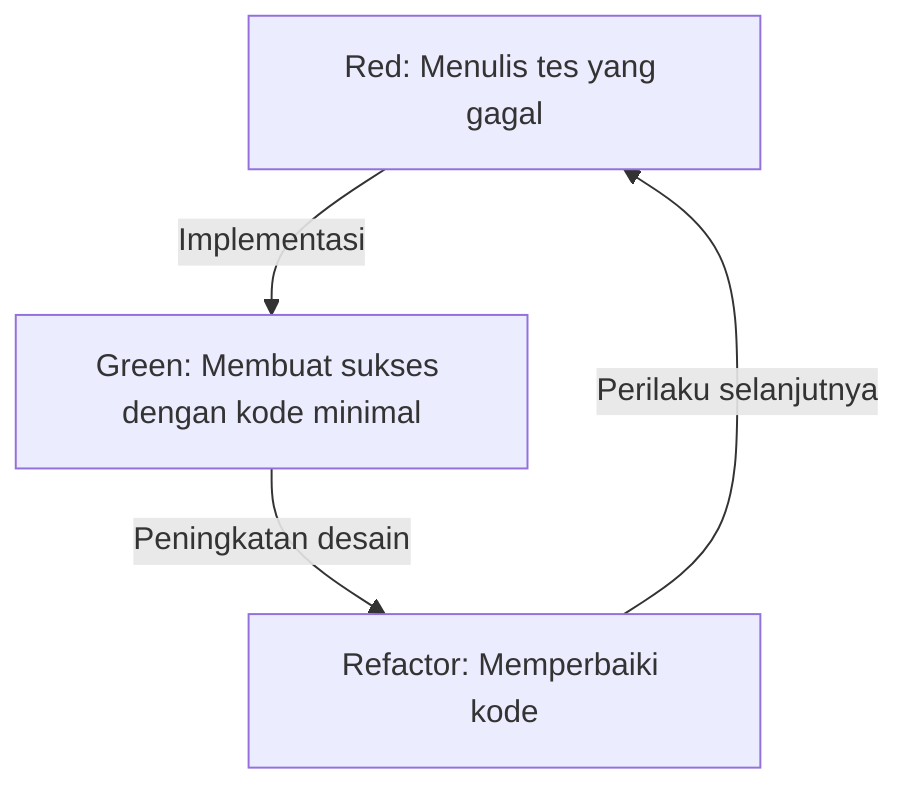
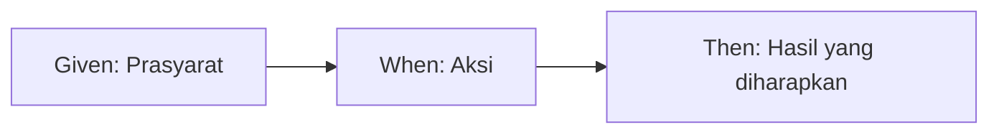

# Tes ditulis bukan untuk menemukan bug, melainkan untuk mendesain

Dalam dunia pengembangan perangkat lunak, kata "tes" atau pengujian sering kali menimbulkan kesalahpahaman. Banyak pengembang, terutama programmer yang kurang berpengalaman atau pemangku kepentingan non-teknis, menganggap pengujian sebagai "tugas untuk memeriksa apakah kode yang sudah selesai berfungsi dengan benar", yaitu bagian dari proses jaminan kualitas (QA) untuk menemukan bug. Namun, dalam filosofi Test-Driven Development (TDD) dan Behavior-Driven Development (BDD), esensi dari pengujian berada di tempat yang sama sekali berbeda.

Tes adalah tindakan desain yang mendefinisikan "bagaimana kode tersebut seharusnya" sebelum kode itu sendiri ditulis.

Artikel ini akan menggali lebih dalam filosofi desain melalui pengujian, mulai dari ide dasar TDD yang dikemukakan oleh Kent Beck, lahirnya BDD oleh Dan North, hingga perdebatan antara aliran Mock (London School) dan aliran State (Chicago School). Tidak hanya sekadar penjelasan teknis, kita akan menyoroti aspek psikologis dan desain yang mendasari alasan mengapa kita menulis tes.

## Kent Beck dan Lahirnya TDD: Tujuan Sejati dari Red-Green-Refactor

Kent Beck, yang menemukan kembali TDD dan memantapkannya sebagai dasar pengembangan perangkat lunak tangkas (agile), menyatakan bahwa tujuan TDD adalah untuk mendapatkan "kode bersih yang berfungsi (Clean code that works)". Proses TDD, seperti yang diketahui secara luas, adalah pengulangan dari tiga langkah berikut:

1. **Red (Merah)**: Menulis tes kecil yang gagal.
2. **Green (Hijau)**: Menulis kode minimal yang membuat tes tersebut lulus.
3. **Refactor (Pemfaktoran Ulang)**: Sambil mempertahankan status lulus tes, menghilangkan duplikasi kode dan menyempurnakan desain.



Mengulang siklus ini secara mekanis sebenarnya tidak sulit. Namun, jebakan yang sering dialami oleh banyak pengembang adalah kehilangan "tujuan sejati" dari siklus ini.

### Mengatasi Rasa Takut (Overcoming Fear)

Dalam bukunya "Test-Driven Development", Kent Beck berulang kali menyebutkan tentang "rasa takut" yang menyertai pemrograman. Saat menangani masalah yang tidak diketahui, atau melakukan perubahan pada kode yang sudah ada dan kompleks, pengembang selalu dihadapkan pada kekhawatiran bahwa "mungkin saya akan merusak sesuatu". Rasa takut ini membuat pengembang bersikap defensif, ragu-ragu untuk memperbaiki kode (refactor), dan pada akhirnya menumpuk utang teknis (technical debt).

Siklus Red-Green-Refactor dalam TDD adalah alat psikologis untuk mengendalikan rasa takut ini. Tes yang gagal (Red) menyajikan tujuan jelas yang harus dicapai selanjutnya. Dengan meluluskan tes tersebut (Green), pengembang mendapatkan umpan balik pasti bahwa mereka "telah maju satu langkah". Dan justru karena ada jaring pengaman tes yang kuat, pemfaktoran ulang (Refactor) yang berani menjadi mungkin. TDD adalah praktik untuk mengubah rasa takut menjadi keyakinan dan membawa kedamaian mental bagi para programmer.

### Penyempurnaan Desain: Mendesain API dari Luar

Aspek penting lainnya dari TDD adalah bahwa tindakan "menulis tes" sama dengan "berdiri di sudut pandang pengguna API". Menulis tes sebelum mengimplementasikan kode berarti mendesain antarmuka, seperti nama kelas, nama metode, struktur argumen, dan tipe nilai kembalian, dengan berhitung mundur dari bentuk yang paling mudah digunakan.

Jika menulis tes belakangan (Test-Last), pengembang cenderung terseret oleh struktur internal yang sudah diimplementasikan. Tes ditulis menyesuaikan dengan kebutuhan implementasi, dan antarmuka yang kurang ramah pengguna menjadi terpatri. TDD membalikkan urutan ini, dengan berfokus bukan pada "bagaimana itu diimplementasikan", tetapi "bagaimana itu seharusnya digunakan". Dengan kata lain, TDD tidak hanya Test-Driven Development, tetapi juga Test-Driven Design (Desain Berbasis Tes).

## Perbedaan Krusial dengan Pengujian Setelahnya (Test-Last)

Pertanyaan, "Bahkan jika itu bukan TDD, bukankah sama saja jika kita menulis unit test belakangan?" hampir selalu dilontarkan saat memperkenalkan TDD. Memang benar, jika kita hanya melihat hasil akhir berupa pasangan "kode tes" dan "kode produk", mungkin tampak tidak ada perbedaan di antara keduanya. Namun, ada perbedaan krusial dalam dampak proses tersebut terhadap desain.

### Memastikan Kemudahan Pengujian (Testability)

Ketika mencoba menulis tes belakangan, kita sering kali menabrak dinding yang disebut "kode ini sulit untuk diuji". Penyebabnya antara lain dependensi yang tergandeng erat (tightly coupled), ketergantungan pada status global, dan akses langsung ke sistem eksternal. Dalam pengujian setelahnya, kita terpaksa memfaktorkan ulang kode yang ada secara paksa untuk menulis tes, atau menggunakan alat mock untuk menulis tes yang rumit dan rapuh.

Di sisi lain, dalam TDD secara prinsip "kode yang tidak dapat diuji" tidak mungkin ada. Ini karena menulis tes adalah prasyarat untuk implementasi. Untuk memudahkan penulisan tes, Injeksi Dependensi (DI) secara alami diadopsi, dan kelas-kelas dipecah sehingga hanya memiliki tanggung jawab tunggal. TDD berfungsi sebagai kompas yang memandu pengembang menuju desain berorientasi objek yang sangat baik, yang memiliki kohesi tinggi dan penggandengan rendah.

### Ilusi Cakupan Kode (Code Coverage)

Dalam pendekatan pengujian setelahnya, "cakupan kode (coverage)" sering dijadikan target. Untuk mencapai target numerik seperti 80% atau 100%, pengembang kadang mulai menulis tes yang tidak berarti (misalnya, tes tanpa pernyataan/assertion) yang hanya sekadar melewati baris kode yang ada. Ini adalah memutarbalikkan prioritas.

Dalam TDD, cakupan kode yang tinggi bukanlah "tujuan", melainkan sekadar "produk sampingan" yang diperoleh sebagai hasil pengembangan berbasis tes. Tes yang ditulis dalam TDD ada bukan untuk mencakup baris implementasi, tetapi untuk mencakup "perilaku" sistem.

## Dua Aliran: Chicago School vs London School

Seiring memasyarakatnya TDD, dua aliran besar muncul mengenai cara menulis tes dan pendekatan terhadap desain. Aliran tersebut adalah Chicago School (atau Classicist/Statist) dan London School (atau Mockist/Outside-In). Memahami perbedaan antara aliran-aliran ini sangat penting untuk mengetahui kedalaman TDD.

### Chicago School (Aliran State/Classicist)

Chicago School adalah pendekatan yang diusulkan oleh Kent Beck, Uncle Bob (Robert C. Martin), dan lainnya, yang bisa dibilang sebagai titik awal TDD. Terkadang ini juga disebut Detroit School.

Karakteristik utama dari aliran ini adalah sebagai berikut:

1. **Pengujian Berbasis Status (State Verification)**: Setelah memanggil metode sebuah objek, "status akhir" dari objek tersebut atau objek kolaboratornya diverifikasi.
2. **Minimisasi Mock**: Menghindari penggunaan mock (Mock) yang berlebihan dan sebisa mungkin melakukan tes menggunakan objek nyata (Real). Mock dibatasi hanya untuk komunikasi dengan batas eksternal (Boundary), seperti basis data atau jaringan, yang membuat tes menjadi lambat atau tidak stabil.
3. **Desain Bottom-Up**: Mulai membangun dari model domain kecil yang merupakan inti sistem, dan secara bertahap menggabungkannya untuk membangun fungsi yang lebih besar (Inside-Out).

Keuntungan dari Chicago School adalah tesnya sangat tahan banting terhadap pemfaktoran ulang (refactoring). Karena tes memverifikasi hanya hasil akhir tanpa bergantung pada detail implementasi internal (metode mana yang dipanggil dalam urutan apa), tes tersebut tidak mudah rusak meskipun struktur internalnya banyak diubah.

### London School (Aliran Mock/Outside-In)

Di sisi lain, London School adalah pendekatan yang dibangun oleh Steve Freeman dan Nat Pryce (penulis "Growing Object-Oriented Software, Guided by Tests") dan lainnya di komunitas pengembangan sekitar London.

1. **Pengujian Berbasis Perilaku (Behavior Verification)**: Secara aktif menggunakan objek mock (Mock), dan memverifikasi interaksi (Interaction) dari objek yang diuji, yaitu "metode mana dari objek yang bergantung, dan dengan argumen apa itu dipanggil".
2. **Desain Outside-In**: Mulai mendesain dari lapisan terluar sistem, seperti antarmuka pengguna atau pengontrol (controller), lalu secara bertahap masuk ke logika domain internal sambil mendefinisikan antarmuka objek dependensi yang diperlukan sebagai mock.
3. **Pemisahan Ketat**: Dengan mem-mock semua hal kecuali kelas yang sedang diuji, lokasi penyebab (Defect Localization) saat tes gagal dapat diidentifikasi dengan sangat akurat.

Keuntungan dari London School adalah mempercepat penemuan antarmuka selama proses desain. Memikirkan peran yang dibutuhkan secara top-down, dan mendesain protokol (aturan komunikasi) antarabjek melalui mock. Namun, ada kritik bahwa tes ini mudah rusak selama refactoring (Fragile Tests) karena tes terikat erat dengan detail implementasi.

Bukan berarti yang satu lebih superior dari yang lain. Yang terpenting adalah mampu memilih pendekatan yang tepat, tergantung pada karakteristik sistem dan fase desain.

## Dan North dan Lahirnya BDD: Kata-kata Membentuk Pikiran

TDD adalah metode yang kuat, tetapi ada satu kendala besar dalam penyebaran dan pendidikannya. Itu adalah nuansa bernada QA yang dibawa oleh kata "Test" itu sendiri.

Pada pertengahan tahun 2000-an, saat mengajarkan TDD kepada para pengembang, Dan North selalu dihadapkan pada pertanyaan seperti "Apa yang harus diuji?", "Apa nama tesnya?", dan "Mengapa tesnya gagal?". Terseret oleh kata "tes", pengembang terpaku pada detail implementasi tingkat rendah, seperti operasi internal metode atau memeriksa keberadaan catatan (record) basis data.

Oleh karena itu, Dan North mengusulkan perubahan paradigma yang revolusioner. Membuang kata "Test" dan menggantinya dengan kata "Behavior (Perilaku)". Inilah awal mula Behavior-Driven Development (BDD).

### Dari "Test" ke "Should"

Langkah pertama menuju BDD adalah mengubah awal nama metode pengujian dari `test~` menjadi `should~`.
Contohnya, bukannya menamai `testCalculateDiscount`, melainkan `shouldApplyTenPercentDiscountForVipCustomers`.

Perubahan kata yang kecil ini membawa perubahan dramatis dalam pemikiran pengembang. Fokusnya bergeser dari "bagaimana menguji metode ini" ke persyaratan bisnis "bagaimana sistem ini seharusnya berperilaku (should do)".

### JBehave dan Penemuan Given-When-Then

Lebih lanjut, Dan North merasakan perlunya Domain Specific Language (DSL) untuk mendeskripsikan perilaku, sehingga ia mengembangkan kerangka kerja bernama JBehave. Di sinilah template **Given-When-Then** diadopsi, yang kini identik dengan BDD.

* **Given (Prasyarat)**: Diberikan konteks atau status awal tertentu
* **When (Aksi)**: Ketika tindakan atau peristiwa tertentu terjadi
* **Then (Hasil)**: Sebagai hasilnya, status seperti apa yang seharusnya tercapai, atau perilaku apa yang seharusnya terjadi



Format ini bukan sekadar sintaksis pemrograman. Ini menjadi fondasi dari Bahasa Ubiquitous (Ubiquitous Language) di mana analis bisnis (BA), pakar domain, tester, dan pengembang berdialog mengenai persyaratan sistem menggunakan bahasa yang sama.

## Menjembatani Kesenjangan Antara Persyaratan Bisnis dan Kode

Dalam pengembangan perangkat lunak tradisional, selalu ada jurang yang dalam dan gelap antara dokumen definisi persyaratan bisnis (bahasa alami yang ditulis di Word atau Excel) dan kode yang ditulis oleh programmer. Dokumen definisi persyaratan dengan cepat menjadi usang, dan satu-satunya cara untuk mengetahui bagaimana sistem sebenarnya beroperasi adalah programmer harus menguraikan kodenya.

BDD menjembatani kesenjangan ini dengan konsep Spesifikasi yang Dapat Dieksekusi (Executable Specification). Menggunakan alat BDD seperti Cucumber, persyaratan teks biasa (file fitur/feature file) yang ditulis dalam Given-When-Then dapat langsung dieksekusi sebagai kode tes.

```gherkin
Feature: Fitur diskon keranjang belanja
  Diskon yang tepat harus diterapkan ketika pelanggan VIP membeli barang dalam jumlah besar.

  Scenario: Penerapan diskon 10% untuk pelanggan VIP
    Given Pengguna "Kenji" adalah pelanggan "VIP"
    And Keranjang "Kenji" sudah berisi barang senilai 5000 yen
    When "Kenji" menambahkan "keyboard premium" seharga 6000 yen ke keranjang
    Then Total harga keranjang menjadi 9900 yen, bukan 11000 yen
```

File fitur ini dapat dibaca oleh orang non-teknis, dengan akurat mengekspresikan niat bisnis. Pada saat yang sama, ini dieksekusi dalam pipa CI/CD sebagai tes otomatis, terus-menerus membuktikan bahwa sistem beroperasi sesuai spesifikasi ini. Integrasi dokumen definisi persyaratan dengan kode tes mewujudkan sebuah "Dokumen Hidup (Living Documentation)".

## Kesimpulan: Mengubah Rasa Takut Menjadi Keyakinan, Ketidakpastian Menjadi Desain

Test-Driven Development (TDD) dan Behavior-Driven Development (BDD) bukan sekadar teknik otomasi tes. Ini adalah filosofi yang sangat halus untuk mengatasi kesulitan mendasar dalam pengembangan perangkat lunak——yaitu rasa takut terhadap perubahan, dan kesenjangan komunikasi antara persyaratan dan implementasi.

TDD membebaskan pengembang dari rasa takut melalui siklus Red-Green-Refactor, dan mendesain kode dengan indah dari dalam ke luar. Persaingan serta peleburan antara Chicago School dan London School mengajarkan kita tentang keragaman pendekatan dalam desain berorientasi objek.
Dan BDD, dengan menyediakan bahasa umum Given-When-Then, melarutkan batas antara bisnis dan pengembangan, memungkinkan seluruh sistem bergerak lurus menuju tujuan aslinya (Behavior).

Kita menulis tes bukan untuk menemukan bug.
Untuk dapat memodifikasi kode dengan percaya diri esok hari, dan untuk menciptakan desain indah yang memenuhi kebutuhan bisnis yang sebenarnya, kita terus menggambar "cetak biru desain" yang bernama tes.
