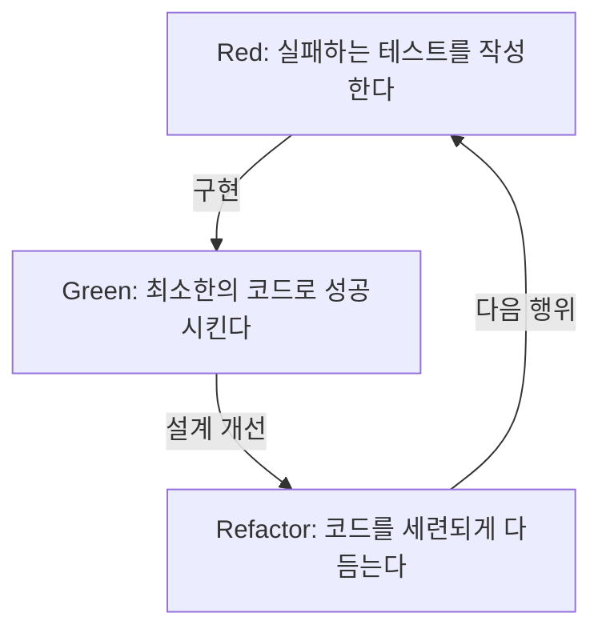
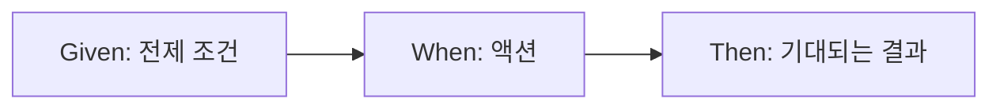

# 테스트는 버그를 찾기 위해서가 아니라, 설계하기 위해 작성하는 것이다

소프트웨어 개발의 세계에서 '테스트'라는 단어는 종종 오해를 불러일으킨다. 많은 개발자, 특히 경험이 부족한 프로그래머나 비기술자인 이해관계자는 테스트를 '완성된 코드가 올바르게 동작하는지 확인하기 위한 작업', 즉 버그를 찾기 위한 품질 보증(QA) 프로세스의 일부라고 생각한다. 하지만 테스트 주도 개발(TDD)과 행위 주도 개발(BDD)의 철학에서 테스트의 본질은 전혀 다른 곳에 있다.

테스트는 코드를 작성하기 전에 '그 코드가 어떠해야 하는가'를 정의하는 설계 행위이다.

본고에서는 켄트 벡(Kent Beck)이 제창한 TDD의 근원적인 사상부터 댄 노스(Dan North)에 의한 BDD의 탄생, 그리고 모의 객체 주의(London School)와 상태 주의(Chicago School)의 대립까지, 테스트를 통한 설계의 철학을 깊이 파고든다. 단순한 기술적인 해설에 그치지 않고, 왜 우리가 테스트를 작성하는지 그 근저에 있는 심리적, 설계적 측면을 조명한다.

## Kent Beck과 TDD의 탄생: Red-Green-Refactor의 진정한 목적

테스트 주도 개발(TDD)을 재발견하고 애자일 소프트웨어 개발의 기반으로 확립한 Kent Beck은 TDD의 목적을 '동작하는 깔끔한 코드(Clean code that works)'를 얻는 것이라고 말한다. TDD 프로세스는 널리 알려진 대로 다음 세 가지 단계의 반복이다.

1. **Red(빨강)**: 실패하는 작은 테스트를 작성한다.
2. **Green(초록)**: 그 테스트를 통과하는 최소한의 코드를 작성한다.
3. **Refactor(리팩터링)**: 테스트가 통과하는 상태를 유지하면서, 코드의 중복을 제거하고 설계를 세련되게 다듬는다.



이 사이클을 기계적으로 반복하는 것 자체는 어렵지 않다. 그러나 많은 개발자가 빠지는 함정은 이 사이클의 '진정한 목적'을 잃어버리는 것이다.

### 불안의 해소 (Overcoming Fear)

Kent Beck은 저서 『테스트 주도 개발』에서 프로그래밍에 수반되는 '불안'에 대해 반복해서 언급하고 있다. 미지의 문제에 대처할 때, 혹은 복잡한 기존 코드에 변경을 가할 때, 개발자는 항상 '무언가를 망가뜨리는 것은 아닐까' 하는 불안에 직면한다. 이 불안은 개발자를 방어적으로 만들고, 코드의 개선(리팩터링)을 주저하게 하며, 결과적으로 기술 부채를 축적시킨다.

TDD에서의 Red-Green-Refactor 사이클은 이 불안을 통제하기 위한 심리적 도구이다. 실패하는 테스트(Red)는 다음에 달성해야 할 명확한 목표를 제시한다. 그 테스트를 통과시킴(Green)으로써 개발자는 '한 걸음 전진했다'는 확실한 피드백을 얻는다. 그리고 견고한 테스트 안전망이 있기 때문에 과감한 리팩터링(Refactor)이 가능해진다. TDD는 불안을 확신으로 바꾸고, 프로그래머에게 정신적 평온을 가져다주기 위한 프랙티스인 것이다.

### 설계의 세련화: API를 바깥에서부터 디자인하기

TDD의 또 다른 중요한 측면은 '테스트를 작성한다'는 행위가 곧 'API 사용자의 관점에 선다'는 것을 의미한다는 점이다. 코드를 구현하기 전에 테스트를 작성한다는 것은 클래스 이름, 메서드 이름, 인수 구성, 반환값 타입과 같은 인터페이스를 가장 사용하기 쉬운 형태에서 역산하여 설계하는 것을 의미한다.

테스트를 나중에 작성하는 경우(Test-Last), 개발자는 이미 구현된 내부 구조에 끌려가기 쉽다. 구현의 편의에 맞춰 테스트가 작성되고, 사용하기 불편한 인터페이스가 고정되어 버린다. TDD는 이 순서를 뒤집음으로써 '어떻게 구현되어 있는가'가 아니라 '어떻게 사용되어야 하는가'에 초점을 맞춘다. 즉, TDD는 Test-Driven Development인 동시에 Test-Driven Design(테스트 주도 설계)이기도 하다.

## 사후 테스트(Test-Last)와의 결정적인 차이

'TDD가 아니더라도 나중에 단위 테스트를 작성하면 같은 것 아닌가?' 하는 의문은 TDD 도입 시에 거의 반드시 던져진다. 확실히 최종적으로 얻어지는 '테스트 코드'와 '프로덕션 코드'의 쌍이라는 결과만 보면 양쪽의 차이가 없는 것처럼 보일 수 있다. 그러나 그 프로세스가 가져오는 설계에 대한 영향에는 결정적인 차이가 있다.

### 테스트 용이성(Testability) 확보

테스트를 나중에 작성하려고 하면 종종 '이 코드는 테스트하기 어렵다'는 장벽에 부딪힌다. 강결합된 의존 관계, 전역 상태에 대한 의존, 외부 시스템에 대한 직접적인 접근 등이 원인이다. 사후 테스트에서는 테스트를 작성하기 위해 기존 코드를 억지로 리팩터링하거나, 모의 도구(Mock)를 구사하여 복잡하고 깨지기 쉬운 테스트를 작성하게 된다.

반면, TDD에서는 '테스트 불가능한 코드'는 원리적으로 존재할 수 없다. 왜냐하면 테스트를 작성하는 것이 구현의 전제 조건이기 때문이다. 테스트를 작성하기 쉽게 만들기 위해 자연스럽게 의존성 주입(DI)이 채택되고, 클래스는 단일 책임을 갖도록 분할된다. TDD는 높은 응집도와 낮은 결합도를 가진 뛰어난 객체 지향 설계로 개발자를 이끄는 나침반 역할을 한다.

### 코드 커버리지의 환상

사후 테스트 접근법에서는 종종 '코드 커버리지(테스트 커버리지)'가 목표가 된다. 80%나 100%와 같은 수치 목표를 달성하기 위해, 개발자는 기존 코드의 라인을 통과시키기만 하는 의미 없는 테스트(단언(Assertion)이 없는 테스트 등)를 작성하기 시작하는 경우가 있다. 이는 주객이 전도된 것이다.

TDD에서 높은 코드 커버리지는 '목적'이 아니라, 테스트를 주도한 개발의 결과로 얻어지는 '부산물'에 불과하다. TDD로 작성된 테스트는 구현의 라인을 망라하기 위해서가 아니라 시스템의 '행위(Behavior)'를 망라하기 위해 존재한다.

## 두 가지 유파: Chicago School vs London School

TDD가 널리 보급되면서 테스트 작성 방식과 설계에 대한 접근법에 대해 크게 두 가지 유파가 생겨났다. 바로 Chicago School(또는 Classicist/Statist)과 London School(또는 Mockist/Outside-In)이다. 이 유파들의 차이를 이해하는 것은 TDD의 깊이를 아는 데 매우 중요하다.

### Chicago School (상태주의・클래시컬리스트)

Chicago School은 Kent Beck이나 Uncle Bob (Robert C. Martin) 등이 제창한, TDD의 원점이라고도 할 수 있는 접근법이다. Detroit School이라고 불리기도 한다.

이 유파의 주요 특징은 다음과 같다.

1. **상태 기반 테스트 (State Verification)**: 객체의 메서드를 호출한 후, 해당 객체나 협력 객체의 '최종적인 상태'를 검증한다.
2. **모의 객체의 최소화**: 모의 객체(Mock)의 과도한 사용을 피하고, 가능한 한 실제(Real) 객체를 사용하여 테스트를 수행한다. 모의 객체는 데이터베이스나 네트워크 등, 테스트를 느리게 하거나 불안정하게 만드는 외부 경계(Boundary)와의 통신에만 한정한다.
3. **상향식 설계 (Bottom-Up)**: 시스템의 핵심이 되는 작은 도메인 모델부터 만들기 시작하여, 점진적으로 그것들을 조합해 큰 기능을 만들어간다 (Inside-Out).

Chicago School의 장점은 테스트가 리팩터링에 대해 매우 견고하다는 것이다. 내부 구현의 세부 사항(어떤 메서드가 어떤 순서로 호출되는지)에 의존하지 않고 최종적인 결과만을 검증하기 때문에, 내부 구조를 크게 변경해도 테스트가 잘 깨지지 않는다.

### London School (모의 객체주의・아웃사이드 인)

반면, London School은 Steve Freeman과 Nat Pryce(『테스트 주도 개발로 배우는 객체 지향 설계와 실천』의 저자) 등이 런던 주변의 개발 커뮤니티에서 확립한 접근법이다.

1. **행위 기반 테스트 (Behavior Verification)**: 모의 객체(Mock)를 적극적으로 사용하며, 테스트 대상 객체가 의존하는 객체의 '어떤 메서드를, 어떤 인수로 호출했는지'하는 상호작용(Interaction)을 검증한다.
2. **Outside-In 설계**: 사용자 인터페이스나 컨트롤러 같은 시스템의 바깥쪽 계층부터 설계를 시작하여, 필요한 의존 객체의 인터페이스를 모의 객체로 정의해가며 점진적으로 안쪽의 도메인 로직으로 나아간다.
3. **엄격한 격리**: 테스트 대상 클래스 이외의 모든 것을 모의 객체화함으로써, 테스트가 실패했을 때 원인 위치(Defect Localization)를 매우 정확하게 특정할 수 있다.

London School의 장점은 설계 과정에서 인터페이스의 발견이 촉진된다는 점이다. 하향식으로 필요한 역할을 생각하고, 모의 객체를 통해 객체 간의 프로토콜(통신 규약)을 설계해 나간다. 그러나 구현의 세부 사항에 테스트가 강하게 결합하기 쉽기 때문에 리팩터링 시에 테스트가 깨지기 쉽다(Fragile Tests)는 비판도 존재한다.

어느 유파가 더 우수하다고 단순하게 말할 수 있는 것이 아니다. 중요한 것은 시스템의 특징이나 설계 단계에 따라 적절한 접근법을 선택할 수 있다는 것이다.

## Dan North와 BDD의 탄생: 언어가 사고를 형성한다

TDD는 강력한 기법이지만, 그 보급과 교육에 있어 하나의 큰 장벽이 있었다. 그것은 'Test'라는 단어 자체가 가진 QA적인 뉘앙스이다.

2000년대 중반, Dan North는 개발자들에게 TDD를 가르치면서 '무엇을 테스트해야 하는가', '테스트 이름을 어떻게 지어야 하는가', '왜 테스트가 실패했는가'와 같은 질문에 항상 직면했다. 개발자들은 '테스트'라는 단어에 끌려가 메서드의 내부 동작이나 데이터베이스의 레코드 존재 확인과 같은 저수준의 구현 세부 사항에 집착하고 있었던 것이다.

그래서 Dan North는 획기적인 패러다임 전환을 제안했다. 'Test'라는 단어를 버리고 'Behavior(행위)'라는 단어로 대체하는 것이다. 이것이 행위 주도 개발(BDD: Behavior-Driven Development)의 탄생이다.

### 'Test'에서 'Should'로

BDD로 향하는 첫걸음은 테스트 메서드의 이름을 `test~`에서 `should~`로 시작하도록 바꾸는 것이었다.
예를 들어, `testCalculateDiscount`가 아니라 `shouldApplyTenPercentDiscountForVipCustomers`처럼 명명한다.

이 작은 단어의 변경이 개발자의 사고에 극적인 변화를 가져왔다. '이 메서드를 어떻게 테스트할 것인가'가 아니라 '이 시스템은 어떻게 행동해야 하는가(should do)'라는 비즈니스 요구사항에 초점이 맞춰진 것이다.

### JBehave와 Given-When-Then의 발견

Dan North는 더 나아가 행위를 기술하기 위한 도메인 특화 언어(DSL)의 필요성을 느끼고, JBehave라는 프레임워크를 개발했다. 거기서 채택된 것이 지금은 BDD의 대명사라고 할 수 있는 **Given-When-Then** 템플릿이다.

* **Given (조건)**: 어떤 문맥이나 초기 상태가 주어졌을 때
* **When (행위)**: 어떠한 액션이나 이벤트가 발생하고
* **Then (결과)**: 그 결과, 어떤 상태가 되어야 하는지, 혹은 어떤 행위가 일어나야 하는지



이 형식은 단순한 프로그래밍 구문이 아니다. 이것은 비즈니스 분석가(BA), 도메인 전문가, 테스터, 그리고 개발자가 동일한 언어로 시스템의 요구사항에 대해 대화하기 위한 유비쿼터스 언어(Ubiquitous Language)의 기반이 되었다.

## 비즈니스 요구사항과 코드의 괴리를 메우다

기존 소프트웨어 개발에서는 비즈니스의 요구사항 정의서(Word나 Excel로 작성된 자연어)와 프로그래머가 작성하는 코드 사이에 깊고 어두운 틈이 존재했다. 요구사항 정의서는 금세 진부화되며, 실제 시스템이 어떻게 동작하고 있는지 알기 위해서는 프로그래머가 코드를 해독하는 수밖에 없었다.

BDD는 실행 가능한 명세(Executable Specification)라는 개념을 통해 이 괴리를 메운다. Cucumber 등의 BDD 도구를 사용하면, Given-When-Then으로 작성된 일반 텍스트 요구사항(피처 파일)을 직접 테스트 코드로 실행할 수 있다.

```gherkin
Feature: 쇼핑 카트 할인 기능
  VIP 고객이 상품을 대량으로 구매했을 때, 적절한 할인이 적용되어야 한다.

  Scenario: VIP 고객에게 10% 할인 적용
    Given 사용자 "Kenji"는 "VIP" 고객이다
    And "Kenji"의 카트에는 이미 5000원 상당의 상품이 있다
    When "Kenji"가 6000원짜리 "고급 키보드"를 카트에 추가한다
    Then 카트의 합계 금액은 11000원이 아니라 9900원이 되어야 한다
```

이 피처 파일은 비기술자도 읽을 수 있으며, 비즈니스의 의도를 정확하게 표현하고 정하고 있다. 동시에 이것은 자동화된 테스트로서 CI/CD 파이프라인에서 실행되며, 시스템이 이 명세대로 움직이고 있다는 것을 항상 계속해서 증명한다. 요구사항 정의서와 테스트 코드가 일체화됨으로써 '살아있는 문서(Living Documentation)'가 실현되는 것이다.

## 결론: 불안을 확신으로, 불확실성을 설계로 바꾸다

테스트 주도 개발(TDD)과 행위 주도 개발(BDD)은 단순한 테스트 자동화 기법이 아니다. 이것들은 소프트웨어 개발에 있어서 근본적인 어려움, 즉 변화에 대한 불안과 요구사항 및 구현 간의 커뮤니케이션 격차에 대처하기 위한 깊고 세련된 철학이다.

TDD는 Red-Green-Refactor 사이클을 통해 개발자를 불안에서 해방시키고, 코드를 내부에서부터 아름답게 설계한다. Chicago School과 London School의 대립과 융합은 객체 지향 설계의 다양한 접근법을 우리에게 가르쳐 준다.
그리고 BDD는 Given-When-Then이라는 공통 언어를 제공함으로써 비즈니스와 개발의 경계를 허물고, 시스템 전체가 본래의 목적(Behavior)을 향해 일직선으로 나아가는 것을 가능하게 한다.

우리가 테스트를 작성하는 것은 버그를 찾기 위해서가 아니다.
내일도 자신감을 갖고 코드를 변경하고, 비즈니스의 진정한 요구에 부응하는 아름다운 설계를 만들어내기 위해, 우리는 테스트라는 이름의 '설계 청사진'을 계속해서 그려나가는 것이다.
