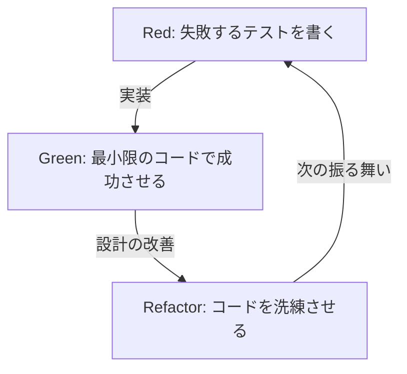
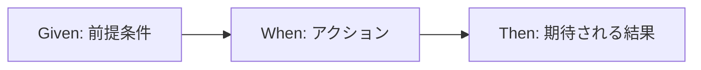

# テストはバグを見つけるためではなく、設計するために書く

ソフトウェア開発の世界において、「テスト」という言葉はしばしば誤解を招く。多くの開発者、特に経験の浅いプログラマーや非技術者のステークホルダーは、テストを「完成したコードが正しく動くかを確認するための作業」、すなわちバグを見つけるための品質保証（QA）プロセスの一部であると考えている。しかし、テスト駆動開発（TDD）やビヘイビア駆動開発（BDD）の哲学において、テストの本質は全く異なる場所にある。

テストは、コードを書く前に「そのコードがどうあるべきか」を定義する設計行為である。

本稿では、Kent Beckによって提唱されたTDDの根源的な思想から、Dan NorthによるBDDの誕生、そしてモック主義（London School）と状態主義（Chicago School）の対立まで、テストを通じた設計の哲学を深く掘り下げていく。単なる技術的な解説にとどまらず、なぜ我々がテストを書くのか、その根底にある心理的、設計的側面に光を当てる。

## Kent BeckとTDDの誕生：Red-Green-Refactorの真の目的

テスト駆動開発（TDD）を再発見し、アジャイルソフトウェア開発の基盤として確立したKent Beckは、TDDの目的を「動作するきれいなコード（Clean code that works）」を得ることだとしている。TDDのプロセスは、広く知られているように以下の3つのステップの反復である。

1. **Red（赤）**: 失敗する小さなテストを書く。
2. **Green（緑）**: そのテストを通過する最小限のコードを書く。
3. **Refactor（リファクタリング）**: テストが通過する状態を保ちながら、コードの重複を排除し、設計を洗練させる。



このサイクルを機械的に繰り返すこと自体は難しくない。しかし、多くの開発者が陥る罠は、このサイクルの「真の目的」を見失うことである。

### 不安の解消（Overcoming Fear）

Kent Beckは著書『テスト駆動開発』の中で、プログラミングに伴う「不安」について繰り返し言及している。未知の問題に取り組むとき、あるいは複雑な既存コードに変更を加えるとき、開発者は常に「何かを壊してしまうのではないか」という不安に直面する。この不安は、開発者を防衛的にし、コードの改善（リファクタリング）を躊躇させ、結果として技術的負債を蓄積させる。

TDDにおけるRed-Green-Refactorサイクルは、この不安をコントロールするための心理的ツールである。失敗するテスト（Red）は、次に達成すべき明確なゴールを提示する。そのテストを通過させる（Green）ことで、開発者は「一歩前進した」という確かなフィードバックを得る。そして、強固なテストの保護網があるからこそ、大胆なリファクタリング（Refactor）が可能になる。TDDは、不安を確信に変え、プログラマーに精神的な平穏をもたらすためのプラクティスなのである。

### 設計の洗練：APIを外側からデザインする

TDDのもう一つの重要な側面は、「テストを書く」という行為が、すなわち「APIの利用者の視点に立つ」ということである。コードを実装する前にテストを書くということは、クラス名、メソッド名、引数の構成、戻り値の型といったインターフェースを、最も使いやすい形から逆算して設計することを意味する。

テストを後から書く場合（Test-Last）、開発者はすでに実装された内部構造に引きずられがちである。実装の都合に合わせてテストが書かれ、使い勝手の悪いインターフェースが固定化されてしまう。TDDは、この順序を逆転させることで、「どのように実装されているか」ではなく「どのように使われるべきか」に焦点を当てる。つまり、TDDとはTest-Driven Developmentであると同時に、Test-Driven Design（テスト駆動設計）でもあるのだ。

## 事後テスト（Test-Last）との決定的な違い

「TDDでなくても、後からユニットテストを書けば同じではないか？」という疑問は、TDDの導入時に必ずと言っていいほど投げかけられる。確かに、最終的に得られる「テストコード」と「プロダクトコード」のペアという結果だけを見れば、両者に違いはないように思えるかもしれない。しかし、そのプロセスがもたらす設計への影響には決定的な違いがある。

### テスト容易性（Testability）の確保

テストを後から書こうとすると、しばしば「このコードはテストが難しい」という壁にぶつかる。密結合な依存関係、グローバルな状態への依存、外部システムへの直接的なアクセスなどが原因である。事後テストでは、テストを書くために既存のコードを無理やりリファクタリングするか、あるいはモックツールを駆使して複雑で脆いテストを書く羽目になる。

一方、TDDでは「テストできないコード」は原理的に存在し得ない。なぜなら、テストを書くことが実装の前提条件だからだ。テストを書きやすくするために、自然と依存関係の注入（DI）が採用され、クラスは単一の責務を持つように分割される。TDDは、高い凝集度と低い結合度を持つ、優れたオブジェクト指向設計へと開発者を導く羅針盤として機能する。

### コードカバレッジの幻想

事後テストのアプローチでは、しばしば「コードカバレッジ（網羅率）」が目標とされる。80%や100%といった数値目標を達成するために、開発者は既存のコードの行を通過させるだけの、意味のないテスト（アサーションのないテストなど）を書き始めることがある。これは本末転倒である。

TDDにおいて、高いコードカバレッジは「目的」ではなく、テストを駆動とした開発の結果として得られる「副産物」に過ぎない。TDDで書かれたテストは、実装の行を網羅するためではなく、システムの「振る舞い」を網羅するために存在する。

## 二つの流派：Chicago School vs London School

TDDが普及していく中で、テストの書き方や設計に対するアプローチについて、大きく二つの流派が生まれた。それが、Chicago School（またはClassicist/Statist）とLondon School（またはMockist/Outside-In）である。これらの流派の違いを理解することは、TDDの奥深さを知る上で非常に重要である。

### Chicago School（状態主義・クラシカリスト）

Chicago Schoolは、Kent BeckやUncle Bob (Robert C. Martin) らが提唱した、TDDの原点とも言えるアプローチである。Detroit Schoolと呼ばれることもある。

この流派の主な特徴は以下の通りである。

1. **状態ベースのテスト（State Verification）**: オブジェクトのメソッドを呼び出した後、そのオブジェクトや協力オブジェクトの「最終的な状態」を検証する。
2. **モックの最小化**: モック（Mock）の過度な使用を避け、可能な限り実際の本物（Real）のオブジェクトを使用してテストを行う。モックは、データベースやネットワークなど、テストを遅くしたり不安定にしたりする外部の境界（Boundary）との通信にのみ限定する。
3. **ボトムアップの設計**: システムの核となる小さなドメインモデルから作り始め、徐々にそれらを組み合わせて大きな機能を作り上げる（Inside-Out）。

Chicago Schoolの利点は、テストがリファクタリングに対して非常に堅牢であることだ。内部の実装詳細（どのメソッドがどの順番で呼ばれるか）に依存せず、最終的な結果のみを検証するため、内部構造を大きく変更してもテストが壊れにくい。

### London School（モック主義・アウトサイドイン）

一方、London Schoolは、Steve FreemanやNat Pryce（『実践テスト駆動開発』の著者）らがロンドン周辺の開発コミュニティで確立したアプローチである。

1. **振る舞いベースのテスト（Behavior Verification）**: モックオブジェクト（Mock）を積極的に使用し、テスト対象のオブジェクトが、依存するオブジェクトの「どのメソッドを、どのような引数で呼び出したか」という相互作用（Interaction）を検証する。
2. **Outside-Inの設計**: ユーザーインターフェースやコントローラーといったシステムの外側のレイヤーから設計を始め、必要な依存オブジェクトのインターフェースをモックとして定義しながら、徐々に内側のドメインロジックへと進んでいく。
3. **厳密な分離**: テスト対象のクラス以外のすべてをモック化することで、テストが失敗した際の原因箇所（Defect Localization）を極めて正確に特定できる。

London Schoolの利点は、設計のプロセスにおいてインターフェースの発見が促進されることである。トップダウンで必要な役割を考え、モックを通じてオブジェクト間のプロトコル（通信規約）を設計していく。しかし、実装の詳細にテストが強く結合しやすいため、リファクタリング時にテストが壊れやすい（Fragile Tests）という批判も存在する。

どちらの流派が優れているという単純なものではない。重要なのは、システムの特徴や設計のフェーズに応じて、適切なアプローチを選択できることである。

## Dan NorthとBDDの誕生：言葉が思考を形作る

TDDは強力な手法であるが、その普及と教育において一つの大きな壁があった。それは「Test」という言葉そのものが持つ、QA的なニュアンスである。

2000年代半ば、Dan Northは開発者にTDDを教える中で、「何をテストすべきか」「テストをなんと命名すべきか」「なぜテストが失敗したのか」といった質問に常に直面していた。開発者は「テスト」という言葉に引きずられ、メソッドの内部動作やデータベースのレコードの存在確認といった、低レベルな実装詳細に固執してしまっていたのである。

そこでDan Northは、ある画期的なパラダイムシフトを提案した。「Test」という言葉を捨て、「Behavior（振る舞い）」という言葉に置き換えることである。これがビヘイビア駆動開発（BDD: Behavior-Driven Development）の誕生である。

### 「Test」から「Should」へ

BDDへの最初の一歩は、テストメソッドの名前を `test~` から `should~` で始めるように変えることだった。
例えば、`testCalculateDiscount` ではなく、`shouldApplyTenPercentDiscountForVipCustomers` のように命名する。

この小さな言葉の変更が、開発者の思考に劇的な変化をもたらした。「このメソッドをどうテストするか」ではなく、「このシステムはどう振る舞うべきか（should do）」というビジネスの要件に焦点が当たるようになったのである。

### JBehaveとGiven-When-Thenの発見

Dan Northはさらに、振る舞いを記述するためのドメイン特化言語（DSL）の必要性を感じ、JBehaveというフレームワークを開発した。そこで採用されたのが、今やBDDの代名詞とも言える **Given-When-Then** のテンプレートである。

* **Given（前提）**: ある文脈や初期状態が与えられたとき
* **When（操作）**: 何らかのアクションやイベントが発生し
* **Then（結果）**: その結果、どのような状態になるべきか、あるいはどのような振る舞いが起こるべきか



このフォーマットは、単なるプログラミングの構文ではない。これは、ビジネスアナリスト（BA）、ドメインエキスパート、テスター、そして開発者が、同じ言葉でシステムの要件について対話するためのユビキタス言語（Ubiquitous Language）の基盤となった。

## ビジネス要件とコードの乖離を埋める

従来のソフトウェア開発では、ビジネスの要件定義書（WordやExcelで書かれた自然言語）と、プログラマーが書くコードの間には、深く暗い溝が存在していた。要件定義書はすぐに陳腐化し、実際のシステムがどう動いているのかを知るには、プログラマーがコードを解読するしかなかった。

BDDは、実行可能な仕様書（Executable Specification）という概念によって、この乖離を埋める。CucumberなどのBDDツールを使用すると、Given-When-Thenで書かれたプレーンテキストの要件（フィーチャーファイル）を、直接テストコードとして実行することができる。

```gherkin
Feature: ショッピングカートの割引機能
  VIP顧客が商品を大量に購入した際に、適切な割引が適用されること。

  Scenario: VIP顧客への10%割引の適用
    Given ユーザー "Kenji" は "VIP" 顧客である
    And "Kenji" のカートにはすでに 5000 円分の商品がある
    When "Kenji" が 6000 円の "高級キーボード" をカートに追加する
    Then カートの合計金額は 11000 円ではなく 9900 円になること
```

このフィーチャーファイルは、非技術者でも読むことができ、ビジネスの意図を正確に表現している。同時に、これは自動化されたテストとしてCI/CDパイプラインで実行され、システムがこの仕様通りに動いていることを常に証明し続ける。要件定義書とテストコードが一体化することで、「生きたドキュメント（Living Documentation）」が実現されるのである。

## 結論：不安を確信に、不確実性を設計に変える

テスト駆動開発（TDD）とビヘイビア駆動開発（BDD）は、単なるテスト自動化のテクニックではない。これらは、ソフトウェア開発における根本的な困難——すなわち、変化に対する不安と、要件と実装の間のコミュニケーションギャップ——に対処するための、深く洗練された哲学である。

TDDは、Red-Green-Refactorのサイクルを通じて開発者を不安から解放し、コードを内側から美しく設計する。Chicago SchoolとLondon Schoolの対立と融合は、オブジェクト指向設計の多様なアプローチを我々に教えてくれる。
そしてBDDは、Given-When-Thenという共通言語を提供することで、ビジネスと開発の境界を溶かし、システム全体が本来の目的（Behavior）に向かって一直線に進むことを可能にする。

我々がテストを書くのは、バグを見つけるためではない。
明日も自信を持ってコードを変更し、ビジネスの真の要求に応える美しい設計を生み出すために、我々はテストという名の「設計の青写真」を描き続けるのである。
