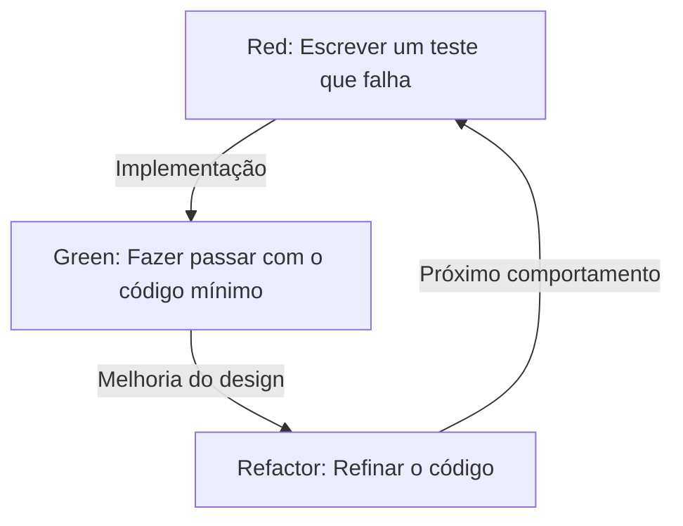
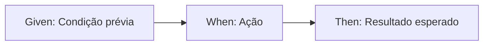

# Testes não são escritos para encontrar bugs, mas para projetar

No mundo do desenvolvimento de software, a palavra "teste" costuma causar mal-entendidos. Muitos desenvolvedores, especialmente programadores inexperientes e stakeholders não técnicos, consideram os testes como "um trabalho para verificar se o código concluído funciona corretamente", ou seja, parte de um processo de garantia de qualidade (QA) para encontrar bugs. No entanto, na filosofia do Desenvolvimento Orientado a Testes (TDD) e do Desenvolvimento Orientado a Comportamento (BDD), a essência dos testes está em um lugar completamente diferente.

Os testes são uma atividade de design que define "como o código deve ser" antes de escrevê-lo.

Neste artigo, aprofundaremos a filosofia de design através dos testes, desde a ideia fundamental do TDD proposta por Kent Beck, até o nascimento do BDD por Dan North, e o conflito entre o Mockism (London School) e o Statism (Chicago School). Mais do que uma simples explicação técnica, lançaremos luz sobre os aspectos psicológicos e de design subjacentes à razão pela qual escrevemos testes.

## Kent Beck e o Nascimento do TDD: O Verdadeiro Propósito do Red-Green-Refactor

Kent Beck, que redescobriu o Desenvolvimento Orientado a Testes (TDD) e o estabeleceu como a base do desenvolvimento ágil de software, afirma que o objetivo do TDD é obter "código limpo que funciona" (Clean code that works). O processo de TDD, como é amplamente conhecido, é a repetição dos três passos a seguir:

1. **Red (Vermelho)**: Escreva um pequeno teste que falhe.
2. **Green (Verde)**: Escreva o código mínimo necessário para fazer o teste passar.
3. **Refactor (Refatoração)**: Mantendo o teste passando, elimine a duplicação de código e refine o design.



Repetir mecanicamente este ciclo não é difícil por si só. No entanto, a armadilha em que muitos desenvolvedores caem é perder de vista o "verdadeiro propósito" desse ciclo.

### Superando o Medo (Overcoming Fear)

Em seu livro 'Test-Driven Development', Kent Beck menciona repetidamente a "ansiedade" associada à programação. Ao enfrentar um problema desconhecido, ou ao fazer alterações em um código complexo existente, os desenvolvedores sempre enfrentam o medo de que "possam quebrar alguma coisa". Essa ansiedade torna os desenvolvedores defensivos, os faz hesitar em melhorar o código (refatoração) e, consequentemente, acumula dívida técnica.

O ciclo Red-Green-Refactor no TDD é uma ferramenta psicológica para controlar essa ansiedade. Um teste que falha (Red) apresenta um objetivo claro a ser alcançado em seguida. Ao fazer esse teste passar (Green), o desenvolvedor obtém um feedback sólido de que "deu um passo à frente". E é precisamente porque existe uma rede de proteção robusta de testes que uma refatoração ousada (Refactor) se torna possível. O TDD é uma prática para transformar a ansiedade em confiança e trazer paz de espírito ao programador.

### Refinamento de Design: Projetando a API de fora para dentro

Outro aspecto importante do TDD é que o ato de "escrever um teste" significa essencialmente "colocar-se no lugar do usuário da API". Escrever o teste antes de implementar o código significa projetar a interface — como nomes de classes, nomes de métodos, estrutura de argumentos e tipos de retorno — de trás para frente, a partir da forma mais fácil de usar.

Ao escrever testes depois (Test-Last), os desenvolvedores tendem a ser arrastados pela estrutura interna já implementada. Os testes são escritos para se adequar à conveniência da implementação, e uma interface difícil de usar acaba se fixando. O TDD inverte essa ordem, focando não em "como é implementado", mas em "como deve ser usado". Em outras palavras, TDD não é apenas Test-Driven Development (Desenvolvimento Orientado a Testes), mas também Test-Driven Design (Design Orientado a Testes).

## A Diferença Decisiva em Relação aos Testes Escritos Depois (Test-Last)

A pergunta "Se eu escrever testes de unidade depois, mesmo não sendo TDD, não é a mesma coisa?" é quase sempre levantada ao introduzir o TDD. Certamente, se olharmos apenas para o resultado final - o par de "código de teste" e "código de produção" -, pode parecer que não há diferença entre os dois. No entanto, o impacto que o processo tem no design é fundamentalmente diferente.

### Garantindo a Testabilidade (Testability)

Ao tentar escrever testes depois, você costuma bater na parede de que "este código é difícil de testar". Dependências fortemente acopladas, dependência de estado global, acesso direto a sistemas externos, entre outros, são as causas. Com testes a posteriori, você acaba tendo que refatorar à força o código existente para escrever os testes, ou abusar de ferramentas de mock para escrever testes complexos e frágeis.

Por outro lado, no TDD, em princípio, não pode haver "código não testável". Isso ocorre porque escrever testes é um pré-requisito para a implementação. Para facilitar a escrita de testes, a Injeção de Dependência (DI) é adotada naturalmente e as classes são divididas para ter uma responsabilidade única. O TDD funciona como uma bússola que guia os desenvolvedores para um excelente design orientado a objetos, com alta coesão e baixo acoplamento.

### A Ilusão da Cobertura de Código

Na abordagem de testes a posteriori, a "cobertura de código" (code coverage) é frequentemente vista como um objetivo. Para atingir metas numéricas como 80% ou 100%, os desenvolvedores às vezes começam a escrever testes sem sentido (como testes sem asserções) apenas para passar pelas linhas de código existentes. Isso é inverter as prioridades.

No TDD, uma alta cobertura de código não é o "objetivo", mas apenas um "subproduto" resultante do desenvolvimento orientado a testes. Os testes escritos em TDD existem não para cobrir as linhas de implementação, mas para cobrir os "comportamentos" do sistema.

## Duas Escolas: Chicago School vs London School

À medida que o TDD se popularizava, surgiram duas escolas principais de pensamento sobre como escrever testes e abordagens de design. Elas são a Chicago School (ou Classicist/Statist) e a London School (ou Mockist/Outside-In). Compreender as diferenças entre essas escolas é crucial para entender a profundidade do TDD.

### Chicago School (Estatismo / Classicista)

A Chicago School é a abordagem que pode ser considerada a origem do TDD, defendida por Kent Beck e Uncle Bob (Robert C. Martin). Às vezes é chamada de Detroit School.

As principais características desta escola são as seguintes:

1. **Testes Baseados em Estado (State Verification)**: Após chamar o método de um objeto, verifica-se o "estado final" daquele objeto ou de seus objetos colaboradores.
2. **Minimização de Mocks**: Evita-se o uso excessivo de mocks (Mock) e usa-se objetos reais (Real) sempre que possível para os testes. Os mocks são limitados apenas à comunicação com fronteiras externas (Boundaries), como bancos de dados ou redes, que tornam os testes lentos ou instáveis.
3. **Design Bottom-Up**: Começa a construir a partir de pequenos modelos de domínio que são o núcleo do sistema e os combina gradualmente para construir funcionalidades maiores (Inside-Out).

A vantagem da Chicago School é que os testes são muito robustos contra refatorações. Como verificam apenas o resultado final sem depender de detalhes internos de implementação (quais métodos são chamados e em que ordem), os testes dificilmente quebram mesmo que a estrutura interna sofra grandes alterações.

### London School (Mockismo / Outside-In)

Por outro lado, a London School é uma abordagem estabelecida pelas comunidades de desenvolvimento em torno de Londres, por Steve Freeman e Nat Pryce (autores de 'Growing Object-Oriented Software, Guided by Tests').

1. **Testes Baseados em Comportamento (Behavior Verification)**: Usa proativamente objetos mock (Mock) e verifica a interação (Interaction) — isto é, "quais métodos dos objetos dependentes foram chamados e com quais argumentos" — pelo objeto sob teste.
2. **Design Outside-In**: O design começa pelas camadas externas do sistema, como a interface do usuário ou controladores, e avança gradualmente para a lógica de domínio interna, definindo as interfaces dos objetos dependentes necessários como mocks.
3. **Separação Estrita**: Ao mockar tudo, exceto a classe em teste, a localização do defeito (Defect Localization) quando um teste falha pode ser identificada com extrema precisão.

A vantagem da London School é que a descoberta de interfaces é promovida durante o processo de design. Pensando nos papéis necessários de cima para baixo (top-down), os protocolos (regras de comunicação) entre objetos são projetados por meio de mocks. No entanto, há também a crítica de que, como os testes são fortemente acoplados aos detalhes de implementação, eles tendem a quebrar facilmente durante a refatoração (Fragile Tests).

Não se trata simplesmente de uma escola ser melhor que a outra. O importante é conseguir escolher a abordagem adequada de acordo com as características do sistema e a fase do design.

## Dan North e o Nascimento do BDD: As Palavras Moldam o Pensamento

Embora o TDD seja uma técnica poderosa, havia uma grande barreira à sua disseminação e ensino. Essa barreira era a nuance de QA que a própria palavra "Test" carregava.

Em meados dos anos 2000, enquanto ensinava TDD a desenvolvedores, Dan North estava constantemente diante de perguntas como "O que deve ser testado?", "Como devo nomear o teste?" e "Por que o teste falhou?". Arrastados pela palavra "teste", os desenvolvedores ficavam obcecados por detalhes de implementação de baixo nível, como o funcionamento interno de métodos ou a verificação da existência de registros no banco de dados.

Então, Dan North propôs uma mudança de paradigma revolucionária. Ele abandonou a palavra "Test" e a substituiu por "Behavior" (Comportamento). Este foi o nascimento do Desenvolvimento Orientado a Comportamento (BDD: Behavior-Driven Development).

### De "Test" para "Should"

O primeiro passo em direção ao BDD foi mudar o nome dos métodos de teste para que começassem com `should~` (deve) em vez de `test~`.
Por exemplo, em vez de `testCalculateDiscount`, você o nomearia como `shouldApplyTenPercentDiscountForVipCustomers`.

Esta pequena mudança de palavras trouxe uma mudança drástica no pensamento dos desenvolvedores. O foco mudou de "como testar este método" para os requisitos de negócios de "como este sistema deve se comportar (should do)".

### A Descoberta do JBehave e Given-When-Then

Sentindo ainda mais a necessidade de uma Linguagem de Domínio Específico (DSL) para descrever comportamentos, Dan North desenvolveu um framework chamado JBehave. Nele, foi adotado o template **Given-When-Then**, que agora é sinônimo de BDD.

* **Given (Dado)**: Dado um certo contexto ou estado inicial
* **When (Quando)**: Quando alguma ação ou evento ocorre
* **Then (Então)**: Então, qual deve ser o resultado ou que comportamento deve ocorrer



Este formato não é apenas uma sintaxe de programação. Ele se tornou a base para uma Linguagem Ubíqua (Ubiquitous Language) onde analistas de negócios (BAs), especialistas de domínio, testadores e desenvolvedores podem conversar sobre os requisitos do sistema usando o mesmo vocabulário.

## Preenchendo a Lacuna Entre os Requisitos de Negócios e o Código

No desenvolvimento de software tradicional, existia um abismo profundo e escuro entre o documento de requisitos de negócios (linguagem natural escrita no Word ou Excel) e o código escrito pelos programadores. O documento de requisitos tornava-se obsoleto rapidamente e, para saber como o sistema real funcionava, os programadores não tinham outra escolha a não ser decifrar o código.

O BDD preenche essa lacuna com o conceito de Especificação Executável (Executable Specification). Usando ferramentas de BDD como o Cucumber, você pode executar requisitos em texto simples (arquivos de feature) escritos no formato Given-When-Then diretamente como código de teste.

```gherkin
Feature: Funcionalidade de desconto do carrinho de compras
  Quando clientes VIP comprarem produtos em grandes quantidades, um desconto apropriado deve ser aplicado.

  Scenario: Aplicação de 10% de desconto para clientes VIP
    Given o usuário "Kenji" é um cliente "VIP"
    And o carrinho de "Kenji" já contém 5000 ienes em produtos
    When "Kenji" adiciona um "teclado de luxo" de 6000 ienes ao carrinho
    Then o valor total do carrinho deve ser 9900 ienes, e não 11000 ienes
```

Este arquivo de feature pode ser lido por não-técnicos e expressa com precisão a intenção do negócio. Ao mesmo tempo, ele é executado como um teste automatizado no pipeline de CI/CD, provando continuamente que o sistema está funcionando de acordo com esta especificação. Ao unificar o documento de requisitos e o código de teste, uma "Documentação Viva" (Living Documentation) é alcançada.

## Conclusão: Transformando Ansiedade em Confiança, Incerteza em Design

O Desenvolvimento Orientado a Testes (TDD) e o Desenvolvimento Orientado a Comportamento (BDD) não são apenas técnicas de automação de testes. São filosofias profundas e refinadas para lidar com as dificuldades fundamentais do desenvolvimento de software — especificamente, o medo da mudança e a lacuna de comunicação entre os requisitos e a implementação.

O TDD liberta os desenvolvedores da ansiedade por meio do ciclo Red-Green-Refactor e projeta o código de forma bela de dentro para fora. O conflito e a fusão da Chicago School e da London School nos ensinam as diversas abordagens para o design orientado a objetos.
E o BDD, ao fornecer uma linguagem comum através do Given-When-Then, dissolve as fronteiras entre os negócios e o desenvolvimento, permitindo que todo o sistema avance em linha reta em direção ao seu verdadeiro propósito (Behavior).

Nós não escrevemos testes para encontrar bugs.
Para podermos modificar o código com confiança amanhã e criar um design belo que atenda às verdadeiras exigências do negócio, continuamos desenhando as "plantas arquitetônicas" (blueprints de design) chamadas de testes.
