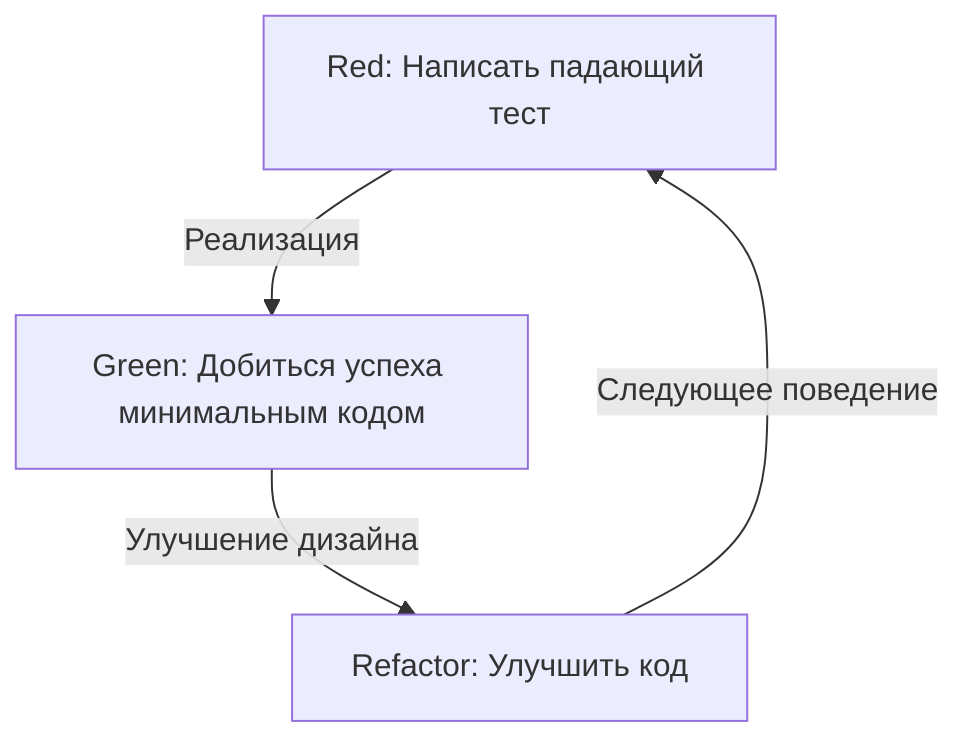
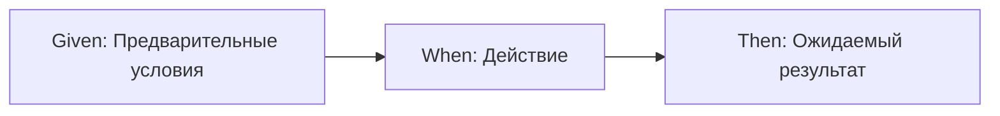

# Тесты пишутся не для поиска багов, а для проектирования

В мире разработки программного обеспечения слово "тестирование" часто вызывает недопонимание. Многие разработчики, особенно начинающие программисты и нетехнические заинтересованные стороны, считают тестирование "работой по проверке того, правильно ли работает готовый код", то есть частью процесса обеспечения качества (QA) для поиска багов. Однако в философии разработки через тестирование (TDD) и разработки через поведение (BDD) суть тестирования кроется совершенно в другом.

Тестирование — это акт проектирования, который определяет, "каким должен быть этот код", еще до его написания.

В этой статье мы глубоко погрузимся в философию проектирования через тестирование: от фундаментальных идей TDD, предложенных Кентом Беком, до зарождения BDD Дэном Нортом и противостояния мокистов (Лондонская школа) и классистов (Чикагская школа). Мы не ограничимся лишь техническими объяснениями, а прольем свет на психологические и архитектурные аспекты, лежащие в основе того, почему мы пишем тесты.

## Кент Бек и рождение TDD: Истинная цель Red-Green-Refactor

Кент Бек, который заново открыл разработку через тестирование (TDD) и утвердил ее как основу гибкой (agile) разработки ПО, утверждает, что цель TDD — получить "чистый код, который работает" (Clean code that works). Процесс TDD, как широко известно, представляет собой повторение следующих трех шагов.

1. **Red (Красный)**: Написать небольшой падающий тест.
2. **Green (Зеленый)**: Написать минимальный код, чтобы этот тест прошел.
3. **Refactor (Рефакторинг)**: Устранить дублирование кода и улучшить дизайн, сохраняя при этом успешное прохождение тестов.



Механическое повторение этого цикла само по себе не представляет сложности. Однако ловушка, в которую попадают многие разработчики, заключается в потере из виду "истинной цели" этого цикла.

### Преодоление страха (Overcoming Fear)

В своей книге «Разработка через тестирование» Кент Бек неоднократно упоминает о "страхе", сопровождающем программирование. Приступая к решению неизвестной проблемы или внося изменения в сложный существующий код, разработчик всегда сталкивается со страхом "как бы чего не сломать". Этот страх заставляет разработчиков занимать оборонительную позицию, не решаться на улучшение кода (рефакторинг) и в результате приводит к накоплению технического долга.

Цикл Red-Green-Refactor в TDD — это психологический инструмент для контроля этого страха. Падающий тест (Red) ставит четкую цель, которую нужно достичь следующей. Заставив этот тест пройти (Green), разработчик получает надежную обратную связь о том, что "сделан шаг вперед". И именно благодаря наличию надежной защитной сети тестов становится возможным смелый рефакторинг (Refactor). TDD — это практика для превращения страха в уверенность и обретения программистом душевного спокойствия.

### Совершенствование дизайна: Проектирование API снаружи

Другим важным аспектом TDD является то, что акт "написания теста" означает "взгляд с точки зрения пользователя API". Написание тестов перед реализацией кода означает проектирование интерфейсов — имен классов, методов, структуры аргументов, типов возвращаемых значений — путем обратного планирования, начиная с наиболее удобной формы для использования.

Когда тесты пишутся после кода (Test-Last), разработчики часто зависят от уже реализованной внутренней структуры. Тесты пишутся в соответствии с удобством реализации, и закрепляются неудобные в использовании интерфейсы. TDD меняет этот порядок, сосредотачиваясь не на том, "как это реализовано", а на том, "как это должно использоваться". Другими словами, TDD — это не только Test-Driven Development (разработка через тестирование), но и Test-Driven Design (проектирование через тестирование).

## Решающее отличие от написания тестов после кода (Test-Last)

Вопрос "Даже если это не TDD, разве написание юнит-тестов потом не дает тот же результат?" задается почти всегда при внедрении TDD. Действительно, если смотреть только на конечный результат в виде пары "тестовый код" и "продуктовый код", может показаться, что между ними нет разницы. Однако влияние этого процесса на проектирование имеет решающее отличие.

### Обеспечение тестируемости (Testability)

При попытке написать тесты после кода разработчики часто сталкиваются со стеной под названием "этот код трудно тестировать". Причинами этого являются тесно связанные зависимости, зависимость от глобального состояния, прямой доступ к внешним системам и так далее. При написании тестов после кода (Test-Last) разработчикам приходится либо насильно рефакторить существующий код, чтобы написать тесты, либо использовать инструменты для мокирования (заглушек) для написания сложных и хрупких тестов.

С другой стороны, в TDD "не тестируемый код" в принципе не может существовать. Это потому, что написание теста является предварительным условием реализации. Чтобы сделать тестирование простым, естественным образом применяется внедрение зависимостей (DI), а классы делятся так, чтобы каждый имел единую ответственность. TDD действует как компас, направляющий разработчиков к превосходному объектно-ориентированному дизайну с высокой связностью и низким зацеплением.

### Иллюзия покрытия кода (Code Coverage)

При подходе Test-Last целью часто становится "покрытие кода". Чтобы достичь целевых показателей в 80% или 100%, разработчики иногда начинают писать бессмысленные тесты (например, тесты без утверждений), которые просто проходят через строки существующего кода. Это ставит телегу впереди лошади.

В TDD высокое покрытие кода — это не "цель", а всего лишь "побочный продукт", получаемый в результате разработки, управляемой тестами. Тесты, написанные в рамках TDD, существуют не для того, чтобы покрыть строки реализации, а для того, чтобы покрыть "поведение" системы.

## Две школы: Chicago School против London School

По мере распространения TDD возникли две основные школы подходов к написанию тестов и проектированию. Это Chicago School (или классисты/статистики) и London School (или мокисты/Outside-In). Понимание различий между этими школами чрезвычайно важно для осознания глубины TDD.

### Chicago School (Классисты/Основанные на состоянии)

Chicago School — это подход, предложенный Кентом Беком, Дядей Бобом (Роберт С. Мартин) и другими, который можно назвать истоком TDD. Его также иногда называют Detroit School.

Основные особенности этой школы заключаются в следующем:

1. **Тестирование на основе состояния (State Verification)**: После вызова метода объекта проверяется "конечное состояние" этого объекта или взаимодействующих объектов.
2. **Минимизация моков**: Избегается чрезмерное использование заглушек (Mock), и для тестирования по возможности используются настоящие (Real) объекты. Использование моков ограничивается только связью с внешними границами (Boundary), такими как базы данных или сеть, которые делают тесты медленными или нестабильными.
3. **Проектирование "снизу вверх"**: Начинается с небольшой доменной модели, составляющей ядро системы, и постепенно они комбинируются для создания более крупных функций (Inside-Out).

Преимущество Chicago School заключается в том, что тесты очень устойчивы к рефакторингу. Поскольку они не зависят от деталей внутренней реализации (какие методы и в каком порядке вызываются) и проверяют только конечный результат, тесты с меньшей вероятностью сломаются при значительных изменениях внутренней структуры.

### London School (Мокисты/Outside-In)

С другой стороны, London School — это подход, основанный Стивом Фрименом, Нэтом Прайсом (авторами "Growing Object-Oriented Software, Guided by Tests") и другими в сообществе разработчиков вокруг Лондона.

1. **Тестирование на основе поведения (Behavior Verification)**: Активно используются mock-объекты, и проверяется взаимодействие (Interaction): "какие методы и с какими аргументами были вызваны" тестируемым объектом у зависимых объектов.
2. **Проектирование Outside-In**: Проектирование начинается с внешних слоев системы, таких как пользовательский интерфейс или контроллеры, интерфейсы необходимых зависимых объектов определяются как моки, и постепенно процесс продвигается к внутренней доменной логике.
3. **Строгое разделение**: Путем мокирования всего, кроме тестируемого класса, можно чрезвычайно точно локализовать причину сбоя (Defect Localization), когда тест падает.

Преимущество London School заключается в том, что оно способствует обнаружению интерфейсов в процессе проектирования. Размышляя сверху вниз о необходимых ролях, протоколы взаимодействия (правила связи) между объектами проектируются с помощью моков. Однако существует и критика, что из-за сильной привязанности тестов к деталям реализации они склонны ломаться при рефакторинге (Fragile Tests).

Нельзя сказать, что какая-то школа лучше другой в простом смысле. Важно уметь выбрать правильный подход в зависимости от характеристик системы и фазы проектирования.

## Дэн Норт и рождение BDD: Слова формируют мышление

Хотя TDD является мощным методом, существовал один большой барьер для его распространения и обучения. Это нюанс QA (обеспечения качества), заложенный в самом слове "Test".

В середине 2000-х годов, когда Дэн Норт преподавал TDD разработчикам, он постоянно сталкивался с такими вопросами, как "Что нам следует тестировать?", "Как мы должны назвать тест?" и "Почему тест провалился?". Разработчики, сбитые с толку словом "тест", зацикливались на низкоуровневых деталях реализации, таких как внутренняя работа методов или проверка наличия записей в базе данных.

Поэтому Дэн Норт предложил революционный сдвиг парадигмы. Отказаться от слова "Test" и заменить его на "Behavior" (Поведение). Это и есть рождение разработки через поведение (BDD: Behavior-Driven Development).

### От "Test" к "Should"

Первым шагом к BDD стало изменение названий тестовых методов с `test~` на `should~`.
Например, вместо `testCalculateDiscount` используется имя вроде `shouldApplyTenPercentDiscountForVipCustomers`.

Это небольшое изменение слов привело к радикальному изменению в мышлении разработчиков. Фокус сместился с "как мы тестируем этот метод" на бизнес-требование "как должна вести себя эта система (should do)".

### Открытие JBehave и Given-When-Then

Дэн Норт также почувствовал необходимость в предметно-ориентированном языке (DSL) для описания поведения и разработал фреймворк под названием JBehave. Там был принят шаблон **Given-When-Then**, который сейчас является синонимом BDD.

* **Given (Дано/Условие)**: При наличии определенного контекста или начального состояния.
* **When (Когда/Действие)**: Когда происходит какое-либо действие или событие.
* **Then (Тогда/Результат)**: Тогда, каким должен быть результат, или какое поведение должно произойти.



Этот формат — больше, чем просто синтаксис программирования. Он стал основой единого языка (Ubiquitous Language) для диалога о системных требованиях между бизнес-аналитиками (BA), экспертами предметной области, тестировщиками и разработчиками.

## Преодоление разрыва между бизнес-требованиями и кодом

В традиционной разработке программного обеспечения существовала глубокая, темная пропасть между документами с бизнес-требованиями (написанными на естественном языке в Word или Excel) и кодом, написанным программистами. Документы с требованиями быстро устаревали, и, чтобы узнать, как на самом деле работает система, программистам приходилось расшифровывать код.

BDD преодолевает этот разрыв с помощью концепции исполняемых спецификаций (Executable Specification). Инструменты BDD, такие как Cucumber, позволяют брать требования (feature-файлы), написанные простым текстом в формате Given-When-Then, и выполнять их напрямую в виде тестового кода.

```gherkin
Feature: Функция скидки в корзине покупок
  При покупке большого количества товаров VIP-клиентами должна применяться соответствующая скидка.

  Scenario: Применение скидки 10% для VIP-клиента
    Given пользователь "Kenji" является "VIP" клиентом
    And в корзине пользователя "Kenji" уже есть товаров на 5000 иен
    When "Kenji" добавляет в корзину "Премиум клавиатуру" за 6000 иен
    Then общая сумма в корзине должна составить не 11000 иен, а 9900 иен
```

Этот feature-файл может быть прочитан нетехническими специалистами и точно передает бизнес-намерения. В то же время он выполняется как автоматизированный тест в CI/CD конвейере, постоянно доказывая, что система работает в соответствии с этой спецификацией. Объединение документов с требованиями и тестового кода реализует концепцию "живой документации" (Living Documentation).

## Заключение: Превращение страха в уверенность, а неопределенности — в проектирование

Разработка через тестирование (TDD) и разработка через поведение (BDD) — это не просто методы автоматизации тестирования. Это глубокие и утонченные философии для решения фундаментальных проблем в разработке программного обеспечения: страха перед изменениями и коммуникационного разрыва между требованиями и реализацией.

TDD освобождает разработчиков от страха с помощью цикла Red-Green-Refactor и помогает красиво спроектировать код изнутри. Конфликт и интеграция Chicago School и London School учат нас разнообразным подходам к объектно-ориентированному проектированию.
И BDD, предоставляя общий язык Given-When-Then, стирает границы между бизнесом и разработкой, позволяя всей системе двигаться прямо к своей первоначальной цели (Behavior).

Мы пишем тесты не для того, чтобы находить баги.
Мы продолжаем рисовать "чертежи дизайна", называемые тестами, чтобы завтра иметь возможность уверенно изменять код и создавать красивую архитектуру, отвечающую истинным требованиям бизнеса.
