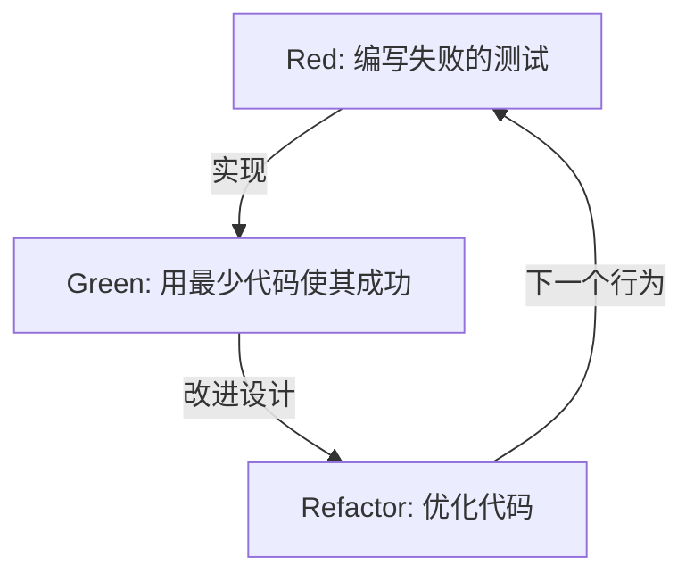
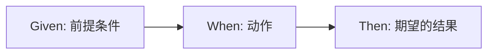

# 编写测试不是为了发现Bug，而是为了进行设计

在软件开发的世界中，“测试”一词常常会引起误解。许多开发者，尤其是经验较浅的程序员或非技术利益相关者，认为测试是“确认完成的代码是否正常运行的工作”，即为了发现Bug而进行的质量保证（QA）流程的一部分。然而，在测试驱动开发（TDD）和行为驱动开发（BDD）的哲学中，测试的本质却在完全不同的地方。

测试是在编写代码之前定义“该代码应该是什么样”的设计行为。

本文将深入探讨通过测试进行设计的哲学，从Kent Beck提出的TDD的根本思想，到Dan North诞生的BDD，再到Mock主义（London School）与状态主义（Chicago School）的对立。文章不仅限于技术性的解说，还会探讨我们为什么要编写测试，并阐明其背后的心理与设计层面的意义。

## Kent Beck与TDD的诞生：Red-Green-Refactor的真正目的

重新发现测试驱动开发（TDD）并将其确立为敏捷软件开发基础的Kent Beck认为，TDD的目的是获得“运行良好的整洁代码（Clean code that works）”。众所周知，TDD的流程是以下三个步骤的循环。

1. **Red（红）**: 编写一个失败的小测试。
2. **Green（绿）**: 编写能通过该测试的最小量代码。
3. **Refactor（重构）**: 在保持测试通过的状态下，消除代码重复，优化设计。



机械地重复这个循环本身并不困难。但是，许多开发者陷入的陷阱是迷失了这个循环的“真正目的”。

### 消除恐惧（Overcoming Fear）

Kent Beck在其著作《测试驱动开发》中，反复提到了伴随编程而来的“恐惧”。当应对未知问题或对复杂的现有代码进行修改时，开发者总是面临“是否会破坏什么东西”的担忧。这种担忧使开发者变得具有防御性，犹豫是否进行代码改进（重构），从而导致技术债务的积累。

TDD中的Red-Green-Refactor循环就是为了控制这种恐惧的心理工具。失败的测试（Red）给出了接下来要达成的明确目标。通过使该测试通过（Green），开发者能获得“前进了一步”的切实反馈。正是因为有了强大的测试保护网，大胆的重构（Refactor）才成为可能。TDD是一种将恐惧转化为信心，为程序员带来精神上平静的实践。

### 优化设计：从外部设计API

TDD的另一个重要方面是，“编写测试”这一行为本身即意味着“站在API使用者的角度”。在实现代码之前编写测试，意味着从最易用的形式逆推设计类名、方法名、参数结构、返回值类型等接口。

如果在事后编写测试（Test-Last），开发者往往会被已经实现的内部结构所牵制。测试会为了适应实现的便利而编写，导致难用的接口被固定下来。TDD通过颠倒这一顺序，将重点放在“应该如何被使用”而不是“如何被实现”上。换句话说，TDD既是Test-Driven Development（测试驱动开发），也是Test-Driven Design（测试驱动设计）。

## 与事后测试（Test-Last）的决定性差异

“即使不用TDD，事后编写单元测试难道不是一样的吗？” 在引入TDD时，几乎必定会被问到这个问题。确实，如果只看最终得到的“测试代码”和“产品代码”这对结果，两者似乎没有区别。但是，这个过程对设计产生的影响却有着决定性的差异。

### 确保可测试性（Testability）

尝试在事后编写测试时，经常会遇到“这段代码很难测试”的壁垒。原因在于紧耦合的依赖关系、对全局状态的依赖或对外部系统的直接访问等。在事后测试中，开发者不得不为了编写测试而强行重构现有代码，或者大量使用Mock工具编写复杂且脆弱的测试。

另一方面，在TDD中，原则上不存在“无法测试的代码”。因为编写测试是实现的前提条件。为了让测试更容易编写，自然会采用依赖注入（DI），并使类被拆分为具有单一职责。TDD作为指南针，引导开发者走向具有高内聚和低耦合的优秀面向对象设计。

### 代码覆盖率的幻想

在事后测试的方法中，通常将“代码覆盖率（Coverage）”作为目标。为了达到80%或100%这样的数值目标，开发者可能会开始编写仅为了让现有代码行被执行到的毫无意义的测试（例如没有断言的测试）。这无疑是本末倒置。

在TDD中，高代码覆盖率不是“目的”，而仅仅是作为以测试驱动开发所得到的“副产品”。用TDD编写的测试，存在意义不是为了覆盖代码的行数，而是为了覆盖系统的“行为”。

## 两大流派：Chicago School vs London School

随着TDD的普及，在测试编写方法和设计思路上，主要诞生了两大流派。即Chicago School（或称为Classicist/Statist）和London School（或称为Mockist/Outside-In）。理解这些流派之间的差异，对于体会TDD的深度非常重要。

### Chicago School（状态主义・经典派）

Chicago School是由Kent Beck和Uncle Bob (Robert C. Martin) 等人倡导的、堪称TDD原点的方法。有时也被称为Detroit School。

该流派的主要特征如下：

1. **基于状态的测试（State Verification）**: 在调用对象的方法后，验证该对象或协作对象的“最终状态”。
2. **最小化Mock**: 避免过度使用Mock，尽可能使用真实的（Real）对象进行测试。Mock仅限于与数据库或网络等使测试变慢或不稳定的外部边界（Boundary）通信时使用。
3. **自下而上的设计**: 从系统核心的小领域模型开始构建，逐渐将它们组合成大型功能（Inside-Out）。

Chicago School的优点是测试对重构具有极高的稳健性。由于不依赖于内部的实现细节（调用了哪个方法，顺序如何），而是仅验证最终结果，因此即使大幅改变内部结构，测试也不容易被破坏。

### London School（Mock主义・由外而内）

另一方面，London School是由Steve Freeman和Nat Pryce（《测试驱动开发：实战与模式解析》作者）等人在伦敦周边的开发社区确立的方法。

1. **基于行为的测试（Behavior Verification）**: 积极使用Mock对象，验证被测试对象与其依赖对象之间“以什么参数调用了哪个方法”的交互（Interaction）。
2. **Outside-In的设计**: 从用户界面或控制器等系统外部层开始设计，一边将所需的依赖对象接口定义为Mock，一边逐步深入内部的领域逻辑。
3. **严格的隔离**: 通过将除测试目标类以外的所有内容Mock化，可以极其精确地定位（Defect Localization）测试失败时的故障位置。

London School的优点是能够在设计过程中促进接口的发现。通过自上而下思考所需角色，并通过Mock设计对象间的协议（通信规则）。然而，由于测试容易与实现细节紧密耦合，因此存在重构时测试容易遭到破坏（Fragile Tests）的批评。

并不能简单地说哪种流派更优秀。重要的是能够根据系统的特征和设计的阶段，选择合适的方法。

## Dan North与BDD的诞生：语言塑造思维

虽然TDD是一种强大的方法，但在其普及和教育过程中存在一个巨大的障碍。那就是“Test（测试）”这个词本身所带有的QA色彩。

在2000年代中期，Dan North在教授开发者TDD的过程中，经常面临“应该测试什么”、“应该怎么命名测试”、“为什么测试失败了”等问题。开发者被“测试”这个词所束缚，固执于诸如方法的内部运作或确认数据库记录是否存在等低级别的实现细节。

因此，Dan North提出了一个具有划时代意义的范式转变。即抛弃“Test”这个词，用“Behavior（行为）”取而代之。这就是行为驱动开发（BDD: Behavior-Driven Development）的诞生。

### 从“Test”到“Should”

迈向BDD的第一步，是改变测试方法的命名方式，从 `test~` 开头改为 `should~` 开头。
例如，不使用 `testCalculateDiscount`，而是命名为 `shouldApplyTenPercentDiscountForVipCustomers`。

这个微小的用词改变，给开发者的思维带来了戏剧性的变化。焦点不再是“如何测试这个方法”，而是转移到了“这个系统应该如何表现（should do）”的业务需求上。

### JBehave与Given-When-Then的发现

Dan North进一步感受到了用于描述行为的领域特定语言（DSL）的必要性，开发了一个名为JBehave的框架。在那里被采用的，是现在可以说是BDD代名词的 **Given-When-Then** 模板。

* **Given（前提）**: 当给定某种上下文或初始状态时
* **When（操作）**: 发生某种动作或事件
* **Then（结果）**: 其结果应该变成什么状态，或者应该发生什么行为



这种格式不仅是编程的语法。它成为了业务分析师（BA）、领域专家、测试人员和开发者使用相同语言就系统需求进行对话的通用语言（Ubiquitous Language）的基础。

## 填补业务需求与代码之间的鸿沟

在传统的软件开发中，业务的需求定义文档（用Word或Excel编写的自然语言）与程序员编写的代码之间，存在着一条深不见底的鸿沟。需求定义文档很快就会过时，要知道实际系统是如何运行的，程序员只能去解读代码。

BDD通过可执行规范（Executable Specification）的概念，填补了这一鸿沟。使用Cucumber等BDD工具，可以直接将用Given-When-Then编写的纯文本需求（Feature文件）作为测试代码来执行。

```gherkin
Feature: 购物车的折扣功能
  当VIP客户大量购买商品时，应适用适当的折扣。

  Scenario: 对VIP客户适用10%的折扣
    Given 用户 "Kenji" 是一名 "VIP" 客户
    And "Kenji" 的购物车中已经有价值 5000 日元的商品
    When "Kenji" 在购物车中添加了一款 6000 日元的 "高级键盘"
    Then 购物车的总金额不应是 11000 日元，而应是 9900 日元
```

这种Feature文件，即使是非技术人员也能阅读，准确地表达了业务意图。同时，它作为自动化测试在CI/CD流水线中执行，不断证明系统正在按照此规范运行。随着需求定义文档和测试代码的一体化，“活文档（Living Documentation）”得以实现。

## 结论：将恐惧化为信心，将不确定性化为设计

测试驱动开发（TDD）和行为驱动开发（BDD）不仅仅是测试自动化的技巧。它们是深刻而精炼的哲学，旨在应对软件开发中根本的困难——即对变化的恐惧以及需求与实现之间的沟通障碍。

TDD通过Red-Green-Refactor循环将开发者从恐惧中解放出来，并从内部优美地设计代码。Chicago School与London School的对立与融合，向我们展示了面向对象设计的多种方法。
而BDD通过提供Given-When-Then这种共同语言，消融了业务与开发之间的界限，使整个系统能够径直朝着其原本的目标（Behavior）前进。

我们编写测试并不是为了发现Bug。
为了明天也能自信地修改代码，并创造出满足业务真正要求的优美设计，我们将继续描绘名为测试的“设计蓝图”。
