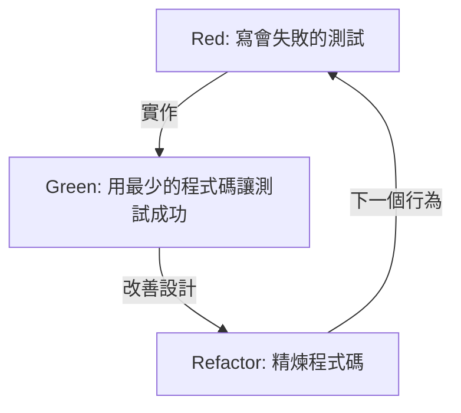
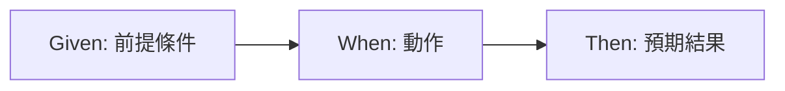

# 寫測試不是為了找 bug，而是為了設計

在軟體開發的世界裡，「測試」這個詞經常會引起誤解。許多開發者，特別是經驗較淺的程式設計師或是非技術背景的利害關係人，都認為測試是「確認完成的程式碼是否能正確運作的作業」，也就是用來找出 bug 的品質保證 (QA) 流程的一部分。然而，在測試驅動開發 (TDD) 和行為驅動開發 (BDD) 的哲學中，測試的本質存在於完全不同的地方。

測試是在寫程式碼之前，定義「該程式碼應該長什麼樣子」的一種設計行為。

本文將從 Kent Beck 提倡的 TDD 根本思想開始，探討 Dan North 創造 BDD 的過程，以及模擬派 (London School) 與狀態派 (Chicago School) 之間的對立，深入挖掘透過測試進行設計的哲學。不僅僅是技術性的解說，更將釐清我們為什麼要寫測試，並聚焦於其底層的心理與設計層面。

## Kent Beck 與 TDD 的誕生：Red-Green-Refactor 的真正目的

重新發現測試驅動開發 (TDD) 並將其確立為敏捷軟體開發基礎的 Kent Beck，認為 TDD 的目的是獲得「能運作的整潔程式碼 (Clean code that works)」。眾所皆知，TDD 的流程是以下三個步驟的反覆循環：

1. **Red (紅)**：寫一個會失敗的小測試。
2. **Green (綠)**：寫出能讓該測試通過的最少程式碼。
3. **Refactor (重構)**：在保持測試通過的狀態下，消除程式碼的重複，並精煉設計。



機械式地重複這個循環本身並不難。但是，許多開發者容易陷入的陷阱是，迷失了這個循環的「真正目的」。

### 消除不安 (Overcoming Fear)

Kent Beck 在其著作《測試驅動開發》中，反覆提到了伴隨寫程式而來的「不安」。當面對未知的問題，或是要對複雜的現有程式碼進行修改時，開發者總是會面臨「會不會把東西弄壞」的不安。這種不安會讓開發者變得防禦，對程式碼的改善 (重構) 感到猶豫，結果導致技術債的累積。

TDD 中的 Red-Green-Refactor 循環，正是用來控制這種不安的心理工具。會失敗的測試 (Red) 提示了下一個要達成的明確目標。透過讓該測試通過 (Green)，開發者可以獲得「往前邁進了一步」的明確反饋。正因為有堅固的測試保護網，我們才能進行大膽的重構 (Refactor)。TDD 是一種將不安轉化為確信，為程式設計師帶來精神上平靜的實踐方法。

### 設計的精煉：從外部設計 API

TDD 的另一個重要面向是，「寫測試」這個行為，也就是「站在 API 使用者的視角」。在實作程式碼之前先寫測試，意味著要從最容易使用的形式開始反推，來設計類別名稱、方法名稱、參數結構以及回傳值型別等介面。

如果在事後才寫測試 (Test-Last)，開發者往往會被已經實作好的內部結構所牽制。測試會配合實作的方便性來撰寫，導致難以使用的介面被固定下來。TDD 透過反轉這個順序，將焦點放在「應該如何被使用」，而不是「是如何被實作的」。也就是說，TDD 不僅是 Test-Driven Development，同時也是 Test-Driven Design (測試驅動設計)。

## 與事後測試 (Test-Last) 的決定性差異

「就算不用 TDD，事後再寫單元測試不也一樣嗎？」這個疑問在導入 TDD 時幾乎一定會被提出來。的確，如果只看最終得到的「測試程式碼」和「產品程式碼」配對的結果，兩者似乎沒有什麼不同。但是，其過程對設計所帶來的影響卻有著決定性的差異。

### 確保可測試性 (Testability)

如果想在事後才寫測試，經常會遇到「這段程式碼很難測試」的瓶頸。緊密耦合的依賴關係、依賴全域狀態、直接存取外部系統等都是原因。在事後測試中，為了寫測試，往往必須勉強重構現有的程式碼，或是大量使用模擬 (Mock) 工具來寫出複雜且脆弱的測試。

另一方面，在 TDD 中，原則上不可能存在「無法測試的程式碼」。因為寫測試是實作的前提條件。為了讓測試更容易寫，自然會採用依賴注入 (DI)，類別也會被分割為單一職責。TDD 扮演著指南針的角色，引導開發者走向具備高內聚力和低耦合度的優秀物件導向設計。

### 程式碼涵蓋率的幻想

在事後測試的方法中，「程式碼涵蓋率 (Code Coverage)」經常被當作目標。為了達到 80% 或 100% 這樣的數字目標，開發者可能會開始寫一些只是為了跑過現有程式碼行數、沒有意義的測試 (例如沒有斷言的測試)。這無疑是本末倒置。

在 TDD 中，高程式碼涵蓋率不是「目的」，只不過是將測試作為驅動開發的結果所得到的「副產品」。用 TDD 寫出來的測試，不是為了涵蓋實作的行數，而是為了涵蓋系統的「行為 (Behavior)」而存在的。

## 兩大流派：Chicago School vs London School

隨著 TDD 的普及，對於測試寫法和設計的方法，大致產生了兩個流派。也就是 Chicago School (或稱 Classicist/Statist) 與 London School (或稱 Mockist/Outside-In)。理解這些流派的差異，對於了解 TDD 的深度非常重要。

### Chicago School (狀態派・古典派)

Chicago School 是由 Kent Beck 和 Uncle Bob (Robert C. Martin) 等人提倡，可以說是 TDD 原點的方法。有時也被稱為 Detroit School。

這個流派的主要特徵如下：

1. **基於狀態的測試 (State Verification)**：在呼叫物件的方法後，驗證該物件或協作物件的「最終狀態」。
2. **最小化 Mock**：避免過度使用模擬 (Mock)，盡可能使用真實 (Real) 的物件來進行測試。Mock 僅限用於會讓測試變慢或不穩定的外部邊界 (Boundary) 通訊，例如資料庫或網路。
3. **由下而上的設計**：從系統核心的小型領域模型開始建立，逐漸將它們組合起來建立大型功能 (Inside-Out)。

Chicago School 的優點是，測試對於重構非常堅固。因為不依賴內部的實作細節 (哪個方法以什麼順序被呼叫)，只驗證最終的結果，所以即使大幅改變內部結構，測試也不容易壞掉。

### London School (模擬派・由外而內)

另一方面，London School 是由 Steve Freeman 和 Nat Pryce (《Growing Object-Oriented Software, Guided by Tests》的作者) 等人在倫敦周邊的開發社群中所確立的方法。

1. **基於行為的測試 (Behavior Verification)**：積極使用模擬物件 (Mock)，驗證受測物件對其依賴物件「以什麼參數呼叫了哪個方法」的互動 (Interaction)。
2. **Outside-In 的設計**：從使用者介面或控制器等系統外部的層級開始設計，一邊將所需的依賴物件介面定義為 Mock，一邊逐漸深入到內部的領域邏輯。
3. **嚴格的隔離**：透過將受測類別以外的所有東西都 Mock 化，當測試失敗時，可以非常精準地定位出原因所在 (Defect Localization)。

London School 的優點是，在設計過程中能促進介面的發現。透過由上而下思考所需的角色，並透過 Mock 來設計物件間的協定 (通訊規範)。然而，也存在著因為測試強烈耦合於實作細節，導致在重構時測試容易壞掉 (Fragile Tests) 的批評。

這並不是哪一個流派比較優秀的簡單問題。重要的是，根據系統的特徵和設計的階段，能夠選擇適當的方法。

## Dan North 與 BDD 的誕生：語言形塑思考

雖然 TDD 是很強大的手法，但在其普及和教育上遇到了一個很大的障礙。那就是「Test」這個詞本身所帶有的 QA 意涵。

在 2000 年代中期，Dan North 在教授開發者 TDD 時，經常面臨「應該測試什麼？」、「測試應該怎麼命名？」、「測試為什麼會失敗？」等問題。開發者被「測試」這個詞所牽制，執著於方法內部運作或確認資料庫記錄是否存在等低階的實作細節。

因此，Dan North 提出了一個劃時代的典範轉移。也就是捨棄「Test」這個詞，將其替換為「Behavior (行為)」。這就是行為驅動開發 (BDD: Behavior-Driven Development) 的誕生。

### 從「Test」到「Should」

邁向 BDD 的第一步，是將測試方法的名稱從以 `test~` 開頭，改為以 `should~` 開頭。
例如，與其命名為 `testCalculateDiscount`，不如命名為 `shouldApplyTenPercentDiscountForVipCustomers`。

這個微小的用詞改變，為開發者的思考帶來了戲劇性的變化。焦點不再是「如何測試這個方法」，而是「這個系統應該如何表現 (should do)」這樣的商業需求。

### JBehave 與 Given-When-Then 的發現

Dan North 進一步感覺到需要一種用來描述行為的領域特定語言 (DSL)，於是開發了 JBehave 這個框架。在那裡被採用的，正是現在可以說是 BDD 代名詞的 **Given-When-Then** 模板。

* **Given (前提)**：給定某個上下文或初始狀態時
* **When (操作)**：發生了某種動作或事件
* **Then (結果)**：其結果應該變成什麼狀態，或是應該發生什麼行為



這個格式不單單只是程式設計的語法。它成為了商業分析師 (BA)、領域專家、測試人員以及開發者，使用相同語言來對話系統需求之無所不在語言 (Ubiquitous Language) 的基礎。

## 填補商業需求與程式碼之間的鴻溝

在傳統的軟體開發中，商業的需求定義文件 (用 Word 或 Excel 寫的自然語言) 和程式設計師寫的程式碼之間，存在著一道深不見底的鴻溝。需求定義文件很快就會過時，要了解實際系統是如何運作的，只能靠程式設計師去解讀程式碼。

BDD 透過可執行的規格書 (Executable Specification) 這個概念，填補了這個鴻溝。使用 Cucumber 等 BDD 工具，可以將用 Given-When-Then 寫成的純文字需求 (Feature 檔)，直接作為測試程式碼來執行。

```gherkin
Feature: 購物車的折扣功能
  當 VIP 顧客大量購買商品時，應適用適當的折扣。

  Scenario: 對 VIP 顧客適用 10% 折扣
    Given 使用者 "Kenji" 是一位 "VIP" 顧客
    And "Kenji" 的購物車裡已經有 5000 元的商品
    When "Kenji" 將 6000 元的 "高級鍵盤" 加入購物車
    Then 購物車的總金額應該變成 9900 元，而不是 11000 元
```

這個 Feature 檔即使是非技術人員也能閱讀，並且正確地表達了商業的意圖。同時，這也會作為自動化測試在 CI/CD 管道中執行，持續證明系統有按照這份規格運作。需求定義文件與測試程式碼的合而為一，實現了「活的文件 (Living Documentation)」。

## 結論：將不安化為確信，將不確定性化為設計

測試驅動開發 (TDD) 和行為驅動開發 (BDD) 不單純只是測試自動化的技巧。它們是為了解決軟體開發中根本的困難——亦即對變化的不安，以及需求與實作之間的溝通落差——而生的深刻且精煉的哲學。

TDD 透過 Red-Green-Refactor 的循環將開發者從不安中解放出來，從內部漂亮地設計程式碼。Chicago School 與 London School 的對立與融合，教導了我們物件導向設計的多樣化方法。
而 BDD 透過提供 Given-When-Then 這個共通語言，消融了商業與開發之間的邊界，讓整個系統能夠朝著原來的目的 (Behavior) 直線前進。

我們寫測試不是為了找 bug。
為了明天也能帶著自信修改程式碼，並產出能夠回應商業真正需求的優美設計，我們將持續描繪名為測試的「設計藍圖」。
