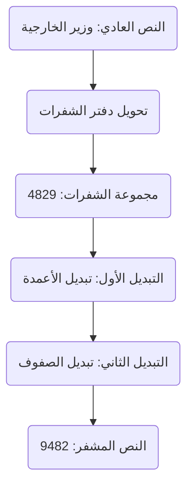
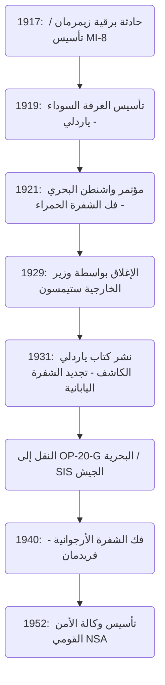

# صعود وسقوط مؤسسة فك التشفير "الغرفة السوداء": الرجال الذين سرقوا وكشفوا البرقيات الدبلوماسية وفجر وكالات الاستخبارات الأمريكية

غالبًا ما يختبئ مصير الأمم في سلاسل التشفير غير المرئية. عند كشف تاريخ الاستخبارات الحديثة (التجسس)، وفي عملية نمو الولايات المتحدة لتصبح إمبراطورية استخباراتية عالمية، هناك مؤسسة أسطورية لا يمكن تجاهلها. وهي "الغرفة السوداء (The Black Chamber)". في هذا المقال، سنناقش بتفصيل كبير ومن زوايا متعددة صعود وسقوط هذه الوكالة السرية، التي ولدت من فوضى الحرب العالمية الأولى، وكشفت الدبلوماسية اليابانية بالكامل في مؤتمر واشنطن البحري، وتم دفنها لاحقًا باسم "الأخلاق"، لكنها تركت الحمض النووي الاستخباراتي الذي أدى إلى تأسيس وكالة الأمن القومي الحديثة (NSA).

---

## الفصل الأول: الحرب العالمية الأولى وولادة فك التشفير الحديث

### دخول أمريكا الحرب بسبب حادثة برقية زيمرمان
وجدت تقنية التشفير منذ العصور القديمة عندما بدأت البشرية في التواصل بالكتابة. ومع ذلك، فإن الاعتراف بها ليس فقط كتكتيك عسكري بل كعنصر أساسي في الاستراتيجية الوطنية يعود إلى الأحداث الدرامية في الحرب العالمية الأولى في أوائل القرن العشرين. رمز ذلك هو "حادثة برقية زيمرمان" في عام 1917.

في يناير 1917، أرسل وزير الخارجية للإمبراطورية الألمانية، آرثر زيمرمان، برقية سرية مذهلة إلى السفير الألماني في المكسيك عبر واشنطن. حثت هذه البرقية المكسيك على التحالف مع ألمانيا ودخول الحرب ضد الولايات المتحدة، تحسباً لدخول أمريكا - التي كانت محايدة في ذلك الوقت - الحرب إلى جانب الحلفاء. في المقابل، وعدت ألمانيا المكسيك باستعادة أراضيها المفقودة في تكساس ونيومكسيكو وأريزونا. وعلاوة على ذلك، تضمنت البرقية تعليمات لجذب اليابان إلى هذا التحالف المناهض لأمريكا.

تم اعتراض هذه البرقية وفك تشفيرها بواسطة "الغرفة 40"، وهي وحدة متخصصة في فك التشفير تابعة لإدارة المخابرات البحرية البريطانية. كانت الحكومة البريطانية مقتنعة بأن الكشف عن هذه الاستخبارات سيثير غضب الرأي العام الأمريكي وسيكون الضربة الحاسمة التي ستجعل الرئيس وودرو ويلسون يتخذ قرار الدخول في الحرب، فقدمتها إلى الحكومة الأمريكية في توقيت مثالي. لقد كانت اللحظة التي أدار فيها فك التشفير عجلة التاريخ العالمي بشكل كبير.

### تأسيس قسم الاستخبارات العسكرية MI-8 وطموح ياردلي
قدمت حادثة زيمرمان درسًا قاسيًا للقادة العسكريين وكبار المسؤولين الحكوميين في أمريكا: الرعب من تسرب تشفيراتهم الخاصة، وحقيقة مدى التفوق الاستراتيجي الذي يمكن الحصول عليه إذا تمكنوا من فك تشفير اتصالات العدو. في ذلك الوقت، لم تكن هناك وكالة فك تشفير على المستوى الوطني في أمريكا. انطلاقًا من هذا الشعور بالأزمة، تم تأسيس "MI-8 (قسم الاستخبارات العسكرية، القسم 8)" داخل إدارة الاستخبارات العسكرية في عام 1917.

تم اختيار هربرت أوزبورن ياردلي (Herbert Osborn Yardley)، وهو عامل تلغراف شاب في وزارة الخارجية، لرئاسة MI-8. في الأصل، كان مجرد عامل يعمل في مكتب تلغراف ريفي، لكنه كان يمتلك قدرة عبقرية على اكتشاف أنماط التشفير بشكل حدسي وكشف انتظامها كمن يحل لغزًا، وهي قدرة صقلها في لعبة البوكر. كان ياردلي يتمتع بطموح قوي للترقي، وكان يسلي نفسه بفك تشفير البرقيات المشفرة المتبادلة في وزارة الخارجية في واشنطن ليدهش رؤساءه.

### تقليد "الغرفة السوداء (Cabinet Noir)" في أوروبا
في أوروبا، كان هناك تقليد قديم لوكالات تسمى "الغرفة السوداء (Cabinet Noir)"، حيث كانت الدول تراقب الاتصالات وتفك تشفيرها سرًا. رواد مثل أنطوان روسينيول، الذي عمل تحت إمرة رئيس الوزراء الفرنسي ريشيليو في القرن السابع عشر، والبريطاني جون واليس، كانوا قد تراكمت لديهم خبرات دقيقة في فك التشفير على مدى سنوات عديدة. ومع ذلك، لم يكن هناك مثل هذا التقليد في أمريكا في ذلك الوقت. كان على ياردلي بناء منظمة من الصفر تمامًا. قام بجمع أشخاص ذوي مواهب متنوعة، من علماء الرياضيات واللغويين إلى أساتذة الشطرنج، وأسس MI-8، أول وكالة فك تشفير حقيقية في أمريكا. خلال الحرب العالمية الأولى، تحدوا أساسًا فك تشفير الشفرات الميدانية والدبلوماسية للجيش الألماني، وساهموا بطريقة غير مرئية.

---

## الفصل الثاني: مكتب التشفير السري في مانهاتن "الغرفة السوداء"

### تأسيس شركة وهمية واتفاقية سرية
في نوفمبر 1918، انتهت الحرب العالمية الأولى. مع تفكيك نظام الحرب، تم تقليص وكالات الاستخبارات العسكرية، وواجه MI-8 أزمة البقاء. ومع ذلك، جادل ياردلي، الذي كان يعرف قيمة الاستخبارات جيدًا، بقوة بأن وكالة فك التشفير ضرورية للأمة حتى في أوقات السلم. نجح في تأمين ميزانية مشتركة سرية (حوالي 100,000 دولار سنويًا) من وزارة الخارجية والجيش. في عام 1919، وُلد أول مكتب تشفير سري أمريكي في وقت السلم، والذي عُرف لاحقًا باسم "الغرفة السوداء (The Black Chamber)".

للحفاظ على السرية القصوى لعملياتهم، تم وضع مقرهم في منزل مستقل غير لافت للنظر في الشارع 37 شرق مانهاتن في نيويورك، بعيدًا عن واشنطن. ظاهريًا، تنكروا كشركة خاصة تسمى "شركة تجميع الشفرات"، وتظاهروا ببيع دفاتر شفرات تجارية.

كان سلاحهم الأعظم هو اتفاقية سرية مع شركات التلغراف العملاقة في الولايات المتحدة. أقنع ياردلي سرًا مديرين تنفيذيين مثل رئيس شركة ويسترن يونيون، نيوكوم كارلتون، ومسؤولي شركة بوستال تلغراف. من خلال مناشدة الوطنية وممارسة ضغوط ضمنية، بنى نظامًا يتم من خلاله تسريب نسخ (أصول) من البرقيات المتبادلة بين البعثات الدبلوماسية الأجنبية في واشنطن وبلدانها الأصلية يوميًا إلى الغرفة السوداء. كان هذا انتهاكًا واضحًا لسرية الاتصالات وعملًا غير قانوني يتعارض مع القوانين المحلية الأمريكية، لكن تم التستر على كل شيء باسم الأمن القومي.

في المنزل المستقل في مانهاتن، كان ضباط فك التشفير يصارعون ليلا ونهارا أكوام البرقيات المشفرة التي تُسلم يوميا. قاموا بفك تشفير الشفرات الدبلوماسية لأكثر من 30 دولة، ولخصوا محتوياتها وسلموها لكبار المسؤولين في وزارة الخارجية والجيش. ومع ذلك، كان هدف ياردلي الأكبر هو الاتصالات الدبلوماسية لإمبراطورية اليابان، التي كانت توسع نفوذها في منطقة المحيط الهادئ. كانت الشفرات الدبلوماسية اليابانية معقدة للغاية، لكن ياردلي كان لديه هوس غير طبيعي بإسقاط هذه القلعة.

---

## الفصل الثالث: صراع مؤتمر واشنطن البحري عام 1921

### صراع الموت حول نسبة السفن الرئيسية 5:5:3
بعد الحرب العالمية الأولى، كانت القوى الكبرى، التي تعاني من نفقات حرب ضخمة، في حاجة ماسة لوضع حد لسباق التسلح البحري. كان "مؤتمر واشنطن البحري"، الذي عقد من نوفمبر 1921 إلى فبراير 1922، هو المحاولة الأبرز في هذا الصدد.

في بداية المؤتمر، اقترح وزير الخارجية الأمريكي تشارلز إيفانز هيوز خطة جريئة لخفض التسلح بتحديد نسبة حمولة السفن الرئيسية لأمريكا وبريطانيا واليابان عند "5 : 5 : 3". بالنسبة لليابان، كان هذا أمرًا غير مقبول على الإطلاق. جادلت البحرية اليابانية لفترة طويلة بأن قوة بحرية تبلغ 70% من القوة الأمريكية هي شرط مطلق للدفاع الوطني، وعارضت بشدة نسبة 60% (5:5:3) بحجة أنها تهدد الأمن القومي من جذوره. قام المفوضون، كاتو توموسابورو (وزير البحرية) وشيديهارا كيجورو (السفير في أمريكا)، بإجراء مفاوضات شرسة.

### فك تشفير الشفرة الحمراء والتسريب الكامل
خلف الكواليس في هذه المفاوضات الدبلوماسية، كانت الغرفة السوداء تقوم بفك تشفير دقيق للشفرات الدبلوماسية اليابانية. كرّس ياردلي كل جهوده لفك تشفير أعلى شفرة سرية لوزارة الخارجية اليابانية، المعروفة باسم "الشفرة الحمراء (Red Code)". كانت الشفرة الحمراء نظامًا معقدًا للغاية يجمع بين دفتر شفرات (كودبوك) وتشفير استبدالي.

من خلال التحليل المهووس لياردلي، تم كشف هيكل الشفرة الدبلوماسية اليابانية بالكامل. خلال مؤتمر واشنطن، كانت البرقيات المشفرة المتبادلة بين الوفد الياباني ووزارتي الخارجية والبحرية في طوكيو تُسلم إلى الغرفة السوداء في نفس اليوم، تُفك شفرتها، وتوضع على مكتب وزير الخارجية هيوز في صباح اليوم التالي. تمكن هيوز من خوض المفاوضات وهو يعرف تمامًا إلى أي مدى كانت اليابان مستعدة للتنازل وما هي أوراقهم.

في 28 نوفمبر 1921، أُرسلت برقية تعليمات حاسمة من وزارة الخارجية في طوكيو إلى كاتو توموسابورو. احتوت على الحل الوسط النهائي للحكومة اليابانية. كان التوجيه هو الإصرار في البداية على "70% من أمريكا"، ولكن في حالة اقتراب المؤتمر من الانهيار، يقبلون "60% (5:5:3)" كخط دفاع أخير، مع شروط مثل حظر تحصين جزر المحيط الهادئ.

### انتصار وزير الخارجية هيوز
متسلحًا بمعلومات فك التشفير هذه، تقدم هيوز في المفاوضات ببرود. ولأنه كان يعلم أن اليابان ستتنازل في النهاية، لم يظهر أي مساومة ضد طلب الـ 70% الياباني وحافظ على موقف حازم. كان الوفد الياباني مرتبكًا من موقف الجانب الأمريكي القوي بشكل غير طبيعي، لكنهم لم يتخيلوا أبدًا أن معلوماتهم كانت تتسرب، وفي النهاية لم يكن لديهم خيار سوى التراجع وفقًا لتعليمات وطنهم. ونتيجة لذلك، قبلت اليابان نسبة "5 : 5 : 3". أُشيد بإبرام معاهدة واشنطن البحرية كانتصار دبلوماسي أمريكي مجيد، ولكن خلف ذلك، لعبت استخبارات الغرفة السوداء دورًا حاسمًا.

---

## الفصل الرابع: التقنيات الرياضية والتعموية لفك التشفير

سنشرح بالتفصيل الخلفية التقنية لكيفية قيام الغرفة السوداء بفك تشفير الشفرات المعقدة. الشفرات التي واجهوها كانت أنظمة إخفاء متعددة الطبقات تجمع بين "دفاتر الشفرات (Codebooks)" و"التشفير الفائق (Superencipherment)".

### تطور تاريخ التشفير والتحليل الهيكلي للشفرات
كانت اتصالات وزارة الخارجية اليابانية في ذلك الوقت تستبدل النص العادي باستخدام دفتر شفرات إلى سلسلة من الأرقام أو الأحرف المكونة من عدة أرقام (مجموعات شفرات). ومع ذلك، لمنع خطر سرقة دفتر الشفرات أو تحليله إحصائيًا، تم استخدام "التشفير الفائق". ما استخدمه الجانب الياباني كان "تشفير التبديل المزدوج (Double Transposition Cipher)"، والذي يعيد ترتيب حروف مجموعة الشفرات بشكل معقد وفقًا لقاعدة معينة.

يفقد النص المشفر الذي يمر عبر هذا التبديل المزدوج تمامًا أي تشابه مع مجموعة الشفرات الأصلية. لفك تشفيره، كان من الضروري تحديد حجم شبكة التبديل، واكتشاف قواعد تبديل الصفوف والأعمدة (المفتاح)، وإعادة بناء مجموعة الشفرات الأصلية (الجناس الناقص)، وتخمين معناها.

### تحليل التكرار واختبار كاسيسكي
تكمن عبقرية ياردلي في إجراءات إعادة بناء شبكة التبديل. فقد طبق "تحليل التكرار (Frequency Analysis)" إلى أقصى الحدود. نظرًا لخصائص تشفير اللغة اليابانية المكتوبة بالروماجي (الأحرف اللاتينية)، يصبح تكرار ظهور حروف العلة (a, i, u, e, o) مرتفعًا بشكل غير طبيعي. قام بتحليل تكرار ظهور الحروف في النص المشفر بأكمله إحصائياً، وحسب احتمالية تجاور مجموعات معينة من الحروف (الديجرافات والتريجرافات، مثل "sh" و "ts")، وقام بجمع الأعمدة المنفصلة معًا مثل أحجية الصور المقطوعة.

علاوة على ذلك، تم استخدام "اختبار كاسيسكي (Kasiski examination)" بكثرة. وهو طريقة لقياس الفواصل بين سلاسل حروف معينة تظهر بشكل متكرر في النص المشفر، وتقدير طول مفتاح التشفير (عرض الشبكة) من القواسم المشتركة لها. جعل هذا من الممكن كشف دورية تشفير التبديل.

### مؤشر التطابق (Index of Coincidence)
بالتزامن مع أنشطة الغرفة السوداء، كان عبقري تشفير أمريكي آخر، ويليام فريدمان (William F. Friedman)، يقوم بصياغة أداة رياضية ثورية تسمى "مؤشر التطابق (Index of Coincidence: I.C.)".

يشير هذا إلى احتمال أن يكون هناك حرفان تم اختيارهما عشوائيًا من النص المشفر متطابقين تمامًا. أثبت فريدمان أنه من خلال حساب I.C. هذا، من الممكن تحديد رياضيًا ما إذا كان النص المشفر مشفرًا بمفتاح واحد، أو بمفاتيح متعددة، أو إذا كان تشفير تبديل، حتى قبل معرفة طول المفتاح. كان الانتقال من فك التشفير المبني على الحدس والخبرة لياردلي إلى النهج الرياضي والإحصائي الخالص لفريدمان يرمز إلى الفترة الانتقالية التي تطور فيها فك التشفير من "العبقرية الفردية" إلى "العلم المؤسسي".

---

## الفصل الخامس: النهاية: "السادة لا يقرأون رسائل بعضهم البعض"

### الغضب الأخلاقي لستيمسون
على الرغم من النجاح الكبير في مؤتمر واشنطن، لم يدم مجد الغرفة السوداء طويلاً. ولم تأت نهايتها من هجوم خارجي، بل بقرار "أخلاقي" من داخل الحكومة الأمريكية.

في مارس 1929، في عهد إدارة الرئيس هربرت هوفر، تم تعيين هنري ل. ستيمسون (Henry L. Stimson) وزيراً للخارجية جديداً. كان ستيمسون شخصاً مثالياً يحمل أخلاقيات بروتستانتية صارمة. بعد وقت قصير من توليه منصبه، وأثناء تدقيق ميزانية وزارة الخارجية، اكتشف وجود الغرفة السوداء وحقيقة "الاعتراض غير القانوني لاتصالات البعثات الأجنبية".

غضب ستيمسون. بالنسبة له، كان فعل التلصص على اتصالات الحلفاء والدول الصديقة خيانة دنيئة تلطخ فخر الدبلوماسية الأمريكية بشدة. وقرر فوراً قطع التمويل، وأطلق مقولة محفورة إلى الأبد في تاريخ الاستخبارات.

**"السادة لا يقرأون رسائل بعضهم البعض (Gentlemen do not read each other's mail.)"**

### كتاب الكشف والصدمة العالمية
بعد فقدان راعيها الأكبر، واجهت الغرفة السوداء صعوبات مالية، وزادت أزمة الكساد الكبير عام 1929 من تفاقم الوضع. في 31 أكتوبر 1929، تم إغلاق الغرفة السوداء رسميًا وأجبرت على الحل.

واجه ياردلي، الذي أصبح عاطلاً عن العمل في أسوأ أوقات الكساد، مصاعب معيشية شديدة. بسبب شعوره بخيانة وطنيته واليأس، نشر كتاب كشف في عام 1931 بعنوان "الغرفة السوداء الأمريكية (The American Black Chamber)"، سرد فيه تجاربه بوضوح.

كشف هذا الكتاب بصراحة حقيقة أن أمريكا كانت تفك شفرات الدبلوماسية لمختلف الدول، وخاصة الصورة الكاملة لاعتراض الاتصالات اليابانية في مؤتمر واشنطن. تسبب الكتاب، الذي أصبح من أكثر الكتب مبيعًا عالميًا، في صدمة هائلة في اليابان. أصيبت الحكومة والجيش اليابانيان بالذعر من حقيقة أن أعلى شفراتهم السرية كانت مكشوفة، ودمروا فوراً جميع أنظمة التشفير. وكدرس من هذا الكشف، أسرعوا في تطوير آلة تشفير ميكانيكية أكثر تقدمًا "آلة الطباعة الأبجدية من النوع 97 (الآلة الأرجوانية)". ومن المفارقات أن كشف ياردلي أدى إلى تقدم هائل في تقنية التشفير اليابانية.

---

## الفصل السادس: ما تركته الغرفة السوداء

### النقل إلى OP-20-G و SIS
القت الغرفة السوداء نهاية مأساوية، لكن بذور الاستخبارات التي زرعتها لم تمت. تم نقل خبرتها وبعض موظفيها سراً إلى "OP-20-G"، قسم استخبارات الاتصالات في البحرية الأمريكية. أدخل أشخاص مثل جوزيف روتشفورت في OP-20-G النهج الرياضي والمعالجة الآلية للبيانات، وفي معركة ميدواي عام 1942، فكوا شفرة البحرية اليابانية "JN-25"، وحددوا "AF (ميدواي)"، محققين نصرًا تاريخيًا.

من ناحية أخرى، في الجيش، تم إنشاء "خدمة استخبارات الإشارات (SIS)"، وقادها ويليام فريدمان. ورفض أسلوب ياردلي المعتمد على الحدس الفردي، وأسس نظام "فك تشفير علمي" يعتمد بالكامل على النظريات الرياضية والإحصائية.

### من فك الشفرة الأرجوانية إلى NSA
كان الإنجاز الأكبر لـ SIS بقيادة فريدمان هو النجاح الكامل في فك "الشفرة الأرجوانية"، وهي آلة تشفير ميكانيكية تعتبر أعلى سر لليابان، في عام 1940. دون أن يروا الآلة الفعلية، استنتجوا أسلاك آلية المفتاح المتدرج من خلال التحليل المنطقي فقط، وبنوا آلة استنساخ (ماجيك). قدمت معلومات "MAGIC" هذه قيمة لا حصر لها للقرارات الاستراتيجية في الحرب العالمية الثانية. والمفارقة أن ستيمسون، الذي أغلق الغرفة السوداء سابقًا، عاد كوزير للحرب وأصبح هذه المرة مستهلكًا متحمسًا لـ MAGIC.

بعد الحرب، في عام 1952، ومع تصاعد الحرب الباردة، قامت الحكومة الأمريكية بدمج وكالات التشفير لإنشاء وكالة استخبارات إلكترونية ضخمة "وكالة الأمن القومي (NSA)". في قلب وكالة الأمن القومي اليوم، التي تراقب شبكات الاتصالات العالمية وتستخدم أجهزة الكمبيوتر العملاقة، لا يزال الحمض النووي لياردلي ورجال الغرفة السوداء الذين تحدوا الشفرات مثل الألغاز في منزل مستقل صغير في مانهاتن، يعيش بالتأكيد.

كان صعود وسقوط الغرفة السوداء نقطة تحول حاسمة أعلنت فجر وكالات الاستخبارات الأمريكية، وفتحت صندوق باندورا الذي يؤدي إلى الحرب السيبرانية الحديثة، عندما أدركت الدول القيمة المطلقة لـ "المعلومات" كسلاح.

يثبت هذا المسار التاريخي ببرود أن الاستخبارات لم تعد مجرد ملحق للدبلوماسية، بل تكنولوجيا أساسية تحدد بقاء الأمة. يمكن القول إن شغف وطموح ياردلي، والمناورات السرية للغرفة السوداء، هي أصول يجب ألا ننساها أبداً من أجل فهم مجتمع حرب المعلومات والأمن السيبراني المعقد اليوم.

## ملحق: دراسة متعمقة وتفاصيل تقنية حول الغرفة السوداء

بناءً على الخلفية التاريخية الموضحة في النص الرئيسي، نضيف هنا تحليلاً أكثر تفصيلاً لإضافة عمق أكاديمي وعملي، فيما يتعلق بالصعوبات التقنية المحددة في مجال فك التشفير، وعدم التناسق في الاستخبارات في السياسة الدولية في ذلك الوقت، والبنية النفسية المعقدة لياردلي كشخص.

### 1. الصعوبات العملية في فك تشفير التبديل المزدوج (Double Transposition)
كما ذُكر أعلاه، كان التشفير الفائق (إعادة التشفير) في الشفرة الحمراء التي تستخدمها وزارة الخارجية اليابانية هو تشفير تبديل مزدوج. كانت عملية فك تشفير هذا بالورقة والقلم فقط تختلف تمامًا عن هجوم القوة الغاشمة بواسطة أجهزة الكمبيوتر الحديثة، بل كانت مزيجًا معقدًا من الحدس والاستدلال المنطقي.

الخطوة الأولى لفك تشفير تبديل مزدوج هي "فهم الط الطول الدقيق للرسالة". على سبيل المثال، إذا كان النص المشفر مكونًا من "35 حرفًا"، فمن المحتمل جدًا أن يكون حجم الشبكة "5×7" أو "7×5". ومع ذلك، إذا كان عدد الحروف عددًا أوليًا مثل "37 حرفًا"، فمن المحتمل أن المشغل الذي يقوم بالتشفير أضاف بعض الحروف الوهمية (Nulls) لتشكيل مستطيل، أو أنه استخدم "تبديل عمودي غير مكتمل (Incomplete Columnar Transposition)" بترك بعض المربعات فارغة أثناء التبديل. استخدمت وزارة الخارجية اليابانية هذا التبديل العمودي غير المكتمل بشكل متكرر، مما جعل فك التشفير صعبًا للغاية.

بدأ ياردلي وفريقه بجمع عدد كبير من الرسائل ذات الأطوال المختلفة المشفرة بنفس المفتاح (والتي تسمى "رسائل متساوية التكوين"). من خلال مقارنة هذه الرسائل، يصبح من الممكن العثور على أنماط لأماكن وضع المربعات الفارغة في الشبكة وتحديد أطوال الأعمدة. يسمى هذا "الجناس الناقص المتعدد (Multiple Anagramming)".

بمجرد تحديد أطوال الأعمدة، الخطوة التالية هي إعادة ترتيب الأعمدة بناءً على تكرار ظهور حروف العلة. على سبيل المثال، إذا كان أحد الأعمدة يحتوي على العديد من الحروف "A" أو "O"، وعمود آخر يحتوي على الكثير من "K" أو "S"، فإن وضعها بجوار بعضها البعض له احتمال كبير في استعادة المقاطع الصوتية اليابانية (روماجي) مثل "KA" أو "SO". سجل ياردلي إحصائيًا آلافًا وعشرات الآلاف من أزواج المقاطع الصوتية هذه، واستنتج أكثر تركيبات الأعمدة احتمالًا. كان هذا عملاً إعجازياً يشبه حل مكعب روبيك ضخم معصوب العينين، واعتمد على بصيرة عميقة في بنية اللغة بدلاً من الرياضيات.

### 2. الهوس بإعادة بناء دفتر الشفرات
حتى لو تم كسر قاعدة التبديل (المفتاح)، فهذا يعني فقط أن السلسلة العشوائية عادت إلى "مجموعات شفرات لا معنى لها (كتل من الأرقام أو الحروف)". العقبة التالية هي تخمين ما تعنيه مجموعات الشفرات هذه، وهي مهمة بناء دفتر الشفرات نفسه من الصفر.

ما يجعل هذا ممكنًا هو "السياق (Context)" و "العبارات النمطية". للبرقيات الدبلوماسية تنسيق محدد. غالبًا ما تحتوي البداية على المرسل إليه والمرسل والتاريخ وتعليمات نمطية مثل "عاجل" أو "سري". وأيضًا، في أوقات معينة، تظهر موضوعات معينة بشكل متكرر. خلال مؤتمر واشنطن، كان من السهل توقع تحليق كلمات مثل "سفينة حربية (Battleship)"، "حمولة (Tonnage)"، "نسبة (Ratio)"، و "هيوز (Hughes)".

قام فريق ياردلي بتطبيق هذه الكلمات المخمنة (وتسمى كريبس: Cribs) على النص المشفر والتحقق مما إذا كان هناك أي تناقض. على سبيل المثال، إذا افترضوا أن مجموعة الشفرات "6832" تعني "البحرية"، وظهرت هذه المجموعة في برقية أخرى في سياق لا علاقة له بنزع السلاح، يتم تجاهل الافتراض كونه خاطئًا. وهكذا، استمرت مهمة إعطاء معنى لكل مجموعة شفرات وتجميع قاموس ضخم من الصفر لسنوات عديدة. كانت الدقة التي تمت بها إعادة بناء دفتر الشفرات هذا هي الثروة الحقيقية للغرفة السوداء.

### 3. عدم التناسق في الاستخبارات وحدود "اتفاقية السادة"
في مؤتمر واشنطن، حقيقة أن أمريكا كانت تفك تشفير الشفرات اليابانية أظهرت أكثر من مجرد أن دولة واحدة كانت تتفاوض بميزة؛ بل أظهرت التأثير الحاسم لـ "عدم التناسق في الاستخبارات" في العلاقات الدولية.

كان النظام الدولي المتمركز حول عصبة الأمم في ذلك الوقت يفترض "الدبلوماسية المفتوحة" و "الثقة المتبادلة في المعاهدات". ومع ذلك، خلف الكواليس، كانت هناك حقيقة باردة تتمثل في أن من يسيطر على حرب المعلومات يمسك بزمام المبادرة في وضع القواعد. لقد اُجبرت اليابان، مقيدة بالإطار المثالي لـ "نزع السلاح" الذي دعت إليه أمريكا، على الجلوس إلى طاولة المفاوضات بينما كان "قاعها" أو نقطة التنازل الخاصة بها معروفة تمامًا للطرف الآخر.

يُظهر عدم التناسق هذا كيف يمكن لقيمة المعلومات أن تتفوق على القوة العسكرية المادية (مثل عدد البوارج). لو أن اليابان أدركت حينها أن شفراتها كانت تُكسر، وقامت بدورها بعمليات خداع (Deception) بنشر معلومات كاذبة، لكانت نتيجة نظام واشنطن مختلفة تمامًا.

وراء قرار هنري ستيمسون بإغلاق الغرفة السوداء، كان هناك خوف شديد من أن هذه "اللعبة الخلفية" ستفسد "النظام الدولي القائم على سيادة القانون" الذي كان يؤمن به من جذوره. غالبًا ما تُسخر مقولة ستيمسون "السادة لا يقرأون رسائل بعضهم البعض" كمثالية ساذجة، لكنها كانت أيضًا التزامًا قويًا بـ "نوع جديد من الدبلوماسية الشفافة للغاية" كانت أمريكا تهدف إليها في ذلك الوقت. ومع ذلك، سيختار التاريخ واقعية ياردلي (الميكيافيلية) بدلاً من مثالية ستيمسون.

### 4. التناقض في شخصية هربرت أو. ياردلي
عند سرد قصة الغرفة السوداء، فإن شخصية ياردلي الفريدة هي عنصر أساسي. لم يكن مجرد ضابط فك تشفير ممتاز، بل كان شخصية معقدة مليئة بالرغبة في إثبات الذات والطموح.

كان لديه ثقة مطلقة في قدراته، وأحيانًا كان يتصرف بغطرسة حتى تجاه كبار المسؤولين الحكوميين. عندما نجحت الغرفة السوداء في مؤتمر واشنطن، اعتبر نفسه "بطل الظل الذي أنقذ أمريكا"، وطالب بمزيد من الميزانية والسلطة. ومع ذلك، فإن جوهر وكالة الاستخبارات هو أن تكون "ظلاً". كانت رغبته في الظهور عيبًا قاتلاً كقائد لوكالة استخبارات كان ينبغي أن تعمل في الخفاء.

بعد إعلان ستيمسون بالإغلاق، كان نشر ياردلي لكتاب "الغرفة السوداء الأمريكية" ليس فقط لأغراض مالية بسبب الصعوبات المعيشية، بل كان انتقامًا لاذعًا من الحكومة التي عاملته ببرود، وفي الوقت نفسه كان تعبيرًا عن رغبة لا يمكن السيطرة عليها لإظهار عبقريته للعالم.

بسبب هذا الكشف، تم طرده من مجتمع الاستخبارات الأمريكي إلى الأبد. خلال الحرب العالمية الثانية، على الرغم من أن الحكومة الأمريكية كانت في أمس الحاجة إلى خبراء في فك التشفير، لم يُسمح لياردلي أبدًا بتولي منصب رسمي. سافر إلى الصين لمساعدة فك التشفير للحزب القومي، وتعاون في إنشاء وكالة تشفير للحكومة الكندية، لكنه لم يعد أبدًا إلى قلب مشروع وطني كما كان من قبل.

توفي ياردلي بخيبة أمل عام 1958، لكن ما تركه كان هائلاً. إنه يطرح علينا سؤالاً أساسياً يتردد صداه اليوم: ما هو الدور الذي يجب أن تلعبه وكالات الاستخبارات في الدولة، وكيف يتصادم ذلك مع الطموح الفردي والأخلاق. من السهل رفضه على أنه مجرد "خائن" أو "كاشف باحث عن المال"، لكن في تاريخ الاستخبارات الأمريكية، لا يوجد شخص آخر ألقى بضوء وظل قويين مثل ياردلي.

### 5. الطريق إلى فك تشفير الآلة الأرجوانية: من التناظري إلى الرقمي
أدى حقيقة أن اليابان جددت نظام التشفير الخاص بها بسبب كشف ياردلي إلى إجبار تكنولوجيا فك التشفير الأمريكية على التطور إلى البعد التالي. كانت "آلة الطباعة الأبجدية من النوع 97 (الآلة الأرجوانية)" التي اعتمدتها اليابان آلة تشفير ميكانيكية معقدة لا يمكن فك تشفيرها أبدًا بواسطة الجناس الناقص اللغوي أو تحليل التكرار الذي كان ياردلي بارعًا فيه.

هنا ظهر ويليام فريدمان وفريقه في SIS (خدمة استخبارات الإشارات). رفع فريدمان فك التشفير من "الحدس الفردي" إلى "اندماج الرياضيات والهندسة الميكانيكية". استخدمت آلة التشفير الأرجوانية مفاتيح متدرجة متعددة (مفاتيح دوارة تستخدم في بدالات الهاتف) لتحويل الحروف المدخلة إلى حروف أخرى عبر دوائر كهربائية معقدة. نظرًا لأن نمط اتصال هذه الدائرة يتغير في كل مرة يتم فيها الضغط على لوحة المفاتيح، فإن خوارزمية التشفير كانت تتقلب باستمرار.

قام فريق SIS (بما في ذلك علماء رياضيات لامعين مثل فرانك روليت) بتحليل رياضي شامل للانحرافات الإحصائية الدقيقة للغاية الموجودة في النصوص المشفرة المعترضة، والأخطاء التشغيلية التي ارتكبها الدبلوماسيون اليابانيون (مثل إرسال رسائل متعددة بنفس إعدادات المفتاح). على الرغم من أنهم لم يروا الآلة الأرجوانية الفعلية على الإطلاق، إلا أنهم أعادوا بناء المنطق الذي بنيت عليه الأسلاك الداخلية لتلك الآلة بالكامل على الورق.

كانت هذه العملية مختلفة تمامًا عن "حل الألغاز" في عصر ياردلي، وكانت بناءً لنماذج رياضية متقدمة تشكل أساس نظرية التشفير اليوم. عندما أكمل فريق فريدمان آلة الاستنساخ التناظرية للأرجوانية "ماجيك"، كانت إيذانًا بنهاية فك التشفير المعتمد على الشخص في حقبة ياردلي، وبداية عصر استخبارات الإشارات (SIGINT) الذي تقوده التكنولوجيا والذي يرتبط بوكالة الأمن القومي.

### خاتمة
قصة "الغرفة السوداء" هي الفصل الأول الدرامي في تاريخ العلاقة بين الدولة والمعلومات. حدس ياردلي، وأخلاقيات ستيمسون، وعلم فريدمان. يوفر صراع وتطور هذه الأطراف الثلاثة رؤى تاريخية عميقة للمشاكل الحالية لـ "الاستخبارات والأخلاق" التي تثار في قضايا مثل حرب المعلومات في الفضاء الإلكتروني الحديث وحادثة إدوارد سنودن. إن هوس الرجال الذين سرقوا وكشفوا البرقيات الدبلوماسية، مع تغيير شكله، يستمر في العيش بقوة في أعماق الدولة الحديثة.

### 6. الأهمية الحديثة للغرفة السوداء من منظور تاريخ المعلومات
في السياق الأوسع للتاريخ، فإن الإرث الذي تركته الغرفة السوداء لا يقتصر فقط على تطور تقنية فك التشفير. يمكن القول إنه كان البداية لعمل "المعلومات (الاستخبارات)" كمركز قوة مستقل للدولة.

ما بناه ياردلي كان نظامًا يوفر أدلة قوية (استخبارات صلبة) تم الحصول عليها من مصادر غير مرئية لعملية صنع القرار العسكري والدبلوماسي. بينما كانت الدبلوماسية قبل ذلك تعتمد بشدة على تقارير السفراء وتحليل المعلومات المتاحة للجمهور (الاستخبارات الناعمة)، فإن فعل فك تشفير اتصالات العدو المشفرة جعل من الممكن استخراج "النوايا الحقيقية غير المخفية" للخصم مباشرة.

وكالات استخبارات الإشارات الحديثة، مثل وكالة الأمن القومي (NSA) في أمريكا ومقر الاتصالات الحكومية (GCHQ) في بريطانيا، قد حققت قفزات تكنولوجية لا يمكن مقارنتها بعصر ياردلي. ومع ذلك، في مهمتهم الأساسية المتمثلة في "كسر سرية الاتصالات وتسليح المعلومات"، فإنهم يواصلون السير على المخطط الذي رسمه ياردلي. يستمر تاريخ صعود وسقوط الغرفة السوداء في طرح ذلك السؤال العميق الذي لا يزال بلا إجابة في القرن الحادي والعشرين علينا: إلى أي مدى يجب أن تتجاوز الأمة الحدود الأخلاقية لحماية أمنها الخاص.
