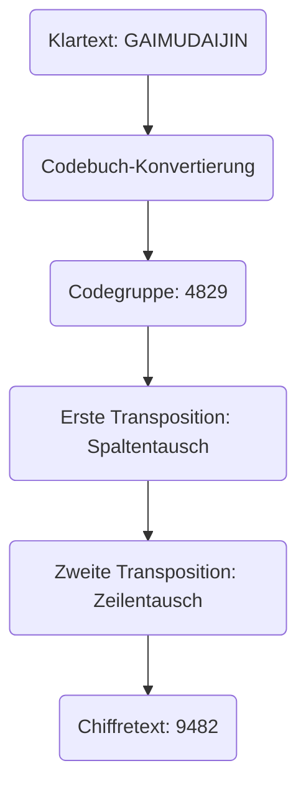
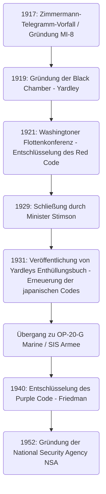

# Aufstieg und Fall der Kryptoanalyse-Agentur „Black Chamber“: Die Männer, die diplomatische Telegramme stahlen und entzifferten, und die Anfänge der amerikanischen Geheimdienste

Das Schicksal von Nationen verbirgt sich oft in unsichtbaren, verschlüsselten Zeichenketten. Wenn man die Geschichte der modernen Nachrichtendienste (Geheimdienste) studiert, gibt es eine legendäre Agentur, die auf dem Weg der Vereinigten Staaten zu einem globalen Informationsimperium unausweichlich ist. Dies ist die „Black Chamber“ (Die Schwarze Kammer). In diesem Artikel werden wir den Aufstieg und Fall dieser geheimen Agentur, die aus den Wirren des Ersten Weltkriegs hervorging, die japanische Diplomatie auf der Washingtoner Flottenkonferenz bloßstellte, im Namen der „Moral“ begraben wurde, aber dennoch die DNA der Geheimdienste hinterließ, die zur modernen National Security Agency (NSA) führte, äußerst detailliert und aus verschiedenen Blickwinkeln erörtern.

---

## Kapitel 1: Der Erste Weltkrieg und die Anfänge der modernen Kryptoanalyse

### Amerikas Kriegseintritt durch den Zimmermann-Telegramm-Vorfall
Kryptografie gibt es seit der Antike, als die Menschheit begann, über Schrift zu kommunizieren. Dass sie jedoch als fundamentales Element der nationalen Strategie über rein militärische Taktik hinaus erkannt wurde, nahm seinen Anfang in den dramatischen Ereignissen des Ersten Weltkriegs im frühen 20. Jahrhundert. Ein Symbol dafür ist der "Zimmermann-Telegramm-Vorfall" von 1917.

Im Januar 1917 sandte der Außenminister des Deutschen Reiches, Arthur Zimmermann, über Washington ein schockierendes geheimes Telegramm an den deutschen Botschafter in Mexiko. Dieses Telegramm forderte Mexiko auf, sich im Falle eines Kriegseintritts der damals neutralen USA auf Seiten der Alliierten mit Deutschland zu verbünden und in den Krieg gegen die USA einzutreten. Im Gegenzug versprach Deutschland Mexiko die Rückgabe der verlorenen Gebiete in Texas, New Mexico und Arizona. Darüber hinaus enthielt es die Anweisung, auch Japan in diese antiamerikanische Allianz zu ziehen.

Dieses Telegramm wurde von "Room 40" (Zimmer 40), der Kryptoanalyse-Abteilung des britischen Marine-Nachrichtendienstes, abgefangen und entschlüsselt. Die britische Regierung war überzeugt, dass die Enthüllung dieser Geheimdienstinformationen die öffentliche Meinung in Amerika erzürnen und ein entscheidender Schlag sein würde, um Präsident Woodrow Wilson zum Kriegseintritt zu bewegen, und übergab sie der amerikanischen Regierung zum perfekten Zeitpunkt. Es war der Moment, in dem die Kryptoanalyse die Räder der Weltgeschichte maßgeblich drehte.

### Gründung der Armee-Nachrichtendienstabteilung MI-8 und Yardleys Ambitionen
Der Zimmermann-Vorfall war den amerikanischen Militärs und Regierungsbeamten eine bittere Lehre. Es war die Angst davor, dass die eigenen Codes völlig durchschaubar waren, und die Erkenntnis, welch strategischen Vorteil man erlangen könnte, wenn man die Kommunikation des Feindes entschlüsseln könnte. Damals gab es in Amerika keine Kryptoanalyse-Agentur auf nationaler Ebene. Aus diesem Krisenbewusstsein heraus wurde 1917 die "MI-8" (Military Intelligence, Section 8) innerhalb des militärischen Nachrichtendienstes gegründet.

Zum Leiter dieser MI-8 wurde Herbert Osborn Yardley, ein junger Telegrafist des Außenministeriums, ernannt. Er war ursprünglich nur ein einfacher Bediener, der in einem Telegrafenamt auf dem Land arbeitete, besaß jedoch den beim Poker kultivierten Sinn für das Spiel und die geniale Fähigkeit, kryptografische Muster intuitiv zu erkennen und Regelmäßigkeiten wie beim Lösen eines Puzzles aufzudecken. Yardley war sehr ehrgeizig und hatte seine Vorgesetzten in Washington verblüfft, indem er aus Langeweile verschlüsselte Telegramme des Außenministeriums entschlüsselte.

### Die europäische Tradition des „Cabinet Noir“
In Europa gab es seit langem die Tradition sogenannter „Cabinet Noir“ (Schwarzer Kammern), staatlicher Einrichtungen, die heimlich Kommunikation zensierten und entschlüsselten. Pioniere wie Antoine Rossignol, der im 17. Jahrhundert in Frankreich unter Kardinal Richelieu wirkte, und der Engländer John Wallis hatten über viele Jahre ausgefeiltes Know-how in der Kryptoanalyse angesammelt. Im damaligen Amerika fehlte eine solche Tradition jedoch völlig. Yardley musste die Organisation aus dem Nichts aufbauen. Er sammelte vielfältige Talente, darunter Mathematiker, Linguisten und Schachmeister, und gründete die erste vollwertige Kryptoanalyse-Agentur Amerikas, MI-8. Sie trugen während des Ersten Weltkriegs unsichtbar bei, indem sie sich hauptsächlich der Entschlüsselung deutscher Feld- und diplomatischer Codes widmeten.

---

## Kapitel 2: Das geheime Kryptobüro in Manhattan, „The Black Chamber“

### Gründung einer Tarnfirma und das Geheimabkommen
Im November 1918 endete der Erste Weltkrieg. Mit der Aufhebung des Kriegszustands wurden die militärischen Geheimdienste verkleinert, und auch der Fortbestand von MI-8 war in Gefahr. Yardley, der den Wert von Geheimdiensten sehr gut kannte, argumentierte jedoch nachdrücklich, dass eine Kryptoanalyse-Agentur auch in Friedenszeiten für die Nation unverzichtbar sei. Ihm gelang es, heimlich ein gemeinsames Budget (etwa 100.000 Dollar pro Jahr) von Außenministerium und Armee zu sichern. So entstand 1919 das erste Friedens-Kryptobüro Amerikas, das später als „The Black Chamber“ (Die Schwarze Kammer) bekannt wurde.

Um die extreme Geheimhaltung der Operationen zu wahren, wurde der Hauptsitz fernab von Washington in einem unauffälligen Stadthaus in der East 37th Street in Manhattan, New York, eingerichtet. Nach außen hin gaben sie sich als privates Unternehmen namens "Code Compilation Company" (Code-Zusammenstellungsgesellschaft) aus, das kommerzielle Codebücher verkaufte.

Ihre größte Waffe war ein Geheimabkommen mit den riesigen Telegrafenunternehmen in den USA. Yardley überzeugte heimlich Führungskräfte wie den Präsidenten von Western Union, Newcomb Carlton, und Beamte von Postal Telegraph. Durch eine Mischung aus Appellen an den Patriotismus und stillschweigendem Druck bauten sie ein System auf, in dem Kopien (Originaldokumente) der Telegramme, die ausländische diplomatische Missionen in Washington mit ihren Heimatländern austauschten, fast täglich an die Black Chamber weitergeleitet wurden. Dies war eine offensichtliche Verletzung des Briefgeheimnisses und eine illegale Handlung, die gegen amerikanisches Recht verstieß, aber im Namen der nationalen Sicherheit wurde alles vertuscht.

Im Stadthaus in Manhattan kämpften die Kryptoanalytiker Tag und Nacht mit den riesigen Bündeln verschlüsselter Telegramme, die täglich geliefert wurden. Sie entschlüsselten die diplomatischen Codes von über 30 Ländern und lieferten Zusammenfassungen des Inhalts an hohe Beamte des Außenministeriums und der Armee. Yardleys größtes Ziel war jedoch die diplomatische Kommunikation des Kaiserreichs Japan, das seine Macht im pazifischen Raum ausweitete. Japans diplomatische Codes waren extrem komplex, aber Yardley zeigte eine außergewöhnliche Besessenheit, diese Festung zu Fall zu bringen.

---

## Kapitel 3: Der Zusammenstoß bei der Washingtoner Flottenkonferenz 1921

### Der Kampf um das Großkampfschiff-Verhältnis 5:5:3
Nach dem Ersten Weltkrieg standen die Großmächte, die unter den enormen Kriegskosten litten, vor der Notwendigkeit, dem Flottenwettrüsten Einhalt zu gebieten. Die von November 1921 bis Februar 1922 abgehaltene "Washingtoner Flottenkonferenz" war der bedeutendste Versuch in dieser Richtung.

Der amerikanische Außenminister Charles Evans Hughes schlug zu Beginn der Konferenz einen mutigen Abrüstungsplan vor: Das Tonnageverhältnis für Großkampfschiffe zwischen den USA, Großbritannien und Japan sollte „5 : 5 : 3“ betragen. Für Japan war dies absolut inakzeptabel. Die japanische Marine argumentierte seit langem, dass eine Flottenstärke von 70% gegenüber den USA eine absolute Voraussetzung für die nationale Verteidigung sei, und lehnte die 60% (5:5:3) entschieden ab, da sie die nationale Sicherheit grundlegend bedrohe. Die bevollmächtigten Botschafter Tomosaburo Kato (Marineminister) und Kijuro Shidehara (Botschafter in den USA) führten harte Verhandlungen.

### Entschlüsselung des Red Code und völlige Kompromittierung
Hinter den Kulissen dieser diplomatischen Verhandlungen führte die Black Chamber eine gründliche Entschlüsselung von Japans diplomatischen Codes durch. Yardley konzentrierte seine ganzen Bemühungen darauf, den streng geheimen Code des japanischen Außenministeriums, bekannt als "Red Code" (Roter Code), zu knacken. Der Rote Code war ein äußerst komplexes System, das ein Codebuch mit einer Transpositionschiffre kombinierte.

Dank Yardleys beharrlicher Analyse wurde die Struktur von Japans diplomatischen Codes vollständig aufgedeckt. Während der Washingtoner Konferenz wurden die verschlüsselten Telegramme, die zwischen der japanischen Delegation und dem Außen- und Marineministerium in Tokio ausgetauscht wurden, noch am selben Tag an die Black Chamber geliefert, entschlüsselt und lagen am nächsten Morgen auf dem Schreibtisch von Außenminister Hughes. Hughes konnte in die Verhandlungen eintreten und wusste genau, wie weit die japanische Delegation zu Zugeständnissen bereit war und kannte alle ihre Karten.

Am 28. November 1921 wurde vom Außenministerium in Tokio ein entscheidendes Anweisungstelegramm an Tomosaburo Kato gesendet. Es enthielt den endgültigen Kompromissvorschlag der japanischen Regierung. Zunächst sollten sie hart auf "70% gegenüber den USA" bestehen, aber falls die Konferenz zu scheitern drohte, sollten sie als letzte Verteidigungslinie "60% (5:5:3)" unter bestimmten Bedingungen akzeptieren, wie etwa dem Verbot der Befestigung von Inseln im Pazifik.

### Der Sieg von Außenminister Hughes
Mit dieser entschlüsselten Information in der Hand führte Hughes die Verhandlungen kaltblütig. Da er wusste, dass Japan letztendlich nachgeben würde, zeigte er keinerlei Kompromissbereitschaft gegenüber der japanischen 70%-Forderung und blieb standhaft. Die japanische Delegation war verwirrt von der ungewöhnlich aggressiven Haltung der Amerikaner, ahnte jedoch nicht im Traum, dass Informationen durchsickerten, und musste schließlich den Anweisungen aus der Heimat Folge leisten. Infolgedessen akzeptierte Japan das Verhältnis „5 : 5 : 3“. Der Abschluss dieses Washingtoner Flottenabkommens wurde als glänzender Triumph der amerikanischen Diplomatie gefeiert, aber hinter den Kulissen spielte die Geheimdienstarbeit der Black Chamber eine entscheidende Rolle.

---

## Kapitel 4: Mathematische und kryptografische Techniken der Kryptoanalyse

Wir werden detailliert auf den technischen Hintergrund eingehen, wie die Black Chamber solch komplexe Codes knacken konnte. Die Codes, mit denen sie konfrontiert waren, bestanden aus vielschichtigen Geheimhaltungssystemen, die ein "Codebuch" mit einer "Super-Chiffrierung" (Überverschlüsselung) kombinierten.

### Entwicklung der Kryptografie und Strukturanalyse von Codes
Damals ersetzte die Kommunikation des japanischen Außenministeriums den Klartext mithilfe eines Codebuchs durch eine Reihe mehrstelliger Zahlen oder Buchstaben (Codegruppen). Um das Risiko des Diebstahls oder der statistischen Analyse des Codebuchs zu verhindern, wurde jedoch eine "Super-Chiffrierung" durchgeführt. Japan verwendete eine "Doppel-Transpositionschiffre" (Double Transposition Cipher), die die Reihenfolge der Buchstaben der Codegruppen nach bestimmten Regeln komplex vertauschte.

Ein Geheimtext, der diese doppelte Transposition durchlaufen hat, verliert jede Ähnlichkeit mit der ursprünglichen Codegruppe. Um dies zu entschlüsseln, musste man die Größe des Transpositionsrasters bestimmen, die Vertauschungsregeln (den Schlüssel) der Zeilen und Spalten herausfinden, um die ursprüngliche Codegruppe zu rekonstruieren (Anagramm), und deren Bedeutung erraten.

### Häufigkeitsanalyse und Kasiski-Test
Yardleys Genialität lag in der Methode, das Transpositionsraster zu rekonstruieren. Er wandte die "Häufigkeitsanalyse" (Frequency Analysis) in extremem Maße an. Da das Japanische für die Verschlüsselung in lateinischen Buchstaben (Romaji) geschrieben wurde, war die Häufigkeit von Vokalen (a, i, u, e, o) ungewöhnlich hoch. Er analysierte statistisch die Häufigkeit des Auftretens von Buchstaben im gesamten Geheimtext, berechnete die Wahrscheinlichkeit, dass bestimmte Buchstabenkombinationen (Digraphen und Trigraphen, wie "sh" oder "ts") nebeneinanderstehen, und fügte die getrennten Spalten wie bei einem Puzzle zusammen.

Zusätzlich wurde häufig der "Kasiski-Test" (Kasiski examination) angewendet. Dies ist eine Methode, um den Abstand zwischen bestimmten Zeichenfolgen zu messen, die im Geheimtext wiederholt vorkommen, und aus deren gemeinsamen Teilern die Schlüssellänge (die Breite des Rasters) abzuschätzen. Dadurch konnte die Periodizität der Transpositionschiffre aufgedeckt werden.

### Der Koinzidenzindex (Index of Coincidence)
Parallel zu den Aktivitäten der Black Chamber formulierte William F. Friedman, ein weiteres amerikanisches Kryptogenie, ein bahnbrechendes mathematisches Werkzeug, den „Koinzidenzindex“ (Index of Coincidence: I.C.).

Dieser zeigt die Wahrscheinlichkeit an, dass zwei zufällig aus dem Geheimtext gewählte Buchstaben genau gleich sind. Friedman bewies, dass man durch die Berechnung dieses I.C. mathematisch bestimmen kann, ob ein Geheimtext mit einem einzelnen Schlüssel, mit mehreren Schlüsseln oder als Transpositionschiffre verschlüsselt ist, selbst wenn die Schlüssellänge noch unbekannt ist. Der Aufstieg von Friedmans rein "mathematisch-statistischem Ansatz" gegenüber Yardleys auf Intuition und Erfahrung basierender Kryptoanalyse symbolisierte die Übergangsphase, in der sich die Kryptoanalyse von "individuellem Genie" zu "systematischer Wissenschaft" entwickelte.

---

## Kapitel 5: Das Ende: „Gentlemen lesen nicht die Post der anderen“

### Stimsons moralische Empörung
Trotz der großen Erfolge auf der Washingtoner Konferenz dauerte die Blütezeit der Black Chamber nicht lange an. Ihr Ende wurde nicht durch externe Angriffe, sondern durch eine "moralische" Entscheidung innerhalb der amerikanischen Regierung herbeigeführt.

Im März 1929 wurde Henry L. Stimson unter der Regierung von Präsident Herbert Hoover zum neuen Außenminister ernannt. Stimson war ein Idealist mit streng protestantischer Ethik. Kurz nach seinem Amtsantritt, während er das Budget des Außenministeriums überprüfte, entdeckte er die Existenz der Black Chamber und die Realität des „illegalen Abhörens der Kommunikation ausländischer diplomatischer Missionen“.

Stimson war wütend. Für ihn war das Ausspionieren der Kommunikation von Verbündeten und befreundeten Nationen ein feiger Verrat, der den Stolz der amerikanischen Diplomatie zutiefst beschmutzte. Er beschloss, die Finanzierung sofort einzustellen, und sprach Worte, die für immer in die Geschichte der Geheimdienste eingegangen sind:

**„Gentlemen lesen nicht die Post der anderen (Gentlemen do not read each other's mail).“**

### Das Enthüllungsbuch und der weltweite Schock
Ohne ihren größten Geldgeber geriet die Black Chamber in finanzielle Schwierigkeiten, und der Börsencrash von 1929 gab ihr den Rest. Am 31. Oktober 1929 wurde die Black Chamber offiziell geschlossen und gezwungen, sich aufzulösen.

Yardley, der während des Tiefpunkts der Großen Depression arbeitslos wurde, geriet in ernsthafte finanzielle Nöte. Sein Patriotismus war betrogen worden, und aus Verzweiflung veröffentlichte er 1931 ein Enthüllungsbuch, „The American Black Chamber“, in dem er seine Erfahrungen ungeschminkt beschrieb.

Dieses Buch enthüllte detailliert die Tatsache, dass Amerika die diplomatischen Codes verschiedener Länder entschlüsselte, und insbesondere das volle Ausmaß der Abhörmaßnahmen gegen die japanische Kommunikation auf der Washingtoner Konferenz. Das Buch, das zu einem weltweiten Bestseller wurde, versetzte Japan in einen gewaltigen Schock. Die japanische Regierung und das Militär gerieten in Panik, als sie erfuhren, dass ihr strengster Geheimcode völlig durchschaubar war, und zerstörten sofort alle kryptografischen Systeme. Aus dieser Enthüllung zogen sie Lehren und trieben die Entwicklung einer weitaus fortschrittlicheren Rotormaschine, der „Typ 97 Chiffriermaschine für europäische Schrift (Purple)“, in rasendem Tempo voran. Ironischerweise führte Yardleys Enthüllung zu einem gewaltigen Sprung in Japans Kryptotechnologie.

---

## Kapitel 6: Das Vermächtnis der Black Chamber

### Das Erbe von OP-20-G und SIS
Obwohl die Black Chamber ein unrühmliches Ende fand, starben die Samen der Geheimdienstarbeit, die sie gesät hatten, nicht aus. Ihr Know-how und einige ihrer Mitarbeiter wurden heimlich in die Kommunikations-Nachrichtendienst-Einheit der US-Marine, „OP-20-G“, übernommen. Joseph Rochefort und andere bei OP-20-G führten mathematische Ansätze und mechanische Datenverarbeitung ein und entschlüsselten den Code „JN-25“ der japanischen Marine, identifizierten „AF“ (Midway) und verhalfen 1942 in der Schlacht um Midway zu einem historischen Sieg.

Gleichzeitig wurde in der Armee der "Signal Intelligence Service" (SIS) gegründet, geleitet von William Friedman. Er lehnte Yardleys auf persönliche Intuition gestützte Methode ab und etablierte ein System der "wissenschaftlichen Kryptoanalyse", das strikt auf mathematischen und statistischen Theorien basierte.

### Von der Entschlüsselung des Purple-Codes zur NSA
Die größte Leistung des von Friedman geleiteten SIS war die erfolgreiche, vollständige Entschlüsselung des japanischen Top-Secret-Maschinencodes „Purple“ im Jahr 1940. Ohne die tatsächliche Maschine jemals gesehen zu haben, deduzierten sie die Verdrahtung des Schrittschaltwerk-Mechanismus durch rein logische Analysen und bauten eine Nachbildung (Magic). Diese als „MAGIC“ bezeichneten Informationen boten von unschätzbarem Wert für die strategischen Entscheidungen während des Zweiten Weltkriegs. Ironischerweise kehrte Stimson, der einst die Black Chamber geschlossen hatte, als Kriegsminister zurück und wurde nun ein eifriger Konsument von MAGIC.

Nach dem Krieg, im Jahr 1952, konsolidierte die amerikanische Regierung mit der Verschärfung des Kalten Krieges ihre kryptografischen Agenturen und gründete die gigantische elektronische Nachrichtenagentur „National Security Agency (NSA)“. Im Fundament der heutigen NSA, die ein globales Kommunikationsnetzwerk überwacht und Supercomputer nutzt, lebt unverkennbar die DNA von Yardley und den Männern der Black Chamber, die in einem kleinen Stadthaus in Manhattan den Codes wie Puzzles begegneten.

Der Aufstieg und Fall der Black Chamber war der entscheidende Wendepunkt, der die Morgendämmerung der amerikanischen Geheimdienste einläutete, als der Staat den absoluten Wert der Waffe „Information“ erkannte und die Büchse der Pandora öffnete, die zum modernen Cyberkrieg führte.

Diese historische Entwicklung beweist kaltblütig, dass Geheimdienstarbeit nicht länger ein Nebenaspekt der Diplomatie ist, sondern eine Kerntechnologie, die über das Überleben einer Nation entscheidet. Yardleys Leidenschaft und Ehrgeiz sowie die geheimen Machenschaften der Black Chamber sind unverzichtbare Ausgangspunkte, die wir niemals vergessen dürfen, wenn wir die heutige komplexe Gesellschaft des Informationskriegs und der Cybersicherheit verstehen wollen.

## Anhang: Vertiefende Überlegungen und technische Details zur Black Chamber

Aufbauend auf dem im Hauptteil skizzierten historischen Hintergrund werden wir hier eine detailliertere Analyse der spezifischen technischen Schwierigkeiten vor Ort bei der Kryptoanalyse, der Asymmetrie von Geheimdienstinformationen in der damaligen internationalen Politik sowie der komplexen psychologischen Struktur der Person Yardley liefern, um eine akademischere und praktischere Tiefe hinzuzufügen.

### 1. Praktische Schwierigkeiten bei der Entschlüsselung der Doppel-Transpositionschiffre (Double Transposition)
Wie bereits erwähnt, war die Super-Chiffrierung im vom japanischen Außenministerium verwendeten Roten Code eine Doppel-Transpositionschiffre. Der Prozess, dies nur mit Papier und Bleistift zu entschlüsseln, war eine Kombination aus hochgradiger Intuition und logischem Denken, völlig anders als die modernen computergestützten Brute-Force-Angriffe (Ausprobieren aller Möglichkeiten).

Der erste Schritt bei der Entschlüsselung der Doppel-Transpositionschiffre besteht darin, die „genaue Länge der Nachricht“ zu ermitteln. Wenn der Geheimtext beispielsweise aus „35 Zeichen“ besteht, ist es sehr wahrscheinlich, dass das Raster die Größe „5x7“ oder „7x5“ hat. Wenn die Anzahl der Zeichen jedoch eine Primzahl wie „37 Zeichen“ war, besteht die Möglichkeit, dass der verschlüsselnde Bediener einige Blindzeichen (Nullen) hinzugefügt hat, um ein Rechteck zu bilden, oder dass er eine „Unvollständige Spalten-Transposition“ (Incomplete Columnar Transposition) verwendet hat, bei der die Transposition durchgeführt wird, während bestimmte Felder leer bleiben. Da das japanische Außenministerium diese unvollständige Spalten-Transposition häufig einsetzte, war die Entschlüsselung extrem schwierig.

Yardley und sein Team begannen damit, eine große Anzahl von Nachrichten unterschiedlicher Länge (sogenannte „isomorphe Texte“) zu sammeln, die mit demselben Schlüssel verschlüsselt waren. Durch den Vergleich dieser isomorphen Texte wurde es möglich, ein Muster zu finden, wo sich leere Felder im Raster befanden, und so die Spaltenlänge zu bestimmen. Dies nennt man „Multiple Anagramming“.

Sobald die Spaltenlänge bestimmt war, erfolgte im nächsten Schritt die Neuordnung der Spalten auf Basis der Häufigkeit von Vokalen. Wenn beispielsweise eine Spalte viele „A“ oder „O“ enthält und eine andere viele „K“ oder „S“, ist die Wahrscheinlichkeit hoch, dass durch das Aneinanderfügen dieser Spalten japanische Silben (in Romaji) wie „KA“ oder „SO“ wiederhergestellt werden können. Yardley bewertete Tausende bis Zehntausende solcher Silbenpaare statistisch und leitete die wahrscheinlichste Kombination von Spalten ab. Es war eine Meisterleistung vergleichbar mit dem blinden Lösen eines riesigen Zauberwürfels und beruhte eher auf einem tiefen Verständnis der Sprachstruktur als auf Mathematik.

### 2. Die Besessenheit der Codebuch-Rekonstruktion
Selbst wenn die Transpositionsregel (der Schlüssel) geknackt war, führte das lediglich dazu, dass die zufälligen Zeichenketten wieder zu „bedeutungslosen Codegruppen“ (Zahlen- oder Buchstabenblöcken) wurden. Die nächste Hürde war, die Bedeutung dieser Codegruppen zu erraten und das Codebuch selbst von Grund auf neu aufzubauen.

Was dies ermöglichte, war der „Kontext“ und „Standardphrasen“. Diplomatische Telegramme haben ein spezifisches Format. Am Anfang stehen oft der Empfänger, der Absender, das Datum sowie standardisierte Anweisungen wie „dringend“ oder „vertraulich“. Auch bestimmte Themen tauchten zu bestimmten Zeiten häufig auf. Während der Washingtoner Konferenz war leicht vorherzusehen, dass Wörter wie „Schlachtschiff“ (Battleship), „Tonnage“, „Verhältnis“ (Ratio) oder „Hughes“ hin und her fliegen würden.

Yardleys Team ordnete diese vermuteten Wörter (sogenannte „Cribs“) dem Geheimtext zu und überprüfte auf Widersprüche. Wenn sie beispielsweise annahmen, dass die Codegruppe „6832“ „Marine“ bedeutet, und diese Codegruppe in einem anderen Telegramm in einem Kontext auftauchte, der nichts mit Abrüstung zu tun hatte, wurde die Annahme als falsch verworfen. Auf diese Weise bauten sie von Grund auf ein riesiges Wörterbuch auf, ein Prozess, der Jahre dauerte. Genau dieses präzise rekonstruierte Codebuch war das wahre Kapital der Black Chamber.

### 3. Asymmetrie von Geheimdienstinformationen und die Grenzen des „Gentlemen's Agreement“
Die Tatsache, dass Amerika bei der Washingtoner Konferenz die japanischen Codes entschlüsselte, zeigt mehr als nur den Vorteil eines Landes bei Verhandlungen; es verdeutlicht den entscheidenden Einfluss der „Geheimdienst-Asymmetrie“ auf internationale Beziehungen.

Die damalige internationale Ordnung um den Völkerbund basierte auf den Prämissen von „öffentlicher Diplomatie“ und „gegenseitigem Vertrauen auf Verträge“. Dahinter jedoch lauerte die bittere Realität, dass derjenige, der den Informationskrieg beherrschte, die Initiative bei der Regelsetzung übernahm. Während Japan durch den von Amerika vertretenen idealistischen Rahmen der „Abrüstung“ gebunden war, saß es tatsächlich an einem Verhandlungstisch, an dem sein eigener Kompromisspunkt – sein „Boden“ – den Amerikanern vollständig bekannt war.

Diese Asymmetrie zeigt, wie sehr der Wert von Informationen physische Militärmacht (wie die Anzahl von Schlachtschiffen) übertreffen kann. Hätte Japan damals gewusst, dass seine Codes geknackt waren, und stattdessen durch Täuschung (Deception) falsche Informationen gestreut, wäre das Ergebnis des Washingtoner Systems möglicherweise völlig anders ausgefallen.

Hinter Henry Stimsons Entscheidung, die Black Chamber zu schließen, stand die tiefe Sorge, dass ein solches „Spiel im Schatten“ die „auf Rechtsstaatlichkeit basierende internationale Ordnung“, an die er glaubte, von Grund auf verderben würde. Stimsons Ausspruch „Gentlemen lesen nicht die Post der anderen“ wird oft als naiver Idealismus belächelt, aber er war auch ein starkes Bekenntnis zu jener „neuen, hochtransparenten Art von Diplomatie“, die Amerika damals anstrebte. Die Geschichte wählte jedoch nicht Stimsons Idealismus, sondern Yardleys Realismus (Machiavellismus).

### 4. Die Ambivalenz der Figur Herbert O. Yardley
Wenn man die Geschichte der Black Chamber erzählt, ist Yardleys einzigartiger Charakter ein unverzichtbares Element. Er war nicht nur ein brillanter Kryptoanalytiker, sondern auch eine komplexe Persönlichkeit voller Eitelkeit und Ehrgeiz.

Er besaß ein absolutes Vertrauen in seine eigenen Fähigkeiten und verhielt sich Regierungsbeamten gegenüber oft arrogant. Als die Black Chamber auf der Washingtoner Konferenz erfolgreich war, sah er sich selbst als „den Schattenhelden, der Amerika gerettet hat“, und forderte noch mehr Budget und Macht. Die Essenz eines Geheimdienstes besteht jedoch darin, im „Schatten“ zu bleiben. Seine Geltungssucht war ein fataler Makel für den Leiter eines Geheimdienstes, der im Verborgenen operieren sollte.

Dass Yardley nach Stimsons Schließungsbeschluss das Buch „The American Black Chamber“ veröffentlichte, entsprang nicht nur finanzieller Not; es war auch eine bittere Rache an der Regierung, die ihn kaltblütig behandelt hatte, sowie der unbändige Drang, der Welt seine eigene Genialität zu beweisen.

Durch diese Enthüllung wurde er auf ewig aus der amerikanischen Geheimdienstgemeinschaft verbannt. Obwohl die US-Regierung während des Zweiten Weltkriegs händeringend nach Experten für Kryptoanalyse suchte, wurde Yardley nie wieder für ein öffentliches Amt zugelassen. Er ging nach China und half den Nationalisten bei der Code-Entschlüsselung oder unterstützte die kanadische Regierung bei der Gründung einer Geheimdienstabteilung, kehrte jedoch nie wieder ins Zentrum nationaler Projekte zurück, wie er es einst tat.

Yardley starb 1958 desillusioniert, aber sein Vermächtnis ist immens. Er stellt uns eine grundlegende Frage, die bis heute aktuell ist: Welche Rolle sollen Geheimdienste in einem Staat spielen und wie kollidiert das mit persönlichen Ambitionen und der Ethik? Ihn einfach als „Verräter“ oder „geldsüchtigen Informanten“ abzutun, ist einfach, aber in der Geschichte des amerikanischen Geheimwesens gibt es keine andere Figur, die so viel Licht und Schatten geworfen hat wie Yardley.

### 5. Der Weg zur Entschlüsselung der Purple-Maschine: Vom Analogen zum Digitalen
Dass Japan infolge von Yardleys Enthüllung sein kryptografisches System komplett überarbeitete, zwang die amerikanische Kryptoanalyse-Technologie zu einer rasanten Weiterentwicklung in die nächste Dimension. Die von Japan eingeführte „Typ 97 Chiffriermaschine für europäische Schrift (Purple)“ war ein komplexer maschineller Code, der sich mit den linguistischen Anagrammen und Häufigkeitsanalysen, wie Yardley sie meisterte, niemals knacken ließ.

An dieser Stelle traten William Friedman und der von ihm geführte SIS (Signal Intelligence Service) auf den Plan. Friedman erhob die Kryptoanalyse von der „persönlichen Intuition“ zur „Verschmelzung von Mathematik und Maschinenbau“. Die Purple-Maschine nutzte mehrere Schrittschalter (Drehschalter, die in Telefonvermittlungen verwendet werden), um Eingabezeichen durch komplexe elektrische Schaltungen in andere Zeichen zu verwandeln. Das Verbindungsmuster dieser Schaltung änderte sich bei jedem Tastenanschlag, sodass der Verschlüsselungsalgorithmus ständig fluktuierte.

Das SIS-Team (einschließlich brillanter Mathematiker wie Frank Rowlett) führte umfassende mathematische Analysen der winzigen statistischen Abweichungen durch, die in den abgefangenen Geheimtexten vorhanden waren, sowie der operativen Fehler japanischer Diplomaten (wie dem Senden mehrerer Nachrichten mit denselben Schlüsseleinstellungen). Obwohl sie das Original der Purple-Maschine nie zu Gesicht bekamen, bauten sie auf dem Papier vollständig die logische Struktur der internen Verkabelung der Maschine nach.

Dieser Prozess unterschied sich grundlegend vom „Rätsellösen“ zu Yardleys Zeit; er bestand aus dem Aufbau hochentwickelter mathematischer Modelle, die heute die Grundlage der modernen Kryptografietheorie bilden. Als Friedmans Team die analoge Purple-Nachbildung „Magic“ vollendete, läutete das das Ende der auf Einzelpersonen basierenden Kryptoanalyse im Stile Yardleys ein und kündigte den Beginn einer technologiegetriebenen „Signal Intelligence“ (SIGINT)-Ära an, die direkt zur NSA führte.

### Fazit
Die Geschichte der „Black Chamber“ ist der dramatische erste Akt in der historischen Beziehung zwischen Staat und Information. Yardleys Intuition, Stimsons Moral und Friedmans Wissenschaft. Der Konflikt und Evolutionsprozess dieser drei Aspekte bieten tiefe historische Erkenntnisse in Fragen von „Geheimdienst und Ethik“, wie sie in heutigen Cyberkriegen oder im Fall Edward Snowden aufgeworfen werden. Die Beharrlichkeit der Männer, die diplomatische Telegramme stahlen und knackten, lebt, wenngleich in veränderter Form, in den Tiefen des modernen Staates beständig weiter.

### 6. Die moderne Bedeutung der Black Chamber aus Sicht der Informationsgeschichte
Im großen historischen Kontext reicht das Erbe der Black Chamber weit über die bloße Evolution der Kryptoanalyse-Technologien hinaus. Man kann sagen, dass dies der Ursprung war, als „Information (Intelligence)“ begann, als eigenständiges Machtzentrum einer Nation zu fungieren.

Was Yardley aufbaute, war ein System, das militärischen und diplomatischen Entscheidungsfindungen solide Beweise („Hard Intelligence“) lieferte, gewonnen aus unsichtbaren Quellen. Während sich die bisherige Diplomatie stark auf Berichte von Botschaftern und die Analyse offener Informationen („Soft Intelligence“) stützte, ermöglichte der Akt der Entschlüsselung feindlicher Kommunikation das direkte Extrahieren der „ungefilterten wahren Absichten“ des Gegners.

Moderne Signal-Intelligence-Agenturen wie die amerikanische National Security Agency (NSA) oder das britische Government Communications Headquarters (GCHQ) haben in ihrer technologischen Basis Fortschritte gemacht, die mit Yardleys Zeit nicht mehr vergleichbar sind. Dennoch bewegen sie sich bei ihrer wesentlichen Mission, „das Kommunikationsgeheimnis zu durchbrechen und Informationen als Waffe zu nutzen“, weiterhin auf dem Entwurf, den Yardley gezeichnet hat. Die Geschichte von Aufstieg und Fall der Black Chamber stellt uns auch im 21. Jahrhundert noch immer die unbeantwortete tiefgreifende Frage, wie weit ein Staat bei der Verletzung ethischer Grenzen gehen darf, um seine eigene Sicherheit zu gewährleisten.
