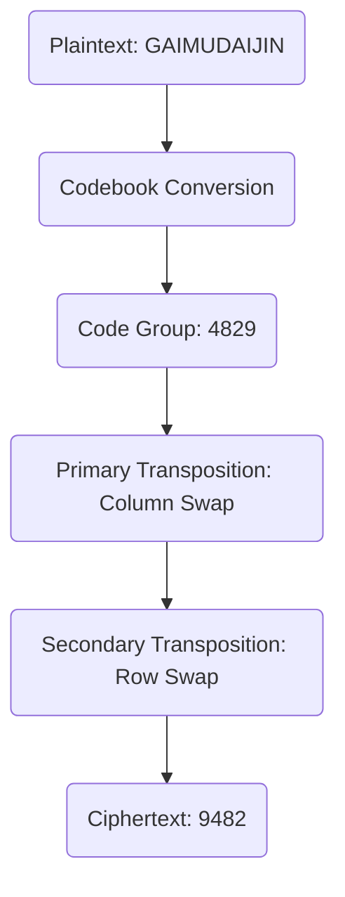
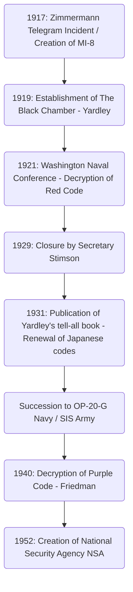

# The Rise and Fall of the Cryptanalysis Agency 'The Black Chamber': The Men Who Stole Diplomatic Telegrams and the Dawn of American Intelligence

The fate of a nation is often hidden within the invisible strings of cryptic codes. When unraveling the history of modern intelligence (espionage), there exists one legendary agency that cannot be overlooked in the process of the United States growing into a global intelligence empire. That is "The Black Chamber". In this article, we will discuss in extreme detail and from various angles the rise and fall of this secret agency, which was born out of the chaos of World War I, laid bare Japanese diplomacy at the Washington Naval Conference, and was buried in the name of "morality," while leaving behind the intelligence DNA that leads to the modern National Security Agency (NSA).

---

## Chapter 1: World War I and the Birth of Modern Cryptanalysis

### American Entry into the War Prompted by the Zimmermann Telegram Incident
The technique of cryptography has existed since ancient times when humanity began communicating through writing. However, it was a dramatic event in the early 20th century during World War I that made it recognized as an essential element of national strategy, transcending mere military tactics. The symbol of this is the "Zimmermann Telegram Incident" of 1917.

In January 1917, Arthur Zimmermann, the State Secretary for Foreign Affairs of the German Empire, sent a shocking secret telegram via Washington to the German ambassador in Mexico. This telegram urged Mexico to ally with Germany and enter the war against the United States in the event that the then-neutral U.S. entered the war on the side of the Allies. In return, Germany promised Mexico the recovery of lost territories in Texas, New Mexico, and Arizona. Furthermore, it included instructions to draw Japan into this anti-American alliance.

This telegram was intercepted and decoded by "Room 40," the cryptanalysis department of British Naval Intelligence. Convinced that the revelation of this intelligence would enrage American public opinion and deliver a decisive blow to force President Woodrow Wilson's decision to enter the war, the British government provided it to the U.S. government with exquisite timing. It was the moment when cryptanalysis significantly turned the gears of world history.

### The Creation of Army Intelligence MI-8 and Yardley's Ambition
The Zimmermann Incident taught a bitter lesson to the U.S. military and high-ranking government officials: the terror that their own codes were totally transparent, and the fact of how much strategic advantage could be gained if enemy communications could be decrypted. At the time, the United States had no national-level cryptanalysis agency. Driven by this sense of crisis, "MI-8 (Military Intelligence, Section 8)" was created within the Military Intelligence Division in 1917.

Selected to head this MI-8 was Herbert Osborn Yardley, a young telegraph operator in the State Department. Originally just an operator working at a rural telegraph office, he possessed a genius ability to intuitively spot patterns in codes and uncover regularities like solving a puzzle, using the instincts honed through poker. Yardley had strong upward mobility and had been surprising his superiors by decrypting encrypted telegrams exchanged at the State Department in Washington in his spare time.

### The Tradition of Europe's "Cabinet Noir"
Europe had a long-standing tradition of agencies called "Cabinet Noir," where the state secretly censored and decrypted communications. Antoine Rossignol, who served under Cardinal Richelieu in 17th century France, and John Wallis of England were among the pioneers, accumulating exquisite cryptanalysis know-how over many years. However, the United States at the time had absolutely no such tradition. Yardley had to build an organization entirely from scratch. He scraped together personnel with diverse talents—from mathematicians and linguists to chess masters—and launched MI-8, America's first full-fledged cryptanalysis agency. During World War I, they primarily challenged the decryption of German military field codes and diplomatic codes, contributing invisibly.

---

## Chapter 2: Manhattan's Secret Cryptographic Bureau "The Black Chamber"

### Establishing a Front Company and Secret Agreements
In November 1918, World War I ended. With the lifting of the wartime regime, military intelligence agencies were downsized, and MI-8 also faced an existential crisis. However, Yardley, who thoroughly understood the value of intelligence, strongly argued that a cryptanalysis agency was indispensable to the nation even in peacetime. He succeeded in secretly extracting a joint budget (about $100,000 annually) from the State Department and the Army. Thus, in 1919, America's first peacetime secret cryptanalytic bureau was born, later known as "The Black Chamber".

To maintain extreme secrecy for their operations, the base was located away from Washington in an inconspicuous townhouse on East 37th Street in Manhattan, New York. Outwardly, they disguised themselves as a private enterprise called the "Code Compilation Company," pretending to sell commercial codebooks.

Their greatest weapon was a secret agreement with giant telegraph companies within the United States. Yardley secretly persuaded executives such as Newcomb Carlton, the president of Western Union, and those at Postal Telegraph. Using a mix of appeals to patriotism and unspoken pressure, he built a system where copies (originals) of telegrams exchanged between the diplomatic corps stationed in Washington and their home countries were diverted to the Black Chamber almost daily. This was a clear violation of the secrecy of communications and an illegal act under U.S. domestic law, but everything was buried in darkness under the righteous cause of national security.

In the Manhattan townhouse, cryptanalysts struggled day and night before bundles of encrypted telegrams delivered daily. They decrypted the diplomatic codes of more than 30 countries and delivered summaries of the contents to high-ranking officials in the State Department and the Army. However, Yardley's primary target was the diplomatic communications of the Empire of Japan, which was expanding its influence in the Pacific region. Japanese diplomatic codes were extremely difficult, but Yardley burned with an abnormal obsession to conquer this fortress.

---

## Chapter 3: The Clash at the 1921 Washington Naval Conference

### The Life-or-Death Struggle Over the Capital Ship Ratio of 5:5:3
After World War I, the great powers, suffering from enormous war expenses, were pressed by the need to halt the naval arms race. The "Washington Naval Conference," held from November 1921 to February 1922, was the ultimate attempt to do so.

U.S. Secretary of State Charles Evans Hughes presented a bold disarmament proposal at the outset of the conference, setting the capital ship tonnage ratio for the U.S., Britain, and Japan at "5:5:3". For Japan, this was completely unacceptable. The Japanese Navy had long insisted that a naval strength of 70% against the U.S. was an absolute condition for national defense, and strongly opposed the 60% ratio (5:5:3), claiming it fundamentally threatened national security. The plenipotentiaries, Tomosaburo Kato (Minister of the Navy) and Kijuro Shidehara (Ambassador to the U.S.), engaged in fierce negotiations.

### Decryption of the Red Code and Total Leakage
Behind these diplomatic negotiations, a thorough decryption of Japanese diplomatic codes was being conducted by the Black Chamber. Yardley mobilized all efforts to crack the Japanese Ministry of Foreign Affairs' highest-secret code, commonly known as the "Red Code". The Red Code was a highly complex system that combined a codebook with transposition ciphers.

Through Yardley's tenacious analysis, the structure of Japan's diplomatic codes was completely exposed. During the Washington Conference, encrypted telegrams exchanged between the Japanese delegation and the Ministry of Foreign Affairs and Ministry of the Navy in Tokyo were delivered to the Black Chamber on the same day, decoded, and placed on Secretary of State Hughes' desk by the next morning. Hughes was able to enter the negotiations knowing exactly how far the Japanese delegation was willing to compromise, knowing all their hands.

On November 28, 1921, a decisive telegram of instructions was sent from the Ministry of Foreign Affairs in Tokyo to Tomosaburo Kato. It contained the Japanese government's final compromise plan. Initially, they were to strongly insist on "70% against the U.S.," but if the conference seemed likely to break down, they were to accept "60% against the U.S. (5:5:3)" as the final line of defense, with conditions such as a ban on the fortification of Pacific islands.

### Secretary of State Hughes' Victory
Armed with this decrypted intelligence, Hughes ruthlessly advanced the negotiations. Knowing that Japan would eventually compromise, he showed absolutely no concession to Japan's 70% demand and maintained a resolute attitude. The Japanese negotiators were bewildered by the American side's abnormally bullish stance, but never dreaming that their information was leaking, they ultimately had no choice but to yield as instructed by their home country. As a result, Japan accepted the "5:5:3" ratio. The conclusion of this Washington Naval Treaty was praised as a glorious major victory for American diplomacy, but behind it, the intelligence of the Black Chamber had played a decisive role.

---

## Chapter 4: The Mathematical and Cryptographic Techniques of Cryptanalysis

We will detail the technical background of how the Black Chamber decrypted complex codes. The codes they faced were a multi-layered concealment system that combined a "codebook" with a "superencipherment (re-encryption)".

### Evolution of Cryptographic History and Structural Analysis of Codes
At the time, the communications of the Japanese Ministry of Foreign Affairs replaced plaintext with strings of digits or letters (code groups) of several digits using a codebook. However, to prevent the risk of the codebook being stolen or subjected to statistical analysis, "superencipherment" was performed. What the Japanese side used was a "Double Transposition Cipher," which complexly rearranged the order of the letters in the code groups according to a certain rule.

The ciphertext that went through this double transposition completely lost the trace of the original code group. To decipher this, it was necessary to determine the grid size of the transposition, figure out the row and column swap rules (keys) to reconstruct (anagram) the original code group, and deduce its meaning.

### Frequency Analysis and the Kasiski Examination
Yardley's genius lay in the procedure for reconstructing the transposition grid. He applied "Frequency Analysis" to the extreme. Because of the characteristic that Japanese was romanized and then encrypted, the frequency of appearance of vowels (a, i, u, e, o) became abnormally high. He statistically analyzed the frequency of appearance of letters throughout the ciphertext, calculated the probability that specific combinations of letters (digraphs and trigraphs, such as "sh" and "ts") would be adjacent, and joined separated columns together like a jigsaw puzzle.

Furthermore, the "Kasiski examination" was also heavily used. This is a technique that measures the intervals of specific strings that appear repeatedly in the ciphertext and estimates the length of the encryption key (the width of the grid) from their common divisors. This made it possible to uncover the periodicity of the transposition cipher.

### Index of Coincidence
Parallel to the activities of the Black Chamber, another American cryptographic genius, William F. Friedman, was formulating a groundbreaking mathematical tool called the "Index of Coincidence (I.C.)".

This indicates the probability that when two letters are randomly selected from a ciphertext, they are exactly the same letter. Friedman proved that by calculating this I.C., it could be mathematically determined whether a ciphertext was encrypted with a single key, multiple keys, or a transposition cipher, even at a stage where the length of the key was unknown. The rise from decryption based on Yardley's intuition and experience to Friedman's purely "mathematical and statistical approach" symbolized the transitional period during which cryptanalysis evolved from "individual genius" to "organizational science."

---

## Chapter 5: Demise: "Gentlemen do not read each other's mail"

### Stimson's Moral Outrage
Despite the great success at the Washington Conference, the glory of the Black Chamber did not last long. Its demise was brought about not by external attacks, but by a "moral" decision from within the U.S. government.

In March 1929, under the administration of President Herbert Hoover, Henry L. Stimson took office as the new Secretary of State. Stimson was an idealist with a strict Protestant sense of ethics. Immediately after taking office, while scrutinizing the use of the State Department's budget, he learned of the existence of the Black Chamber and the reality of its "illegal interception of foreign embassies' communications."

Stimson was furious. To him, the act of stealing a glance at the communications of allies and friendly nations was a despicable betrayal that severely tarnished the pride of American diplomacy. He decided to cut off funding immediately and uttered words that will be forever engraved in the history of intelligence.

**"Gentlemen do not read each other's mail."**

### The Tell-All Book and Global Shock
Having lost its biggest sponsor, the Black Chamber fell into financial difficulties, and the Great Depression of 1929 dealt the final blow. On October 31, 1929, the Black Chamber was officially closed and forced to disband.

Unemployed at the rock bottom of the Great Depression, Yardley faced severe financial hardship. Feeling that his patriotism had been betrayed, driven by despair, he published a tell-all book, *The American Black Chamber*, in 1931, vividly detailing his experiences.

This book meticulously exposed the reality that the United States had been decrypting the diplomatic codes of various countries, particularly the full picture of the interception of Japanese communications during the Washington Conference. The book, which became a global bestseller, dealt an immense shock to Japan. The Japanese government and military fell into a panic over the fact that their highest-secret codes had been totally transparent, and immediately discarded all their cryptographic systems. And, taking this exposure as a lesson, they rushed to develop a more advanced mechanical cipher, the "Type 97 Alphabetical Typewriter (Purple)", at a rapid pace. Ironically, Yardley's exposure exponentially advanced Japan's cryptographic technology.

---

## Chapter 6: The Legacy of the Black Chamber

### Succession to OP-20-G and SIS
Although the Black Chamber met an untimely end, the seeds of intelligence they sowed did not die out. Their know-how and some of their personnel were secretly taken over by "OP-20-G," the communications intelligence division of the U.S. Navy. Joseph Rochefort and others in OP-20-G introduced mathematical approaches and mechanical data processing, and during the Battle of Midway in 1942, they decrypted the Japanese Navy's code "JN-25," identified "AF (Midway)," and brought about a historic victory.

Meanwhile, in the Army, the "Signal Intelligence Service (SIS)" was established, led by William Friedman. He rejected Yardley's methods relying on personal intuition and established a system of "scientific cryptanalysis" based on thorough mathematical and statistical theories.

### From the Decryption of the Purple Code to the NSA
The greatest achievement of the SIS led by Friedman was the successful complete decryption of the mechanical cipher "Purple Code," Japan's highest secret, in 1940. Without ever seeing the actual machine, they deduced the wiring of the stepping-switch mechanism through logical analysis alone and built a replica (MAGIC). This intelligence, "MAGIC," provided incalculable value to strategic decision-making in World War II. Ironically, Stimson, who had once closed the Black Chamber, returned as Secretary of War and this time became a passionate consumer of MAGIC.

After the war, in 1952, with the intensification of the Cold War, the U.S. government consolidated its cryptographic agencies and created a massive electronic intelligence agency, the "National Security Agency (NSA)." At the foundation of today's NSA, which monitors global communications networks and makes full use of supercomputers, the DNA of Yardley and the men of the Black Chamber—who challenged codes like solving puzzles in a small townhouse in Manhattan—certainly lives on.

The rise and fall of the Black Chamber was a decisive turning point heralding the dawn of American intelligence agencies, opening Pandora's box where nations realized the absolute value of "information" as a weapon, leading up to modern cyber warfare.

This historical trajectory coldly proves that intelligence is no longer a mere adjunct to diplomacy, but a core technology that dictates the survival of a nation. Yardley's passion and ambition, and the secret maneuvers of the Black Chamber, can be said to be the starting point that must never be forgotten when understanding today's complex information warfare and cybersecurity society.

## Addendum: In-depth Discussion and Technical Details Surrounding the Black Chamber

Building on the historical background outlined in the main text, we will add further academic and practical depth here by providing a more detailed analysis of the specific technical difficulties on the front lines of cryptanalysis, the asymmetry of intelligence in international politics at the time, and the complex psychological structure of the figure Yardley.

### 1. Practical Difficulties in Decrypting the Double Transposition Cipher
As mentioned above, the superencipherment (re-encryption) in the Red Code used by the Japanese Ministry of Foreign Affairs was a double transposition cipher. The process of decrypting this with only paper and pencil was a highly sophisticated combination of intuition and logical reasoning, entirely different from a brute-force attack by modern computers.

The first step to deciphering a double transposition cipher is grasping the "exact length of the message." For example, if the ciphertext is "35 characters," the grid size is likely "5x7" or "7x5". However, if the character count is a prime number like "37 characters," there is a possibility that the operator performing the encryption added several dummy characters (nulls) to form a rectangle, or used an "Incomplete Columnar Transposition" where the transposition is performed leaving specific squares blank. Because the Japanese Ministry of Foreign Affairs frequently used this incomplete columnar transposition, decryption was extremely difficult.

Yardley and his team began by collecting a large number of messages of different lengths encrypted with the same key (these are called "isologs"). By comparing the isologs, it becomes possible to find patterns of where the blank squares are placed within the grid and determine the lengths of the columns. This is called "Multiple Anagramming."

Once the length of the columns is determined, the next step is to rearrange the columns based on the frequency of appearance of vowels. For instance, if one column contains many "A"s and "O"s, and another column contains many "K"s and "S"s, placing them adjacent to each other has a high probability of restoring Japanese syllables (roman letters) such as "KA" or "SO." Yardley statistically scored thousands to tens of thousands of such syllable pairs and derived the most probable combinations of columns. This was a godlike feat akin to solving a massive Rubik's Cube blindfolded, and relied on a profound insight into the structure of language rather than on mathematics.

### 2. The Obsession with Codebook Reconstruction
Even if the rules of transposition (the key) were broken, it simply meant that a random string of characters had returned to "meaningless code groups (blocks of numbers or letters)." The next hurdle was to guess what words these code groups meant and to reconstruct the codebook itself from scratch.

What made this possible was "context" and "standard phrases." Diplomatic telegrams have specific formats. The beginning often includes standard instructions such as addressee, sender, date, and terms like "Urgent" or "Confidential." Also, specific topics appear frequently at specific times. During the Washington Conference period, it was easy to anticipate that words like "Battleship", "Tonnage", "Ratio", and "Hughes" would be flying back and forth.

Yardley's team applied these guessed words (called cribs) to the ciphertext and verified whether any contradictions arose. For example, if the code group "6832" was assumed to mean "Navy," and that code group appeared in another telegram in a context entirely unrelated to disarmament, that assumption was discarded as incorrect. Thus, the work of giving meaning to each code group and compiling a massive dictionary from scratch continued for years. The elaborateness of this reconstructed codebook was the true asset of the Black Chamber.

### 3. The Asymmetry of Intelligence and the Limits of the "Gentleman's Agreement"
The fact that the United States had decrypted Japan's codes at the Washington Conference demonstrates the decisive impact of the "asymmetry of intelligence" in international relations, far beyond just one nation advancing negotiations advantageously.

The international order centered on the League of Nations at the time was premised on "open diplomacy" and "mutual trust in treaties." However, behind the scenes, there existed the cold reality that the one who mastered the information war would hold the initiative in rule-making. While Japan was bound by the idealistic framework of "disarmament" advocated by the United States, it was actually seated at the negotiation table with its bottom line for compromise completely known to the other side.

This asymmetry shows how the value of information can surpass physical military power (such as the number of battleships). If Japan had realized at the time that its own codes were broken and had instead conducted deception operations by feeding false information, the outcome of the Washington system might have been entirely different.

Behind Henry Stimson's closure of the Black Chamber was a strong fear that such "behind-the-scenes games" fundamentally corrupted the "international order based on the rule of law" that he believed in. Stimson's words, "Gentlemen do not read each other's mail," are often mocked as naive idealism, but it was also a fierce commitment to the "highly transparent new form of diplomacy" that the United States was striving for at the time. However, history would choose Yardley's realism (Machiavellianism) over Stimson's idealism.

### 4. The Ambivalence of the Figure Herbert O. Yardley
When telling the story of the Black Chamber, Yardley's unique character is an indispensable element. He was not merely an excellent cryptanalyst, but a complex figure filled with an urge for self-display and ambition.

He possessed absolute confidence in his own abilities and sometimes behaved arrogantly even towards high-ranking government officials. When the Black Chamber achieved success at the Washington Conference, he considered himself the "shadow hero who saved America" and demanded more budget and authority. However, the essence of an intelligence agency is to be the "shadow." His urge for self-display was a fatal flaw for the head of an intelligence agency that was supposed to operate in secret.

The act of Yardley publishing *The American Black Chamber* after Stimson's declaration of closure was not simply for monetary gain out of financial hardship, but a bitter revenge against the government that had given him the cold shoulder, and at the same time, an uncontrollable manifestation of the desire to make his genius known to the world.

Through this exposure, he was permanently banished from the American intelligence community. Even during World War II, when the U.S. government desperately needed cryptanalysis experts, Yardley was never again permitted to hold a public position. Although he traveled to China to assist the Nationalist Party with cryptanalysis and collaborated in the establishment of the Canadian government's cryptanalytic agency, he never made a comeback to the center of a national project as he once did.

Yardley passed away in despair in 1958, but what he left behind is exceedingly vast. He poses to us a fundamental question that remains relevant today: what role intelligence agencies should play in a nation, and how that clashes with individual ambition and ethics. While it is easy to dismiss him as a mere "traitor" or "money-grabbing exposer," there is no other figure in the history of American intelligence who cast such intense light and shadow as Yardley.

### 5. The Path to the Decryption of the Purple Cipher Machine: From Analog to Digital
The fact that Japan renewed its cryptographic system due to Yardley's exposure resulted in forcefully advancing American cryptanalysis technology to the next dimension. The "Type 97 Alphabetical Typewriter (Purple)" introduced by Japan was a complex mechanical cipher that could never be decrypted by the linguistic anagrams or frequency analysis at which Yardley excelled.

Here emerged William Friedman and his SIS (Signal Intelligence Service). Friedman elevated cryptanalysis from "individual intuition" to the "fusion of mathematics and mechanical engineering." The Purple cipher machine used multiple stepping-switches (rotary switches used in telephone exchanges) to convert input characters into other characters through complex electrical circuits. Because the connection pattern of this circuit changed every time a key on the keyboard was struck, the encryption algorithm fluctuated constantly.

The SIS team (which included brilliant mathematicians like Frank Rowlett) exhaustively mathematically analyzed the extremely minute statistical biases present in the intercepted ciphertexts and the operational mistakes made by Japanese diplomats (such as sending multiple messages with the same key setting). Even though they had never seen the actual Purple cipher machine, they completely reproduced on paper how the internal wiring of that machine was logically constructed.

This process was fundamentally different from the "puzzle-solving" of Yardley's era, being the construction of sophisticated mathematical models that form the basis of today's cryptographic theory. When Friedman's team completed the analog replica of Purple, "MAGIC," it heralded the end of Yardley's personalized cryptanalysis and the dawn of the technology-driven signals intelligence (SIGINT) era that leads to the NSA.

### Conclusion
The story of "The Black Chamber" is the dramatic first act in the history of the relationship between state and information. Yardley's intuition, Stimson's morality, and Friedman's science. The process of conflict and evolution among these three provides deep historical insight into the problems of "intelligence and ethics" questioned in today's cyber warfare in cyberspace and incidents like the Edward Snowden case. The tenacity of the men who stole and deciphered diplomatic telegrams continues to live on unceasingly deep within the modern state, albeit in different forms.

### 6. The Modern Significance of the Black Chamber from the Perspective of Information History
In the broad context of history, the legacy left by the Black Chamber goes beyond the mere evolution of cryptanalysis technology. It can be said to be the dawn of the era when "information (intelligence)" began to function as an independent center of power of the state.

What Yardley built was a system that provided solid evidence (hard intelligence) obtained from invisible sources for military and diplomatic decision-making. Whereas diplomacy until then had relied heavily on the reports of ambassadors and the analysis of public information (soft intelligence), the act of decrypting enemy codes made it possible to directly extract the opponent's "unvarnished true intentions."

Signals intelligence agencies such as the modern National Security Agency (NSA) and the UK's Government Communications Headquarters (GCHQ) have made leaps and bounds in their technological foundations that are incomparable to Yardley's era. However, in their essential mission to "break the secrecy of communications and weaponize information," they continue to walk on the blueprint drawn by Yardley. The history of the rise and fall of the Black Chamber continues to thrust upon us a profound proposition to which there is still no answer even in the 21st century: how far a nation should cross ethical boundaries in order to protect its own security.
