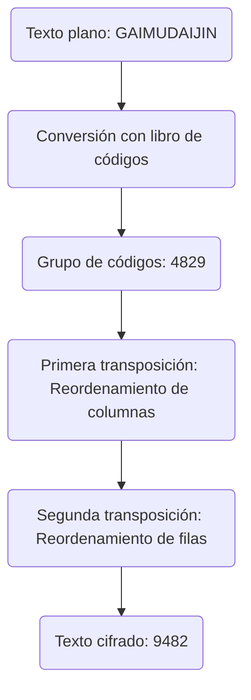
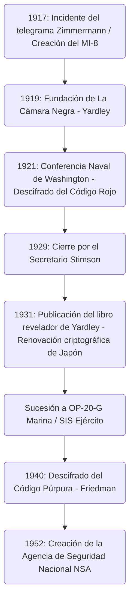

# El auge y caída de la organización de descifrado "La Cámara Negra": Los hombres que robaron y descifraron telegramas diplomáticos y el amanecer de las agencias de inteligencia estadounidenses

El destino de una nación a menudo se oculta en cadenas invisibles de códigos. Al desentrañar la historia de la inteligencia moderna, hay una institución legendaria que es inevitable en el proceso en el que los Estados Unidos crecieron hasta convertirse en un imperio mundial de inteligencia. Se trata de "La Cámara Negra" (The Black Chamber). En este artículo discutiremos de forma extremadamente detallada y multifacética el auge y la caída de esta agencia secreta, que nació de la agitación de la Primera Guerra Mundial, desnudó a la diplomacia japonesa en la Conferencia Naval de Washington y dejó el ADN de inteligencia que llega hasta la actual Agencia de Seguridad Nacional (NSA), a pesar de haber sido enterrada en nombre de la "moralidad".

---

## Capítulo 1: La Primera Guerra Mundial y el nacimiento del criptoanálisis moderno

### La entrada de Estados Unidos en la guerra debido al incidente del telegrama Zimmermann
La tecnología de la criptografía ha existido desde la antigüedad, cuando la humanidad comenzó a comunicarse por escrito. Sin embargo, no fue hasta un dramático evento en la Primera Guerra Mundial, a principios del siglo XX, que dejó de ser una mera táctica militar para ser reconocida como un elemento fundamental de la estrategia nacional. Su símbolo es el "incidente del telegrama Zimmermann" en 1917.

En enero de 1917, el Ministro de Asuntos Exteriores del Imperio Alemán, Arthur Zimmermann, envió un sorprendente telegrama secreto al embajador alemán en México, vía Washington. En previsión de que Estados Unidos, entonces neutral, entrara en la guerra del lado de los Aliados, este telegrama instaba a México a aliarse con Alemania y entrar en guerra contra Estados Unidos. A cambio, Alemania prometía a México la recuperación de los territorios perdidos en Texas, Nuevo México y Arizona. Además, incluía instrucciones para atraer a Japón a esta alianza antiestadounidense.

Este telegrama fue interceptado y descifrado por la "Habitación 40" (Room 40), el departamento especializado en criptoanálisis de la Inteligencia Naval Británica. El gobierno británico, convencido de que la revelación de esta inteligencia enfurecería a la opinión pública estadounidense y asestaría el golpe decisivo para que el presidente Woodrow Wilson decidiera entrar en la guerra, lo proporcionó al gobierno estadounidense en el momento perfecto. Fue el momento en que el criptoanálisis hizo girar con fuerza los engranajes de la historia mundial.

### La creación del MI-8 de la Inteligencia del Ejército y la ambición de Yardley
El incidente de Zimmermann dio una severa lección a los militares y altos funcionarios del gobierno de EE. UU.: el miedo a que sus propios códigos fueran completamente transparentes y el hecho de la enorme ventaja estratégica que se podía obtener al descifrar las comunicaciones enemigas. En ese momento, Estados Unidos no tenía una agencia de criptoanálisis a nivel nacional. A partir de este sentido de crisis, se creó la "MI-8" (Military Intelligence, Section 8) dentro del Departamento de Inteligencia del Ejército en 1917.

Para liderar esta MI-8, fue seleccionado un joven operador de telégrafos del Departamento de Estado, Herbert Osborn Yardley. Originalmente, era solo un operador que trabajaba en una oficina de telégrafos rural, pero poseía una intuición competitiva cultivada a través del póquer y una habilidad genial para percibir intuitivamente patrones en los códigos, descubriendo regularidades como si resolviera un rompecabezas. Yardley tenía una fuerte ambición de ascenso y sorprendía a sus superiores descifrando telegramas cifrados intercambiados en el Departamento de Estado en Washington para matar el tiempo.

### La tradición del "Cabinet Noir" (Gabinete Negro) europeo
En Europa, existía desde hacía mucho tiempo una institución tradicional llamada "Cabinet Noir" (Gabinete Negro), en la que el Estado censuraba y descifraba las comunicaciones en secreto. Antoine Rossignol, que actuó bajo las órdenes del primer ministro francés Richelieu en el siglo XVII, y el británico John Wallis, fueron pioneros que acumularon un sofisticado conocimiento de criptoanálisis a lo largo de muchos años. Sin embargo, en aquel entonces no existía ninguna tradición similar en Estados Unidos. Yardley tuvo que construir la organización desde cero absoluto. Reunió a personas con diversos talentos, como matemáticos, lingüistas e incluso maestros de ajedrez, y fundó la primera agencia de criptoanálisis real de Estados Unidos, la MI-8. Durante la Primera Guerra Mundial, asumieron el desafío de descifrar principalmente los códigos de campo y diplomáticos del ejército alemán, contribuyendo de manera invisible.

---

## Capítulo 2: La oficina secreta de códigos de Manhattan "La Cámara Negra"

### Establecimiento de una empresa pantalla y acuerdos secretos
En noviembre de 1918, terminó la Primera Guerra Mundial. Con el levantamiento del régimen de guerra, las agencias de inteligencia militar se redujeron, y la MI-8 también enfrentó una crisis de supervivencia. Sin embargo, Yardley, conociendo el valor de la inteligencia, argumentó firmemente que una agencia de criptoanálisis era esencial para la nación incluso en tiempos de paz. Logró extraer secretamente un presupuesto conjunto (unos 100,000 dólares anuales) del Departamento de Estado y del Ejército. Así, en 1919, nació la primera agencia secreta de criptografía en tiempos de paz de Estados Unidos, más tarde llamada "La Cámara Negra" (The Black Chamber).

Para mantener un secreto extremo en sus actividades, la base se estableció lejos de Washington, en una modesta casa en la calle 37 Este, en Manhattan, Nueva York. Ostensiblemente, se disfrazaba de una empresa privada llamada "Code Compilation Company" (Compañía de Compilación de Códigos), pretendiendo vender libros de códigos comerciales.

Su mayor arma fue un acuerdo secreto con las gigantescas compañías de telégrafos de Estados Unidos. Yardley persuadió en secreto a los ejecutivos, incluyendo al presidente de Western Union, Newcomb Carlton, y a los de Postal Telegraph. Mezclando apelaciones al patriotismo con presión implícita, construyó un sistema que canalizaba copias (originales) de los telegramas intercambiados diariamente por las misiones diplomáticas de cada país en Washington hacia La Cámara Negra. Esta era una clara violación del secreto de las comunicaciones y un acto ilegal según las leyes estadounidenses, pero bajo la causa de la seguridad nacional, todo fue ocultado.

En la casa de Manhattan, los criptoanalistas luchaban día y noche frente a enormes paquetes de telegramas cifrados entregados a diario. Descifraban los códigos diplomáticos de más de 30 países, resumiendo su contenido para entregarlo a los altos funcionarios del Departamento de Estado y del Ejército. Sin embargo, el mayor objetivo de Yardley eran las comunicaciones diplomáticas del Imperio de Japón, que estaba expandiendo su influencia en la región del Pacífico. Los códigos diplomáticos japoneses eran extremadamente difíciles, pero Yardley mostró una obsesión extraordinaria por derribar esta fortaleza.

---

## Capítulo 3: El choque en la Conferencia Naval de Washington en 1921

### La lucha a muerte por la proporción 5:5:3 de buques capitales
Después de la Primera Guerra Mundial, las principales potencias, agobiadas por enormes gastos de guerra, se vieron obligadas a poner fin a la carrera armamentista naval. La "Conferencia Naval de Washington", celebrada entre noviembre de 1921 y febrero de 1922, fue el intento más notable.

El Secretario de Estado de Estados Unidos, Charles Evans Hughes, presentó al comienzo de la conferencia una audaz propuesta de desarme para fijar la proporción de tonelaje de buques capitales entre EE. UU., Gran Bretaña y Japón en "5:5:3". Para Japón, esto era completamente inaceptable. La Armada japonesa había argumentado durante mucho tiempo que el 70% del poder naval de EE. UU. era un requisito absoluto para la defensa nacional, y se opuso firmemente al 60% (5:5:3), afirmando que amenazaba su seguridad desde la base. Los embajadores plenipotenciarios Tomosaburo Kato (Ministro de Marina) y Kijuro Shidehara (Embajador en EE. UU.) llevaron a cabo intensas negociaciones.

### El descifrado del Código Rojo y la filtración total
Detrás de estas negociaciones diplomáticas, La Cámara Negra estaba llevando a cabo un descifrado exhaustivo de los códigos diplomáticos japoneses. Yardley dedicaba todo su esfuerzo a descifrar el código ultrasecreto del Ministerio de Asuntos Exteriores de Japón, comúnmente conocido como el "Código Rojo" (Red Code). El Código Rojo era un sistema muy complejo que combinaba un libro de códigos (codebook) con un cifrado de transposición.

Gracias al obstinado análisis de Yardley, la estructura del código diplomático japonés quedó al descubierto. Durante la Conferencia de Washington, los telegramas cifrados intercambiados entre la delegación japonesa y los Ministerios de Asuntos Exteriores y de Marina en Tokio eran entregados a La Cámara Negra el mismo día, descifrados y colocados en el escritorio del Secretario de Estado Hughes a la mañana siguiente. Hughes pudo entrar en las negociaciones sabiendo exactamente todas las cartas de Japón y hasta qué punto la delegación japonesa estaba dispuesta a ceder.

El 28 de noviembre de 1921, el Ministerio de Asuntos Exteriores en Tokio envió un telegrama de instrucciones decisivo dirigido a Tomosaburo Kato. En él se describía el plan de compromiso final del gobierno japonés: aunque al principio se debía presionar fuertemente por el "70% respecto a EE. UU.", si la conferencia estaba a punto de fracasar, aceptarían el "60% (5:5:3)" como última línea de defensa, bajo condiciones como la prohibición de fortificar islas en el Pacífico.

### La victoria del Secretario de Estado Hughes
Con esta información descifrada en sus manos, Hughes avanzó en las negociaciones de manera despiadada. Sabiendo que Japón finalmente cedería, no mostró ningún compromiso ante la demanda japonesa del 70%, manteniendo una actitud firme. La delegación japonesa, aunque desconcertada por la inusualmente agresiva actitud de Estados Unidos, y sin sospechar que su información se había filtrado, al final no tuvo más remedio que ceder según las instrucciones de su país. Como resultado, Japón aceptó la proporción de "5:5:3". La conclusión de este Tratado Naval de Washington fue elogiada como una brillante victoria de la diplomacia estadounidense, pero detrás de ella, la inteligencia de La Cámara Negra había jugado un papel decisivo.

---

## Capítulo 4: Las técnicas matemáticas y criptográficas del criptoanálisis

A continuación, se detalla el trasfondo técnico de cómo La Cámara Negra descifraba códigos tan complejos. El cifrado al que se enfrentaron era un sistema de ocultación multicapa que combinaba un "libro de códigos" con un "supercifrado" (re-cifrado).

### La evolución de la historia criptográfica y el análisis de la estructura de los códigos
Las comunicaciones del Ministerio de Asuntos Exteriores de Japón en aquel momento reemplazaban el texto plano por secuencias de números o letras de varios dígitos (grupos de códigos) utilizando un libro de códigos. Sin embargo, para evitar el riesgo de que el libro de códigos fuera robado o sometido a análisis estadístico, se aplicaba un "supercifrado". El método utilizado por Japón era un "Cifrado de Doble Transposición" (Double Transposition Cipher), que reordenaba de forma compleja el orden de las letras en los grupos de códigos según reglas específicas.

El texto cifrado resultante de esta doble transposición perdía cualquier semejanza con el grupo de códigos original. Para descifrarlo, era necesario determinar el tamaño de la cuadrícula de transposición, descubrir las reglas (claves) de reordenamiento de filas y columnas para reconstruir (anagramar) el grupo de códigos original, e inferir su significado.

### Análisis de frecuencia y el examen Kasiski
La genialidad de Yardley radicaba en su procedimiento para reconstruir la cuadrícula de transposición. Aplicó el "Análisis de Frecuencia" (Frequency Analysis) al extremo. Dada la característica de que el texto cifrado era japonés escrito en letras romanas, la frecuencia de aparición de vocales (a, i, u, e, o) era anormalmente alta. Analizó estadísticamente la frecuencia de aparición de las letras en todo el texto cifrado, calculó la probabilidad de que combinaciones específicas de letras (dígrafos y trígrafos, como "sh" o "ts") fueran adyacentes, y unió las columnas separadas como en un rompecabezas.

Además, utilizó frecuentemente el "Examen Kasiski" (Kasiski examination). Esta técnica mide la distancia entre secuencias de caracteres específicas que aparecen repetidamente en el texto cifrado, e infiere la longitud de la clave criptográfica (el ancho de la cuadrícula) a partir de su divisor común. Con esto, pudo descubrir la periodicidad del cifrado de transposición.

### Índice de Coincidencia (Index of Coincidence)
En paralelo a las actividades de La Cámara Negra, otro genio criptográfico estadounidense, William F. Friedman, estaba formulando una herramienta matemática revolucionaria llamada "Índice de Coincidencia" (Index of Coincidence: I.C.).

Esto indica la probabilidad de que al elegir dos letras al azar del texto cifrado, sean exactamente la misma letra. Friedman demostró que calculando este I.C. era posible determinar matemáticamente si un texto cifrado estaba encriptado con una sola clave, con múltiples claves o si era un cifrado de transposición, incluso sin conocer la longitud de la clave. El ascenso del puro "enfoque matemático y estadístico" de Friedman frente al descifrado basado en la intuición y la experiencia de Yardley, simbolizó la fase de transición en la que el criptoanálisis evolucionó del "genio individual" a la "ciencia sistemática".

---

## Capítulo 5: El fin: "Los caballeros no leen el correo de los demás"

### La indignación moral de Stimson
A pesar de su gran éxito en la Conferencia de Washington, la gloria de La Cámara Negra no duró mucho. Su fin no llegó por un ataque externo, sino por una decisión "moral" interna del gobierno estadounidense.

En marzo de 1929, bajo la administración del presidente Herbert Hoover, Henry L. Stimson asumió el cargo como nuevo Secretario de Estado. Stimson era un idealista con una estricta ética protestante. Inmediatamente después de asumir el cargo, al escudriñar el uso del presupuesto del Departamento de Estado, se enteró de la existencia de La Cámara Negra y de la realidad de la "interceptación ilegal de las comunicaciones de misiones extranjeras".

Stimson se enfureció. Para él, espiar las comunicaciones de países aliados o amigos era una traición despreciable que manchaba gravemente el orgullo de la diplomacia estadounidense. Decidió inmediatamente cortar la financiación y pronunció unas palabras que quedarían grabadas para siempre en la historia de la inteligencia:

**"Los caballeros no leen el correo de los demás (Gentlemen do not read each other's mail)."**

### El libro de revelaciones y su impacto mundial
Al perder a su mayor patrocinador, La Cámara Negra enfrentó dificultades financieras, y la Gran Depresión de 1929 le dio el golpe de gracia. El 31 de octubre del mismo año, La Cámara Negra fue cerrada oficialmente y se vio obligada a disolverse.

Yardley, desempleado en el fondo de la Gran Depresión, enfrentó graves dificultades económicas. Sintiéndose traicionado en su patriotismo e impulsado por la desesperación, publicó en 1931 un libro de revelaciones titulado "The American Black Chamber" (La Cámara Negra Estadounidense), detallando sus experiencias sin rodeos.

Este libro exponía con precisión la realidad de que Estados Unidos descifraba los códigos diplomáticos de varios países, y especialmente la totalidad de la intercepción de las comunicaciones de Japón durante la Conferencia de Washington. Este libro, que se convirtió en un éxito de ventas mundial, causó un profundo impacto en Japón. El gobierno y el ejército japonés entraron en pánico ante el hecho de que su código ultrasecreto fuera completamente transparente, e inmediatamente destruyeron todos sus sistemas criptográficos. Luego, usando esta revelación como lección, se apresuraron a desarrollar una máquina criptográfica mecánica más avanzada, la "Máquina de Cifrado Tipo 97 (Púrpura)". Irónicamente, la revelación de Yardley hizo evolucionar dramáticamente la tecnología criptográfica de Japón.

---

## Capítulo 6: El legado de La Cámara Negra

### Sucesión al OP-20-G y al SIS
Aunque La Cámara Negra tuvo un final trágico, la semilla de la inteligencia que sembraron no murió. Sus conocimientos y parte de su personal fueron transferidos en secreto al "OP-20-G", el departamento de inteligencia de comunicaciones de la Marina de los EE. UU. Joseph Rochefort y otros en el OP-20-G introdujeron enfoques matemáticos y el procesamiento de datos mecánicos, y en la Batalla de Midway en 1942 descifraron el código de la Marina japonesa "JN-25", identificando a "AF" como Midway, lo que llevó a una victoria histórica.

Por otro lado, en el Ejército se fundó el "Servicio de Inteligencia de Señales" (Signal Intelligence Service, SIS), liderado por William Friedman. Él rechazó los métodos dependientes de la intuición personal de Yardley, y estableció un sistema de "criptoanálisis científico" basado enteramente en una exhaustiva teoría matemática y estadística.

### Del descifrado del Código Púrpura a la NSA
El mayor logro del SIS liderado por Friedman fue el exitoso descifrado completo del "Código Púrpura", el cifrado mecánico ultrasecreto de Japón, en 1940. Lograron inferir el cableado del mecanismo de interruptores rotatorios utilizando únicamente el análisis lógico, sin haber visto la máquina original, construyendo así una réplica (Magic). Esta inteligencia, conocida como "MAGIC", proporcionó un valor incalculable para las decisiones estratégicas de la Segunda Guerra Mundial. Irónicamente, Stimson, quien anteriormente había cerrado La Cámara Negra, regresó como Secretario de Guerra y se convirtió en un ávido consumidor de MAGIC.

En la posguerra, en 1952, ante la intensificación de la Guerra Fría, el gobierno de los Estados Unidos integró las agencias criptográficas y creó la enorme agencia de inteligencia electrónica "Agencia de Seguridad Nacional (NSA)". En la base de la NSA actual, que monitorea redes de comunicación a nivel mundial utilizando supercomputadoras, ciertamente vive el ADN de Yardley y los hombres de La Cámara Negra, quienes en una pequeña casa en Manhattan se enfrentaron a los códigos como si resolvieran rompecabezas.

El auge y la caída de La Cámara Negra marcan el momento en el que la nación se dio cuenta del valor absoluto de la "información" como arma, y abrieron la caja de Pandora que conduciría a la moderna guerra cibernética, constituyendo un punto de inflexión decisivo que anunciaba el amanecer de las agencias de inteligencia estadounidenses.

Esta trayectoria histórica demuestra fríamente que la inteligencia ya no es un apéndice de la diplomacia, sino una tecnología central que determina la supervivencia de la nación. La pasión y la ambición de Yardley, así como las actividades encubiertas de La Cámara Negra, son sin duda el punto de origen que nunca debe olvidarse para comprender la compleja guerra de la información y la sociedad de la ciberseguridad actual.

## Apéndice: Consideraciones profundas y detalles técnicos en torno a La Cámara Negra

Basado en el resumen histórico presentado en el texto principal, en este apéndice se añadirán análisis más detallados para aportar mayor profundidad académica y práctica acerca de las dificultades técnicas concretas en la escena del criptoanálisis, la asimetría de inteligencia en la política internacional de la época y la compleja estructura psicológica de la figura de Yardley.

### 1. Las dificultades prácticas en el descifrado del Cifrado de Doble Transposición (Double Transposition)
Como se mencionó anteriormente, el supercifrado (re-cifrado) en el Código Rojo utilizado por el Ministerio de Asuntos Exteriores de Japón era un cifrado de doble transposición. El proceso de descifrarlo solo con lápiz y papel era completamente distinto a los ataques de fuerza bruta por computadoras modernas; era una combinación de intuición de alto nivel e inferencia lógica.

El primer paso para descifrar el cifrado de doble transposición era comprender la "longitud exacta del mensaje". Por ejemplo, si el texto cifrado constaba de "35 letras", era muy probable que el tamaño de la cuadrícula fuera "5×7" o "7×5". Sin embargo, si la longitud era un número primo como "37 letras", era posible que el operador que realizó el cifrado hubiera añadido algunos caracteres de relleno (nulos) para formar un rectángulo, o hubiera empleado una "Transposición Columnar Incompleta" (Incomplete Columnar Transposition), dejando espacios en blanco específicos durante la transposición. El Ministerio de Asuntos Exteriores de Japón utilizaba frecuentemente esta transposición columnar incompleta, lo que hacía extremadamente difícil el descifrado.

Yardley y su equipo comenzaron recolectando grandes cantidades de mensajes de diferentes longitudes cifrados con la misma clave (denominados "mensajes isométricos"). Al comparar los mensajes isométricos, fue posible encontrar el patrón de dónde se encontraban las celdas vacías dentro de la cuadrícula y determinar la longitud de las columnas. Esto se conoce como "Anagramado Múltiple" (Multiple Anagramming).

Una vez determinada la longitud de las columnas, el siguiente paso era reordenar las columnas en función de la frecuencia de aparición de las vocales. Por ejemplo, si una columna contenía muchas letras "A" u "O", y otra columna contenía muchas letras "K" o "S", ubicarlas una junto a la otra tenía una alta probabilidad de restaurar sílabas japonesas (romaji) como "KA" o "SO". Yardley anotó estadísticamente miles y hasta decenas de miles de tales pares de sílabas, logrando la combinación de columnas más probable. Esto era un logro sobrehumano comparable a resolver un cubo de Rubik gigante con los ojos vendados, dependiendo de una profunda percepción de la estructura del lenguaje en lugar de las matemáticas en sí.

### 2. La obsesión por reconstruir el libro de códigos
Incluso si se rompía la regla (clave) de transposición, el resultado era que cadenas aleatorias simplemente volvían a ser "grupos de códigos sin sentido (bloques de números o letras)". El siguiente obstáculo era el trabajo de deducir el significado de estos grupos de códigos, y de reconstruir el libro de códigos entero a partir de cero.

Lo que hizo esto posible fue el "contexto" y las "frases formales". Los telegramas diplomáticos tienen un formato distintivo. Con frecuencia, el inicio del mensaje incluye el remitente, el destinatario, la fecha e instrucciones estándar como "Urgente" o "Confidencial". Además, durante un período específico aparecían temas particulares de manera recurrente. Era de esperarse fácilmente que, durante la Conferencia de Washington, abundaran palabras como "Acorazado" (Battleship), "Tonelaje" (Tonnage), "Proporción" (Ratio) y "Hughes" (Hughes).

El equipo de Yardley aplicaba estas probables palabras (llamadas Crib) al texto cifrado, para verificar que no surgiera ninguna contradicción. Por ejemplo, si suponían que el grupo de códigos "6832" significaba "Marina", y este grupo de códigos aparecía en otro telegrama en un contexto sin relación alguna con el desarme, esa suposición se consideraba incorrecta y se descartaba. De este modo, continuó durante años el trabajo de asignar un significado a cada grupo de códigos, creando un diccionario gigante partiendo de cero. La precisión de este libro de códigos reconstruido fue el verdadero patrimonio de La Cámara Negra.

### 3. La asimetría en la inteligencia y los límites del "Acuerdo de Caballeros"
El hecho de que Estados Unidos hubiera descifrado los códigos de Japón durante la Conferencia de Washington, muestra el impacto decisivo de la "asimetría de inteligencia" en las relaciones internacionales, mucho más allá de la mera ventaja en las negociaciones para un país.

El orden internacional de aquella época, centrado en la Sociedad de Naciones, presuponía la "diplomacia abierta" y la "confianza mutua en los tratados". Sin embargo, en segundo plano, la cruda realidad era que aquel que dominaba la guerra de la información tomaba el liderazgo en la formulación de las reglas. Japón, atado por el marco idealista del "desarme" propuesto por Estados Unidos, fue sentado a la mesa de negociaciones con el nivel de "fondo" de su punto de compromiso completamente conocido.

Esta asimetría demuestra cómo el valor de la información podía superar la fuerza militar física (como el número de acorazados). Si Japón en ese entonces hubiera descubierto que sus propios códigos habían sido rotos, y en su lugar hubiera implementado un trabajo de engaño (deception) introduciendo información falsa, el resultado del sistema de Washington podría haber sido completamente distinto.

El trasfondo del cierre de La Cámara Negra por Henry Stimson, se debía a su profundo temor de que un "juego de sombras" semejante, corrompiera de raíz el "orden internacional basado en el Estado de derecho" en el que él creía. La frase de Stimson, "Los caballeros no leen el correo de los demás", ha sido frecuentemente objeto de burla tildándola de idealismo ingenuo, pero fue también su poderoso compromiso con la "forma de tener una nueva diplomacia de gran transparencia" a la que EE. UU. aspiraba. Sin embargo, la historia no eligió el idealismo de Stimson, sino el realismo de Yardley (maquiavelismo).

### 4. La ambivalencia de la figura de Herbert O. Yardley
Para contar la historia de La Cámara Negra, el carácter particular de Yardley es un elemento indispensable. No fue solamente un excelente criptoanalista, sino una figura compleja y llena de ambiciones y un enorme afán de protagonismo.

Tenía una confianza absoluta en sus habilidades, comportándose con arrogancia incluso frente a los altos funcionarios del gobierno. Cuando La Cámara Negra logró el éxito en la Conferencia de Washington, él se vio a sí mismo como el "héroe en la sombra que salvó a Estados Unidos", reclamando más presupuesto y poder. Sin embargo, la esencia de la agencia de inteligencia es ser la "sombra". Su afán de notoriedad era una falla crítica para el líder de una agencia de inteligencia que requería actuar de forma encubierta.

Después de la notificación del cierre dada por Stimson, la acción de Yardley de publicar "The American Black Chamber" (La Cámara Negra Estadounidense) no solo tuvo fines económicos debido a sus dificultades de subsistencia, sino que también fue una amarga venganza contra el gobierno que lo había tratado con frialdad, y a la vez el estallido de un incontrolable deseo de darle a conocer al mundo su genio y habilidad.

Por causa de esta revelación, él fue desterrado permanentemente de la comunidad de inteligencia estadounidense. Pese a la inmensa necesidad que el gobierno estadounidense tuvo de expertos en descifrado de códigos durante la Segunda Guerra Mundial, no se le permitió a Yardley volver a asumir una posición de servicio oficial. Luego viajó a China y apoyó el descifrado del gobierno nacionalista (Kuomintang), o colaboró en la formación de la agencia de inteligencia para el gobierno de Canadá, pero jamás retornaría al centro de un proyecto a escala nacional como los de la anterioridad.

Yardley falleció en 1958 hundido en la desilusión, pero su legado fue inmenso. Nos presenta la gran pregunta, que aún resuena en nuestros días, sobre cuál es el papel de una agencia de inteligencia en una nación, y cómo esto colisiona de frente con la ética y las ambiciones de un individuo. Sería sencillo ignorarlo simplemente llamándolo "traidor" o "exhibicionista motivado por dinero", pero dentro de la historia de la inteligencia estadounidense no existe otro individuo que haya proyectado un resplandor y una sombra con tal magnitud como Yardley.

### 5. El viaje hacia el descifrado de la máquina del Código Púrpura: De lo analógico a lo digital
La renovación del sistema de códigos por parte de Japón debido a la revelación de Yardley provocó una obligatoria evolución del cifrado de Estados Unidos a una siguiente etapa. El sistema que introdujo Japón, "Máquina de Cifrado Tipo 97 (Púrpura)", fue un sistema mecanizado de alta complejidad imposible de descifrar usando meros análisis de frecuencias y los anagramas lingüísticos a los que estaba habituado Yardley.

Es aquí donde aparece William Friedman y su dirección del SIS (Servicio de Inteligencia de Señales). Friedman supo elevar la técnica de descifrado, llevándola de ser una "intuición individual", a una "fusión matemática e ingeniería mecánica". La máquina del Código Púrpura empleaba una pluralidad de interruptores rotatorios (stepping switch) para tomar una letra digitada y transformarla en otra pasando a través de complejos circuitos eléctricos. Al estar el circuito de conexiones alternando su patrón cada vez que la tecla era pulsada, los algoritmos de encriptación eran objeto de constantes y repetidas variaciones.

El equipo del SIS (que incluía excelentes matemáticos como Frank Rowlett), analizó matemáticamente de modo completo desde los minúsculos e imperceptibles sesgos estadísticos existentes en los mensajes encriptados y las fallas de operación (como usar la misma configuración de claves para mandar más de un mensaje) cometidas por los diplomáticos japoneses. Lograron sobre papel reproducir al pie de la letra en qué forma y en qué sentido lógico era construido y ordenado el complejo alambrado interno dentro de la máquina sin ver nunca la máquina física original.

Este proceso difiere fundamentalmente del "rompecabezas" que pertenecía a la época de Yardley, logrando estructurar por vez primera un modelo matemático altamente complejo y base en temas que engloban las teorías criptográficas de nuestra actualidad. Al terminar la máquina de copia analógica de Púrpura, referida como "Magic", por el grupo de Friedman, se decretó la etapa final frente a la capacidad de descifrado dependiente puramente de la genialidad humana al estilo Yardley, dando al mismo tiempo un punto de arranque a la etapa SIGINT (Inteligencia de Señales) impulsada por tecnología que conduciría a la NSA.

### Conclusión
El relato de la "Cámara Negra" es un dramático primer acto en la historia de la relación entre el Estado y la información. La intuición de Yardley, la moralidad de Stimson y la ciencia de Friedman. El conflicto y la evolución de estos tres elementos nos proveen una profunda perspectiva histórica hacia los problemas de "Inteligencia y Ética" que se discuten hoy en día, en contextos como la guerra de la información en el ciberespacio contemporáneo o en incidentes como el de Edward Snowden. La obsesión de aquellos hombres por robar y descifrar telegramas diplomáticos sigue y permanece viva de forma palpitante, aunque con formas diferentes, en las profundidades del Estado moderno.

### 6. El significado contemporáneo de La Cámara Negra desde la perspectiva de la historia de la información
En el amplio contexto de la historia, el legado dejado por La Cámara Negra va mucho más allá de la simple evolución de la tecnología de criptoanálisis. Podría decirse que fue el germen de cuando la "Información (Inteligencia)" comenzó a funcionar como un núcleo de poder independiente del Estado.

Lo que Yardley construyó fue un sistema que proveía pruebas firmes (Inteligencia Dura) obtenidas de fuentes invisibles, para la toma de decisiones militares y diplomáticas. Mientras que hasta entonces la diplomacia dependía en gran medida de los informes de los embajadores y del análisis de información pública (Inteligencia Suave), el acto de descifrar las comunicaciones criptográficas de la nación enemiga hizo posible extraer directamente las "verdaderas intenciones sin engaños" del adversario.

Las agencias de inteligencia de señales (SIGINT) modernas, como la Agencia de Seguridad Nacional (NSA) de Estados Unidos o el Cuartel General de Comunicaciones del Gobierno (GCHQ) del Reino Unido, han logrado saltos tecnológicos que son incomparables a los de la época de Yardley en su base técnica. Sin embargo, en su misión esencial de "romper el secreto de las comunicaciones y militarizar la información", continúan caminando sobre los planos dibujados por Yardley. La historia del auge y caída de La Cámara Negra nos sigue planteando una profunda e irresoluta interrogante incluso en el siglo XXI: ¿hasta dónde debe el Estado cruzar las fronteras éticas para proteger su propia seguridad?
