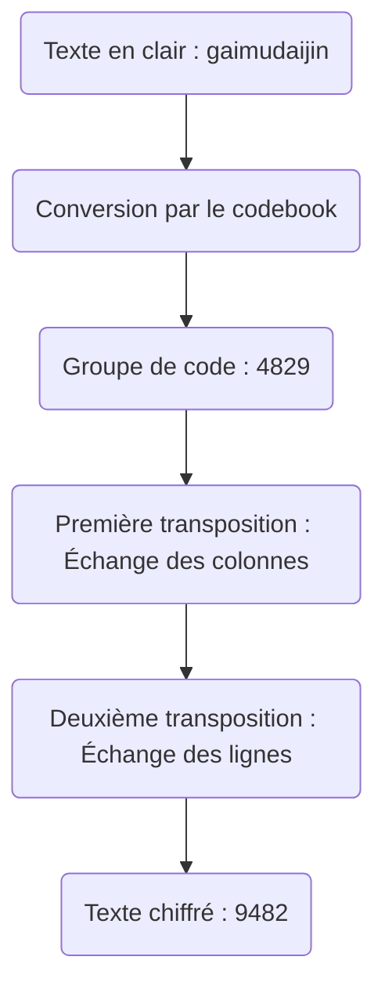
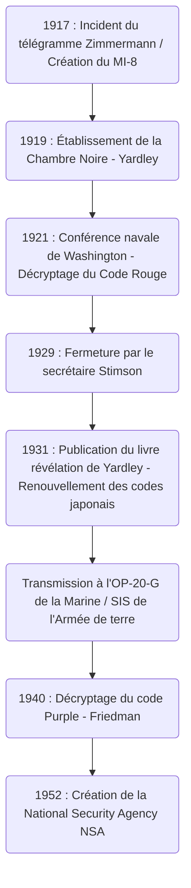

# L'ascension et la chute de la « Chambre Noire » : les hommes qui ont intercepté les télégrammes diplomatiques et l'aube du renseignement américain

Le destin d'une nation est souvent caché dans les chaînes de caractères invisibles des codes secrets. Lorsque l'on se penche sur l'histoire du renseignement moderne et sur le processus par lequel les États-Unis sont devenus un empire mondial de l'information, on trouve une agence légendaire incontournable : la « Chambre Noire » (The Black Chamber). Cet article discutera en détail et sous de multiples angles de l'ascension et de la chute de cette agence secrète, née du chaos de la Première Guerre mondiale, qui a mis à nu la diplomatie japonaise lors de la conférence navale de Washington, et qui, bien qu'enterrée au nom de la « moralité », a laissé l'ADN du renseignement qui a conduit à l'actuelle National Security Agency (NSA).

---

## Chapitre 1 : La Première Guerre mondiale et la naissance de la cryptanalyse moderne

### L'entrée en guerre des États-Unis suite à l'incident du télégramme Zimmermann
La technologie de la cryptographie existe depuis l'Antiquité, lorsque l'humanité a commencé à communiquer par écrit. Cependant, ce n'est qu'avec les événements dramatiques de la Première Guerre mondiale au début du 20e siècle qu'elle a été reconnue non plus comme une simple tactique militaire, mais comme un élément fondamental de la stratégie nationale. Le symbole de cela est l'« incident du télégramme Zimmermann » de 1917.

En janvier 1917, le ministre des Affaires étrangères de l'Empire allemand, Arthur Zimmermann, a envoyé un télégramme secret stupéfiant à l'ambassadeur d'Allemagne au Mexique via Washington. Ce télégramme incitait le Mexique à s'allier à l'Allemagne et à entrer en guerre contre les États-Unis au cas où ces derniers, alors neutres, entreraient en guerre aux côtés des Alliés. En échange, l'Allemagne promettait au Mexique la récupération de ses territoires perdus : le Texas, le Nouveau-Mexique et l'Arizona. De plus, il contenait des instructions pour attirer également le Japon dans cette alliance anti-américaine.

Ce télégramme a été intercepté et décrypté par la « Room 40 » (Chambre 40), l'unité spécialisée dans la cryptanalyse de la division du renseignement naval britannique. Convaincu que la révélation de ces renseignements enflammerait l'opinion publique américaine et porterait le coup décisif pour décider le président Woodrow Wilson à entrer en guerre, le gouvernement britannique l'a fourni au gouvernement américain à un moment parfaitement choisi. Ce fut un instant où la cryptanalyse a fait tourner de façon spectaculaire les rouages de l'histoire mondiale.

### La création du MI-8 de la division du renseignement de l'armée et l'ambition de Yardley
L'incident Zimmermann a donné une leçon cuisante aux militaires et hauts responsables gouvernementaux américains. Il leur a fait réaliser la terreur de voir leurs propres codes divulgués et l'immense avantage stratégique qu'ils pourraient obtenir s'ils parvenaient à décrypter les communications ennemies. À l'époque, il n'existait aucune agence de cryptanalyse de niveau national aux États-Unis. Face à ce sentiment de crise, le « MI-8 » (Military Intelligence, Section 8) a été créé au sein de la division du renseignement de l'armée en 1917.

Le jeune télégraphiste du département d'État, Herbert Osborn Yardley, a été sélectionné pour diriger le MI-8. À l'origine, il n'était qu'un opérateur travaillant dans un bureau de télégraphe de campagne, mais il possédait une intuition aiguisée par le poker et la capacité géniale de percevoir intuitivement les modèles des codes, déjouant leurs règles comme s'il résolvait des puzzles. Yardley était très ambitieux ; il passait son temps libre à décrypter les télégrammes secrets échangés au département d'État à Washington, émerveillant ses supérieurs.

### La tradition des « Cabinets Noirs » en Europe
L'Europe possédait depuis longtemps une institution traditionnelle appelée « Cabinet Noir », par laquelle les États censuraient et décryptaient secrètement les communications. Antoine Rossignol, qui s'est illustré sous le Premier ministre français Richelieu au XVIIe siècle, ou l'Anglais John Wallis, en étaient les pionniers, ayant accumulé au fil des ans un savoir-faire sophistiqué en cryptanalyse. Cependant, de telles traditions étaient totalement inexistantes aux États-Unis à l'époque. Yardley a dû construire une organisation à partir de zéro. Il a rassemblé des talents divers, allant de mathématiciens et linguistes à des maîtres d'échecs, pour lancer la première véritable agence de cryptanalyse américaine, le MI-8. Pendant la Première Guerre mondiale, ils ont principalement relevé le défi de décrypter les codes de campagne et diplomatiques de l'armée allemande, contribuant ainsi de manière invisible.

---

## Chapitre 2 : La Chambre Noire, bureau du chiffre secret de Manhattan

### La création d'une société écran et des accords secrets
En novembre 1918, la Première Guerre mondiale a pris fin. Avec la levée de la structure de temps de guerre, les agences de renseignement militaire ont été réduites, et le MI-8 a également fait face à une crise de survie. Cependant, connaissant la valeur du renseignement, Yardley a fortement soutenu qu'une agence de cryptanalyse était indispensable à la nation même en temps de paix. Il a réussi à obtenir secrètement un budget conjoint (environ 100 000 dollars par an) du département d'État et de l'Armée. C'est ainsi qu'est né en 1919 le premier bureau du chiffre secret américain en temps de paix, appelé plus tard la « Chambre Noire » (The Black Chamber).

Pour maintenir un secret extrême autour de leurs activités, la base a été installée loin de Washington, dans une maison de ville discrète de la 37e Rue Est à Manhattan, New York. Officiellement, elle prétendait être une entreprise privée appelée « Code Compilation Company » (Société de compilation de codes), feignant de vendre des livres de codes commerciaux.

Leur plus grande arme fut un accord secret avec les gigantesques sociétés de télégraphe aux États-Unis. Yardley a secrètement persuadé les dirigeants, dont Newcomb Carlton, le président de Western Union, et ceux de Postal Telegraph. Mêlant appels au patriotisme et pressions tacites, il a construit un système par lequel des copies (originaux) des télégrammes échangés par les délégations diplomatiques étrangères postées à Washington avec leurs pays d'origine étaient illégalement détournées vers la Chambre Noire presque chaque jour. Il s'agissait d'une violation évidente du secret des communications, en infraction avec le droit interne américain, mais au nom de la sécurité nationale, tout fut gardé dans l'ombre.

Dans la maison de ville de Manhattan, confrontés quotidiennement à des piles de télégrammes cryptés, les analystes luttaient jour et nuit. Ils ont décrypté les codes diplomatiques de plus de 30 pays, résumant leur contenu et le livrant aux hauts fonctionnaires du département d'État et de l'Armée. Cependant, la plus grande cible de Yardley était les communications diplomatiques de l'Empire du Japon, dont l'influence grandissait dans la région du Pacifique. Les codes diplomatiques japonais étaient extrêmement complexes, mais Yardley brûlait d'une obsession anormale pour faire tomber cette forteresse.

---

## Chapitre 3 : L'affrontement de la conférence navale de Washington de 1921

### La lutte à mort autour du ratio des navires de ligne 5:5:3
Après la Première Guerre mondiale, les grandes puissances, souffrant des coûts faramineux de la guerre, devaient freiner la course aux armements navals. La « Conférence navale de Washington », tenue de novembre 1921 à février 1922, fut la tentative la plus importante en ce sens.

Le secrétaire d'État américain Charles Evans Hughes a proposé, au début de la conférence, un plan de désarmement audacieux fixant le ratio de tonnage des navires de ligne entre les États-Unis, la Grande-Bretagne et le Japon à « 5 : 5 : 3 ». Pour le Japon, cela était totalement inacceptable. La marine japonaise avait longtemps soutenu qu'une force navale équivalente à 70 % de celle des États-Unis était la condition absolue de sa défense nationale, et s'opposait farouchement à un ratio de 60 % (5:5:3) qui menaçait sa sécurité à la base. Les ambassadeurs plénipotentiaires, Tomosaburo Kato (ministre de la Marine) et Kijuro Shidehara (ambassadeur aux États-Unis), ont mené de dures négociations.

### Le décryptage du Code Rouge et la fuite totale
Dans les coulisses de ces négociations diplomatiques, un décryptage exhaustif des codes diplomatiques japonais par la Chambre Noire était en cours. Yardley avait mobilisé toutes ses forces pour décrypter le code top secret du ministère japonais des Affaires étrangères, communément appelé le « Code Rouge » (Red Code). Le Code Rouge était un système très complexe combinant un livre de codes (codebook) et un chiffrement par transposition.

Grâce à l'analyse obsessionnelle de Yardley, la structure des codes diplomatiques japonais a été mise à nu. Pendant la conférence de Washington, les télégrammes cryptés échangés entre la délégation japonaise et les ministères des Affaires étrangères et de la Marine à Tokyo étaient livrés à la Chambre Noire dans la journée, décryptés, et déposés sur le bureau du secrétaire d'État Hughes dès le lendemain matin. Hughes a pu mener les négociations en connaissant toutes les cartes du Japon, y compris jusqu'où la délégation japonaise était prête à faire des concessions.

Le 28 novembre 1921, une instruction télégraphique décisive a été envoyée du ministère des Affaires étrangères de Tokyo à Tomosaburo Kato. Elle contenait le compromis final du gouvernement japonais. Bien qu'ils dussent d'abord insister fermement sur les « 70 % contre les États-Unis », si la conférence risquait d'échouer, ils devaient accepter les « 60 % (5:5:3) » comme ligne de défense finale, sous certaines conditions, comme l'interdiction de fortifier les îles du Pacifique.

### La victoire du secrétaire d'État Hughes
Avec ces informations décryptées en main, Hughes a mené les négociations froidement. Sachant que le Japon finirait par céder, il n'a montré aucun compromis face à leur demande de 70 % et a maintenu une attitude ferme. Bien que confuse par l'attitude exceptionnellement dure de la partie américaine, la délégation japonaise, ne se doutant pas que leurs informations fuitaient, n'a finalement pas eu d'autre choix que de plier selon les instructions de son pays. Par conséquent, le Japon a accepté le ratio de « 5 : 5 : 3 ». La signature de ce traité naval de Washington a été saluée comme une grande victoire de la diplomatie américaine, mais en coulisses, les renseignements de la Chambre Noire avaient joué un rôle décisif.

---

## Chapitre 4 : La technologie mathématique et cryptologique de la cryptanalyse

Nous détaillons ici le contexte technique expliquant comment la Chambre Noire parvenait à décrypter des codes complexes. Les codes auxquels ils étaient confrontés étaient des systèmes de dissimulation à plusieurs couches combinant un « codebook » et un « surchiffrement » (superencipherment).

### L'évolution de l'histoire de la cryptographie et l'analyse structurelle des codes
À l'époque, les communications du ministère japonais des Affaires étrangères remplaçaient le texte en clair par des séquences de chiffres ou de lettres (groupes de code) à l'aide d'un livre de codes. Cependant, pour éviter le risque que le livre de codes ne soit volé ou soumis à une analyse statistique, un « surchiffrement » était appliqué. La méthode utilisée par le Japon était le « chiffrement par double transposition » (Double Transposition Cipher), qui mélangeait l'ordre des lettres du groupe de code selon des règles spécifiques.

Le texte chiffré ayant subi cette double transposition perd complètement l'apparence du groupe de code original. Pour le décrypter, il fallait identifier la taille de la grille de transposition, découvrir la règle d'échange (la clé) des lignes et des colonnes pour reconstruire (anagrammer) le groupe de code original, et deviner sa signification.

### L'analyse fréquentielle et le test de Kasiski
Le génie de Yardley résidait dans la procédure de reconstruction de la grille de transposition. Il a appliqué l'« analyse fréquentielle » (Frequency Analysis) à ses limites extrêmes. En raison de la particularité du chiffrement en romanisant le japonais, la fréquence d'apparition des voyelles (a, i, u, e, o) devient anormalement élevée. Il a analysé statistiquement la fréquence d'apparition des lettres dans tout le texte chiffré, calculé la probabilité que des combinaisons de lettres spécifiques (digrammes et trigrammes, par exemple « sh », « ts ») soient adjacentes, et a relié les colonnes séparées comme un puzzle.

De plus, le « test de Kasiski » (Kasiski examination) a été largement utilisé. Il s'agit d'une méthode permettant de mesurer l'intervalle entre des chaînes de caractères spécifiques apparaissant de manière répétée dans le texte chiffré, et d'estimer la longueur de la clé de chiffrement (la largeur de la grille) à partir de leur diviseur commun. Cela a permis d'exposer la périodicité du chiffrement par transposition.

### L'Indice de Coïncidence (Index of Coincidence)
Parallèlement aux activités de la Chambre Noire, un autre génie américain de la cryptographie, William F. Friedman, était en train de formuler un outil mathématique révolutionnaire appelé l'« Indice de Coïncidence » (Index of Coincidence : I.C.).

Celui-ci indique la probabilité que, si deux lettres sont choisies au hasard dans un texte chiffré, elles soient exactement la même lettre. Friedman a prouvé qu'en calculant cet I.C., il était possible de déterminer mathématiquement si un texte chiffré avait été crypté avec une seule clé, plusieurs clés, ou par transposition, avant même de connaître la longueur de la clé. La montée de l'« approche mathématique et statistique » pure de Friedman, par opposition au décryptage basé sur l'intuition et l'expérience de Yardley, symbolisait la période de transition où la cryptanalyse est passée d'un « génie individuel » à une « science organisationnelle ».

---

## Chapitre 5 : La fin : « Les gentlemen ne lisent pas le courrier des autres »

### L'indignation morale de Stimson
Malgré son grand succès à la conférence de Washington, la gloire de la Chambre Noire n'a pas duré. Sa fin n'a pas été provoquée par une attaque extérieure, mais par une décision « morale » interne au gouvernement américain.

En mars 1929, sous l'administration du président Herbert Hoover, Henry L. Stimson a été nommé nouveau secrétaire d'État. Stimson était un idéaliste doté d'une éthique protestante stricte. Peu après son entrée en fonction, en examinant l'utilisation du budget du département d'État, il a découvert l'existence de la Chambre Noire et la réalité de l'« interception illégale des communications des missions étrangères ».

Stimson était furieux. Pour lui, l'acte d'espionner les communications d'alliés ou de pays amis était une trahison ignoble qui entachait gravement la fierté de la diplomatie américaine. Il a immédiatement décidé de couper le financement, prononçant des mots qui resteraient à jamais gravés dans l'histoire du renseignement.

**« Les gentlemen ne lisent pas le courrier des autres » (Gentlemen do not read each other's mail.)**

### Le livre révélation et le choc mondial
Ayant perdu son principal sponsor, la Chambre Noire est tombée dans des difficultés financières, aggravées par la Grande Dépression de 1929. Le 31 octobre de la même année, la Chambre Noire a été officiellement fermée et forcée de se dissoudre.

Chômeur au plus bas de la Grande Dépression, Yardley a fait face à de graves difficultés de subsistance. Son patriotisme trahi et poussé par le désespoir, il a publié en 1931 un livre révélateur décrivant crûment son expérience, intitulé *The American Black Chamber* (La Chambre Noire Américaine).

Ce livre révélait de manière détaillée comment les États-Unis avaient décrypté les codes diplomatiques de divers pays, et en particulier toute l'étendue de l'interception des communications japonaises lors de la conférence de Washington. Ce livre, devenu un best-seller mondial, a provoqué un choc immense au Japon. Le gouvernement et l'armée japonaise ont paniqué face au fait que leurs codes top secrets avaient été divulgués, et ont immédiatement détruit tous leurs systèmes de cryptage. Tirant les leçons de cette révélation, ils se sont hâtés de développer une machine de chiffrement beaucoup plus avancée, la « Machine de Chiffrement Alphabétique Type 97 » (connue sous le nom de Purple). Ironiquement, les révélations de Yardley ont fait progresser de manière spectaculaire la technologie cryptographique japonaise.

---

## Chapitre 6 : L'héritage de la Chambre Noire

### L'héritage transmis à l'OP-20-G et au SIS
La Chambre Noire a connu une fin tragique, mais les graines du renseignement qu'elle a semées n'ont pas péri. Son savoir-faire et une partie de son personnel ont été secrètement transférés à l'« OP-20-G », la division du renseignement des communications de la marine américaine. Joseph Rochefort et d'autres de l'OP-20-G ont introduit une approche mathématique et un traitement mécanique des données, décryptant le code « JN-25 » de la marine japonaise lors de la bataille de Midway en 1942, identifiant « AF » (Midway) et apportant une victoire historique.

D'autre part, dans l'armée de terre, le « Signal Intelligence Service » (SIS) a été créé, dirigé par William Friedman. Il a rejeté les méthodes de Yardley basées sur l'intuition personnelle et a établi un système de « cryptanalyse scientifique » basé sur des théories mathématiques et statistiques rigoureuses.

### Du décryptage du code Purple à la NSA
La plus grande réalisation du SIS dirigé par Friedman a été le décryptage complet du code de la machine « Purple », le secret le mieux gardé du Japon, en 1940. Sans même voir la machine réelle, ils ont déduit le câblage du mécanisme des commutateurs pas à pas uniquement par analyse logique, et ont construit une machine de réplique (Magic). Ces renseignements, connus sous le nom de « MAGIC », ont fourni une valeur inestimable pour les décisions stratégiques pendant la Seconde Guerre mondiale. Ironiquement, Stimson, qui avait autrefois fermé la Chambre Noire, est revenu en tant que secrétaire à la Guerre et est devenu un fervent consommateur de MAGIC.

Après la guerre, en 1952, avec l'intensification de la guerre froide, le gouvernement américain a consolidé ses agences cryptographiques pour créer une agence de renseignement électronique massive, la « National Security Agency » (NSA). Au cœur de la NSA actuelle, qui surveille les réseaux de communication à l'échelle mondiale et utilise des superordinateurs, l'ADN de Yardley et des hommes de la Chambre Noire, qui défiaient les codes comme des puzzles dans une petite maison de ville de Manhattan, vit sans aucun doute.

L'ascension et la chute de la Chambre Noire ont été le tournant décisif annonçant l'aube des agences de renseignement américaines, lorsque l'État a réalisé la valeur absolue de l'arme qu'est l'« information » et a ouvert la boîte de Pandore menant à la cyberguerre moderne.

Cette trajectoire historique prouve froidement que le renseignement n'est plus un accessoire de la diplomatie, mais une technologie fondamentale qui détermine la survie d'une nation. On peut dire que la passion et l'ambition de Yardley, ainsi que les manœuvres secrètes de la Chambre Noire, sont des points de départ inoubliables pour comprendre la société complexe d'aujourd'hui, marquée par la guerre de l'information et la cybersécurité.

## Appendice : Examen approfondi et détails techniques de la Chambre Noire

Sur la base du contexte historique abordé dans le corps principal, nous ajoutons ici une analyse plus détaillée des difficultés techniques pratiques dans le domaine de la cryptanalyse, de l'asymétrie du renseignement dans la politique internationale de l'époque, et de la structure mentale complexe de l'homme nommé Yardley, afin d'y apporter une profondeur académique et pratique.

### 1. Difficultés pratiques du décryptage du chiffrement par double transposition (Double Transposition)
Comme mentionné précédemment, le surchiffrement (superencipherment) dans le Code Rouge utilisé par le ministère japonais des Affaires étrangères était un chiffrement par double transposition. Le processus de le décrypter avec seulement du papier et un crayon était une combinaison d'intuition avancée et de déduction logique, totalement différente de l'attaque par force brute (brute force) des ordinateurs modernes.

La première étape pour décrypter un chiffrement par double transposition est d'appréhender la « longueur exacte du message ». Par exemple, si le texte chiffré comporte « 35 caractères », la taille de la grille est très probablement « 5x7 » ou « 7x5 ». Cependant, si le nombre de caractères est un nombre premier comme « 37 caractères », l'opérateur de chiffrement peut avoir ajouté quelques caractères factices (nulls) pour former un rectangle, ou il peut avoir utilisé une « transposition colonnaire incomplète » (Incomplete Columnar Transposition) où le mélange est effectué en laissant certaines cases vides. Le ministère japonais des Affaires étrangères utilisait fréquemment cette transposition colonnaire incomplète, rendant le décryptage extrêmement difficile.

Yardley et son équipe ont commencé par collecter un grand nombre de messages de longueurs différentes chiffrés avec la même clé (appelés « isogrammes »). En comparant ces isogrammes, il devient possible de trouver le modèle de placement des cases vides dans la grille et d'identifier la longueur des colonnes. Cela s'appelle l'« anagrammage multiple » (Multiple Anagramming).

Une fois la longueur de la colonne identifiée, l'étape suivante consiste à réarranger les colonnes en fonction de la fréquence d'apparition des voyelles. Par exemple, si une colonne contient beaucoup de « A » et de « O », et qu'une autre contient beaucoup de « K » et de « S », en les plaçant côte à côte, il est fort probable de reconstituer des syllabes japonaises (romaji) comme « KA » ou « SO ». Yardley a évalué statistiquement des milliers, voire des dizaines de milliers de ces paires de syllabes, dérivant la combinaison de colonnes la plus probable. C'était un exploit semblable à résoudre un Rubik's Cube géant les yeux bandés, reposant davantage sur une profonde compréhension de la structure du langage que sur des mathématiques.

### 2. L'obsession de la reconstruction du livre de codes
Même si la règle de transposition (la clé) était brisée, cela signifiait simplement que la chaîne de caractères aléatoire redevenait un « groupe de code dénué de sens » (un bloc de chiffres ou de lettres). L'obstacle suivant était de deviner quel mot ce groupe de code signifiait et de reconstruire le livre de codes lui-même à partir de zéro.

Ce qui rendait cela possible, c'était le « contexte » et les « phrases toutes faites ». Les télégrammes diplomatiques ont un format spécifique. Le début contient souvent le destinataire, l'expéditeur, la date et des instructions standard comme « urgent » ou « confidentiel ». De plus, des sujets spécifiques apparaissent fréquemment à des périodes spécifiques. Pendant la conférence de Washington, il était facile de prévoir que des mots comme « cuirassé » (Battleship), « tonnage » (Tonnage), « ratio » (Ratio) ou « Hughes » (Hughes) seraient échangés.

L'équipe de Yardley a appliqué ces mots devinés (appelés Cribs) au texte chiffré et a vérifié s'il n'y avait pas de contradictions. Par exemple, s'ils supposaient que le groupe de code « 6832 » signifiait « marine », et que dans un autre télégramme ce groupe de code apparaissait dans un contexte n'ayant aucun rapport avec le désarmement, cette hypothèse était rejetée. Ainsi, ils ont donné un sens à chaque groupe de code, compilant à partir de zéro un dictionnaire massif pendant des années. La précision de ce livre de codes reconstitué était la véritable richesse de la Chambre Noire.

### 3. L'asymétrie du renseignement et les limites de l'« accord entre gentlemen »
À la conférence de Washington, le fait que les États-Unis décryptaient les codes japonais montre l'influence décisive de l'« asymétrie du renseignement » dans les relations internationales, bien plus qu'une simple nation faisant avancer les négociations à son avantage.

L'ordre international centré sur la Société des Nations de l'époque présumait une « diplomatie ouverte » et une « confiance mutuelle dans les traités ». Cependant, dans les coulisses, la dure réalité était que celui qui remportait la guerre de l'information tenait l'initiative d'établir les règles. Le Japon était lié par le cadre idéaliste du « désarmement » prôné par les États-Unis, alors qu'il était en fait assis à la table des négociations avec son point de compromis, son niveau le plus bas, complètement connu de l'autre côté.

Cette asymétrie démontre comment la valeur de l'information peut surpasser la force militaire physique (comme le nombre de cuirassés). Si le Japon s'était rendu compte à l'époque que ses codes avaient été cassés et avait mené une opération de déception (deception) en diffusant de fausses informations, le résultat du système de Washington aurait pu être tout à fait différent.

La décision d'Henry Stimson de fermer la Chambre Noire découlait de sa forte crainte que de tels « jeux de l'ombre » ne corrompent fondamentalement « l'ordre international fondé sur l'État de droit » auquel il croyait. Les mots de Stimson, « Les gentlemen ne lisent pas le courrier des autres », sont souvent moqués comme de l'idéalisme naïf, mais ils constituaient également un engagement fort envers un « nouveau type de diplomatie hautement transparente » que les États-Unis tentaient de viser à l'époque. Cependant, l'histoire ne choisirait pas l'idéalisme de Stimson, mais le réalisme (machiavélisme) de Yardley.

### 4. L'ambivalence du personnage de Herbert O. Yardley
Lorsqu'on raconte l'histoire de la Chambre Noire, le caractère unique de Yardley est un élément essentiel. Il n'était pas seulement un brillant analyste de codes, mais un personnage complexe rempli d'un désir de se mettre en valeur et d'ambition.

Il avait une confiance absolue en ses propres capacités et se comportait parfois de manière arrogante, même envers les hauts fonctionnaires du gouvernement. Lorsque la Chambre Noire a réussi à la conférence de Washington, il s'est considéré comme le « héros de l'ombre qui a sauvé l'Amérique » et a exigé plus de budget et d'autorité. Cependant, l'essence d'une agence de renseignement est de rester dans l'« ombre ». Son besoin d'attention était un défaut fatal pour le chef d'une agence de renseignement censée opérer en secret.

L'acte de Yardley de publier *The American Black Chamber* après la sentence de fermeture par Stimson n'était pas seulement à des fins financières dues à ses difficultés de vie, mais aussi une revanche cinglante contre le gouvernement qui l'avait traité froidement, et en même temps, l'expression d'un désir irrépressible de faire connaître son génie au monde.

Cette révélation l'a banni à jamais de la communauté du renseignement américain. Pendant la Seconde Guerre mondiale, bien que le gouvernement américain cherchât désespérément des experts en cryptanalyse, Yardley ne fut jamais autorisé à occuper un poste officiel. Il s'est rendu en Chine pour aider le parti nationaliste à décrypter des codes, et a aidé à la création de l'agence de cryptologie du gouvernement canadien, mais il n'est jamais revenu au centre de projets nationaux comme auparavant.

Yardley est décédé dans la déception en 1958, mais ce qu'il a laissé derrière lui est immense. Il nous pose une question fondamentale, toujours pertinente aujourd'hui : quel rôle les agences de renseignement devraient-elles jouer dans une nation, et comment cela entre-t-il en conflit avec les ambitions personnelles et l'éthique ? Il est facile de l'écarter comme un simple « traître » ou un « révélateur avide d'argent », mais dans l'histoire du renseignement américain, aucun autre individu n'a projeté une lumière et une ombre aussi intenses que Yardley.

### 5. Le chemin vers le décryptage de la machine Purple : de l'analogique au numérique
Le fait que le Japon ait renouvelé ses systèmes de cryptage à la suite des révélations de Yardley a eu pour effet de forcer la technologie de cryptanalyse américaine à évoluer vers la dimension suivante. La « Machine de Chiffrement Alphabétique Type 97 » (Purple) introduite par le Japon était une machine de chiffrement complexe qui ne pouvait jamais être décryptée par les anagrammes linguistiques ou l'analyse fréquentielle dans lesquels Yardley excellait.

C'est là qu'interviennent William Friedman et son SIS (Signal Intelligence Service). Friedman a élevé la cryptanalyse de l'« intuition individuelle » à la « fusion des mathématiques et de l'ingénierie mécanique ». La machine Purple utilisait de multiples commutateurs pas à pas (commutateurs rotatifs utilisés dans les centraux téléphoniques) pour convertir les caractères saisis en d'autres caractères via des circuits électriques complexes. Parce que le motif de connexion de ce circuit changeait à chaque fois qu'une touche du clavier était pressée, l'algorithme de chiffrement fluctuait constamment.

L'équipe du SIS (comprenant de brillants mathématiciens comme Frank Rowlett) a analysé mathématiquement de manière exhaustive les biais statistiques extrêmement infimes présents dans les textes chiffrés interceptés, ainsi que les erreurs opérationnelles commises par les diplomates japonais (comme l'envoi de plusieurs messages avec les mêmes paramètres de clé). Bien qu'ils n'aient jamais vu la machine Purple réelle, ils ont complètement reproduit sur papier la façon dont son câblage interne était logiquement construit.

Ce processus était fondamentalement différent de la « résolution de puzzles » de l'ère de Yardley ; il s'agissait de la construction de modèles mathématiques avancés qui forment la base de la théorie cryptographique d'aujourd'hui. Lorsque l'équipe de Friedman a achevé la réplique analogique de Purple, « Magic », cela a marqué la fin de la cryptanalyse dépendante des personnes à la Yardley et l'aube de l'ère du renseignement d'origine électromagnétique (SIGINT) piloté par la technologie, qui mènera à la NSA.

### Conclusion
L'histoire de la « Chambre Noire » est le premier acte dramatique de l'histoire des relations entre l'État et l'information. L'intuition de Yardley, la moralité de Stimson, la science de Friedman. Le processus de conflit et d'évolution entre ces trois éléments offre des perspectives historiques profondes sur les questions de « renseignement et éthique », telles qu'elles se posent dans la guerre de l'information dans le cyberespace moderne ou lors de l'affaire Edward Snowden. L'obsession des hommes qui ont intercepté les télégrammes diplomatiques, bien que sous des formes différentes, continue de vivre sans interruption dans les profondeurs de l'État moderne.

### 6. La signification moderne de la Chambre Noire du point de vue de l'histoire de l'information
Dans le grand contexte de l'histoire, l'héritage laissé par la Chambre Noire ne se limite pas à l'évolution de la technologie de cryptanalyse. On peut dire que ce furent les prémices du fonctionnement de l'« information (renseignement) » comme centre de pouvoir indépendant de l'État.

Ce que Yardley a construit était un système fournissant des preuves solides (hard intelligence) obtenues de sources invisibles pour la prise de décisions militaires et diplomatiques. Alors que la diplomatie d'avant dépendait fortement des rapports des ambassadeurs et de l'analyse d'informations publiques (soft intelligence), l'acte de décrypter les communications cryptées de l'ennemi permettait d'extraire directement les « véritables intentions sans tromperie » de l'autre partie.

Les agences de renseignement d'origine électromagnétique (SIGINT) modernes, telles que la National Security Agency (NSA) aux États-Unis ou le Government Communications Headquarters (GCHQ) au Royaume-Uni, ont accompli des bonds immenses dans leurs fondations techniques, incomparables à l'époque de Yardley. Cependant, dans leur mission essentielle de « briser le secret des communications et d'armer l'information », elles continuent de marcher sur le plan dessiné par Yardley. L'histoire de l'ascension et de la chute de la Chambre Noire continue de nous confronter à une proposition profonde qui reste sans réponse même au 21e siècle : jusqu'où une nation devrait-elle franchir les frontières éthiques pour protéger sa propre sécurité ?
