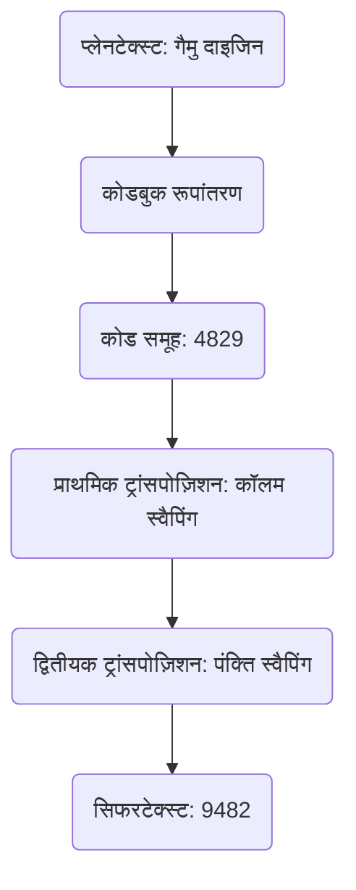
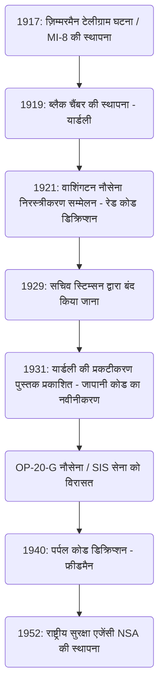

# क्रिप्टएनालिसिस एजेंसी 'ब्लैक चैंबर' का उदय और पतन: वे लोग जिन्होंने राजनयिक केबल्स को चुराकर भेद खोला और अमेरिकी खुफिया एजेंसी की शुरुआत

किसी राष्ट्र का भाग्य अक्सर अदृश्य कोड स्ट्रिंग्स के भीतर छिपा होता है। जब हम आधुनिक खुफिया (इंटेलिजेंस) के इतिहास को देखते हैं, तो एक वैश्विक सूचना साम्राज्य के रूप में संयुक्त राज्य अमेरिका के विकास की प्रक्रिया में, एक पौराणिक एजेंसी अपरिहार्य रूप से मौजूद है। वह है "द ब्लैक चैंबर (The Black Chamber)"। इस लेख में, हम इस गुप्त एजेंसी के उदय और पतन पर बहुत विस्तार से और कई दृष्टिकोणों से चर्चा करेंगे, जिसका जन्म प्रथम विश्व युद्ध की उथल-पुथल से हुआ, वाशिंगटन नौसेना निरस्त्रीकरण सम्मेलन में जापानी कूटनीति को नंगा कर दिया, और फिर "नैतिकता" के नाम पर दफन कर दिया गया, जबकि इसने आधुनिक राष्ट्रीय सुरक्षा एजेंसी (NSA) के लिए खुफिया डीएनए छोड़ दिया।

---

## अध्याय 1: प्रथम विश्व युद्ध और आधुनिक क्रिप्टएनालिसिस का जन्म

### ज़िम्मरमैन टेलीग्राम घटना के कारण अमेरिकी प्रवेश
कोड (क्रिप्टोग्राफी) की तकनीक प्राचीन काल से अस्तित्व में है, जब मानव ने लिखित संचार शुरू किया था। हालांकि, यह महज सैन्य रणनीति के ढांचे को पार कर गया और इसे 20वीं सदी की शुरुआत में प्रथम विश्व युद्ध में नाटकीय घटनाओं से शुरू होकर एक राष्ट्रीय रणनीति के मूल तत्व के रूप में पहचाना जाने लगा। इसका प्रतीक 1917 की "ज़िम्मरमैन टेलीग्राम घटना" है।

जनवरी 1917 में, जर्मन साम्राज्य के विदेश मंत्री आर्थर ज़िम्मरमैन ने वाशिंगटन के माध्यम से मैक्सिको में जर्मन राजदूत को एक चौंकाने वाला गुप्त टेलीग्राम भेजा। यह टेलीग्राम एक ऐसे मामले के लिए तैयारी था यदि उस समय तटस्थ रहने वाला अमेरिका मित्र राष्ट्रों के पक्ष में युद्ध में प्रवेश करता है, तो मैक्सिको से जर्मनी के साथ गठबंधन बनाने और अमेरिका के खिलाफ युद्ध में प्रवेश करने का आग्रह किया गया था। इसके बदले में, जर्मनी ने मैक्सिको को टेक्सास, न्यू मैक्सिको और एरिज़ोना के खोए हुए क्षेत्रों को वापस दिलाने का वादा किया। इसके अलावा, जापान को भी इस अमेरिकी विरोधी गठबंधन में खींचने के निर्देश शामिल थे।

इस टेलीग्राम को ब्रिटिश नौसेना खुफिया के कूटवाचन विशेषज्ञ विभाग "रूम 40 (कमरा नंबर 25)" द्वारा इंटरसेप्ट और डिक्रिप्ट किया गया था। ब्रिटिश सरकार को विश्वास था कि इस खुफिया जानकारी के खुलासे से अमेरिकी जनता में भारी आक्रोश पैदा होगा और राष्ट्रपति वुडरो विल्सन को युद्ध में प्रवेश करने का निर्णायक निर्णय लेने पर मजबूर करेगा, और इसे सही समय पर अमेरिकी सरकार को प्रदान किया। यह वह क्षण था जब कूटवाचन (क्रिप्टएनालिसिस) ने विश्व इतिहास के पहिये को काफी हद तक घुमा दिया।

### सैन्य खुफिया विभाग MI-8 की स्थापना और यार्डली की महत्वाकांक्षा
ज़िम्मरमैन की घटना ने अमेरिकी सेना और शीर्ष सरकारी अधिकारियों को एक कड़वा सबक दिया। यह उनके अपने कोड के लीक होने का डर था, और यह तथ्य कि यदि वे दुश्मन के संचार को डिक्रिप्ट कर सकें तो उन्हें कितना रणनीतिक लाभ प्राप्त हो सकता है। उस समय, अमेरिका में कोई राष्ट्रीय स्तर की क्रिप्टएनालिसिस एजेंसी नहीं थी। इस संकट की भावना से, 1917 में, सैन्य खुफिया विभाग के भीतर "MI-8 (मिलिट्री इंटेलिजेंस, सेक्शन 8)" की स्थापना की गई थी।

विदेश विभाग के एक युवा टेलीग्राफ इंजीनियर, हर्बर्ट ओसबोर्न यार्डली (Herbert Osborn Yardley) को इस MI-8 के प्रमुख के रूप में चुना गया था। वे मूल रूप से एक ग्रामीण टेलीग्राफ कार्यालय में काम करने वाले एक ऑपरेटर मात्र थे, लेकिन उनके पास पोकर में विकसित एक प्रतिस्पर्धी अंतर्ज्ञान था, और एक पहेली को सुलझाने की तरह, कोड के पैटर्न को सहज रूप से पहचानने और उनकी नियमितता को उजागर करने की एक प्रतिभाशाली क्षमता थी। यार्डली की महत्वाकांक्षा बहुत मजबूत थी, और वे वाशिंगटन में विदेश विभाग के भीतर आदान-प्रदान किए गए गुप्त टेलीग्रामों को अपने खाली समय में डिक्रिप्ट करके अपने वरिष्ठों को विस्मित करते थे।

### यूरोप की "कैबिनेट नोयर (Cabinet Noir)" परंपरा
लंबे समय से, यूरोप में "कैबिनेट नोयर (ब्लैक रूम)" नामक एक पारंपरिक संस्था रही है, जहां राज्य गुप्त रूप से संचार को सेंसर और डिक्रिप्ट करता था। 17वीं सदी के फ्रांस के प्रधानमंत्री रिचल्यू के अधीन काम करने वाले एंटोनी रॉसिग्नॉल और इंग्लैंड के जॉन वालिस इसके प्रणेता थे, और उन्होंने कई वर्षों में विस्तृत क्रिप्टएनालिसिस के बारे में जानकारी जमा की थी। हालाँकि, उस समय अमेरिका में ऐसी कोई परंपरा मौजूद नहीं थी। यार्डली को खरोंच से एक संगठन का निर्माण करना पड़ा। उन्होंने गणितज्ञों, भाषाविदों, और यहां तक कि शतरंज के उस्तादों जैसी विविध प्रतिभाओं वाले लोगों को इकट्ठा किया, और अमेरिका की पहली पूर्ण विकसित कूटवाचन एजेंसी, MI-8 का शुभारंभ किया। प्रथम विश्व युद्ध के दौरान, उन्होंने मुख्य रूप से जर्मन सेना के फील्ड कोड और राजनयिक कोड को डिक्रिप्ट करने की कोशिश की, और एक अदृश्य तरीके से योगदान दिया।

---

## अध्याय 2: मैनहट्टन में गुप्त कूटवाचन ब्यूरो "ब्लैक चैंबर"

### डमी कंपनी की स्थापना और गुप्त समझौते
नवंबर 1918 में प्रथम विश्व युद्ध समाप्त हो गया। युद्धकालीन व्यवस्था के हटने के साथ, सैन्य खुफिया एजेंसियों को कम कर दिया गया, और MI-8 के अस्तित्व को भी खतरा पैदा हो गया। हालाँकि, यार्डली, जो खुफिया जानकारी का महत्व अच्छी तरह से जानते थे, ने दृढ़ता से तर्क दिया कि पीकटाइम (शांतिकाल) में भी राज्य के लिए एक कूटवाचन एजेंसी आवश्यक है। वह गुप्त रूप से विदेश विभाग और सेना (लगभग $100,000 प्रति वर्ष) से संयुक्त बजट निकालने में सफल रहे। 1919 में इस प्रकार अमेरिका के पहले पीकटाइम गुप्त कूटवाचन ब्यूरो का जन्म हुआ, जिसे बाद में "द ब्लैक चैंबर (The Black Chamber)" कहा गया।

अत्यंत गुप्त गतिविधियों को बनाए रखने के लिए, मुख्यालय वाशिंगटन से दूर, ईस्ट 37वीं स्ट्रीट, मैनहट्टन, न्यूयॉर्क में एक अगोचर टाउनहाउस में स्थित था। बाहरी रूप से, इसने "कोड संकलन कंपनी (Code Compilation Company)" नामक एक निजी कंपनी के रूप में काम किया, और ऐसा दिखाया कि वे व्यावसायिक कोडबुक बेच रहे हैं।

उनका सबसे बड़ा हथियार अमेरिका के भीतर एक विशाल टेलीग्राफ कंपनी के साथ एक गुप्त समझौता था। यार्डली ने गुप्त रूप से वेस्टर्न यूनियन के अध्यक्ष न्यूकॉम्ब कार्लटन और पोस्टल टेलीग्राफ जैसे अन्य अधिकारियों को राजी किया। देशभक्ति की अपील और अंतर्निहित दबाव के मिश्रण का उपयोग करते हुए, उन्होंने एक ऐसी प्रणाली का निर्माण किया जिसमें वाशिंगटन में तैनात प्रत्येक देश के राजनयिक कोर और उनके गृह देशों के बीच आदान-प्रदान किए गए टेलीग्रामों की प्रतियां (मूल कागजात) लगभग हर दिन ब्लैक चैंबर में प्रवाहित की जाती थीं। यह संचार के रहस्य का स्पष्ट उल्लंघन था, और अमेरिकी घरेलू कानून के उल्लंघन में एक अवैध कृत्य था, लेकिन राष्ट्रीय सुरक्षा के महान कारण के तहत, सब कुछ अंधेरे में दफन हो गया था।

मैनहट्टन के टाउनहाउस में, डिक्रिप्टर हर दिन आने वाले सिफर टेलीग्राम के बड़े बंडलों के सामने दिन-रात संघर्ष करते थे। उन्होंने 30 से अधिक देशों के राजनयिक कोड को डिक्रिप्ट किया, उनकी सामग्री को संक्षेप में प्रस्तुत किया, और उन्हें विदेश विभाग और सेना के शीर्ष अधिकारियों तक पहुँचाया। हालाँकि, यार्डली का सबसे बड़ा लक्ष्य जापानी साम्राज्य का राजनयिक संचार था, जो प्रशांत क्षेत्र में अपनी शक्ति का विस्तार कर रहा था। जापानी राजनयिक कोड बेहद कठिन था, लेकिन यार्डली ने इस किले को गिराने के लिए असाधारण जुनून जलाया।

---

## अध्याय 3: 1921 वाशिंगटन नौसेना निरस्त्रीकरण सम्मेलन का टकराव

### पूंजीगत जहाजों के स्वामित्व के 5:5:3 अनुपात पर मौत का संघर्ष
प्रथम विश्व युद्ध के बाद, भारी युद्ध व्यय से पीड़ित महान शक्तियों को नौसैनिक निर्माण की दौड़ को रोकने के लिए मजबूर होना पड़ा। नवंबर 1921 से फरवरी 1922 तक आयोजित "वाशिंगटन नौसेना निरस्त्रीकरण सम्मेलन" ऐसा करने का सबसे बड़ा प्रयास था।

अमेरिकी विदेश मंत्री चार्ल्स इवांस ह्यूजेस ने सम्मेलन की शुरुआत में ही अमेरिका, ब्रिटेन और जापान के पूंजीगत जहाजों के टन भार अनुपात को "5 : 5 : 3" बनाने की साहसिक निरस्त्रीकरण योजना प्रस्तुत की। जापान के लिए इसे किसी भी तरह से स्वीकार करना संभव नहीं था। जापानी नौसेना ने लंबे समय से यह तर्क दिया था कि अमेरिका का 70% नौसैनिक शक्ति होना राष्ट्रीय रक्षा के लिए एक पूर्ण शर्त है, और कड़ा विरोध करते हुए कहा कि अमेरिका का 60% (5:5:3) सुरक्षा को मौलिक रूप से खतरे में डाल देगा। पूर्ण शक्ति प्राप्त राजदूत टोमोसाबुरो काटो (नौसेना मंत्री) और किजुरो शिदेहारा (अमेरिका में राजदूत) ने गहन बातचीत की।

### लाल कोड को डिक्रिप्ट करना और पूर्ण प्रकटीकरण
इस कूटनीतिक बातचीत के पीछे, ब्लैक चैंबर द्वारा जापानी राजनयिक कोड को पूरी तरह से डिक्रिप्ट किया जा रहा था। यार्डली जापानी विदेश मंत्रालय के शीर्ष-गुप्त कोड, जिसे "रेड कोड (Red Code)" के रूप में जाना जाता है, को डिक्रिप्ट करने के लिए अपना सारा प्रयास कर रहे थे। रेड कोड एक बहुत ही जटिल प्रणाली थी जिसमें एक कोडबुक को ट्रांसपोज़िशन सिफर (transposition cipher) के साथ जोड़ा गया था।

यार्डली के निरंतर विश्लेषण के माध्यम से, जापानी राजनयिक कोड की संरचना पूरी तरह से उजागर हो गई। वाशिंगटन सम्मेलन के दौरान, जापानी प्रतिनिधिमंडल और टोक्यो में विदेश मंत्रालय/नौसेना मंत्रालय के बीच आदान-प्रदान किए गए सिफर टेलीग्राम उसी दिन ब्लैक चैंबर को दिए गए, उन्हें डिक्रिप्ट किया गया, और अगली सुबह विदेश मंत्री ह्यूजेस के डेस्क पर रखा गया। ह्यूजेस को बातचीत में यह पूरी तरह से पता था कि जापानी वार्ताकार कितना समझौता करने को तैयार थे, और उनकी सारी रणनीति जानते थे।

28 नवंबर, 1921 को, टोक्यो के विदेश मंत्रालय से काटो टोमोसाबुरो को एक निर्णायक निर्देश टेलीग्राम भेजा गया। इसमें जापानी सरकार के अंतिम समझौते के प्रस्ताव का विवरण था। शुरुआत में, वे दृढ़ता से "अमेरिका के 70%" पर जोर देंगे, लेकिन यदि सम्मेलन टूटने की संभावना है, तो वे अंतिम रक्षा पंक्ति के रूप में "अमेरिका के 60% (5:5:3)" को स्वीकार करेंगे, प्रशांत द्वीपों के किलेबंदी पर रोक लगाने जैसी शर्तों के साथ।

### विदेश मंत्री ह्यूजेस की जीत
इस डिक्रिप्टेड जानकारी के साथ, ह्यूजेस ने बेरहमी से बातचीत की। चूँकि वह जानता था कि जापान अंततः रियायतें देगा, उसने जापान की 70% की मांग पर कोई समझौता नहीं दिखाया और एक दृढ़ रुख बनाए रखा। जापानी वार्ताकार अमेरिकी पक्ष के असामान्य रूप से मजबूत रवैये से भ्रमित थे, लेकिन उन्होंने कभी सपने में भी नहीं सोचा था कि जानकारी लीक हो रही है, और अंततः उन्हें अपने देश के निर्देशों के अनुसार झुकना पड़ा। परिणामस्वरूप, जापान ने "5 : 5 : 3" अनुपात को स्वीकार कर लिया। वाशिंगटन नौसेना संधि के इस निष्कर्ष की अमेरिकी कूटनीति की शानदार जीत के रूप में प्रशंसा की गई, लेकिन इसके पीछे, ब्लैक चैंबर की खुफिया जानकारी ने निर्णायक भूमिका निभाई थी।

---

## अध्याय 4: डिक्रिप्शन की गणितीय और कूटलेखन तकनीकें

ब्लैक चैंबर ने कैसे जटिल कोड को डिक्रिप्ट किया, इसके तकनीकी पृष्ठभूमि के बारे में विस्तार से बताते हैं। जिस कोड का उन्होंने सामना किया वह एक बहु-स्तरीय गुप्त प्रणाली थी जो "कोडबुक" और "सुपरएन्सिफर (पुनः एन्क्रिप्शन)" को जोड़ती थी।

### क्रिप्टोग्राफी के इतिहास में बदलाव और कोड का संरचनात्मक विश्लेषण
उस समय जापानी विदेश मंत्रालय का संचार, एक कोडबुक का उपयोग करके प्लेनटेक्स्ट को कई अंकों के नंबरों या अक्षरों (कोड समूहों) की एक श्रृंखला में बदल देता था। हालाँकि, कोडबुक के चोरी होने या सांख्यिकीय रूप से विश्लेषण किए जाने के जोखिम को रोकने के लिए, "सुपरएन्सिफर" किया गया था। जापानी पक्ष ने जो उपयोग किया वह "डबल ट्रांसपोज़िशन सिफर (Double Transposition Cipher)" था, जो कुछ नियमों के अनुसार कोड समूह में अक्षरों के क्रम को जटिल रूप से स्वैप करता था।

इस दोहरे ट्रांसपोज़िशन से गुजरने वाला सिफरटेक्स्ट पूरी तरह से मूल कोड समूह की उपस्थिति खो देता है। इसे डिक्रिप्ट करने के लिए, ट्रांसपोज़िशन के ग्रिड आकार की पहचान करना, मूल कोड समूह के पुनर्निर्माण (एनाग्राम) के लिए पंक्ति और कॉलम स्वैपिंग नियमों (कुंजी) का पता लगाना और इसके अर्थ का अनुमान लगाना आवश्यक था।

### आवृत्ति विश्लेषण और कासिस्की परीक्षण
यार्डली की प्रतिभा ट्रांसपोज़िशन ग्रिड के पुनर्निर्माण की प्रक्रिया में थी। उन्होंने "आवृत्ति विश्लेषण (Frequency Analysis)" को इसके चरम पर लागू किया। रोमन अक्षरों का उपयोग करके जापानी को एन्क्रिप्ट करने की विशेषता के कारण, स्वरों (a, i, u, e, o) के प्रकट होने की आवृत्ति असामान्य रूप से अधिक होती है। उन्होंने सांख्यिकीय रूप से संपूर्ण सिफरटेक्स्ट में अक्षरों की आवृत्ति का विश्लेषण किया, विशेष अक्षरों के संयोजनों (डिग्राफ और ट्रिग्राफ, जैसे "sh" और "ts") के समीप होने की संभावना की गणना की, और अलग-अलग कॉलमों को एक जिग्सॉ पहेली की तरह एक साथ जोड़ा।

इसके अलावा, "कासिस्की परीक्षण (Kasiski examination)" का भी बड़े पैमाने पर उपयोग किया गया था। यह एक ऐसी विधि है जो सिफरटेक्स्ट में बार-बार आने वाले विशिष्ट कैरेक्टर स्ट्रिंग्स के अंतराल को मापती है और उनके सामान्य भाजक से एन्क्रिप्शन कुंजी की लंबाई (ग्रिड की चौड़ाई) का अनुमान लगाती है। इसने ट्रांसपोज़िशन सिफर की आवधिकता को उजागर करना संभव बना दिया।

### इंडेक्स ऑफ कोइंसिडेंस (Index of Coincidence)
ब्लैक चैंबर की गतिविधियों के समानांतर, एक और अमेरिकी कूटलेखन प्रतिभा, विलियम एफ. फ्रीडमैन (William F. Friedman) द्वारा "इंडेक्स ऑफ कोइंसिडेंस (Index of Coincidence: I.C.)" नामक एक ऐतिहासिक गणितीय उपकरण तैयार किया जा रहा था।

यह संभावना को दर्शाता है कि यदि सिफरटेक्स्ट से यादृच्छिक रूप से दो अक्षर चुने जाते हैं, तो वे बिल्कुल समान अक्षर होंगे। फ्रीडमैन ने साबित कर दिया कि इस I.C. की गणना करके, यह गणितीय रूप से निर्धारित किया जा सकता है कि सिफरटेक्स्ट को एकल कुंजी के साथ एन्क्रिप्ट किया गया है, या कई कुंजियों के साथ एन्क्रिप्ट किया गया है, या कुंजी की लंबाई जाने बिना भी यह एक ट्रांसपोज़िशन सिफर है। यार्डली के अंतर्ज्ञान और अनुभव-आधारित डिक्रिप्शन से फ्रीडमैन के शुद्ध "गणितीय और सांख्यिकीय दृष्टिकोण" का उदय उस संक्रमणकालीन अवधि का प्रतीक था जिसमें डिक्रिप्शन "व्यक्तिगत प्रतिभा" से "व्यवस्थित विज्ञान" में विकसित हो रहा था।

---

## अध्याय 5: अंत: "सज्जन लोग दूसरों के पत्र नहीं पढ़ते"

### स्टिम्सन का नैतिक आक्रोश
वाशिंगटन सम्मेलन में बड़ी सफलता के बावजूद, ब्लैक चैंबर का गौरव लंबे समय तक नहीं चला। इसका अंत बाहरी हमलों से नहीं, बल्कि अमेरिकी सरकार के भीतर "नैतिक" निर्णयों से हुआ।

मार्च 1929 में, राष्ट्रपति हर्बर्ट हूवर के प्रशासन के तहत, हेनरी एल. स्टिम्सन (Henry L. Stimson) ने नए विदेश मंत्री के रूप में पदभार संभाला। स्टिम्सन एक सख्त प्रोटेस्टेंट कार्य नैतिकता वाले एक आदर्शवादी थे। पदभार ग्रहण करने के तुरंत बाद, विदेश विभाग के बजट के उपयोग की जांच करते समय, उन्हें ब्लैक चैंबर के अस्तित्व और "विदेशी राजनयिक मिशनों के संचार के अवैध अवरोधन" की वास्तविकता के बारे में पता चला।

स्टिम्सन उग्र हो गए। उनके लिए, सहयोगी और मित्र देशों के संचार को चुराकर पढ़ना एक घिनौना विश्वासघात था जिसने अमेरिकी कूटनीति के गौरव को बुरी तरह से कलंकित कर दिया था। उन्होंने तुरंत वित्त पोषण में कटौती करने का फैसला किया और ऐसे शब्द बोले जो हमेशा खुफिया इतिहास में दर्ज किए जाएंगे।

**"सज्जन लोग एक-दूसरे के पत्र नहीं पढ़ते (Gentlemen do not read each other's mail.)"**

### एक्सपोज़ बुक (प्रकटीकरण पुस्तक) और वैश्विक प्रभाव
अपने सबसे बड़े प्रायोजक को खोने के बाद, ब्लैक चैंबर वित्तीय कठिनाइयों में पड़ गया, और 1929 की महामंदी ने इसे और भी बदतर बना दिया। 31 अक्टूबर, 1929 को ब्लैक चैंबर आधिकारिक तौर पर बंद कर दिया गया और उसे भंग करने के लिए मजबूर किया गया।

महामंदी की गहराई में अपनी नौकरी खो चुके यार्डली को गंभीर आजीविका के मुद्दों का सामना करना पड़ा। उनकी देशभक्ति के साथ विश्वासघात हुआ था, और निराशा से प्रेरित होकर, उन्होंने 1931 में "द अमेरिकन ब्लैक चैंबर (The American Black Chamber)" नामक एक प्रकटीकरण पुस्तक प्रकाशित की, जिसमें उनके अनुभवों का स्पष्ट रूप से विवरण था।

इस पुस्तक ने इस वास्तविकता को स्पष्ट रूप से उजागर किया कि अमेरिका विभिन्न देशों के राजनयिक संहिताओं को डिक्रिप्ट कर रहा था, और विशेष रूप से वाशिंगटन सम्मेलन में जापानी संचार अवरोधन की पूरी तस्वीर पेश की। एक वैश्विक बेस्टसेलर बन चुकी इस किताब ने जापान को गहरा झटका दिया। जापानी सरकार और सेना इस तथ्य पर घबरा गए कि उनका सबसे गुप्त कोड लीक हो गया था, और उन्होंने तुरंत अपने सभी कोड सिस्टम को नष्ट कर दिया। और, इस खुलासे को एक सबक के रूप में लेते हुए, उन्होंने "टाइप 97 यूरोपियन प्रिंटिंग मशीन (पर्पल)" नामक अधिक उन्नत मैकेनिकल सिफर मशीन के विकास में तेजी लाई। विडंबना यह है कि यार्डली के खुलासे ने जापानी एन्क्रिप्शन तकनीक में नाटकीय रूप से प्रगति की।

---

## अध्याय 6: ब्लैक चैंबर ने क्या छोड़ा

### OP-20-G और SIS को विरासत
ब्लैक चैंबर का दुखद अंत हुआ, लेकिन उन्होंने जो खुफिया बीज बोए थे वे मरे नहीं। इसकी जानकारी और इसके कुछ कर्मियों को गुप्त रूप से अमेरिकी नौसेना के संचार खुफिया विभाग "OP-20-G" को सौंप दिया गया था। OP-20-G के जोसेफ रोशफोर्ट और अन्य लोगों ने गणितीय दृष्टिकोण और यांत्रिक डेटा प्रोसेसिंग की शुरुआत की, और 1942 में मिडवे की लड़ाई में जापानी नौसेना के कोड "JN-25" को डिक्रिप्ट किया, "AF (मिडवे)" की पहचान की और एक ऐतिहासिक जीत हासिल की।

दूसरी ओर, सेना में "सिग्नल इंटेलिजेंस सर्विस (SIS)" का निर्माण किया गया था, जिसका नेतृत्व विलियम फ्रीडमैन ने किया था। उन्होंने यार्डली के व्यक्ति-निर्भर अंतर्ज्ञान पर भरोसा करने के तरीके को खारिज कर दिया, और पूरी तरह से गणितीय और सांख्यिकीय सिद्धांतों के आधार पर "वैज्ञानिक डिक्रिप्शन" की एक प्रणाली स्थापित की।

### पर्पल कोड डिक्रिप्शन से NSA तक
फ्रीडमैन के नेतृत्व वाली SIS की सबसे बड़ी उपलब्धि 1940 में जापान के टॉप-सीक्रेट मैकेनिकल कोड "पर्पल कोड" को पूरी तरह से डिक्रिप्ट करने में उनकी सफलता थी। उन्होंने कभी भी वास्तविक चीज़ को देखे बिना, केवल तार्किक विश्लेषण के माध्यम से स्टेपिंग स्विच तंत्र की तारों (wiring) का अनुमान लगाया, और एक डुप्लीकेट मशीन (मैजिक) बनाई। इस जानकारी "MAGIC" ने द्वितीय विश्व युद्ध के रणनीतिक निर्णयों के लिए अथाह मूल्य प्रदान किया। विडंबना यह है कि स्टिम्सन, जिन्होंने कभी ब्लैक चैंबर को बंद कर दिया था, युद्ध सचिव के रूप में लौट आए और इस बार MAGIC के उत्साही उपभोक्ता बन गए।

युद्ध के बाद 1952 में, शीत युद्ध के तेज होने के साथ, अमेरिकी सरकार ने अपनी कूटलेखन एजेंसियों को एकीकृत किया और विशाल इलेक्ट्रॉनिक खुफिया एजेंसी "राष्ट्रीय सुरक्षा एजेंसी (NSA)" बनाई। आज के NSA की नींव में, जो वैश्विक संचार नेटवर्क की निगरानी करता है और सुपर कंप्यूटरों का उपयोग करता है, यार्डली और ब्लैक चैंबर के लोगों का डीएनए, जो मैनहट्टन के एक छोटे से टाउनहाउस में पहेलियों की तरह कोड से निपटते थे, निश्चित रूप से जीवित है।

ब्लैक चैंबर का उदय और पतन एक निर्णायक मोड़ था जिसने अमेरिकी खुफिया एजेंसियों की शुरुआत की, जहां राष्ट्रों ने "सूचना" नामक हथियार के पूर्ण मूल्य को महसूस किया और आधुनिक साइबर युद्ध की ओर जाने वाले पेंडोरा का बॉक्स खोल दिया।

यह ऐतिहासिक प्रक्षेपवक्र ठंडे दिमाग से साबित करता है कि खुफिया जानकारी अब कूटनीति का एक उपांग नहीं है, बल्कि एक मुख्य तकनीक है जो किसी राष्ट्र के अस्तित्व को निर्धारित करती है। यार्डली का जुनून और महत्वाकांक्षा, और ब्लैक चैंबर की गुप्त गतिविधियां, आज के जटिल सूचना युद्ध और साइबर सुरक्षा समाज को समझने के लिए एक प्रारंभिक बिंदु हैं जिसे कभी नहीं भुलाया जाना चाहिए।

## परिशिष्ट: ब्लैक चैंबर के तकनीकी विवरण और गहन विचार

मुख्य भाग में उल्लिखित ऐतिहासिक पृष्ठभूमि के आधार पर, यहाँ अधिक शैक्षणिक और व्यावहारिक गहराई जोड़ने के लिए, डिक्रिप्शन साइट पर विशिष्ट तकनीकी कठिनाइयाँ, उस समय की अंतर्राष्ट्रीय राजनीति में खुफिया जानकारी की विषमता, और यार्डली के जटिल मनोवैज्ञानिक संरचना का अधिक विस्तृत विश्लेषण किया गया है।

### 1. डबल ट्रांसपोज़िशन (Double Transposition) सिफर को डिक्रिप्ट करने में व्यावहारिक कठिनाइयाँ
जैसा कि ऊपर उल्लेख किया गया है, जापानी विदेश मंत्रालय द्वारा उपयोग किए जाने वाले लाल कोड में सुपरएन्सिफर (पुनः एन्क्रिप्शन) एक डबल ट्रांसपोज़िशन सिफर था। इसे केवल कागज़ और पेंसिल से डिक्रिप्ट करने की प्रक्रिया आधुनिक कंप्यूटरों द्वारा किए जाने वाले ब्रूट-फोर्स हमलों से पूरी तरह अलग थी; यह उच्च-स्तरीय अंतर्ज्ञान और तार्किक तर्क का संयोजन था।

डबल ट्रांसपोज़िशन सिफर को डिक्रिप्ट करने का पहला कदम "संदेश की सटीक लंबाई" को समझना है। उदाहरण के लिए, यदि सिफरटेक्स्ट "35 वर्णों" का है, तो ग्रिड का आकार "5×7" या "7×5" होने की बहुत संभावना है। हालाँकि, यदि वर्णों की संख्या "37 वर्णों" जैसी एक अभाज्य संख्या है, तो एन्क्रिप्ट करने वाला ऑपरेटर आयत बनाने के लिए कुछ डमी वर्ण (नल) जोड़ सकता है, या विशिष्ट वर्गों को खाली छोड़ सकता है और "इनकम्प्लीट कॉलमर ट्रांसपोज़िशन (Incomplete Columnar Transposition)" का उपयोग कर सकता है। जापानी विदेश मंत्रालय ने अक्सर इस अधूरे आयताकार ट्रांसपोज़िशन का इस्तेमाल किया, जिससे डिक्रिप्शन बेहद मुश्किल हो गया।

यार्डली की टीम ने एक ही कुंजी के साथ एन्क्रिप्ट किए गए अलग-अलग लंबाई के संदेशों (जिन्हें "आइसोट्रोपिक टेक्स्ट" या समरूप पाठ कहा जाता है) की बड़ी मात्रा एकत्र करके शुरुआत की। इन समरूप पाठों की तुलना करके, वे इस बात के पैटर्न ढूंढ सकते थे कि ग्रिड के भीतर खाली वर्ग कहाँ रखे गए थे और कॉलम की लंबाई निर्धारित कर सकते थे। इसे "मल्टीपल एनाग्रामिंग (Multiple Anagramming)" कहा जाता है।

एक बार कॉलम की लंबाई निर्धारित हो जाने के बाद, अगला कदम स्वरों की आवृत्ति के आधार पर कॉलमों को फिर से व्यवस्थित करना है। उदाहरण के लिए, यदि किसी कॉलम में बहुत सारे "A" और "O" हैं और दूसरे कॉलम में बहुत सारे "K" और "S" हैं, तो उन्हें एक-दूसरे के बगल में रखकर, "KA" और "SO" जैसे जापानी शब्दांश (रोमनजी) को बहाल करने की उच्च संभावना है। यार्डली ने ऐसे हजारों से लेकर दसियों हज़ार शब्दांश जोड़े को सांख्यिकीय रूप से स्कोर किया और कॉलम संयोजनों की उच्चतम संभावना प्राप्त की। यह आंखों पर पट्टी बांधकर एक विशाल रूबिक क्यूब को हल करने जैसे एक ईश्वरीय कार्य था, जो गणितीय होने के बजाय भाषा की संरचना में गहरी अंतर्दृष्टि पर निर्भर था।

### 2. कोडबुक के पुनर्निर्माण का जुनून
भले ही ट्रांसपोज़िशन के नियम (कुंजी) को तोड़ दिया जाए, यह केवल अक्षरों की यादृच्छिक स्ट्रिंग्स को "व्यर्थ कोड समूहों (संख्याओं या अक्षरों के खंड)" में वापस ला देता है। अगली बाधा यह अनुमान लगाना था कि इन कोड समूहों का क्या मतलब है, और शुरू से ही कोडबुक का पुनर्निर्माण करना था।

जो इसे संभव बनाता है वह "संदर्भ (कॉन्टेक्स्ट)" और "निश्चित वाक्यांश" हैं। राजनयिक केबलों का अपना विशिष्ट प्रारूप होता है। शुरुआत में अक्सर प्राप्तकर्ता, प्रेषक, दिनांक और "तत्काल" या "गोपनीय" जैसे विशिष्ट निर्देश शामिल होते हैं। साथ ही, कुछ निश्चित समय पर कुछ विषय बार-बार आते हैं। वाशिंगटन सम्मेलन के दौरान, यह आसानी से अनुमान लगाया जा सकता था कि "बैटलशिप (Battleship)", "टन भार (Tonnage)", "अनुपात (Ratio)", और "ह्यूजेस (Hughes)" जैसे शब्द चारों ओर उड़ेंगे।

यार्डली की टीम ने इन अनुमानित शब्दों (जिन्हें क्रिब: Crib कहा जाता है) को सिफरटेक्स्ट में लागू किया और यह देखने के लिए जांच की कि क्या कोई विरोधाभास था। उदाहरण के लिए, यदि हम मानते हैं कि कोड समूह "6832" का अर्थ "नौसेना" है, और वह कोड समूह किसी अन्य टेलीग्राम में निरस्त्रीकरण से असंबंधित संदर्भ में प्रकट होता है, तो वह धारणा गलत मानकर खारिज कर दी जाएगी। इस तरह से, हर कोड समूह को एक अर्थ देने और शून्य से एक विशाल शब्दकोश संकलित करने का काम कई वर्षों तक जारी रहा। इस पुनर्निर्मित कोडबुक का परिशोधन ब्लैक चैंबर की सच्ची संपत्ति थी।

### 3. खुफिया जानकारी की विषमता और "सज्जनों के समझौते" की सीमाएँ
वाशिंगटन सम्मेलन में यह तथ्य कि अमेरिका जापानी संहिताओं को डिक्रिप्ट कर रहा था, केवल एक देश के पक्ष में बातचीत से कहीं अधिक, अंतर्राष्ट्रीय संबंधों में "खुफिया की विषमता" के निर्णायक प्रभाव को दर्शाता है।

उस समय राष्ट्र संघ पर केंद्रित अंतर्राष्ट्रीय व्यवस्था "खुली कूटनीति" और "संधियों के लिए आपसी विश्वास" पर आधारित थी। हालाँकि, परदे के पीछे एक कड़वी वास्तविकता यह थी कि जिसने भी सूचना युद्ध जीता उसने नियम बनाने की पहल को नियंत्रित किया। जापान, अमेरिका द्वारा वकालत किए गए "निरस्त्रीकरण" के आदर्शवादी ढांचे से बंधा हुआ था, फिर भी उसे वास्तव में बातचीत की मेज पर लाया गया था, जबकि उसका अपना समझौता बिंदु, जिसे "निचला स्तर" कहा जाता है, पूरी तरह से ज्ञात था।

यह विषमता दिखाती है कि कैसे जानकारी का मूल्य शारीरिक सैन्य शक्ति (जैसे युद्धपोतों की संख्या) से आगे निकल सकता है। अगर जापान को उस समय यह एहसास होता कि उसका कोड टूट गया है और उसने झूठी सूचना फैलाने का धोखा (धोखाधड़ी) दिया होता, तो वाशिंगटन प्रणाली का परिणाम पूरी तरह से अलग हो सकता था।

हेनरी स्टिम्सन द्वारा ब्लैक चैंबर को बंद करने के पीछे उनका गहरा डर था कि यह "बैकस्टेज गेम" उस "कानून के शासन पर आधारित अंतर्राष्ट्रीय व्यवस्था" को मौलिक रूप से भ्रष्ट कर देगा जिसमें वे विश्वास करते थे। स्टिम्सन का यह कहना कि "सज्जन लोग दूसरों के पत्र नहीं पढ़ते" अक्सर भोली-भाली (दुनिया की जानकारी से रहित) आदर्शवाद के रूप में मज़ाक उड़ाया जाता है, लेकिन यह एक "अत्यधिक पारदर्शी नई कूटनीति" के प्रति एक मजबूत प्रतिबद्धता भी थी जिसे उस समय अमेरिका हासिल करना चाहता था। हालाँकि, इतिहास ने स्टिम्सन के आदर्शवाद को नहीं, बल्कि यार्डली के यथार्थवाद (मैकियावेलियनवाद) को चुना।

### 4. हर्बर्ट ओ. यार्डली के चरित्र की उभयभाविता
ब्लैक चैंबर की कहानी बताते समय, यार्डली का विलक्षण चरित्र एक अनिवार्य तत्व है। वह केवल एक उत्कृष्ट डिक्रिप्टर नहीं था, बल्कि आत्म-प्रदर्शन और महत्वाकांक्षा से भरा एक जटिल व्यक्ति था।

उसे अपनी क्षमताओं पर पूर्ण विश्वास था और वह सरकारी अधिकारियों के प्रति अहंकारी व्यवहार कर सकता था। जब ब्लैक चैंबर ने वाशिंगटन सम्मेलन में सफलता प्राप्त की, तो उसने खुद को "छाया नायक जिसने अमेरिका को बचाया" माना, और अधिक बजट और अधिकार की मांग की। हालाँकि, खुफिया एजेंसियों का सार "छाया" होना है। उनका आत्म-प्रदर्शन एक खुफिया एजेंसी के शीर्ष के लिए एक घातक दोष था जिसे गुप्त रूप से संचालित होना चाहिए।

स्टिम्सन के बंद होने की घोषणा के बाद, यार्डली का "द अमेरिकन ब्लैक चैंबर" प्रकाशित करने का कार्य केवल आजीविका की कठिनाई से बाहर पैसे का उद्देश्य नहीं था, बल्कि उस सरकार के खिलाफ एक कड़वा बदला था जिसने उसके साथ ठंडा व्यवहार किया था। साथ ही, यह दुनिया को अपनी प्रतिभा दिखाने की अदम्य इच्छा की अभिव्यक्ति भी थी।

इस खुलासे से, उन्हें हमेशा के लिए अमेरिकी खुफिया समुदाय से निकाल दिया गया। यद्यपि अमेरिकी सरकार को द्वितीय विश्व युद्ध के दौरान क्रिप्टएनालिटिक विशेषज्ञों की सख्त जरूरत थी, यार्डली को फिर कभी भी आधिकारिक पद संभालने की अनुमति नहीं दी गई। उन्होंने चीनी नेशनलिस्ट पार्टी की डिक्रिप्शन में सहायता करने के लिए चीन की यात्रा की, और कनाडाई सरकार की कूटलेखन एजेंसी स्थापित करने में मदद की, लेकिन वह कभी भी उस तरह की राष्ट्रीय परियोजना के केंद्र में वापस नहीं आए जैसे वह पहले थे।

यार्डली का 1958 में निराशा में निधन हो गया, लेकिन वह जो पीछे छोड़ गए वह बहुत बड़ा है। उन्होंने हमारे लिए एक मौलिक प्रश्न उठाया है, जो आज भी प्रासंगिक है, कि एक खुफिया एजेंसी को देश में क्या भूमिका निभानी चाहिए, और यह व्यक्तिगत महत्वाकांक्षा और नैतिकता के साथ कैसे टकराती है। उन्हें केवल एक "गद्दार" या "पैसे के भूखे खुलासा करने वाले" के रूप में खारिज करना आसान है, लेकिन अमेरिकी खुफिया इतिहास में, यार्डली जितना प्रकाश और छाया डालने वाला कोई अन्य व्यक्ति नहीं है।

### 5. पर्पल सिफर मशीन डिक्रिप्शन का मार्ग: एनालॉग से डिजिटल तक
तथ्य यह है कि यार्डली के खुलासे ने जापान को अपने एन्क्रिप्शन सिस्टम को नवीनीकृत करने के लिए प्रेरित किया, जिसके परिणामस्वरूप अमेरिकी डिक्रिप्शन तकनीक को अगले स्तर तक जबरन विकसित किया गया। जापान ने जो "टाइप 97 यूरोपियन प्रिंटिंग मशीन (पर्पल)" पेश किया, वह एक जटिल मैकेनिकल सिफर था जिसे यार्डली की विशेषता वाले भाषाई एनाग्राम और आवृत्ति विश्लेषण द्वारा कभी भी डिक्रिप्ट नहीं किया जा सकता था।

यहीं पर विलियम फ्रीडमैन और उनकी SIS (सिग्नल इंटेलिजेंस सर्विस) ने कदम रखा। फ्रीडमैन ने कूटवाचन को "व्यक्तिगत अंतर्ज्ञान" से "गणित और मैकेनिकल इंजीनियरिंग के संलयन" में उन्नत किया। पर्पल सिफर मशीन ने एक जटिल विद्युत सर्किट के माध्यम से इनपुट अक्षरों को अन्य अक्षरों में बदलने के लिए कई स्टेपिंग स्विच (टेलीफोन एक्सचेंजों में उपयोग किए जाने वाले रोटरी स्विच) का उपयोग किया। हर बार कीबोर्ड दबाए जाने पर इस सर्किट का कनेक्शन पैटर्न बदल जाता है, इसलिए एन्क्रिप्शन एल्गोरिदम हमेशा उतार-चढ़ाव करता रहता है।

SIS टीम (जिसमें फ्रैंक रोलेट जैसे शानदार गणितज्ञ शामिल हैं) ने इंटरसेप्ट किए गए सिफरटेक्स्ट में मौजूद सूक्ष्म सांख्यिकीय पूर्वाग्रहों और जापानी राजनयिकों द्वारा की गई परिचालन त्रुटियों (जैसे एक ही कुंजी सेटिंग के साथ कई संदेश भेजना) का पूरी तरह से गणितीय विश्लेषण किया। भले ही उन्होंने कभी वास्तविक पर्पल सिफर मशीन नहीं देखी थी, लेकिन उन्होंने कागज पर पूरी तरह से फिर से बनाया कि मशीन की आंतरिक तारों को तार्किक रूप से कैसे बनाया गया था।

यह प्रक्रिया यार्डली युग में "पहेली-सुलझाने" से मौलिक रूप से भिन्न थी, और यह उन्नत गणितीय मॉडलों का निर्माण था जो आज के कूटलेखन सिद्धांत का आधार बनाते हैं। जब फ्रीडमैन की टीम ने पर्पल की एनालॉग रेप्लिका मशीन "मैजिक" पूरी की, तो इसने यार्डली की मानव-निर्भर डिक्रिप्शन के अंत और प्रौद्योगिकी-संचालित सिग्नल इंटेलिजेंस (SIGINT) युग की शुरुआत को चिह्नित किया जो NSA तक ले गया।

### निष्कर्ष
"ब्लैक चैंबर" की कहानी राज्य और सूचना के बीच संबंधों के इतिहास में पहला नाटकीय कार्य है। यार्डली का अंतर्ज्ञान, स्टिम्सन की नैतिकता और फ्रीडमैन का विज्ञान। इन तीनों के बीच संघर्ष और विकास की प्रक्रिया आधुनिक साइबर स्पेस में सूचना युद्ध और "खुफिया और नैतिकता" के मुद्दों में गहरी ऐतिहासिक अंतर्दृष्टि प्रदान करती है, जैसा कि एडवर्ड स्नोडेन घटना के रूप में पूछा गया है। उन लोगों का जुनून जिन्होंने राजनयिक केबलों को चुरा लिया और उन्हें तोड़ दिया, रूप बदलते हुए, आधुनिक राज्यों की गहराई में निर्बाध रूप से जीवित है।

### 6. सूचना इतिहास के नजरिए से ब्लैक चैंबर का आधुनिक महत्व
इतिहास के बड़े संदर्भ में, ब्लैक चैंबर द्वारा छोड़ी गई विरासत केवल कूटवाचन तकनीक के विकास से परे है। यह कहा जा सकता है कि यह उस समय की शुरुआत थी जब "सूचना (खुफिया)" एक राज्य की स्वतंत्र शक्ति के केंद्र के रूप में कार्य करने लगी थी।

यार्डली ने जो बनाया वह एक ऐसी प्रणाली थी जिसने सैन्य और कूटनीतिक निर्णय लेने के लिए अदृश्य स्रोतों से प्राप्त ठोस सबूत (कठोर खुफिया) प्रदान किए। जबकि पिछली कूटनीति राजदूत की रिपोर्ट और सार्वजनिक जानकारी (सॉफ्ट इंटेलिजेंस) के विश्लेषण पर बहुत अधिक निर्भर थी, दुश्मन के गुप्त संचार को डिक्रिप्ट करने के कार्य ने प्रतिद्वंद्वी के "असली इरादे" को सीधे निकालना संभव बना दिया।

आधुनिक राष्ट्रीय सुरक्षा एजेंसी (NSA) और यूके की सरकारी संचार मुख्यालय (GCHQ) जैसी सिग्नल खुफिया एजेंसियां अपनी तकनीकी नींव में यार्डली के समय से परे छलांग लगा चुकी हैं। हालाँकि, "संचार के रहस्य को तोड़ने और सूचना को हथियार बनाने" के अपने आवश्यक मिशन में, वे अभी भी यार्डली द्वारा खींचे गए खाके पर चलना जारी रखते हैं। ब्लैक चैंबर के उदय और पतन का इतिहास हमारे सामने एक गहरा सवाल खड़ा करता है, जिसका 21वीं सदी में अभी भी कोई जवाब नहीं मिला है: कि एक देश को अपनी सुरक्षा की रक्षा के लिए नैतिक सीमाओं को किस हद तक पार करना चाहिए।
