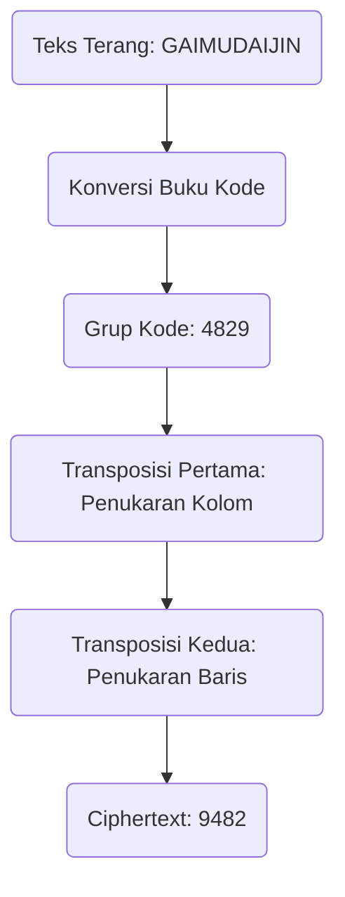
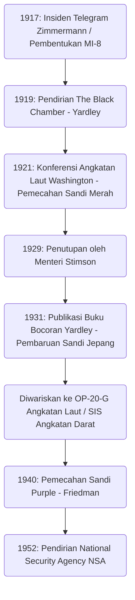

# Jatuh Bangun 'The Black Chamber': Para Pria yang Membobol Telegram Diplomatik dan Awal Mula Badan Intelijen Amerika

Nasib suatu negara sering kali tersembunyi di dalam deretan karakter sandi yang tak kasatmata. Saat mengungkap sejarah intelijen (spionase) modern, ada satu lembaga legendaris yang tak terelakkan dalam proses berkembangnya Amerika Serikat menjadi kerajaan informasi global. Itu adalah "The Black Chamber". Dalam artikel ini, kita akan membahas secara mendetail dan dari berbagai sudut pandang mengenai jatuh bangunnya lembaga rahasia ini, yang lahir dari kekacauan Perang Dunia I, menelanjangi diplomasi Jepang pada Konferensi Angkatan Laut Washington, dan meskipun akhirnya dikuburkan atas nama "moralitas", ia mewariskan DNA intelijen yang bermuara pada National Security Agency (NSA) modern.

---

## Bab 1: Perang Dunia I dan Lahirnya Kriptanalisis Modern

### Keterlibatan Amerika akibat Insiden Telegram Zimmermann
Teknologi sandi telah ada sejak zaman kuno ketika umat manusia mulai berkomunikasi melalui tulisan. Namun, pemicu yang membuat sandi diakui bukan sekadar taktik militer biasa, melainkan sebagai elemen inti dari strategi nasional, bermula dari peristiwa dramatis pada awal abad ke-20 dalam Perang Dunia I. Simbol dari hal ini adalah "Insiden Telegram Zimmermann" pada tahun 1917.

Pada bulan Januari 1917, Menteri Luar Negeri Kekaisaran Jerman, Arthur Zimmermann, mengirimkan telegram rahasia yang mengejutkan kepada Duta Besar Jerman di Meksiko melalui Washington. Telegram ini berisi dorongan agar Meksiko bersekutu dengan Jerman dan ikut berperang melawan Amerika Serikat, sebagai antisipasi jika Amerika, yang saat itu bersikap netral, ikut campur membela pihak Sekutu. Sebagai imbalannya, Jerman menjanjikan Meksiko pemulihan wilayahnya yang hilang, yaitu Texas, New Mexico, dan Arizona. Selain itu, ada pula instruksi untuk menarik Jepang ke dalam aliansi anti-Amerika ini.

Telegram ini disadap dan dipecahkan oleh "Room 40", departemen spesialis kriptanalisis dari Divisi Intelijen Angkatan Laut Inggris. Pemerintah Inggris yakin bahwa pengungkapan informasi intelijen ini akan memicu kemarahan publik Amerika dan menjadi pukulan telak yang membuat Presiden Woodrow Wilson memutuskan untuk ikut berperang, sehingga mereka memberikannya kepada pemerintah Amerika pada saat yang tepat. Itulah momen ketika pemecahan sandi memutar roda sejarah dunia secara besar-besaran.

### Pembentukan Intelijen Angkatan Darat MI-8 dan Ambisi Yardley
Insiden Zimmermann memberikan pelajaran pahit bagi para perwira militer dan pejabat tinggi pemerintah Amerika. Yaitu ketakutan bahwa sandi negara mereka sendiri telah bocor, serta kenyataan akan betapa besarnya keunggulan strategis yang bisa didapat jika mereka mampu memecahkan komunikasi musuh. Saat itu, Amerika belum memiliki lembaga kriptanalisis di tingkat nasional. Terdorong oleh rasa krisis ini, pada tahun 1917, dibentuklah "MI-8" (Military Intelligence, Section 8) di dalam Departemen Intelijen Angkatan Darat.

Sosok yang ditunjuk untuk memimpin MI-8 ini adalah Herbert Osborn Yardley, seorang teknisi telegraf muda dari Departemen Luar Negeri. Awalnya, ia hanyalah seorang operator yang bekerja di kantor telegraf pedesaan, tetapi ia memiliki intuisi kompetitif yang diasahnya dari bermain poker, serta kemampuan jenius untuk secara intuitif melihat pola sandi dan membongkar keteraturannya seperti memecahkan teka-teki. Yardley memiliki ambisi yang kuat, dan sering mengejutkan para atasannya dengan memecahkan telegram sandi yang dipertukarkan di Departemen Luar Negeri di Washington hanya untuk mengisi waktu luang.

### Tradisi "Cabinet Noir" di Eropa
Di Eropa, sejak lama telah ada tradisi lembaga pemerintah yang secara diam-diam menyensor dan memecahkan komunikasi, yang disebut "Cabinet Noir" (Kamar Hitam). Tokoh-tokoh seperti Antoine Rossignol, yang aktif di bawah Perdana Menteri Richelieu dari Prancis pada abad ke-17, dan John Wallis dari Inggris, adalah para pelopornya. Selama bertahun-tahun, mereka telah mengumpulkan pengetahuan kriptanalisis yang rumit. Namun, tradisi semacam itu sama sekali tidak ada di Amerika pada masa itu. Yardley harus membangun organisasi tersebut benar-benar dari nol. Ia mengumpulkan orang-orang dengan berbagai bakat, mulai dari matematikawan, ahli bahasa, hingga master catur, dan mendirikan MI-8, lembaga kriptanalisis pertama yang sesungguhnya di Amerika. Selama Perang Dunia I, mereka menantang diri mereka sendiri terutama dalam memecahkan sandi lapangan dan sandi diplomatik militer Jerman, serta berkontribusi secara tak kasatmata.

---

## Bab 2: Biro Sandi Rahasia di Manhattan, "The Black Chamber"

### Pendirian Perusahaan Fiktif dan Perjanjian Rahasia
Pada bulan November 1918, Perang Dunia I berakhir. Seiring dengan pencabutan status perang, badan intelijen militer diperkecil, dan kelangsungan MI-8 pun terancam. Namun, Yardley, yang sangat memahami nilai intelijen, dengan tegas menyatakan bahwa badan pemecah sandi sangat mutlak dibutuhkan oleh negara, bahkan di masa damai. Ia berhasil secara diam-diam menarik anggaran bersama dari Departemen Luar Negeri dan Angkatan Darat (sekitar 100.000 dolar per tahun). Pada tahun 1919, lahirlah biro sandi rahasia masa damai pertama Amerika, yang kemudian dikenal sebagai "The Black Chamber".

Untuk menjaga kerahasiaan ekstrem operasinya, basis mereka ditempatkan jauh dari Washington, yaitu di sebuah townhouse yang tidak mencolok di East 37th Street, Manhattan, New York. Secara lahiriah, mereka menyamar sebagai perusahaan swasta bernama "Code Compilation Company" (Perusahaan Kompilasi Sandi), dan tampak seperti sedang menjual buku kode komersial.

Senjata terbesar mereka adalah perjanjian rahasia dengan perusahaan telegraf raksasa di Amerika. Secara sangat rahasia, Yardley berhasil meyakinkan para eksekutif seperti Presiden Western Union, Newcomb Carlton, dan eksekutif Postal Telegraph. Melalui daya tarik patriotisme yang dicampur dengan tekanan terselubung, ia membangun sebuah sistem di mana salinan (kertas asli) telegram yang dipertukarkan antara korps diplomatik berbagai negara yang berkedudukan di Washington dengan negara asal mereka, disalurkan setiap hari ke The Black Chamber. Tindakan ini jelas-jelas merupakan pelanggaran privasi komunikasi dan ilegal menurut hukum domestik Amerika, tetapi di bawah kedok keamanan nasional, semuanya disembunyikan dalam kegelapan.

Di townhouse Manhattan, para analis sandi berjuang siang dan malam menghadapi tumpukan telegram sandi yang diantar setiap hari. Mereka memecahkan sandi diplomatik dari lebih dari 30 negara, merangkum isinya, dan mengirimkannya kepada para pejabat tinggi di Departemen Luar Negeri dan Angkatan Darat. Namun, target utama Yardley adalah komunikasi diplomatik Kekaisaran Jepang, yang saat itu sedang memperluas kekuasaannya di wilayah Pasifik. Sandi diplomatik Jepang sangatlah sulit, tetapi Yardley memiliki obsesi yang tidak wajar untuk menaklukkan benteng ini.

---

## Bab 3: Bentrokan di Konferensi Angkatan Laut Washington 1921

### Pertarungan Sengit atas Rasio Kepemilikan Kapal Tempur 5:5:3
Setelah Perang Dunia I, negara-negara besar yang menderita akibat biaya perang yang sangat besar terdesak untuk menghentikan perlombaan pembangunan angkatan laut. "Konferensi Angkatan Laut Washington" yang diselenggarakan dari November 1921 hingga Februari 1922 merupakan upaya terbesar untuk hal tersebut.

Menteri Luar Negeri Amerika Serikat, Charles Evans Hughes, pada awal konferensi mengajukan proposal perlucutan senjata yang berani, yaitu menjadikan rasio tonase kapal tempur utama antara Amerika, Inggris, dan Jepang menjadi "5:5:3". Bagi Jepang, ini sama sekali tidak dapat diterima. Angkatan Laut Jepang selama bertahun-tahun bersikeras bahwa kekuatan angkatan laut sebesar 70% dari kekuatan Amerika adalah syarat mutlak bagi pertahanan nasional, dan mereka menentang keras rasio 60% (5:5:3) yang dianggap akan mengancam fondasi keamanan mereka. Para duta besar berkuasa penuh, yakni Tomosaburo Kato (Menteri Angkatan Laut) dan Kijuro Shidehara (Duta Besar untuk AS), melakukan negosiasi yang sengit.

### Pemecahan Sandi Merah dan Kebocoran Total
Di balik negosiasi diplomatik ini, The Black Chamber sedang melakukan pemecahan secara menyeluruh terhadap sandi diplomatik Jepang. Yardley mengerahkan seluruh tenaganya untuk memecahkan sandi sangat rahasia dari Kementerian Luar Negeri Jepang, yang dikenal dengan sebutan "Red Code" (Sandi Merah). Sandi Merah merupakan sistem yang sangat rumit yang menggabungkan buku kode (codebook) dengan sandi transposisi.

Melalui analisis gigih Yardley, struktur sandi diplomatik Jepang berhasil ditelanjangi. Selama Konferensi Washington, telegram sandi yang dipertukarkan antara delegasi Jepang dengan Kementerian Luar Negeri dan Kementerian Angkatan Laut di Tokyo diantar ke The Black Chamber pada hari yang sama, dipecahkan, dan keesokan paginya sudah berada di atas meja Menteri Luar Negeri Hughes. Hughes dapat menghadapi negosiasi tersebut dengan mengetahui segala kelemahan dan sejauh mana delegasi Jepang bersedia berkompromi.

Pada tanggal 28 November 1921, sebuah telegram instruksi yang menentukan dikirim dari Kementerian Luar Negeri di Tokyo kepada Tomosaburo Kato. Telegram itu memuat rancangan kompromi akhir dari pemerintah Jepang. Isinya menyebutkan bahwa pada awalnya mereka akan bersikeras menuntut "70% dari Amerika", tetapi jika konferensi terancam gagal, sebagai garis pertahanan terakhir, mereka akan menerima "60% (5:5:3)" dengan syarat-syarat tertentu, seperti larangan fortifikasi pulau-pulau di Pasifik.

### Kemenangan Menteri Luar Negeri Hughes
Berbekal informasi hasil pemecahan sandi ini, Hughes menjalankan negosiasi dengan dingin. Karena dia tahu bahwa Jepang pada akhirnya akan mengalah, dia tidak menunjukkan kompromi sedikit pun terhadap tuntutan 70% dari Jepang, dan terus mempertahankan sikap tegasnya. Delegasi Jepang, meskipun bingung dengan sikap Amerika yang luar biasa agresif, tidak pernah membayangkan bahwa informasi mereka bocor, dan pada akhirnya terpaksa mengalah sesuai instruksi dari negara asalnya. Hasilnya, Jepang menerima rasio "5:5:3". Penandatanganan Perjanjian Angkatan Laut Washington ini dipuji sebagai kemenangan besar yang cemerlang bagi diplomasi Amerika, tetapi di baliknya, intelijen The Black Chamber memainkan peran yang sangat menentukan.

---

## Bab 4: Teknik Matematika dan Kriptografi dalam Kriptanalisis

Kami akan merinci latar belakang teknis mengenai bagaimana The Black Chamber memecahkan sandi-sandi rumit. Sandi yang mereka hadapi adalah sistem penyembunyian berlapis yang menggabungkan "Buku Kode" dan "Super-encipher" (enkripsi ulang).

### Evolusi Sejarah Sandi dan Analisis Struktur Sandi
Pada saat itu, komunikasi Kementerian Luar Negeri Jepang mengganti teks terang (plaintext) menggunakan buku kode menjadi deretan angka atau huruf beberapa digit (grup kode). Namun, untuk mencegah risiko buku kode dicuri atau dianalisis secara statistik, dilakukanlah "Super-encipher". Pihak Jepang menggunakan "Double Transposition Cipher" (Sandi Transposisi Ganda), yang menata ulang urutan karakter dari grup kode secara kompleks berdasarkan aturan tertentu.

Ciphertext yang telah melalui transposisi ganda ini sepenuhnya kehilangan bentuk asli dari grup kodenya. Untuk memecahkannya, perlu diidentifikasi ukuran grid transposisinya, membongkar aturan pertukaran baris dan kolom (kunci) untuk merekonstruksi kembali (anagram) grup kode aslinya, dan lalu menebak maknanya.

### Analisis Frekuensi dan Ujian Kasiski
Kejeniusan Yardley terletak pada prosedur rekonstruksi grid transposisi tersebut. Ia menerapkan "Analisis Frekuensi" (Frequency Analysis) hingga batas maksimal. Karena karakteristik bahasa Jepang yang ditulis dalam huruf romaji sebelum dienkripsi, frekuensi kemunculan huruf vokal (a, i, u, e, o) menjadi sangat tinggi. Ia menganalisis frekuensi kemunculan karakter di seluruh ciphertext secara statistik, menghitung probabilitas pasangan karakter tertentu (digraf atau trigraf, misalnya "sh", "ts") untuk saling berdekatan, lalu menyambungkan kolom-kolom yang terpisah bagaikan menyusun puzzle jigsaw.

Selain itu, "Ujian Kasiski" (Kasiski examination) juga sering digunakan. Ini adalah metode yang mengukur jarak antara string tertentu yang berulang dalam ciphertext, dan dari pembagi bersamanya, diperkirakan panjang kunci sandinya (lebar grid). Melalui ini, periodisitas sandi transposisi dapat terbongkar.

### Indeks Koinsidensi (Index of Coincidence)
Bersamaan dengan aktivitas The Black Chamber, seorang jenius sandi Amerika lainnya, William F. Friedman, sedang merumuskan alat matematika yang revolusioner bernama "Indeks Koinsidensi" (Index of Coincidence: I.C.).

Ini menunjukkan probabilitas bahwa apabila dua karakter dipilih secara acak dari ciphertext, keduanya merupakan karakter yang sama persis. Friedman membuktikan bahwa dengan menghitung I.C. ini, dapat dinilai secara matematis apakah ciphertext dienkripsi dengan kunci tunggal, dienkripsi dengan banyak kunci, atau berupa sandi transposisi, bahkan pada tahap sebelum mengetahui panjang kuncinya. Kebangkitan "pendekatan murni matematis dan statistik" Friedman dari pemecahan yang berdasarkan intuisi dan pengalaman Yardley, menyimbolkan masa transisi evolusi kriptanalisis dari sekadar "kejeniusan individu" menjadi sebuah "ilmu yang terorganisir".

---

## Bab 5: Akhir: "Tuan-tuan Tidak Membaca Surat Orang Lain"

### Kemarahan Moral Stimson
Meskipun sukses besar dalam Konferensi Washington, kejayaan The Black Chamber tidak berlangsung lama. Akhirnya tidak disebabkan oleh serangan dari luar, melainkan oleh keputusan "moral" dari dalam pemerintahan Amerika Serikat.

Pada bulan Maret 1929, di bawah pemerintahan Presiden Herbert Hoover, Henry L. Stimson menjabat sebagai Menteri Luar Negeri yang baru. Stimson adalah seorang idealis dengan etika Protestan yang ketat. Segera setelah menjabat, saat meneliti pengeluaran anggaran Departemen Luar Negeri, ia mengetahui tentang keberadaan The Black Chamber dan praktik "penyadapan ilegal komunikasi kedutaan asing".

Stimson sangat marah. Baginya, tindakan mengintip komunikasi negara sekutu maupun negara sahabat adalah pengkhianatan keji yang sangat mencoreng harga diri diplomasi Amerika. Ia segera memutuskan untuk memutus pendanaan dan mengucapkan kata-kata yang terukir abadi dalam sejarah intelijen.

**"Tuan-tuan tidak membaca surat orang lain. (Gentlemen do not read each other's mail.)"**

### Buku Bocoran dan Kejutan Dunia
Kehilangan sponsor terbesarnya, The Black Chamber mengalami kesulitan keuangan, yang diperparah oleh Depresi Besar pada tahun 1929. Pada tanggal 31 Oktober pada tahun yang sama, The Black Chamber secara resmi ditutup dan dipaksa bubar.

Yardley, yang kehilangan pekerjaannya di tengah Depresi Besar, menghadapi kesulitan hidup yang serius. Merasa patriotismenya dikhianati dan didorong oleh keputusasaan, pada tahun 1931 ia menerbitkan sebuah buku bocoran berjudul "The American Black Chamber" yang dengan jujur mengisahkan pengalamannya.

Buku ini secara gamblang mengungkap fakta bahwa Amerika telah memecahkan sandi diplomatik dari berbagai negara, dan khususnya keseluruhan penyadapan komunikasi Jepang selama Konferensi Washington. Buku ini, yang menjadi buku laris di seluruh dunia, memberikan kejutan yang luar biasa bagi Jepang. Pemerintah dan militer Jepang menjadi panik menghadapi kenyataan bahwa sandi rahasia tertinggi mereka telah bocor, dan segera menghancurkan seluruh sistem sandi mereka. Kemudian, dengan menjadikan kebocoran ini sebagai pelajaran, mereka mempercepat pengembangan mesin sandi yang jauh lebih canggih, yakni "Mesin Ketik Alfabet Tipe 97 (Purple)". Ironisnya, bocoran Yardley justru membuat teknologi sandi Jepang berkembang pesat.

---

## Bab 6: Warisan The Black Chamber

### Transmisi ke OP-20-G dan SIS
Walaupun The Black Chamber berakhir dengan tragis, benih intelijen yang mereka taburkan tidaklah mati. Pengetahuan teknis dan sebagian personelnya diteruskan secara rahasia ke "OP-20-G", Departemen Intelijen Komunikasi Angkatan Laut Amerika Serikat. Joseph Rochefort dan rekan-rekannya di OP-20-G memperkenalkan pendekatan matematis dan pemrosesan data mekanis. Pada Pertempuran Midway tahun 1942, mereka memecahkan sandi Angkatan Laut Jepang "JN-25", mengidentifikasi "AF (Midway)", dan membawa kemenangan bersejarah.

Di sisi lain, di lingkungan Angkatan Darat, "Signal Intelligence Service (SIS)" didirikan dan dipimpin oleh William Friedman. Ia menolak metode Yardley yang mengandalkan intuisi personal, dan membangun sistem "kriptanalisis ilmiah" yang sepenuhnya didasarkan pada teori matematika dan statistik.

### Dari Pemecahan Sandi Purple ke NSA
Pencapaian terbesar SIS yang dipimpin oleh Friedman adalah keberhasilan memecahkan sepenuhnya mesin sandi "Purple", rahasia tertinggi Jepang, pada tahun 1940. Tanpa pernah melihat mesin aslinya, mereka menebak sistem pengkabelan dari mekanisme sakelar pijak hanya dengan analisis logis, dan membuat mesin replikanya (Magic). Informasi "MAGIC" ini memberikan nilai yang tak terhingga bagi pengambilan keputusan strategis selama Perang Dunia II. Ironisnya, Stimson, yang pernah menutup The Black Chamber, kembali sebagai Menteri Angkatan Darat, dan kali ini menjadi konsumen yang antusias terhadap MAGIC.

Setelah perang, pada tahun 1952, seiring dengan semakin tajamnya Perang Dingin, pemerintah Amerika Serikat menyatukan lembaga-lembaga sandinya dan mendirikan badan intelijen elektronik raksasa, "National Security Agency (NSA)". Di dasar NSA saat ini, yang memantau jaringan komunikasi berskala global dan menggunakan superkomputer, DNA Yardley dan para pria di The Black Chamber yang dulu menantang sandi selayaknya memecahkan teka-teki di sebuah townhouse kecil di Manhattan, benar-benar terus hidup.

Jatuh bangunnya The Black Chamber merupakan titik balik yang sangat menentukan yang menandai fajar bagi badan intelijen Amerika, membuka kotak Pandora yang membawa pada perang siber modern ketika negara menyadari nilai absolut dari senjata yang disebut "informasi".

Lintasan sejarah ini membuktikan secara dingin bahwa intelijen bukan lagi sekadar pelengkap diplomasi, melainkan teknologi inti yang memengaruhi kelangsungan hidup suatu negara. Hasrat dan ambisi Yardley, serta aktivitas rahasia The Black Chamber, dapat dikatakan sebagai titik awal yang tidak boleh dilupakan dalam memahami perang informasi dan masyarakat keamanan siber yang kompleks saat ini.

## Lampiran: Eksplorasi Mendalam dan Detail Teknis Mengenai The Black Chamber

Berdasarkan tinjauan sejarah pada bagian utama, di sini kami akan menambahkan analisis yang lebih rinci tentang kesulitan teknis spesifik di lapangan pemecahan sandi, asimetri intelijen dalam politik internasional pada masa itu, dan struktur psikologis yang kompleks dari sosok bernama Yardley, guna memberikan kedalaman akademis dan praktis.

### 1. Kesulitan Praktis dalam Memecahkan Sandi Transposisi Ganda (Double Transposition)
Seperti yang telah disebutkan sebelumnya, "Super-encipher" (enkripsi ulang) dalam Sandi Merah yang digunakan oleh Kementerian Luar Negeri Jepang adalah sandi transposisi ganda. Proses pemecahannya yang hanya menggunakan kertas dan pensil sangat berbeda dari serangan brute-force oleh komputer modern, dan merupakan kombinasi dari intuisi tingkat tinggi dan penalaran logis.

Langkah pertama dalam memecahkan sandi transposisi ganda adalah mengetahui secara pasti "panjang pesan". Misalnya, jika sebuah ciphertext berjumlah "35 karakter", ukuran grid kemungkinan besar adalah "5x7" atau "7x5". Namun, jika jumlah karakternya merupakan bilangan prima, seperti "37 karakter", operator yang melakukan enkripsi mungkin menambahkan beberapa karakter palsu (null) untuk membentuk persegi panjang, atau mereka menggunakan "Incomplete Columnar Transposition" (Transposisi Kolom Tidak Lengkap), di mana kotak-kotak tertentu dibiarkan kosong selama proses transposisi. Kementerian Luar Negeri Jepang sering menggunakan transposisi kolom tidak lengkap ini, sehingga pemecahannya menjadi sangat sulit.

Yardley dan timnya memulai dengan mengumpulkan sejumlah besar pesan dengan panjang berbeda yang dienkripsi menggunakan kunci yang sama (ini disebut sebagai "Isomorphs"). Dengan membandingkan isomorph, mereka bisa menemukan pola di mana kotak kosong ditempatkan dalam grid, sehingga memungkinkan mereka mengidentifikasi panjang kolom. Proses ini dikenal sebagai "Multiple Anagramming".

Setelah panjang kolom teridentifikasi, langkah selanjutnya adalah menyusun ulang kolom berdasarkan frekuensi kemunculan huruf vokal. Sebagai contoh, jika suatu kolom banyak mengandung "A" atau "O", dan kolom lainnya banyak mengandung "K" atau "S", dengan menempatkan kolom-kolom ini secara berdekatan, ada kemungkinan besar suku kata bahasa Jepang (romaji) seperti "KA" atau "SO" dapat direkonstruksi. Yardley memberikan skor statistik untuk ribuan hingga puluhan ribu pasangan suku kata semacam itu dan menghasilkan kombinasi kolom dengan probabilitas tertinggi. Ini adalah trik ajaib layaknya menyusun rubik raksasa dengan mata tertutup, dan ini lebih bergantung pada wawasan mendalam terhadap struktur bahasa daripada metode matematika murni.

### 2. Obsesi dalam Merekonstruksi Buku Kode
Meskipun aturan (kunci) transposisi telah dipecahkan, deretan karakter acak itu hanyalah kembali menjadi "grup kode tanpa makna (kumpulan angka atau huruf)". Rintangan berikutnya adalah menebak kata apa yang dimaksud oleh grup kode tersebut, dan menyusun ulang buku kodenya sendiri dari selembar kertas kosong.

Hal yang memungkinkan langkah ini adalah "Konteks" (Context) dan "Frasa Standar". Ada format khusus dalam telegram diplomatik. Bagian awalnya sering memuat penerima, pengirim, tanggal, dan instruksi standar seperti "Segera" (Urgent) atau "Rahasia" (Confidential). Selain itu, pada waktu tertentu, topik tertentu juga sering muncul. Selama periode Konferensi Washington, mudah ditebak bahwa kata-kata seperti "Kapal Tempur" (Battleship), "Tonase" (Tonnage), "Rasio" (Ratio), dan "Hughes" akan sering berseliweran.

Tim Yardley menerapkan kata-kata tebakan ini (yang disebut Crib) ke dalam teks sandi dan memverifikasi apakah ada kontradiksi atau tidak. Misalnya, jika kelompok kode "6832" diasumsikan berarti "Angkatan Laut", dan kelompok kode yang sama muncul dalam telegram lain dengan konteks yang sama sekali tidak berhubungan dengan pelucutan senjata, maka asumsi tersebut dianggap salah dan dibuang. Dengan cara ini, mereka memberi makna pada setiap kelompok kode, dan pekerjaan menyusun kamus raksasa dari nol ini berlanjut selama bertahun-tahun. Keakuratan buku kode yang berhasil direkonstruksi inilah yang menjadi harta karun The Black Chamber yang sebenarnya.

### 3. Asimetri Intelijen dan Batas dari "Perjanjian Tuan-tuan"
Fakta bahwa Amerika mampu memecahkan sandi Jepang pada Konferensi Washington bukan sekadar menunjukkan keuntungan sepihak suatu negara dalam bernegosiasi. Lebih dari itu, fakta tersebut menunjukkan efek menentukan dari "asimetri intelijen" dalam hubungan internasional.

Tatanan internasional pada masa itu yang berpusat pada Liga Bangsa-Bangsa, bertumpu pada "diplomasi terbuka" (open diplomacy) dan "rasa saling percaya terhadap perjanjian". Namun, di baliknya, ada kenyataan dingin bahwa siapa pun yang menguasai perang informasi akan memegang inisiatif dalam menentukan aturan main (rulemaking). Jepang, meski terikat oleh kerangka idealis "pelucutan senjata" yang diajukan Amerika Serikat, kenyataannya harus duduk di meja perundingan dalam keadaan di mana "batas bawah" kesediaan kompromi mereka sepenuhnya dipahami pihak lawan.

Asimetri ini menunjukkan bagaimana nilai sebuah informasi dapat mengungguli kekuatan militer fisik (seperti jumlah kapal tempur). Seandainya pada waktu itu Jepang menyadari bahwa sandinya bocor, dan sebaliknya melakukan operasi penipuan (deception) dengan memberikan informasi palsu, hasil dari sistem Washington mungkin akan sama sekali berbeda.

Di balik alasan Henry Stimson menutup The Black Chamber adalah adanya kekhawatiran yang kuat bahwa "permainan belakang layar" semacam itu akan merusak "tatanan internasional berbasis hukum" yang ia yakini. Perkataan Stimson yang berbunyi, "Tuan-tuan tidak membaca surat orang lain," sering kali dicemooh sebagai idealisme yang naif, tetapi kalimat itu juga merupakan komitmen kuat terhadap "bentuk diplomasi baru yang sangat transparan" yang coba dicapai Amerika pada masa itu. Namun, sejarah tidak memilih idealismenya Stimson, melainkan memilih realisme (Machiavellianisme) Yardley.

### 4. Ambivalensi Sosok Herbert O. Yardley
Dalam menceritakan kisah The Black Chamber, karakter unik Yardley merupakan elemen yang tak bisa dipisahkan. Ia bukan sekadar analis kripto yang brilian, melainkan juga sosok kompleks yang penuh dengan ego dan ambisi.

Ia memiliki keyakinan mutlak pada kemampuannya dan terkadang bersikap arogan bahkan terhadap pejabat tinggi pemerintah. Ketika The Black Chamber mencapai kesuksesan di Konferensi Washington, ia menganggap dirinya sebagai "Pahlawan bayangan yang menyelamatkan Amerika," lalu meminta lebih banyak anggaran dan wewenang. Namun, esensi dari lembaga intelijen adalah berwujud "bayangan". Kebutuhannya untuk selalu tampil merupakan cacat yang fatal bagi pimpinan sebuah lembaga intelijen yang semestinya beroperasi secara rahasia.

Setelah maklumat penutupan dari Stimson, tindakan Yardley menerbitkan "The American Black Chamber" bukan hanya bertujuan meraih uang karena himpitan ekonomi. Publikasi tersebut juga merupakan aksi balas dendam yang pedas kepada pemerintah yang telah bersikap dingin padanya, dan sekaligus merupakan pelampiasan hasrat yang tak terbendung agar kejeniusannya diakui dunia.

Akibat pengungkapan tersebut, ia diasingkan dari komunitas intelijen Amerika untuk selamanya. Selama Perang Dunia II, meskipun pemerintah Amerika sangat membutuhkan ahli kriptanalisis, Yardley tidak pernah lagi diizinkan menduduki posisi resmi. Ia menyeberang ke Tiongkok untuk membantu kriptanalisis Partai Nasionalis, dan bekerja sama dalam pendirian badan sandi pemerintah Kanada, tetapi ia tidak pernah kembali menjadi pusat proyek berskala nasional seperti dulu.

Meskipun Yardley wafat dalam kekecewaan pada tahun 1958, apa yang ia tinggalkan sangatlah besar. Ia mengajukan pertanyaan fundamental kepada kita, yang masih relevan hingga saat ini, mengenai peran apa yang seharusnya dimainkan oleh badan intelijen di dalam suatu negara, dan bagaimana peran tersebut berbenturan dengan ambisi serta etika pribadi. Sangat mudah untuk menyingkirkannya dan menganggapnya sebagai "pengkhianat" atau "pembocor demi uang," tetapi dalam sejarah intelijen Amerika, tidak ada tokoh lain yang memancarkan cahaya dan bayangan sekuat Yardley.

### 5. Jalan Menuju Pemecahan Mesin Sandi Purple: Dari Analog ke Digital
Fakta bahwa Jepang memperbarui sistem sandinya gara-gara pengungkapan Yardley, mengakibatkan teknik kriptanalisis Amerika secara paksa berevolusi ke dimensi berikutnya. "Mesin Ketik Alfabet Tipe 97 (Purple)" yang diadopsi Jepang adalah sandi mekanis rumit yang sama sekali tidak dapat dipecahkan menggunakan anagram linguistik atau analisis frekuensi, keahlian yang sangat dikuasai Yardley.

Di sinilah muncul William Friedman dan SIS (Signal Intelligence Service) yang dipimpinnya. Friedman meningkatkan kriptanalisis dari "intuisi personal" menjadi "kombinasi matematika dan teknik mesin". Mesin sandi Purple menggunakan sejumlah sakelar pijak (stepping switches, sakelar rotari yang biasa dipakai di sentral telepon) untuk mengubah huruf yang diketik menjadi huruf lain melalui sirkuit elektrik yang kompleks. Pola koneksi sirkuit ini berubah-ubah setiap kali tuts diketik, sehingga algoritma enkripsinya terus bervariasi.

Tim SIS (yang juga meliputi ahli matematika brilian seperti Frank Rowlett) secara matematis menganalisis setiap bias statistik terkecil yang ada pada teks sandi yang disadap, serta mengamati kebiasaan operasional diplomat Jepang yang salah (seperti mengirim beberapa pesan dengan konfigurasi kunci yang sama). Meskipun mereka sama sekali tidak pernah melihat wujud asli dari mesin sandi Purple tersebut, mereka berhasil merekonstruksi sepenuhnya secara logis di atas kertas, bagaimana perkabelan internal dari mesin itu dibangun.

Proses ini secara fundamental berbeda dengan masa "pemecahan teka-teki" di era Yardley. Metode baru ini adalah konstruksi model matematis tingkat tinggi yang menjadi fondasi teori kriptografi masa kini. Ketika tim Friedman merampungkan replika analog mesin Purple yang dijuluki "Magic", itu menandai berakhirnya kriptanalisis berbasis manusia (personel-dependent) gaya Yardley dan sekaligus membuka era "Signals Intelligence (SIGINT)" berbasis teknologi yang bermuara pada NSA.

### Kesimpulan
Kisah "The Black Chamber" merupakan babak pertama yang dramatis dalam sejarah hubungan antara negara dan informasi. Intuisi Yardley, moralitas Stimson, dan sains Friedman. Proses konflik dan evolusi di antara ketiga hal tersebut memberikan wawasan sejarah yang mendalam terhadap masalah-masalah "intelijen dan etika" yang dipertanyakan saat ini, seperti dalam insiden Edward Snowden serta perang informasi di ruang siber modern. Obsesi pria-pria yang membobol telegram diplomatik itu, meskipun berubah bentuknya, tetap hidup dan terus mengalir di relung-relung terdalam pemerintahan negara-negara modern.

### 6. Signifikansi Modern dari The Black Chamber dalam Prespektif Sejarah Informasi
Dalam konteks sejarah yang lebih luas, warisan yang ditinggalkan oleh The Black Chamber tidak hanya terbatas pada evolusi teknologi pemecahan sandi semata. Dapat dikatakan bahwa itu adalah cikal bakal di mana "Informasi (Intelijen)" mulai berfungsi sebagai pusat kekuasaan yang independen di suatu negara.

Apa yang dibangun oleh Yardley adalah sebuah sistem yang memberikan bukti kuat (hard intelligence), diperoleh dari sumber tak kasatmata, untuk pengambilan keputusan di bidang militer dan diplomatik. Jika sebelumnya diplomasi sangat bergantung pada laporan duta besar dan analisis informasi terbuka (soft intelligence), tindakan memecahkan sandi komunikasi musuh membuat orang mampu menyarikan "niat jujur yang tak direkayasa" dari pihak lawan secara langsung.

Badan sinyal intelijen modern seperti National Security Agency (NSA) atau Government Communications Headquarters (GCHQ) Inggris telah melakukan lompatan jauh dari aspek fondasi teknologi dibandingkan pada zaman Yardley. Akan tetapi, dalam misi mendasar mereka untuk "mendobrak privasi komunikasi dan menjadikan informasi sebagai senjata," lembaga-lembaga ini sesungguhnya masih terus menapaki cetak biru yang telah digambar oleh Yardley. Sejarah jatuh bangunnya The Black Chamber terus melontarkan pertanyaan pelik yang belum sepenuhnya terjawab di abad ke-21 ini, yaitu: seberapa jauh sebuah negara boleh melampaui batas etika demi melindungi keamanannya sendiri?
