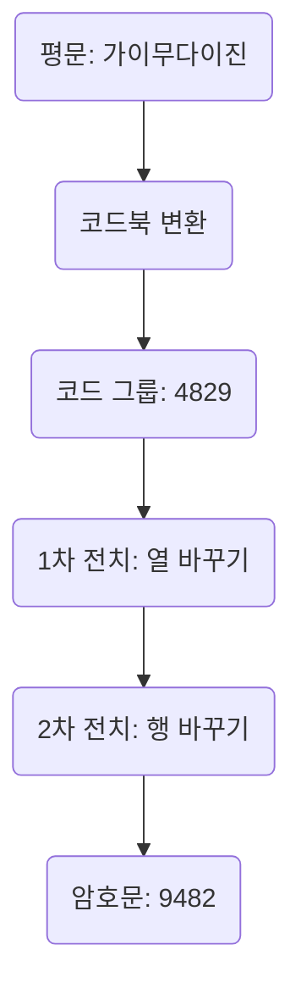
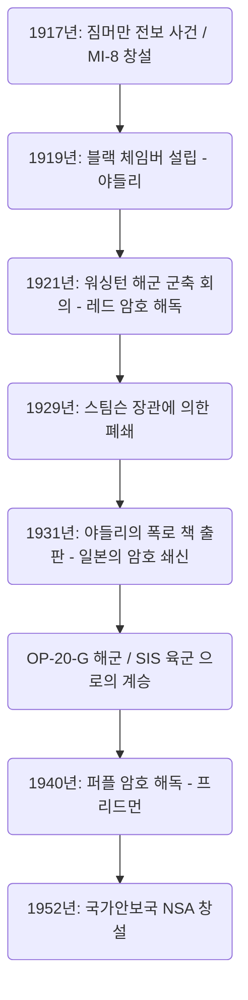

# 암호 해독 기관 '블랙 체임버'의 흥망: 외교 전보를 훔쳐본 남자들과 미국 정보기관의 여명

국가의 운명은 종종 눈에 보이지 않는 암호 문자열 속에 숨겨져 있다. 근대 인텔리전스(첩보)의 역사를 살펴볼 때, 미합중국이 세계적인 정보 제국으로 성장하는 과정에서 피할 수 없는 전설적인 기관이 하나 존재한다. 그것이 바로 '블랙 체임버(The Black Chamber)'이다. 본고에서는 제1차 세계대전의 혼란 속에서 첫 울음을 터뜨리고, 워싱턴 해군 군축 회의에서 일본 외교를 낱낱이 파헤치고, 그리고 '도의'라는 이름 아래 매장당하면서도 현대의 국가안보국(NSA)에 이르는 인텔리전스의 DNA를 남긴 이 비밀기관의 흥망에 대해 지극히 상세하고 다각적으로 논하고자 한다.

---

## 제1장: 제1차 세계대전과 근대 암호 해독의 탄생

### 짐머만 전보 사건으로 인한 미국 참전
암호라는 기술은 인류가 문자로 통신을 시작한 고대부터 존재했다. 그러나 그것이 단순한 군사 전술의 틀을 넘어 국가 전략의 근간을 이루는 요소로 인식되기 시작한 것은 20세기 초 제1차 세계대전의 극적인 사건에서 비롯된다. 그 상징이라 할 수 있는 것이 1917년의 '짐머만 전보 사건'이다.

1917년 1월, 독일 제국의 외무장관 아르투어 짐머만은 워싱턴을 거쳐 멕시코 주재 독일 대사에게 충격적인 비밀 전보를 타전했다. 이 전보는 당시 중립을 유지하고 있던 미국이 연합국 측으로 참전할 경우에 대비하여, 멕시코가 독일과 동맹을 맺고 대미 전쟁에 참전할 것을 촉구하는 것이었다. 그 대가로 독일은 멕시코에 텍사스, 뉴멕시코, 애리조나주의 실지 회복을 약속했다. 나아가 일본도 이 반미 동맹에 끌어들이라는 지시가 포함되어 있었다.

이 전보는 영국 해군 정보부의 암호 해독 전문 부서인 '룸 40(제25호실)'에 의해 감청 및 해독되었다. 영국 정부는 이 인텔리전스의 폭로가 미국 여론을 격분시키고 우드로 윌슨 대통령이 참전을 결단하게 만드는 결정적 타격이 될 것이라 확신하고, 절묘한 타이밍에 미국 정부에 제공했다. 암호 해독이 세계사의 톱니바퀴를 크게 돌린 순간이다.

### 육군 정보부 MI-8의 창설과 야들리의 야심
짐머만 사건은 미국의 군부와 정부 고위 관료들에게 뼈아픈 교훈을 주었다. 자국의 암호가 모두 새어나가고 있다는 공포와, 적국의 통신을 해독할 수 있다면 얼마나 큰 전략적 우위를 점할 수 있는지에 대한 사실이었다. 당시 미국에는 국가 수준의 암호 해독 기관이 존재하지 않았다. 이러한 위기감에서 1917년 육군 정보부 내에 'MI-8(Military Intelligence, Section 8)'이 창설되었다.

이 MI-8의 수장으로 발탁된 인물이 국무부의 젊은 전신기사 허버트 오스본 야들리(Herbert Osborn Yardley)이다. 그는 원래 시골 전신국에서 일하는 오퍼레이터에 불과했지만, 포커로 다진 승부 감각과 암호의 패턴을 직관적으로 간파하여 퍼즐을 풀 듯 규칙성을 폭로하는 천재적인 능력을 가지고 있었다. 야들리는 강한 상승 지향을 가지고 있었으며, 워싱턴 국무부에서 오가는 암호 전보를 심심풀이로 해독하여 상사들을 경탄하게 만들었던 것이다.

### 유럽의 '검은 방(Cabinet Noir)'의 전통
유럽에는 예로부터 국가가 통신을 은밀히 검열 및 해독하는 'Cabinet Noir(검은 방)'이라 불리는 전통적 기관이 존재했다. 17세기 프랑스의 재상 리슐리외 밑에서 활약한 앙투안 로시뇰이나, 영국의 존 월리스 등이 그 선구자였으며, 오랫동안 정교한 암호 해독 노하우를 축적하고 있었다. 그러나 당시 미국에는 그러한 전통이 전무했다. 야들리는 완전히 백지상태에서 조직을 구축해야만 했다. 그는 수학자, 언어학자, 체스 달인까지 다양한 재능을 가진 인재들을 긁어모아 미국 최초의 본격적인 암호 해독 기관 MI-8을 출범시켰다. 이들은 제1차 세계대전 중 주로 독일군의 야전 암호와 외교 암호 해독에 도전하여 보이지 않는 형태로 기여하게 된다.

---

## 제2장: 맨해튼의 비밀 암호국 '블랙 체임버'

### 위장 회사 설립과 비밀 협정
1918년 11월, 제1차 세계대전이 종결되었다. 전시 체제의 해제와 함께 군사 정보 기관은 축소되었고, MI-8도 존속의 위기에 처했다. 그러나 인텔리전스의 가치를 뼛속 깊이 알고 있던 야들리는 평시에도 암호 해독 기관이 국가에 필수적이라고 강력히 주장했다. 그는 국무부와 육군으로부터 은밀히 공동 예산(연간 약 10만 달러)을 이끌어내는 데 성공한다. 1919년, 이렇게 탄생한 것이 훗날 '블랙 체임버(The Black Chamber)'라 불리는 미국 최초의 평시 비밀 암호국이다.

활동의 극도의 은닉성을 유지하기 위해 거점은 워싱턴에서 멀리 떨어진 뉴욕 맨해튼 동쪽 37번가의 눈에 띄지 않는 타운하우스에 두었다. 겉으로는 '코드 컴필레이션 컴퍼니(암호 편찬 회사)'라는 민간 기업으로 위장하여, 상업용 코드북을 판매하는 것처럼 꾸미고 있었다.

이들의 가장 큰 무기는 미국 내 거대 전신 회사와의 비밀 협정이었다. 야들리는 웨스턴 유니온의 사장 뉴컴 칼튼을 비롯해 포스탈 텔레그래프 등의 간부들을 극비리에 설득했다. 애국심에 대한 호소와 암묵적인 압력을 교차하여, 워싱턴에 주재하는 각국 외교단이 본국과 주고받는 전보의 사본(원지)을 매일같이 블랙 체임버로 빼돌리는 시스템을 구축한 것이다. 이는 명백한 통신 비밀 침해이자 미국 국내법에 저촉되는 불법 행위였으나, 국가 안보라는 대의명분 아래 모든 것이 어둠 속에 묻혔다.

맨해튼의 타운하우스에서는 매일 전달되는 엄청난 양의 암호 전보 더미 앞에서 해독관들이 밤낮으로 사투를 벌이고 있었다. 그들은 30개국 이상의 외교 암호를 해독하고 그 내용을 요약하여 국무부나 육군 고위층에 전달했다. 그러나 야들리의 가장 큰 표적은 태평양 지역에서 세력을 확장해 나가고 있던 대일본제국의 외교 통신이었다. 일본의 외교 암호는 난해하기 짝이 없었으나, 야들리는 이 요새를 함락시키는 데 비정상적인 집념을 불태웠던 것이다.

---

## 제3장: 1921년 워싱턴 해군 군축 회의의 격돌

### 주력함 보유 비율 5:5:3을 둘러싼 사투
제1차 세계대전 후 막대한 전비에 시달리던 열강들은 건함 경쟁에 제동을 걸어야 할 필요성에 직면했다. 1921년 11월부터 1922년 2월에 걸쳐 개최된 '워싱턴 해군 군축 회의'는 그 대표적인 시도였다.

미국 국무장관 찰스 에번스 휴스는 회의 서두에서 미·영·일의 주력함 톤수 비율을 '5:5:3'으로 한다는 대담한 군축안을 제시했다. 일본으로서는 도저히 받아들일 수 없는 것이었다. 일본 해군은 오랫동안 대미 7할의 해군력이 국방의 절대 조건이라고 주장해 왔으며, 대미 6할(5:5:3)은 안보를 근본적으로 위협한다며 강경하게 반발했다. 전권대사인 가토 도모사부로(해군대신)와 시데하라 기주로(주미대사)는 격렬한 협상을 전개했다.

### 레드 암호의 해독과 모든 누설
이 외교 협상의 이면에서는 블랙 체임버에 의한 일본 외교 암호의 철저한 해독이 이루어지고 있었다. 야들리는 일본 외무성의 최고 기밀 암호, 통칭 '레드 암호(Red Code)' 해독에 총력을 기울이고 있었다. 레드 암호는 암호서(코드북)와 전치식 암호를 결합한 매우 복잡한 시스템이었다.

야들리의 집념 어린 분석을 통해 일본 외교 암호의 구조는 낱낱이 벗겨졌다. 워싱턴 회의 중 일본 전권단과 도쿄의 외무성·해군성 간에 오가는 암호 전보는 그날로 블랙 체임버에 전달되어 해독되었고, 다음 날 아침이면 휴스 국무장관의 책상 위에 놓였다. 휴스는 일본 협상단이 어디까지 양보할 작정인지, 그 패를 전부 알고 있는 상태에서 협상에 임할 수 있었다.

1921년 11월 28일, 도쿄 외무성에서 가토 도모사부로 앞으로 결정적인 훈령 전보가 타전되었다. 거기에는 일본 정부의 최종적인 타협안이 적혀 있었다. 처음에는 '대미 7할'을 강경하게 주장하지만, 회의가 결렬될 것 같을 경우에는 태평양 섬들의 요새화 금지 등의 조건을 달아 최종 방어선으로서 '대미 6할(5:5:3)'을 수용한다는 내용이었다.

### 휴스 국무장관의 승리
휴스는 이 해독 정보를 손에 쥐고 냉혹하게 협상을 진행했다. 그는 일본이 최종적으로 양보할 것임을 알고 있었기 때문에, 일본의 7할 요구에 대해 일절 타협을 보이지 않고 의연한 태도를 일관했다. 일본 협상단은 미국 측의 비정상적으로 강경한 태도에 당황하면서도, 정보가 새어나가고 있다는 것은 꿈에도 생각하지 못한 채 최종적으로는 본국의 지시대로 꺾일 수밖에 없었다. 결과적으로 일본은 '5:5:3' 비율을 수용한다. 이 워싱턴 해군 군축 조약의 체결은 미국 외교의 눈부신 대승리로 칭송받았으나, 그 배후에는 블랙 체임버의 인텔리전스가 결정적인 역할을 했던 것이다.

---

## 제4장: 암호 해독의 수학적·암호학적 기술

블랙 체임버가 어떻게 복잡한 암호를 해독했는지 그 기술적 배경에 대해 상술한다. 그들이 직면한 암호는 '코드북'과 '수퍼 엔시퍼(재암호화)'를 결합한 다층적인 은닉 시스템이었다.

### 암호사의 변천과 암호의 구조 분석
당시 일본 외무성의 통신은 평문을 코드북을 이용해 몇 자리 숫자나 문자의 나열(코드 그룹)로 치환했다. 그러나 코드북을 도둑맞거나 통계 분석 당할 위험을 방지하기 위해 '수퍼 엔시퍼'를 수행했다. 일본 측이 사용한 것은 코드 그룹 문자의 순서를 일정한 규칙에 따라 복잡하게 뒤섞는 '이중 전치 암호(Double Transposition Cipher)'였다.

이 이중 전치를 거친 암호문은 원래 코드 그룹의 흔적을 완전히 잃어버린다. 이를 해독하려면 전치의 그리드 크기를 파악하고, 행과 열의 교환 규칙(키)을 간파하여 원래 코드 그룹을 재구성(아나그램)한 다음, 그 의미를 추측해야 했다.

### 빈도 분석과 카시스키 테스트
야들리의 천재성은 전치 그리드의 재구성 절차에 있었다. 그는 '빈도 분석(Frequency Analysis)'을 극한까지 응용했다. 일본어를 로마자로 표기하여 암호화하는 특성상 모음(a, i, u, e, o)의 출현 빈도는 비정상적으로 높아진다. 그는 암호문 전체 문자의 출현 빈도를 통계적으로 분석하여, 특정 문자 조합(다이그래프나 트라이그래프, 예를 들어 'sh', 'ts' 등)이 인접할 확률을 계산하고, 잘려 나간 열과 열을 직소 퍼즐처럼 맞추어 나갔다.

또한 '카시스키 테스트(Kasiski examination)'도 다용되었다. 암호문 중에 반복해서 나타나는 특정 문자열의 간격을 측정하여, 그 공약수로부터 암호 키의 길이(그리드의 폭)를 추정하는 기법이다. 이를 통해 전치 암호의 주기성을 폭로할 수 있었다.

### 일치 지수(Index of Coincidence)
블랙 체임버의 활동과 병행하여 미국의 또 다른 암호 천재 윌리엄 프리드먼(William F. Friedman)에 의해 '일치 지수(Index of Coincidence: I.C.)'라는 획기적인 수학적 도구가 공식화되고 있었다.

이는 암호문에서 무작위로 두 문자를 선택했을 때 그것이 완전히 같은 문자일 확률을 나타내는 것이다. 프리드먼은 이 I.C.를 계산함으로써, 암호문이 단일 키로 암호화되었는지, 다중 키로 암호화되었는지, 혹은 전치 암호인지를 키 길이를 전혀 모르는 단계에서도 수학적으로 판정할 수 있음을 증명했다. 야들리의 직관과 경험에 의한 해독에서 프리드먼의 순수한 '수학적·통계학적 접근'으로의 대두는, 암호 해독이 '개인의 천재성'에서 '조직적인 과학'으로 진화해 가는 과도기를 상징하고 있었다.

---

## 제5장: 종언: "신사는 타인의 편지를 읽지 않는다"

### 스팀슨의 도의적 분노
워싱턴 회의에서의 대성공에도 불구하고 블랙 체임버의 영화는 오래가지 못했다. 그 종언은 외부의 공격이 아니라 미국 정부 내부로부터의 '도의적' 결정에 의해 초래되었다.

1929년 3월, 허버트 후버 대통령 정권 아래서 헨리 L. 스팀슨(Henry L. Stimson)이 신임 국무장관으로 취임했다. 스팀슨은 엄격한 개신교 윤리관을 가진 이상주의자였다. 그는 취임 직후 국무부 예산의 용처를 정밀 조사하던 중 블랙 체임버의 존재와 '외국 공관 통신의 불법 감청'이라는 실태를 알게 된다.

스팀슨은 격노했다. 그에게 동맹국이나 우방국의 통신을 훔쳐보는 행위는 미국 외교의 자긍심을 심각하게 훼손하는 비열한 배신이었다. 그는 즉각 자금 지원 중단을 결정하고, 인텔리전스 역사에 영원히 새겨질 말을 남겼다.

**"신사는 타인의 편지를 읽지 않는다(Gentlemen do not read each other's mail.)"**

### 폭로 책과 세계적 충격
최대 스폰서를 잃은 블랙 체임버는 자금난에 빠졌고, 1929년의 세계 대공황이 결정타를 날렸다. 같은 해 10월 31일, 블랙 체임버는 정식으로 폐쇄되어 해산을 피할 수 없게 되었다.

대공황의 밑바닥에서 실직한 야들리는 심각한 생활고에 직면했다. 애국심을 배신당하고 절망에 빠진 그는 1931년 자신의 경험을 적나라하게 기록한 폭로 책 『미국의 블랙 체임버(The American Black Chamber)』를 출판한다.

이 책은 미국이 각국의 외교 암호를 해독하고 있던 실태, 특히 워싱턴 회의에서의 일본 통신 감청의 전모를 극명하게 폭로하는 것이었다. 세계적인 베스트셀러가 된 이 책은 일본에 지대한 충격을 주었다. 일본 정부와 군부는 자국의 최고 기밀 암호가 전부 새어나가고 있었다는 사실에 패닉에 빠졌고, 즉시 모든 암호 시스템을 폐기했다. 그리고 이 폭로를 교훈 삼아 더욱 고도화된 기계식 암호 '97식 구문 인자기(퍼플)'의 개발을 급피치로 진행하게 된 것이다. 아이러니하게도 야들리의 폭로가 일본의 암호 기술을 비약적으로 진화시켜 버렸다.

---

## 제6장: 블랙 체임버가 남긴 것

### OP-20-G와 SIS로의 계승
블랙 체임버는 비운의 최후를 맞이했지만, 그들이 뿌린 인텔리전스의 씨앗은 죽어 없어지지 않았다. 그 노하우와 일부 인재는 미국 해군의 통신정보부 'OP-20-G'로 은밀히 인계되었다. OP-20-G의 조셉 로슈포르 등은 수학적 접근과 기계적 데이터 처리를 도입하여 1942년 미드웨이 해전에서 일본 해군의 암호 'JN-25'를 해독, 'AF(미드웨이)'를 특정하여 역사적 승리를 가져왔다.

한편 육군에서는 '시그널 인텔리전스 서비스(SIS)'가 창설되었고 윌리엄 프리드먼이 이를 이끌었다. 그는 야들리의 속인적인 직관에 의존하는 수법을 부정하고, 철저한 수학적·통계학적 이론에 기반한 '과학적인 암호 해독'의 체계를 확립했다.

### 퍼플 암호 해독에서 NSA로
프리드먼이 이끄는 SIS의 가장 큰 공적은 1940년 일본의 최고 기밀인 기계식 암호 '퍼플 암호'의 완전 해독에 성공한 것이다. 이들은 실물을 보지 않고 논리적 분석만으로 스테핑 스위치 기구의 배선을 추측하여 복제기(매직)를 만들어냈다. 이 정보 'MAGIC'은 제2차 대전의 전략 결정에 헤아릴 수 없는 가치를 제공했다. 아이러니하게도 과거 블랙 체임버를 폐쇄했던 스팀슨은 육군장관으로 복귀하여 이번에는 MAGIC의 열렬한 소비자가 되었던 것이다.

전후 1952년, 냉전의 격화에 따라 미국 정부는 암호 기관을 통합하여 거대한 전자 정보 기관 '국가안보국(NSA)'을 창설했다. 지구 규모의 통신망을 감시하고 슈퍼컴퓨터를 구사하는 현재 NSA의 밑바탕에는, 맨해튼의 작은 타운하우스에서 퍼즐을 풀 듯 암호에 도전했던 야들리와 블랙 체임버 남자들의 DNA가 확실하게 숨 쉬고 있다.

블랙 체임버의 흥망은 국가가 '정보'라는 무기의 절대적인 가치를 깨닫고 현대 사이버전으로 이르는 판도라의 상자를 연, 미국 정보기관의 여명을 알리는 결정적인 터닝포인트였던 것이다.

이 역사적 궤적은 인텔리전스가 더 이상 외교의 부수물이 아니라 국가의 생존을 좌우하는 핵심 기술임을 냉철하게 증명하고 있다. 야들리의 열정과 야심, 그리고 블랙 체임버의 암약은 오늘날의 복잡한 정보전·사이버 보안 사회를 이해하는 데 있어 결코 잊어서는 안 될 원점이라 할 수 있을 것이다.

## 보유: 블랙 체임버를 둘러싼 심층적 고찰과 기술적 디테일

본편에서 개관한 역사적 경위를 바탕으로, 여기서는 나아가 학술적·실천적 깊이를 더하기 위해 암호 해독 현장에서의 구체적인 기술적 어려움, 당시 국제 정치에서의 인텔리전스 비대칭성, 그리고 야들리라는 인물의 복잡한 정신 구조에 대해 더욱 상세한 분석을 가하고자 한다.

### 1. 이중 전치 암호(Double Transposition) 해독에서의 실천적 어려움
앞서 언급했듯이 일본 외무성이 사용하던 레드 암호에서의 수퍼 엔시퍼(재암호화)는 이중 전치 암호였다. 이를 종이와 연필만으로 해독하는 과정은 현대 컴퓨터에 의한 무차별 대입 공격(브루트 포스)과는 전혀 다른, 고도의 직관과 논리적 추론의 결합이었다.

이중 전치 암호를 해독하기 위한 첫 번째 단계는 '메시지의 정확한 길이'를 파악하는 것이다. 예를 들어 암호문이 '35글자'인 경우 그리드의 크기는 '5×7' 또는 '7×5'일 가능성이 높다. 그러나 만약 글자 수가 '37글자'와 같은 소수일 경우, 암호화를 수행하는 오퍼레이터가 더미 문자(널)를 몇 개 추가하여 직사각형을 형성하고 있거나, 혹은 특정 칸을 비워두고 전치를 수행하는 '불완전 직사각형 전치(Incomplete Columnar Transposition)'를 사용하고 있을 가능성이 있다. 일본 외무성은 이 불완전 직사각형 전치를 빈번하게 사용했기 때문에 해독은 극히 어려웠다.

야들리 등은 다수의 동일한 키로 암호화된 길이가 다른 메시지(이를 '동위문'이라 부른다)를 대량으로 수집하는 것부터 시작했다. 동위문을 비교함으로써 그리드 내의 어디에 빈칸이 배치되는지에 대한 패턴을 찾아내고, 열의 길이를 특정하는 것이 가능해진다. 이를 '멀티플 아나그래밍(Multiple Anagramming)'이라 부른다.

열의 길이를 특정할 수 있으면, 다음은 모음 출현 빈도에 기반한 열의 재배열이다. 예를 들어 어떤 열에 'A'나 'O'가 많이 포함되어 있고, 다른 열에 'K'나 'S'가 많이 포함되어 있는 경우, 이들을 인접시킴으로써 'KA'나 'SO' 같은 일본어 음절(로마자)이 복원될 가능성이 높다. 야들리는 수천에서 수만에 이르는 이러한 음절 쌍을 통계적으로 점수화하여 가장 확률이 높은 열의 조합을 도출해냈다. 이는 거대한 루빅스 큐브를 눈을 가리고 맞추는 듯한 신기에 가까운 작업이었으며, 수학적이라기보다는 언어 구조에 대한 깊은 통찰력에 의존하고 있었다.

### 2. 코드북 재구성의 집념
전치의 규칙(키)을 깼다 하더라도, 그것은 단순히 무작위 문자열이 '의미 불명인 코드 그룹(숫자나 문자의 덩어리)'으로 되돌아간 것일 뿐이다. 다음 관문은 이 코드 그룹이 어떤 단어를 의미하는지 추측하여 암호서 자체를 백지상태에서 재구성하는 작업이었다.

이를 가능하게 하는 것은 '콘텍스트(문맥)'와 '정형구'이다. 외교 전보에는 특유의 포맷이 존재한다. 서두에는 수신자나 발신자, 날짜, 그리고 '지급'이나 '기밀'과 같은 정형적인 지시가 포함되는 경우가 많다. 또한 특정 시기에는 특정 화제가 빈번하게 등장한다. 워싱턴 회의 기간 중이라면 '전함(Battleship)', '톤수(Tonnage)', '비율(Ratio)', '휴스(Hughes)'와 같은 단어가 난무할 것은 쉽게 예상할 수 있었다.

야들리 팀은 이렇게 추측되는 단어(크립: Crib이라 불림)를 암호문에 대입하여 모순이 발생하지 않는지 검증해 나갔다. 예를 들어 '6832'라는 코드 그룹이 '해군'을 의미한다고 가정하고, 다른 전보에서 그 코드 그룹이 군축과는 무관한 문맥에서 출현한 경우 그 가정은 오류로 간주되어 폐기된다. 이렇게 하나하나의 코드 그룹에 의미를 부여하고 거대한 사전을 처음부터 편찬해 나가는 작업이 수년 동안 계속되었다. 이 재구성된 암호서의 정교함이야말로 블랙 체임버의 진정한 재산이었다.

### 3. 인텔리전스의 비대칭성과 '신사협정'의 한계
워싱턴 회의에서 미국이 일본의 암호를 해독하고 있었다는 사실은 단순히 한 국가가 유리하게 협상을 진행했다는 것 이상으로, 국제 관계에 있어서 '인텔리전스 비대칭성'의 결정적인 영향을 보여준다.

당시 국제연맹을 중심으로 하는 국제 질서는 '공개 외교'와 '조약에 대한 상호 신뢰'를 전제로 하고 있었다. 그러나 그 이면에는 정보전을 제패한 자가 룰 메이킹의 주도권을 쥔다는 냉혹한 현실이 존재했다. 일본은 미국이 제창하는 '군축'이라는 이상주의적 틀에 얽매이면서도, 실상은 자국의 타협점이라는 '밑바닥'을 완전히 간파당한 상태에서 협상 테이블에 앉혀져 있었던 것이다.

이 비대칭성은 정보의 가치가 물리적인 군사력(전함 척수 등)을 얼마나 능가할 수 있는지를 보여준다. 만약 일본이 당시 자국의 암호가 뚫려 있다는 사실을 깨닫고, 반대로 가짜 정보를 흘리는 기만 공작(디셉션)을 펼쳤다면 워싱턴 체제의 귀결은 전혀 다른 양상이 되었을지도 모른다.

헨리 스팀슨이 블랙 체임버를 폐쇄한 배경에는 이러한 '이면의 게임'이 그가 신봉하는 '법의 지배에 기반한 국제 질서'를 근본부터 부패시킨다는 강한 위기감이 있었다. 스팀슨의 "신사는 타인의 편지를 읽지 않는다"는 말은 종종 나이브(세상 물정 모르는)한 이상주의로 조롱받지만, 그것은 당시 미국이 지향하고자 했던 '투명성 높은 새로운 외교의 바람직한 모습'에 대한 강렬한 헌신이기도 했다. 그러나 역사는 스팀슨의 이상주의가 아니라 야들리의 현실주의(마키아벨리즘)를 선택하게 된다.

### 4. 허버트 O. 야들리라는 인물상의 양가성
블랙 체임버의 이야기를 논할 때 야들리의 특이한 캐릭터는 불가결한 요소이다. 그는 단순한 우수한 암호 해독관이 아니라 자기 과시욕과 야심에 찬 복잡한 인물이었다.

그는 자신의 능력에 절대적인 자신감을 가지고 있었으며, 정부 고위 관료에게도 오만하게 굴 때가 있었다. 블랙 체임버가 워싱턴 회의에서 성공을 거두자 그는 스스로를 '미국을 구한 그림자 영웅'이라 여기고 더 많은 예산과 권한을 요구했다. 그러나 인텔리전스 기관의 본질은 '그림자'라는 데 있다. 그의 자기 과시욕은 비밀리에 활동해야 할 정보 기관의 수장으로서는 치명적인 결함이었다.

스팀슨에 의한 폐쇄 선고 후, 야들리가 『미국의 블랙 체임버』를 출판한 행위는 단순한 생활고로 인한 금전적 목적뿐만 아니라 자신을 냉대한 정부에 대한 통렬한 복수이자, 동시에 자신의 천재성을 세상에 알리고자 하는 억누르기 힘든 욕구의 발로였다.

이 폭로로 인해 그는 미국의 인텔리전스 커뮤니티에서 영원히 추방되었다. 제2차 세계대전 중 미국 정부는 암호 해독 전문가를 간절히 원하고 있었음에도 불구하고, 야들리가 공직에 오르는 것은 두 번 다시 허락되지 않았다. 그는 중국으로 건너가 국민당의 암호 해독을 지원하거나 캐나다 정부의 암호 기관 설립에 협력하기도 했지만, 예전과 같은 국가적 프로젝트의 중심으로 복귀하지는 못했다.

야들리는 1958년 실의 속에 세상을 떠났지만, 그가 남긴 것은 너무나도 컸다. 그는 인텔리전스 기관이 국가에서 어떠한 역할을 해야 하는지, 그리고 그것이 개인의 야심이나 윤리와 어떻게 충돌하는지에 대한 현대에도 통하는 근원적인 질문을 우리에게 던지고 있는 것이다. 그를 단순한 '배신자'나 '돈을 노린 폭로자'로 치부하기는 쉽지만, 미국 인텔리전스의 역사에 있어 야들리만큼 강렬한 빛과 그림자를 내뿜은 인물은 달리 없다.

### 5. 퍼플 암호기 해독으로 가는 길: 아날로그에서 디지털로
야들리의 폭로로 인해 일본이 암호 시스템을 쇄신한 것은 미국의 암호 해독 기술을 다음 차원으로 강제 진화시키는 결과가 되었다. 일본이 도입한 '97식 구문 인자기(퍼플)'는 야들리가 장기로 삼았던 언어학적인 아나그램이나 빈도 분석으로는 결코 해독할 수 없는 복잡한 기계식 암호였다.

여기서 등장한 것이 윌리엄 프리드먼과 그가 이끄는 SIS(시그널 인텔리전스 서비스)이다. 프리드먼은 암호 해독을 '개인의 직관'에서 '수학과 기계공학의 융합'으로 승화시켰다. 퍼플 암호기는 다수의 스테핑 스위치(전화 교환기에 사용되는 로터리 스위치)를 이용하여, 입력된 문자를 복잡한 전기 회로를 통해 다른 문자로 변환한다. 이 회로의 접속 패턴은 키보드를 두드릴 때마다 변화하기 때문에 암호화 알고리즘은 항상 변동한다.

SIS 팀(프랭크 로렛 등 우수한 수학자 포함)은 감청한 암호문 속에 존재하는 극히 미세한 통계적 편향이나 일본 외교관들이 저지른 운용상의 실수(동일한 키 설정으로 여러 메시지를 보내는 등)를 철저히 수학적으로 분석했다. 이들은 퍼플 암호기의 실물을 전혀 보지 않고도, 그 기계의 내부 배선이 논리적으로 어떻게 구축되어 있는지를 종이 위에서 완벽하게 재현해 낸 것이다.

이 과정은 야들리 시대의 '퍼즐 풀기'와는 근본적으로 다른 것으로, 오늘날 암호 이론의 기초가 되는 고도의 수학적 모델 구축이었다. 프리드먼 팀이 퍼플의 아날로그 복제기 '매직'을 완성했을 때, 그것은 야들리적인 속인적 암호 해독의 종언과 NSA로 이어지는 기술 주도의 시그널 인텔리전스(SIGINT) 시대의 서막을 알리는 것이었다.

### 결론
'블랙 체임버'의 이야기는 국가와 정보의 관계사에서 극적인 제1막이다. 야들리의 직관, 스팀슨의 도의, 프리드먼의 과학. 이 세 사람의 상극과 진화 과정은 현대 사이버 공간에서의 정보전이나 에드워드 스노든 사건 등에서 묻는 '인텔리전스와 윤리' 문제에 대한 깊은 역사적 통찰을 제공하고 있다. 외교 전보를 훔쳐본 남자들의 집념은 그 형태를 바꾸면서도 현대 국가의 깊은 곳에서 면면히 살아 숨 쉬고 있는 것이다.

### 6. 정보사학 관점에서 본 블랙 체임버의 현대적 의의
역사의 커다란 맥락에서 블랙 체임버가 남긴 유산은 단순한 암호 해독 기술의 진화에 그치지 않는다. 그것은 '정보(인텔리전스)'가 국가의 독립적인 권력 중추로 기능하기 시작한 그 싹이었다고 할 수 있다.

야들리가 구축한 것은 군사적·외교적 의사결정에 대하여 불가시적인 출처에서 얻어진 확고한 증거(하드 인텔리전스)를 제공하는 시스템이었다. 그때까지의 외교가 대사의 보고나 공개 정보의 분석(소프트 인텔리전스)에 크게 의존하고 있었던 데 반해, 적국의 암호 통신 해독이라는 행위는 상대의 '거짓 없는 진의'를 직접 추출하는 것을 가능하게 했다.

현대의 국가안보국(NSA)이나 영국의 정부통신본부(GCHQ)와 같은 시그널 인텔리전스 기관은 그 기술적 기반에 있어 야들리 시대와는 비교도 안 될 정도의 비약을 이루었다. 그러나 '통신 비밀을 타파하고 정보를 무기화한다'는 그 본질적인 미션에 있어서 그들은 여전히 야들리가 그린 청사진 위를 계속 걷고 있다. 블랙 체임버의 흥망사는 국가가 스스로의 안전을 지키기 위해 어디까지 윤리적 경계선을 넘어야 하는가 하는, 21세기에도 아직 답이 나오지 않은 심오한 명제를 우리에게 계속 들이밀고 있는 것이다.
