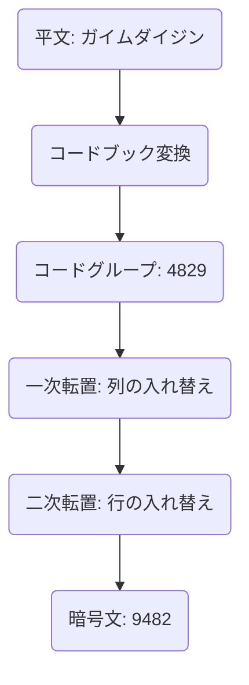
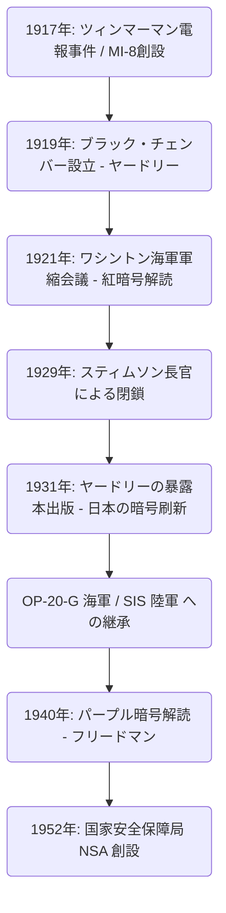

# 暗号解読機関「ブラック・チェンバー」の興亡：外交電報を盗み見破った男たちとアメリカ情報機関の黎明

国家の命運は、しばしば目に見えない暗号の文字列の中に隠されている。近代インテリジェンス（諜報）の歴史を紐解くとき、アメリカ合衆国が世界的な情報帝国へと成長する過程において、避けては通れない一つの伝説的な機関が存在する。それが「ブラック・チェンバー（The Black Chamber）」である。本稿では、第一次世界大戦の混乱の中から産声を上げ、ワシントン海軍軍縮会議で日本外交を丸裸にし、そして「道義」の名の下に葬り去られながらも、現代の国家安全保障局（NSA）へと至るインテリジェンスのDNAを残したこの秘密機関の興亡について、極めて詳細かつ多角的に論じていく。

---

## 第1章：第一次世界大戦と近代暗号解読の産声

### ツィンマーマン電報事件によるアメリカ参戦
暗号という技術は、人類が文字による通信を始めた古代から存在していた。しかし、それが単なる軍事戦術の枠を超え、国家戦略の根幹をなす要素として認識されるようになったのは、20世紀初頭の第一次世界大戦における劇的な出来事に端を発する。その象徴ともいえるのが、1917年の「ツィンマーマン電報事件」である。

1917年1月、ドイツ帝国の外務大臣アルトゥール・ツィンマーマンは、ワシントン経由でメキシコ駐在のドイツ大使に宛てて、驚愕の秘密電報を打電した。この電報は、当時中立を保っていたアメリカが連合国側として参戦した場合に備え、メキシコに対してドイツと同盟を結び、対米戦争へ参戦するよう促すものであった。その見返りとして、ドイツはメキシコにテキサス州、ニューメキシコ州、アリゾナ州の失地回復を約束していた。さらに、日本をもこの反米同盟に引き込むよう指示が含まれていた。

この電報は、イギリス海軍情報部の暗号解読専門部署「ルーム40（第25号室）」によって傍受・解読された。イギリス政府は、このインテリジェンスの暴露がアメリカの世論を激高させ、ウッドロウ・ウィルソン大統領を参戦へと決断させる決定的な打撃になると確信し、絶妙なタイミングでアメリカ政府に提供した。暗号解読が世界史の歯車を大きく回した瞬間である。

### 陸軍情報部MI-8の創設とヤードリーの野心
ツィンマーマン事件は、アメリカの軍部や政府高官に痛烈な教訓を与えた。自国の暗号が筒抜けになっている恐怖と、敵国の通信を解読できればどれほどの戦略的優位を得られるかという事実である。当時、アメリカには国家レベルの暗号解読機関が存在しなかった。この危機感から、1917年、陸軍情報部内に「MI-8（Military Intelligence, Section 8）」が創設された。

このMI-8の長として抜擢されたのが、国務省の若き電信技師、ハーバート・オズボーン・ヤードリー（Herbert Osborn Yardley）である。彼は元々、片田舎の電信局で働くオペレーターに過ぎなかったが、ポーカーで培った勝負勘と、暗号のパターンを直感的に見抜き、パズルを解くように規則性を暴き出す天才的な能力を持っていた。ヤードリーは強い上昇志向を持ち、ワシントンの国務省で交わされる暗号電報を暇つぶしに解読して上司たちを驚嘆させていたのである。

### 欧州の「黒室（Cabinet Noir）」の伝統
欧州には古くから「Cabinet Noir（黒室）」と呼ばれる、国家が通信を密かに検閲・解読する伝統的機関が存在していた。17世紀フランスの宰相リシュリューの下で活躍したアントワーヌ・ロシニョールや、イギリスのジョン・ウォリスなどがその先駆者であり、長年にわたり精緻な暗号解読のノウハウを蓄積していた。しかし、当時のアメリカにはそのような伝統は皆無であった。ヤードリーは全くのゼロから組織を構築しなければならなかった。彼は、数学者、言語学者、チェスの達人まで多様な才能を持つ人材を掻き集め、アメリカ初の本格的な暗号解読機関MI-8を立ち上げた。彼らは第一次世界大戦中、主にドイツ軍の野戦暗号や外交暗号の解読に挑み、目に見えない形で貢献することになる。

---

## 第2章：マンハッタンの秘密暗号局「ブラック・チェンバー」

### 偽装会社設立と秘密協定
1918年11月、第一次世界大戦は終結した。戦時体制の解除に伴い軍事情報機関は縮小され、MI-8も存続の危機に立たされた。しかし、インテリジェンスの価値を知り尽くしたヤードリーは、平時においても暗号解読機関が国家に不可欠であると強く主張した。彼は国務省と陸軍から秘密裏に共同予算（年間約10万ドル）を引き出すことに成功する。1919年、こうして誕生したのが、後に「ブラック・チェンバー（The Black Chamber）」と呼ばれるアメリカ初の平時秘密暗号局である。

活動の極度の秘匿性を保つため、拠点はワシントンから離れたニューヨークのマンハッタン、東37番街の目立たないタウンハウスに置かれた。表向きは「コード・コンピレーション・カンパニー（暗号編纂会社）」という民間企業を装い、商業用コードブックの販売を行っているように見せかけていた。

彼らの最大の武器は、アメリカ国内の巨大電信会社との秘密協定であった。ヤードリーは、ウエスタンユニオンの社長ニューコム・カールトンをはじめ、ポスタル・テレグラフなどの幹部たちを極秘裏に説得した。愛国心へのアピールと暗黙の圧力を交え、ワシントンに駐在する各国外交団が本国と交わす電報の写し（原紙）を、毎日のようにブラック・チェンバーへと横流しさせるシステムを構築したのである。これは明白な通信の秘密の侵害であり、アメリカ国内法に抵触する違法行為であったが、国家安全保障の大義名分の下、一切は闇に葬られた。

マンハッタンのタウンハウスでは、毎日届けられる大量の暗号電報の束を前に、解読官たちが日夜格闘を続けていた。彼らは30カ国以上の外交暗号を解読し、その内容を要約して国務省や陸軍の高官に届けていた。しかし、ヤードリーの最大のターゲットは、太平洋地域で勢力を拡大しつつあった大日本帝国の外交通信であった。日本の外交暗号は難解を極めたが、ヤードリーはこの要塞を陥落させることに異常な執念を燃やしたのである。

---

## 第3章：1921年ワシントン海軍軍縮会議の激突

### 主力艦保有比率5:5:3をめぐる死闘
第一次世界大戦後、莫大な戦費に苦しむ列強諸国は建艦競争に歯止めをかける必要に迫られていた。1921年11月から1922年2月にかけて開催された「ワシントン海軍軍縮会議」は、その最たる試みであった。

アメリカ国務長官チャールズ・エヴァンズ・ヒューズは、会議の冒頭で米英日の主力艦トン数比率を「5 : 5 : 3」にするという大胆な軍縮案を提示した。日本にとって、これは到底受け入れがたいものであった。日本海軍は長年、対米7割の海軍力が国防の絶対条件であると主張しており、対米6割（5:5:3）は安全保障を根本から脅かすとして強硬に反発した。全権大使である加藤友三郎（海軍大臣）と幣原喜重郎（駐米大使）は、激しい交渉を展開した。

### 紅暗号の解読と全漏洩
この外交交渉の裏側で、ブラック・チェンバーによる日本の外交暗号の徹底的な解読が行われていた。ヤードリーは、日本外務省の最高機密暗号、通称「紅暗号（Red Code）」の解読に総力を挙げていた。紅暗号は、暗号書（コードブック）と転置式暗号を組み合わせた非常に複雑なシステムであった。

ヤードリーの執念の分析により、日本の外交暗号の構造は丸裸にされた。ワシントン会議中、日本全権団と東京の外務省・海軍省との間で交わされる暗号電報は、その日のうちにブラック・チェンバーに届けられ、解読され、翌朝にはヒューズ国務長官のデスクの上に置かれていた。ヒューズは、日本の交渉団がどこまで譲歩するつもりなのか、手の内を全て知った上で交渉に臨むことができた。

1921年11月28日、東京の外務省から加藤友三郎宛てに決定的な訓令電報が打たれた。そこには、日本政府の最終的な妥協案が記されていた。初めは「対米7割」を強硬に主張するが、会議が決裂しそうな場合は、太平洋の島々の要塞化禁止などの条件付きで、最終防衛ラインとして「対米6割（5:5:3）」を受け入れるという内容であった。

### ヒューズ国務長官の勝利
ヒューズはこの解読情報を手に、交渉を冷酷に進めた。彼は日本が最終的に譲歩することを知っていたため、日本の7割要求に対して一切の妥協を見せず、毅然とした態度を貫いた。日本の交渉団はアメリカ側の異常な強気な態度に戸惑いながらも、情報が漏れているとは夢にも思わず、最終的には本国の指示通りに折れざるを得なかった。結果として、日本は「5 : 5 : 3」の比率を受け入れる。このワシントン海軍軍縮条約の締結はアメリカ外交の輝かしい大勝利と称賛されたが、その背後にはブラック・チェンバーのインテリジェンスが決定的な役割を果たしていたのである。

---

## 第4章：暗号解読の数学的・暗号学的技術

ブラック・チェンバーがいかにして複雑な暗号を解読していたのか、その技術的背景について詳述する。彼らが直面した暗号は、「コードブック」と「スーパーエンシファー（再暗号化）」を組み合わせた多層的な秘匿システムであった。

### 暗号史の変遷と暗号の構造解析
当時の日本外務省の通信は、平文をコードブックを用いて数桁の数字や文字の羅列（コードグループ）に置き換える。しかし、コードブックが盗まれたり統計分析されたりするリスクを防ぐため、「スーパーエンシファー」が行われた。日本側が用いたのは、コードグループの文字の順序を一定の規則に従って複雑に入れ替える「二重転置暗号（Double Transposition Cipher）」であった。

この二重転置を経た暗号文は、元のコードグループの面影を完全に失う。これを解読するには、転置のグリッド・サイズを特定し、行と列の入れ替え規則（鍵）を見破って元のコードグループを再構築（アナグラム）し、その意味を推測する必要があった。

### 頻度分析とカシス・テスト
ヤードリーの天才性は、転置グリッドの再構築手順にあった。彼は「頻度分析（Frequency Analysis）」を極限まで応用した。日本語をローマ字表記して暗号化している特性上、母音（a, i, u, e, o）の出現頻度は異常に高くなる。彼は暗号文全体の文字の出現頻度を統計的に分析し、特定の文字の組み合わせ（ダイグラフやトリグラフ、例えば「sh」「ts」など）が隣接する確率を計算し、切り離された列と列をジグソーパズルのようにつなぎ合わせた。

さらに「カシス・テスト（Kasiski examination）」も多用された。暗号文中に繰り返し出現する特定の文字列の間隔を測定し、その公約数から暗号鍵の長さ（グリッドの幅）を推定する手法である。これにより転置暗号の周期性を暴くことができた。

### 一致指数（Index of Coincidence）
ブラック・チェンバーの活動と並行して、アメリカのもう一人の暗号の天才、ウィリアム・フリードマン（William F. Friedman）によって、「一致指数（Index of Coincidence: I.C.）」という画期的な数学的ツールが定式化されつつあった。

これは、暗号文からランダムに2つの文字を選んだとき、それが全く同じ文字である確率を示すものである。フリードマンは、このI.C.を計算することで、暗号文が単一の鍵で暗号化されているのか、複数の鍵で暗号化されているのか、あるいは転置暗号なのかを、鍵の長さすら知らない段階で数学的に判定できることを証明した。ヤードリーの直感と経験による解読から、フリードマンの純粋な「数学的・統計学的アプローチ」への台頭は、暗号解読が「個人の天才」から「組織的な科学」へと進化していく過渡期を象徴していた。

---

## 第5章：終焉：「紳士は他人の手紙を読まない」

### スティムソンの道義的憤激
ワシントン会議での大成功にもかかわらず、ブラック・チェンバーの栄華は長くは続かなかった。その終焉は、外部の攻撃ではなく、アメリカ政府内部からの「道義的」な決定によってもたらされた。

1929年3月、ハーバート・フーヴァー大統領の政権下で、ヘンリー・L・スティムソン（Henry L. Stimson）が新たな国務長官に就任した。スティムソンは厳格なプロテスタントの倫理観を持つ理想主義者であった。彼は就任直後、国務省の予算使途を精査する中で、ブラック・チェンバーの存在と「外国公館の通信の違法傍受」という実態を知ることになる。

スティムソンは激怒した。彼にとって、同盟国や友好国の通信を盗み見る行為は、アメリカの外交の誇りを著しく汚す卑劣な裏切りであった。彼は即座に資金提供を打ち切ることを決定し、インテリジェンス史に永遠に刻まれる言葉を発した。

**「紳士は他人の手紙を読まない（Gentlemen do not read each other's mail.）」**

### 暴露本と世界的衝撃
最大のスポンサーを失ったブラック・チェンバーは資金難に陥り、1929年の世界大恐慌が追い打ちをかけた。同年10月31日、ブラック・チェンバーは正式に閉鎖され、解散を余儀なくされた。

大恐慌のどん底で失業したヤードリーは深刻な生活苦に直面した。愛国心は裏切られ、絶望に駆られた彼は、1931年に自らの経験を赤裸々に綴った暴露本『アメリカのブラック・チェンバー（The American Black Chamber）』を出版する。

この本は、アメリカが各国の外交暗号を解読していた実態、特にワシントン会議における日本の通信傍受の全貌を克明に暴露するものであった。世界的ベストセラーとなったこの本は、日本に甚大な衝撃を与えた。日本政府と軍部は、自国の最高機密暗号が筒抜けであった事実にパニックに陥り、直ちにすべての暗号システムを破棄した。そして、この暴露を教訓に、より高度な機械式暗号「九七式欧文印字機（パープル）」の開発を急ピッチで進めることになったのである。皮肉にもヤードリーの暴露が日本の暗号技術を飛躍的に進化させてしまった。

---

## 第6章：ブラック・チェンバーが遺したもの

### OP-20-GとSISへの継承
ブラック・チェンバーは非業の最期を遂げたが、彼らが蒔いたインテリジェンスの種は死え絶えなかった。そのノウハウと一部の人材は、アメリカ海軍の通信情報部「OP-20-G」へと密かに引き継がれた。OP-20-Gのジョセフ・ロシュフォートらは、数学的アプローチと機械的データ処理を導入し、1942年のミッドウェー海戦において日本海軍の暗号「JN-25」を解読、「AF（ミッドウェー）」を特定して歴史的勝利をもたらした。

一方、陸軍においては「シグナル・インテリジェンス・サービス（SIS）」が創設され、ウィリアム・フリードマンがこれを率いた。彼はヤードリーの属人的な直感に頼る手法を否定し、徹底した数学的・統計学的理論に基づく「科学的な暗号解読」の体系を確立した。

### パープル暗号解読からNSAへ
フリードマン率いるSISの最大の功績は、1940年、日本の最高機密である機械式暗号「パープル暗号」の完全解読に成功したことである。彼らは実物を見ることなく、論理的分析のみでステッピング・スイッチ機構の配線を推測し、複製機（マジック）を作り上げた。この情報「MAGIC」は第二次大戦の戦略決定に計り知れない価値を提供した。皮肉なことに、かつてブラック・チェンバーを閉鎖したスティムソンは陸軍長官として復帰し、今度はMAGICの熱烈な消費者となったのである。

戦後の1952年、冷戦の激化に伴い、アメリカ政府は暗号機関を統合し、巨大な電子情報機関「国家安全保障局（NSA）」を創設した。地球規模の通信網を監視し、スーパーコンピュータを駆使する現在のNSAの根底には、マンハッタンの小さなタウンハウスで、パズルを解くように暗号に挑んでいたヤードリーとブラック・チェンバーの男たちのDNAが確実に息づいている。

ブラック・チェンバーの興亡は、国家が「情報」という武器の絶対的な価値に気づき、現代のサイバー戦へと至るパンドラの箱を開けた、アメリカ情報機関の黎明期を告げる決定的なターニングポイントだったのである。

この歴史的軌跡は、インテリジェンスがもはや外交の付随物ではなく、国家の生存を左右する中核技術であることを冷徹に証明している。ヤードリーの情熱と野心、そしてブラック・チェンバーの暗躍は、今日の複雑な情報戦・サイバーセキュリティ社会を理解する上で、決して忘れてはならない原点であると言えよう。

## 補遺：ブラック・チェンバーを巡る深層的考察と技術的ディテール

本編で概観した歴史的経緯を踏まえ、ここではさらに学術的・実践的深みを加えるべく、暗号解読の現場における具体的な技術的困難、当時の国際政治におけるインテリジェンスの非対称性、そしてヤードリーという人物の複雑な精神構造について、より詳細な分析を加える。

### 1. 二重転置暗号（Double Transposition）の解読における実践的困難
前述の通り、日本外務省が用いていた紅暗号におけるスーパーエンシファー（再暗号化）は二重転置暗号であった。これを紙と鉛筆だけで解読するプロセスは、現代のコンピュータによる総当たり攻撃（ブルートフォース）とは全く異なる、高度な直感と論理的推論の組み合わせであった。

二重転置暗号を解読するための最初のステップは、「メッセージの正確な長さ」の把握である。例えば、暗号文が「35文字」であった場合、グリッドのサイズは「5×7」または「7×5」の可能性が高い。しかし、もし文字数が「37文字」のような素数であった場合、暗号化を行うオペレーターがダミー文字（ヌル）をいくつか追加して長方形を形成しているか、あるいは特定のマスを空白にして転置を行う「不完全長方形転置（Incomplete Columnar Transposition）」を用いている可能性がある。日本外務省はこの不完全長方形転置を頻繁に用いたため、解読は極めて困難であった。

ヤードリーらは、複数の同じ鍵で暗号化された長さの異なるメッセージ（これを「同位文」と呼ぶ）を大量に収集することから始めた。同位文を比較することで、グリッド内のどこに空白マスが配置されるかのパターンを見つけ出し、列の長さを特定することが可能になる。これを「マルチプル・アナグラミング（Multiple Anagramming）」と呼ぶ。

列の長さが特定できれば、次は母音の出現頻度に基づく列の並び替えである。例えば、ある列に「A」や「O」が多く含まれており、別の列に「K」や「S」が多く含まれている場合、これらを隣接させることで「KA」や「SO」といった日本語の音節（ローマ字）が復元できる可能性が高い。ヤードリーは、数千から数万に及ぶこのような音節のペアを統計的にスコアリングし、最も確率の高い列の組み合わせを導き出した。これは、巨大なルービックキューブを目隠しで揃えるような神業であり、数学的というよりは、言語の構造に対する深い洞察力に依存していた。

### 2. コードブック再構築の執念
転置のルール（鍵）を破ったとしても、それは単にランダムな文字列が「意味不明なコードグループ（数字や文字の塊）」に戻っただけである。次なる関門は、このコードグループがどの単語を意味しているかを推測し、暗号書そのものを白紙から再構築する作業であった。

これを可能にするのは「コンテキスト（文脈）」と「定型句」である。外交電報には、特有のフォーマットが存在する。冒頭には宛先や発信者、日付、そして「至急」や「機密」といった定型的な指示が含まれることが多い。また、特定の時期には特定の話題が頻繁に登場する。ワシントン会議の期間中であれば、「戦艦（Battleship）」「トン数（Tonnage）」「比率（Ratio）」「ヒューズ（Hughes）」といった単語が飛び交うことは容易に予想できた。

ヤードリーのチームは、これらの推測される単語（クリブ：Cribと呼ばれる）を暗号文に当てはめ、矛盾が生じないかを検証していった。例えば、「6832」というコードグループが「海軍」を意味すると仮定し、別の電報でそのコードグループが軍縮とは無関係な文脈で出現した場合、その仮定は誤りとして破棄される。こうして、一つ一つのコードグループに意味を与え、巨大な辞書をゼロから編纂していく作業が何年も続けられた。この再構築された暗号書の精緻さこそが、ブラック・チェンバーの真の財産であった。

### 3. インテリジェンスの非対称性と「紳士の協定」の限界
ワシントン会議において、アメリカが日本の暗号を解読していたという事実は、単に一国が有利に交渉を進めたという以上に、国際関係における「インテリジェンスの非対称性」の決定的な影響を示している。

当時の国際連盟を中心とする国際秩序は、「公開外交」と「条約に対する相互の信頼」を前提としていた。しかし、その裏側では、情報戦を制した者がルールメイキングの主導権を握るという冷酷な現実が存在した。日本は、アメリカが提唱する「軍縮」という理想主義的な枠組みに縛られながら、実は自国の妥協点という「底」を完全に把握された状態で交渉のテーブルに座らされていたのである。

この非対称性は、情報の価値がいかに物理的な軍事力（戦艦の隻数など）を凌駕し得るかを示している。もし日本が当時、自国の暗号が破られていることに気づき、逆に偽の情報を流す欺瞞工作（ディセプション）を行っていたならば、ワシントン体制の帰結は全く異なるものになっていたかもしれない。

ヘンリー・スティムソンがブラック・チェンバーを閉鎖した背景には、このような「裏のゲーム」が、彼が信奉する「法の支配に基づく国際秩序」を根底から腐敗させるという強い危惧があった。スティムソンの「紳士は他人の手紙を読まない」という言葉は、しばしばナイーブ（世間知らず）な理想主義として嘲笑されるが、それは当時のアメリカが目指そうとしていた「透明性の高い新しい外交のあり方」への強烈なコミットメントでもあった。しかし、歴史はスティムソンの理想主義ではなく、ヤードリーの現実主義（マキャヴェリズム）を選択することになる。

### 4. ハーバート・O・ヤードリーという人物像のアンビバレンス
ブラック・チェンバーの物語を語る上で、ヤードリーの特異なキャラクターは不可欠な要素である。彼は単なる優秀な暗号解読官ではなく、自己顕示欲と野心に満ちた複雑な人物であった。

彼は自らの能力に絶対的な自信を持っており、政府高官に対しても傲慢に振る舞うことがあった。ブラック・チェンバーがワシントン会議で成功を収めると、彼は自らを「アメリカを救った影の英雄」と見なし、より多くの予算と権限を要求した。しかし、インテリジェンス機関の本質は「影」であることだ。彼の自己顕示欲は、秘密裏に活動すべき情報機関のトップとしては致命的な欠陥であった。

スティムソンによる閉鎖宣告の後、ヤードリーが『アメリカのブラック・チェンバー』を出版した行為は、単なる生活苦からの金銭目的だけでなく、自分を冷遇した政府に対する痛烈な復讐であり、同時に自らの天才性を世間に知らしめたいという抑えがたい欲求の発露であった。

この暴露によって、彼はアメリカのインテリジェンス・コミュニティから永遠に追放された。第二次世界大戦中、アメリカ政府は暗号解読の専門家を喉から手が出るほど求めていたにもかかわらず、ヤードリーが公的な地位に就くことは二度と許されなかった。彼は中国に渡り国民党の暗号解読を支援したり、カナダ政府の暗号機関設立に協力したりしたが、かつてのような国家的プロジェクトの中心に返り咲くことはなかった。

ヤードリーは1958年に失意のうちに世を去るが、彼が遺したものはあまりにも大きい。彼は、インテリジェンス機関が国家においてどのような役割を果たすべきか、そしてそれが個人の野心や倫理とどのように衝突するのかという、現代に通じる根源的な問いを我々に投げかけているのである。彼を単なる「裏切り者」や「金銭目当ての暴露家」と切り捨てることは容易いが、アメリカのインテリジェンスの歴史において、ヤードリーほど強烈な光と影を放った人物は他にいない。

### 5. パープル暗号機解読への道程：アナログからデジタルへ
ヤードリーの暴露によって日本が暗号システムを刷新したことは、アメリカの暗号解読技術を次の次元へ強制的に進化させる結果となった。日本が導入した「九七式欧文印字機（パープル）」は、ヤードリーが得意としたような言語学的なアナグラムや頻度分析では決して解読できない、複雑な機械式暗号であった。

ここで登場したのが、ウィリアム・フリードマンと彼の率いるSIS（シグナル・インテリジェンス・サービス）である。フリードマンは、暗号解読を「個人の直感」から「数学と機械工学の融合」へと昇華させた。パープル暗号機は、複数のステッピング・スイッチ（電話交換機に使われるロータリースイッチ）を用いて、入力された文字を複雑な電気回路を通して別の文字に変換する。この回路の接続パターンは、キーボードを叩くたびに変化するため、暗号化のアルゴリズムは常に変動する。

SISのチーム（フランク・ローレットなどの優秀な数学者を含む）は、傍受した暗号文の中に存在する極めて微小な統計的偏りや、日本の外交官が犯した運用上のミス（同じ鍵設定で複数のメッセージを送るなど）を徹底的に数学的に分析した。彼らはパープル暗号機の実物を全く見ていないにもかかわらず、その機械の内部配線がどのように論理的に構築されているかを紙の上で完全に再現したのである。

このプロセスは、ヤードリーの時代の「パズル解き」とは根本的に異なるものであり、今日の暗号理論の基礎となる高度な数学的モデルの構築であった。フリードマンのチームがパープルのアナログ複製機「マジック」を完成させた時、それはヤードリー的な属人的暗号解読の終焉と、NSAに連なるテクノロジー主導のシグナル・インテリジェンス（SIGINT）時代の幕開けを告げるものであった。

### 結論
「ブラック・チェンバー」の物語は、国家と情報の関係史における劇的な第一幕である。ヤードリーの直感、スティムソンの道義、フリードマンの科学。これら三者の相克と進化の過程は、現代のサイバー空間における情報戦や、エドワード・スノーデン事件などで問われる「インテリジェンスと倫理」の問題に対する深い歴史的洞察を提供している。外交電報を盗み見破った男たちの執念は、形を変えながらも、現代国家の深奥で脈々と生き続けているのである。

### 6. 情報史学から見たブラック・チェンバーの現代的意義
歴史の大きな文脈において、ブラック・チェンバーが残した遺産は、単なる暗号解読技術の進化に留まらない。それは「情報（インテリジェンス）」が国家の独立した権力中枢として機能し始める、その萌芽であったと言える。

ヤードリーが築き上げたのは、軍事的・外交的な意思決定に対して、不可視のソースから得られた確固たる証拠（ハード・インテリジェンス）を提供するシステムであった。それまでの外交が、大使の報告や公開情報の分析（ソフト・インテリジェンス）に大きく依存していたのに対し、敵国の暗号通信の解読という行為は、相手の「偽りなき真意」を直接抽出することを可能にした。

現代の国家安全保障局（NSA）やイギリスの政府通信本部（GCHQ）といったシグナル・インテリジェンス機関は、その技術的基盤においてヤードリーの時代とは比較にならないほどの飛躍を遂げている。しかし、「通信の秘密を打破し、情報を兵器化する」というその本質的なミッションにおいて、彼らは依然としてヤードリーの描いた青写真の上を歩き続けている。ブラック・チェンバーの興亡史は、国家が自らの安全を守るためにどこまで倫理的境界線を越えるべきかという、21世紀においても未だに答えの出ない深遠なる命題を、私たちに突きつけ続けているのである。
