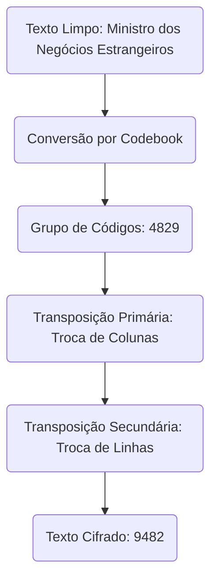
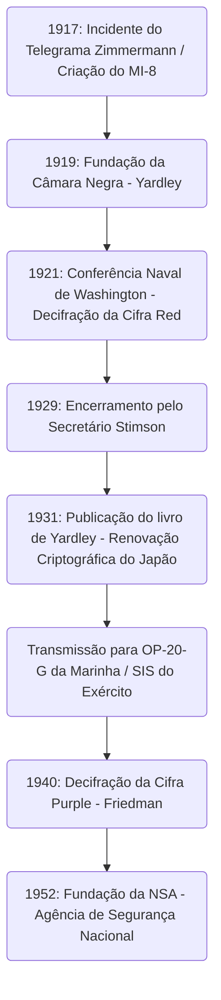

# A Ascensão e Queda da 'Câmara Negra': Os Homens que Intercetaram Telegramas Diplomáticos e o Alvorecer da Inteligência Americana

O destino de uma nação esconde-se, muitas vezes, em cordões invisíveis de caracteres cifrados. Ao desvendar a história da inteligência (espionagem) moderna, existe uma agência lendária que não pode ser ignorada no processo de crescimento dos Estados Unidos como um império global de inteligência. Trata-se da "Câmara Negra" (The Black Chamber). Neste artigo, discutiremos de forma extremamente detalhada e multifacetada a ascensão e queda desta agência secreta, que nasceu do caos da Primeira Guerra Mundial, deixou a diplomacia japonesa completamente exposta na Conferência Naval de Washington e, apesar de ter sido enterrada em nome da "moralidade", deixou o DNA de inteligência que levou à moderna Agência de Segurança Nacional (NSA).

---

## Capítulo 1: A Primeira Guerra Mundial e o Nascimento da Criptoanálise Moderna

### A Entrada dos EUA na Guerra Devido ao Incidente do Telegrama Zimmermann
A tecnologia da criptografia existe desde a antiguidade, quando a humanidade começou a comunicar através da escrita. No entanto, o seu reconhecimento não apenas como uma tática militar, mas como um elemento central da estratégia nacional, teve origem num evento dramático na Primeira Guerra Mundial, no início do século XX. O símbolo disto é o "Incidente do Telegrama Zimmermann" de 1917.

Em janeiro de 1917, o Ministro dos Negócios Estrangeiros do Império Alemão, Arthur Zimmermann, enviou um telegrama secreto chocante ao embaixador alemão no México, via Washington. O telegrama instava o México a aliar-se à Alemanha e a entrar na guerra contra os EUA, caso os Estados Unidos (que na altura se mantinham neutros) entrassem na guerra do lado dos Aliados. Em troca, a Alemanha prometia ao México a recuperação dos territórios perdidos do Texas, Novo México e Arizona. Além disso, incluía instruções para tentar atrair o Japão para esta aliança antiamericana.

Este telegrama foi intercetado e decifrado pela "Sala 40" (Room 40), o departamento especializado em criptoanálise da inteligência naval britânica. O governo britânico, convencido de que a revelação desta informação enfureceria a opinião pública americana e seria o golpe decisivo que levaria o Presidente Woodrow Wilson a declarar guerra, forneceu-a ao governo americano num momento perfeito. Foi o momento em que a quebra de códigos moveu as engrenagens da história mundial.

### A Criação do MI-8 da Inteligência do Exército e a Ambição de Yardley
O incidente Zimmermann deu uma dura lição aos militares e altos funcionários do governo americano. O medo de que os seus próprios códigos estivessem a ser intercetados e a constatação de quanta vantagem estratégica poderia ser obtida se conseguissem decifrar as comunicações inimigas. Na época, os EUA não tinham uma agência nacional de criptoanálise. Impulsionada por este sentido de crise, em 1917, foi criada a "MI-8" (Inteligência Militar, Secção 8) no seio da Divisão de Inteligência do Exército.

Herbert Osborn Yardley, um jovem telegrafista do Departamento de Estado, foi escolhido para chefiar o MI-8. Originalmente, ele não passava de um operador a trabalhar numa estação de telégrafo rural, mas possuía uma habilidade genial: intuição de jogo apurada no póquer e a capacidade de identificar intuitivamente os padrões dos códigos, revelando regularidades como se estivesse a resolver um puzzle. Yardley tinha uma forte ambição de ascensão e, para passar o tempo, surpreendia os seus superiores decifrando os telegramas cifrados trocados no Departamento de Estado em Washington.

### A Tradição da "Câmara Negra" (Cabinet Noir) na Europa
Na Europa, existia há muito uma instituição tradicional chamada "Cabinet Noir" (Câmara Negra), através da qual o Estado censurava e decifrava secretamente as comunicações. Antoine Rossignol, que trabalhou sob o comando do Cardeal Richelieu na França do século XVII, e John Wallis, em Inglaterra, foram os pioneiros e, durante muitos anos, acumularam um sofisticado conhecimento em criptoanálise. No entanto, não existia tal tradição nos Estados Unidos daquela época. Yardley teve de construir a organização totalmente do zero. Reuniu uma equipa de talentos diversos, incluindo matemáticos, linguistas e mestres de xadrez, e lançou a MI-8, a primeira verdadeira agência de criptoanálise americana. Durante a Primeira Guerra Mundial, eles contribuíram de forma invisível, concentrando-se principalmente na quebra das cifras de campo e dos códigos diplomáticos militares alemães.

---

## Capítulo 2: A Agência Criptográfica Secreta de Manhattan, a "Câmara Negra"

### O Estabelecimento da Empresa de Fachada e o Acordo Secreto
Em novembro de 1918, a Primeira Guerra Mundial terminou. Com o fim do estado de guerra, as agências de inteligência militar foram reduzidas, e a MI-8 também enfrentou o risco de sobrevivência. Contudo, Yardley, conhecendo intimamente o valor da inteligência, argumentou veementemente que uma agência de criptoanálise era indispensável para a nação mesmo em tempo de paz. Ele conseguiu assegurar secretamente um orçamento conjunto (cerca de 100.000 dólares anuais) do Departamento de Estado e do Exército. Foi assim que, em 1919, nasceu a primeira agência criptográfica secreta em tempo de paz dos EUA, mais tarde chamada "The Black Chamber" (Câmara Negra).

Para manter a operação sob extremo sigilo, a sua sede não ficou em Washington, mas num modesto sobrado na East 37th Street, em Manhattan, Nova Iorque. Sob a fachada de uma empresa privada chamada "Code Compilation Company" (Empresa de Compilação de Códigos), fingiam dedicar-se à venda de livros de códigos comerciais.

A sua maior arma era um acordo secreto com as grandes empresas de telégrafos nos Estados Unidos. Yardley persuadiu secretamente executivos, incluindo Newcomb Carlton, o presidente da Western Union, e dirigentes da Postal Telegraph. Combinando apelos ao patriotismo e pressão implícita, estabeleceu um sistema em que cópias dos telegramas (os originais) trocados entre as missões diplomáticas estrangeiras em Washington e os seus países de origem eram diariamente desviados para a Câmara Negra. Tratava-se de uma violação óbvia do sigilo das comunicações e um ato ilegal perante a lei dos EUA, mas sob o pretexto da segurança nacional, tudo foi mantido nas sombras.

No sobrado de Manhattan, perante maços e maços de telegramas cifrados entregues todos os dias, os criptoanalistas lutavam dia e noite. Eles decifravam os códigos diplomáticos de mais de 30 países, resumindo os seus conteúdos e entregando-os aos altos funcionários do Departamento de Estado e do Exército. No entanto, o maior alvo de Yardley eram as comunicações diplomáticas do Império do Japão, que estava a expandir o seu poder na região do Pacífico. O código diplomático japonês era extremamente difícil, mas Yardley ardia de uma obsessão anormal para derrubar esta fortaleza.

---

## Capítulo 3: O Confronto na Conferência Naval de Washington de 1921

### A Luta de Morte Pela Proporção de Forças Navais 5:5:3
Após a Primeira Guerra Mundial, as grandes potências, sofrendo com enormes despesas militares, precisavam de travar a corrida armamentista naval. A "Conferência Naval de Washington", realizada entre novembro de 1921 e fevereiro de 1922, foi a principal tentativa nesse sentido.

O Secretário de Estado dos EUA, Charles Evans Hughes, apresentou no início da conferência uma proposta ousada de desarmamento, definindo a proporção de tonelagem de navios capitais entre os EUA, a Grã-Bretanha e o Japão em "5 : 5 : 3". Para o Japão, isto era completamente inaceitável. A Marinha Japonesa insistia há muito tempo que manter a força naval em 70% da dos EUA era uma condição absoluta de defesa nacional, e opôs-se ferozmente à proporção de 60% (5:5:3), alegando que ameaçava fundamentalmente a segurança do país. O embaixador plenipotenciário Tomosaburo Kato (Ministro da Marinha) e Kijuro Shidehara (Embaixador nos EUA) conduziram negociações intensas.

### A Decifração da Cifra "Red" e a Fuga Total de Informação
Nos bastidores desta negociação diplomática, a Câmara Negra estava a realizar uma decifração exaustiva da diplomacia japonesa. Yardley dedicou todos os seus esforços para quebrar o código ultra-secreto do Ministério dos Negócios Estrangeiros japonês, conhecido como "Red Code" (Código Vermelho). A cifra Red era um sistema altamente complexo que combinava um livro de códigos (codebook) com cifras de transposição.

Devido à análise obsessiva de Yardley, a estrutura dos códigos diplomáticos japoneses foi completamente exposta. Durante a Conferência de Washington, os telegramas cifrados trocados entre a delegação japonesa e o Ministério dos Negócios Estrangeiros e da Marinha em Tóquio eram entregues à Câmara Negra no mesmo dia, decifrados, e colocados na secretária do Secretário de Estado Hughes na manhã seguinte. Hughes conseguiu ir para as negociações sabendo exatamente até onde a delegação japonesa estava disposta a ceder e conhecendo todas as suas cartas.

A 28 de novembro de 1921, foi enviado de Tóquio um telegrama de instruções decisivas ao embaixador Kato. Nele constava a proposta final de compromisso do governo japonês. Dizia que, embora devessem insistir vigorosamente em "70% face aos EUA", caso a conferência ameaçasse entrar em colapso, deveriam aceitar como última linha de defesa os "60% (5:5:3)" sob a condição de não se fortificarem as ilhas do Pacífico.

### A Vitória do Secretário Hughes
Armado com esta informação decifrada, Hughes conduziu as negociações implacavelmente. Como sabia que o Japão iria acabar por ceder, manteve uma atitude firme, não mostrando qualquer compromisso face à exigência japonesa dos 70%. Embora a delegação japonesa estivesse confusa com a atitude americana extraordinariamente confiante, nunca sonhou que a informação estivesse a vazar e, no final, não teve outra escolha senão ceder, de acordo com as instruções de Tóquio. Como resultado, o Japão aceitou o rácio "5 : 5 : 3". A conclusão deste Tratado Naval de Washington foi elogiada como uma grande e gloriosa vitória diplomática americana, mas por trás dela, a inteligência da Câmara Negra desempenhou um papel decisivo.

---

## Capítulo 4: A Tecnologia Matemática e Criptográfica da Quebra de Códigos

Detalharemos o contexto técnico de como a Câmara Negra decifrava códigos tão complexos. O código que enfrentavam era um sistema de ocultação multicamada que combinava um "codebook" (livro de códigos) com uma "supercifragem" (recifragem).

### A Evolução da História da Criptografia e a Análise Estrutural da Cifra
As comunicações do Ministério dos Negócios Estrangeiros do Japão da época usavam um codebook para substituir o texto em claro por séries de números e letras de vários dígitos (grupos de códigos). Contudo, para prevenir o risco de o codebook ser roubado ou analisado estatisticamente, era aplicada uma "supercifragem". O lado japonês usava a "Cifra de Transposição Dupla" (Double Transposition Cipher), onde a ordem dos caracteres do grupo de código era baralhada de forma complexa de acordo com regras específicas.

O texto cifrado que passava por esta transposição dupla perdia completamente a semelhança com o grupo de códigos original. Para o decifrar, era necessário identificar o tamanho da grelha de transposição, descobrir as regras de troca de linhas e colunas (a chave) para reconstruir o grupo de códigos original (anagramar) e adivinhar o seu significado.

### A Análise de Frequência e o Teste Kasiski
A genialidade de Yardley residia no seu método de reconstrução da grelha de transposição. Ele levou a "Análise de Frequência" (Frequency Analysis) ao limite. Devido à característica de se cifrar o japonês escrito em romaji (alfabeto latino), a frequência de aparecimento das vogais (a, i, u, e, o) torna-se anormalmente alta. Analisou estatisticamente a frequência das letras em todo o texto cifrado, calculou a probabilidade de certas combinações de letras serem adjacentes (dígrafos ou trígrafos, por exemplo, "sh" ou "ts") e foi unindo colunas isoladas como se fossem um puzzle.

Além disso, o "Teste Kasiski" (Kasiski examination) também foi muito utilizado. Trata-se de um método em que se mede a distância entre sequências de caracteres que aparecem repetidamente no texto cifrado e, a partir dos seus divisores comuns, estima-se o comprimento da chave (a largura da grelha). Isto permitiu desvendar a periodicidade da cifra de transposição.

### O Índice de Coincidência (Index of Coincidence)
Paralelamente à atividade da Câmara Negra, um outro génio criptográfico americano, William F. Friedman, estava a formular uma ferramenta matemática revolucionária chamada "Índice de Coincidência" (Index of Coincidence: I.C.).

Esta ferramenta indica a probabilidade de que, ao escolherem-se aleatoriamente dois caracteres num texto cifrado, eles sejam exatamente a mesma letra. Friedman provou que, através do cálculo deste I.C., era possível determinar matematicamente se o texto tinha sido cifrado com uma chave única, com múltiplas chaves ou através de transposição, mesmo sem saber o comprimento da chave. O surgimento da abordagem puramente "matemática e estatística" de Friedman, afastando-se da criptoanálise baseada na intuição e experiência de Yardley, simbolizou a fase de transição em que a criptoanálise evoluía do "génio individual" para a "ciência organizada".

---

## Capítulo 5: O Fim: "Cavalheiros não leem o correio uns dos outros"

### A Indignação Moral de Stimson
Apesar do seu enorme sucesso na Conferência de Washington, a glória da Câmara Negra não durou muito. O seu fim não foi provocado por um ataque externo, mas por uma decisão "moral" interna do governo americano.

Em março de 1929, sob a administração do Presidente Herbert Hoover, Henry L. Stimson assumiu o cargo de Secretário de Estado. Stimson era um idealista com rigorosos valores éticos protestantes. Imediatamente após tomar posse, ao analisar as despesas orçamentais do Departamento de Estado, tomou conhecimento da existência da Câmara Negra e da realidade da "interceção ilegal de comunicações de missões diplomáticas estrangeiras".

Stimson ficou furioso. Para ele, intercetar as comunicações das nações aliadas ou amigas era uma traição vil que manchava gravemente o orgulho da diplomacia americana. Ele decidiu cortar o financiamento imediatamente e proferiu uma frase que ficaria gravada para sempre na história da inteligência:

**"Cavalheiros não leem o correio uns dos outros" (Gentlemen do not read each other's mail.)**

### O Livro de Revelações e o Impacto Global
Privada do seu maior patrocinador, a Câmara Negra deparou-se com dificuldades financeiras e o golpe final veio com a Grande Depressão em 1929. Em 31 de outubro de 1929, a Câmara Negra foi formalmente fechada e forçada a dissolver-se.

Desempregado nas profundezas da Depressão, Yardley enfrentou graves dificuldades financeiras. O seu patriotismo fora traído e, movido pelo desespero, publicou em 1931 um livro explosivo intitulado "The American Black Chamber" (A Câmara Negra Americana), que expunha abertamente as suas experiências.

Este livro expôs exaustivamente como os EUA tinham estado a ler os códigos diplomáticos de vários países e, em particular, detalhou toda a operação de interceção das comunicações japonesas na Conferência de Washington. O livro, que se tornou um best-seller internacional, causou um tremendo choque no Japão. O governo e as forças armadas japonesas entraram em pânico ao saber que os seus códigos ultra-secretos eram de conhecimento público e destruíram imediatamente todos os seus sistemas de criptografia. Usando esta revelação como lição, aceleraram rapidamente o desenvolvimento de uma máquina de encriptação mais avançada, a "Máquina de Cifragem Tipo 97 (Purple)". Ironicamente, as revelações de Yardley fizeram a tecnologia criptográfica do Japão avançar a passos largos.

---

## Capítulo 6: O Legado da Câmara Negra

### O Legado para a OP-20-G e para o SIS
A Câmara Negra teve um fim trágico, mas a semente da inteligência que plantaram não morreu. Os seus conhecimentos e algum pessoal foram discretamente absorvidos pela divisão de inteligência de comunicações da Marinha dos EUA, a "OP-20-G". Homens como Joseph Rochefort, da OP-20-G, introduziram abordagens matemáticas e processamento mecânico de dados e, durante a Batalha de Midway em 1942, conseguiram decifrar o código "JN-25" da Marinha Japonesa, identificando o "AF (Midway)" e garantindo uma vitória histórica.

Entretanto, no Exército, foi criado o "Serviço de Inteligência de Sinais" (SIS), liderado por William Friedman. Ele rejeitou os métodos de Yardley, que dependiam da intuição individual, e estabeleceu um sistema de "criptoanálise científica" baseado estritamente em teorias matemáticas e estatísticas.

### Da Decifração da Cifra Purple à NSA
O maior feito do SIS, liderado por Friedman, foi a decifração completa e com sucesso, em 1940, da máquina de encriptação ultra-secreta japonesa, a "cifra Purple". Sem nunca terem visto a máquina verdadeira, eles deduziram as ligações elétricas do mecanismo de interruptores de passos usando apenas análise lógica e construíram uma máquina de clonagem (a Magic). Esta inteligência, apelidada de "MAGIC", ofereceu um valor incalculável para as decisões estratégicas durante a Segunda Guerra Mundial. Ironicamente, Stimson, que outrora encerrara a Câmara Negra, regressou como Secretário da Guerra e tornou-se um fervoroso consumidor da MAGIC.

No período pós-guerra, em 1952, com o agravamento da Guerra Fria, o governo americano fundiu as agências de inteligência criptográfica e fundou a gigante "Agência de Segurança Nacional (NSA)". Na essência da NSA atual, que monitoriza redes de comunicação à escala global e opera supercomputadores, vive certamente o DNA de Yardley e dos homens da Câmara Negra, que desafiavam os códigos como quem resolve um quebra-cabeças no pequeno sobrado em Manhattan.

A ascensão e queda da Câmara Negra constituiu um ponto de viragem decisivo que marcou o início da inteligência americana, abrindo a Caixa de Pandora onde as nações perceberam o valor absoluto da "informação" como arma, num caminho que conduziria à moderna guerra cibernética.

Esta trajetória histórica prova de forma fria que a inteligência já não é um mero apêndice da diplomacia, mas a tecnologia central que dita a sobrevivência da nação. A paixão e ambição de Yardley, bem como as atividades nos bastidores da Câmara Negra, são pontos de origem inesquecíveis para compreender a complexa sociedade atual de guerra de informação e cibersegurança.

## Apêndice: Reflexões Profundas e Detalhes Técnicos sobre a Câmara Negra

Com base no contexto histórico revisto nos capítulos anteriores, faremos uma análise mais detalhada para adicionar profundidade académica e prática, focando nas dificuldades técnicas específicas no terreno da criptoanálise, na assimetria da inteligência na política internacional da época, e na complexa estrutura mental do homem chamado Yardley.

### 1. As Dificuldades Práticas na Decifração da Cifra de Transposição Dupla (Double Transposition)
Como mencionado anteriormente, a supercifragem (recifragem) no código Red usado pelo Ministério dos Negócios Estrangeiros japonês consistia numa transposição dupla. O processo para a decifrar utilizando apenas papel e lápis era uma combinação de intuição e raciocínio lógico avançado, completamente diferente dos ataques de força bruta (brute force) efetuados pelos computadores modernos.

O primeiro passo para quebrar uma transposição dupla é apurar o "comprimento exato da mensagem". Por exemplo, se o texto cifrado tiver "35 letras", o tamanho da grelha é muito provavelmente de "5x7" ou "7x5". Contudo, se a contagem de caracteres fosse um número primo, como "37", havia a possibilidade de o operador adicionar caracteres falsos (nulos) para formar um retângulo, ou deixar certos espaços em branco para criar uma "Transposição de Coluna Incompleta" (Incomplete Columnar Transposition). Como o Ministério dos Negócios Estrangeiros do Japão utilizava frequentemente esta transposição incompleta, a decifração era extraordinariamente difícil.

Yardley e a sua equipa começaram por compilar um grande volume de mensagens de diferentes comprimentos, todas cifradas com a mesma chave (conhecidas como mensagens isotópicas). Ao comparar estas mensagens, tornou-se possível descobrir o padrão do local da grelha onde estariam os espaços em branco e identificar o comprimento da coluna. Este processo chama-se "Múltiplos Anagramas" (Multiple Anagramming).

Uma vez identificado o comprimento das colunas, o próximo passo seria reordená-las com base na frequência das vogais. Se uma coluna contivesse muitas letras "A" ou "O" e a seguinte tivesse muitas "K" ou "S", havia uma forte possibilidade de as juntar e recriar sílabas japonesas (romaji) como "KA" ou "SO". Yardley atribuiu, de forma estatística, pontuações a milhares ou dezenas de milhares de pares destas sílabas para derivar as combinações de colunas de maior probabilidade. Foi uma proeza quase divina semelhante a montar um Cubo de Rubik gigantesco às cegas, dependendo mais do seu conhecimento profundo da estrutura da língua do que da matemática.

### 2. A Obsessão na Reconstrução do Livro de Códigos
Mesmo que as regras de transposição (a chave) fossem quebradas, a única coisa que era devolvida seria uma cadeia aleatória que voltava aos "grupos de códigos sem sentido (blocos de números ou letras)". O obstáculo seguinte era adivinhar o que aqueles grupos de códigos queriam dizer e recriar o livro de códigos a partir do zero.

Isto era possibilitado pelo "contexto" e pelas "frases feitas". Os telegramas diplomáticos têm formatos característicos. No início, incluem quase sempre o remetente e o destinatário, a data e instruções comuns como "urgente" ou "confidencial". Em certas épocas, tópicos muito específicos eram discutidos com frequência. Durante a Conferência de Washington, era fácil adivinhar que palavras como "Couraçado" (Battleship), "Tonelagem" (Tonnage), "Proporção" (Ratio) e "Hughes" poderiam aparecer repetidamente.

A equipa de Yardley ia testando a aplicação destas palavras previstas (conhecidas como Cribs) no texto cifrado e verificava se surgiam contradições. Por exemplo, se eles assumissem que o grupo de código "6832" queria dizer "marinha" e esse grupo aparecesse noutro telegrama num contexto totalmente alheio ao desarmamento, a presunção seria descartada como errada. Assim, ano após ano, continuou o trabalho hercúleo de dar significado a cada código e compilar um gigantesco dicionário do zero. O grau de precisão deste livro de códigos reconstruído era a verdadeira riqueza da Câmara Negra.

### 3. A Assimetria da Inteligência e os Limites dos "Acordos de Cavalheiros"
O facto de os EUA estarem a descodificar os telegramas japoneses na Conferência de Washington mostra o papel decisivo da "assimetria da inteligência" nas relações internacionais, revelando muito mais do que a mera vantagem de uma nação numa mesa de negociação.

A ordem internacional do momento, construída à volta da Liga das Nações, baseava-se na premissa da "diplomacia aberta" e na "confiança mútua sobre tratados". Nos bastidores, no entanto, reinava a realidade implacável de que aquele que ganhava as guerras de informação exerceria o poder nas regras. O Japão estava constrangido pelo modelo idealista americano de "desarmamento" e, por outro lado, encontrava-se sentado à mesa das negociações sem o seu "ponto de limite" (o seu limite mínimo tolerado) sabendo perfeitamente o adversário das suas condições absolutas.

Esta assimetria indica até que ponto o valor da informação pode transcender o mero poderio militar (como o número de navios de guerra). Se, na altura, o Japão se tivesse apercebido de que os seus códigos estavam a ser descobertos e tivesse implementado operações para transmitir informações falsas e enganadoras (disfarce e distração), o resultado do sistema de Washington teria sido totalmente diferente.

A razão pela qual Henry Stimson encerrou a Câmara Negra decorre de um receio persistente de que os "jogos de bastidores" minariam os alicerces da "ordem internacional assente no Estado de Direito", em que ele piamente acreditava. O ditado "Cavalheiros não leem o correio uns dos outros" de Stimson é frequentemente ridicularizado como um idealismo ingénuo. Contudo, consistia no firme compromisso que o país pretendia assumir para criar "uma diplomacia com alto padrão de transparência". Mas a história não acabou por eleger o idealismo de Stimson, e sim o realismo e maquiavelismo de Yardley.

### 4. A Ambivalência da Figura de Herbert O. Yardley
Na narrativa em torno da Câmara Negra, a figura singular de Yardley é essencial. Ele não era meramente um funcionário decifrador de elite; possuía uma personalidade conflituosa, movida pela sua necessidade de afirmação e pela sua ambição ardente.

Tinha uma confiança inabalável nas suas próprias capacidades e, frequentemente, mostrava uma atitude arrogante perante altos funcionários do Estado. Quando a Câmara Negra provou o seu êxito na Conferência de Washington, considerou-se a si próprio um "herói da sombra que salvou a América" e solicitou mais orçamentos e mais competências. Mas o coração e a essência da Inteligência é residir na "Sombra". A sua imensa auto-exaltação era uma vulnerabilidade irremediável para quem deveria estar encarregado das mais secretas operações governamentais.

Depois de Stimson ter anunciado o fecho dos serviços, o ato de Yardley escrever "The American Black Chamber" proveio não só das suas aflições por se encontrar desesperadamente arruinado e sem sustento material, como constituiu também uma incisiva manifestação vingativa. Desejava que todos percebessem em definitivo a dimensão brutal da sua própria genialidade num impulso desmesuradamente impossível de calar.

Esta denúncia, no entanto, excluiu-o para sempre das comunidades informativas americanas. Durante a Segunda Guerra Mundial, em que o governo americano tentava por tudo mobilizar peritos especializados nestas artes criptológicas de interceção e quebra, foi-lhe terminantemente vedado exercer qualquer posto de chefia nacional perante os oficiais e agentes. Foi para a China onde apoiou as forças nacionalistas nas artes descodificadoras da época, prestando serviços para o desenvolvimento das mesmas técnicas criptográficas aos canadianos. Porém, nunca voltaria para a ribalta governamental nos projetos vitais do Estado Americano.

Yardley morreu no ano de 1958 perante frustrações permanentes. Mas, apesar de tudo, o valor do que deixou é absolutamente titânico. Yardley colocou questões primárias até hoje ainda pertinentes, abordando de que forma uma organização destas artes secretas se comporta face a confrontações na personalidade de quem governa, face a pressões patrióticas em choque com princípios humanitários de base governamental. Se pretendermos condenar esta postura apenas pelo cunho mercantil de vingança de publicações pagas - pode tornar-se em perspetiva simples de apuramento para crítica literária- porém a imagem histórica resplandecente, misturada de brilhantez fulgurante nos primórdios desta facção nacional, e por igual, de total negritude sombria na trajetória desta comunidade não haveria existido em personagem comparável a Yardley em mais nenhuns tempos das crónicas americanas.

### 5. O Caminho para a Quebra da Máquina de Cifra Purple: Do Analógico ao Digital
A renovação do sistema criptográfico do Japão impulsionada pelas revelações de Yardley, levou a tecnologia americana criptográfica, pela força, à evolução num prisma subsequente. A máquina implementada no sistema nacional ("A Máquina de Cifragem Tipo 97 (Purple)"), nunca iria conseguir sucumbir num registo da criptografia assente nas técnicas puramente de decifração por anagrama ou por estudos fonéticos e linguísticos em que Yardley sobressaía - era sim, uma máquina puramente criptográfica complexa e com sistema em engenho mecânico.

Aí surgiu a necessidade efetiva, de William Friedman e de sua equipa no SIS (Serviço de Inteligência de Sinais). Ele providenciou aos peritos uma transição assente "na fusão puramente por sistema de máquina matemática perante a componente de engenharia no raciocínio das peças" alterando a dimensão individual nas conclusões, para puras respostas exatas no processamento sistémico desta ciência na codificação oculta. A Purple empregava dispositivos chamados de interruptores de passos num sistema telefónico da época operadas em switches e rotações em botões mecânicos e fios elétricos variados convertendo ligações noutras matrizes, mudando combinações variadas assim que num simples botão da própria tecla era feito qualquer registo, tornando a codificação altamente volátil.

A equipa do SIS (incluindo matemáticos brilhantes como Frank Rowlett) analisou os minúsculos vieses estatísticos nos textos cifrados intercetados, bem como os erros operacionais cometidos pelos diplomatas japoneses (como enviar várias mensagens com a mesma chave), usando uma abordagem matemática rigorosa. Sem nunca terem visto a máquina Purple real, eles conseguiram recriar logicamente e de forma perfeita como o seu cabeamento interno estava construído, através da teoria no papel.

Este processo foi fundamentalmente distinto da "resolução de quebra-cabeças" da época de Yardley, constituindo a construção de modelos matemáticos avançados que são a base da teoria criptográfica de hoje. Quando a equipa de Friedman completou a máquina de replicação analógica da Purple, "Magic", isso marcou o fim da criptoanálise baseada em talentos individuais ao estilo de Yardley, anunciando o alvorecer da era da Inteligência de Sinais (SIGINT) impulsionada pela tecnologia que continua na NSA.

### Conclusão
A história da "Câmara Negra" é o dramático primeiro ato na história das relações entre o Estado e a Informação. A intuição de Yardley, a moralidade de Stimson e a ciência de Friedman. O conflito e a evolução destas três forças oferecem uma visão histórica profunda para a guerra de informação moderna no ciberespaço e para a questão de "Inteligência e Ética", como levantado em eventos como o caso Edward Snowden. A perseverança dos homens que intercetaram e decifraram os telegramas diplomáticos continua a viver, de diferentes formas, no âmago dos Estados modernos.

### 6. O Significado Moderno da Câmara Negra do Ponto de Vista da História da Informação
Dentro do grande contexto histórico, o legado deixado pela Câmara Negra não se limita apenas à evolução da tecnologia de criptoanálise. Pode dizer-se que foi o início onde a "Inteligência" começou a funcionar como um centro de poder independente do Estado.

O que Yardley construiu foi um sistema que fornecia evidências incontestáveis (Hard Intelligence) obtidas a partir de fontes invisíveis para as tomadas de decisão militares e diplomáticas. Enquanto a diplomacia anterior dependia fortemente dos relatórios dos embaixadores e da análise de informações públicas (Soft Intelligence), o ato de decifrar as comunicações cifradas do inimigo tornou possível extrair diretamente as suas "verdadeiras e incontestáveis intenções".

Embora instituições modernas de Inteligência de Sinais, como a Agência de Segurança Nacional dos EUA (NSA) e o Quartel-General de Comunicações do Governo Britânico (GCHQ), tenham dado saltos gigantescos nas suas bases tecnológicas em comparação com a era de Yardley, no que diz respeito à sua missão essencial de "quebrar o sigilo das comunicações e usar a informação como arma", elas ainda continuam a caminhar sobre a planta desenhada por Yardley. A história da ascensão e queda da Câmara Negra continua a confrontar-nos no século XXI com uma questão profunda ainda sem resposta: até onde deve o Estado ultrapassar as fronteiras éticas para garantir a sua própria segurança e proteção.
