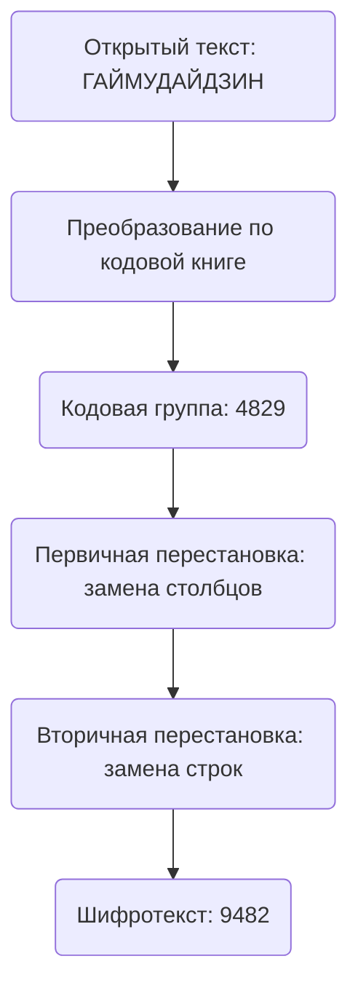
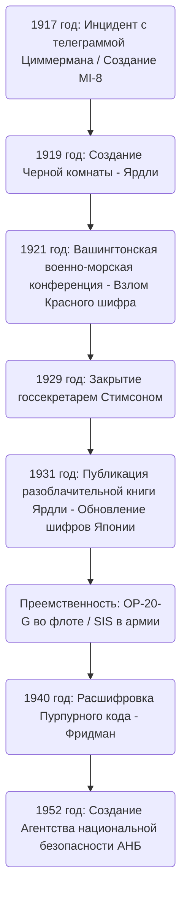

# Взлет и падение криптографического бюро «Черная комната»: люди, которые читали чужие дипломатические телеграммы, и зарождение американской разведки

Судьба нации часто скрыта в невидимых строках зашифрованных сообщений. Обращаясь к истории современной разведки (интеллидженс), невозможно обойти стороной одно легендарное учреждение в процессе становления Соединенных Штатов как глобальной информационной империи. Это «Черная комната» (The Black Chamber). В этой статье мы подробно и многосторонне рассмотрим взлет и падение этой секретной организации, которая родилась из хаоса Первой мировой войны, полностью разоблачила японскую дипломатию на Вашингтонской военно-морской конференции, была уничтожена во имя «морали», но оставила после себя ДНК разведки, которая в итоге привела к созданию современного Агентства национальной безопасности (АНБ).

---

## Глава 1: Первая мировая война и зарождение современного криптоанализа

### Вступление Америки в войну из-за Телеграммы Циммермана
Искусство криптографии существовало с древних времен, когда человечество начало общаться посредством письма. Однако осознание того, что криптография вышла за рамки простой военной тактики и стала фундаментальным элементом национальной стратегии, началось с драматического события во время Первой мировой войны в начале 20-го века. Символом этого стал инцидент с «Телеграммой Циммермана» в 1917 году.

В январе 1917 года министр иностранных дел Германской империи Артур Циммерман отправил ошеломляющую секретную телеграмму немецкому послу в Мексике через Вашингтон. Эта телеграмма призывала Мексику заключить союз с Германией и вступить в войну против Соединенных Штатов на тот случай, если США, сохранявшие в то время нейтралитет, вступят в войну на стороне союзников. Взамен Германия обещала Мексике вернуть утраченные территории: Техас, Нью-Мексико и Аризону. Более того, в телеграмму входило указание вовлечь в этот антиамериканский альянс и Японию.

Эта телеграмма была перехвачена и расшифрована подразделением военно-морской разведки Великобритании, специализирующимся на криптоанализе, «Комнатой 40». Британское правительство, убежденное, что раскрытие этой информации приведет в ярость американскую общественность и станет решающим ударом, который подтолкнет президента Вудро Вильсона к решению вступить в войну, передало ее американскому правительству в идеальный момент. Это был момент, когда криптоанализ существенно повернул шестеренки мировой истории.

### Создание подразделения военной разведки MI-8 и амбиции Ярдли
Инцидент с Циммерманом стал горьким уроком для американских военных и правительственных чиновников. Это был ужас осознания того, что их собственные шифры полностью раскрыты, и понимание того, какое огромное стратегическое преимущество можно получить, если удастся расшифровывать сообщения врага. В то время в США не было агентства по взлому кодов на национальном уровне. Под влиянием этого чувства кризиса в 1917 году в рамках отдела военной разведки было создано подразделение «MI-8» (Военная разведка, Секция 8).

На должность руководителя MI-8 был назначен молодой телеграфист из Государственного департамента Герберт Осборн Ярдли (Herbert Osborn Yardley). Изначально он был всего лишь оператором, работающим в сельской телеграфной конторе, но обладал гениальной способностью интуитивно распознавать закономерности в шифрах и раскрывать правила так же, как он разгадывал головоломки, благодаря интуиции игрока, отточенной в покер. У Ярдли были сильные амбиции; от скуки он расшифровывал телеграммы, которыми обменивались в Государственном департаменте в Вашингтоне, и поражал свое начальство.

### Традиция европейского «Черного кабинета» (Cabinet Noir)
В Европе издавна существовала традиция учреждений, называемых «Cabinet Noir» (Черный кабинет), где государства тайно подвергали цензуре и расшифровывали сообщения. Антуан Россиньоль, работавший при кардинале Ришелье во Франции 17-го века, и англичанин Джон Уоллис были среди пионеров, которые на протяжении многих лет накапливали сложные ноу-хау в криптоанализе. Однако в то время в США таких традиций не существовало. Ярдли пришлось строить организацию с нуля. Он собрал людей с различными талантами, от математиков и лингвистов до мастеров шахмат, и основал первое полноценное американское агентство по криптоанализу, MI-8. Во время Первой мировой войны они в основном занимались расшифровкой немецких полевых и дипломатических шифров, внося свой невидимый вклад.

---

## Глава 2: Секретное криптографическое бюро на Манхэттене «Черная комната»

### Создание фиктивной компании и секретные соглашения
В ноябре 1918 года закончилась Первая мировая война. С отменой военного положения органы военной разведки были сокращены, и MI-8 оказалась под угрозой ликвидации. Однако Ярдли, который прекрасно понимал ценность разведки, решительно утверждал, что криптографическое бюро необходимо государству даже в мирное время. Ему удалось тайно получить совместный бюджет (около 100 000 долларов в год) от Государственного департамента и армии. Таким образом, в 1919 году было создано первое американское секретное криптографическое бюро мирного времени, которое позже стало известно как «Черная комната» (The Black Chamber).

Для сохранения абсолютной секретности деятельности база была расположена вдали от Вашингтона — в неприметном таунхаусе на 37-й Восточной улице на Манхэттене в Нью-Йорке. Для отвода глаз они маскировались под частную компанию под названием «Code Compilation Company» («Компания по составлению кодов»), якобы занимающуюся продажей коммерческих кодовых книг.

Их главным оружием стали секретные соглашения с гигантскими телеграфными компаниями в США. Ярдли тайно убедил руководителей, в том числе президента Western Union Ньюкомба Карлтона, и представителей Postal Telegraph. Сочетая призывы к патриотизму и негласное давление, он создал систему, при которой копии (оригиналы) телеграмм, которыми обменивались дипломатические миссии, размещенные в Вашингтоне, и их правительства, ежедневно нелегально передавались в «Черную комнату». Это было явным нарушением тайны связи и незаконным актом, нарушавшим внутреннее законодательство США, но под предлогом национальной безопасности все это скрывалось во мраке.

В таунхаусе на Манхэттене криптоаналитики днем и ночью боролись с пачками зашифрованных телеграмм, доставляемых каждый день. Они расшифровывали дипломатические шифры более чем 30 стран и доставляли их краткое содержание высокопоставленным чиновникам Государственного департамента и армии. Но главной целью Ярдли была дипломатическая переписка Японской империи, которая расширяла свое влияние в Тихоокеанском регионе. Японские дипломатические шифры были чрезвычайно сложными, но Ярдли горел ненормальной одержимостью преодолеть эту крепость.

---

## Глава 3: Столкновение на Вашингтонской военно-морской конференции 1921 года

### Смертельная битва за соотношение капитальных кораблей 5:5:3
После Первой мировой войны великие державы, страдающие от огромных военных расходов, были вынуждены остановить гонку морских вооружений. «Вашингтонская военно-морская конференция», проходившая с ноября 1921 по февраль 1922 года, была самой значительной такой попыткой.

Государственный секретарь США Чарльз Эванс Хьюз в начале конференции предложил смелый план разоружения: установить соотношение тоннажа капитальных кораблей США, Великобритании и Японии как «5:5:3». Для Японии это было абсолютно неприемлемо. Японский военно-морской флот долгое время утверждал, что военно-морская мощь в размере 70% от американской является абсолютным условием национальной обороны, и решительно выступал против, утверждая, что 60% (5:5:3) фундаментально угрожает их безопасности. Полномочные послы Томосабуро Като (морской министр) и Кидзюро Сидэхара (посол в США) вели ожесточенные переговоры.

### Расшифровка Красного шифра и полная утечка
За кулисами этих дипломатических переговоров «Черная комната» вела тщательную расшифровку японских дипломатических кодов. Ярдли приложил все усилия для расшифровки самого секретного шифра японского МИД, так называемого «Красного шифра» (Red Code). Красный шифр представлял собой очень сложную систему, сочетавшую кодовую книгу и шифр перестановки.

Благодаря одержимому анализу Ярдли структура японского дипломатического шифра была полностью раскрыта. Во время Вашингтонской конференции зашифрованные телеграммы, которыми обменивались японская делегация и министерства иностранных и военно-морских дел в Токио, доставлялись в «Черную комнату» в тот же день, расшифровывались и к следующему утро ложились на стол госсекретаря Хьюза. Хьюз мог вести переговоры, зная все карты: он знал, насколько далеко японская делегация намеревалась пойти на уступки.

28 ноября 1921 года из МИД в Токио Томосабуро Като была отправлена решающая телеграмма с инструкциями. В ней был изложен окончательный компромиссный план японского правительства. Сначала нужно было твердо настаивать на «70% от США», но в случае возможного срыва конференции принять «60% (5:5:3)» в качестве последнего рубежа обороны при определенных условиях, таких как запрет на укрепление тихоокеанских островов.

### Победа госсекретаря Хьюза
Имея в руках эту расшифрованную информацию, Хьюз хладнокровно вел переговоры. Поскольку он знал, что Япония в конечном итоге пойдет на уступки, он не показал ни малейшего компромисса в отношении японского требования 70% и сохранял решительную позицию. Японская делегация была сбита с толку необычайно агрессивным поведением американцев, но, даже не подозревая об утечке информации, в конечном итоге была вынуждена уступить, как и предписывало правительство. В результате Япония приняла соотношение «5:5:3». Подписание этого Вашингтонского военно-морского договора превозносилось как блестящая победа американской дипломатии, но решающую роль в этом сыграла разведка «Черной комнаты».

---

## Глава 4: Математические и криптографические методы взлома кодов

Здесь подробно описывается технический фон того, как «Черная комната» взламывала сложные шифры. Шифры, с которыми они столкнулись, представляли собой многоуровневые системы сокрытия, сочетающие «кодовые книги» и «супершифрование» (перешифрование).

### Эволюция истории криптографии и структурный анализ шифров
В то время в сообщениях японского МИД открытый текст заменялся последовательностью нескольких цифр или букв (кодовых групп) с использованием кодовой книги. Однако, чтобы предотвратить риск кражи кодовой книги или статистического анализа, применялось «супершифрование». Японская сторона использовала «Двойной шифр перестановки» (Double Transposition Cipher), который сложным образом менял порядок символов в кодовой группе по определенному правилу.

Шифротекст, прошедший через эту двойную перестановку, полностью терял сходство с исходной кодовой группой. Чтобы расшифровать это, нужно было определить размер сетки перестановки, разгадать правила перестановки строк и столбцов (ключ), восстановить исходную кодовую группу (анаграмма) и догадаться о ее значении.

### Частотный анализ и метод Касиски
Гениальность Ярдли заключалась в его методе восстановления сетки перестановки. Он довел до предела применение «частотного анализа» (Frequency Analysis). Из-за особенности шифрования японского языка с использованием романизации, частота появления гласных (a, i, u, e, o) становится аномально высокой. Он статистически анализировал частоту появления букв во всем зашифрованном тексте, вычислял вероятность того, что определенные комбинации букв (диграфы и триграфы, например «sh», «ts») находятся рядом, и соединял разделенные столбцы вместе, как пазл.

Широко использовался и «метод Касиски» (Kasiski examination). Это метод измерения интервалов между определенными строками, которые многократно появляются в шифротексте, и оценки длины криптографического ключа (ширины сетки) на основе их общего делителя. Это позволяло раскрыть периодичность шифра перестановки.

### Индекс совпадений (Index of Coincidence)
Параллельно с деятельностью «Черной комнаты» другой американский гений криптографии, Уильям Ф. Фридман (William F. Friedman), формулировал революционный математический инструмент под названием «Индекс совпадений» (Index of Coincidence: I.C.).

Это показатель, отражающий вероятность того, что две случайно выбранные буквы из шифротекста окажутся совершенно одинаковыми. Фридман доказал, что, вычислив I.C., можно математически определить — зашифрован ли текст одним ключом, несколькими ключами, или это шифр перестановки, даже не зная длину ключа. Переход от интуитивного и основанного на опыта криптоанализа Ярдли к чистому «математическому и статистическому подходу» Фридмана символизировал переходный период, когда взлом кодов эволюционировал от «индивидуальной гениальности» к «систематической науке».

---

## Глава 5: Конец: «Джентльмены не читают чужие письма»

### Моральное негодование Стимсона
Несмотря на огромный успех на Вашингтонской конференции, слава «Черной комнаты» длилась недолго. Ее конец был вызван не атакой извне, а «моральным» решением внутри американского правительства.

В марте 1929 года, в администрации президента Герберта Гувера, Генри Л. Стимсон (Henry L. Stimson) стал новым госсекретарем. Стимсон был идеалистом со строгой протестантской этикой. Вскоре после вступления в должность, изучая расходование бюджета Госдепартамента, он узнал о существовании «Черной комнаты» и реальности «незаконного перехвата сообщений иностранных дипломатических миссий».

Стимсон был в ярости. Для него тайное чтение сообщений союзников и дружественных стран было подлым предательством, которое серьезно пятнало гордость американской дипломатии. Он немедленно решил прекратить финансирование и произнес фразу, которая навсегда останется в истории разведки:

**«Джентльмены не читают чужие письма (Gentlemen do not read each other's mail.)»**

### Книга-разоблачение и мировой шок
Потеряв своего крупнейшего спонсора, «Черная комната» столкнулась с финансовыми трудностями, которые усугубились Великой депрессией 1929 года. 31 октября того же года «Черная комната» была официально закрыта и распущена.

Ярдли, потерявший работу в самом разгаре Великой депрессии, столкнулся с серьезными финансовыми трудностями. Его патриотизм был предан, и в отчаянии он опубликовал в 1931 году разоблачительную книгу «Американская черная комната» (The American Black Chamber), в которой откровенно описал свой опыт.

В этой книге раскрывался тот факт, что Соединенные Штаты расшифровывали дипломатические шифры различных стран, и, в частности, подробно описывалась полная картина перехвата японских коммуникаций на Вашингтонской конференции. Эта книга стала мировым бестселлером и нанесла колоссальный удар по Японии. Японское правительство и военные впали в панику от осознания того, что их сверхсекретные шифры были раскрыты, и немедленно уничтожили все криптографические системы. Взяв это разоблачение за урок, они в спешном порядке начали разработку более совершенной механической шифровальной машины — «Алфавитной пишущей машины Тип 97 (Пурпурный)». По иронии судьбы, разоблачение Ярдли привело к резкому скачку в развитии японских криптографических технологий.

---

## Глава 6: Наследие «Черной комнаты»

### Преемственность в OP-20-G и SIS
«Черная комната» встретила трагический конец, но посеянные ими семена разведки не погибли. Их ноу-хау и часть персонала были тайно переданы в «OP-20-G», отдел связи и разведки ВМС США. Джозеф Рошфор и другие сотрудники OP-20-G внедрили математические подходы и механическую обработку данных, и во время битвы за Мидуэй в 1942 году расшифровали код ВМС Японии «JN-25», идентифицировали «AF» (Мидуэй) и принесли историческую победу.

С другой стороны, в армии была создана Служба радиотехнической разведки (SIS), которую возглавил Уильям Фридман. Он отверг методы Ярдли, опиравшиеся на личную интуицию, и создал систему «научного криптоанализа», основанную на строгой математической и статистической теории.

### От взлома Пурпурного кода до АНБ
Главным достижением SIS под руководством Фридмана стала успешная и полная расшифровка сверхсекретной японской механической шифровальной машины «Пурпурный код» в 1940 году. Не видя самой машины, основываясь лишь на логическом анализе, они вычислили проводку механизма шагового искателя и создали машину-реплику («Мэджик»). Эта информация «MAGIC» оказала неоценимую услугу при принятии стратегических решений во время Второй мировой войны. По иронии судьбы, Стимсон, некогда закрывший «Черную комнату», вернулся на пост военного министра и на этот раз стал страстным потребителем информации MAGIC.

В 1952 году после войны, в связи с обострением холодной войны, правительство США объединило криптографические агентства и создало Агентство национальной безопасности (АНБ) — гигантскую организацию радиоэлектронной разведки. В основе нынешнего АНБ, которое контролирует глобальные сети связи и использует суперкомпьютеры, безошибочно живет ДНК Ярдли и людей из «Черной комнаты», которые бросали вызов шифрам, как головоломкам, в маленьком таунхаусе на Манхэттене.

Взлет и падение «Черной комнаты» стали решающим поворотным моментом, возвещающим зарю американских спецслужб; они открыли ящик Пандоры, заставив государство осознать абсолютную ценность «информации» как оружия, что в конечном итоге привело к современной кибервойне.

Эта историческая траектория хладнокровно доказывает, что разведка больше не является лишь дополнением к дипломатии, а стала ключевой технологией, определяющей выживание нации. Можно с уверенностью сказать, что страсть и амбиции Ярдли, а также тайная деятельность «Черной комнаты» — это точка отсчета, которую никогда не следует забывать для понимания современного сложного общества информационных войн и кибербезопасности.

## Приложение: Углубленный анализ и технические детали «Черной комнаты»

Основываясь на историческом контексте, изложенном в основной части, здесь будет проведен более подробный анализ для придания академической и практической глубины: специфические технические трудности на месте расшифровки, асимметрия разведки в международной политике того времени, а также сложная психологическая структура Ярдли.

### 1. Практические трудности при расшифровке Двойного шифра перестановки (Double Transposition)
Как упоминалось ранее, супершифрованием (перешифрованием) в Красном шифре, использовавшимся японским МИД, был двойной шифр перестановки. Процесс его расшифровки с помощью одних только бумаги и карандаша совершенно отличается от современных компьютерных атак методом перебора (брутфорс), и требовал сложного сочетания интуиции и логических рассуждений.

Первым шагом к расшифровке двойного шифра перестановки было определение «точной длины сообщения». Например, если длина шифротекста составляла «35 символов», вероятнее всего, размер сетки был «5x7» или «7x5». Однако, если количество символов было простым числом, например «37 символов», оператор, выполняющий шифрование, мог добавить несколько фиктивных символов (нулей) для формирования прямоугольника или использовать «неполную столбцовую перестановку» (Incomplete Columnar Transposition), при которой определенные ячейки остаются пустыми, а затем выполняется перестановка. Японский МИД часто использовал неполную столбцовую перестановку, что делало расшифровку чрезвычайно трудной.

Ярдли и его команда начали с того, что собрали большое количество сообщений разной длины, зашифрованных одним и тем же ключом (называемых «изотопами»). Сравнивая эти сообщения, можно было найти шаблон того, где внутри сетки размещались пустые ячейки, и определить длину столбцов. Этот метод называется «Множественное анаграммирование» (Multiple Anagramming).

Как только длины столбцов были определены, следующим шагом было переупорядочивание столбцов на основе частоты появления гласных. Например, если в одном столбце много букв «A» и «O», а в другом «K» и «S», их соседство повышает вероятность восстановления японских слогов (в латинице), таких как «KA» и «SO». Ярдли статистически оценивал от нескольких тысяч до десятков тысяч таких пар слогов и выводил наиболее вероятные комбинации столбцов. Это был подвиг, сродни сборке гигантского кубика Рубика вслепую, и он полагался больше на глубокое понимание структуры языка, чем на математику.

### 2. Одержимость восстановлением кодовой книги
Даже если правила перестановки (ключ) были взломаны, это просто возвращало случайные строки символов к «непонятным кодовым группам (наборам цифр или букв)». Следующим препятствием было угадать, какие слова означали эти кодовые группы, и восстановить саму кодовую книгу с чистого листа.

То, что делало это возможным — это «контекст» и «шаблонные фразы». Дипломатические телеграммы имеют определенный формат. Начало часто содержит стандартные инструкции, такие как адресат, отправитель, дата, а также пометки «Срочно» или «Секретно». Кроме того, в определенные периоды часто возникают определенные темы. Во время Вашингтонской конференции можно было легко предсказать появление таких слов, как «Линкор (Battleship)», «Тоннаж (Tonnage)», «Соотношение (Ratio)» и «Хьюз (Hughes)».

Команда Ярдли брала эти предполагаемые слова (называемые «Crib») и применяла их к зашифрованному тексту, проверяя на наличие противоречий. Например, если предположить, что кодовая группа «6832» означает «ВМФ», а в другой телеграмме эта кодовая группа появляется в контексте, не связанном с разоружением, это предположение отбрасывается как ложное. Таким образом, работа по присвоению значения каждой кодовой группе и составлению гигантского словаря с нуля продолжалась годами. Именно эта тщательно восстановленная кодовая книга была истинным сокровищем «Черной комнаты».

### 3. Асимметрия разведки и границы «Джентльменского соглашения»
Тот факт, что Америка расшифровала японские коды на Вашингтонской конференции, означает нечто большее, чем просто выгодное ведение переговоров одной страной; он демонстрирует решающее влияние «асимметрии разведки» в международных отношениях.

Международный порядок того времени, в центре которого находилась Лига Наций, строился на принципах «открытой дипломатии» и «взаимного доверия к договорам». Однако за кулисами скрывалась холодная реальность: тот, кто доминирует в информационной войне, берет на себя инициативу в установлении правил. Япония, будучи связана идеалистическими рамками «разоружения», предложенными Америкой, на самом деле сидела за столом переговоров, тогда как ее «дно» — предел компромиссов — был полностью известен оппоненту.

Эта асимметрия показывает, насколько ценность информации может превосходить физическую военную мощь (например, количество линкоров). Если бы Япония в то время поняла, что ее шифры взломаны, и, наоборот, провела бы кампанию по дезинформации, скармливая ложную информацию, исход Вашингтонской системы мог бы быть совершенно иным.

На фоне того, что Генри Стимсон закрыл «Черную комнату», было сильное опасение, что подобная «теневая игра» в корне разрушит «международный порядок, основанный на верховенстве закона», в который он верил. Фразу Стимсона «Джентльмены не читают чужие письма» часто высмеивают как наивный идеализм, но она также была сильным свидетельством приверженности «новой, прозрачной дипломатии», к которой тогда стремилась Америка. Однако история выбрала реализм (макиавеллизм) Ярдли, а не идеализм Стимсона.

### 4. Амбивалентность личности Герберта О. Ярдли
Рассказывая историю «Черной комнаты», невозможно игнорировать уникальный характер Ярдли. Он был не просто гениальным криптоаналитиком, но сложным человеком, полным тщеславия и амбиций.

Он обладал абсолютной уверенностью в своих способностях и порой вел себя высокомерно даже с правительственными чиновниками. Когда «Черная комната» добилась успеха на Вашингтонской конференции, он стал считать себя «теневым героем, спасшим Америку», требуя больше бюджета и полномочий. Однако сущность разведывательных агентств заключается в том, чтобы оставаться в «тени». Его тщеславие было фатальным недостатком для руководителя разведывательной службы, которая должна была действовать тайно.

Публикация Ярдли «Американской черной комнаты» после решения Стимсона о закрытии бюро была продиктована не только финансовыми трудностями. Это была также горькая месть правительству, которое обошлось с ним так холодно, и в то же время проявление непреодолимого желания продемонстрировать миру свою гениальность.

Из-за этого разоблачения он был навсегда изгнан из американского разведывательного сообщества. Во время Второй мировой войны американское правительство отчаянно нуждалось в экспертах по криптоанализу, но Ярдли никогда больше не разрешали занимать официальные посты. Он отправился в Китай, чтобы помогать Гоминьдану со взломом кодов, и содействовал правительству Канады в создании криптографического агентства, но никогда не возвращался в центр национальных проектов, как раньше.

Ярдли скончался в разочаровании в 1958 году, но оставленное им наследие слишком велико. Он ставит перед нами фундаментальные вопросы, актуальные и сегодня: какую роль должны играть разведывательные службы в государстве и как это конфликтует с личными амбициями и этикой. Легко списать его со счетов как просто «предателя» или «разоблачителя, гонящегося за деньгами», но в истории американской разведки нет другого человека, который излучал бы такой же сильный свет и бросал бы такую же глубокую тень, как Ярдли.

### 5. Путь к взлому машины Пурпурного кода: от аналога к цифре
Обновление Японией своей криптографической системы в результате разоблачений Ярдли привело к принудительному переходу американской технологии криптоанализа на следующий уровень. «Алфавитная пишущая машина Тип 97 (Пурпурный)», представленная Японией, была сложным механическим шифром, который никогда нельзя было бы взломать с помощью лингвистических анаграмм и частотного анализа, в которых так преуспел Ярдли.

Здесь на сцену вышли Уильям Фридман и его SIS (Служба радиотехнической разведки). Фридман возвысил криптоанализ от «личной интуиции» до «слияния математики и машиностроения». Машина Пурпурного кода использовала несколько шаговых искателей (поворотных переключателей, используемых в телефонных станциях) для преобразования введенных символов в другие символы через сложную электрическую цепь. Поскольку схема соединений этой цепи менялась каждый раз при нажатии клавиши на клавиатуре, алгоритм шифрования постоянно изменялся.

Команда SIS (включая выдающихся математиков, таких как Фрэнк Роулетт) проводила тщательный математический анализ микроскопических статистических отклонений, присутствующих в перехваченных шифротекстах, а также операционных ошибок японских дипломатов (таких как отправка нескольких сообщений с одинаковыми настройками ключа). Несмотря на то, что они никогда не видели саму машину Пурпурного кода, они полностью, на бумаге, логически воссоздали то, как была устроена внутренняя проводка этой машины.

Этот процесс фундаментально отличался от «разгадывания головоломок» эпохи Ярдли; это было построение сложных математических моделей, которые составляют основу современной теории криптографии. Когда команда Фридмана завершила создание «Мэджик» — аналоговой копии Пурпурного кода, это ознаменовало конец эпохи индивидуального криптоанализа в стиле Ярдли и рассвет эпохи технологически управляемой радиоэлектронной разведки (SIGINT), связанной с АНБ.

### Заключение
История «Черной комнаты» — это драматический первый акт в истории отношений между государством и информацией. Интуиция Ярдли, мораль Стимсона, наука Фридмана. Столкновение и процесс эволюции этих трех факторов предоставляют глубокое историческое понимание проблемы «разведки и этики», которая поднимается в современных информационных войнах в киберпространстве, инцидентах, подобных делу Эдварда Сноудена. Одержимость людей, читавших чужие дипломатические телеграммы, видоизменяясь, продолжает непрерывно жить в глубинах современного государства.

### 6. Современное значение Черной комнаты с точки зрения информационной историографии
В широком историческом контексте наследие, оставленное «Черной комнатой», выходит за рамки простой эволюции технологий криптоанализа. Можно сказать, что это было зарождением момента, когда «информация (разведка)» начала функционировать как независимый центр силы государства.

То, что построил Ярдли, было системой предоставления неопровержимых доказательств (hard intelligence), полученных из невидимых источников, для принятия военных и дипломатических решений. В то время как до этого дипломатия сильно зависела от докладов послов и анализа открытой информации (soft intelligence), акт расшифровки зашифрованных сообщений противника позволил напрямую извлекать его «подлинные истинные намерения».

Современные службы радиоэлектронной разведки, такие как Агентство национальной безопасности США (АНБ) и Центр правительственной связи Великобритании (GCHQ), сделали немыслимый скачок в своей технологической базе по сравнению с эпохой Ярдли. Однако в своей основной миссии — «нарушить тайну связи и использовать информацию как оружие» — они продолжают идти по чертежам, составленным Ярдли. История взлета и падения «Черной комнаты» продолжает ставить перед нами и в 21 веке глубокий, до сих пор неразрешенный вопрос: насколько далеко государство должно переходить этические границы, чтобы защитить свою безопасность.
