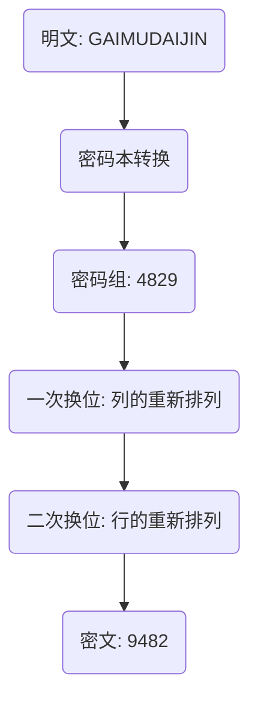
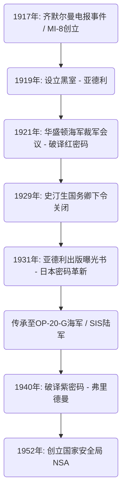

# 密码破译机构“黑室”的兴衰：窃取外交电报的人们与美国情报机构的黎明

国家的命运，往往隐藏在肉眼看不见的密码字符串之中。当我们翻开近代情报（谍报）历史，在美国成长为全球情报帝国的过程中，存在着一个不可回避的传奇机构。那就是“黑室（The Black Chamber）”。本文将极其详尽且多角度地探讨这个秘密机构的兴衰——它在第一次世界大战的混乱中诞生，在华盛顿海军裁军会议上让日本外交底牌尽露，然后以“道义”之名被埋葬，却留下了传承至现代国家安全局（NSA）的情报DNA。

---

## 第一章：第一次世界大战与近代密码破译的诞生

### 齐默尔曼电报事件与美国参战
密码技术自人类开始文字通信的古代就已经存在。然而，它超越单纯的军事战术范畴，被认知为国家战略核心要素，则始于20世纪初第一次世界大战中的戏剧性事件。其象征便是1917年的“齐默尔曼电报事件”。

1917年1月，德意志帝国的外交大臣阿图尔·齐默尔曼，经由华盛顿向驻墨西哥的德国大使发出了一封令人震惊的秘密电报。这封电报的内容是，为了防备当时保持中立的美国作为协约国一方参战，敦促墨西哥与德国结盟，加入对美战争。作为回报，德国承诺帮助墨西哥收复得克萨斯州、新墨西哥州和亚利桑那州的失地。此外，电报中还包含拉拢日本加入这一反美同盟的指示。

这封电报被英国海军情报部的密码破译专职部门“40号房间（Room 40）”截获并破译。英国政府确信，这一情报的曝光将激怒美国公众，成为促使伍德罗·威尔逊总统做出参战决定的致命一击，于是他们在绝佳的时机将其提供给了美国政府。这是密码破译极大地推动世界历史齿轮转动的瞬间。

### 陆军情报部MI-8的创立与亚德利的野心
齐默尔曼事件给美国的军方和政府高官上了惨痛的一课。他们感受到了本国密码被彻底监听的恐惧，以及如果能破译敌国通信将获得多么大的战略优势的现实。当时，美国并不存在国家级别的密码破译机构。出于这种危机感，1917年，在陆军情报部内创立了“MI-8（Military Intelligence, Section 8）”。

被提拔为这个MI-8负责人的，是国务院的年轻电报技师赫伯特·奥斯本·亚德利（Herbert Osborn Yardley）。他原本只不过是一个在乡下电报局工作的操作员，但他拥有在扑克游戏中培养出的胜负直觉，以及能直观地看穿密码模式、像解谜一样揭示规律的天才能力。亚德利有着强烈的晋升欲望，他曾为了打发时间而破译在华盛顿国务院流传的密码电报，让上司们惊叹不已。

### 欧洲“黑室（Cabinet Noir）”的传统
在欧洲，自古以来就存在被称为“Cabinet Noir（黑室）”的传统机构，由国家秘密审查和破译通信。17世纪在法国宰相黎塞留麾下活跃的安托万·罗西尼奥尔，以及英国的约翰·沃利斯等人都是其先驱，长期以来积累了精密的密码破译诀窍。但是，当时的美国完全没有这样的传统。亚德利必须从零开始构建组织。他四处搜罗具备各种才能的人才，包括数学家、语言学家，甚至国际象棋高手，建立了美国第一个真正的密码破译机构MI-8。在第一次世界大战期间，他们主要挑战破译德军的野战密码和外交密码，做出了无形的贡献。

---

## 第二章：曼哈顿的秘密密码局“黑室”

### 设立伪装公司与秘密协定
1918年11月，第一次世界大战结束。随着战时体制的解除，军事情报机构被缩减，MI-8也面临存续的危机。然而，深知情报价值的亚德利强烈主张，即使在和平时期，密码破译机构对国家也是不可或缺的。他成功地从国务院和陆军那里秘密获得了联合预算（每年约10万美元）。1919年，就这样诞生了后来被称为“黑室（The Black Chamber）”的美国首个和平时期秘密密码局。

为了保持活动极度的隐秘性，据点没有设在华盛顿，而是设在纽约曼哈顿东37街一栋不起眼的联排别墅里。表面上，它伪装成一家名为“密码编纂公司”的民间企业，假装销售商业密码本。

他们最大的武器，是与美国国内的大型电报公司达成的秘密协定。亚德利秘密说服了西联汇款总裁纽科姆·卡尔顿以及邮政电报公司的高管等人。他交替运用对爱国主义的呼吁和默示的压力，建立了一个系统：将驻华盛顿的各国使团与本国交流的电报副本（原件），每天源源不断地横向输送给黑室。这明显是对通信秘密的侵犯，是违反美国国内法的非法行为，但在国家安全的冠冕堂皇的理由下，一切都被掩盖在黑暗中。

在曼哈顿的联排别墅里，面对每天送来的大量密码电报，破译官们日以继夜地奋战着。他们破译了30多个国家的外交密码，并将其内容汇总送到国务院和陆军的高官手中。然而，亚德利最大的目标是正在太平洋地区扩张势力的大日本帝国的外交通信。日本的外交密码极其晦涩难懂，但亚德利对攻克这座堡垒燃烧着异常的执念。

---

## 第三章：1921年华盛顿海军裁军会议的激烈交锋

### 围绕主力舰拥有比例5:5:3的殊死搏斗
第一次世界大战后，苦于庞大军费开支的列强国家迫切需要遏制造舰竞赛。1921年11月至1922年2月举行的“华盛顿海军裁军会议”便是最典型的尝试。

美国国务卿查尔斯·埃文斯·休斯在会议一开始，就提出了一个大胆的裁军方案，将美英日的主力舰吨位比例定为“5 : 5 : 3”。对日本来说，这是绝对无法接受的。日本海军长期以来一直主张，对美7成的海军力量是国防的绝对条件，并强烈反对说对美6成（5:5:3）将从根本上威胁国家安全。全权大使加藤友三郎（海军大臣）和币原喜重郎（驻美大使）展开了激烈的谈判。

### 红密码的破译与全盘泄密
在这场外交谈判的背后，黑室正在对日本的外交密码进行彻底的破译。亚德利倾尽全力破译日本外务省的最高机密密码，俗称“红密码（Red Code）”。红密码是一个将密码本（Codebook）和换位密码相结合的非常复杂的系统。

通过亚德利执着的分析，日本外交密码的结构被完全暴露。华盛顿会议期间，日本全权代表团与东京的外务省、海军省之间交流的密码电报，当天就会被送到黑室并被破译，第二天早上就会放在休斯国务卿的办公桌上。休斯在完全了解日本谈判代表团打算让步到什么程度的底牌后，从容应对谈判。

1921年11月28日，东京外务省向加藤友三郎发出了一封决定性的训令电报。里面记载了日本政府的最终妥协方案。内容是：最初要强硬主张“对美7成”，但如果会议即将破裂，在禁止太平洋岛屿军事化等条件下，将接受“对美6成（5:5:3）”作为最终防线。

### 休斯国务卿的胜利
休斯掌握着这份破译情报，冷酷地推进着谈判。因为他知道日本最终会让步，所以对日本的7成要求没有表现出任何妥协，始终保持着毅然决然的态度。日本的谈判代表团虽然对美方异常强硬的态度感到困惑，但做梦也没想到情报已经泄露，最终只能按照本国的指示屈服。结果，日本接受了“5 : 5 : 3”的比例。这份华盛顿海军裁军条约的签订被赞誉为美国外交的辉煌大胜利，但在其背后，黑室的情报发挥了决定性的作用。

---

## 第四章：密码破译的数学与密码学技术

我们将详细论述黑室是如何破译复杂密码的，以及其技术背景。他们所面对的密码，是一个结合了“密码本”和“超级加密（再加密）”的多层保密系统。

### 密码史的变迁与密码的结构分析
当时日本外务省的通信，是使用密码本将明文替换成几位数字或字母的排列（密码组）。但是，为了防止密码本被盗或遭到统计分析的风险，进行了“超级加密”。日方使用的是“双重换位密码（Double Transposition Cipher）”，即按照一定的规则将密码组中字母的顺序进行复杂的重新排列。

经过这种双重换位的密文，完全失去了原本密码组的面貌。要破译它，必须确定换位网格的尺寸，看穿行和列的重新排列规则（密钥），从而重建（字母易位）原来的密码组，并推测其含义。

### 频率分析与卡西斯基测试
亚德利的天才之处在于重建换位网格的步骤。他将“频率分析（Frequency Analysis）”应用到了极致。由于将日语罗马字化后进行加密的特性，元音（a, i, u, e, o）的出现频率会异常高。他统计分析了整个密文的字母出现频率，计算出特定字母组合（双字母组或三字母组，例如“sh”、“ts”等）相邻的概率，像拼图游戏一样将断开的列与列连接起来。

此外，还大量使用了“卡西斯基测试（Kasiski examination）”。这是一种通过测量密文中重复出现的特定字符串之间的间隔，并从其公约数推算出密钥长度（网格宽度）的方法。借此得以揭示换位密码的周期性。

### 重合指数（Index of Coincidence）
在黑室活动的同时，美国的另一位密码天才威廉·弗里德曼（William F. Friedman），正在建立一个名为“重合指数（Index of Coincidence: I.C.）”的划时代数学工具。

它表示的是从密文中随机选取两个字母时，它们完全相同的概率。弗里德曼证明了，通过计算这个I.C.，即使在不知道密钥长度的阶段，也能在数学上判断出密文是使用单一密钥加密的，还是使用多个密钥加密的，亦或是换位密码。从亚德利依靠直觉和经验的破译，到弗里德曼纯粹的“数学与统计学方法”的崛起，象征着密码破译从“个人的天才”向“有组织的科学”演变的过渡期。

---

## 第五章：终结：“绅士不读他人的信件”

### 史汀生的道义上的愤怒
尽管在华盛顿会议上取得了巨大成功，黑室的繁荣并没有持续多久。它的终结并非来自外部的攻击，而是美国政府内部出于“道义”的决定。

1929年3月，在赫伯特·胡佛总统的政权下，亨利·L·史汀生（Henry L. Stimson）就任新一任国务卿。史汀生是一个有着严谨的新教伦理观的理想主义者。他在上任后不久，在审查国务院预算用途的过程中，得知了黑室的存在以及“非法监听外国使团通信”的实情。

史汀生勃然大怒。对他来说，偷看盟国和友好国家的通信，是严重玷污美国外交骄傲的卑鄙背叛行为。他立即决定切断资金支持，并说出了那句永远铭刻在情报史上的话：

**“绅士不读他人的信件（Gentlemen do not read each other's mail.）”**

### 曝光书籍与全球震惊
失去最大赞助商的黑室陷入了资金困境，1929年的世界大萧条更是雪上加霜。同年10月31日，黑室被正式关闭，被迫解散。

在大萧条谷底失业的亚德利面临着严重的生活困境。爱国主义遭到背叛，在绝望的驱使下，他于1931年出版了一本赤裸裸地讲述自己经历的曝光书《美国黑室（The American Black Chamber）》。

这本书详尽地曝光了美国破译各国驻华外交密码的实情，尤其是华盛顿会议期间监听日本通信的全貌。这本成为全球畅销书的著作，给日本带来了巨大的冲击。日本政府和军方对本国最高机密密码完全泄露的事实感到恐慌，立即销毁了所有的密码系统。并且，以此曝光为教训，开始加紧研发更高级的机械式密码机“九七式欧文印字机（Purple）”。讽刺的是，亚德利的曝光让日本的密码技术实现了飞跃性的进化。

---

## 第六章：黑室留下的遗产

### 传承至OP-20-G与SIS
黑室虽然遭遇了不幸的结局，但他们播下的情报种子并未灭绝。其诀窍和部分人才，被秘密移交给了美国海军的通信情报部“OP-20-G”。OP-20-G的约瑟夫·罗什福尔等人引入了数学方法和机械化数据处理，在1942年的中途岛海战中破译了日本海军密码“JN-25”，确定了“AF（中途岛）”，从而取得了历史性的胜利。

另一方面，在陆军中创立了“信号情报服务处（SIS）”，由威廉·弗里德曼领导。他否定了亚德利那种依赖个人直觉的手法，确立了基于彻底的数学与统计学理论的“科学密码破译”体系。

### 从破译紫密码到NSA
弗里德曼率领的SIS最大的功绩是，在1940年成功地完全破译了日本的最高机密机械式密码“紫密码（Purple）”。他们没有看到实物，仅凭逻辑分析就推测出了步进开关机构的接线，并制造出了复制机（Magic）。这个代号为“MAGIC”的情报为第二次世界大战的战略决策提供了不可估量的价值。具有讽刺意味的是，曾经关闭黑室的史汀生作为陆军部长复出，这次却成了MAGIC的狂热消费者。

战后的1952年，随着冷战的加剧，美国政府整合了密码机构，创立了庞大的电子情报机构“国家安全局（NSA）”。在监控全球通信网络、驱使超级计算机的现今NSA的根基中，确确实实地活跃着在曼哈顿那座狭小的联排别墅里，像解谜一样挑战密码的亚德利和黑室男人们的DNA。

黑室的兴衰，是一个决定性的转折点，宣告了国家意识到“信息”这种武器的绝对价值，并打开了通往现代网络战的潘多拉魔盒，标志着美国情报机构黎明期的到来。

这段历史轨迹冷酷地证明，情报已不再是外交的附属品，而是左右国家生存的核心技术。可以说，亚德利的激情与野心，以及黑室的暗中活跃，是我们在理解当今复杂的资讯战和网络安全社会时，绝不能忘记的起点。

## 补遗：关于黑室的深层考察与技术细节

基于正篇中概述的历史背景，在此为了增加学术和实践上的深度，将针对密码破译现场具体的困难、当时国际政治中情报的不对称性，以及亚德利这个人物复杂的精神结构，进行更详细的分析。

### 1. 破译双重换位密码（Double Transposition）的实践困难
如前所述，日本外务省在红密码中使用的超级加密（再加密）是双重换位密码。仅仅依靠纸和铅笔来破译它的过程，与现代计算机的蛮力攻击（Brute Force）完全不同，它是高度直觉和逻辑推理的结合。

破译双重换位密码的第一步，是掌握“信息的准确长度”。例如，如果密文是“35个字符”，那么网格的尺寸很可能是“5×7”或“7×5”。但是，如果字符数是一个像“37个字符”这样的质数，那么进行加密的操作员可能是添加了几个虚拟字符（Nulls）来构成一个长方形，或者是使用了将特定方格留空再进行换位的“不完全长方形换位（Incomplete Columnar Transposition）”。日本外务省频繁使用这种不完全长方形换位，因此破译极其困难。

亚德利等人首先开始大量收集用相同密钥加密的、长度不同的信息（这被称为“同位文”）。通过比较同位文，可以找出网格中空白方格分布的模式，从而确定列的长度。这被称为“多重易位（Multiple Anagramming）”。

一旦确定了列的长度，下一步就是基于元音的出现频率对列进行重新排列。例如，如果某一列包含较多的“A”或“O”，而另一列包含较多的“K”或“S”，将它们相邻放置，就很可能恢复出“KA”或“SO”这样的日语发音音节（罗马字）。亚德利将数千至数万个这样的音节对进行统计评分，推导出概率最高的列组合。这就像是蒙着眼睛复原一个巨大的魔方一样的神技，比起数学，它更依赖于对语言结构的深刻洞察力。

### 2. 重建密码本的执念
即使破解了换位规则（密钥），那也仅仅是把随机的字符串还原成了“意义不明的密码组（数字或字母的块）”。下一个难关是推测这个密码组代表什么单词，从白纸开始重建密码书本身。

使这成为可能的是“上下文（Context）”和“套话”。外交电报存在特有的格式。开头通常包含收件人、发件人、日期，以及“加急”或“机密”等常规指示。另外，在特定的时期，特定的话题会频繁出现。在华盛顿会议期间，很容易预测到“战舰（Battleship）”、“吨位（Tonnage）”、“比例（Ratio）”、“休斯（Hughes）”等单词会满天飞。

亚德利的团队将这些猜测的单词（称为Crib）代入密文中，验证是否会产生矛盾。例如，如果假设“6832”这个密码组的意思是“海军”，而在另一封电报中，该密码组出现在与裁军无关的语境中，那么这个假设就会被作为错误而摒弃。就这样，给每一个密码组赋予意义，从零开始编纂一部巨大的字典的工作持续了数年。这本被重建的密码书的精密程度，正是黑室真正的财富。

### 3. 情报的不对称性与“绅士协定”的局限
在华盛顿会议上，美国破译了日本密码这一事实，不仅意味着一国在谈判中占据了优势，更表明了国际关系中“情报的不对称性”的决定性影响。

当时以国际联盟为中心的国际秩序，是以“公开外交”和“对条约的相互信任”为前提的。然而，在其背后，却存在着一个冷酷的现实：在信息战中获胜的人将掌握制定规则的主导权。日本被束缚在美国倡导的“裁军”这一理想主义框架内，实际上却是在其妥协点（底牌）被完全掌握的状态下，被逼到了谈判桌前。

这种不对称性表明，情报的价值在多大程度上可以凌驾于物理军事力量（战舰数量等）之上。如果日本当时意识到本国的密码被破译，反过来进行散布虚假情报的欺骗行动（Deception），那么华盛顿体制的结局可能会完全不同。

亨利·史汀生关闭黑室的背后，有一种强烈的担忧：这种“幕后游戏”会从根本上腐蚀他所信仰的“基于法治的国际秩序”。史汀生“绅士不读他人的信件”这句话，经常被嘲笑为天真的理想主义，但那也是当时美国试图实现的“高透明度新外交模式”的强烈承诺。然而，历史并没有选择史汀生的理想主义，而是选择了亚德利的现实主义（马基雅维利主义）。

### 4. 赫伯特·O·亚德利的人物形象与矛盾心理
在讲述黑室的故事时，亚德利特异的性格是一个不可或缺的要素。他不仅仅是一个优秀的密码破译官，还是一个充满表现欲和野心、内心复杂的人物。

他对自己的能力有着绝对的自信，甚至对政府高官也曾表现出傲慢的态度。当黑室在华盛顿会议上取得成功后，他把自己视为“拯救美国的幕后英雄”，并要求更多的预算和权力。但是，情报机构的本质就是处于“阴影”之中。他的表现欲，作为应该秘密活动的国家情报机构的首脑来说，是一个致命的缺陷。

在史汀生宣布关闭机构之后，亚德利出版了《美国黑室》的行为，不仅是出于生活困难而为了金钱，也是对冷落他的政府的痛烈报复，同时也是一种难以抑制的渴望——想向世人展示自己的天才。

由于这次曝光，他被永远地驱逐出了美国情报界。尽管在第二次世界大战期间，美国政府极度渴望密码破译专家，但亚德利再也没有被允许担任公职。他曾前往中国协助国民党破译密码，也曾协助加拿大政府建立密码机构，但他再也没能回到曾经那样的国家级项目的中心。

亚德利于1958年在失意中离世，但他留下的遗产是巨大的。他向我们提出了一个至今仍然适用的根本性问题：情报机构在国家中应该发挥什么作用？它又该如何与个人的野心和伦理产生冲突？将他简单地抛弃、称之为“叛徒”或“为了金钱的爆料者”很容易，但在美国的情报史上，没有其他人像亚德利那样散发出如此强烈的的光与影。

### 5. 破译紫密码之路：从模拟到数字
亚德利的曝光迫使日本革新了密码系统，这也导致美国密码破译技术被迫向下一个次元进化。日本引入的“九七式欧文印字机（Purple）”，是一种复杂的机械式密码，绝对无法用亚德利擅长的语言学字母易位或频率分析来破译。

此时登场的是威廉·弗里德曼和他领导的SIS（信号情报服务处）。弗里德曼将密码破译从“个人的直觉”升华为了“数学与机械工程的融合”。紫密码机使用了多个步进开关（电话交换机中使用的旋转开关），通过复杂的电路将输入的字母转换为另一个字母。因为这种电路的连接模式在每次敲击键盘时都会发生变化，所以加密算法是在不断变动的。

SIS的团队（包括弗兰克·罗莱特等优秀的数学家）彻底地用数学分析了截获的密文中存在的极其微小的统计偏差，以及日本外交官犯下的操作错误（例如使用相同的密钥设置发送多条信息）。尽管他们完全没有见过紫密码机的实物，却在纸上完美重现了该机器内部接线在逻辑上是如何构建的。

这个过程与亚德利时代的“解谜”有着根本的不同，它是当今密码理论基础的高级数学模型的构建。当弗里德曼的团队完成紫色密码的模拟复制机“MAGIC”时，宣告了亚德利式依赖个人的密码破译的终结，以及与NSA一脉相承的、技术主导的信号情报（SIGINT）时代的开启。

### 结论
“黑室”的故事，是国家与信息关系史中戏剧性的第一幕。亚德利的直觉，史汀生的道义，弗里德曼的科学。这三者的冲突与进化过程，为现代网络空间的情报战，以及爱德华·斯诺登事件等引发的“情报与伦理”问题，提供了深刻的历史洞察。那些窃取并看穿外交电报的男人们的执念，虽然改变了形式，却依然在现代国家的深处绵延不绝地存活着。

### 6. 从情报史学看黑室的现代意义
在历史的大背景下，黑室留下的遗产不仅限于密码破译技术的进化。可以说，它是“情报（Intelligence）”开始作为国家独立权力中枢发挥作用的萌芽。

亚德利建立的是一个系统，为军事和外交决策提供从不可见的来源获得的坚实证据（硬情报）。相比之下，过去的外交很大程度上依赖于大使的报告和公开信息的分析（软情报），而破译敌国密码通信的行为，使得直接提取对方“毫无伪装的真实意图”成为可能。

现代的国家安全局（NSA）和英国的政府通信总部（GCHQ）等信号情报机构，在其技术基础方面已经取得了亚德利时代无法比拟的飞跃。然而，在“打破通信秘密并将信息武器化”这一本质使命上，他们依然走在亚德利描绘的蓝图之上。黑室的兴衰史，继续向我们抛出一个21世纪依然没有答案的深奥命题：国家为了保护自身的安全，应该在多大程度上跨越伦理的界限？
