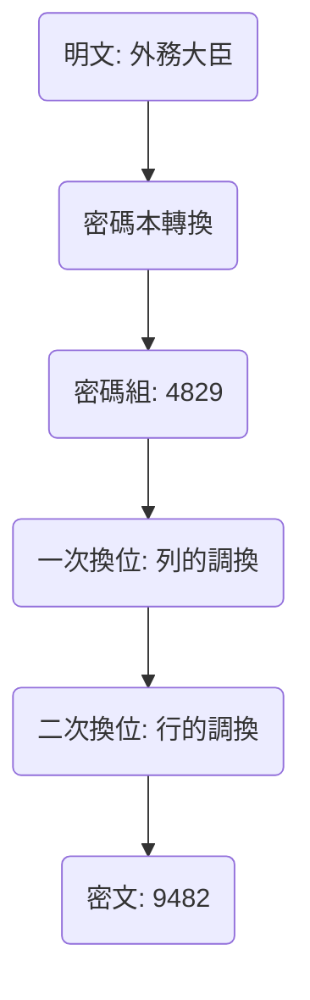
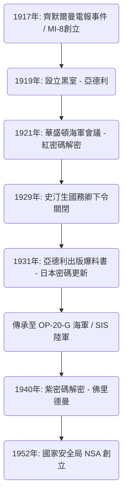

# 暗號解密機構「黑室」的興衰：看破外交電報的男人們與美國情報機構的黎明

國家的命運，往往隱藏在看不見的密碼字串之中。回顧近代情報史，在美國成長為全球情報帝國的過程中，有一個不可迴避的傳奇機構，那就是「黑室（The Black Chamber）」。本文將詳細且多角度地探討這個秘密機構的興衰：它在第一次世界大戰的混亂中誕生，在華盛頓海軍會議上將日本的外交底牌暴露無遺，最終雖在「道義」的名義下被葬送，卻留下了傳承至現代國家安全局（NSA）的情報DNA。

---

## 第1章：第一次世界大戰與近代密碼解密的誕生

### 齊默爾曼電報事件引發美國參戰
自人類開始以文字通訊的古代起，密碼技術便已存在。然而，密碼跨越單純的軍事戰術範疇，被認知為國家戰略核心要素，卻是源於20世紀初第一次世界大戰中的戲劇性事件。其最具代表性的，便是1917年的「齊默爾曼電報事件」。

1917年1月，德意志帝國外交部長阿圖爾·齊默爾曼（Arthur Zimmermann）經由華盛頓，向駐墨西哥的德國大使發送了一封令人震驚的秘密電報。該電報指示，為了防範當時保持中立的美國作為協約國參戰，德國應促使墨西哥與其結盟，並對美國開戰。作為回報，德國承諾幫助墨西哥收復德克薩斯州、新墨西哥州和亞利桑那州的失地。此外，電報中還包含拉攏日本加入此反美同盟的指示。

這封電報被英國海軍情報部專責密碼解密的「40號房間（Room 40）」攔截並解密。英國政府確信，這份情報的曝光將激怒美國民意，成為促使伍德羅·威爾遜總統決定參戰的決定性打擊，因此在絕佳的時機將其提供給了美國政府。這是密碼解密大幅推動世界歷史齒輪運轉的瞬間。

### 陸軍情報部MI-8的創立與亞德利的野心
齊默爾曼事件給美國軍方和政府高層上了慘痛的一課，讓他們恐懼於本國密碼可能早已洩露，同時也意識到若能解密敵國通訊，將能獲得多麼巨大的戰略優勢。當時，美國並不存在國家級的密碼解密機構。出於這種危機感，1917年，美國陸軍情報部內設立了「MI-8（第8軍事情報處）」。

被拔擢為MI-8負責人的，是國務院的年輕電報員赫伯特·奧斯本·亞德利（Herbert Osborn Yardley）。他原本只是一名在鄉下電報局工作的操作員，但他擁有透過撲克牌培養出的勝負直覺，以及直觀看穿密碼模式、像解謎般揭露規律的天才能力。亞德利有著強烈的向上企圖心，經常以解密華盛頓國務院往來的密碼電報作為消遣，讓上司們驚嘆不已。

### 歐洲「黑室（Cabinet Noir）」的傳統
在歐洲，自古便存在被稱為「黑室（Cabinet Noir）」的傳統機構，由國家秘密審查和解密通訊。17世紀法國首相黎塞留麾下的安托萬·羅西尼奧爾（Antoine Rossignol），以及英國的約翰·沃利斯（John Wallis）等人便是先驅，長年累積了精密的密碼解密訣竅。然而，當時的美國完全沒有這種傳統。亞德利必須從零開始建立組織。他招攬了數學家、語言學家，甚至西洋棋高手等各方人才，建立了美國第一個正式的密碼解密機構MI-8。在第一次世界大戰期間，他們主要挑戰解密德軍的野戰密碼和外交密碼，在無形中做出了貢獻。

---

## 第2章：曼哈頓的秘密密碼局「黑室」

### 設立掩護公司與秘密協定
1918年11月，第一次世界大戰結束。隨著戰時體制的解除，軍事情報機構被縮編，MI-8也面臨存續的危機。然而，深知情報價值的亞德利強烈主張，即使在和平時期，密碼解密機構對國家而言仍是不可或缺的。他成功地秘密從國務院和陸軍爭取到共同預算（每年約10萬美元）。1919年，美國第一個和平時期的秘密密碼局因此誕生，這就是後來被稱為「黑室（The Black Chamber）」的機構。

為了保持活動的極度機密性，其基地設在遠離華盛頓的紐約曼哈頓東37街一棟不起眼的聯排別墅中。表面上，他們偽裝成名為「密碼編纂公司（Code Compilation Company）」的民間企業，假裝在販售商業用密碼本。

他們最大的武器，是與美國國內大型電報公司達成的秘密協定。亞德利秘密說服了西聯匯款（Western Union）總裁紐康姆·卡爾頓（Newcomb Carlton）以及郵政電報（Postal Telegraph）等高層。透過訴諸愛國心並施加暗中壓力，他建立了一個系統：駐華盛頓的各國外交團與本國往來電報的副本（原稿），每天都會被秘密流向黑室。這明顯是侵犯通訊秘密的行為，觸犯了美國國內法，但在國家安全的冠冕堂皇理由下，一切都被掩蓋了。

在曼哈頓的聯排別墅裡，解密官們日以繼夜地與每天送來的大量密碼電報堆奮戰。他們解密了30多個國家的外交密碼，並將內容摘要送交國務院和陸軍的高層。然而，亞德利最大的目標，是當時在太平洋地區勢力日益擴張的大日本帝國的外交通訊。日本的外交密碼極為難解，但亞德利對攻克這座堡壘燃起了異常的執著。

---

## 第3章：1921年華盛頓海軍會議的激烈衝突

### 圍繞主力艦保有比例5:5:3的死鬥
第一次世界大戰後，飽受龐大軍費困擾的列強各國迫切需要遏制造艦競賽。1921年11月至1922年2月舉行的「華盛頓海軍會議」，便是最重要的一次嘗試。

美國國務卿查爾斯·埃文斯·休斯（Charles Evans Hughes）在會議之初，提出了一項大膽的裁軍方案：將美、英、日的主力艦噸位比例定為「5 : 5 : 3」。對日本而言，這完全無法接受。日本海軍長年主張，擁有對美七成的海軍兵力是國防的絕對條件，強烈反對對美六成（5:5:3），認為這會從根本上威脅國家安全。全權大使加藤友三郎（海軍大臣）與幣原喜重郎（駐美大使）展開了激烈的談判。

### 紅密碼的解密與全面洩露
在這場外交談判的背後，黑室正徹底解密日本的外交密碼。亞德利傾全力解密日本外務省的最高機密密碼，通稱「紅密碼（Red Code）」。紅密碼是結合了密碼本（Codebook）和換位式密碼的極度複雜系統。

透過亞德利執著的分析，日本外交密碼的結構被完全破解。華盛頓會議期間，日本全權代表團與東京外務省、海軍省之間往來的密碼電報，當天就會被送達黑室並解密，隔天早上便放在休斯國務卿的辦公桌上。休斯完全掌握了日本談判團準備讓步的底線，從而在談判中佔據了知己知彼的優勢。

1921年11月28日，東京外務省向加藤友三郎發出了一封決定性的訓令電報。其中記載了日本政府最終的妥協方案：初期強硬堅持「對美七成」，但若會議面臨破裂，作為最終防線，在附帶禁止太平洋島嶼要塞化等條件下，可以接受「對美六成（5:5:3）」。

### 休斯國務卿的勝利
掌握了這份解密情報的休斯，冷酷地推進著談判。由於他知道日本最終會讓步，因此對日本七成的要求不作任何妥協，始終保持強硬態度。日本談判團對美方異常強勢的態度感到困惑，卻做夢也沒想到情報已經洩漏，最終只能按照國內指示屈服。結果，日本接受了「5 : 5 : 3」的比例。華盛頓海軍條約的簽訂被讚譽為美國外交的輝煌勝利，但其背後，黑室的情報發揮了決定性的作用。

---

## 第4章：密碼解密的數學與密碼學技術

關於黑室如何解密複雜的密碼，在此詳細說明其技術背景。他們面對的密碼，是結合了「密碼本」與「超級加密（重新加密）」的多層次隱匿系統。

### 密碼史的變遷與密碼結構分析
當時日本外務省的通訊，是利用密碼本將明文替換為幾位數的數字或字母組合（密碼組）。然而，為防止密碼本被盜或被統計分析，他們進行了「超級加密」。日本方面使用的是「雙重換位密碼（Double Transposition Cipher）」，即依照特定規則將密碼組的字母順序進行複雜的調換。

經過這兩次換位的密文，完全失去了原本密碼組的面貌。要解密，必須確定換位網格的尺寸，看穿行與列的調換規則（密鑰），重建（易位構詞）原始的密碼組，並推測其含義。

### 頻率分析與卡西斯基測試
亞德利的天才之處，在於重建換位網格的步驟。他將「頻率分析（Frequency Analysis）」應用到了極致。由於是將日語羅馬拼音化後加密，母音（a, i, u, e, o）的出現頻率會異常地高。他統計分析整個密文的字母出現頻率，計算特定字母組合（如「sh」、「ts」等雙字母或三字母組合）相鄰的機率，像拼圖一樣將被切斷的列拼接起來。

此外，他也大量運用了「卡西斯基測試（Kasiski examination）」。這是一種透過測量密文中重複出現的特定字串間隔，並從其公因數推算密鑰長度（網格寬度）的方法。藉此，他能夠揭露換位密碼的週期性。

### 重合指數（Index of Coincidence）
在黑室運作的同時，美國另一位密碼天才威廉·佛里德曼（William F. Friedman），正逐步建立一種名為「重合指數（Index of Coincidence: I.C.）」的劃時代數學工具。

這代表從密文中隨機選取兩個字母時，它們是完全相同字母的機率。佛里德曼證明，透過計算這個I.C.值，即使在不知道密鑰長度的情況下，也能在數學上判斷密文是使用單一密鑰加密、多重密鑰加密，抑或是換位密碼。從亞德利依賴直覺和經驗的解密，轉向佛里德曼純粹的「數學與統計學方法」的崛起，象徵著密碼解密正處於從「個人天才」進化為「組織性科學」的過渡期。

---

## 第5章：終結：「紳士不讀他人信件」

### 史汀生的道義憤怒
儘管在華盛頓會議上取得了巨大成功，黑室的繁榮並未持續太久。其終結並非來自外部的攻擊，而是美國政府內部的「道義」決定。

1929年3月，在赫伯特·胡佛（Herbert Hoover）總統執政期間，亨利·L·史汀生（Henry L. Stimson）就任新國務卿。史汀生是一位擁有嚴格新教倫理觀的理想主義者。他就任後不久，在審查國務院預算用途時，得知了黑室的存在以及其「非法攔截外國使館通訊」的真面目。

史汀生勃然大怒。對他而言，偷看盟國或友好國家的通訊，是嚴重玷汙美國外交榮耀的卑劣背叛。他立即決定切斷資金支持，並說出了在情報史上永垂不朽的名言：

**「紳士不讀他人信件（Gentlemen do not read each other's mail.）」**

### 爆料書與世界性的衝擊
失去最大贊助者的黑室陷入資金困難，1929年的世界經濟大恐慌更是雪上加霜。同年10月31日，黑室正式關閉，被迫解散。

在大恐慌谷底失業的亞德利面臨嚴重的生計困難。愛國心遭到背叛、被絕望驅使的他，於1931年出版了一本赤裸裸記錄其經歷的爆料書《美國的黑室（The American Black Chamber）》。

這本書清晰地揭露了美國解密各國外交密碼的實情，尤其是華盛頓會議中竊聽日本通訊的全貌。這本成為世界暢銷書的著作，對日本造成了巨大的衝擊。日本政府和軍方對於本國最高機密密碼早已洩露的事實感到恐慌，立即廢棄了所有的密碼系統。以此曝光為教訓，日本開始以極快的速度開發更先進的機械式密碼機「九七式歐文印字機（紫密碼）」。諷刺的是，亞德利的爆料反而促使日本的密碼技術突飛猛進。

---

## 第6章：黑室留下的遺產

### OP-20-G與SIS的傳承
黑室雖然遭遇了悲慘的結局，但他們播下的情報種子並未死絕。其訣竅和部分人才，被秘密傳承給了美國海軍通訊情報部「OP-20-G」。OP-20-G的約瑟夫·羅什福爾（Joseph Rochefort）等人引進了數學方法和機械化資料處理，在1942年的中途島海戰中解密了日本海軍的密碼「JN-25」，確定了「AF（中途島）」，從而帶來了歷史性的勝利。

另一方面，在陸軍內部，創立了「信號情報服務處（SIS）」，由威廉·佛里德曼領導。他否定了亞德利依賴個人直覺的手法，建立了一套基於徹底數學和統計學理論的「科學化密碼解密」體系。

### 從解密紫密碼到NSA
佛里德曼率領的SIS最大的功績，是在1940年成功完全破解了日本最高機密的機械式密碼「紫密碼」。他們在未見過實體機器的情況下，僅靠邏輯分析就推測出了步進開關機構的線路配置，並製造出了複製機（魔術）。這項名為「MAGIC」的情報，為第二次世界大戰的戰略決策提供了無法估量的價值。諷刺的是，曾經關閉黑室的史汀生，後來以陸軍部長的身分復出，反而成為了MAGIC情報的熱烈使用者。

戰後的1952年，隨著冷戰加劇，美國政府整合了各密碼機構，創立了龐大的電子情報機構「國家安全局（NSA）」。現代NSA監控全球通訊網、驅使著超級電腦，但其根基中，無疑仍跳動著當年曼哈頓小聯排別墅裡，像解謎般挑戰密碼的亞德利與黑室男人們的DNA。

黑室的興衰，標誌著國家意識到「情報」這項武器的絕對價值，打開了通往現代網路戰的潘朵拉之盒，是宣告美國情報機構黎明期的決定性轉捩點。

這個歷史軌跡冷酷地證明，情報早已不是外交的附屬品，而是左右國家存亡的核心技術。亞德利的熱情與野心，以及黑室的暗中活躍，在理解當今複雜的情報戰與網路安全社會時，絕對是不可遺忘的原點。

## 附錄：對黑室的深層探討與技術細節

基於正文所述的歷史發展，這裡為增加學術與實務的深度，將針對密碼解密現場具體的技術困難、當時國際政治中情報的不對稱性，以及亞德利這個人物複雜的精神結構，進行更詳細的分析。

### 1. 解密雙重換位密碼（Double Transposition）的實務困難
如前所述，日本外務省在紅密碼中使用的超級加密（重新加密）是雙重換位密碼。僅靠紙筆解密這個過程，與現代電腦的暴力破解法截然不同，它結合了高度的直覺與邏輯推論。

解密雙重換位密碼的第一步，是掌握「訊息的正確長度」。例如，若密文為「35個字」，網格大小很可能是「5×7」或「7×5」。然而，如果字數是像「37個字」這樣的質數，則可能是加密操作員加入了幾個無效字母（Nulls）以構成長方形，或者是使用了保留特定空格不填入文字的「不完全長方形換位（Incomplete Columnar Transposition）」。日本外務省頻繁使用這種不完全長方形換位，使得解密極度困難。

亞德利等人從收集大量使用相同密鑰加密、但長度不同的訊息（稱為「同位文」）開始。透過比較同位文，可以找出網格中空格配置的模式，進而確定列的長度。這被稱為「多重易位構詞（Multiple Anagramming）」。

一旦確定了列的長度，接下來就是基於母音出現頻率重新排列各列。例如，如果某一列包含很多「A」和「O」，另一列包含很多「K」和「S」，將它們相鄰放置，很可能就能還原出如「KA」或「SO」等日語音節（羅馬拼音）。亞德利對數千甚至數萬個這樣的音節對進行統計評分，推導出機率最高的列組合。這簡直就像蒙眼解開巨大的魔術方塊一樣，與其說是數學，不如說更依賴對語言結構的深刻洞察力。

### 2. 重建密碼本的執念
即使破解了換位的規則（密鑰），也只是將隨機字串變回「毫無意義的密碼組（數字或字母塊）」。下一個難關是推測這些密碼組代表哪個單字，並從白紙開始重新構建密碼本本身。

要做到這一點，需要依靠「上下文（語境）」和「常用短語」。外交電報有其特定的格式。開頭通常包含收件人、發件人、日期，以及「特急」或「機密」等標準指示。此外，特定時期會頻繁出現特定話題。在華盛頓會議期間，可以輕易預見「戰艦（Battleship）」、「噸位（Tonnage）」、「比例（Ratio）」、「休斯（Hughes）」等詞彙將會滿天飛。

亞德利的團隊將這些推測的單字（稱為 Crib）代入密文中，驗證是否會產生矛盾。例如，假設「6832」這個密碼組代表「海軍」，若在另一封與裁軍無關的電報中出現了這個密碼組，該假設就會被認定為錯誤並廢棄。就這樣，他們花了好幾年的時間，為每一個密碼組賦予意義，從零開始編纂出了一本巨大的辭典。這本重建出來的精細密碼本，才是黑室真正的財產。

### 3. 情報的不對稱性與「紳士協定」的局限
在華盛頓會議上，美國解密日本密碼的事實，不僅僅意味著一國在談判中佔據了優勢，更決定性地展示了國際關係中「情報不對稱性」的影響。

當時以國際聯盟為中心的國際秩序，建立在「公開外交」和「對條約相互信任」的前提下。然而在幕後，卻存在著誰贏得情報戰，誰就能掌握規則制定主導權的冷酷現實。日本在被美國提倡的「裁軍」這種理想主義框架束縛的同時，實際上卻是在己方妥協底線被完全摸透的狀態下，坐在談判桌前的。

這種不對稱性表明，情報的價值可以如何凌駕於物理上的軍事力量（如戰艦數量等）之上。如果當時日本意識到本國密碼已被破解，反過來發布假情報進行欺敵工作（Deception），那麼華盛頓體制的結果可能會完全不同。

亨利·史汀生關閉黑室的背後，有著強烈的擔憂：他認為這種「幕後遊戲」會從根本上腐蝕他所信奉的「基於法治的國際秩序」。史汀生「紳士不讀他人信件」的言論，雖然常被嘲笑為天真的理想主義，但這也代表了當時美國試圖追求「高透明度的新型外交模式」的強烈承諾。然而，歷史最終選擇的不是史汀生的理想主義，而是亞德利的現實主義（馬基維利主義）。

### 4. 赫伯特·O·亞德利其人矛盾的性格
在講述黑室的故事時，亞德利特異的性格是不可或缺的元素。他不僅僅是一名優秀的密碼解密官，更是一個充滿表現慾和野心的複雜人物。

他對自己的能力有著絕對的自信，有時甚至對政府高層表現出傲慢的態度。當黑室在華盛頓會議上取得成功後，他自視為「拯救美國的幕後英雄」，並要求更多的預算和權限。然而，情報機構的本質在於身處「暗影」。他的自我表現慾，對一個本應秘密活動的情報機構首長來說，是致命的缺陷。

在史汀生宣告關閉後，亞德利出版《美國的黑室》的行為，不僅僅是出於生活所迫的金錢目的，更是對冷落他的政府的痛烈報復；同時也是他渴望向世人展現自己天才的一種難以抑制的表現。

這次爆料讓他永遠被美國情報界驅逐。在第二次世界大戰期間，儘管美國政府極度渴望密碼解密專家，但亞德利再也沒有被允許擔任任何公職。他曾前往中國協助國民黨解密密碼，也曾協助加拿大政府建立密碼機構，但他再也無法重返過去那樣國家級計畫的核心。

亞德利於1958年在失意中離世，但他留下的影響卻極為深遠。他向我們拋出了一個至今仍然適用的根本性問題：情報機構在國家中應扮演什麼角色，以及它如何與個人的野心或倫理產生衝突。要將他單純地視為「叛徒」或「為錢爆料的人」很容易，但在美國情報史上，沒有人比亞德利散發出更強烈的光與影。

### 5. 通往破解紫密碼機之路：從類比到數位
亞德利的爆料導致日本更新了密碼系統，這反而迫使美國的密碼解密技術強制進化到了下一個次元。日本引進的「九七式歐文印字機（紫密碼）」，是一種極為複雜的機械式密碼，絕非亞德利所擅長的語言學易位構詞或頻率分析所能破解。

這時登場的，是威廉·佛里德曼和他率領的SIS（信號情報服務處）。佛里德曼將密碼解密從「個人直覺」昇華為「數學與機械工程的融合」。紫密碼機使用了多個步進開關（用於電話交換機的旋轉開關），透過複雜的電路將輸入的字母轉換為另一個字母。這種電路的連接模式每次敲擊鍵盤都會改變，因此加密演算法是不斷變動的。

SIS團隊（包括法蘭克·羅列特等優秀數學家）透過數學徹底分析了攔截到的密文中極其微小的統計偏差，以及日本外交官犯下的操作失誤（例如使用相同密鑰設定發送多條訊息）。儘管他們完全沒有見過紫密碼機的實物，卻僅在紙上就完全重構了該機器內部線路的邏輯架構。

這個過程與亞德利時代的「解謎」有著根本的不同，是構建當今密碼理論基礎的高度數學模型。當佛里德曼團隊完成紫密碼的類比複製機「魔術」時，這宣告了亞德利式依賴個人的密碼解密時代的終結，以及傳承至NSA、由科技主導的信號情報（SIGINT）時代的序幕。

### 結論
「黑室」的故事，是國家與情報關係史上戲劇性的第一幕。亞德利的直覺、史汀生的道義、佛里德曼的科學。這三者的衝突與進化過程，為我們理解現代網路空間中的情報戰，以及愛德華·史諾登事件中所面臨的「情報與倫理」問題，提供了深刻的歷史洞察。那些看破外交電報的男人們的執念，雖然改變了形式，卻依然在現代國家的深處脈動著。

### 6. 從情報史學看黑室的現代意義
在歷史的大脈絡中，黑室留下的遺產不僅僅是密碼解密技術的進化。可以說，那是「情報」開始作為國家獨立權力中樞發揮作用的萌芽。

亞德利所建立的，是一個能從無形來源為軍事與外交決策提供確鑿證據（硬情報）的系統。過去的外交主要依賴大使的報告和公開資訊的分析（軟情報），而解密敵國密碼通訊的行為，使得直接萃取對方「毫無虛假的真意」成為可能。

現代的國家安全局（NSA）和英國的政府通訊總部（GCHQ）等信號情報機構，在其技術基礎上已實現了亞德利時代無法比擬的飛躍。然而，在「打破通訊秘密、將情報武器化」這個核心任務上，他們依然走在亞德利描繪的藍圖上。黑室的興衰史，不斷地向我們拋出一個在21世紀仍未有解答的深奧命題：為了保護自身的安全，國家究竟可以跨越倫理邊界到什麼程度。
