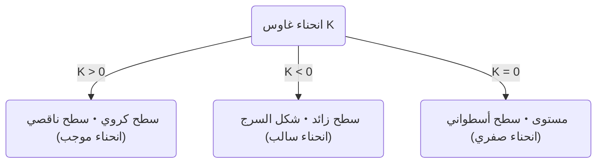
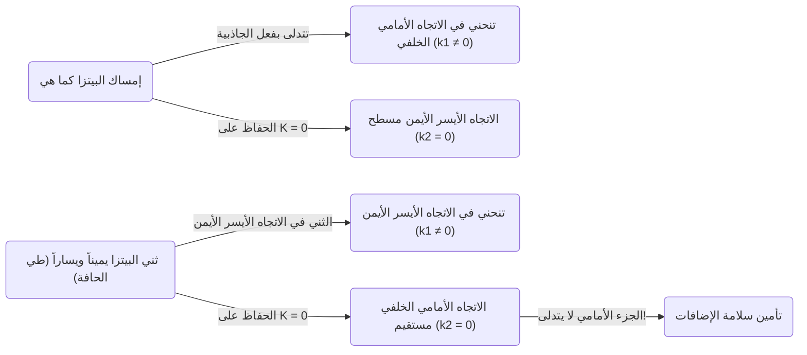

في عالم الرياضيات، قد تكون هناك مفاهيم مجردة ومعقدة للوهلة الأولى ولكنها تفيدنا في مواقف غير متوقعة في حياتنا اليومية. من أبرز الأمثلة على ذلك  **المبرهنة الرائعة**  (Theorema Egregium) التي اكتشفها كارل فريدريش غاوس. تُعرف هذه المبرهنة كواحدة من أهم وأجمل النتائج في مجال الهندسة التفاضلية.

في هذا المقال، سنتعمق بدءاً من المعنى الرياضي لـ  **المبرهنة الرائعة** ، ومفهوم السطح، وصولاً إلى سبب كون هذه المبرهنة مفيدة جداً عندما نأكل البيتزا.

## 1. ما هو انحناء غاوس؟

لفهم المبرهنة الرائعة، يجب علينا أولاً فهم مفهوم "الانحناء". في كل نقطة على السطح، الانحناء هو مؤشر يوضح مدى "انحناء" السطح.

لقياس درجة الانحناء عند نقطة معينة، نحاول قطع السطح بمستويات مختلفة تمر عبر تلك النقطة. نتيجة لذلك، نحصل على منحنيات مختلفة، ولكن من بينها يوجد اتجاه يكون فيه الانحناء أشد ما يمكن (الانحناء الأساسي الأقصى $\kappa_1$)، واتجاه يكون فيه الانحناء أخف ما يمكن (الانحناء الأساسي الأدنى $\kappa_2$). يُعرّف انحناء غاوس $K$ بأنه حاصل ضرب هذين الانحنائين الأساسيين.

$$
K = \kappa_1 \cdot \kappa_2
$$

بناءً على قيمة انحناء غاوس $K$، يتم تصنيف السطح عند تلك النقطة إلى ثلاثة أنواع.

1.  **$K > 0$ (انحناء موجب)** : الأسطح التي تنحني نحو نفس الجانب في جميع الاتجاهات، مثل سطح الكرة.
2.  **$K < 0$ (انحناء سالب)** : الأسطح التي تنحني لأعلى في اتجاه ولأسفل في اتجاه آخر، مثل سرج الحصان أو شريحة البطاطس المقلية.
3.  **$K = 0$ (انحناء صفري)** : الأسطح التي لا تنحني على الإطلاق (تكون عبارة عن خطوط مستقيمة) في اتجاه واحد على الأقل، مثل المستوى أو الأسطوانة.

## 2. جوهر المبرهنة الرائعة (Theorema Egregium)

في عام 1828، نشر غاوس ورقة بحثية رائدة حول الأسطح. وما قُدم فيها هو  **Theorema Egregium**  (والتي تعني "المبرهنة الرائعة" باللغة اللاتينية). تنص هذه المبرهنة على ما يلي:

> "انحناء غاوس لأي سطح يظل ثابتاً بغض النظر عن كيفية ثني السطح (دون مده أو تمزيقه)"

بعبارة أخرى، انحناء غاوس هو خاصية "جوهرية" للسطح، ولا يعتمد على كيفية وضعه في الفضاء المحيط ثلاثي الأبعاد. طالما يمكننا قياس المسافة (المترية) بين أي نقطتين على السطح، يمكننا حساب انحناء غاوس دون الحاجة إلى النظر إلى الفضاء الخارجي.

كانت هذه نتيجة مذهلة ومخالفة للبديهة. لأن الانحناءين الأساسيين $\kappa_1$ و $\kappa_2$ بحد ذاتهما يتغيران عند ثني السطح. ومع ذلك، فإن حاصل ضربهما، وهو $K$، لا يتغير أبداً.

### مثال على طي الورقة

دعونا نفكر في ورقة مسطحة. انحناء غاوس للمستوى هو $K = 0$. إذا قمنا بلف هذه الورقة لتشكيل أسطوانة. الأسطوانة منحنية في الاتجاه المحيطي للدائرة ($\kappa_1 \neq 0$)، لكنها مستقيمة في اتجاه المحور الطولي ($\kappa_2 = 0$). وبالتالي، يصبح انحناء غاوس $K = \kappa_1 \cdot 0 = 0$، مما يحافظ على نفس الانحناء كما هو الحال في المستوى.

هذا هو السبب في أننا نستطيع لف الورقة إلى أسطوانة أو مخروط دون تمزيقها. على العكس من ذلك، بما أن انحناء غاوس للسطح الكروي هو $K > 0$، فمن المستحيل تغليف كرة بورقة مسطحة دون إحداث تجاعيد. إن عدم القدرة على رسم خريطة العالم بدقة على مستوى (مما يؤدي إلى تشوهات في المسافات والمساحات) يرجع بالضبط إلى  **المبرهنة الرائعة** .

## 3. مبرهنة البيتزا: الهندسة التفاضلية الكامنة في الحياة اليومية

الآن، نصل إلى التطبيق المثير للاهتمام للغاية. عندما تتناول شريحة رقيقة وكبيرة من البيتزا، كيف تمسكها؟ إذا أمسكتها من الطرف كما هي، فإن الجزء الأمامي سيتدلى للأسفل، وقد تتساقط الإضافات وتحدث فوضى كبيرة.

لمنع ذلك، سيقوم العديد من الأشخاص دون وعي بـ  **طي جزء الحافة من البيتزا بشكل خفيف على شكل حرف U**  عند إمساكها. لماذا يمنع القيام بذلك الجزء الأمامي من البيتزا من التدلي؟

هنا تظهر  **المبرهنة الرائعة** .

شريحة البيتزا الموضوعة على طاولة مسطحة لها انحناء غاوس $K = 0$. عندما تلتقط البيتزا، ووفقاً للمبرهنة الرائعة، يجب أن يظل انحناء غاوس الخاص بها محفوظاً عند $K = 0$ (طالما أن العجينة لا تتمدد أو تنكمش).

$$
K = \kappa_1 \cdot \kappa_2 = 0
$$

ما تعنيه هذه المعادلة هو أنه "عند أي نقطة، يجب أن يكون الانحناء الأساسي في اتجاه واحد على الأقل صفراً (أي يجب أن تحافظ على خط مستقيم في اتجاه معين)".

إذا أمسكت البيتزا وهي مسطحة، فإن الجاذبية تتسبب في انحناء الجزء الأمامي لأسفل (على سبيل المثال، في الاتجاه الأمامي والخلفي $\kappa_1 \neq 0$). لتلبية المعادلة $K = 0$، يجب أن يصبح الاتجاه الأيسر والأيمن ($\kappa_2$) صفراً (مستقيماً)، ولكن هذا لا يمنع البيتزا من التدلي لأسفل.

لكن، ماذا يحدث إذا ثنيت جزء الحافة يميناً ويساراً على شكل طية وادي؟
في هذه الحالة، تكون قد أعطيت انحناءً عن قصد في الاتجاه الأيسر والأيمن ($\kappa_1 \neq 0$). ووفقاً للمبرهنة، نظراً لأن $K$ الكلي يجب أن يكون $0$، فمن الضروري أن يصبح الانحناء في الاتجاه الآخر (أي الاتجاه الأمامي والخلفي) $\kappa_2$ مجبراً على أن يكون $0$.

أي أنه من خلال ثني البيتزا أفقياً، تعمل القوانين الرياضية على الحفاظ على البيتزا مستقيمة (صلبة) عمودياً، مما يجعل تدلي الجزء الأمامي مستحيلاً فيزيائياً. هذه ليست مجرد قاعدة تجريبية، بل هي حل مثالي يتبع القوانين الهندسية للكون.

## 4. المزيد من تطبيقات وأعماق المبرهنة الرائعة

لا تقتصر هذه المبادئ على كيفية تناول البيتزا فحسب، بل يمكن رؤيتها في كل مكان في الهندسة والعمارة والعالم الطبيعي.

-  **الصفائح الحديدية المموجة والورق المقوى** : من خلال تشكيل ألواح مسطحة في شكل متموج، يتم إعطاء انحناء لاتجاه معين، مما يزيد بشكل كبير من صلابتها (مقاومتها للانحناء) في الاتجاه العمودي.
-  **أوراق النباتات** : تطورت العديد من أوراق النباتات وبتلات الزهور بشكل طبيعي إلى أشكال متموجة لتحمل الرياح ووزنها الذاتي.
-  **المباني** : الهياكل القشرية وغيرها من المباني التي تغطي مساحات كبيرة بمواد رقيقة تستفيد من القوة الميكانيكية والخصائص الهندسية التي توفرها الأسطح المنحنية.

هذه المبرهنة التي اكتشفها غاوس، وسعها تلميذه [برنارد ريمان](https://kenji.blog/ar/p/riemann/) لاحقاً إلى أبعاد متعددة (هندسة ريمان)، وأصبحت في النهاية الأساس الرياضي لوصف الجاذبية على أنها "انحناء في الزمكان" في النظرية النسبية العامة لألبرت أينشتاين.

## 5. خاتمة

خلف فعل "طي حافة البيتزا" الذي نقوم به دون وعي، تختبئ قوانين رياضية عميقة وجميلة ترتبط بأساسيات علم الكونيات لأينشتاين.

يمكن القول إن  **المبرهنة الرائعة**  هي المثال الألذ والأكثر وضوحاً لتوضيح كيف تتحكم الرياضيات المجردة في العالم الحقيقي. في المرة القادمة التي تتناول فيها البيتزا، يرجى تذوق الشريحة المطوية بشكل مثالي مع التفكير في كارل فريدريش غاوس واكتشافه العظيم.
